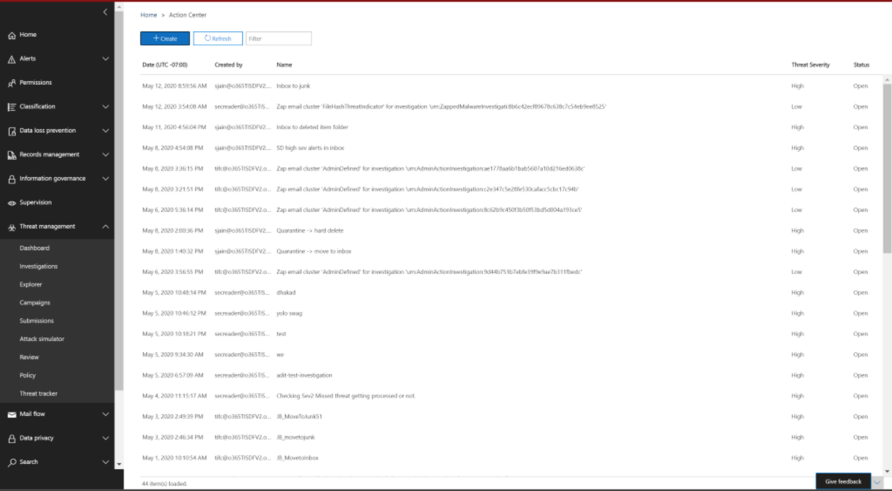

# Исправление вредоносной электронной почты, доставленной в Office 365Remediate malicious email delivered in Office 365

[!INCLUDE [Microsoft 365 Defender rebranding](../includes/microsoft-defender-for-office.md)]

**Область применения****Applies to**
- [Microsoft Defender для Office 365 (план 2)Microsoft Defender for Office 365 plan 2](defender-for-office-365.md)

Исправление означает принятие предписанных действий против угрозы.Remediation means taking a prescribed action against a threat. Вредоносные сообщения электронной почты, отправленные в организацию, могут быть очищены системой, с помощью автоматической очистки нулевого часа (ZAP), или группами безопасности с помощью действий по исправлению, таких как переход в почтовый *ящик,* переход к нежелательной *,* перейти к удаленным элементов,  *мягкое* удаление или жесткое удаление *.*Malicious email sent to your organization can be cleaned up either by the system, through zero-hour auto purge (ZAP), or by security teams through remediation actions like *move to inbox*, *move to junk*, *move to deleted items*, *soft delete*, or *hard delete*. Microsoft Defender для Office 365 Plan 2/E5 позволяет группам безопасности устранять угрозы в функциях электронной почты и совместной работы с помощью ручного и автоматического расследования.Microsoft Defender for Office 365 Plan 2/E5 enables security teams to remediate threats in email and collaboration functionality through manual and automated investigation.

> [!NOTE]
> Чтобы устранять вредоносные сообщения электронной почты, группам безопасности требуется назначенная им роль *Поиска* и Очистки.To remediate malicious email, security teams need the *Search and Purge* role assigned to them. Назначение ролей делается с [помощью разрешений на Microsoft 365 Defender портале](permissions-microsoft-365-security-center.md).Role assignment is done through [permissions in the Microsoft 365 Defender portal](permissions-microsoft-365-security-center.md).

## Что нужно знать перед началом работыWhat you need to know before you begin

Администраторы могут принимать необходимые меры для сообщений электронной почты,  но для утверждения этих действий  им должна быть назначена роль Поиска и очистки в разрешении на совместное использование & электронной почты на Microsoft 365 Defender портале.Admins can take required action on emails, but to get those actions approved, they must have the *Search and Purge* role assigned to them in the **Email & collaboration** permissions in the Microsoft 365 Defender portal. Без *роли "Поиск* и очистка", добавленной в одну из групп ролей, они не смогут выполнить действие.Without the *Search and purge"* role added to one of the role-groups, they won't be able to execute the action.

## Ручное и автоматическое исправлениеManual and automated remediation

*Ручная охота* происходит, когда группы безопасности определяют угрозы вручную с помощью возможностей поиска и фильтрации в Explorer.*Manual hunting* occurs when security teams identify threats manually by using the search and filtering capabilities in Explorer. Ручное исправление электронной почты может быть вызвано с помощью любого представления электронной почты *(вредоносные* *программы,* фишинг или все сообщения *электронной* почты) после определения набора сообщений электронной почты, которые необходимо устранять.Manual email remediation can be triggered through any email view (*Malware*, *Phish*, or *All email*) after you identify a set of emails that need to be remediated.

> [!div class="mx-imgBorder"]
> 

Группы безопасности могут использовать Explorer для выбора электронных писем несколькими способами:Security teams can use Explorer to select emails in several ways:

- Выберите электронные письма вручную: используйте фильтры в различных представлениях.Choose emails by hand: Use filters in various views. Выберите до 100 сообщений электронной почты для устранения последствий.Select up to 100 emails to remediate.

- Выбор запросов. Выберите весь запрос, используя верхнюю **кнопку выберите все.**Query selection: Select an entire query by using the top **select all** button. Этот же запрос также отображается в сведениях о отправке почты центра действий.The same query is also shown in action center mail submission details.

- Выбор запросов с исключением. Иногда группам операций безопасности может потребоваться исправление сообщений электронной почты, выбрав весь запрос и исключив определенные сообщения из запроса вручную.Query selection with exclusion: Sometimes security operations teams may want to remediate emails by selecting an entire query and excluding certain emails from the query manually. Для этого администратор может использовать поле **Выбор** всех проверок и прокручивать вниз, чтобы вручную исключить сообщения электронной почты.To do so, an admin can use the **Select all** check box and scroll down to exclude emails manually. В запросе может быть не более 1000 сообщений электронной почты.The query can hold a maximum of 1,000 emails. Максимальное число исключений — 100.The maximum number of exclusions is 100.

После выбора электронной почты через Explorer можно приступить к исправлению путем принятия прямых действий или очереди в очереди на действия:Once emails are selected through Explorer, you can start remediation by taking direct action or by queuing up emails for an action:

- Прямое утверждение. Когда действия, такие как переход в почтовый  *ящик,* переход к нежелательной *почте,* переход к удаленным пунктам, мягкое удаление или жесткое удаление, выбираются сотрудниками службы безопасности, которые имеют соответствующие разрешения, а затем выполняются следующие действия по исправлению, процесс восстановления начинает выполнять выбранное действие. Direct approval: When actions like *move to inbox*, *move to junk*, *move to deleted items*, *soft delete*, or *hard delete* are selected by security personnel who have appropriate permissions, and the next steps in remediation are followed, the remediation process begins to execute the selected action. Временное вылет показывает исправление в процессе.A temporary flyout shows remediation in progress.

- Двухшаговая утверждение. Действие "добавление к исправлению" может быть принято администраторами, у которых нет соответствующих разрешений или которым необходимо дождаться выполнения действия.Two-step approval: An "add to remediation" action can be taken by admins who don't have appropriate permissions or who need to wait to execute the action. В этом случае целевые сообщения электронной почты добавляются в контейнер для восстановления.In this case, the targeted emails are added to a remediation container. Утверждение необходимо до выполнения исправлений.Approval is needed before the remediation is executed.

**Автоматические действия по** расследованию и реагированию вызываются оповещением или группами операций безопасности из Explorer.**Automated investigation and response** actions are triggered by alerts or by security operations teams from Explorer. Они могут включать рекомендуемые действия по исправлению, которые должны быть утверждены командой операций безопасности.These may include recommended remediation actions that must be approved by a security operations team. Эти действия включены на вкладке **Action** в автоматическом расследовании.These actions are included on the **Action** tab in the automated investigation.

> [!div class="mx-imgBorder"]
> 

Все действия по исправлению (либо прямое утверждение, либо двухшаговая проверка), созданные в Explorer, а также утвержденные действия, созданные в результате автоматических расследований, отображаются в Центре действий.All remediations (either direct approval or two-step approval) that were created in Explorer as well as approved actions coming from automated investigations are displayed in the Action Center. Доступ к ним через левую панель навигации в **центре** \> **действий review.**Access these via the left navigation panel under **Review** \> **Action Center**.

> [!div class="mx-imgBorder"]
> 

Центр действий показывает все действия по исправлению за последние 30 дней.Action Center shows all remediation actions for the past 30 days. Действия, принятые через Explorer, перечислены по имени, которое группа операций безопасности предоставила при работе с исправлением.Actions taken through Explorer are listed by the name that the security operations team provided when the remediation was created. Действия, предпринятые с помощью автоматических расследований, имеют заголовки, которые начинаются с связанного оповещения, которое вызвало расследование, например "Кластер электронной почты Zap...".Actions taken through automated investigations have titles that begin with the related alert that triggered the investigation, such as "Zap email cluster... ."

Откройте любой элемент восстановления, чтобы просмотреть сведения о нем, включая его имя, дату создания, описание, серьезность угрозы и состояние.Open any remediation item to view details about it, including its name, creation date, description, threat severity, and status. В нем также показаны следующие две вкладки.It also shows the following two tabs.

- **Вкладка** отправки почты: отображает количество сообщений электронной почты, отправленных с помощью обозревателя угроз или автоматических расследований, которые необходимо устранять.**Mail submission** tab: Displays the number of emails submitted through Threat Explorer or automated investigations to be remediated. Эти сообщения могут быть действий или не действий.These emails can be actionable or not actionable.

  > [!div class="mx-imgBorder"]
  > 

  - **Actionable:** Сообщения электронной почты в следующих расположениях облачных почтовых ящиков можно использовать и перемещать:**Actionable**: Emails in the following cloud mailbox locations can be acted on and moved:
    - Inbox;Inbox
    - НежелательноеJunk
    - Удалена папкаDeleted folder
    - Папка с мягким удалениемSoft-deleted folder

      > [!NOTE]
      > В настоящее время только пользователь с доступом к почтовому ящику может восстановить элементы из папки с мягким удалением.Currently, only a user with access to the mailbox can recover items from a soft-deleted folder.

  - **Не может быть** действий: сообщения электронной почты в следующих расположениях не могут быть отдействовать или перемещены в действиях по исправлению:**Not actionable**: Emails in the following locations can't be acted on or moved in remediation actions:
    - КарантинQuarantine
    - Папка с жесткой удаляемой папкойHard-deleted folder
    - Локальное или внешнееOn-premises/external
    - Failed/droppedFailed/dropped

  Подозрительные сообщения классифицируются как исправленные или неремедиализные.Suspicious messages are categorized as either remediable or nonremediable. В большинстве случаев исправление и непоправимые сообщения совмещают общие сообщения, отправленные.In most cases, remediable and nonremediable messages combine equals total messages submitted. Но в редких случаях это может быть не так.But in rare cases this may not be true. Это может произойти из-за системных задержек, периодов времени или просроченных сообщений.This can happen because of system delays, timeouts, or expired messages. Срок действия сообщений истекает в зависимости от периода хранения Explorer для организации.Messages expire based on the Explorer retention period for your organization.

  Если после периода хранения Explorer в организации не будут исправлены старые сообщения, рекомендуется повторно повторить исправление элементов, если вы видите несоответствия номеров.Unless you're remediating old messages after your organization's Explorer retention period, it's advisable to retry remediating items if you see number inconsistencies. Для системных задержек обновления исправлений обычно обновляются в течение нескольких часов.For system delays, remediation updates are typically refreshed within a few hours.

  Если период хранения электронной почты вашей организации в Explorer составляет 30 дней, а вы устраняете сообщения, возвращаясь через 29-30 дней, количество отправлений почты может не всегда складываться.If your organization's retention period for email in Explorer is 30 days and you're remediating emails going back 29-30 days, mail submission counts may not always add up. Сообщения электронной почты, возможно, уже начали выдвигаться из периода хранения.The emails might have started moving out of the retention period already.

  Если исправление на некоторое время застряло в состоянии "В процессе", это, скорее всего, связано с задержками системы.If remediations are stuck in the "In progress" state for a while, it's likely due to system delays. Исправление может занять до нескольких часов.It could take up to a few hours to remediate. Вы можете увидеть изменения в подсчетах отправки почты, так как некоторые сообщения электронной почты, возможно, не были включены в запрос в начале восстановления из-за системных задержек.You might see variations in mail submission counts, as some of the emails may not have been included the query at the start of remediation due to system delays. В таких случаях необходимо повторить исправление.It is a good idea to retry remediating in such cases.

  > [!NOTE]
  > Для наилучших результатов исправление должно быть сделано пакетами в 50 000 или меньше.For best results, remediation should be done in batches of 50,000 or fewer.

  При исправлении действуют только исправленные сообщения электронной почты.Only remediable emails are acted on during remediation. Неотвечаемая электронная почта не может быть исправлена Office 365 электронной почты, так как они не хранятся в облачных почтовых ящиках.Nonremediable emails can't be remediated by the Office 365 email system, as they aren't stored in cloud mailboxes.

  Администраторы могут принимать меры по электронной почте в карантине, если это необходимо, но эти сообщения истекают из карантина, если они не будут вручную проглинены.Admins can take actions on emails in quarantine if necessary, but those emails will expire out of quarantine if they're not manually purged. Сообщения электронной почты, на карантин из-за вредоносного контента, недоступны пользователям, поэтому сотрудникам службы безопасности не нужно принимать никаких действий, чтобы избавиться от угроз в карантине.Emails quarantined because of malicious content aren't accessible by users, so security personnel don't have to take any action to get rid of threats in quarantine. Если сообщения электронной почты являются локальной или внешней, можно связаться с пользователем для устранения подозрительной электронной почты.If the emails are on-premises or external, the user can be contacted to address the suspicious email. Или администраторы могут использовать отдельные средства электронной почты или средства безопасности для удаления.Or the admins can use separate email server/security tools for removal. Эти сообщения можно определить, применяя расположение доставки *=* внешний фильтр на предварительном основе в Explorer.These emails can be identified by applying the *delivery location = on-prem* external filter in Explorer. В случае сбоя или сбоя электронной почты или недоступной пользователями электронной почты не будет никакого сообщения, которое можно было бы смягчить, так как эти сообщения не доходят до почтового ящика.For failed or dropped email, or email not accessible by users, there won't be any email to mitigate, since these mails don't reach the mailbox.

  На следующем изображении показано, как выглядит отправка в Центре действий.The following image shows how a submission looks in Action Center. Исправление может содержать несколько представлений.A remediation can contain multiple submissions. Если несколько действий получают одобрение с помощью одного автоматизированного расследования, каждое действие кластера электронной почты или электронной почты отображается в том же исправлении, что и другая отправка.If multiple actions get approved through one automated investigation, each email or email cluster action appears in the same remediation as a different submission.

  > [!div class="mx-imgBorder"]
  > 

  Выберите элемент отправки почты, чтобы показать сведения о том, что исправление, например запрос (когда исправление запускается с помощью автоматических расследований или Обозреватель путем выбора запроса) и время начала и окончания исправлений.Select a mail submission item to show the details of that remediation, such as the query (when remediation is triggered through automated investigations or Explorer through selecting a query) and the start and end times of remediation. Он также отображает список сообщений, отправленных на исправление.It also displays a list of messages that were submitted for remediation. По мере перемещения сообщений из периода хранения Explorer эти сообщения исчезают из этого списка.As messages move out of the Explorer retention period, the messages disappear from this list. В списке также показаны отдельные сообщения, которые исправлены.The list also shows individual messages that are remediable.

- **Журналы** действий. На этой вкладке показаны исправленные сообщения, в том числе утвержденная дата, администратор, утвердивший действие, действие, состояние и количество.**Action logs**: This tab shows the messages remediated, including approved date, admin who approved the action, action, status, and counts.

  Состояние может быть:Status can be:

  - **Начало:** срабатывает исправление.**Started**: Remediation is triggered.
    - **Очереди.** Исправление в очереди для смягчения последствий сообщений электронной почты.**Queued**: Remediation is queued up for mitigation of emails.
    - **В процессе.** Продолжается смягчение последствий.**In progress**: Mitigation is in progress.
    - **Завершено:** устранение всех исправлений сообщений электронной почты, успешно завершенных или с некоторыми сбоями.**Completed**: Mitigation on all remediable emails either completed successfully or with some failures.
    - **Failed:** Никакие исправлений не были успешными.**Failed**: No remediations were successful.

  Поскольку можно использовать только исправленные сообщения электронной почты, очистка каждой электронной почты отображается как успешная или неудачная.As only remediable emails can be acted on, each email's cleanup is shown as successful or failed. Из общего количества исправлений сообщений электронной почты сообщается об успешных и неудачных устранениях.From the total remediable emails, successful and failed mitigations are reported.

  - **Успех:** было выполнено необходимое действие по исправлению сообщений электронной почты.**Success**: The desired action on remediable emails was accomplished. Например: администратор хочет удалить сообщения электронной почты из почтовых ящиков, поэтому администратор принимает меры по мягкому удалению электронных сообщений.For example: An admin wants to remove emails from mailboxes, so the admin takes the action of soft-deleting emails. Если исправление электронной почты не найдено в исходной папке после принятия решения, состояние будет показываться как успешное.If a remediable email isn't found in the original folder after the action is taken, the status will show as successful.

  - **Сбой.** Желаемое действие по исправлению сообщений электронной почты не удалось.**Failure**: The desired action on remediable emails failed. Например: администратор хочет удалить сообщения электронной почты из почтовых ящиков, поэтому администратор принимает меры по мягкому удалению электронных сообщений.For example: An admin wants to remove emails from mailboxes, so the admin takes the action of soft-deleting emails. Если исправление электронной почты по-прежнему находится в почтовом ящике после принятия решения, состояние будет показываться как неудалось.If a remediable email is still found in the mailbox after the action is taken, status will show as failed.
  
  - **Уже в пункте** назначения. Необходимое действие уже было принято по электронной почте или электронной почте, уже существовав в пункте назначения.**Already in destination**: The desired action was already taken on the email OR the email already existed in the destination location. Например: сообщение электронной почты было удалено администратором через Explorer в первый день.For example: An email was soft deleted by the admin through Explorer on day one. Затем аналогичные сообщения электронной почты покажут на 2-й день, которые снова являются мягкими, удаленными администратором. При выборе этих электронных писем администратор в итоге выбирает некоторые электронные сообщения с первого дня, которые уже удалены.Then similar emails show up on day 2, which are again soft deleted by the admin. While selecting these emails, admin ends up picking some emails from day one that are already soft deleted. Теперь эти сообщения не будут действовать снова, они будут просто показываться как "уже в пункте назначения", так как никаких действий по ним не было принято, так как они существовали в месте назначения.Now these emails will not be acted upon again, they will just show as "already in destination", since no action was taken on them as they existed in the destination location.

  Выберите любой элемент в журнале действий, чтобы отобразить сведения о исправлении.Select any item in the action log to display remediation details. Если сведения говорят "успешно" или "не найдено в почтовом ящике", этот элемент уже был удален из почтового ящика.If the details say "successful" or "not found in mailbox," that item was already removed from the mailbox. Иногда при исправлении имеется системная ошибка.Sometimes there's a systemic error during remediation. В таких случаях лучше повторить исправление.In those cases, it's a good idea to retry remediation.

  В случае устранения больших пакетов можно также экспортировать сообщения, отправленные для устранения, через отправку почты и сообщения, исправленные с помощью журналов действий.In case of remediating large batches, you can also export the messages send for remediation via Mail Submission and messages that got remediated via Action Logs. Ограничение экспорта увеличивается до 100 тыс. записей.The export limit is increased to 100k records.

Группа безопасности может принимать до 50 одновременно исправлений вручную; однако для автоматических действий по расследованию и реагированию не установлено никаких ограничений.Security team can take up to 50 concurrent manual remediations; however, there is no limit set for automated investigation and response actions.

  Исправление является мощным средством для смягчения угроз и устранения подозрительных сообщений электронной почты.Remediation is a powerful tool to mitigate threats and address suspicious emails. Это помогает обеспечить безопасность организации.It helps keep an organization secure.
