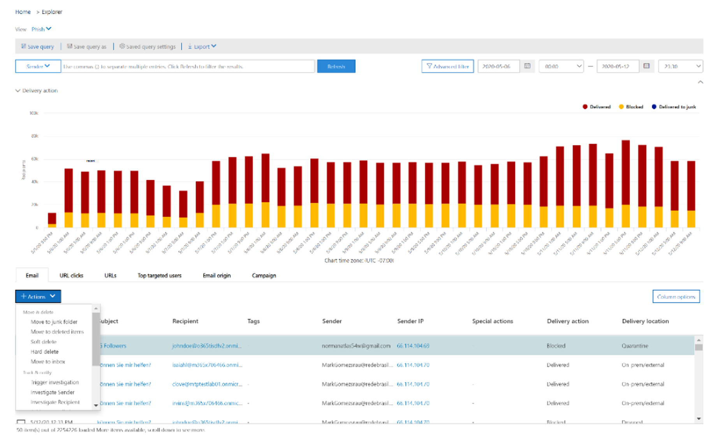

# Исправление вредоносной электронной почты, доставленной в Office 365Remediate malicious email delivered in Office 365

[!INCLUDE [Microsoft 365 Defender rebranding](../includes/microsoft-defender-for-office.md)]

Исправление означает принятие предписанного действия против угрозы.Remediation means taking a prescribed action against a threat. Вредоносные сообщения, отправленные в организацию, могут быть очищены системой с помощью автоматической очистки (ZAP) или группами безопасности с помощью действий по исправлению, таких как перемещение в почтовый *ящик,* перемещение в нежелательные *сообщения,* перемещение в удаленные *элементы,* мягкое удаление или неустра».. Malicious email sent to your organization can be cleaned up either by the system, through zero-hour auto purge (ZAP), or by security teams through remediation actions like *move to inbox*, *move to junk*, *move to deleted items*, *soft delete*, or *hard delete*. Microsoft Defender для Office 365 P2/E5 позволяет группам безопасности устранять угрозы в электронной почте и функциях совместной работы с помощью ручного и автоматизированного исследования.Microsoft Defender for Office 365 P2/E5 enables security teams to remediate threats in email and collaboration functionality through manual and automated investigation.

> [!NOTE]
> Чтобы устранять вредоносные сообщения электронной почты, группам безопасности необходима назначенная им роль поиска и очистки. To remediate malicious email, security teams need the *search and purge* role assigned to them. Назначение ролей можно выполнять с помощью разрешений в Центре безопасности и соответствия требованиям.Role assignment is done through permissions in the security and compliance center.

## Что нужно знать перед началом работыWhat you need to know before you begin

Администраторы могут делать необходимые действия с электронной почтой, но  для утверждения этих действий им  должна быть назначена роль поиска и очистки с помощью разрешений Центра безопасности & соответствия \> требованиям.Admins can take required action on emails, but to get those actions approved, they must have the *search and purge* role assigned to them via **Security & Compliance Center** \> **Permissions**. Без роли поиска и очистки, добавленной в одну из групп ролей, они не смогут выполнить действие.Without the "search and purge" role added to one of the role-groups, they won't be able to execute the action.

## Ручное и автоматическое исправлениеManual and automated remediation

*Поиск вручную* происходит, когда группы безопасности определяют угрозы вручную с помощью возможностей поиска и фильтрации в обозревателе угроз.*Manual hunting* occurs when security teams identify threats manually by using the search and filtering capabilities in Threat Explorer. Исправление электронной почты вручную может быть инициировано в любом представлении электронной почты *(вредоносные* *программы,* фишинг или все сообщения *электронной* почты) после определения набора сообщений электронной почты, которые необходимо исправление.Manual email remediation can be triggered through any email view (*Malware*, *Phish*, or *All email*) after you identify a set of emails that need to be remediated.

> [!div class="mx-imgBorder"]
> 

Группы безопасности могут использовать обозреватель угроз для выбора сообщений электронной почты несколькими способами:Security teams can use Threat Explorer to select emails in several ways:

- Выбор сообщений электронной почты вручную: используйте фильтры в различных представлениях.Choose emails by hand: Use filters in various views. Выберите до 100 сообщений электронной почты для устранения.Select up to 100 emails to remediate.

- Выбор запроса: выберите весь запрос с помощью верхней **кнопки "Выбрать все".**Query selection: Select an entire query by using the top **select all** button. Этот же запрос также отображается в сведениях об отправке почты в центре обработки почты.The same query is also shown in action center mail submission details.

- Выбор запроса с исключением: иногда группам операций безопасности может потребоваться исправление сообщений электронной почты путем выбора всего запроса и исключения определенных сообщений из запроса вручную.Query selection with exclusion: Sometimes security operations teams may want to remediate emails by selecting an entire query and excluding certain emails from the query manually. Для этого администратор может использовать  этот контрольный список и прокрутить вниз, чтобы исключить сообщения вручную.To do so, an admin can use the **Select all** check box and scroll down to exclude emails manually. В запросе может быть не более 1000 сообщений электронной почты.The query can hold a maximum of 1,000 emails. Максимальное число исключений — 100.The maximum number of exclusions is 100.

После выбора сообщений электронной почты с помощью обозревателя угроз вы можете начать исправление путем прямого действия или с помощью очереди сообщений электронной почты для действия:Once emails are selected through Threat Explorer, you can start remediation by taking direct action or by queuing up emails for an action:

- Прямое утверждение: когда сотрудники службы безопасности, которые имеют соответствующие разрешения,  выбирают такие действия, как перемещение в "Входящие", перемещение в нежелательные сообщения, перемещение в удаленные *элементы,* мягкое удаление или необращение удаления. После выполнения следующих действий по исправлению начинается выполнение выбранного действия.  Direct approval: When actions like *move to inbox*, *move to junk*, *move to deleted items*, *soft delete*, or *hard delete* are selected by security personnel who have appropriate permissions, and the next steps in remediation are followed, the remediation process begins to execute the selected action. Временный flyout показывает, что идет исправление.A temporary flyout shows remediation in progress.

- Двухшаговую процедуру утверждения: действие "Добавить в исправление" может выполняться администраторами, у которых нет соответствующих разрешений или которым нужно дождаться выполнения действия.Two-step approval: An "add to remediation" action can be taken by admins who don't have appropriate permissions or who need to wait to execute the action. В этом случае целевые сообщения электронной почты добавляются в контейнер исправлений.In this case, the targeted emails are added to a remediation container. Для выполнения исправлений требуется утверждение.Approval is needed before the remediation is executed.

**Автоматические действия по расследованию** угроз и реагированию запускаются оповещениями или группами операций безопасности из обозревателя угроз.**Automated investigation and response** actions are triggered by alerts or by security operations teams from Threat Explorer. К ним могут относится рекомендуемые действия по исправлению, которые должны быть утверждены командой операций безопасности.These may include recommended remediation actions that must be approved by a security operations team. Эти действия включены на вкладке **"Действие"** в автоматизированном расследовании.These actions are included on the **Action** tab in the automated investigation.

> [!div class="mx-imgBorder"]
> 

Все исправление (прямое утверждение или двухшаговая проверка), созданные в обозревателе угроз, а также утвержденные действия, принятые в результате автоматизированных расследований, отображаются в Центре действий.All remediations (either direct approval or two-step approval) that were created in Threat Explorer as well as approved actions coming from automated investigations are displayed in the Action Center. Доступ к ним можно получить с помощью левой панели навигации в **центре** \> **обработки отзывов.**Access these via the left navigation panel under **Review** \> **Action Center**.

> [!div class="mx-imgBorder"]
> 

Центр действий отображает все действия по исправлению за последние 30 дней.Action Center shows all remediation actions for the past 30 days. Действия, предпринятые с помощью обозревателя угроз, перечислены по имени, которое группа операций безопасности предоставила при его устранении.Actions taken through Threat Explorer are listed by the name that the security operations team provided when the remediation was created. Действия, предпринятые автоматическим исследованием, имеют названия, которые начинаются с связанного оповещения, которое вызвало исследование, например "Zap email cluster... ."Actions taken through automated investigations have titles that begin with the related alert that triggered the investigation, such as "Zap email cluster... ."

Откройте любой элемент устранения, чтобы просмотреть сведения о нем, включая его имя, дату создания, описание, серьезность угрозы и состояние.Open any remediation item to view details about it, including its name, creation date, description, threat severity, and status. Здесь также показаны две следующие вкладки.It also shows the following two tabs.

- **Вкладка отправки** почты: отображает количество сообщений электронной почты, отправленных с помощью обозревателя угроз или автоматизированных расследований для устранения.**Mail submission** tab: Displays the number of emails submitted through Threat Explorer or automated investigations to be remediated. Эти сообщения электронной почты могут быть действиями или недоступны.These emails can be actionable or not actionable.

  > [!div class="mx-imgBorder"]
  > 

  - **Actionable**: сообщения электронной почты в следующих расположениях облачных почтовых ящиков можно использовать и перемещать:**Actionable**: Emails in the following cloud mailbox locations can be acted on and moved:
    - Inbox;Inbox
    - НежелательноеJunk
    - Удалена папкаDeleted folder
    - Папка с мягким удалениемSoft-deleted folder

      > [!NOTE]
      > В настоящее время только пользователь с доступом к почтовому ящику может восстановить элементы из папки с возможностью восстановления.Currently, only a user with access to the mailbox can recover items from a soft-deleted folder.

  - **Не может быть actionable**: сообщения электронной почты в следующих расположениях не могут действовать или перемещены в действиях по исправлению:**Not actionable**: Emails in the following locations can't be acted on or moved in remediation actions:
    - КарантинQuarantine
    - Неутвердимая папкаHard-deleted folder
    - Локальное/внешнееOn-premises/external
    - Failed/droppedFailed/dropped

  Подозрительные сообщения классифицируются как исправленные или нереализованные.Suspicious messages are categorized as either remediable or nonremediable. В большинстве случаев исправление и неуправляемая отправка сообщений равна общему объему отправленных сообщений.In most cases, remediable and nonremediable messages combine equals total messages submitted. Но в редких случаях это может быть не так.But in rare cases this may not be true. Это может произойти из-за системных задержек, истечения времени действия или просроченных сообщений.This can happen because of system delays, timeouts, or expired messages. Срок действия сообщений зависит от периода хранения обозревателя угроз в организации.Messages expire based on the Threat Explorer retention period for your organization.

  Если вы не устраняли старые сообщения после периода хранения обозревателя угроз организации, рекомендуется повторить попытку устранения элементов, если вы видите несоответствия номеров.Unless you're remediating old messages after your organization's Threat Explorer retention period, it's advisable to retry remediating items if you see number inconsistencies. Для системных задержек обновления исправлений обычно обновляются в течение нескольких часов.For system delays, remediation updates are typically refreshed within a few hours.

  Если срок хранения электронной почты организации в обозревателе угроз составляет 30 дней, а вы устраняли сообщения электронной почты в течение 29-30 дней, количество отправленных сообщений не всегда добавляется.If your organization's retention period for email in Threat Explorer is 30 days and you're remediating emails going back 29-30 days, mail submission counts may not always add up. Сообщения электронной почты уже могли выйти из периода хранения.The emails might have started moving out of the retention period already.

  Если исправление некоторое время не работает, скорее всего, это вызвано задержками системы.If remediations are stuck in the "In progress" state for a while, it's likely due to system delays. Исправление может занять до нескольких часов.It could take up to a few hours to remediate. Вы можете увидеть варианты в подсчете отправленных почты, так как некоторые сообщения электронной почты могли не быть включены в запрос в начале исправлений из-за системных задержек.You might see variations in mail submission counts, as some of the emails may not have been included the query at the start of remediation due to system delays. В таких случаях стоит повторить попытку устранения.It is a good idea to retry remediating in such cases.

  > [!NOTE]
  > Для наилучших результатов исправление должно быть исправлено пакетами не более 50 000.For best results, remediation should be done in batches of 50,000 or fewer.

  Во время устранения будут действовать только исправленные сообщения электронной почты.Only remediable emails are acted on during remediation. Неотвратимые сообщения электронной почты не могут быть исправлены почтовой системой Office 365, так как они не хранятся в облачных почтовых ящиках.Nonremediable emails can't be remediated by the Office 365 email system, as they aren't stored in cloud mailboxes.

  Администраторы могут при необходимости принимать меры в отношении сообщений электронной почты в карантине, но срок их действия истечет, если они не будут стерены вручную.Admins can take actions on emails in quarantine if necessary, but those emails will expire out of quarantine if they're not manually purged. Сообщения электронной почты, отправленные на карантин из-за вредоносного содержимого, недоступны пользователям, поэтому сотрудникам службы безопасности не нужно ничего делать, чтобы избавиться от угроз в карантине.Emails quarantined because of malicious content aren't accessible by users, so security personnel don't have to take any action to get rid of threats in quarantine. Если сообщения электронной почты находятся в локальной или внешней сети, к пользователю можно обратиться для обращения к подозрительному сообщению электронной почты.If the emails are on-premises or external, the user can be contacted to address the suspicious email. Администраторы также могут использовать отдельные почтовые серверы или средства безопасности для удаления.Or the admins can use separate email server/security tools for removal. Эти сообщения электронной почты можно определить, применив расположение доставки *= внешний* фильтр на месте в обозревателе угроз.These emails can be identified by applying the *delivery location = on-prem* external filter in Threat Explorer. При сбое или отброшенной электронной почте или о том, что пользователи не могут получить доступ к электронной почте, вам не удастся устранить эту проблему, так как эти сообщения не будут доступны в почтовом ящике.For failed or dropped email, or email not accessible by users, there won't be any email to mitigate, since these mails don't reach the mailbox.

  На следующем рисунке показано, как выглядит отправка в Центре действий.The following image shows how a submission looks in Action Center. Исправление может содержать несколько от отправленных сообщений.A remediation can contain multiple submissions. Если несколько действий утверждены с помощью одного автоматизированного исследования, каждое действие почтового ящика или кластера электронной почты отображается в том же исправлении, что и другая отправка.If multiple actions get approved through one automated investigation, each email or email cluster action appears in the same remediation as a different submission.

  > [!div class="mx-imgBorder"]
  > 

  Выберите элемент отправки почты, чтобы показать сведения об исправлении, например запрос (когда исправление инициирует автоматизированное исследование или обозреватель угроз путем выбора запроса), а также время начала и окончания исправлений.Select a mail submission item to show the details of that remediation, such as the query (when remediation is triggered through automated investigations or Threat Explorer through selecting a query) and the start and end times of remediation. Здесь также отображается список сообщений, отправленных на исправление.It also displays a list of messages that were submitted for remediation. По мере перемещения сообщений из периода хранения обозревателя угроз сообщения исчезают из этого списка.As messages move out of the Threat Explorer retention period, the messages disappear from this list. В списке также показаны отдельные сообщения, которые можно устранять.The list also shows individual messages that are remediable.

- **Журналы действий:** на этой вкладке показаны сообщения, которые были исправлены, включая дату утверждения, администратора, который утверждает действие, действие, состояние и количество.**Action logs**: This tab shows the messages remediated, including approved date, admin who approved the action, action, status, and counts.

  Состояние может быть:Status can be:

  - **Started**: Remediation is triggered.**Started**: Remediation is triggered.
  - **В очереди:** исправление в очереди для устранения последствий сообщений электронной почты.**Queued**: Remediation is queued up for mitigation of emails.
  - **В настоящее** время: идет процесс умиления.**In progress**: Mitigation is in progress.
  - **Completed**: Mitigation on all remediable emails either completed successfully or with some failures.**Completed**: Mitigation on all remediable emails either completed successfully or with some failures.
  - **Failed**: No remediations were successful.**Failed**: No remediations were successful.

  Так как можно облагодить только сообщения электронной почты, очистка каждого сообщения отображается как успешная или неудачная.As only remediable emails can be acted on, each email's cleanup is shown as successful or failed. По общему исправлению сообщений электронной почты сообщается об успешном и неудачных устранении.From the total remediable emails, successful and failed mitigations are reported.

  - **Успех:** выполнено нужное действие по исправлению сообщений электронной почты.**Success**: The desired action on remediable emails was accomplished. Например: администратор хочет удалить сообщения электронной почты из почтовых ящиков, поэтому он будет делать это.For example: An admin wants to remove emails from mailboxes, so the admin takes the action of soft-deleting emails. Если исправление сообщения электронной почты не будет найдено в исходной папке после того, как действие будет отправлено, состояние будет успешным.If a remediable email isn't found in the original folder after the action is taken, the status will show as successful.

  - **Failure**: The desired action on remediable emails failed.**Failure**: The desired action on remediable emails failed. Например: администратор хочет удалить сообщения электронной почты из почтовых ящиков, поэтому он будет делать это.For example: An admin wants to remove emails from mailboxes, so the admin takes the action of soft-deleting emails. Если исправление сообщения электронной почты по-прежнему будет найдено в почтовом ящике после того, как действие будет отправлено, состояние будет отсветено.If a remediable email is still found in the mailbox after the action is taken, status will show as failed.

  Выберите любой элемент в журнале действий, чтобы отобразить сведения об исправлении.Select any item in the action log to display remediation details. Если в сведениях говорится "успешно" или "не найдено в почтовом ящике", этот элемент уже был удален из почтового ящика.If the details say "successful" or "not found in mailbox," that item was already removed from the mailbox. Иногда при исправлении имеется системная ошибка.Sometimes there's a systemic error during remediation. В таких случаях лучше повторить попытку устранения.In those cases, it's a good idea to retry remediation.

  В случае устранения больших пакетов вы также можете экспортировать сообщения, отправляемые для устранения, с помощью отправки почты и сообщений, которые были исправлены с помощью журналов действий.In case of remediating large batches, you can also export the messages send for remediation via Mail Submission and messages which got remediated via Action Logs. Ограничение на экспорт увеличено до 100 000 записей.The export limit is increased to 100k records.

  Исправление — это мощное средство для устранения угроз и устранения подозрительных сообщений электронной почты.Remediation is a powerful tool to mitigate threats and address suspicious emails. Это помогает обеспечить безопасность организации.It helps keep an organization secure.
