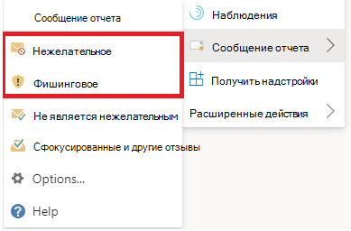
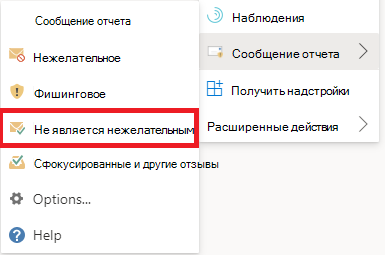

# Отчеты о ложных срабатываниях и ложных отрицаниях в Outlook

[!INCLUDE [Microsoft 365 Defender rebranding](../includes/microsoft-defender-for-office.md)]

**Область применения**
- [Exchange Online Protection](exchange-online-protection-overview.md)
- [Microsoft Defender для Office 365 (план 1 и план 2)](defender-for-office-365.md)
- [Microsoft 365 Defender](../defender/microsoft-365-defender.md)

> [!NOTE]
> Если вы администратор в Microsoft 365 с Exchange Online почтовыми ящиками, рекомендуем использовать портал Отправки в Центре & соответствия требованиям. Дополнительные сведения см. в материале Использование отправки администратора для отправки в Корпорацию Майкрософт подозрительных [спама, фишинга, URL-адресов и файлов.](admin-submission.md)

В Microsoft 365 организациях с почтовыми ящиками в Exchange Online или на локальном почтовом ящике с помощью гибридной современной проверки подлинности можно отправить ложные срабатывания (хорошая электронная почта, которая была заблокирована или отправлена нежелательной папке) и ложные негативы (нежелательная электронная почта или фишинг, доставленные в почтовый ящик) в Exchange Online Protection (EOP).

## Что нужно знать перед началом работы

- Для наилучшего использования пользовательской отправки используйте надстройку Report Message или надстройку Report Phishing.

- Обратите внимание, что эта надстройка работает Outlook на всех платформах: в Интернете, iOS, Android и Desktop.

- Если вы администратор в организации с Exchange Online почтовыми ящиками, используйте портал Отправки в Центре & безопасности. Дополнительные сведения см. в материале Использование отправки администратора для отправки в Корпорацию Майкрософт подозрительных [спама, фишинга, URL-адресов и файлов.](admin-submission.md)

- Вы можете настроить отправку сообщений непосредственно в Корпорацию Майкрософт, в почтовый ящик, который вы указываете, или оба. Дополнительные сведения см. [в материале Политики отправки пользователей.](user-submission.md)

- Дополнительные сведения о том, как получить и включить надстройки Report Message или Report Phishing, см. в этой ссылке: Включить сообщение отчета или надстройки [для фишинга отчетов.](enable-the-report-message-add-in.md)

- Дополнительные сведения об отчетах о сообщениях в Корпорации Майкрософт см. в материалах [Report messages and files to Microsoft.](report-junk-email-messages-to-microsoft.md)

## Использование функции сообщения отчета

### Сообщение о нежелательных и фишинговых сообщениях

Для сообщений в папке "Входящие" или любой другой папки электронной почты, кроме нежелательной почты, используйте следующий метод для сообщения о нежелательной почте и фишинговых сообщениях:

1. Щелкните **эллипсы** Больше действий в правом верхнем углу выбранного сообщения, щелкните сообщение **Отчет** из выпадаемого меню, а затем выберите **нежелательное** или **фишинговое** сообщение.

   > [!div class="mx-imgBorder"]
   > 

   > [!div class="mx-imgBorder"]
   > 

2. Выбранные сообщения будут отправлены в Корпорацию Майкрософт для анализа и:

   - Перемещается в папку нежелательной почты, если сообщение о ней сообщается как спам.

   - Удаляется, если оно было отчитано как фишинг.

### Сообщения, которые не являются нежелательными

1. Щелкните **эллипсы** Больше действий в правом верхнем углу выбранного сообщения, щелкните сообщение **Отчет** из выпадаемого меню, а затем нажмите **кнопку Не нежелательной**.

   > [!div class="mx-imgBorder"]
   > 

   > [!div class="mx-imgBorder"]
   > 

2. Выбранное сообщение будет отправлено в Корпорацию Майкрософт для анализа и перемещено в папку "Входящие" или любую другую указанную папку.

## Просмотр и просмотр сообщений, о чем сообщалось

Чтобы просмотреть сообщения, которые пользователи сообщают в Корпорацию Майкрософт, у вас есть такие параметры:

- Используйте портал Отправки администратора. Дополнительные сведения см. в [материале Просмотр пользовательских представлений в Microsoft.](admin-submission.md#view-user-submissions-to-microsoft)

- Создайте правило потока почты (также известное как правило транспорта) для отправки копий сообщений. Инструкции см. в инструкции Использование правил потока [почты, чтобы узнать, какие пользователи сообщают в Корпорацию Майкрософт.](/exchange/security-and-compliance/mail-flow-rules/use-rules-to-see-what-users-are-reporting-to-microsoft)
