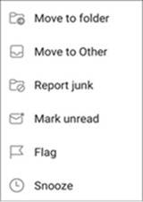

# Отправка нежелательных и фишинговых сообщений электронной почты в Outlook для iOS и Android в Exchange OnlineReport junk and phishing email in Outlook for iOS and Android in Exchange Online

[!INCLUDE [Microsoft 365 Defender rebranding](../includes/microsoft-defender-for-office.md)]

В организациях Microsoft 365 с почтовыми ящиками в Exchange Online или локальных почтовых ящиков с помощью [гибридной современной проверки подлинности](https://docs.microsoft.com/microsoft-365/enterprise/hybrid-modern-auth-overview)можно использовать встроенные параметры отчетов в Outlook для iOS и Android для отправки ложных срабатываний (хороший адрес электронной почты, помеченный как спам), ложные отрицательные (недопустимые сообщения электронной почты) и фишинговые сообщения для Exchange Online ProtectionIn Microsoft 365 organizations with mailboxes in Exchange Online or on-premises mailboxes using [hybrid modern authentication](https://docs.microsoft.com/microsoft-365/enterprise/hybrid-modern-auth-overview), you can use the built-in reporting options in Outlook for iOS and Android to submit false positives (good email marked as spam), false negatives (bad email allowed), and phishing messages to Exchange Online Protection (EOP).

## Что нужно знать перед началом работыWhat do you need to know before you begin

- Если вы являетесь администратором в Организации с почтовыми ящиками Exchange Online, рекомендуем использовать портал отправки в центре безопасности & соответствия требованиям.If you're an admin in an organization with Exchange Online mailboxes, we recommend that you use the Submissions portal in the Security & Compliance Center. Дополнительные сведения см. в [статье Использование отправки администратором для отправки подозреваемой спама, фишинга, URL-адресов и файлов в корпорацию Майкрософт](admin-submission.md).For more information, see [Use Admin Submission to submit suspected spam, phish, URLs, and files to Microsoft](admin-submission.md).

- Можно настроить копирование или перенаправление сообщений, отправленных в указанный почтовый ящик.You can configure reported messages to be copied or redirected to a mailbox that you specify. Для получения дополнительных сведений обратитесь к разделу [политики отправки пользователей](user-submission.md).For more information, see [User Submissions policies](user-submission.md).

- Дополнительные сведения о сообщениях отчетов в корпорацию Майкрософт можно найти [в статье сообщения и файлы отчетов в корпорацию Майкрософт](report-junk-email-messages-to-microsoft.md).For more information about reporting messages to Microsoft, see [Report messages and files to Microsoft](report-junk-email-messages-to-microsoft.md).

  > [!NOTE]
  > Если в политике отправки пользователей отключена поддержка отчетов о нежелательной почте, Нежелательная почта или фишинговые сообщения перемещаются в папку "Нежелательная почта", а не сообщаются администратору или корпорации Майкрософт.If junk email reporting is disabled for Outlook in the user submission policy, junk or phishing messages will be moved to the Junk folder and not reported to your admin or Microsoft.

## Составление отчетов о нежелательной почте и фишинговых сообщениях в Outlook для iOS и AndroidReport spam and phishing messages in Outlook for iOS and Android

Для сообщений в папке "Входящие" или любой другой папке, кроме нежелательной почты, выполните следующие действия, чтобы сообщить о нежелательной почте и мошеннических сообщениях для iOS и Android:For messages in the Inbox, or any other email folder except Junk Email, use the following steps to report spam and phishing messages for iOS and Android:

1. Выберите одно или несколько сообщений.Select one or more messages.
2. В правом верхнем углу коснитесь трех точек по вертикали.In the top-right corner tap on the three vertical dots. Откроется меню Action (действие).The action menu opens.

   

3. Коснитесь **отчета Нежелательная почта** , а затем выберите **нежелательные** или **Фишинг**.Tap **Report junk** and then select **Junk** or **Phishing**.

   

4. В появившемся диалоговом окне можно выбрать пункт **отчет** или **нет**.In the dialog that appears, you can choose **Report** or **No Thanks**. При выборе **нет** , если вы нажали **нежелательную** почту, сообщение перемещается в папку "Нежелательная почта", если вы нажали **поддельное** сообщение перемещается в папку "Удаленные".On selecting **No Thanks** , if you tapped **Junk** the message moves to the Junk Email folder, if you tapped **Phishing** the message moves to the Deleted Items folder. Выберите **отчет** , чтобы отправить копию сообщения в корпорацию Майкрософт.Select **Report** to also send a copy of the message to Microsoft.

   

Если вы передумали, нажмите кнопку **отменить** в появившемся всплывающем уведомлении.If you change your mind, select **Undo** on the toast notification that appears. Сообщение остается в папке "Входящие".The message remains in the Inbox folder.

## Отправка сообщений о сообщениях, не являющихся нежелательными, из папки "спам" в Outlook для iOS и AndroidReport non-spam messages from the Junk folder in Outlook for iOS and Android

В папке нежелательной почты выполните следующие действия, чтобы сообщить о ложных срабатываниях:In the Junk folder, use the following steps to report spam false positives:

1. Выберите одно или несколько сообщений.Select one or more messages.
2. В правом верхнем углу коснитесь трех точек по вертикали.In the top-right corner tap on the three vertical dots. Откроется меню Action (действие).The action menu opens.

   

3. Коснитесь, а **не Нежелательная почта**.Tap **Not junk**.

Появится всплывающее уведомление о том, что сообщение перемещено в папку "Входящие".A toast notification appears that the email has moved to your Inbox. Если вы передумали, нажмите кнопку **отменить** в уведомлении.If you change your mind, select **Undo** on the toast notification. Сообщение электронной почты остается в папке "Нежелательная почта".The email remains in the Junk folder.
