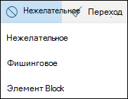
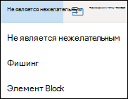

# <a name="report-junk-and-phishing-email-in-outlook-on-the-web-in-exchange-online"></a>Отправка нежелательных и фишинговых сообщений электронной почты в Outlook в Интернете в Exchange Online

В организациях Microsoft 365 с почтовыми ящиками в Exchange Online вы можете использовать встроенные параметры отчетов в Outlook в Интернете (прежнее название — Outlook Web App) для отправки ложных срабатываний (хороший адрес электронной почты отмечен как спам), ложные отрицательные (недопустимые сообщения электронной почты) и фишинговых сообщений в Exchange Online Protection (EOP).

## <a name="what-do-you-need-to-know-before-you-begin"></a>Что нужно знать перед началом работы

- Если вы являетесь администратором в Организации с почтовыми ящиками Exchange Online, рекомендуем использовать портал отправки в центре безопасности & соответствия требованиям. Дополнительные сведения см. в [статье Использование отправки администратором для отправки подозреваемой спама, фишинга, URL-адресов и файлов в корпорацию Майкрософт](admin-submission.md).

- Администраторы могут отключить или разрешить пользователям сообщать о сообщениях в корпорацию Майкрософт в Outlook в Интернете. Дополнительные сведения см. в разделе [Отключение или Включение отчетов о нежелательной почте в Outlook в Интернете](#disable-or-enable-junk-email-reporting-in-outlook-on-the-web) далее в этом разделе.

- Можно настроить копирование или перенаправление сообщений, отправленных в указанный почтовый ящик. Дополнительные сведения см. [в статье определение почтового ящика для отправленных пользователем сообщений о нежелательной почте и фишинговых сообщениях в Exchange Online](user-submission.md).

- Дополнительные сведения о сообщениях отчетов в корпорацию Майкрософт можно найти [в статье сообщения и файлы отчетов в корпорацию Майкрософт](report-junk-email-messages-to-microsoft.md).

## <a name="report-spam-and-phishing-messages-in-outlook-on-the-web"></a>Составление отчетов о нежелательной почте и фишинговых сообщениях в Outlook в Интернете

1. Для сообщений в папке "Входящие" или любой другой папке, кроме нежелательной почты, используйте один из следующих способов для создания отчетов о нежелательной почте и фишинговых сообщениях.

   - Выберите сообщение, нажмите кнопку **Нежелательная почта** на панели инструментов, а затем выберите **нежелательные** или **Фишинг**.

     

   - Выберите одно или несколько сообщений, щелкните правой кнопкой мыши и выберите **Пометить как нежелательное**.

2. В появившемся диалоговом окне нажмите **отчет**. Если вы передумали, щелкните **не сообщать**.

   

   

3. Выбранные сообщения будут отправлены в корпорацию Майкрософт для анализа. Чтобы убедиться, что сообщения отправлены, откройте папку **Отправленные** и просмотрите отправленные сообщения.

## <a name="report-non-spam-and-phishing-messages-from-the-junk-email-folder-in-outlook-on-the-web"></a>Отправка сообщений о сообщениях о нежелательной почте и фишинге из папки "Нежелательная почта" в Outlook в Интернете

1. В папке нежелательной почты используйте один из следующих способов, чтобы сообщить о ложных срабатываниях или фишинговых сообщениях.

   - Выберите сообщение, щелкните **не спам** на панели инструментов, а затем выберите **не спам** или **Фишинг**.

     

   - Выберите одно или несколько сообщений, щелкните правой кнопкой мыши и выберите пункт **Пометить как не являющееся нежелательным**.

2. В появившемся диалоговом окне прочитайте сведения и щелкните **отчет**. Если вы передумали, щелкните **не сообщать**.

   

   

3. Выбранные сообщения будут отправлены в корпорацию Майкрософт для анализа. Чтобы убедиться, что сообщения отправлены, откройте папку **Отправленные** и просмотрите отправленные сообщения.

## <a name="disable-or-enable-junk-email-reporting-in-outlook-on-the-web"></a>Отключение и Включение отчетов о нежелательной почте в Outlook в Интернете

По умолчанию пользователи могут сообщать о ложных срабатываниях нежелательной почты, ложных негативных и фишинговых сообщениях в корпорацию Майкрософт для анализа в Outlook в Интернете. Администраторы могут настроить Outlook в политиках веб-почтовых ящиков в Exchange Online PowerShell, чтобы запретить пользователям сообщать о ложных срабатываниях и нежелательных сообщениях в корпорацию Майкрософт. Невозможно отключить возможность пользователей сообщать о phishing-сообщениях в корпорацию Майкрософт.

### <a name="what-do-you-need-to-know-before-you-begin"></a>Что нужно знать перед началом работы

- Сведения о том, как подключиться к Exchange Online PowerShell, см. в статье [Подключение к Exchange Online PowerShell](https://docs.microsoft.com/powershell/exchange/connect-to-exchange-online-powershell).

- Чтобы вы могли выполнить эти процедуры, вам должны быть назначены соответствующие разрешения. В частности, потребуются роли **получателей** или роли **получателей почты** в Exchange Online, которые назначаются группам ролей " **Управление организацией** " и " **Управление получателями** " по умолчанию. Дополнительные сведения о группах ролей в Exchange Online можно узнать в статье [изменение групп ролей в Exchange Online](https://docs.microsoft.com/Exchange/permissions-exo/role-groups#modify-role-groups).

- Каждая организация имеет политику по умолчанию с именем OwaMailboxPolicy по умолчанию, но вы можете создавать настраиваемые политики. Настраиваемые политики применяются к пользователям с ограниченной областью действия перед политикой по умолчанию. Для получения дополнительных сведений о политиках почтовых ящиков Outlook в Интернете просмотрите [политики почтовых ящиков Outlook в Exchange Online](https://docs.microsoft.com/Exchange/clients-and-mobile-in-exchange-online/outlook-on-the-web/outlook-web-app-mailbox-policies).

- Отключение отчетов о нежелательной почте не удаляет возможность пометить сообщение как нежелательное или не являющееся нежелательным в Outlook в Интернете. При выборе сообщения в папке "Нежелательная почта", если щелкнуть **не спам** , \> **Not junk** все равно перемещает сообщение обратно в папку "Входящие". При выборе сообщения в любой другой папке электронной почты и **нажатии кнопки нежелательные** \> **Junk** сообщения все равно перемещаются в папку "Нежелательная почта". Сведения о том, что больше недоступно — возможность отправки сообщения в корпорацию Майкрософт.

### <a name="use-exchange-online-powershell-to-disable-or-enable-junk-email-reporting-in-outlook-on-the-web"></a>Отключение и Включение отчетов о нежелательной почте в Outlook в Интернете с помощью Exchange Online PowerShell

1. Чтобы найти существующие политики почтовых ящиков Outlook в Интернете и состояние отчетов о нежелательной почте, выполните следующую команду:

   ```powershell
   Get-OwaMailboxPolicy | Format-Table Name,ReportJunkEmailEnabled
   ```

2. Чтобы включить или отключить отчеты о нежелательной почте в Outlook в Интернете, используйте следующий синтаксис:

   ```powershell
   Set-OwaMailboxPolicy -Identity "<OWAMailboxPolicyName>" -ReportJunkEmailEnabled <$true | $false>
   ```

   В этом примере отключается создание отчетов о нежелательной почте в политике по умолчанию.

   ```powershell
   Set-OwaMailboxPolicy -Identity "OwaMailboxPolicy-Default" -ReportJunkEmailEnabled $false
   ```

   В этом примере включается создание отчетов о нежелательной почте в пользовательской политике с именем Contoso Managers.

   ```powershell
   Set-OwaMailboxPolicy -Identity "Contoso Managers" -ReportJunkEmailEnabled $true
   ```

Подробные сведения о синтаксисе и параметрах можно найти в статье [Get – OwaMailboxPolicy](https://docs.microsoft.com/powershell/module/exchange/get-owamailboxpolicy) и [Set/OwaMailboxPolicy](https://docs.microsoft.com/powershell/module/exchange/set-owamailboxpolicy).

### <a name="how-do-you-know-this-worked"></a>Как убедиться, что все получилось?

Чтобы убедиться, что вы успешно включили или отключили отчеты о нежелательной почте в Outlook в Интернете, выполните одно из указанных ниже действий.

- В Exchange Online PowerShell выполните следующую команду и проверьте значение свойства **репортжункемаиленаблед** :

  ```powershell
  Get-OwaMailboxPolicy | Format-Table Name,ReportJunkEmailEnabled
  ```

- Откройте почтовый ящик затронутого пользователя в Outlook в Интернете, выберите сообщение в папке "Входящие", **щелкните Нежелательная** \> **почта** и убедитесь, что сообщение не отображается в поле сообщить корпорации Майкрософт или не отображается.<sup>\*</sup>

- Откройте почтовый ящик затронутого пользователя в Outlook в Интернете, выберите сообщение в папке "Нежелательная почта" **, щелкните Нежелательная почта** \> **Junk** и убедитесь, что сообщение не отображается в поле сообщить корпорации Майкрософт.<sup>\*</sup>

<sup>\*</sup>Пользователи могут скрыть приглашение, чтобы отправить отчет о сообщении, не отменяя сообщение. Чтобы проверить этот параметр в Outlook в Интернете, выполните указанные ниже действия.

1. Щелкните **Параметры**  \> **Просмотреть все** \> **нежелательные сообщения**в параметрах Outlook.
2. В разделе **отчеты** проверьте значение: **спрашивать меня перед отправкой отчета**.

   
