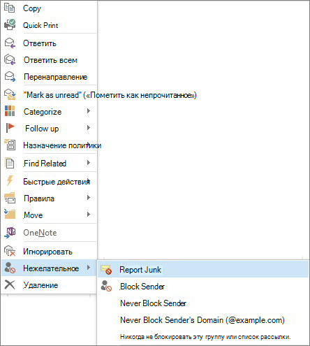

# Отправка отчетов о нежелательных сообщениях корпорации МайкрософтReport junk email messages to Microsoft

Надстройка сообщения о нежелательной почте корпорации Майкрософт для Microsoft Office Outlook предоставляет несколько способов отправки отчетов о сообщениях нежелательной почты.The Microsoft Junk Email Reporting Add-in for Microsoft Office Outlook offers several ways for you to report junk email messages:

- Из ленты OutlookFrom the Outlook ribbon

- Из папки "Входящие"From your Inbox

- Из открытого сообщения электронной почтыFrom within an opened email message

Надстройка сообщения о нежелательной почте позволяет отправлять отчеты службе Microsoft Exchange Online Protection (EOP).The Junk Email Reporting Add-in helps you submit reports to the Microsoft Exchange Online Protection (EOP) service. Если ваш почтовый ящик не защищен этой службой, отправка вами отчетов о нежелательной почте не повлияет на ваши фильтры нежелательной почты.If your mailbox is not protected by the service, your junk email report submission will not affect your spam filters. Администраторы могут узнать больше о параметрах нежелательной почты, которые применяются ко всей Организации, [чтобы предотвратить пометку хороших сообщений электронной почты в качестве спама в office 365](prevent-email-from-being-marked-as-spam.md) или [как уменьшить количество нежелательных сообщений в Office 365](reduce-spam-email.md).Administrators can learn about more spam settings that apply to a whole organization at [How to prevent good email from being marked as spam in Office 365](prevent-email-from-being-marked-as-spam.md) or [How to reduce spam email in Office 365](reduce-spam-email.md). Эти статьи пригодятся вам, если у вас есть права уровня администратора и вы хотите предотвратить ложные положительные и отрицательные срабатывания.These are helpful if you have administrator-level control and you want to prevent false positives or false negatives.

> [!TIP]
> Вы также можете отправлять нежелательные сообщения непосредственно в корпорацию Майкрософт, используя адрес электронной почты [Junk@office365.microsoft.com](mailto:junk@office365.microsoft.com) и ложные положительные сообщения (Нежелательная почта), используя адрес электронной почты [not_junk@office365.microsoft.com](mailto:not_junk@office365.microsoft.com) .You can also submit spam messages directly to Microsoft by using the [junk@office365.microsoft.com](mailto:junk@office365.microsoft.com) email address, and false positive (non-spam) messages by using the [not_junk@office365.microsoft.com](mailto:not_junk@office365.microsoft.com) email address. Дополнительные сведения о том, [как отправлять сообщения о нежелательной почте и мошеннических сообщениях в корпорацию Майкрософт для анализа](submit-spam-non-spam-and-phishing-scam-messages-to-microsoft-for-analysis.md).For more information, see [Submit spam, non-spam, and phishing scam messages to Microsoft for analysis](submit-spam-non-spam-and-phishing-scam-messages-to-microsoft-for-analysis.md).

### Отправка отчетов о нежелательных сообщениях электронной почты из OutlookTo report junk email messages from Outlook

[Использование надстройки "сообщение отчета"Use the Report Message add-in](https://support.office.com/article/b5caa9f1-cdf3-4443-af8c-ff724ea719d2)

### Отправка отчетов о сообщениях нежелательной почты из папки "Входящие"To report junk email messages from your Inbox

1. Щелкните правой кнопкой мыши сообщения, которые вы считаете нежелательной почтой.Right-click the message or messages that you want to report as junk.

2. Выберите **Нежелательная почта**, а затем нажмите кнопку **Сообщить о нежелательной почте**.Select **Junk** and then click **Report Junk**.
    

3. Откроется диалоговое окно **Надстройка сообщения о нежелательной почте Майкрософт**.The **Microsoft Junk E-mail Reporting Add-in** dialog box opens. Чтобы подтвердить отправку сообщений, отмеченных как нежелательная почта, нажмите кнопку **Да**.If you're sure that you want to submit the messages you selected as junk, click **Yes**.
    

    > [!NOTE]
    > Если вы не хотите, чтобы при отправке сообщений нежелательной почты отображалось подтверждение, установите флажок **Больше не показывать это сообщение**.If you don't want to receive this confirmation message when submitting junk messages, check **Do not show this message again**.

Выбранные сообщения будут перемещены в папку нежелательной почты и отправлены в корпорацию Майкрософт для анализа. Чтобы убедиться, что сообщения отправлены, откройте папку **Отправленные** и просмотрите отправленные сообщения.The selected messages will be sent to Microsoft for analysis and moved to the Junk Email folder. To confirm that the messages have been submitted, open your **Sent Items** folder to view the submitted messages.

### Отправка отчета о сообщении нежелательной почты из открытого сообщенияTo report a junk email message from within an opened message

1. В открытом сообщении на ленте сообщения нажмите кнопку **Сообщить о нежелательной почте**.From within an opened message, click the **Report Junk** button on the message ribbon. Например **, выберите** \> \*\*\*\* For example, click **Junk** \> **Report Junk** 

2. Откроется диалоговое окно **Надстройка сообщения о нежелательной почте Майкрософт**.The **Microsoft Junk E-mail Reporting Add-in** dialog box opens. Чтобы подтвердить отправку сообщения, отмеченного как нежелательная почта, нажмите кнопку **Да**.If you're sure that you want to submit the message you selected as junk, click **Yes**.
    

    > [!NOTE]
    > Если вы не хотите, чтобы при отправке сообщений нежелательной почты отображалось подтверждение, установите флажок **Больше не показывать это сообщение**.If you don't want to receive this confirmation message when submitting junk messages, check **Do not show this message again**.

Выбранное сообщение будет перемещено в папку нежелательной почты и отправлено в корпорацию Майкрософт для анализа. Чтобы убедиться, что сообщение отправлено, откройте папку **Отправленные** и просмотрите отправленное сообщение.The selected message will be sent to Microsoft for analysis and moved to the Junk Email folder. To confirm that the message has been submitted, open your **Sent Items** folder to view the submitted message.

## Дополнительные сведенияFor more information

[Включение надстройки Report MessageEnable the Report Message add-in](enable-the-report-message-add-in.md)

[Сведения об устранении неполадок и поддержкеTroubleshooting and support information](troubleshooting-and-support-information.md)

[Как не допустить, чтобы настоящая почта помечалась как спам в Office 365How to prevent good email from being marked as spam in Office 365](prevent-email-from-being-marked-as-spam.md)

[Как уменьшить количество нежелательных сообщений в Office 365How to reduce spam email in Office 365](reduce-spam-email.md)
