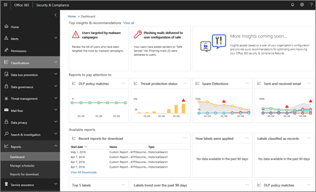

# Интеллектуальные отчеты и аналитика в Центре безопасности и соответствия требованиям

[!INCLUDE [Microsoft 365 Defender rebranding](../includes/microsoft-defender-for-office.md)]

**Область применения**
- [Exchange Online Protection](exchange-online-protection-overview.md)
- [Microsoft Defender для Office 365 (план 1 и план 2)](defender-for-office-365.md)
- [Microsoft 365 Defender](../defender/microsoft-365-defender.md)

Если вы входите в команду Microsoft для организации 365 для группы безопасности бизнеса и имеете необходимые разрешения, назначенные в Центре соответствия требованиям безопасности [&,](permissions-in-the-security-and-compliance-center.md)вы можете получить доступ к различным отчетам, включая интеллектуальные отчеты и сведения. Ознакомьтесь с этой статьей, чтобы ознакомиться с этими отчетами и сведениями, а также узнать больше о конкретных отчетах.

## Обзор интеллектуальных отчетов и анализов

Возможности мониторинга, доступные в Центре & безопасности, включают интеллектуальные отчеты и сведения, которые позволяют администраторам соответствия требованиям и безопасности сосредоточиться на приоритетных проблемах, например атаках на безопасность или повышенной подозрительной активности. На панели мониторинга интеллектуальные отчеты и сведения напоминают следующее изображение:

В дополнение к выделению проблемных областей интеллектуальные отчеты и сведения включают рекомендации и ссылки для просмотра и изучения данных, а также быстрые действия. Например, если в организации внезапно большое количество сообщений электронной почты помечено как спам конечными пользователями, вам может быть рекомендовано пересмотреть свои политики защиты от нежелательной почты, чтобы обеспечить правильный уровень защиты.

## Типы отчетов в Центре & соответствия требованиям

Широкий спектр отчетов доступен в Центре обеспечения & соответствия требованиям. (Перейдите к **отчетам** \> **Панель** мониторинга, чтобы получить представление все вверх.) В следующей таблице перечислены доступные отчеты со ссылками, чтобы узнать больше:

 

****

|Тип сведений|Как туда попасть|Где можно узнать больше|
|---|---|---|
|**Отчеты центра & безопасности** (все вверх) 
 Главные сведения и рекомендации, а также ссылки на отчеты по & безопасности, включая отчеты о предотвращении потери данных, метки, отчеты о безопасности электронной почты, отчеты Defender для Office 365 и другие|В Центре & безопасности перейдите к панели **мониторинга** \> **отчетов**||
|**Защита от потери данных** 
 События обнаружения, ложного срабатывания и переопределения политики защиты от потери данных, а также ссылки на средства создания и изменения политик.|В Центре & безопасности перейдите к политике предотвращения **потери** \> **данных**|[Просмотр отчетов о защите от потери данных](../../compliance/view-the-dlp-reports.md)|
|**Управление данными** 
 Сведения о том, как применяются метки, о метках, классифицированных как записи, тенденциях меток и т. д.|В Центре & безопасности перейдите на панель **мониторинга управления** \> **информацией**|[Просмотр отчетов об управлении данными](../../compliance/view-the-data-governance-reports.md)|
|**Панель мониторинга управления угрозами** (это также называется панелью мониторинга безопасности) 
 Обнаружение угроз, тенденции вредоносных программ, целевые пользователи, сведения об отправленных и полученных сообщениях электронной почты и другие|В Центре & безопасности перейдите на панель **мониторинга управления** \> **угрозами**|[Просмотр отчетов для Defender для Office 365](view-reports-for-mdo.md)|
|**Обнаружение обозревателя** угроз (также именуемого Explorer) или обнаружения **в режиме реального времени** 
 Подозрительные вредоносные программы, обнаруженные в электронной почте и файлах в Microsoft 365|В Центре & безопасности перейдите к **обозревателю управления** угрозами или обнаружениям в \>  **режиме реального времени**  |[отчет обозревателя угроз (или обнаружение в режиме реального времени)](threat-explorer.md);|
|**Defender для Office 365 и отчетов о безопасности электронной почты** 
 Отчеты о безопасности и защите от угроз электронной почты (включая вредоносные программы, спам, фишинг и спуфинг)|В Центре & безопасности перейдите к панели **мониторинга** \> **отчетов**|[Просмотр отчетов для Defender для Office 365](view-reports-for-mdo.md) 
 [Просмотр отчетов о безопасности почты в Центре безопасности и соответствия требованиям](view-email-security-reports.md)|
|**Поток обработки почты** 
 Сведения об отправленных и полученных электронных письмах, недавних оповещениях, пользователях, которые отправили и получили больше всех писем, отчеты о переадресации почты и т. д.|В Центре & безопасности перейдите  к панели мониторинга потока почты \>  и панели **мониторинга** \> **отчетов**|[Аналитика потока обработки почты в Центре безопасности и соответствия требованиям](mail-flow-insights-v2.md) 
 [Просмотр отчетов о потоке почты в центре & безопасности](view-mail-flow-reports.md)|
|**Соответствие требованиям GDPR** 
 Сведения о соответствии GDPR, включая ссылки на субъекты данных, тенденции метки и активные & закрытых дел|В Центре & безопасности перейдите к  панели мониторинга \> **GDPR конфиденциальности данных**|[Обзор общего регламента по защите данных](/compliance/regulatory/gdpr)|
|**Журнал аудита** 
 Сведения о действиях в Microsoft 365, о пользователях, файлах и папках и т. д.|В Центре & безопасности перейдите к **поиску** & журнала \> **аудита расследований**|[Поиск в журнале аудита в Центре безопасности и соответствия требованиям](../../compliance/search-the-audit-log-in-security-and-compliance.md)|
|**Отчеты о соответствии требованиям** 
 Отчеты FedRAMP, отчеты об управлении, отчеты о рисках и соответствии, отчеты ISO об управлении информационной безопасностью, отчеты об аудите и оценке средств контроля обслуживающей организации.|В Центре & безопасности перейдите в **отчеты** о соответствии требованиям \> **службы**|[Планирование соответствия требованиям & безопасности в Office 365](../../compliance/plan-for-security-and-compliance.md)|
|

## Статьи по теме

[Мониторинг и просмотр отчетов на портале Microsoft 365 Defender](../defender/overview-security-center.md)

[Защита от угроз в Office 365](protect-against-threats.md)