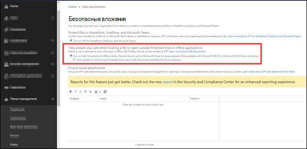

# <a name="safe-documents-in-microsoft-365-e5"></a>Безопасные документы в Microsoft 365 E5

[!INCLUDE [Microsoft 365 Defender rebranding](../includes/microsoft-defender-for-office.md)]

**Область применения**
- [Microsoft Defender для Office 365 (план 2)](office-365-atp.md)
- [Microsoft 365 Defender](../mtp/microsoft-threat-protection.md)

Безопасные документы — это функция в Microsoft 365 E5 или Microsoft 365 E5 Security, которая использует [Microsoft Defender для](/windows/security/threat-protection/microsoft-defender-atp/microsoft-defender-advanced-threat-protection) конечной точки для сканирования документов и файлов, открытых в защищенной точке [зрения.](https://support.microsoft.com/office/d6f09ac7-e6b9-4495-8e43-2bbcdbcb6653)

## <a name="what-do-you-need-to-know-before-you-begin"></a>Что нужно знать перед началом работы

- Безопасные документы доступны только пользователям с лицензиями *microsoft 365 E5* или *Microsoft 365 E5 Security.* Эти лицензии не включены в планы Microsoft Defender для Office 365.

- Безопасные документы поддерживаются в Microsoft 365 Apps для предприятия (ранее известная как Office 365 ProPlus) версии 2004 или более поздней версии.

- Откройте Центр безопасности и соответствия требованиям на сайте <https://protection.office.com>. Чтобы перейти непосредственно на страницу БЕЗОПАСНЫЕ вложения **ATP,** откройте <https://protection.office.com/safeattachmentv2> .

- Сведения о том, как подключиться к Exchange Online PowerShell, см. в статье [Подключение к Exchange Online PowerShell](/powershell/exchange/connect-to-exchange-online-powershell).

- Для выполнения процедур, описанных в этой статье, вам должны быть назначены разрешения в **Exchange Online**:
  - Чтобы настроить параметры "Безопасные документы", необходимо быть членом группы ролей **"Управление** организацией" или **"Администратор** безопасности".
  - Для доступа только для чтения к настройкам безопасных документов необходимо быть членом групп ролей **Global Reader** или **Security Reader.**

  Дополнительные сведения см. в статье [Разрешения в Exchange Online](/exchange/permissions-exo/permissions-exo).

  > [!NOTE]
  >
  > - Добавление пользователей в соответствующую роль Azure Active Directory в Центре безопасности Microsoft 365 предоставляет пользователям необходимые разрешения _и_ разрешения для других функций в Microsoft 365. Дополнительные сведения см. в статье [О ролях администраторов](../../admin/add-users/about-admin-roles.md).
  >
  > - Группа ролей **Управление организацией с правами только на просмотр** в [Exchange Online](/Exchange/permissions-exo/permissions-exo#role-groups) также предоставляет доступ только для чтения к этой функции.

### <a name="how-does-microsoft-handle-your-data"></a>Как Корпорация Майкрософт обрабатывает ваши данные?

Чтобы защититься, safe Documents отправляет файлы в [облако Microsoft Defender для конечной](/windows/security/threat-protection/microsoft-defender-atp/microsoft-defender-advanced-threat-protection) точки для анализа. Сведения о том, как Microsoft Defender для конечной точки обрабатывает данные, можно найти здесь: Microsoft Defender для хранения и конфиденциальности данных [конечных точек.](/windows/security/threat-protection/microsoft-defender-atp/data-storage-privacy)

Файлы, отправленные безопасными документами, не сохраняются в Defender после времени, необходимого для анализа (как правило, менее 24 часов).

## <a name="use-the-security--compliance-center-to-configure-safe-documents"></a>Используйте Центр & безопасности для настройки безопасных документов

1. В Центре обеспечения & безопасности перейдите к политике управления угрозами  \>  \> **ATP Safe Attachments,** а затем щелкните **глобальные параметры.**

2. В **глобальных параметрах** вылет, который появляется, настройте следующие параметры:

   - **Включим безопасные** документы для клиентов Office: переместите переключеть вправо, чтобы включить функцию:  Включить.

   - **Разрешить** пользователям щелкнуть защищенный просмотр, даже если "Безопасные документы" идентифицируют файл как вредоносный. Рекомендуется оставить этот параметр отключенным (оставьте переключенку слева: отключите). 

   По завершении нажмите кнопку **Сохранить**.

   

### <a name="use-exchange-online-powershell-to-configure-safe-documents"></a>Использование Exchange Online PowerShell для настройки безопасных документов

Используйте следующий синтаксис:

```powershell
Set-AtpPolicyForO365 -EnableSafeDocs <$true | $false> -AllowSafeDocsOpen <$true | $false>
```

- Параметр _EnableSafeDocs_ включает или отключает безопасные документы для всей организации.
- Параметр _AllowSafeDocsOpen_ позволяет пользователям покидать защищенный вид (т. е. открывать документ), если документ был идентифицирован как вредоносный.

В этом примере можно включить безопасные документы для всей организации и запретить пользователям открывать документы, которые были идентифицированы как вредоносные из защищенного представления.

```powershell
Set-AtpPolicyForO365 -EnableSafeDocs $true -AllowSafeDocsOpen $false
```

Подробные сведения о синтаксисах и параметрах см. в [инструкции Set-AtpPolicyForO365.](/powershell/module/exchange/set-atppolicyforo365)

### <a name="how-do-i-know-this-worked"></a>Как проверить, что это работает?

Чтобы убедиться, что вы включили и настроили безопасные документы, сделайте все следующие действия:

- В Центре обеспечения & безопасности перейдите к политике управления угрозами ATP Safe  \>  \> **Attachments,**   щелкните Глобальные параметры и убедитесь, что включите безопасные документы для клиентов **Office** и разрешите пользователям щелкнуть защищенный просмотр, даже если "Безопасные документы" идентифицируют файл как вредоносные параметры.

- Запустите следующую команду в Exchange Online PowerShell и проверьте значения свойств:

  ```powershell
  Get-AtpPolicyForO365 | Format-List *SafeDocs*
  ```

- Следующие файлы доступны для тестирования защиты безопасных документов. Эти документы похожи на файл EICAR.TXT для тестирования решений по борьбе с вредоносными программами и антивирусами. Файлы не являются вредными, но они будут запускать защиту безопасных документов.

  - [SafeDocsDemo.docx](https://github.com/MicrosoftDocs/microsoft-365-docs/raw/public/microsoft-365/downloads/SafeDocsDemo.docx)
  - [SafeDocsDemo.pptx](https://github.com/MicrosoftDocs/microsoft-365-docs/raw/public/microsoft-365/downloads/SafeDocsDemo.pptx)
  - [SafeDocsDemo.xlsx](https://github.com/MicrosoftDocs/microsoft-365-docs/raw/public/microsoft-365/downloads/SafeDocsDemo.xlsx)