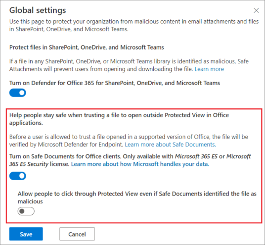

# <a name="safe-documents-in-microsoft-365-e5"></a>Безопасные документы в Microsoft 365 E5

[!INCLUDE [Microsoft 365 Defender rebranding](../includes/microsoft-defender-for-office.md)]

**Область применения**
- [Microsoft 365 Defender](../defender/microsoft-365-defender.md)

Сейф Документы — это функция в Microsoft 365 E5 или Безопасность Microsoft 365 E5, которая использует [Microsoft Defender](/windows/security/threat-protection/microsoft-defender-atp/microsoft-defender-advanced-threat-protection) для конечной точки [](https://support.microsoft.com/office/d6f09ac7-e6b9-4495-8e43-2bbcdbcb6653) для сканирования документов и файлов, открытых в защищенных представлениях или в службе безопасности приложений [для Office](https://support.microsoft.com/topic/9e0fb9c2-ffad-43bf-8ba3-78f785fdba46).

## <a name="what-do-you-need-to-know-before-you-begin"></a>Что нужно знать перед началом работы

- Сейф Документы доступны только пользователям  с Microsoft 365 E5 *или Безопасность Microsoft 365 E5* лицензиями. Эти лицензии не включены в Microsoft Defender для Office 365 планов.

- Сейф Документы поддерживаются в Приложения Microsoft 365 для предприятий версии 2004 Office 365 профессиональный плюс версии 2004 или более поздней версии.

- Чтобы открыть портал Microsoft 365 Defender, перейдите на сайт <https://security.microsoft.com>. Чтобы перейти непосредственно **на страницу Сейф вложения,** используйте <https://security.microsoft.com/safeattachmentv2> .

- Сведения о том, как подключиться к Exchange Online PowerShell, см. в статье [Подключение к Exchange Online PowerShell](/powershell/exchange/connect-to-exchange-online-powershell).

- Вам нужны разрешения в **Exchange Online,** прежде чем вы сможете сделать процедуры в этой статье:
  - Чтобы настроить Сейф документов, необходимо быть членом групп ролей **администратора** организации или **администратора** безопасности.
  - Для доступа только для чтения Сейф параметров документов необходимо быть членом групп ролей **Global Reader** или **Security Reader.**

  Дополнительные сведения см. в статье [Разрешения в Exchange Online](/exchange/permissions-exo/permissions-exo).

  > [!NOTE]
  >
  > - Добавление пользователей в соответствующую роль Azure Active Directory в Центре безопасности Microsoft 365 предоставляет пользователям необходимые разрешения _и_ разрешения для других функций в Microsoft 365. Дополнительные сведения см. в статье [О ролях администраторов](../../admin/add-users/about-admin-roles.md).
  >
  > - Группа ролей **Управление организацией с правами только на просмотр** в [Exchange Online](/Exchange/permissions-exo/permissions-exo#role-groups) также предоставляет доступ только для чтения к этой функции.

### <a name="how-does-microsoft-handle-your-data"></a>Как Корпорация Майкрософт обрабатывает ваши данные?

Чтобы защититься, Сейф документы отправляют файлы в [облако Microsoft Defender для конечных](/windows/security/threat-protection/microsoft-defender-atp/microsoft-defender-advanced-threat-protection) точек для анализа. Сведения о том, как Microsoft Defender для конечной точки обрабатывает данные, можно найти здесь: Microsoft Defender для хранения и конфиденциальности данных [конечных точек.](/windows/security/threat-protection/microsoft-defender-atp/data-storage-privacy)

Файлы, отправленные Сейф документов, не сохраняются в Defender после времени, необходимого для анализа (как правило, менее 24 часов).

## <a name="use-the-microsoft-365-defender-to-configure-safe-documents"></a>Используйте Microsoft 365 Defender для настройки Сейф документов

1. Откройте портал Microsoft 365 Defender и перейдите в раздел Политики **совместной** & электронной почты & политики правил политики угрозы Сейф \>  \>  \>  \> **вложения.**

2. На странице **Сейф вложения нажмите** **глобальные параметры**.

3. В **глобальных параметрах** вылет, который появляется, настройте следующие параметры:
   - **Включаем Сейф** документы для Office клиентов: переместите очки вправо, чтобы включить функцию: включить . 
   - Разрешить пользователям щелкнуть защищенный **просмотр,** даже если Сейф документы идентифицировали файл как вредоносный. Рекомендуется оставить этот параметр отключенным (оставьте переключенку слева: отключите). 

   По завершении нажмите кнопку **Сохранить**.

   

### <a name="use-exchange-online-powershell-to-configure-safe-documents"></a>Используйте Exchange Online PowerShell для настройки Сейф документов

Используйте следующий синтаксис.

```powershell
Set-AtpPolicyForO365 -EnableSafeDocs <$true | $false> -AllowSafeDocsOpen <$true | $false>
```

- Параметр _EnableSafeDocs_ включает или отключает Сейф документов для всей организации.
- Параметр _AllowSafeDocsOpen_ позволяет пользователям покидать защищенный вид (т. е. открывать документ), если документ был идентифицирован как вредоносный.

В этом примере Сейф документов для всей организации и не позволяет пользователям открывать документы, которые были идентифицированы как вредоносные из защищенного представления.

```powershell
Set-AtpPolicyForO365 -EnableSafeDocs $true -AllowSafeDocsOpen $false
```

Подробные сведения о синтаксисах и параметрах см. в [инструкции Set-AtpPolicyForO365.](/powershell/module/exchange/set-atppolicyforo365)

### <a name="onboard-to-the-microsoft-defender-for-endpoint-service-to-enable-auditing-capabilities"></a>На борту службы Microsoft Defender для конечных точек, чтобы включить возможности аудита

Чтобы развернуть Microsoft Defender для конечной точки, необходимо пройти различные этапы развертывания. После встройки можно настроить возможности аудита на Microsoft 365 Defender портале.

Дополнительные дополнительные информации см. в таблице [Onboard в службе Microsoft Defender for Endpoint.](/microsoft-365/security/defender-endpoint/onboarding) Если вам нужна дополнительная помощь, обратитесь к проблеме устранения неполадок [Microsoft Defender для конечной](/microsoft-365/security/defender-endpoint/troubleshoot-onboarding)точки.

### <a name="how-do-i-know-this-worked"></a>Как проверить, что это работает?

Чтобы убедиться, что вы включили Сейф документы, сделайте все следующие действия:

- На портале Microsoft 365 Defender перейдите  на страницу Политики политики & совместной работы & Правила политики угрозы раздела Политики Сейф Вложения глобальные параметры, а также проверьте включить документы Сейф для Office клиентов и разрешить пользователям щелкнуть защищенный просмотр, даже если Сейф Documents идентифицирует файл как \>  \>  \>  \>  \> вредоносные **параметры.**  

- Запустите следующую команду в Exchange Online PowerShell и проверьте значения свойств:

  ```powershell
  Get-AtpPolicyForO365 | Format-List *SafeDocs*
  ```

- Следующие файлы доступны для проверки Сейф документов. Эти документы похожи на файл EICAR.TXT для тестирования решений по борьбе с вредоносными программами и антивирусами. Файлы не являются вредными, но они запускают защиту Сейф документов.

  - [SafeDocsDemo.docx](https://github.com/MicrosoftDocs/microsoft-365-docs/raw/public/microsoft-365/downloads/SafeDocsDemo.docx)
  - [SafeDocsDemo.pptx](https://github.com/MicrosoftDocs/microsoft-365-docs/raw/public/microsoft-365/downloads/SafeDocsDemo.pptx)
  - [SafeDocsDemo.xlsx](https://github.com/MicrosoftDocs/microsoft-365-docs/raw/public/microsoft-365/downloads/SafeDocsDemo.xlsx)
