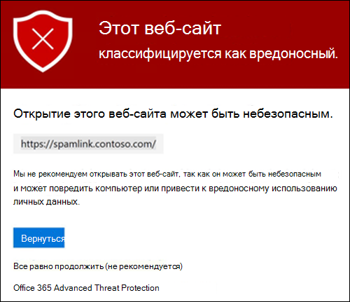
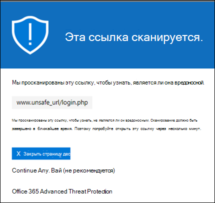
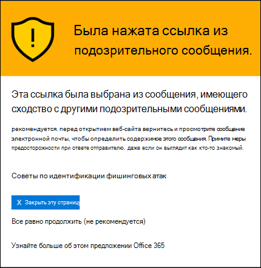
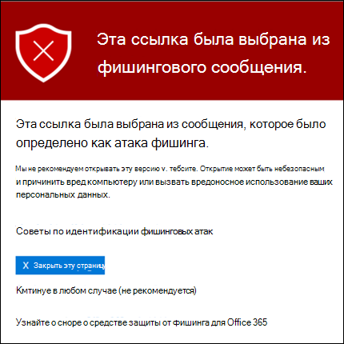
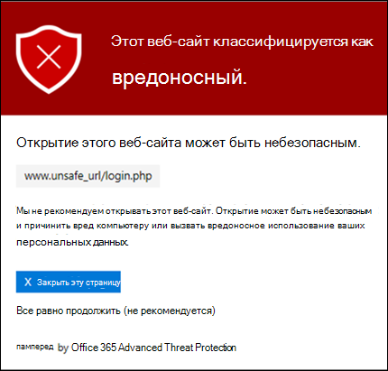
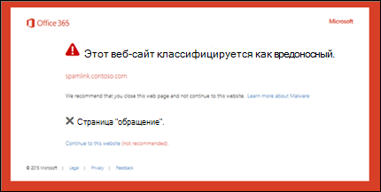
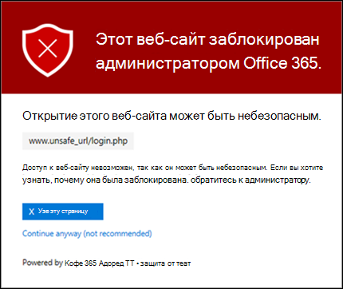
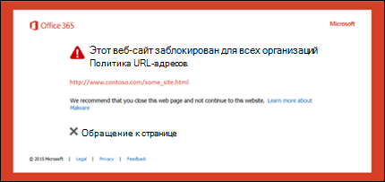
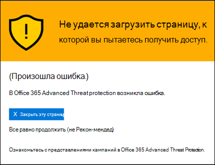
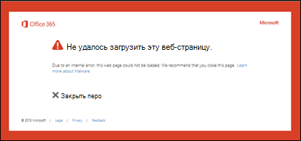

# Сейф Ссылки в Microsoft Defender для Office 365

[!INCLUDE [Microsoft 365 Defender rebranding](../includes/microsoft-defender-for-office.md)]

**Область применения**
- [Microsoft Defender для Office 365 (план 1 и план 2)](defender-for-office-365.md)
- [Microsoft 365 Defender](../defender/microsoft-365-defender.md)

> [!IMPORTANT]
> Эта статья предназначена для бизнес-клиентов, использующих [Microsoft Defender для Office 365](defender-for-office-365.md). Если вы используете Outlook.com, Microsoft 365 для семьи или Microsoft 365 персональный и ищете сведения о Safelinks в Outlook, см. в [Outlook.com.](https://support.microsoft.com/office/882d2243-eab9-4545-a58a-b36fee4a46e2)

Сейф Ссылки — это функция [в Defender for Office 365,](defender-for-office-365.md) которая обеспечивает сканирование и переописывание входящие сообщения электронной почты в потоке почты, а также проверку URL-адресов и ссылок в сообщениях электронной почты и других местах. Сейф Сканирование ссылок происходит в  дополнение к регулярной защите от нежелательной почты и вредоносных программ в входящие сообщения электронной почты в Exchange Online Protection (EOP). Сейф Сканирование ссылок поможет защитить организацию от вредоносных ссылок, используемых в фишинге и других атаках.

Сейф Защита ссылок доступна в следующих расположениях:

- **Сообщения электронной** почты: Сейф ссылки на ссылки в сообщениях электронной почты контролируются политиками Сейф ссылками. Политика ссылок Сейф по умолчанию не существует, поэтому для защиты ссылок Сейф в сообщениях электронной почты необходимо создать одну или несколько Сейф **ссылок.** Инструкции см. в Сейф ссылки в [Microsoft Defender для Office 365.](set-up-safe-links-policies.md)

  Дополнительные сведения о защите Сейф ссылок для сообщений электронной почты см. в разделе [Сейф Ссылки](#safe-links-settings-for-email-messages) для сообщений электронной почты в этой статье.
  
  > [!NOTE]
  > Сейф Ссылки не работают в общедоступных папках с поддержкой почты.

- **Microsoft Teams** (в настоящее время в режиме предварительного просмотра TAP): защита Сейф ссылок для ссылок в Teams беседах, групповых чатах или каналах также контролируется политиками Сейф ссылки. Политика ссылок Сейф по умолчанию не существует, поэтому для защиты Сейф ссылок в Teams необходимо создать одну или несколько Сейф **ссылок.**

  Дополнительные сведения о защите Сейф ссылок в Teams см. в разделе [Сейф ссылки](#safe-links-settings-for-microsoft-teams) для Microsoft Teams в этой статье.

- **Office 365** приложения: Сейф ссылки для Office 365 приложения доступны в поддерживаемых настольных, мобильных и веб-приложениях. Настраивается **защита** Сейф ссылок для Office 365 приложений в глобальных настройках, не Сейф ссылок.  Инструкции см. в перенастройке глобальных параметров [для параметров Сейф ссылок](configure-global-settings-for-safe-links.md)в Microsoft Defender для Office 365.

  Сейф Защита ссылок для Office 365 приложений применяется для всех пользователей в организации, которые имеют лицензию на Defender для Office 365, независимо от того, включены ли пользователи в активные политики Сейф ссылки или нет.

  Дополнительные сведения о защите Сейф ссылок в Office 365 приложениях см. в разделе [Сейф ссылки](#safe-links-settings-for-office-365-apps) для Office 365 приложений в этой статье.

В этой статье подробно описаны следующие типы параметров Сейф ссылки:

- **Параметры** политик Сейф ссылки. Эти параметры применяются только к пользователям, включенным в определенные политики, и параметры могут быть разными между политиками. В эти параметры входят:

  - [Сейф Ссылки параметров для сообщений электронной почты](#safe-links-settings-for-email-messages)
  - [Сейф Ссылки параметров для Microsoft Teams](#safe-links-settings-for-microsoft-teams)
  - ["Не переписывай списки следующих URL-адресов" в Сейф ссылки](#do-not-rewrite-the-following-urls-lists-in-safe-links-policies)

- **Параметры глобальных Сейф** ссылок. Эти параметры настроены глобально, а не в Сейф ссылки. В эти параметры входят:

  - [Сейф Ссылки параметров для Office 365 приложений](#safe-links-settings-for-office-365-apps)
  - ["Блокировка следующих URL-адресов" для Сейф ссылки](#block-the-following-urls-list-for-safe-links)

В следующей таблице описываются сценарии для Сейф ссылок в Microsoft 365 и Office 365 организациях, включающих Defender для Office 365 (другими словами, отсутствие лицензирования никогда не является проблемой в примерах).

 

****

|Сценарий|Результат|
|---|---|
|Жан является членом отдела маркетинга. Сейф Защита ссылок для Office 365 приложений включена в глобальных параметрах для Сейф ссылки, и существует политика Сейф ссылок, применяемая к сотрудникам отдела маркетинга. Жан открывает PowerPoint в сообщении электронной почты, а затем щелкает URL-адрес в презентации.|Jean защищена Сейф ссылками. 
 Jean включен в политику Сейф ссылки, Сейф ссылки для Office 365 приложений. 
 Дополнительные сведения о требованиях к защите Сейф ссылок в Office 365 приложениях см. в разделе [Сейф Ссылки](#safe-links-settings-for-office-365-apps) для Office 365 приложений в этой статье.|
|В организации Microsoft 365 E5 Криса не настроены Сейф ссылки. Крис получает сообщение электронной почты от внешнего отправитель, который содержит URL-адрес на вредоносный веб-сайт, который он в конечном итоге щелкнуть.|Крис не защищен ссылками Сейф ссылками. 
 Администратор должен создать по крайней мере одну Сейф ссылки для всех, кто Сейф ссылки в входящие сообщения электронной почты. Крис должен быть включен в условия политики, чтобы получить защиту Сейф ссылки.|
|В организации Pat администраторы не создали политики Сейф ссылок, но Сейф ссылки для Office 365 приложений включена. Pat открывает документ Word и щелкает URL-адрес в файле.|Pat не защищен ссылками Сейф. 
 Хотя Сейф для Office 365 приложений включена во всем мире, Pat не включен ни в какие активные политики Сейф ссылки, поэтому защита не может применяться.|
|В организации Ли настраивается в списке Block следующие URL-адреса в глобальных параметрах `https://tailspintoys.com` для Сейф  ссылки. Политика Сейф ссылок, включаемая Ли, уже существует. Ли получает сообщение электронной почты с URL-адресом. `https://tailspintoys.com/aboutus/trythispage` Ли щелкает URL-адрес.|URL-адрес может быть автоматически заблокирован для Ли; это зависит от записи URL-адреса в списке и используемого клиента электронной почты Ли. Дополнительные сведения см. в разделе "Блокировка следующих [URL-адресов"](#block-the-following-urls-list-for-safe-links) для раздела Сейф ссылки в этой статье.|
|Джейми и Джулия работают в contoso.com. Давным-давно администраторы настраивали Сейф ссылки, применимые как к Джейми, так и к Юлии. Джейми отправляет юлии сообщение электронной почты, не зная, что письмо содержит вредоносный URL-адрес.|Юлия защищена Сейф **ссылками,** если политика Сейф ссылки, применяемая к ней, настроена для применения к сообщениям между внутренними получателями. Дополнительные сведения см. в [разделе Сейф ссылки для раздела сообщения](#safe-links-settings-for-email-messages) электронной почты в этой статье.|
|

## Сейф Ссылки параметров для сообщений электронной почты

Сейф Ссылки сканирует входящие сообщения электронной почты на известные вредоносные гиперссылки. Отсканированные URL-адреса переписываются с помощью префикса стандартного URL-адреса Майкрософт: `https://nam01.safelinks.protection.outlook.com` . После перезаписи ссылки она анализируется на потенциально вредоносный контент.

После Сейф ссылки перезаписывается URL-адрес, URL-адрес остается  переписанным даже в том случае, если сообщение переадружается вручную или отвечает на них (как внутренним, так и внешним получателям). Дополнительные ссылки, добавленные в переададанной или ответной ссылке на сообщение, не переписываются. Однако в случае  автоматической переадтрансляции по правилам "Входящие" или переадтрансляцию SMTP  URL-адрес не будет переписываться в сообщении, предназначенном для конечного получателя, если этот получатель также не защищен ссылками Сейф или URL-адрес уже был переписан в предыдущем сообщении. 

Параметры политик Сейф ссылок, применимые к сообщениям электронной почты, описаны в следующем списке:

- **Выберите действие для неизвестных** потенциально вредоносных URL-адресов в сообщениях: Включает или отключает Сейф ссылки в сообщениях электронной почты. Рекомендуемое значение **— On**. Включение этого параметра приводит к следующим действиям.

  - Сейф Сканирование ссылок включено в Outlook (C2R) на Windows.
  - URL-адреса переписываются, и пользователи проходят маршрутную Сейф ссылки при нажатии URL-адресов в сообщениях.
  - При нажатии URL-адресов проверяется список известных вредоносных URL-адресов и список "Заблокировать следующие [URL-адреса".](#block-the-following-urls-list-for-safe-links)
  - URL-адреса, которые не имеют допустимой репутации, асинхронно детонирует в фоновом режиме.

- **Применение сканирования URL-адресов** в режиме реального времени для подозрительных ссылок и ссылок, которые указывают на файлы: позволяет в режиме реального времени сканировать ссылки, в том числе ссылки в сообщениях электронной почты, которые указывают на загружаемый контент. Рекомендуемое значение включено.
  - **Дождись завершения сканирования URL-адресов перед доставкой сообщения:**
    - Включено. Сообщения, содержащие URL-адреса, удерживаются до завершения сканирования. Сообщения доставляются только после подтверждения безопасности URL-адресов. Это рекомендуемое значение.
    - Отключено. Если сканирование URL-адреса не может завершиться, доставить сообщение в любом случае.

- **Применение Сейф** ссылки на сообщения электронной почты, отправленные в организации: включает или отключает сканирование Сейф ссылок на сообщения, отправленные между внутренними отправительами и внутренними получателями в одной Exchange Online организации. Рекомендуемое значение включено.

- **Не отслеживайте клики** пользователей: включает или отключает хранение Сейф ссылки щелкнуть данные для URL-адресов, нажав в сообщениях электронной почты. Рекомендуется оставить этот параметр невыбранным (для отслеживания щелчков пользователя).

  Отслеживание ссылок в сообщениях электронной почты, отправленных между внутренними отправителями и внутренними получателями, в настоящее время не поддерживается.

- **Не позволяйте пользователям щелкнуть** исходный URL-адрес: позволяет  или блокирует щелкнуть страницу предупреждения на исходный URL-адрес. Включено рекомендуемое значение.

- **Отображение фирменого знака организации на** страницах уведомлений и предупреждений. Этот параметр отображает брендинг организации на страницах предупреждений. Брендинг помогает пользователям идентифицировать законные предупреждения, так как страницы с предупреждением Microsoft по умолчанию часто используются злоумышленниками. Дополнительные сведения о настраиваемом брендинге см. в Microsoft 365 [темы для организации.](../../admin/setup/customize-your-organization-theme.md)

- **Не переописывай следующие URL-адреса:** оставляет URL-адреса в том же качестве. Сохраняет настраиваемый список безопасных URL-адресов, которые не требуют сканирования. Этот список уникален для каждой Сейф ссылки. Дополнительные сведения  о списке "Не переписывай следующий список URL-адресов" см. в разделе "Не переписывай следующие [URL-адреса"](#do-not-rewrite-the-following-urls-lists-in-safe-links-policies) в разделе политики Сейф ссылки в этой статье.

  Дополнительные сведения о рекомендуемых значениях для стандартных и строгих параметров политики для политик Сейф ссылки см. в Сейф [параметры политики ссылок.](recommended-settings-for-eop-and-office365.md#safe-links-policy-settings)

- **Фильтры получателей.** Необходимо указать условия и исключения получателей, которые определяют, к кому применяется политика. Для условий и исключений можно использовать следующие свойства:
  - **Получатель**
  - **Домен получателя**.
  - **Получатель входит в группу**

  Условие или исключение можно использовать только один раз, но оно может содержать несколько значений. Указать несколько значений в одном условии или исключении можно с помощью оператора OR (например, _\<recipient1\>_ or _\<recipient2\>_). Между разными условиями и исключениями используется оператор AND (например, _\<recipient1\>_ and _\<member of group 1\>_).

- **Приоритет.** При создании нескольких политик можно указать порядок, который они применяют. Никакие две политики не могут иметь одинаковый приоритет, и обработка политики прекращается после применения первой политики.

  Дополнительные сведения о приоритетах, а также оценке и применении нескольких политик см. в статье [Порядок и приоритет защиты электронной почты](how-policies-and-protections-are-combined.md).
  
### Как Сейф ссылки в сообщениях электронной почты

На высоком уровне в сообщениях электронной почты Сейф защита ссылок:

1. Вся электронная почта проходит через EOP, где фильтры протоколов интернета (IP) и конвертов, защита от вредоносных программ на основе подписи, фильтры для защиты от нежелательной почты и защиты от вредоносных программ до доставки сообщения в почтовый ящик получателя.

2. Пользователь открывает сообщение в почтовом ящике и щелкает URL-адрес в сообщении.

3. Сейф Ссылки немедленно проверяют URL-адрес перед открытием веб-сайта:

   - Если URL-адрес включен в список **Блок** следующих URL-адресов, откроется [заблокированный URL-адрес.](#blocked-url-warning)

   - Если URL-адрес указывает на веб-сайт, который  был определен как вредоносный, откроется страница предупреждения о вредоносных веб-сайтах (или другая страница предупреждения).

   - Если URL-адрес указывает на скачиваемый файл, а в политике, применяемой к пользователю, включено сканирование **URL-адреса** в режиме реального времени для подозрительных ссылок и ссылок, указываемых на параметр файлов, в политике, применяемой к пользователю, проверяется загружаемый файл.

   - Если URL-адрес определен как безопасный, откроется веб-сайт.

## Сейф Ссылки параметров для Microsoft Teams

> [!IMPORTANT]
> По данным на март 2020 г., эта функция находится в предварительном просмотре и доступна только для Microsoft Teams программы внедрения технологий (TAP). Сведения о расписании выпуска ознакомьтесь с Microsoft 365 [плана](https://www.microsoft.com/microsoft-365/roadmap?rtc=1&filters=&searchterms=Safe%2CLinks%2CProtection%2Cfor%2CMicrosoft%2CTeams).

Вы включаете или отключать Сейф ссылки для Microsoft Teams политик Сейф ссылки. В частности, вы используете действие Выберите для неизвестных или потенциально вредоносных **URL-адресов в Microsoft Teams** параметре. Рекомендуемое значение **— On**.

Следующие параметры политик Сейф ссылки, применимые к ссылкам в сообщениях электронной почты, также применяются к ссылкам в Teams:

- **Применение сканирования URL-адресов в режиме реального времени для подозрительных ссылок и ссылок, которые указывают на файлы**
- **Не отслеживайте щелчки пользователя**
- **Не позволяйте пользователям щелкнуть исходный URL-адрес**

Эти параметры объясняются ранее [в Сейф ссылок для сообщений электронной почты.](#safe-links-settings-for-email-messages)

После включения Сейф ссылки для Microsoft Teams url-адресов в Teams проверяются в списке известных вредоносных ссылок, когда защищенный пользователь щелкает ссылку (защита во время щелчка мыши). URL-адреса не переписываются. Если ссылка будет признана вредоносной, пользователи будут иметь следующие действия:

- Если ссылка была щелкнуть в беседе Teams, групповом чате или по каналам, страница предупреждения, как показано на скриншоте ниже, появится в веб-браузере по умолчанию.
- Если ссылка была щелкнуть с закрепленной вкладки, страница предупреждения будет отображаться в интерфейсе Teams в этой вкладке. Возможность открыть ссылку в веб-браузере отключена из соображений безопасности.
- В зависимости от того, как не разрешить пользователям щелкнуть исходный параметр **URL-адреса** в политике настроен, пользователю будет разрешено или не будет разрешено щелкнуть исходный URL-адрес (Продолжить в любом случае **(не рекомендуется)** на скриншоте). Рекомендуется включить кнопку **Не** позволяйте пользователям щелкнуть исходный URL-адрес, чтобы пользователи не могли щелкнуть исходный URL-адрес.

Если пользователь, отправивший ссылку, не включен в политику Сейф ссылок, Teams включена защита, пользователь может щелкнуть исходный URL-адрес на своем компьютере или устройстве.

Щелкнув **кнопку "Назад"** на странице предупреждения, пользователь вернется в исходное расположение контекста или URL-адреса. Однако повторное нажатие на исходную ссылку приведет к Сейф ссылки для повторного получения URL-адреса, поэтому страница предупреждения будет появляться снова.

### Как Сейф ссылки в Teams

На высоком уровне можно узнать, как защита Сейф ссылок работает для URL-адресов в Microsoft Teams:

1. Пользователь запускает приложение Teams.

2. Microsoft 365 проверяет, что в организацию пользователя входит Microsoft Defender для Office 365, и что пользователь включен в политику активных ссылок Сейф, в которой включена защита Microsoft Teams.

3. URL-адреса проверяются во время щелчка мыши для пользователя в чатах, групповых чатах, каналах и вкладок.

## Сейф Ссылки параметров для Office 365 приложений

Сейф Защита ссылок для Office 365 приложений проверяет ссылки в Office документах, а не ссылки в сообщениях электронной почты (но она может проверять ссылки в прикрепленных Office документах в сообщениях электронной почты после открытия документа).

Сейф Защита ссылок для Office 365 приложений имеет следующие требования к клиентам:

- Приложения Microsoft 365 или Microsoft 365 бизнес премиум.
  - Текущие версии Word, Excel и PowerPoint на Windows, Mac или в веб-браузере.
  - Office приложения на устройствах с iOS или Android.
  - Visio на Windows.
  - OneNote в веб-браузере.

- Office 365 приложения настроены на использование современной проверки подлинности. Дополнительные сведения см. в Office [2013, Office 2016](../../enterprise/modern-auth-for-office-2013-and-2016.md)г. и Office 2019 г.

- Пользователи подписывался при использовании своих учетных записей для работы или учебного заведения. Дополнительные сведения см. в [Office.](https://support.microsoft.com/office/b9582171-fd1f-4284-9846-bdd72bb28426)

Настраивается защита Сейф ссылок для Office 365 приложений в глобальных настройках для Сейф ссылок, а не Сейф ссылок. Защита применяется для всех пользователей в организации, которые имеют лицензию на defender для Office 365, независимо от того, включены ли пользователи в активные политики Сейф ссылки или нет.

Следующие параметры Сейф ссылки доступны для Office 365 приложений:

- **Office 365 приложений:** включает или отключает сканирование Сейф ссылок в поддерживаемых Office 365 приложениях. По умолчанию и рекомендуемое значение **on**.

- Не отслеживайте, когда пользователи щелкают **ссылки Сейф:** включает или отключает хранение Сейф Ссылки щелкают данные для URL-адресов, щелкающих в настольных версиях Word, Excel, PowerPoint и Visio. Рекомендуемое значение **Отключено,** что означает отслеживание кликов пользователей.

- **Не позволяйте** пользователям щелкнуть безопасные ссылки на исходный  URL-адрес: позволяет пользователям щелкнуть страницу предупреждения на исходный URL-адрес в настольных версиях Word, Excel, PowerPoint и Visio. По умолчанию и рекомендуемое значение **on**.

Чтобы настроить параметры Сейф ссылок для Office 365 приложений, см. в Сейф Ссылки для [Office 365 приложений.](configure-global-settings-for-safe-links.md#configure-safe-links-protection-for-office-365-apps-in-the-security-center)

Дополнительные сведения о рекомендуемых значениях для параметров стандартных и строгих политик см. в глобальной Сейф [Ссылки.](recommended-settings-for-eop-and-office365.md#global-settings-for-safe-links)

### Как Сейф ссылки в Office 365 приложениях

На высоком уровне можно узнать, как Сейф ссылки для URL-адресов в Office 365 приложениях. Поддерживаемые Office 365 описаны в предыдущем разделе.

1. Пользователь подписывается на использование своей учетной записи в организации, которая включает Приложения Microsoft 365 или Microsoft 365 бизнес премиум.

2. Пользователь открывает и щелкает по ссылке Office документа в поддерживаемом Приложение Office.

3. Сейф Ссылки немедленно проверяет URL-адрес перед открытием целевого веб-сайта:

   - Если URL-адрес включен в список, который пропускает Сейф ссылки (блок следующий  список URL-адресов), откроется заблокированная страница предупреждения url-адресов. 

   - Если URL-адрес указывает на веб-сайт, который  был определен как вредоносный, откроется страница предупреждения о вредоносных веб-сайтах (или другая страница предупреждения).

   - Если URL-адрес указывает на загружаемый файл, а политика ссылок Сейф, применяемая к пользователю, настроена для сканирования ссылок на загружаемый контент (применяйте сканирование **URL-адреса** в режиме реального времени для подозрительных ссылок и ссылок, которые указывают на файлы), загружаемый файл проверяется.

   - Если URL-адрес считается безопасным, пользователь будет доставлен на веб-сайт.

   - Если Сейф не удается выполнить сканирование ссылок, Сейф не запускается защита ссылок. В Office клиенты настольных компьютеров пользователь будет предупрежден, прежде чем приступить к веб-сайту назначения.

> [!NOTE]
> В начале каждого сеанса может потребоваться несколько секунд, чтобы убедиться, что у пользователя Сейф ссылки для Office включен.

## "Блокировка следующих URL-адресов" для Сейф ссылки

В **списке Блок следующих** URL-адресов определяются ссылки, которые всегда блокируются Сейф ссылками в следующих расположениях:

- Сообщения электронной почты.
- Документы в Office 365 приложениях в Windows и Mac.
- Документы в Office для iOS и Android.

Когда пользователь в активной политике Сейф ссылок щелкает заблокированную ссылку в  поддерживаемом приложении, он передается на страницу предупреждения о блокировке URL-адресов.

Настраивается список URL-адресов в глобальных настройках для Сейф ссылки. Инструкции см. [в списке "Заблокировать следующие URL-адреса".](configure-global-settings-for-safe-links.md#configure-the-block-the-following-urls-list-in-the-security-center)

**Примечания**:

- Для по-настоящему универсального списка URL-адресов, заблокированных во всем мире, см. в руб. [Управление списком разрешить или заблокировать клиента.](tenant-allow-block-list.md)
- Ограничения для **блокировки следующего списка URL-адресов:**
  - Максимальное число записей — 500.
  - Максимальная длина записи — 128 символов.
  - Все записи не могут превышать 10 000 символов.
- Не включайте в конце URL-адреса полосу `/` () вперед. Например, используйте `https://www.contoso.com` , не `https://www.contoso.com/` .
- Url-адрес только домена (например или) блокирует любой `contoso.com` `tailspintoys.com` URL-адрес, содержащий домен.
- Можно заблокировать поддомен, не блокируя полный домен. Например, блокирует `toys.contoso.com*` любой URL-адрес, содержащий поддомена, но он не блокирует URL-адреса, содержащие полный `contoso.com` домен.
- Вы можете включить до трех поддиайтов `*` () на запись URL-адреса.

### Синтаксис записи для списка "Заблокировать следующие URL-адреса"

Примеры значений, которые можно ввести, и их результаты описаны в следующей таблице:

 

****

|Значение|Результат|
|---|---|
|`contoso.com` 
 или 
 `*contoso.com*`|Блокирует домен, поддомена и пути. Например, `https://www.contoso.com` и `https://sub.contoso.com` `https://contoso.com/abc` заблокированы.|
|`https://contoso.com/a`|`https://contoso.com/a`Блоки, но не дополнительные подпаты, как `https://contoso.com/a/b` .|
|`https://contoso.com/a*`|Блоки `https://contoso.com/a` и дополнительные подпаты, как `https://contoso.com/a/b` .|
|`https://toys.contoso.com*`|Блокирует поддомен (в этом примере), но позволяет щелкнуть другие URL-адреса `toys` домена (например `https://contoso.com` или `https://home.contoso.com` ).|
|

## "Не переписывай списки следующих URL-адресов" в Сейф ссылки

> [!NOTE]
> Если в вашей организации Сейф ссылки, только поддерживаемый метод для сторонних тестов фишинга не переопишет следующие списки URL-адресов. 

Каждая Сейф ссылки содержит  список Не перезаписывать следующий список URL-адресов, которые можно использовать для указания URL-адресов, не переписанные при Сейф ссылки. Другими словами, список позволяет пользователям, включенным в политику, получать доступ к указанным URL-адресам, которые в противном случае будут заблокированы Сейф ссылками. Можно настроить различные списки в различных Сейф ссылок. Обработка политики прекращается после того, как к пользователю применяется первая (вероятно, самая высокая приоритетная) политика. Таким образом,  только один не переписать следующий список URL-адресов применяется к пользователю, который включен в несколько активных политик Сейф ссылки.

Чтобы добавить записи в список в новых или существующих политиках ссылок Сейф, см. в статьях Создание [политик Сейф ссылок](set-up-safe-links-policies.md#use-the-security--compliance-center-to-create-safe-links-policies) или изменение [политик Сейф ссылки.](set-up-safe-links-policies.md#use-the-security--compliance-center-to-modify-safe-links-policies)

**Примечания**:

- Следующие клиенты не распознают списки url-адресов Не переписать в политиках Сейф ссылки.  Пользователям, включенным в полицию, может быть заблокирован доступ к URL-адресам по результатам сканирования Сейф ссылок в этих клиентах:
  - Microsoft Teams
  - Office веб-приложения

  Для по-настоящему универсального списка URL-адресов, разрешенных во всем мире, см. в руб. [Управление списком разрешить или заблокировать клиента.](tenant-allow-block-list.md)

- Чтобы улучшить пользовательский интерфейс, следует добавить в список часто используемые внутренние URL-адреса. Например, если у вас есть локальное обслуживание, например Skype для бизнеса или SharePoint, можно добавить эти URL-адреса, чтобы исключить их из сканирования.
- Если в  политиках ссылок Сейф ссылки не переписать следующие записи URL-адресов, обязательно просмотрите списки и добавьте по мере необходимости подкожные знаки. Например, в списке есть запись like, и вы позже решите включить `https://contoso.com/a` такие подпаты, как `https://contoso.com/a/b` . Вместо добавления новой записи добавьте под диктовую карточку к существующей записи, чтобы она стала `https://contoso.com/a/*` .
- Вы можете включить до трех поддиайтов `*` () на запись URL-адреса. Подгруппы явно включают префиксы или поддомены. Например, запись не такая, как , так как позволяет людям посещать поддомены и пути `contoso.com` `*.contoso.com/*` в `*.contoso.com/*` указанном домене.
- Если URL-адрес использует автоматическое перенаправление для HTTP-адреса в HTTPS (например, перенаправление 302 для к), и вы пытаетесь ввести записи HTTP и HTTPS для одного и того же URL-адреса в список, вы можете заметить, что вторая запись URL-адреса заменяет первую запись `http://www.contoso.com` `https://www.contoso.com` URL-адреса. Такое поведение не происходит, если версии HTTP и HTTPS URL-адреса полностью разделяются.

### Синтаксис записи для списка "Не переписать следующие URL-адреса"

Примеры значений, которые можно ввести, и их результаты описаны в следующей таблице:

 

****

|Значение|Результат|
|---|---|
|`contoso.com`|Позволяет получить доступ к поддоменам или путям, но `https://contoso.com` не к ним.|
|`*.contoso.com/*`|Позволяет получить доступ к домену, поддоменам и путям (например, `https://www.contoso.com` `https://www.contoso.com` , или `https://maps.contoso.com` `https://www.contoso.com/a` ). 
 Эта запись по своей сути лучше, чем , потому что она не позволяет потенциально `*contoso.com*` мошеннических сайтов, как `https://www.falsecontoso.com` или `https://www.false.contoso.completelyfalse.com`|
|`https://contoso.com/a`|Позволяет получать доступ к подпатам, но не к `https://contoso.com/a` подпапам, как `https://contoso.com/a/b`|
|`https://contoso.com/a/*`|Позволяет получать доступ к `https://contoso.com/a` и подпаттов, таких как `https://contoso.com/a/b`|
|

## Страницы с предупреждением из Сейф ссылки

В этом разделе представлены примеры различных страниц с предупреждением, которые запускаются Сейф ссылками при нажатии URL-адреса.

Обратите внимание, что обновлено несколько страниц с предупреждением. Если вы еще не видите обновленные страницы, вы скоро. Обновленные страницы включают новую цветовую схему, более подробные и возможность перейти к сайту, несмотря на заданное предупреждение и рекомендации.

### Проверка уведомлений о ходе выполнения

Щелкнув URL-адрес, высканируется Сейф ссылками. Возможно, вам потребуется подождать несколько минут, прежде чем снова попробовать ссылку.

Оригинальная страница уведомления выглядела так:

### Предупреждение о подозрительных сообщениях

Нажатый URL-адрес был в сообщении электронной почты, похожем на другие подозрительные сообщения. Перед отправкой на сайт рекомендуется дважды проверить сообщение электронной почты.

### Предупреждение о попытке фишинга

Нажатый URL-адрес был в сообщении электронной почты, которое было идентифицировано как фишинговая атака. В результате все URL-адреса в сообщении электронной почты заблокированы. Рекомендуется не перейти на сайт.

### Предупреждение о вредоносных веб-сайтах

Нажатый URL-адрес указывает на сайт, который был идентифицирован как вредоносный. Рекомендуется не перейти на сайт.

Оригинальная страница предупреждения выглядела так:

### Предупреждение о блокировке URL-адреса

Нажатый URL-адрес был вручную заблокирован администратором  в организации (блок следующий список URL-адресов в глобальных параметрах для Сейф ссылки). Ссылка не была отсканирована Сейф ссылками, так как она была заблокирована вручную.

Существует несколько причин, по которым администратор вручную блокирует определенные URL-адреса. Если вы считаете, что сайт не должен быть заблокирован, обратитесь к администратору.

Оригинальная страница предупреждения выглядела так:

### Предупреждение об ошибке

Произошла какая-то ошибка, и URL-адрес не может быть открыт.

Оригинальная страница предупреждения выглядела так:

