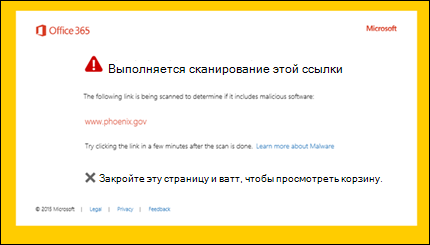

# Сейф Ссылки в Microsoft Defender для Office 365Safe Links in Microsoft Defender for Office 365

[!INCLUDE [Microsoft 365 Defender rebranding](../includes/microsoft-defender-for-office.md)]

**Область применения****Applies to**
- [Microsoft Defender для Office 365 (план 1 и план 2)Microsoft Defender for Office 365 plan 1 and plan 2](defender-for-office-365.md)
- [Microsoft 365 DefenderMicrosoft 365 Defender](../defender/microsoft-365-defender.md)

> [!IMPORTANT]
> Эта статья предназначена для бизнес-клиентов, использующих [Microsoft Defender для Office 365](defender-for-office-365.md).This article is intended for business customers who have [Microsoft Defender for Office 365](defender-for-office-365.md). Если вы используете Outlook.com, Microsoft 365 для семьи или Microsoft 365 персональный и ищете сведения о Safelinks в Outlook, см. в [Outlook.com.](https://support.microsoft.com/office/882d2243-eab9-4545-a58a-b36fee4a46e2)If you're using Outlook.com, Microsoft 365 Family, or Microsoft 365 Personal, and you're looking for information about Safelinks in Outlook, see [Advanced Outlook.com security](https://support.microsoft.com/office/882d2243-eab9-4545-a58a-b36fee4a46e2).

Сейф Ссылки — это функция [в Defender for Office 365,](defender-for-office-365.md) которая обеспечивает сканирование и переописывание входящие сообщения электронной почты в потоке почты, а также проверку URL-адресов и ссылок в сообщениях электронной почты и других местах.Safe Links is a feature in [Defender for Office 365](defender-for-office-365.md) that provides URL scanning and rewriting of inbound email messages in mail flow, and time-of-click verification of URLs and links in email messages and other locations. Сейф Сканирование ссылок происходит в  дополнение к регулярной защите от нежелательной почты и вредоносных программ в входящие сообщения электронной почты в Exchange Online Protection (EOP).Safe Links scanning occurs in addition to the regular [anti-spam and anti-malware protection](anti-spam-and-anti-malware-protection.md) in inbound email messages in Exchange Online Protection (EOP). Сейф Сканирование ссылок поможет защитить организацию от вредоносных ссылок, используемых в фишинге и других атаках.Safe Links scanning can help protect your organization from malicious links that are used in phishing and other attacks.

Сейф Защита ссылок доступна в следующих расположениях:Safe Links protection is available in the following locations:

- **Сообщения электронной** почты: Сейф ссылки на ссылки в сообщениях электронной почты контролируются политиками Сейф ссылками.**Email messages**: Safe Links protection for links in email messages is controlled by Safe Links policies. Политика ссылок Сейф по умолчанию не существует, поэтому для защиты ссылок Сейф в сообщениях электронной почты необходимо создать одну или несколько Сейф **ссылок.**There is no default Safe Links policy, **so to get the protection of Safe Links in email messages, you need to create one or more Safe Links policies**. Инструкции см. в Сейф ссылки в [Microsoft Defender для Office 365.](set-up-safe-links-policies.md)For instructions, see [Set up Safe Links policies in Microsoft Defender for Office 365](set-up-safe-links-policies.md).

  Дополнительные сведения о защите Сейф ссылок для сообщений электронной почты см. в разделе [Сейф Ссылки](#safe-links-settings-for-email-messages) для сообщений электронной почты в этой статье.For more information about Safe Links protection for email messages, see the [Safe Links settings for email messages](#safe-links-settings-for-email-messages) section later in this article.
  
  > [!NOTE]
  > Сейф Ссылки не работают в общедоступных папках с поддержкой почты.Safe Links does not work on mail-enabled public folders.

- **Microsoft Teams** (в настоящее время в режиме предварительного просмотра TAP): защита Сейф ссылок для ссылок в Teams беседах, групповых чатах или каналах также контролируется политиками Сейф ссылки.**Microsoft Teams** (currently in TAP Preview): Safe Links protection for links in Teams conversations, group chats, or from channels is also controlled by Safe Links policies. Политика ссылок Сейф по умолчанию не существует, поэтому для защиты Сейф ссылок в Teams необходимо создать одну или несколько Сейф **ссылок.**There is no default Safe Links policy, **so to get the protection of Safe Links in Teams, you need to create one or more Safe Links policies**.

  Дополнительные сведения о защите Сейф ссылок в Teams см. в разделе [Сейф ссылки](#safe-links-settings-for-microsoft-teams) для Microsoft Teams в этой статье.For more information about Safe Links protection in Teams, see the [Safe Links settings for Microsoft Teams](#safe-links-settings-for-microsoft-teams) section later in this article.

- **Office 365** приложения: Сейф ссылки для Office 365 приложения доступны в поддерживаемых настольных, мобильных и веб-приложениях.**Office 365 apps**: Safe Links protection for Office 365 apps is available in supported desktop, mobile, and web apps. Настраивается **защита** Сейф ссылок для Office 365 приложений в глобальных настройках, не Сейф ссылок. You **configure** Safe Links protection for Office 365 apps in the global setting that are **outside** of Safe Links policies. Инструкции см. в перенастройке глобальных параметров [для параметров Сейф ссылок](configure-global-settings-for-safe-links.md)в Microsoft Defender для Office 365.For instructions, see [Configure global settings for Safe Links settings in Microsoft Defender for Office 365](configure-global-settings-for-safe-links.md).

  Сейф Защита ссылок для Office 365 приложений применяется для всех пользователей в организации, которые имеют лицензию на Defender для Office 365, независимо от того, включены ли пользователи в активные политики Сейф ссылки или нет.Safe Links protection for Office 365 apps is applied to all users in the organization who are licensed for Defender for Office 365, regardless of whether the users are included in active Safe Links policies or not.

  Дополнительные сведения о защите Сейф ссылок в Office 365 приложениях см. в разделе [Сейф ссылки](#safe-links-settings-for-office-365-apps) для Office 365 приложений в этой статье.For more information about Safe Links protection in Office 365 apps, see the [Safe Links settings for Office 365 apps](#safe-links-settings-for-office-365-apps) section later in this article.

В этой статье подробно описаны следующие типы параметров Сейф ссылки:This article includes detailed descriptions of the following types of Safe Links settings:

- **Параметры** политик Сейф ссылки. Эти параметры применяются только к пользователям, включенным в определенные политики, и параметры могут быть разными между политиками.**Settings in Safe Links policies**: These settings apply only to the users who are included in the specific policies, and the settings might be different between policies. В эти параметры входят:These settings include:

  - [Сейф Ссылки параметров для сообщений электронной почтыSafe Links settings for email messages](#safe-links-settings-for-email-messages)
  - [Сейф Ссылки параметров для Microsoft TeamsSafe Links settings for Microsoft Teams](#safe-links-settings-for-microsoft-teams)
  - ["Не переписывай списки следующих URL-адресов" в Сейф ссылки"Do not rewrite the following URLs" lists in Safe Links policies](#do-not-rewrite-the-following-urls-lists-in-safe-links-policies)

- **Параметры глобальных Сейф** ссылок. Эти параметры настроены глобально, а не в Сейф ссылки.**Global Safe Links settings**: These settings are configured globally, not in Safe Links policies. В эти параметры входят:These settings include:

  - [Сейф Ссылки параметров для Office 365 приложенийSafe Links settings for Office 365 apps](#safe-links-settings-for-office-365-apps)
  - ["Блокировка следующих URL-адресов" для Сейф ссылки"Block the following URLs" list for Safe Links](#block-the-following-urls-list-for-safe-links)

В следующей таблице описываются сценарии для Сейф ссылок в Microsoft 365 и Office 365 организациях, включающих Defender для Office 365 (другими словами, отсутствие лицензирования никогда не является проблемой в примерах).The following table describes scenarios for Safe Links in Microsoft 365 and Office 365 organizations that include Defender for Office 365 (in other words, lack of licensing is never an issue in the examples).

 

****

|СценарийScenario|РезультатResult|
|---|---|
|Жан является членом отдела маркетинга.Jean is a member of the marketing department. Сейф Защита ссылок для Office 365 приложений включена в глобальных параметрах для Сейф ссылки, и существует политика Сейф ссылок, применяемая к сотрудникам отдела маркетинга.Safe Links protection for Office 365 apps is turned on in the global settings for Safe Links, and a Safe Links policy that applies to members of the marketing department exists. Жан открывает PowerPoint в сообщении электронной почты, а затем щелкает URL-адрес в презентации.Jean opens a PowerPoint presentation in an email message, and then clicks a URL in the presentation.|Jean защищена Сейф ссылками.Jean is protected by Safe Links. 
 Jean включен в политику Сейф ссылки, Сейф ссылки для Office 365 приложений.Jean is included in a Safe Links policy, and Safe Links protection for Office 365 apps is turned on. 
 Дополнительные сведения о требованиях к защите Сейф ссылок в Office 365 приложениях см. в разделе [Сейф Ссылки](#safe-links-settings-for-office-365-apps) для Office 365 приложений в этой статье.For more information about the requirements for Safe Links protection in Office 365 apps, see the [Safe Links settings for Office 365 apps](#safe-links-settings-for-office-365-apps) section later in this article.|
|В организации Microsoft 365 E5 Криса не настроены Сейф ссылки.Chris's Microsoft 365 E5 organization has no Safe Links policies configured. Крис получает сообщение электронной почты от внешнего отправитель, который содержит URL-адрес на вредоносный веб-сайт, который он в конечном итоге щелкнуть.Chris receives an email from an external sender that contains a URL to a malicious website that he ultimately clicks.|Крис не защищен ссылками Сейф ссылками.Chris is not protected by Safe Links. 
 Администратор должен создать по крайней мере одну Сейф ссылки для всех, кто Сейф ссылки в входящие сообщения электронной почты.An admin must create at least one Safe Links policy for anyone to get Safe Links protection in inbound email messages. Крис должен быть включен в условия политики, чтобы получить защиту Сейф ссылки.Chris must be included in the conditions of policy to get Safe Links protection.|
|В организации Pat администраторы не создали политики Сейф ссылок, но Сейф ссылки для Office 365 приложений включена.In Pat's organization, no admins have created any Safe Links policies, but Safe Links protection for Office 365 apps is turned on. Pat открывает документ Word и щелкает URL-адрес в файле.Pat opens a Word document and clicks a URL in the file.|Pat не защищен ссылками Сейф.Pat is not protected by Safe Links. 
 Хотя Сейф для Office 365 приложений включена во всем мире, Pat не включен ни в какие активные политики Сейф ссылки, поэтому защита не может применяться.Although Safe Links protection for Office 365 apps is turned on globally, Pat is not included in any active Safe Links policies, so the protection can't be applied.|
|В организации Ли настраивается в списке Block следующие URL-адреса в глобальных параметрах `https://tailspintoys.com` для Сейф  ссылки.In Lee's organization, `https://tailspintoys.com` is configured in the **Block the following URLs** list in the global settings for Safe Links. Политика Сейф ссылок, включаемая Ли, уже существует.A Safe Links policy that includes Lee already exists. Ли получает сообщение электронной почты с URL-адресом. `https://tailspintoys.com/aboutus/trythispage`Lee receives an email message that contains the URL `https://tailspintoys.com/aboutus/trythispage`. Ли щелкает URL-адрес.Lee clicks the URL.|URL-адрес может быть автоматически заблокирован для Ли; это зависит от записи URL-адреса в списке и используемого клиента электронной почты Ли.The URL might be automatically blocked for Lee; it depends on the URL entry in the list and the email client Lee used. Дополнительные сведения см. в разделе "Блокировка следующих [URL-адресов"](#block-the-following-urls-list-for-safe-links) для раздела Сейф ссылки в этой статье.For more information, see the ["Block the following URLs" list for Safe Links](#block-the-following-urls-list-for-safe-links) section later in this article.|
|Джейми и Джулия работают в contoso.com.Jamie and Julia both work for contoso.com. Давным-давно администраторы настраивали Сейф ссылки, применимые как к Джейми, так и к Юлии.A long time ago, admins configured Safe Links policies that apply to both of Jamie and Julia. Джейми отправляет юлии сообщение электронной почты, не зная, что письмо содержит вредоносный URL-адрес.Jamie sends an email to Julia, not knowing that the email contains a malicious URL.|Юлия защищена Сейф **ссылками,** если политика Сейф ссылки, применяемая к ней, настроена для применения к сообщениям между внутренними получателями.Julia is protected by Safe Links **if** the Safe Links policy that applies to her is configured to apply to messages between internal recipients. Дополнительные сведения см. в [разделе Сейф ссылки для раздела сообщения](#safe-links-settings-for-email-messages) электронной почты в этой статье.For more information, see the [Safe Links settings for email messages](#safe-links-settings-for-email-messages) section later in this article.|
|

## Сейф Ссылки параметров для сообщений электронной почтыSafe Links settings for email messages

Сейф Ссылки сканирует входящие сообщения электронной почты на известные вредоносные гиперссылки.Safe Links scans incoming email for known malicious hyperlinks. Отсканированные URL-адреса переписываются с помощью префикса стандартного URL-адреса Майкрософт: `https://nam01.safelinks.protection.outlook.com` .Scanned URLs are rewritten using the Microsoft standard URL prefix: `https://nam01.safelinks.protection.outlook.com`. После перезаписи ссылки она анализируется на потенциально вредоносный контент.After the link is rewritten, it's analyzed for potentially malicious content.

После Сейф ссылки перезаписывается URL-адрес, URL-адрес остается  переписанным даже в том случае, если сообщение переадружается вручную или отвечает на них (как внутренним, так и внешним получателям).After Safe Links rewrites a URL, the URL remains rewritten even if the message is *manually* forwarded or replied to (both to internal and external recipients). Дополнительные ссылки, добавленные в переададанной или ответной ссылке на сообщение, не переписываются.Additional links that are added to the forwarded or replied to message are not rewritten. Однако в случае  автоматической переадтрансляции по правилам "Входящие" или переадтрансляцию SMTP  URL-адрес не будет переписываться в сообщении, предназначенном для конечного получателя, если этот получатель также не защищен ссылками Сейф или URL-адрес уже был переписан в предыдущем сообщении.However, in the case of *automatic* forwarding by Inbox rules or SMTP forwarding, the URL will not be rewritten in the message that's intended for the final recipient *unless* that recipient is also protected by Safe Links or the URL had already been rewritten in a previous communication. 

Параметры политик Сейф ссылок, применимые к сообщениям электронной почты, описаны в следующем списке:The settings in Safe Links policies that apply to email messages are described in the following list:

- **Выберите действие для неизвестных** потенциально вредоносных URL-адресов в сообщениях: Включает или отключает Сейф ссылки в сообщениях электронной почты.**Select the action for unknown potentially malicious URLs in messages**: Enables or disables Safe Links scanning in email messages. Рекомендуемое значение **— On**.The recommended value is **On**. Включение этого параметра приводит к следующим действиям.Turning on this setting results in the following actions.

  - Сейф Сканирование ссылок включено в Outlook (C2R) на Windows.Safe Links scanning is enabled in Outlook (C2R) on Windows.
  - URL-адреса переписываются, и пользователи проходят маршрутную Сейф ссылки при нажатии URL-адресов в сообщениях.URLs are rewritten and users are routed through Safe Links protection when they click URLs in messages.
  - При нажатии URL-адресов проверяется список известных вредоносных URL-адресов и список "Заблокировать следующие [URL-адреса".](#block-the-following-urls-list-for-safe-links)When clicked, URLs are checked against a list of known malicious URLs and the ["Block the following URLs" list](#block-the-following-urls-list-for-safe-links).
  - URL-адреса, которые не имеют допустимой репутации, асинхронно детонирует в фоновом режиме.URLs that don't have a valid reputation are detonated asynchronously in the background.

- **Применение сканирования URL-адресов** в режиме реального времени для подозрительных ссылок и ссылок, которые указывают на файлы: позволяет в режиме реального времени сканировать ссылки, в том числе ссылки в сообщениях электронной почты, которые указывают на загружаемый контент.**Apply real-time URL scanning for suspicious links and links that point to files**: Enables real-time scanning of links, including links in email messages that point to downloadable content. Рекомендуемое значение включено.The recommended value is enabled.
  - **Дождись завершения сканирования URL-адресов перед доставкой сообщения:****Wait for URL scanning to complete before delivering the message**:
    - Включено. Сообщения, содержащие URL-адреса, удерживаются до завершения сканирования.Enabled: Messages that contain URLs are held until scanning is finished. Сообщения доставляются только после подтверждения безопасности URL-адресов.Messages are delivered only after the URLs are confirmed to be safe. Это рекомендуемое значение.This is the recommended value.
    - Отключено. Если сканирование URL-адреса не может завершиться, доставить сообщение в любом случае.Disabled: If URL scanning can't complete, deliver the message anyway.

- **Применение Сейф** ссылки на сообщения электронной почты, отправленные в организации: включает или отключает сканирование Сейф ссылок на сообщения, отправленные между внутренними отправительами и внутренними получателями в одной Exchange Online организации.**Apply Safe Links to email messages sent within the organization**: Enables or disables Safe Links scanning on messages sent between internal senders and internal recipients within the same Exchange Online organization. Рекомендуемое значение включено.The recommended value is enabled.

- **Не отслеживайте клики** пользователей: включает или отключает хранение Сейф ссылки щелкнуть данные для URL-адресов, нажав в сообщениях электронной почты.**Do not track user clicks**: Enables or disables storing Safe Links click data for URLs clicked in email messages. Рекомендуется оставить этот параметр невыбранным (для отслеживания щелчков пользователя).The recommend value is to leave this setting unselected (to track user clicks).

  Отслеживание ссылок в сообщениях электронной почты, отправленных между внутренними отправителями и внутренними получателями, в настоящее время не поддерживается.URL click tracking for links in email messages sent between internal senders and internal recipients is currently not supported.

- **Не позволяйте пользователям щелкнуть** исходный URL-адрес: позволяет  или блокирует щелкнуть страницу предупреждения на исходный URL-адрес.**Do not allow users to click through to original URL**: Allows or blocks users from clicking through the [warning page](#warning-pages-from-safe-links) to the original URL. Включено рекомендуемое значение.The recommend value is enabled.

- **Отображение фирменого знака организации на** страницах уведомлений и предупреждений. Этот параметр отображает брендинг организации на страницах предупреждений.**Display the organization branding on notification and warning pages**: This option shows your organization's branding on warning pages. Брендинг помогает пользователям идентифицировать законные предупреждения, так как страницы с предупреждением Microsoft по умолчанию часто используются злоумышленниками.Branding helps users identify legitimate warnings, because default Microsoft warning pages are often used by attackers. Дополнительные сведения о настраиваемом брендинге см. в Microsoft 365 [темы для организации.](../../admin/setup/customize-your-organization-theme.md)For more information about customized branding, see [Customize the Microsoft 365 theme for your organization](../../admin/setup/customize-your-organization-theme.md).

- **Не переописывай следующие URL-адреса:** оставляет URL-адреса в том же качестве.**Do not rewrite the following URLs**: Leaves URLs as they are. Сохраняет настраиваемый список безопасных URL-адресов, которые не требуют сканирования.Keeps a custom list of safe URLs that don't need scanning. Этот список уникален для каждой Сейф ссылки.The list is unique for each Safe Links policy. Дополнительные сведения  о списке "Не переписывай следующий список URL-адресов" см. в разделе "Не переписывай следующие [URL-адреса"](#do-not-rewrite-the-following-urls-lists-in-safe-links-policies) в разделе политики Сейф ссылки в этой статье.For more information about the **Do not rewrite the following URLs** list, see the ["Do not rewrite the following URLs" lists in Safe Links policies](#do-not-rewrite-the-following-urls-lists-in-safe-links-policies) section later in this article.

  Дополнительные сведения о рекомендуемых значениях для стандартных и строгих параметров политики для политик Сейф ссылки см. в Сейф [параметры политики ссылок.](recommended-settings-for-eop-and-office365.md#safe-links-policy-settings)For more information about the recommended values for Standard and Strict policy settings for Safe Links policies, see [Safe Links policy settings](recommended-settings-for-eop-and-office365.md#safe-links-policy-settings).

- **Фильтры получателей.** Необходимо указать условия и исключения получателей, которые определяют, к кому применяется политика.**Recipient filters**: You need to specify the recipient conditions and exceptions that determine who the policy applies to. Для условий и исключений можно использовать следующие свойства:You can use these properties for conditions and exceptions:
  - **Получатель****The recipient is**
  - **Домен получателя**.**The recipient domain is**
  - **Получатель входит в группу****The recipient is a member of**

  Условие или исключение можно использовать только один раз, но оно может содержать несколько значений.You can only use a condition or exception once, but the condition or exception can contain multiple values. Указать несколько значений в одном условии или исключении можно с помощью оператора OR (например, _\<recipient1\>_ or _\<recipient2\>_).Multiple values of the same condition or exception use OR logic (for example, _\<recipient1\>_ or _\<recipient2\>_). Между разными условиями и исключениями используется оператор AND (например, _\<recipient1\>_ and _\<member of group 1\>_).Different conditions or exceptions use AND logic (for example, _\<recipient1\>_ and _\<member of group 1\>_).

- **Приоритет.** При создании нескольких политик можно указать порядок, который они применяют.**Priority**: If you create multiple policies, you can specify the order that they're applied. Никакие две политики не могут иметь одинаковый приоритет, и обработка политики прекращается после применения первой политики.No two policies can have the same priority, and policy processing stops after the first policy is applied.

  Дополнительные сведения о приоритетах, а также оценке и применении нескольких политик см. в статье [Порядок и приоритет защиты электронной почты](how-policies-and-protections-are-combined.md).For more information about the order of precedence and how multiple policies are evaluated and applied, see [Order and precedence of email protection](how-policies-and-protections-are-combined.md).
  
### Как Сейф ссылки в сообщениях электронной почтыHow Safe Links works in email messages

На высоком уровне в сообщениях электронной почты Сейф защита ссылок:At a high level, here's how Safe Links protection works on URLs in email messages:

1. Вся электронная почта проходит через EOP, где фильтры протоколов интернета (IP) и конвертов, защита от вредоносных программ на основе подписи, фильтры для защиты от нежелательной почты и защиты от вредоносных программ до доставки сообщения в почтовый ящик получателя.All email goes through EOP, where internet protocol (IP) and envelope filters, signature-based malware protection, anti-spam and anti-malware filters before the message is delivered to the recipient's mailbox.

2. Пользователь открывает сообщение в почтовом ящике и щелкает URL-адрес в сообщении.The user opens the message in their mailbox and clicks on a URL in the message.

3. Сейф Ссылки немедленно проверяют URL-адрес перед открытием веб-сайта:Safe Links immediately checks the URL before opening the website:

   - Если URL-адрес включен в список **Блок** следующих URL-адресов, откроется [заблокированный URL-адрес.](#blocked-url-warning)If the URL is included in the **Block the following URLs** list, a [blocked URL warning](#blocked-url-warning) opens.

   - Если URL-адрес указывает на веб-сайт, который  был определен как вредоносный, откроется страница предупреждения о вредоносных веб-сайтах (или другая страница предупреждения).If the URL points to a website that has been determined to be malicious, a [malicious website warning](#malicious-website-warning) page (or a different warning page) opens.

   - Если URL-адрес указывает на скачиваемый файл, а в политике, применяемой к пользователю, включено сканирование **URL-адреса** в режиме реального времени для подозрительных ссылок и ссылок, указываемых на параметр файлов, в политике, применяемой к пользователю, проверяется загружаемый файл.If the URL points to a downloadable file, and the **Apply real-time URL scanning for suspicious links and links that point to files** setting is enabled in the policy that applies to the user, the downloadable file is checked.

   - Если URL-адрес определен как безопасный, откроется веб-сайт.If the URL is determined to be safe, the website opens.

## Сейф Ссылки параметров для Microsoft TeamsSafe Links settings for Microsoft Teams

> [!IMPORTANT]
> По данным на март 2020 г., эта функция находится в предварительном просмотре и доступна только для Microsoft Teams программы внедрения технологий (TAP).As of March 2020, this feature is in Preview and is available only to members of the Microsoft Teams Technology Adoption Program (TAP). Сведения о расписании выпуска ознакомьтесь с Microsoft 365 [плана](https://www.microsoft.com/microsoft-365/roadmap?rtc=1&filters=&searchterms=Safe%2CLinks%2CProtection%2Cfor%2CMicrosoft%2CTeams).For information about the release schedule, check out the [Microsoft 365 roadmap](https://www.microsoft.com/microsoft-365/roadmap?rtc=1&filters=&searchterms=Safe%2CLinks%2CProtection%2Cfor%2CMicrosoft%2CTeams).

Вы включаете или отключать Сейф ссылки для Microsoft Teams политик Сейф ссылки.You enable or disable Safe Links protection for Microsoft Teams in Safe Links policies. В частности, вы используете действие Выберите для неизвестных или потенциально вредоносных **URL-адресов в Microsoft Teams** параметре.Specifically, you use the **Select the action for unknown or potentially malicious URLs within Microsoft Teams** setting. Рекомендуемое значение **— On**.The recommended value is **On**.

Следующие параметры политик Сейф ссылки, применимые к ссылкам в сообщениях электронной почты, также применяются к ссылкам в Teams:The following settings in Safe Links policies that apply to links in email messages also apply to links in Teams:

- **Применение сканирования URL-адресов в режиме реального времени для подозрительных ссылок и ссылок, которые указывают на файлы****Apply real-time URL scanning for suspicious links and links that point to files**
- **Не отслеживайте щелчки пользователя****Do not track user clicks**
- **Не позволяйте пользователям щелкнуть исходный URL-адрес****Do not allow users to click through to original URL**

Эти параметры объясняются ранее [в Сейф ссылок для сообщений электронной почты.](#safe-links-settings-for-email-messages)These settings are explained previously in [Safe Links settings for email messages](#safe-links-settings-for-email-messages).

После включения Сейф ссылки для Microsoft Teams url-адресов в Teams проверяются в списке известных вредоносных ссылок, когда защищенный пользователь щелкает ссылку (защита во время щелчка мыши).After you turn on Safe Links protection for Microsoft Teams, URLs in Teams are checked against a list of known malicious links when the protected user clicks the link (time-of-click protection). URL-адреса не переписываются.URLs are not rewritten. Если ссылка будет признана вредоносной, пользователи будут иметь следующие действия:If a link is found to be malicious, users will have the following experiences:

- Если ссылка была щелкнуть в беседе Teams, групповом чате или по каналам, страница предупреждения, как показано на скриншоте ниже, появится в веб-браузере по умолчанию.If the link was clicked in a Teams conversation, group chat, or from channels, the warning page as shown in the screenshot below will appear in the default web browser.
- Если ссылка была щелкнуть с закрепленной вкладки, страница предупреждения будет отображаться в интерфейсе Teams в этой вкладке. Возможность открыть ссылку в веб-браузере отключена из соображений безопасности.If the link was clicked from a pinned tab, the warning page will appear in the Teams interface within that tab. The option to open the link in a web browser is disabled for security reasons.
- В зависимости от того, как не разрешить пользователям щелкнуть исходный параметр **URL-адреса** в политике настроен, пользователю будет разрешено или не будет разрешено щелкнуть исходный URL-адрес (Продолжить в любом случае **(не рекомендуется)** на скриншоте).Depending on how the **Do not allow users to click through to original URL** setting in the policy is configured, the user will or will not be allowed to click through to the original URL (**Continue anyway (not recommended)** in the screenshot). Рекомендуется включить кнопку **Не** позволяйте пользователям щелкнуть исходный URL-адрес, чтобы пользователи не могли щелкнуть исходный URL-адрес.We recommend that you enable the **Do not allow users to click through to original URL** setting so users can't click through to the original URL.

Если пользователь, отправивший ссылку, не включен в политику Сейф ссылок, Teams включена защита, пользователь может щелкнуть исходный URL-адрес на своем компьютере или устройстве.If the user who sent the link isn't included in a Safe Links policy where Teams protection is enabled, the user is free to click through to the original URL on their computer or device.

Щелкнув **кнопку "Назад"** на странице предупреждения, пользователь вернется в исходное расположение контекста или URL-адреса.Clicking the **Go Back** button on the warning page will return the user to their original context or URL location. Однако повторное нажатие на исходную ссылку приведет к Сейф ссылки для повторного получения URL-адреса, поэтому страница предупреждения будет появляться снова.However, clicking on the original link again will cause Safe Links to rescan the URL, so the warning page will reappear.

### Как Сейф ссылки в TeamsHow Safe Links works in Teams

На высоком уровне можно узнать, как защита Сейф ссылок работает для URL-адресов в Microsoft Teams:At a high level, here's how Safe Links protection works for URLs in Microsoft Teams:

1. Пользователь запускает приложение Teams.A user starts the Teams app.

2. Microsoft 365 проверяет, что в организацию пользователя входит Microsoft Defender для Office 365, и что пользователь включен в политику активных ссылок Сейф, в которой включена защита Microsoft Teams.Microsoft 365 verifies that the user's organization includes Microsoft Defender for Office 365, and that the user is included in an active Safe Links policy where protection for Microsoft Teams is enabled.

3. URL-адреса проверяются во время щелчка мыши для пользователя в чатах, групповых чатах, каналах и вкладок.URLs are validated at the time of click for the user in chats, group chats, channels, and tabs.

## Сейф Ссылки параметров для Office 365 приложенийSafe Links settings for Office 365 apps

Сейф Защита ссылок для Office 365 приложений проверяет ссылки в Office документах, а не ссылки в сообщениях электронной почты (но она может проверять ссылки в прикрепленных Office документах в сообщениях электронной почты после открытия документа).Safe Links protection for Office 365 apps checks links in Office documents, not links in email messages (but it can check links in attached Office documents in email messages after the document is opened).

Сейф Защита ссылок для Office 365 приложений имеет следующие требования к клиентам:Safe Links protection for Office 365 apps has the following client requirements:

- Приложения Microsoft 365 или Microsoft 365 бизнес премиум.Microsoft 365 Apps or Microsoft 365 Business Premium.
  - Текущие версии Word, Excel и PowerPoint на Windows, Mac или в веб-браузере.Current versions of Word, Excel, and PowerPoint on Windows, Mac, or in a web browser.
  - Office приложения на устройствах с iOS или Android.Office apps on iOS or Android devices.
  - Visio на Windows.Visio on Windows.
  - OneNote в веб-браузере.OneNote in a web browser.

- Office 365 приложения настроены на использование современной проверки подлинности.Office 365 apps are configured to use modern authentication. Дополнительные сведения см. в Office [2013, Office 2016](../../enterprise/modern-auth-for-office-2013-and-2016.md)г. и Office 2019 г.For more information, see [How modern authentication works for Office 2013, Office 2016, and Office 2019 client apps](../../enterprise/modern-auth-for-office-2013-and-2016.md).

- Пользователи подписывался при использовании своих учетных записей для работы или учебного заведения.Users are signed in using their work or school accounts. Дополнительные сведения см. в [Office.](https://support.microsoft.com/office/b9582171-fd1f-4284-9846-bdd72bb28426)For more information, see [Sign in to Office](https://support.microsoft.com/office/b9582171-fd1f-4284-9846-bdd72bb28426).

Настраивается защита Сейф ссылок для Office 365 приложений в глобальных настройках для Сейф ссылок, а не Сейф ссылок.You configure Safe Links protection for Office 365 apps in the global settings for Safe Links, not in Safe Links policies. Защита применяется для всех пользователей в организации, которые имеют лицензию на defender для Office 365, независимо от того, включены ли пользователи в активные политики Сейф ссылки или нет.The protection is applied to all users in the organization who are licensed for Defender for Office 365, regardless of whether the users are included in active Safe Links policies or not.

Следующие параметры Сейф ссылки доступны для Office 365 приложений:The following Safe Links settings are available for Office 365 apps:

- **Office 365 приложений:** включает или отключает сканирование Сейф ссылок в поддерживаемых Office 365 приложениях.**Office 365 applications**: Enables or disables Safe Links scanning in supported Office 365 apps. По умолчанию и рекомендуемое значение **on**.The default and recommended value is **On**.

- Не отслеживайте, когда пользователи щелкают **ссылки Сейф:** включает или отключает хранение Сейф Ссылки щелкают данные для URL-адресов, щелкающих в настольных версиях Word, Excel, PowerPoint и Visio.**Do not track when users click Safe Links**: Enables or disables storing Safe Links click data for URLs clicked in the desktop versions Word, Excel, PowerPoint, and Visio. Рекомендуемое значение **Отключено,** что означает отслеживание кликов пользователей.The recommended value is **Off**, which means user clicks are tracked.

- **Не позволяйте** пользователям щелкнуть безопасные ссылки на исходный  URL-адрес: позволяет пользователям щелкнуть страницу предупреждения на исходный URL-адрес в настольных версиях Word, Excel, PowerPoint и Visio.**Do not let users click through safe links to original URL**: Allows or blocks users from clicking through the [warning page](#warning-pages-from-safe-links) to the original URL in in the desktop versions Word, Excel, PowerPoint, and Visio. По умолчанию и рекомендуемое значение **on**.The default and recommended value is **On**.

Чтобы настроить параметры Сейф ссылок для Office 365 приложений, см. в Сейф Ссылки для [Office 365 приложений.](configure-global-settings-for-safe-links.md#configure-safe-links-protection-for-office-365-apps-in-the-security-center)To configure the Safe Links settings for Office 365 apps, see [Configure Safe Links protection for Office 365 apps](configure-global-settings-for-safe-links.md#configure-safe-links-protection-for-office-365-apps-in-the-security-center).

Дополнительные сведения о рекомендуемых значениях для параметров стандартных и строгих политик см. в глобальной Сейф [Ссылки.](recommended-settings-for-eop-and-office365.md#global-settings-for-safe-links)For more information about the recommended values for Standard and Strict policy settings, see [Global settings for Safe Links](recommended-settings-for-eop-and-office365.md#global-settings-for-safe-links).

### Как Сейф ссылки в Office 365 приложенияхHow Safe Links works in Office 365 apps

На высоком уровне можно узнать, как Сейф ссылки для URL-адресов в Office 365 приложениях.At a high level, here's how Safe Links protection works for URLs in Office 365 apps. Поддерживаемые Office 365 описаны в предыдущем разделе.The supported Office 365 apps are described in the previous section.

1. Пользователь подписывается на использование своей учетной записи в организации, которая включает Приложения Microsoft 365 или Microsoft 365 бизнес премиум.A user signs in using their work or school account in an organization that includes Microsoft 365 Apps or Microsoft 365 Business Premium.

2. Пользователь открывает и щелкает по ссылке Office документа в поддерживаемом Приложение Office.The user opens and clicks on a link an Office document in a supported Office app.

3. Сейф Ссылки немедленно проверяет URL-адрес перед открытием целевого веб-сайта:Safe Links immediately checks the URL before opening the target website:

   - Если URL-адрес включен в список, который пропускает Сейф ссылки (блок следующий  список URL-адресов), откроется заблокированная страница предупреждения url-адресов. If the URL is included in the list that skips Safe Links scanning (the **Block the following URLs** list) a [blocked URL warning](#blocked-url-warning) page opens.

   - Если URL-адрес указывает на веб-сайт, который  был определен как вредоносный, откроется страница предупреждения о вредоносных веб-сайтах (или другая страница предупреждения).If the URL points to a website that has been determined to be malicious, a [malicious website warning](#malicious-website-warning) page (or a different warning page) opens.

   - Если URL-адрес указывает на загружаемый файл, а политика ссылок Сейф, применяемая к пользователю, настроена для сканирования ссылок на загружаемый контент (применяйте сканирование **URL-адреса** в режиме реального времени для подозрительных ссылок и ссылок, которые указывают на файлы), загружаемый файл проверяется.If the URL points to a downloadable file, and the Safe Links policy that applies to the user is configured to scan links to downloadable content (**Apply real-time URL scanning for suspicious links and links that point to files**), the downloadable file is checked.

   - Если URL-адрес считается безопасным, пользователь будет доставлен на веб-сайт.If the URL is considered safe, the user is taken to the website.

   - Если Сейф не удается выполнить сканирование ссылок, Сейф не запускается защита ссылок.If Safe Links scanning is unable to complete, Safe Links protection does not trigger. В Office клиенты настольных компьютеров пользователь будет предупрежден, прежде чем приступить к веб-сайту назначения.In Office desktop clients, the user will be warned before they proceed to the destination website.

> [!NOTE]
> В начале каждого сеанса может потребоваться несколько секунд, чтобы убедиться, что у пользователя Сейф ссылки для Office включен.It may take several seconds at the beginning of each session to verify that the user has Safe Links for Office enabled.

## "Блокировка следующих URL-адресов" для Сейф ссылки"Block the following URLs" list for Safe Links

В **списке Блок следующих** URL-адресов определяются ссылки, которые всегда блокируются Сейф ссылками в следующих расположениях:The **Block the following URLs** list defines the links that are always blocked by Safe Links scanning in the following locations:

- Сообщения электронной почты.Email messages.
- Документы в Office 365 приложениях в Windows и Mac.Documents in Office 365 apps in Windows and Mac.
- Документы в Office для iOS и Android.Documents in Office for iOS and Android.

Когда пользователь в активной политике Сейф ссылок щелкает заблокированную ссылку в  поддерживаемом приложении, он передается на страницу предупреждения о блокировке URL-адресов.When a user in an active Safe Links policy clicks a blocked link in a supported app, they're taken to the [Blocked URL warning](#blocked-url-warning) page.

Настраивается список URL-адресов в глобальных настройках для Сейф ссылки.You configure the list of URLs in the global settings for Safe Links. Инструкции см. [в списке "Заблокировать следующие URL-адреса".](configure-global-settings-for-safe-links.md#configure-the-block-the-following-urls-list-in-the-security-center)For instructions, see [Configure the "Block the following URLs" list](configure-global-settings-for-safe-links.md#configure-the-block-the-following-urls-list-in-the-security-center).

**Примечания**:**Notes**:

- Для по-настоящему универсального списка URL-адресов, заблокированных во всем мире, см. в руб. [Управление списком разрешить или заблокировать клиента.](tenant-allow-block-list.md)For a truly universal list of URLs that are blocked everywhere, see [Manage the Tenant Allow/Block List](tenant-allow-block-list.md).
- Ограничения для **блокировки следующего списка URL-адресов:**Limits for the **Block the following URLs** list:
  - Максимальное число записей — 500.The maximum number of entries is 500.
  - Максимальная длина записи — 128 символов.The maximum length of an entry is 128 characters.
  - Все записи не могут превышать 10 000 символов.All of the entries can't exceed 10,000 characters.
- Не включайте в конце URL-адреса полосу `/` () вперед.Don't include a forward slash (`/`) at the end of the URL. Например, используйте `https://www.contoso.com` , не `https://www.contoso.com/` .For example, use `https://www.contoso.com`, not `https://www.contoso.com/`.
- Url-адрес только домена (например или) блокирует любой `contoso.com` `tailspintoys.com` URL-адрес, содержащий домен.A domain only-URL (for example `contoso.com` or `tailspintoys.com`) will block any URL that contains the domain.
- Можно заблокировать поддомен, не блокируя полный домен.You can block a subdomain without blocking the full domain. Например, блокирует `toys.contoso.com*` любой URL-адрес, содержащий поддомена, но он не блокирует URL-адреса, содержащие полный `contoso.com` домен.For example, `toys.contoso.com*` blocks any URL that contains the subdomain, but it doesn't block URLs that contain the full domain `contoso.com`.
- Вы можете включить до трех поддиайтов `*` () на запись URL-адреса.You can include up to three wildcards (`*`) per URL entry.

### Синтаксис записи для списка "Заблокировать следующие URL-адреса"Entry syntax for the "Block the following URLs" list

Примеры значений, которые можно ввести, и их результаты описаны в следующей таблице:Examples of the values that you can enter and their results are described in the following table:

 

****

|ЗначениеValue|РезультатResult|
|---|---|
|`contoso.com` 
 илиor 
 `*contoso.com*`|Блокирует домен, поддомена и пути.Blocks the domain, subdomains, and paths. Например, `https://www.contoso.com` и `https://sub.contoso.com` `https://contoso.com/abc` заблокированы.For example, `https://www.contoso.com`, `https://sub.contoso.com`, and `https://contoso.com/abc` are blocked.|
|`https://contoso.com/a`|`https://contoso.com/a`Блоки, но не дополнительные подпаты, как `https://contoso.com/a/b` .Blocks `https://contoso.com/a` but not additional subpaths like `https://contoso.com/a/b`.|
|`https://contoso.com/a*`|Блоки `https://contoso.com/a` и дополнительные подпаты, как `https://contoso.com/a/b` .Blocks `https://contoso.com/a` and additional subpaths like `https://contoso.com/a/b`.|
|`https://toys.contoso.com*`|Блокирует поддомен (в этом примере), но позволяет щелкнуть другие URL-адреса `toys` домена (например `https://contoso.com` или `https://home.contoso.com` ).Blocks a subdomain (`toys` in this example) but allow clicks to other domain URLs (like `https://contoso.com` or `https://home.contoso.com`).|
|

## "Не переписывай списки следующих URL-адресов" в Сейф ссылки"Do not rewrite the following URLs" lists in Safe Links policies

> [!NOTE]
> Если в вашей организации Сейф ссылки, только поддерживаемый метод для сторонних тестов фишинга не переопишет следующие списки URL-адресов. If your organization use Safe Links policies, the **Do not rewrite the following URLs** lists are the only supported method for third party phishing tests.

Каждая Сейф ссылки содержит  список Не перезаписывать следующий список URL-адресов, которые можно использовать для указания URL-адресов, не переписанные при Сейф ссылки.Each Safe Links policy contains a **Do not rewrite the following URLs** list that you can use to specify URLs that are not rewritten by Safe Links scanning. Другими словами, список позволяет пользователям, включенным в политику, получать доступ к указанным URL-адресам, которые в противном случае будут заблокированы Сейф ссылками.In other words, the list allows users who are included in the policy to access the specified URLs that would otherwise be blocked by Safe Links. Можно настроить различные списки в различных Сейф ссылок.You can configure different lists in different Safe Links policies. Обработка политики прекращается после того, как к пользователю применяется первая (вероятно, самая высокая приоритетная) политика.Policy processing stops after the first (likely, the highest priority) policy is applied to the user. Таким образом,  только один не переписать следующий список URL-адресов применяется к пользователю, который включен в несколько активных политик Сейф ссылки.So, only one **Do not rewrite the following URLs** list is applied to a user who is included in multiple active Safe Links policies.

Чтобы добавить записи в список в новых или существующих политиках ссылок Сейф, см. в статьях Создание [политик Сейф ссылок](set-up-safe-links-policies.md#use-the-security--compliance-center-to-create-safe-links-policies) или изменение [политик Сейф ссылки.](set-up-safe-links-policies.md#use-the-security--compliance-center-to-modify-safe-links-policies)To add entries to the list in new or existing Safe Links policies, see [Create Safe Links policies](set-up-safe-links-policies.md#use-the-security--compliance-center-to-create-safe-links-policies) or [Modify Safe Links policies](set-up-safe-links-policies.md#use-the-security--compliance-center-to-modify-safe-links-policies).

**Примечания**:**Notes**:

- Следующие клиенты не распознают списки url-адресов Не переписать в политиках Сейф ссылки. The following clients don't recognize the **Do not rewrite the following URLs** lists in Safe Links policies. Пользователям, включенным в полицию, может быть заблокирован доступ к URL-адресам по результатам сканирования Сейф ссылок в этих клиентах:Users included in the polices can be blocked from accessing the URLs based on the results of Safe Links scanning in these clients:
  - Microsoft TeamsMicrosoft Teams
  - Office веб-приложенияOffice web apps

  Для по-настоящему универсального списка URL-адресов, разрешенных во всем мире, см. в руб. [Управление списком разрешить или заблокировать клиента.](tenant-allow-block-list.md)For a truly universal list of URLs that are allowed everywhere, see [Manage the Tenant Allow/Block List](tenant-allow-block-list.md).

- Чтобы улучшить пользовательский интерфейс, следует добавить в список часто используемые внутренние URL-адреса.Consider adding commonly used internal URLs to the list to improve the user experience. Например, если у вас есть локальное обслуживание, например Skype для бизнеса или SharePoint, можно добавить эти URL-адреса, чтобы исключить их из сканирования.For example, if you have on-premises services, such as Skype for Business or SharePoint, you can add those URLs to exclude them from scanning.
- Если в  политиках ссылок Сейф ссылки не переписать следующие записи URL-адресов, обязательно просмотрите списки и добавьте по мере необходимости подкожные знаки.If you already have **Do not rewrite the following URLs** entries in your Safe Links policies, be sure to review the lists and add wildcards as required. Например, в списке есть запись like, и вы позже решите включить `https://contoso.com/a` такие подпаты, как `https://contoso.com/a/b` .For example, your list has an entry like `https://contoso.com/a` and you later decide to include subpaths like `https://contoso.com/a/b`. Вместо добавления новой записи добавьте под диктовую карточку к существующей записи, чтобы она стала `https://contoso.com/a/*` .Instead of adding a new entry, add a wildcard to the existing entry so it becomes `https://contoso.com/a/*`.
- Вы можете включить до трех поддиайтов `*` () на запись URL-адреса.You can include up to three wildcards (`*`) per URL entry. Подгруппы явно включают префиксы или поддомены.Wildcards explicitly include prefixes or subdomains. Например, запись не такая, как , так как позволяет людям посещать поддомены и пути `contoso.com` `*.contoso.com/*` в `*.contoso.com/*` указанном домене.For example, the entry `contoso.com` is not the same as `*.contoso.com/*`, because `*.contoso.com/*` allows people to visit subdomains and paths in the specified domain.
- Если URL-адрес использует автоматическое перенаправление для HTTP-адреса в HTTPS (например, перенаправление 302 для к), и вы пытаетесь ввести записи HTTP и HTTPS для одного и того же URL-адреса в список, вы можете заметить, что вторая запись URL-адреса заменяет первую запись `http://www.contoso.com` `https://www.contoso.com` URL-адреса.If a URL uses automatic redirection for HTTP to HTTPS (for example, 302 redirection for `http://www.contoso.com` to `https://www.contoso.com`), and you try to enter both HTTP and HTTPS entries for the same URL to the list, you might notice that the second URL entry replaces the first URL entry. Такое поведение не происходит, если версии HTTP и HTTPS URL-адреса полностью разделяются.This behavior does not occur if the HTTP and HTTPS versions of the URL are completely separate.

### Синтаксис записи для списка "Не переписать следующие URL-адреса"Entry syntax for the "Do not rewrite the following URLs" list

Примеры значений, которые можно ввести, и их результаты описаны в следующей таблице:Examples of the values that you can enter and their results are described in the following table:

 

****

|ЗначениеValue|РезультатResult|
|---|---|
|`contoso.com`|Позволяет получить доступ к поддоменам или путям, но `https://contoso.com` не к ним.Allows access to `https://contoso.com` but not subdomains or paths.|
|`*.contoso.com/*`|Позволяет получить доступ к домену, поддоменам и путям (например, `https://www.contoso.com` `https://www.contoso.com` , или `https://maps.contoso.com` `https://www.contoso.com/a` ).Allows access to a domain, subdomains, and paths (for example, `https://www.contoso.com`, `https://www.contoso.com`, `https://maps.contoso.com`, or `https://www.contoso.com/a`). 
 Эта запись по своей сути лучше, чем , потому что она не позволяет потенциально `*contoso.com*` мошеннических сайтов, как `https://www.falsecontoso.com` или `https://www.false.contoso.completelyfalse.com`This entry is inherently better than `*contoso.com*`, because it doesn't allow potentially fraudulent sites, like `https://www.falsecontoso.com` or `https://www.false.contoso.completelyfalse.com`|
|`https://contoso.com/a`|Позволяет получать доступ к подпатам, но не к `https://contoso.com/a` подпапам, как `https://contoso.com/a/b`Allows access to `https://contoso.com/a`, but not subpaths like `https://contoso.com/a/b`|
|`https://contoso.com/a/*`|Позволяет получать доступ к `https://contoso.com/a` и подпаттов, таких как `https://contoso.com/a/b`Allows access to `https://contoso.com/a` and subpaths like `https://contoso.com/a/b`|
|

## Страницы с предупреждением из Сейф ссылкиWarning pages from Safe Links

В этом разделе представлены примеры различных страниц с предупреждением, которые запускаются Сейф ссылками при нажатии URL-адреса.This section contains examples of the various warning pages that are triggered by Safe Links protection when you click a URL.

Обратите внимание, что обновлено несколько страниц с предупреждением.Note that several warning pages have been updated. Если вы еще не видите обновленные страницы, вы скоро.If you're not already seeing the updated pages, you will soon. Обновленные страницы включают новую цветовую схему, более подробные и возможность перейти к сайту, несмотря на заданное предупреждение и рекомендации.The updated pages include a new color scheme, more detail, and the ability to proceed to a site despite the given warning and recommendations.

### Проверка уведомлений о ходе выполненияScan in progress notification

Щелкнув URL-адрес, высканируется Сейф ссылками.The clicked URL is being scanned by Safe Links. Возможно, вам потребуется подождать несколько минут, прежде чем снова попробовать ссылку.You might need to wait a few moments before trying the link again.

Оригинальная страница уведомления выглядела так:The original notification page looked like this:

### Предупреждение о подозрительных сообщенияхSuspicious message warning

Нажатый URL-адрес был в сообщении электронной почты, похожем на другие подозрительные сообщения.The clicked URL was in an email message that's similar to other suspicious messages. Перед отправкой на сайт рекомендуется дважды проверить сообщение электронной почты.We recommend that you double-check the email message before proceeding to the site.

### Предупреждение о попытке фишингаPhishing attempt warning

Нажатый URL-адрес был в сообщении электронной почты, которое было идентифицировано как фишинговая атака.The clicked URL was in an email message that has been identified as a phishing attack. В результате все URL-адреса в сообщении электронной почты заблокированы.As a result, all URLs in the email message are blocked. Рекомендуется не перейти на сайт.We recommend that you do not proceed to the site.

### Предупреждение о вредоносных веб-сайтахMalicious website warning

Нажатый URL-адрес указывает на сайт, который был идентифицирован как вредоносный.The clicked URL points to a site that has been identified as malicious. Рекомендуется не перейти на сайт.We recommend that you do not proceed to the site.

Оригинальная страница предупреждения выглядела так:The original warning page looked like this:

### Предупреждение о блокировке URL-адресаBlocked URL warning

Нажатый URL-адрес был вручную заблокирован администратором  в организации (блок следующий список URL-адресов в глобальных параметрах для Сейф ссылки).The clicked URL has been manually blocked by an admin in your organization (the **Block the following URLs** list in the global settings for Safe Links). Ссылка не была отсканирована Сейф ссылками, так как она была заблокирована вручную.The link was not scanned by Safe Links because it was manually blocked.

Существует несколько причин, по которым администратор вручную блокирует определенные URL-адреса.There are several reasons why an admin would manually block specific URLs. Если вы считаете, что сайт не должен быть заблокирован, обратитесь к администратору.If you think the site should not be blocked, contact your admin.

Оригинальная страница предупреждения выглядела так:The original warning page looked like this:

### Предупреждение об ошибкеError warning

Произошла какая-то ошибка, и URL-адрес не может быть открыт.Some kind of error has occurred, and the URL can't be opened.

Оригинальная страница предупреждения выглядела так:The original warning page looked like this:

