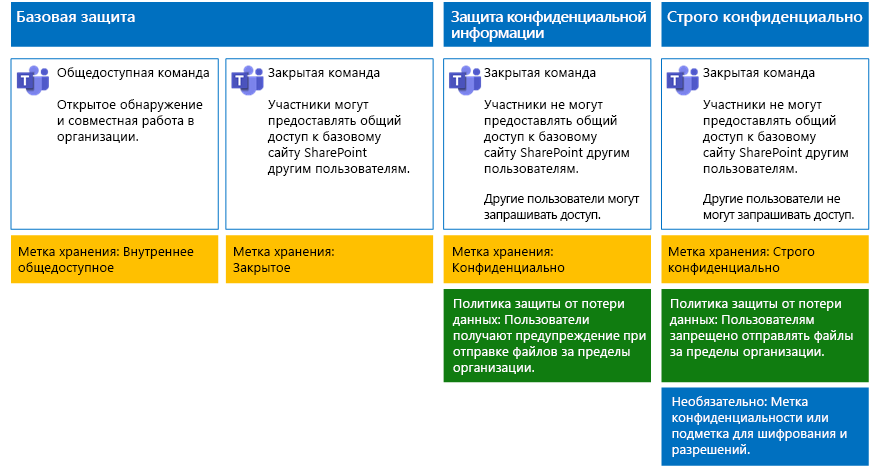

# Защита файлов в Microsoft TeamsSecure files in Microsoft Teams

В этой статье представлены рекомендации по настройке команд в Microsoft Teams и их базовых сайтов SharePoint для защиты файлов, позволяющей достичь баланса между безопасностью и удобством совместной работы.This article provides recommendations for configuring teams in Microsoft Teams and their underlying SharePoint sites for file protection that balances security with ease of collaboration. Здесь описываются четыре различных конфигурации, начиная с общедоступного сайта в организации с максимально открытыми политиками общего доступа.This article defines four different configurations, starting with a public site within your organization with the most open sharing policies. Каждая дополнительная конфигурация представляет существенное усиление защиты, но ограничивает число пользователей, у которых есть возможность доступа к файлам, хранящимся в Teams, и совместной работы с ними, соответствующим кругом участников команды.Each additional configuration represents a meaningful step up in protection, but the ability to access and collaborate on files stored within Teams is reduced to the relevant set of team members. Используйте эти рекомендации в качестве отправной точки, изменяя конфигурации в соответствии с потребностями организации.Use these recommendations as a starting point and adjust the configurations to meet the needs of your organization.

Представленные в этой статье конфигурации соответствуют приведенным ниже рекомендациям корпорации Майкрософт относительно трех уровней защиты данных, удостоверений и устройств.The configurations in this article align with Microsoft's recommendations for three tiers of protection for data, identities, and devices:

- Базовый уровень защитыBaseline protection

- Конфиденциальный уровень защитыSensitive protection

- Строго конфиденциальный уровень защитыHighly confidential protection

Дополнительные сведения об этих уровнях и рекомендуемых для каждого из них возможностях см. в следующих статьях.For more information about these tiers and capabilities recommended for each tier, see the following resources.

- [Защита идентификации и устройств для Office 365Identity and Device Protection for Office 365](https://docs.microsoft.com/office365/enterprise/microsoft-cloud-it-architecture-resources#identity-and-device-protection-for-office-365)

- [Решения для защиты файлов в Office 365File Protection Solutions in Office 365](https://docs.microsoft.com/office365/enterprise/microsoft-cloud-it-architecture-resources#file-protection-solutions-in-office-365)

## Общие сведения о возможностяхCapability overview

Рекомендации для защищенных команд опираются на различные возможности Microsoft 365.Recommendations for secured teams draw on a variety of Microsoft 365 capabilities. Рекомендуемые конфигурации проиллюстрированы ниже.The following illustration shows the recommended configurations.

Приведенная иллюстрация позволяет сделать несколько выводов.As illustrated:

- Базовая защита распространяется на общедоступные и закрытые команды.Baseline protection includes a public team and private team. Обнаруживать общедоступные команды и получать к ним доступ может любой пользователь в организации.Public teams can be discovered and accessed by anybody in the organization. Обнаруживать закрытые команды и получать к ним доступ могут только участники команды.Private teams can only be discovered and accessed by members of the team. Обе конфигурации позволяют предоставлять доступ к базовому сайту SharePoint, на котором хранятся файлы, находящиеся за пределами группы команды.Both of these configurations allow for sharing of the underlying SharePoint site on which files are stored outside the team group.

- Команды с конфиденциальным и особо конфиденциальным уровнями защиты — это закрытые команды, в которых предоставление общего доступа и запрос доступа к базовому сайту ограничены.Teams for sensitive and highly confidential protection are private teams in which sharing and the requesting of access for the underlying site is limited.

- [Метки хранения](../../compliance/labels.md) позволяют классифицировать файлы на базовых сайтах SharePoint.[Retention labels](../../compliance/labels.md) provide a way to classify files within the underlying SharePoint sites. Каждый базовый сайт SharePoint настраивается для автоматического добавления к файлам в библиотеках документов таких меток хранения, которые задаются по умолчанию.Each of the underlying SharePoint sites are configured to automatically label files in document libraries with a default retention label. В соответствии с четырьмя конфигурациями команд в этом примере используются метки "Внутренний общедоступный", "Частный", "Конфиденциальный" и "Строго конфиденциальный".Corresponding to the four team configurations, the labels in this example are Internal Public, Private, Sensitive, and Highly Confidential. Пользователи могут изменять метки отдельных файлов, но согласно этой конфигурации всем файлам будут присвоены метки по умолчанию.Users can change the labels on the individual files, but this configuration ensures all files receive a default label.

- Для меток хранения "Конфиденциальный" и "Строго конфиденциальный" настраиваются [политики защиты от потери данных](../../compliance/data-loss-prevention-policies.md). Эти политики либо предотвращают отправку, либо предупреждают пользователей, когда те пытаются отправлять файлы таких типов людям за пределами организации.[Data loss prevention](../../compliance/data-loss-prevention-policies.md) (DLP) policies are configured for the Sensitive and Highly Confidential retention labels to either warn or prevent users when they attempt to send these types of files outside the organization.

- Если это требуется для сценария, вы можете использовать [метки конфиденциальности](../../compliance/sensitivity-labels.md) для защиты файлов высокого уровня конфиденциальности с помощью шифрования и разрешений.If needed for your scenario, you can use [sensitivity labels](../../compliance/sensitivity-labels.md) to protect highly confidential files with encryption and permissions. Для клиентов Azure Information Protection можно использовать свои метки Azure Information Protection в Центре соответствия требованиям Microsoft 365, которые будут синхронизированы с порталом Azure, если вы решите выполнить дополнительную или расширенную настройку.For Azure Information Protection customers, you can use your Azure Information Protection labels in the Microsoft 365 compliance center, and your labels will be synced with the Azure portal in case you choose to perform additional or advanced configuration. Метки Azure Information Protection и метки конфиденциальности Office 365 полностью совместимы друг с другом.Azure Information Protection labels and Office 365 sensitivity labels are fully compatible with each other. Это означает, например, что при наличии контента с меткой Azure Information Protection вам не потребуется изменять классификацию или метку вашего контента.This means, for example, if you have content labeled by Azure Information Protection, you won't need to reclassify or relabel your content. Не всем клиентам нужен этот уровень защиты.Not all customers need this level of protection.

## Параметры на уровне организации для SharePoint и OneDriveOrganization-wide settings for SharePoint and OneDrive

В SharePoint и OneDrive есть параметры уровня организации, которые влияют на все сайты и всех пользователей.SharePoint and OneDrive include organization-wide settings that affect all sites and users. Некоторые из этих параметров можно настраивать на уровне сайта, чтобы установить более строгие ограничения (но не менее строгие).Some of these settings can also be adjusted at the site level to be more restrictive (but not less). В этом разделе рассматриваются параметры на уровне клиента, влияющие на безопасность и совместную работу.This section discusses tenant-wide settings that affect security and collaboration.

### Общий доступSharing

Для данного решения рекомендуем использовать следующие параметры на уровне организации:For this solution, we recommend the following organization-wide settings:

- Оставьте политику совместного доступа по умолчанию, которая разрешает делиться данными с учетными записями всех типов, в том числе анонимно.Keep the default sharing policy that allows all sharing with all account types, including anonymous sharing.

- При желании вы можете ограничить срок действия анонимных ссылок.Set anonymous links to expire, if desired.

- Измените тип связи по умолчанию для совместного доступа на "Внутренний". Это помогает избежать случайной утечки данных за пределы организации.Change the default link type for sharing to Internal. This helps prevent accidental data leakage outside your organization.

Может показаться нелогичным разрешать внешний общий доступ, но этот подход предоставляет больше контроля над доступом к файлам по сравнению с отправкой файлов по электронной почте.While it might seem counterintuitive to allow external sharing, this approach provides more control over file sharing compared to sending files in email. Вместе SharePoint и Outlook обеспечивают безопасность совместной работы с файлами.SharePoint and Outlook work together to provide secure collaboration on files.

- По умолчанию Outlook отправляет в сообщении не сам файл, а ссылку на него.By default, Outlook shares a link to a file instead of sending the file in email.

- SharePoint и OneDrive помогают отправлять ссылки на файлы участникам как в организации, так и за ее пределами.SharePoint and OneDrive make it easy to share links to files with contributors who are both inside and outside your organization

Вам также доступны средства для управления внешним общим доступом. Например, вы можете:You also have controls to help govern external sharing. For example, you can:

- отключить анонимную гостевую ссылку;Disable an anonymous guest link.

- запретить пользователю доступ к сайту;Revoke user access to a site.

- узнать, кому доступен определенный сайт или документ;See who has access to a specific site or document.

- ограничить срок действия анонимных ссылок совместного доступа (параметр клиента);Set anonymous sharing links to expire (tenant setting).

- разрешить только определенным пользователям делиться содержимым за пределами организации (параметр клиента).Limit who can share outside your organization (tenant setting).

### Использование внешнего общего доступа вместе с защитой от потери данных (DLP)Use external sharing together with data loss prevention (DLP)

Если вы не разрешите внешний общий доступ, то пользователи найдут альтернативные средства и способы. Корпорация Майкрософт рекомендует совмещать внешний общий доступ с политиками защиты от потери данных, чтобы защитить конфиденциальные и строго конфиденциальные файлы.If you don't allow external sharing, users with a business need will find alternate tools and methods. Microsoft recommends you combine external sharing with DLP policies to protect sensitive and highly confidential files.

### Параметры доступа устройствDevice access settings

С помощью параметров доступа устройств в SharePoint и OneDrive вы можете определять, разрешен ли доступ только для браузеров (файлы невозможно скачивать) или заблокирован полностью.Device access settings for SharePoint and OneDrive let you determine whether access is limited to browser only (files can't be downloaded) or if access is blocked. Дополнительные сведения см. в статье [Управление доступом с неуправляемых устройств](https://docs.microsoft.com/sharepoint/control-access-from-unmanaged-devices).For more information, see [Control access from unmanaged devices](https://docs.microsoft.com/sharepoint/control-access-from-unmanaged-devices).

Чтобы использовать параметры доступа устройств с рекомендованными политиками условного доступа в Azure Active Directory см. статью [Рекомендуемые политики для защиты сайтов и файлов SharePoint](https://docs.microsoft.com/microsoft-365/enterprise/sharepoint-file-access-policies).To use device access settings with recommended conditional access policies in Azure Active Directory, see [Policy recommendations for securing SharePoint sites and files](https://docs.microsoft.com/microsoft-365/enterprise/sharepoint-file-access-policies).

Просмотрите эти параметры, чтобы решить, хотите ли вы изменить параметры по умолчанию для сайтов OneDrive.Visit these settings to decide if you want to change the default settings for OneDrive sites. В настоящее время параметры доступа устройств и совместного доступа копируются из Центра администрирования SharePoint и применяются к обеим средам.Currently, the sharing and device access settings are duplicated from the SharePoint admin center and apply to both environments.

## Настройка команды и сайта SharePointTeam and SharePoint site configuration

В приведенной ниже таблице представлена конфигурация каждой команды и ее базового сайта SharePoint, описанных ранее в этой статье.The following table summarizes the configuration for each of the teams and their underlying SharePoint site described earlier in this article. Используйте эти конфигурации в качестве отправной точки, меняя типы и настройки сайтов в соответствии с потребностями организации.Use these configurations as starting point recommendations and adjust the site types and configurations to meet the needs of your organization. Не каждой организации необходимы команды всех типов.Not every organization needs every type of team. Большинству организаций не нужны команды со строго конфиденциальным уровнем защиты.Only a small number of organizations require teams with highly confidential protection.

||||||
|:-----|:-----|:-----|:-----|:-----|
||**Базовый уровень защиты 1****Baseline protection #1**|**Базовый уровень защиты 2****Baseline protection #2**|**Конфиденциальный уровень защиты****Sensitive protection**|**Строго конфиденциальный уровень защиты****Highly confidential**|
|ОписаниеDescription|Общедоступная команда с открытым обнаружением и совместной работой в организации.Public team with open discovery and collaboration within the organization.|Закрытая команда, которая может предоставлять доступ к базовому сайту SharePoint за пределами группы.Private team with sharing of the underlying SharePoint site allowed outside the group.|Закрытая команда, которая может предоставлять доступ к базовому сайту SharePoint только участникам сайта.Private team, but sharing of the underlying SharePoint site is only allowed to members of the site. Политика защиты от потери данных предупреждает пользователей при попытке отправить файлы за пределы организации.DLP warns users when attempting to send files outside the organization.|Закрытая команда с метками конфиденциальности для шифрования файлов и разрешениями, передаваемыми с файлом.Private team with sensitivity labels for file encryption and permissions that travel with the file. Политика защиты от потери данных запрещает пользователям отправлять файлы за пределы организации.DLP prevents users from sending files outside the organization.|
|Частный или общедоступный сайт группыPrivate or public team site|ОткрытыйPublic|ЧастныйPrivate|ЗакрытаяPrivate|ЧастныйPrivate|
|У кого есть доступ?Who has access?|У всех пользователей в организации, включая B2B-пользователей.Everybody in the organization, including B2B users.|Только у участников сайта.Members of the site only. Другие пользователи могут запрашивать доступ.Others can request access.|Только у участников команды.Members of the team only. Другие пользователи могут запрашивать доступ к базовому сайту, который утверждается владельцем команды.Others can request access to the underlying site, which is approved by a team owner.|Только у участников.Members only. Другие пользователи не могут запрашивать доступ к базовому сайту.Others cannot request access to the underlying site.|
|Средства управления совместным доступом на уровне сайтаSite-level sharing controls|Предоставлять доступ можно всем пользователям. Параметры по умолчанию.Sharing allowed with anybody. Default settings.|Предоставлять доступ можно всем пользователям. Параметры по умолчанию.Sharing allowed with anybody. Default settings.|Участники не могут предоставлять доступ к сайту.Members cannot share access to the site.   Пользователи, не являющиеся участниками, могут запрашивать доступ к сайту, но эти запросы должен рассматривать владелец группы команды.Non-members can request access to the site, but these requests need to be addressed by a group owner for the team.|Участники не могут предоставлять доступ к сайту.Members cannot share access to the site.   Пользователи, не являющиеся участниками, не могут запрашивать доступ к сайту или его содержимому.Non-members cannot request access to the site or its contents.|
|Средства управления доступом к устройствам на уровне сайтаSite-level device access controls|Дополнительные средства управления отсутствуют.No additional controls.|Дополнительные средства управления отсутствуют.No additional controls.|Запрещает пользователям скачивать файлы на устройства, которые не соответствуют требованиям или не присоединены к домену. Это позволяет получать доступ только с помощью браузера на всех остальных устройствах.Prevents users from downloading files to non-compliant or non-domain joined devices. This allows browser-only access from all other devices.|Блокирует скачивание файлов на устройства, которые не соответствуют требованиям или не присоединены к домену.Block downloading of files to non-compliant or non-domain joined devices.|
|Метки храненияRetention labels|Внутренний общедоступныйInternal Public|ЧастныйPrivate|КонфиденциальныйSensitive|Строго конфиденциальноHighly Confidential|
|Политики защиты от потери данныхDLP policies|||Предупреждает пользователей об отправке файлов, помеченных как конфиденциальные, людям за пределами организации.Warn users when sending files that are labeled as Sensitive outside the organization.   Чтобы заблокировать внешний общий доступ к данным конфиденциальных типов, таким как номера кредитных карт и другие персональные данные, вы можете настроить дополнительные политики защиты от потери данных для этих типов данных (в том числе для настроенных вами типов данных).To block external sharing of sensitive data types, such as credit card numbers or other personal data, you can configure additional DLP policies for these data types (including custom data types you configure).|Блокирует отправку пользователями файлов, помеченных как строго конфиденциальные, людям за пределами организации. Разрешает пользователям переопределять запрет, указывая обоснование, в том числе сведения о том человеке, которому предоставляется доступ.Block users from sending files that are labeled as highly confidential outside organization. Allow users to override this by providing justification, including who they are sharing the file with.|
|Метки конфиденциальностиSensitivity labels||||Метки конфиденциальности используются для шифрования файлов и предоставления разрешений на доступ к ним.Use sensitivity labels to encrypt and grant permissions to files. Эта защита файлов продолжает действовать в случае их утечки с базового сайта SharePoint.This protection travels with the files in case they are leaked from the underlying SharePoint site.|

Шаги по развертыванию четырех разных типов команд в этом решении см. в разделе [Развертывание команд с тремя уровнями защиты файлов](deploy-teams-three-tiers.md).For the steps to deploy the four different types of teams in this solution, see [Deploy teams for three tiers of protection for files](deploy-teams-three-tiers.md).

## Метки хранения Office 365Office 365 retention labels

Для сред с конфиденциальными данными рекомендуется использовать метки хранения.Using retention labels is recommended for environments with sensitive data. После настройки и публикации меток хранения:After you configure and publish retention labels:

- Вы можете применить метку по умолчанию для библиотеки документов на базовом сайте команды SharePoint, чтобы все документы в разделе **Файлы** этой команды получили эту метку.You can apply a default label to a document library in the underlying SharePoint site for a team, so that all documents in the **Files** section of the team get the default label.

- Вы можете обеспечить автоматическое применение меток к содержимому, если оно соответствует определенным условиям.You can apply labels to content automatically if it matches specific conditions.

- Вы можете применять политики защиты от потери данных, основанные на метках хранения.You can apply DLP policies that are based on retention labels.

- Сотрудники вашей организации могут вручную присваивать метки содержимому в Outlook в Интернете, Outlook 2010 и более поздних версиях, OneDrive, SharePoint и группах Office 365.People in your organization can apply a label manually to content in Outlook on the web, Outlook 2010 and later, OneDrive, SharePoint, and Office 365 groups. Пользователи часто знают лучше других, с каким содержимым они работают, поэтому могут классифицировать его и применять соответствующие политики защиты от потери данных.Users often know best what type of content they're working with, so they can classify it and have the appropriate DLP policy applied.

Как показано на иллюстрации, это решение включает создание следующих меток хранения:As illustrated, this solution includes creating the following retention labels:

- Строго конфиденциальныйHighly Confidential

- КонфиденциальныйSensitive

- ЧастныйPrivate

- Внутренний общедоступныйInternal Public

Эти метки сопоставляются с рекомендуемыми сайтами на иллюстрациях и диаграммах, представленных выше в этой статье. Для данного решения рекомендуется настроить политики защиты от потери данных, чтобы предотвратить утечку конфиденциальных и строго конфиденциальных файлов.These labels are mapped to the recommended sites in the illustrations and charts earlier in this article. This solution recommends configuring DLP policies to help prevent the leakage of files labeled as Sensitive and Highly Confidential.

Шаги по настройке меток хранения и политик защиты от потери данных в этом решении см. в разделе [Защита файлов в командах с помощью меток хранения и политики защиты от потери данных](deploy-teams-retention-DLP.md).For the steps to configure retention labels and DLP policies in this solution, see [Protect files in teams with retention labels and DLP](deploy-teams-retention-DLP.md).

## Метки конфиденциальностиSensitivity labels

Если это оправдано для сценария безопасности, вы можете применять метки конфиденциальности к файлу, продолжающие действовать, где бы он ни находился.If warranted for your security scenario, you can use sensitivity labels to apply protections that follow the files wherever they go. Метки конфиденциальности в Центре соответствия требованиям Microsoft 365 и метки Azure Information Protection одинаковы.Sensitivity labels in the Microsoft 365 compliance center and Azure Information Protection labels are the same. Для данного решения рекомендуем использовать метку конфиденциальности или вложенную метку, чтобы шифровать файлы, требующие самой надежной защиты, и предоставлять разрешения на доступ к этим файлам.For this solution, we recommend you use a sensitivity label or sublabel to encrypt and grant permissions to files that need to be protected with the highest level of security.

Дополнительные сведения см. в статье [Обзор меток конфиденциальности](../../compliance/sensitivity-labels.md).For more information, see [Overview of sensitivity labels](../../compliance/sensitivity-labels.md).

Сведения о том, как настроить метки конфиденциальности в этом решении, см. в статье [Защита файлов в командах с помощью меток конфиденциальности](deploy-teams-sensitivity-labels.md).For the steps to configure sensitivity labels in this solution, see [Protect files in teams with sensitivity labels](deploy-teams-sensitivity-labels.md).

## См. такжеSee also

[Освоение облака и гибридные решенияCloud adoption and hybrid solutions](https://docs.microsoft.com/office365/enterprise/cloud-adoption-and-hybrid-solutions)
