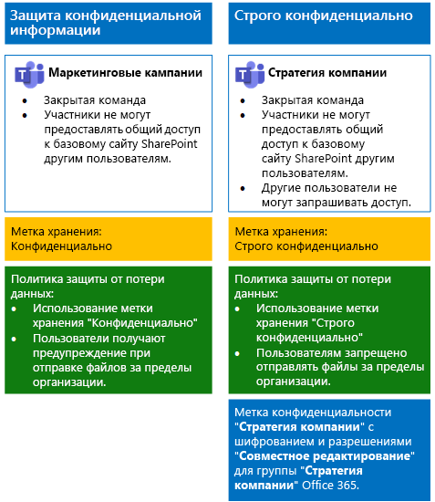
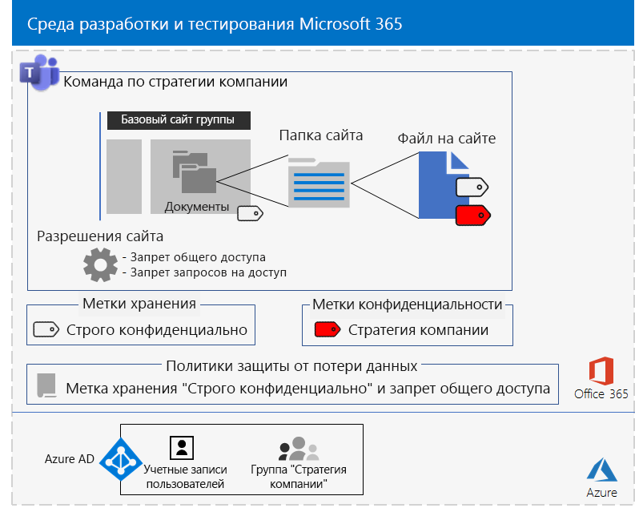

# <a name="secure-teams-for-files-in-a-devtest-environment"></a>Защита файлов в среде разработки и тестирования в Teams

В этой статье приведены пошаговые инструкции по созданию среды разработки и тестирования, включающей конфиденциальные и строго конфиденциальные команды для решения [защиты файлов в Microsoft Teams](secure-files-in-teams.md).



В этой среде разработки и тестирования можно экспериментировать и настраивать параметры согласно вашим потребностям, прежде чем развертывать соответствующие команды в рабочей среде.

## <a name="phase-1-build-out-your-microsoft-365-enterprise-test-environment"></a>Этап 1. Создание собственной тестовой среды Microsoft 365 корпоративный

Если вы хотите просто протестировать конфиденциальные и строго конфиденциальные команды в простой конфигурации с минимальными требованиями, см. инструкции в статье [Простая базовая конфигурация](https://docs.microsoft.com/microsoft-365/enterprise/lightweight-base-configuration-microsoft-365-enterprise).

Если вы хотите протестировать конфиденциальные и строго конфиденциальные команды в эмулированной корпоративной среде, см. инструкции в статье о [синхронизации хэшей паролей](https://docs.microsoft.com/microsoft-365/enterprise/password-hash-sync-m365-ent-test-environment).

>[!Note]
>Для тестирования конфиденциальных и строго конфиденциальных команд не требуется эмулированная корпоративная тестовая среда, включающая эмулированную интрасеть, подключенную к Интернету, и функцию синхронизации каталогов для леса доменных служб Active Directory (AD DS). Здесь эта возможность показана как дополнительная, чтобы вы могли тестировать конфиденциальные и строго конфиденциальные команды и экспериментировать с ними в среде, которая представляет обычную организацию.
>

## <a name="phase-2-create-and-configure-your-azure-active-directory-ad-groups-and-users"></a>Этап 2. Создание и настройка групп и пользователей Azure Active Directory (AD)

На этом этапе вы создадите и настроите группы и пользователей Azure AD для вымышленной организации.

Прежде всего создайте две группы для типичной организации на портале Azure.

1. Откройте отдельную вкладку в браузере, а затем перейдите на портал Azure по адресу [https://portal.azure.com](https://portal.azure.com). Если необходимо, выполните вход с использованием данных учетной записи глобального администратора для вашей пробной или оплаченной подписки Microsoft 365 E5.

2. На портале Azure выберите **Azure Active Directory > Группы**.

3. В колонке **Группы — Все группы** выберите пункт **+ Создать группу**.

4. В колонке **Группа**:

   - В разделе **Тип группы** выберите **Безопасность**.

   - Введите **Топ-менеджмент** в поле **Имя**.

   - Выберите **Назначенные** в поле **Тип членства**.

5. Нажмите кнопку **Создать**, а затем закройте колонку **Группа**.

6. Выполните действия 3–5 для новой группы с названием **Персонал отдела маркетинга**.

После этого настройте автоматическое лицензирование, чтобы членам групп автоматически назначались лицензии для подписок Microsoft 365 и EMS.

1. На портале Azure последовательно выберите **Azure Active Directory > Лицензии > Все продукты**.

2. В списке выберите **Microsoft 365 корпоративный E5** и щелкните **Назначить**.

3. В колонке **Назначение лицензии** щелкните **Пользователи и группы**.

4. В списке групп выберите следующие элементы:

   - Топ-менеджмент

   - Персонал отдела маркетинга

5. Выберите **Выбрать** > **Назначить**.

6. Закройте вкладку портала Azure в браузере.

Далее вы [подключитесь к модулю PowerShell Azure Active Directory для Graph](https://docs.microsoft.com/office365/enterprise/powershell/connect-to-office-365-powershell#connect-with-the-azure-active-directory-powershell-for-graph-module).

Введите название организации, адрес и общий пароль и выполните эти команды в командной строке PowerShell или интегрированной среде сценариев (ISE), чтобы создать учетные записи пользователей и добавить их в свои группы:

```powershell
$orgName="<organization name, such as contoso for the contoso.onmicrosoft.com trial subscription domain name>"
$location="<the ISO ALPHA2 country code, such as US for the United States>"
$commonPassword="<common password for all the new accounts>"

$PasswordProfile=New-Object -TypeName Microsoft.Open.AzureAD.Model.PasswordProfile
$PasswordProfile.Password=$commonPassword

$groupName="C-Suite"
$userNames=@("CEO","CFO","CIO")
$groupID=(Get-AzureADGroup | Where { $_.DisplayName -eq $groupName }).ObjectID
ForEach ($element in $userNames){
New-AzureADUser -DisplayName $element -PasswordProfile $PasswordProfile -UserPrincipalName ($element + "@" + $orgName + ".onmicrosoft.com") -AccountEnabled $true -MailNickName $element -UsageLocation $location
Add-AzureADGroupMember -RefObjectId (Get-AzureADUser | Where { $_.DisplayName -eq $element }).ObjectID -ObjectId $groupID
}
$groupName="Marketing staff"
$userNames=@("Marketing1", "Marketing2")
$groupID=(Get-AzureADGroup | Where { $_.DisplayName -eq $groupName }).ObjectID
ForEach ($element in $userNames){
New-AzureADUser -DisplayName $element -PasswordProfile $PasswordProfile -UserPrincipalName ($element + "@" + $orgName + ".onmicrosoft.com") -AccountEnabled $true -MailNickName $element -UsageLocation $location
Add-AzureADGroupMember -RefObjectId (Get-AzureADUser | Where { $_.DisplayName -eq $element }).ObjectID -ObjectId $groupID
}
```

> [!NOTE]
> Общий пароль используется для автоматизации и упрощения конфигурации среды разработки и тестирования. Очевидно, что это не рекомендуется в производственных подписках.

Выполните указанные ниже действия, чтобы убедиться, что лицензирование на основе групп работает должным образом.

1. На вкладке браузера **Домашняя страница Microsoft Office** щелкните плитку **Администрирование**.

2. На новой вкладке браузера**Центр администрирования Microsoft 365** щелкните **Пользователи**.

3. В списке пользователей выберите **Генеральный директор**.

4. В области, в которой расположен список свойств учетной записи пользователя **Генеральный директор**, проверьте, что этой учетной записи назначена лицензия **Microsoft 365 корпоративный E5** (в списке **Лицензии на продукты**).

## <a name="phase-3-create-retention-labels"></a>Этап 3. Создание меток хранения.

На этом этапе необходимо создать метки хранения разных уровней защиты для базовых папок документов на сайте SharePoint.

1. Выполните вход на [портал соответствия требованиям Microsoft 365](https://compliance.microsoft.com), использую свою учетную запись глобального администратора.

2. На вкладке **Главная — соответствие требованиям Microsoft 365** в браузере выберите пункты **Классификации > Метки**.

3. Щелкните **Метки хранения > Создать метку**.

4. В области **Назовите метку** в поле **Назовите метку** введите **Конфиденциально** и щелкните **Далее**.

5. В области **Дескрипторы плана файлов** нажмите кнопку **Далее**.

6. В области **Параметры метки** при необходимости установите параметр **Хранение** в положение **Вкл.** и нажмите кнопку **Далее**.

7. В области **Проверьте параметры** нажмите кнопку **Создать эту метку**.

8. Выполните действия 3–7 для дополнительной метки хранения **Строго конфиденциально**.

9. В области **Главная > Метки** щелкните **Опубликовать метки**.

10. В области **Выберите метки для публикации** щелкните **Выберите метки для публикации**.

11. В области **Выбор меток** нажмите кнопку **Добавить** и выберите все четыре метки.

12. Нажмите кнопку **Готово**.

13. В области **Выберите метки для публикации** нажмите кнопку **Далее**.

14. В области **Выберите расположения** нажмите кнопку **Далее**.

15. В области **Укажите имя для политики** введите **Пример организации** в поле **Имя** и нажмите кнопку **Далее**.

16. В области **Проверьте параметры** последовательно нажмите кнопки **Опубликовать метки** и **Закрыть**.

## <a name="phase-4-create-your-teams"></a>Этап 4. Создание команд

На этом этапе можно создать и настроить конфиденциальные и строго конфиденциальные команды для вашего примера организации.

### <a name="sensitive-team-for-marketing-campaigns"></a>Конфиденциальная команда для маркетинговых кампаний

Чтобы создать команду конфиденциального уровня для участников маркетинговой группы (чтобы они могли совместно работать над текущими маркетинговыми кампаниями), выполните указанные ниже действия.

1. [Создайте закрытую команду](https://support.microsoft.com/office/174adf5f-846b-4780-b765-de1a0a737e2b) с именем **Маркетинговые кампании**.
2. Откройте команду **Маркетинговые кампании**.
3. На панели инструментов для команды щелкните **Файлы**.
4. Щелкните многоточие, а затем — **Открыть в SharePoint**.
5. На панели инструментов базового сайта SharePoint щелкните значок параметров и выберите вариант **Разрешения для сайта**.
6. В области **Разрешения для сайта** в разделе **Параметры общего доступа** щелкните **Изменить параметры общего доступа**.
7. В разделе **Разрешения на предоставление общего доступа** выберите **Только владельцы сайта могут делиться файлами, папками и сайтом** и щелкните **Сохранить**.

Теперь настройте папку документов базового сайта SharePoint "Маркетинговые кампании" для использования метки "Конфиденциально".

1. На вкладке браузера **Маркетинговые кампании — главная** щелкните **Документы**.
2. Щелкните значок параметров и выберите **Параметры библиотеки**.
3. В разделе **Разрешения и управление** нажмите кнопку **Применить метку к элементам в этой библиотеке**.
4. В разделе **Параметры — применение метки** выберите метку **Конфиденциальный** и нажмите кнопку **Сохранить**.

Затем настройте политику защиты от потери данных (DLP), которая предупреждает пользователей, когда они предоставляют общий доступ к документу на базовом сайте SharePoint с меткой "Конфиденциально" (в число таких сайтов входит сайт "Маркетинговые кампании") людям за пределами организации.

1. Войдите на [портал соответствия требованиям Microsoft 365](https://compliance.microsoft.com/) с помощью учетной записи глобального администратора.

2. На новой вкладке **Соответствие требованиям Microsoft 365** в браузере выберите пункты **Политики > Защита от потери данных**.

3. В области **Главная > Защита от потери данных** нажмите кнопку **Создание политики**.

4. В области **Начать с шаблона или создать настраиваемую политику** выберите **Настраиваемая**, а затем нажмите кнопку **Далее**.

5. В области **Назовите политику** в поле **Имя** введите **Сайты групп SharePoint с меткой "Конфиденциально"**, а затем нажмите кнопку **Далее**.

6. В области **Выберите расположения** щелкните **Позволить мне выбрать расположения** и нажмите кнопку **Далее**.

7. В списке расположений отключите параметры **Электронная почта Exchange**, **Учетные записи OneDrive** и **Сообщения из чатов и каналов Teams**, а затем нажмите кнопку **Далее**.

8. В области **Выберите тип содержимого, которое вы хотите защитить** щелкните ссылку **Изменить**.

9. В области **Выбрать типы содержимого для защиты** выберите **Добавить** в раскрывающемся списке, а затем выберите **Метки хранения**.

10. В области **Метки хранения** нажмите кнопку **Добавить**, укажите метку **Конфиденциальный** и последовательно нажмите кнопки **Добавить** > **Готово**.

11. В области **Выбрать типы содержимого для защиты** нажмите кнопку **Сохранить**.

12. В области **Выберите тип содержимого, которое вы хотите защитить** нажмите кнопку **Далее**.

13. В области **Что необходимо делать, если мы обнаружим конфиденциальные сведения?** щелкните **Настройка подсказки и уведомления**.

14. В области **Настройка подсказок политики и уведомлений по электронной почте** щелкните **Измените текст подсказки политики**.

15. В текстовом поле введите или вставьте следующее:

    Чтобы предоставить доступ пользователю за пределами организации, скачайте файл и откройте его. Выберите пункты "Файл > Защитить документ > Зашифровать паролем", а затем укажите надежный пароль. Отправьте пароль в отдельном сообщении или с помощью других средств связи.

16. Нажмите кнопку **ОК**.

17. В области **Что необходимо делать, если мы обнаружим конфиденциальные сведения?** нажмите кнопку **Далее**.

18. В области **Вы хотите включить политику или сначала проверить, как все работает?** выберите пункт **Да, включить сразу**, а затем нажмите кнопку **Далее**.

19. В области **Проверка параметров** нажмите **Создать**, а затем нажмите кнопку **Закрыть**.

Ниже приведена итоговая конфигурация для команды "Маркетинговые кампании".


### <a name="company-strategy-team-site"></a>Сайт команды "Стратегия компании"

Чтобы создать команду строго конфиденциального уровня для участников команды "Старшие руководители" для совместной работы над стратегией компании, выполните указанные ниже действия.

1. [Создайте закрытую команду](https://support.microsoft.com/office/174adf5f-846b-4780-b765-de1a0a737e2b) с именем **Стратегия компании**.
2. Откройте команду **Стратегия компании**.
3. На панели инструментов для команды щелкните **Файлы**.
4. Щелкните многоточие, а затем — **Открыть в SharePoint**.
5. На панели инструментов базового сайта SharePoint щелкните значок параметров и выберите вариант **Разрешения для сайта**.
6. В области **Разрешения для сайта** в разделе **Параметры общего доступа** щелкните **Изменить параметры общего доступа**.
7. В разделе **Разрешения на предоставление общего доступа** установите флажок **Только владельцы сайта могут делиться файлами, папками и сайтом**.
8. Отключите параметр **Разрешить запросы на доступ** и нажмите кнопку **Сохранить**.

Затем настройте папку документов на базовом сайте SharePoint "Стратегия компании" для метки "Строго конфиденциально".

1. На вкладке браузера **Стратегия организации — главная** щелкните **Документы**.
2. Щелкните значок параметров и выберите **Параметры библиотеки**.
3. В разделе **Разрешения и управление** нажмите кнопку **Применить метку к элементам в этой библиотеке**.
4. В разделе **Параметры — применение метки** выберите метку **Строго конфиденциальный** и нажмите кнопку **Сохранить**.

Затем настройте политику защиты от потери данных (DLP), которая блокирует пользователей, когда они предоставляют общий доступ к документу на базовом сайте SharePoint с меткой "Строго конфиденциально" (в число таких сайтов входит сайт "Стратегия организации") людям, находящимся за пределами организации.

1. Войдите на [портал соответствия требованиям Microsoft 365](https://compliance.microsoft.com/) с использованием данных глобального администратора.

2. На новой вкладке **Соответствие требованиям Microsoft 365** в браузере выберите пункты **Политики > Защита от потери данных**.

3. В области **Главная > Защита от потери данных** нажмите кнопку **Создание политики**.

4. В области **Начать с шаблона или создать настраиваемую политику** выберите **Настраиваемая**, а затем нажмите кнопку **Далее**.

5. В области **Назовите политику** в поле **Имя** введите **Сайты SharePoint с меткой "Строго конфиденциально"**, а затем нажмите кнопку **Далее**.

6. В области **Выберите расположения** щелкните **Позволить мне выбрать расположения** и нажмите кнопку **Далее**.

7. В списке расположений отключите параметры **Электронная почта Exchange**, **Учетные записи OneDrive** и **Сообщения из чатов и каналов Teams**, а затем нажмите кнопку **Далее**.

8. В области **Выберите тип содержимого, которое вы хотите защитить** щелкните ссылку **Изменить**.

9. В области **Выбрать типы содержимого для защиты** выберите **Добавить** в раскрывающемся списке, а затем выберите **Метки хранения**.

10. В области **Метки хранения** нажмите кнопку **Добавить**, укажите метку **Строго конфиденциальный** и последовательно нажмите кнопки **Добавить** > **Готово**.

11. В области **Выбрать типы содержимого для защиты** нажмите кнопку **Сохранить**.

12. В области **Выберите тип содержимого, которое вы хотите защитить** нажмите кнопку **Далее**.

13. В области **Что необходимо делать, если мы обнаружим конфиденциальные сведения?** щелкните **Настройка подсказки и уведомления**.

14. В области **Настройка подсказок политики и уведомлений по электронной почте** щелкните **Измените текст подсказки политики**.

15. В текстовом поле введите или вставьте следующее:

    Чтобы предоставить доступ пользователю за пределами организации, скачайте файл и откройте его. Выберите пункты "Файл > Защитить документ > Зашифровать паролем", а затем укажите надежный пароль. Отправьте пароль в отдельном сообщении или с помощью других средств связи.

16. Нажмите кнопку **ОК**.

17. В области **Включить политику или сначала протестировать ее?** выберите пункт **Да, включить ее сразу**, а затем нажмите кнопку **Далее**.

18. В области **Включить политику или сначала протестировать ее?** выберите пункт **Да, включить ее сразу**, а затем нажмите кнопку **Далее**.

19. В области **Проверка параметров** нажмите **Создать**, а затем нажмите кнопку **Закрыть**.

Следуя [этим инструкциям](https://docs.microsoft.com/microsoft-365/compliance/encryption-sensitivity-labels), настройте отдельную конфиденциальности метку с указанными ниже параметрами.

- Название метки: "Стратегия компании"
- Шифрование включено
- У группы "Стратегия компании" имеются разрешения на совместное редактирование

После создания метки опубликуйте ее. Если вы войдете в систему в качестве участника группы "Стратегия компании", новая метка отобразится в параметре "Конфиденциальность" на панели инструментов "Главная" в Word, Excel и PowerPoint. Чтобы назначить метку "Стратегия компании" файлу, выберите ее в параметре "Конфиденциальность".

Ниже приведена итоговая конфигурация для команды "Стратегия компании".



Файлам в разделе документов базового сайта SharePoint "Стратегия компании" назначена метка хранения "Строго конфиденциально", и на них распространяется действие настроенной политики DLP. Файлам также можно назначить метку "Стратегия компании".

## <a name="next-step"></a>Следующее действие

Когда вы будете готовы выполнить развертывание в рабочей среде, изучите подробные сведения и ссылки на статьи с пошаговыми инструкциями по развертыванию, приведенные в статье [Защита файлов в Microsoft Teams](secure-files-in-teams.md).

## <a name="see-also"></a>См. также

[Освоение облака и гибридные решения](https://docs.microsoft.com/office365/enterprise/cloud-adoption-and-hybrid-solutions)
