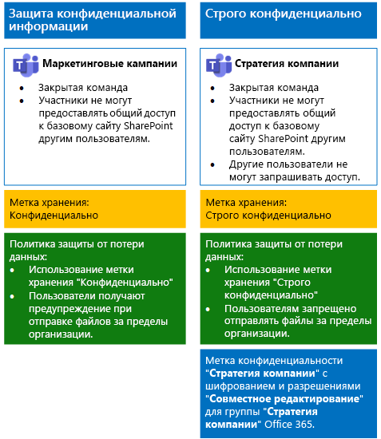
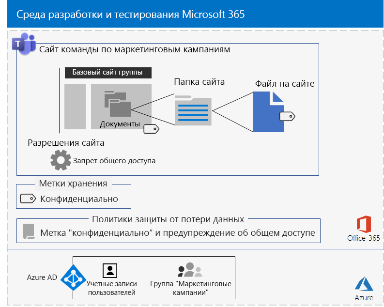

# <a name="secure-teams-for-files-in-a-devtest-environment"></a><span data-ttu-id="af4cf-103">Защита файлов в среде разработки и тестирования в Teams</span><span class="sxs-lookup"><span data-stu-id="af4cf-103">Secure Teams for files in a dev/test environment</span></span>

<span data-ttu-id="af4cf-104">В этой статье приведены пошаговые инструкции по созданию среды разработки и тестирования, включающей конфиденциальные и строго конфиденциальные команды для решения [защиты файлов в Microsoft Teams](secure-files-in-teams.md).</span><span class="sxs-lookup"><span data-stu-id="af4cf-104">This article provides step-by-step instructions to create a dev/test environment that includes the sensitive and highly confidential teams for the [Secure files in Microsoft Teams](secure-files-in-teams.md) solution.</span></span>
  

  
<span data-ttu-id="af4cf-106">В этой среде разработки и тестирования можно экспериментировать и настраивать параметры согласно вашим потребностям, прежде чем развертывать соответствующие команды в рабочей среде.</span><span class="sxs-lookup"><span data-stu-id="af4cf-106">Use this dev/test environment to experiment and fine-tune settings for your specific needs before deploying these types of teams in production.</span></span>
  
## <a name="phase-1-build-out-your-microsoft-365-enterprise-test-environment"></a><span data-ttu-id="af4cf-107">Этап 1. Создание собственной тестовой среды Microsoft 365 корпоративный</span><span class="sxs-lookup"><span data-stu-id="af4cf-107">Phase 1: Build out your Microsoft 365 Enterprise test environment</span></span>

<span data-ttu-id="af4cf-108">Если вы хотите просто протестировать конфиденциальные и строго конфиденциальные команды в простой конфигурации с минимальными требованиями, см. инструкции в статье [Простая базовая конфигурация](https://docs.microsoft.com/microsoft-365/enterprise/lightweight-base-configuration-microsoft-365-enterprise).</span><span class="sxs-lookup"><span data-stu-id="af4cf-108">If you just want to test sensitive and highly confidential teams in a lightweight way with the minimum requirements, follow the instructions in [Lightweight base configuration](https://docs.microsoft.com/microsoft-365/enterprise/lightweight-base-configuration-microsoft-365-enterprise).</span></span>

<span data-ttu-id="af4cf-109">Если вы хотите протестировать конфиденциальные и строго конфиденциальные команды в эмулированной корпоративной среде, см. инструкции в статье о [синхронизации хэшей паролей](https://docs.microsoft.com/microsoft-365/enterprise/password-hash-sync-m365-ent-test-environment).</span><span class="sxs-lookup"><span data-stu-id="af4cf-109">If you want to test sensitive and highly confidential teams in a simulated enterprise, follow the instructions in [Password hash synchronization](https://docs.microsoft.com/microsoft-365/enterprise/password-hash-sync-m365-ent-test-environment).</span></span>

>[!Note]
><span data-ttu-id="af4cf-110">Для тестирования конфиденциальных и строго конфиденциальных команд не требуется эмулированная корпоративная тестовая среда, включающая эмулированную интрасеть, подключенную к Интернету, и функцию синхронизации каталогов для леса доменных служб Active Directory (AD DS).</span><span class="sxs-lookup"><span data-stu-id="af4cf-110">Testing sensitive and highly confidential teams does not require the simulated enterprise test environment, which includes a simulated intranet connected to the Internet and directory synchronization for an Active Directory Domain Services (AD DS) forest.</span></span> <span data-ttu-id="af4cf-111">Здесь эта возможность показана как дополнительная, чтобы вы могли тестировать конфиденциальные и строго конфиденциальные команды и экспериментировать с ними в среде, которая представляет обычную организацию.</span><span class="sxs-lookup"><span data-stu-id="af4cf-111">It is provided here as an option so that you can test sensitive and highly confidential teams and experiment with it in an environment that represents a typical organization.</span></span>
>
    
## <a name="phase-2-create-and-configure-your-azure-active-directory-ad-groups-and-users"></a><span data-ttu-id="af4cf-112">Этап 2. Создание и настройка групп и пользователей Azure Active Directory (AD)</span><span class="sxs-lookup"><span data-stu-id="af4cf-112">Phase 2: Create and configure your Azure Active Directory (AD) groups and users</span></span>

<span data-ttu-id="af4cf-113">На этом этапе вы создадите и настроите группы и пользователей Azure AD для вымышленной организации.</span><span class="sxs-lookup"><span data-stu-id="af4cf-113">In this phase, you create and configure the Azure AD groups and users for your fictional organization.</span></span>
  
<span data-ttu-id="af4cf-114">Прежде всего создайте две группы для типичной организации на портале Azure.</span><span class="sxs-lookup"><span data-stu-id="af4cf-114">First, create two groups for a typical organization with the Azure portal.</span></span>
  
1. <span data-ttu-id="af4cf-115">Откройте отдельную вкладку в браузере, а затем перейдите на портал Azure по адресу [https://portal.azure.com](https://portal.azure.com).</span><span class="sxs-lookup"><span data-stu-id="af4cf-115">Create a separate tab in your browser, and then go to the Azure portal at [https://portal.azure.com](https://portal.azure.com).</span></span> <span data-ttu-id="af4cf-116">Если необходимо, выполните вход с использованием данных учетной записи глобального администратора для вашей пробной или оплаченной подписки Microsoft 365 E5.</span><span class="sxs-lookup"><span data-stu-id="af4cf-116">If needed, sign in with the credentials of the global administrator account for your Microsoft 365 E5 trial or paid subscription.</span></span>
    
2. <span data-ttu-id="af4cf-117">На портале Azure выберите **Azure Active Directory > Группы**.</span><span class="sxs-lookup"><span data-stu-id="af4cf-117">In the Azure portal, click **Azure Active Directory > Groups**.</span></span>
    
3. <span data-ttu-id="af4cf-118">В колонке **Группы — Все группы** выберите пункт **+ Создать группу**.</span><span class="sxs-lookup"><span data-stu-id="af4cf-118">On the **Groups - All groups** blade, click **+ New group**.</span></span>
    
4. <span data-ttu-id="af4cf-119">В колонке **Группа**:</span><span class="sxs-lookup"><span data-stu-id="af4cf-119">On the **Group** blade:</span></span>
    
  - <span data-ttu-id="af4cf-120">В разделе **Тип группы** выберите **Безопасность**.</span><span class="sxs-lookup"><span data-stu-id="af4cf-120">Select **Security** in **Group type**.</span></span>
    
  - <span data-ttu-id="af4cf-121">Введите **Топ-менеджмент** в поле **Имя**.</span><span class="sxs-lookup"><span data-stu-id="af4cf-121">Type **C-Suite** in **Name**.</span></span>
    
  - <span data-ttu-id="af4cf-122">Выберите **Назначенные** в поле **Тип членства**.</span><span class="sxs-lookup"><span data-stu-id="af4cf-122">Select **Assigned** in **Membership type**.</span></span>
      
5. <span data-ttu-id="af4cf-123">Нажмите кнопку **Создать**, а затем закройте колонку **Группа**.</span><span class="sxs-lookup"><span data-stu-id="af4cf-123">Click **Create**, and then close the **Group** blade.</span></span>
    
6.  <span data-ttu-id="af4cf-124">Выполните действия 3–5 для новой группы с названием **Персонал отдела маркетинга**.</span><span class="sxs-lookup"><span data-stu-id="af4cf-124">Repeat steps 3-5 for a new following group named **Marketing staff**.</span></span>
    
<span data-ttu-id="af4cf-125">После этого настройте автоматическое лицензирование, чтобы членам групп автоматически назначались лицензии на подписки Office 365 и EMS.</span><span class="sxs-lookup"><span data-stu-id="af4cf-125">Next, you configure automatic licensing so that members of your groups are automatically assigned licenses for your Office 365 and EMS subscriptions.</span></span>
  
1. <span data-ttu-id="af4cf-126">На портале Azure последовательно выберите **Azure Active Directory > Лицензии > Все продукты**.</span><span class="sxs-lookup"><span data-stu-id="af4cf-126">In the Azure portal, click **Azure Active Directory > Licenses > All products**.</span></span>
    
2. <span data-ttu-id="af4cf-127">В списке выберите **Microsoft 365 корпоративный E5** и щелкните **Назначить**.</span><span class="sxs-lookup"><span data-stu-id="af4cf-127">In the list, select **Microsoft 365 Enterprise E5**, and then click **Assign**.</span></span>
    
3. <span data-ttu-id="af4cf-128">В колонке **Назначение лицензии** щелкните **Пользователи и группы**.</span><span class="sxs-lookup"><span data-stu-id="af4cf-128">In the **Assign license** blade, click **Users and groups**.</span></span>
    
4. <span data-ttu-id="af4cf-129">В списке групп выберите следующие элементы:</span><span class="sxs-lookup"><span data-stu-id="af4cf-129">In the list of groups, select the following:</span></span>
    
  - <span data-ttu-id="af4cf-130">Топ-менеджмент</span><span class="sxs-lookup"><span data-stu-id="af4cf-130">C-Suite</span></span>
    
  - <span data-ttu-id="af4cf-131">Персонал отдела маркетинга</span><span class="sxs-lookup"><span data-stu-id="af4cf-131">Marketing staff</span></span>
    
5. <span data-ttu-id="af4cf-132">Выберите **Выбрать** > **Назначить**.</span><span class="sxs-lookup"><span data-stu-id="af4cf-132">Click **Select**, and then click **Assign**.</span></span>
    
6. <span data-ttu-id="af4cf-133">Закройте вкладку портала Azure в браузере.</span><span class="sxs-lookup"><span data-stu-id="af4cf-133">Close the Azure portal tab in your browser.</span></span>
    
<span data-ttu-id="af4cf-134">Далее вы [подключитесь к модулю PowerShell Azure Active Directory для Graph](https://docs.microsoft.com/office365/enterprise/powershell/connect-to-office-365-powershell#connect-with-the-azure-active-directory-powershell-for-graph-module).</span><span class="sxs-lookup"><span data-stu-id="af4cf-134">Next, you [Connect with the Azure Active Directory PowerShell for Graph module ](https://docs.microsoft.com/office365/enterprise/powershell/connect-to-office-365-powershell#connect-with-the-azure-active-directory-powershell-for-graph-module).</span></span>
  
<span data-ttu-id="af4cf-135">Введите название организации, адрес и общий пароль и выполните эти команды в командной строке PowerShell или интегрированной среде сценариев (ISE), чтобы создать учетные записи пользователей и добавить их в свои группы:</span><span class="sxs-lookup"><span data-stu-id="af4cf-135">Fill in your organization name, your location, and a common password, and then run these commands from the PowerShell command prompt or Integrated Script Environment (ISE) to create user accounts and add them to their groups:</span></span>
  
```
$orgName="<organization name, such as contoso for the contoso.onmicrosoft.com trial subscription domain name>"
$location="<the ISO ALPHA2 country code, such as US for the United States>"
$commonPassword="<common password for all the new accounts>"

$PasswordProfile=New-Object -TypeName Microsoft.Open.AzureAD.Model.PasswordProfile
$PasswordProfile.Password=$commonPassword

$groupName="C-Suite"
$userNames=@("CEO","CFO","CIO") 
$groupID=(Get-AzureADGroup | Where { $_.DisplayName -eq $groupName }).ObjectID
ForEach ($element in $userNames){ 
New-AzureADUser -DisplayName $element -PasswordProfile $PasswordProfile -UserPrincipalName ($element + "@" + $orgName + ".onmicrosoft.com") -AccountEnabled $true -MailNickName $element -UsageLocation $location 
Add-AzureADGroupMember -RefObjectId (Get-AzureADUser | Where { $_.DisplayName -eq $element }).ObjectID -ObjectId $groupID
}
$groupName="Marketing staff"
$userNames=@("Marketing1", "Marketing2") 
$groupID=(Get-AzureADGroup | Where { $_.DisplayName -eq $groupName }).ObjectID
ForEach ($element in $userNames){ 
New-AzureADUser -DisplayName $element -PasswordProfile $PasswordProfile -UserPrincipalName ($element + "@" + $orgName + ".onmicrosoft.com") -AccountEnabled $true -MailNickName $element -UsageLocation $location 
Add-AzureADGroupMember -RefObjectId (Get-AzureADUser | Where { $_.DisplayName -eq $element }).ObjectID -ObjectId $groupID
}
```

> [!NOTE]
> <span data-ttu-id="af4cf-136">Общий пароль используется для автоматизации и упрощения конфигурации среды разработки и тестирования.</span><span class="sxs-lookup"><span data-stu-id="af4cf-136">The use of a common password here is for automation and ease of configuration for a dev/test environment.</span></span> <span data-ttu-id="af4cf-137">Очевидно, что это не рекомендуется в производственных подписках.</span><span class="sxs-lookup"><span data-stu-id="af4cf-137">Obviously, this is highly discouraged for production subscriptions.</span></span> 
  
<span data-ttu-id="af4cf-138">Выполните указанные ниже действия, чтобы убедиться, что лицензирование на основе групп работает должным образом.</span><span class="sxs-lookup"><span data-stu-id="af4cf-138">Use these steps to verify that group-based licensing is working correctly.</span></span>
  
1. <span data-ttu-id="af4cf-139">На вкладке браузера **Домашняя страница Microsoft Office** щелкните плитку **Администрирование**.</span><span class="sxs-lookup"><span data-stu-id="af4cf-139">From the **Microsoft Office Home** tab of your browser, click the **Admin** tile.</span></span>
    
2. <span data-ttu-id="af4cf-140">На новой вкладке браузера**Центр администрирования Microsoft 365** щелкните **Пользователи**.</span><span class="sxs-lookup"><span data-stu-id="af4cf-140">From the new **Microsoft 365 admin center** tab of your browser, click **Users**.</span></span>
    
3. <span data-ttu-id="af4cf-141">В списке пользователей выберите **Генеральный директор**.</span><span class="sxs-lookup"><span data-stu-id="af4cf-141">In the list of users, click **CEO**.</span></span>
    
4. <span data-ttu-id="af4cf-142">В области, в которой расположен список свойств учетной записи пользователя **Генеральный директор**, проверьте, что этой учетной записи назначена лицензия **Microsoft 365 корпоративный E5** (в списке **Лицензии на продукты**).</span><span class="sxs-lookup"><span data-stu-id="af4cf-142">In the pane that lists the properties of the **CEO** user account, verify that it has been assigned the **Microsoft 365 Enterprise E5** license (in **Product licenses**).</span></span>
    
## <a name="phase-3-create-office-365-retention-labels"></a><span data-ttu-id="af4cf-143">Этап 3. Создание меток хранения Office 365</span><span class="sxs-lookup"><span data-stu-id="af4cf-143">Phase 3: Create Office 365 retention labels</span></span>

<span data-ttu-id="af4cf-144">На этом этапе необходимо создать метки хранения разных уровней защиты для базовых папок документов на сайте SharePoint.</span><span class="sxs-lookup"><span data-stu-id="af4cf-144">In this phase, you create the retention labels for the different levels of security for underlying SharePoint site documents folders.</span></span>

1. <span data-ttu-id="af4cf-145">Выполните вход на [портал соответствия требованиям Microsoft 365](https://compliance.microsoft.com), использую свою учетную запись глобального администратора.</span><span class="sxs-lookup"><span data-stu-id="af4cf-145">Sign in to the [Microsoft 365 compliance portal](https://compliance.microsoft.com) with your global admin account.</span></span>
    
2. <span data-ttu-id="af4cf-146">На вкладке **Главная — соответствие требованиям Microsoft 365** в браузере выберите пункты **Классификации > Метки**.</span><span class="sxs-lookup"><span data-stu-id="af4cf-146">From the **Home - Microsoft 365 compliance** tab of your browser, click **Classifications > Labels**.</span></span>
    
3. <span data-ttu-id="af4cf-147">Щелкните **Метки хранения > Создать метку**.</span><span class="sxs-lookup"><span data-stu-id="af4cf-147">Click **Retention labels > Create a label**.</span></span>
    
4. <span data-ttu-id="af4cf-148">В области **Назовите метку** в поле **Назовите метку** введите **Конфиденциально** и щелкните **Далее**.</span><span class="sxs-lookup"><span data-stu-id="af4cf-148">On the **Name your label** pane, type **Sensitive** in **Name your label**, and then click **Next**.</span></span>

5. <span data-ttu-id="af4cf-149">В области **Дескрипторы плана файлов** нажмите кнопку **Далее**.</span><span class="sxs-lookup"><span data-stu-id="af4cf-149">On the **File plan descriptors** pane, click **Next**.</span></span>
    
6. <span data-ttu-id="af4cf-150">В области **Параметры метки** при необходимости установите параметр **Хранение** в положение **Вкл.** и нажмите кнопку **Далее**.</span><span class="sxs-lookup"><span data-stu-id="af4cf-150">On the **Label settings** pane, if needed, set **Retention** to **On**, and then click **Next**.</span></span>
    
7. <span data-ttu-id="af4cf-151">В области **Проверьте параметры** нажмите кнопку **Создать эту метку**.</span><span class="sxs-lookup"><span data-stu-id="af4cf-151">On the **Review your settings** pane, click **Create the label**.</span></span>
    
8. <span data-ttu-id="af4cf-152">Выполните действия 3–7 для дополнительной метки хранения **Строго конфиденциально**.</span><span class="sxs-lookup"><span data-stu-id="af4cf-152">Repeat steps 3-7 for an additional retention label named **Highly Confidential**.</span></span>
    
9. <span data-ttu-id="af4cf-153">В области **Главная > Метки** щелкните **Опубликовать метки**.</span><span class="sxs-lookup"><span data-stu-id="af4cf-153">From the **Home > Labels** pane, click **Publish labels**.</span></span>
    
10. <span data-ttu-id="af4cf-154">В области **Выберите метки для публикации** щелкните **Выберите метки для публикации**.</span><span class="sxs-lookup"><span data-stu-id="af4cf-154">On the **Choose labels to publish** pane, click **Choose labels to publish**.</span></span>
    
11. <span data-ttu-id="af4cf-155">В области **Выбор меток** нажмите кнопку **Добавить** и выберите все четыре метки.</span><span class="sxs-lookup"><span data-stu-id="af4cf-155">On the **Choose labels** pane, click **Add** and select all four labels.</span></span>
    
12. <span data-ttu-id="af4cf-156">Нажмите кнопку **Готово**.</span><span class="sxs-lookup"><span data-stu-id="af4cf-156">Click **Done**.</span></span>
    
13. <span data-ttu-id="af4cf-157">В области **Выберите метки для публикации** нажмите кнопку **Далее**.</span><span class="sxs-lookup"><span data-stu-id="af4cf-157">On the **Choose labels to publish** pane, click **Next**.</span></span>
    
14. <span data-ttu-id="af4cf-158">В области **Выберите расположения** нажмите кнопку **Далее**.</span><span class="sxs-lookup"><span data-stu-id="af4cf-158">On the **Choose locations** pane, click **Next**.</span></span>
    
15. <span data-ttu-id="af4cf-159">В области **Укажите имя для политики** введите **Пример организации** в поле **Имя** и нажмите кнопку **Далее**.</span><span class="sxs-lookup"><span data-stu-id="af4cf-159">On the **Name your policy** pane, type **Example organization** in **Name**, and then click **Next**.</span></span>
    
16. <span data-ttu-id="af4cf-160">В области **Проверьте параметры** последовательно нажмите кнопки **Опубликовать метки** и **Закрыть**.</span><span class="sxs-lookup"><span data-stu-id="af4cf-160">On the **Review your settings** pane, click **Publish labels**, and then click **Close**.</span></span>
    
## <a name="phase-4-create-your-teams"></a><span data-ttu-id="af4cf-161">Этап 4. Создание команд</span><span class="sxs-lookup"><span data-stu-id="af4cf-161">Phase 4: Create your teams</span></span>

<span data-ttu-id="af4cf-162">На этом этапе можно создать и настроить конфиденциальные и строго конфиденциальные команды для вашего примера организации.</span><span class="sxs-lookup"><span data-stu-id="af4cf-162">In this phase, you create and configure sensitive and highly confidential teams for your example organization.</span></span>

### <a name="sensitive-team-for-marketing-campaigns"></a><span data-ttu-id="af4cf-163">Конфиденциальная команда для маркетинговых кампаний</span><span class="sxs-lookup"><span data-stu-id="af4cf-163">Sensitive team for marketing campaigns</span></span>

<span data-ttu-id="af4cf-164">Чтобы создать команду конфиденциального уровня для участников маркетинговой группы (чтобы они могли совместно работать над текущими маркетинговыми кампаниями), выполните указанные ниже действия.</span><span class="sxs-lookup"><span data-stu-id="af4cf-164">To create a sensitive-level team for members of the marketing group to collaborate on ongoing marketing campaigns:</span></span>

1. <span data-ttu-id="af4cf-165">[Создайте закрытую команду](https://support.office.com//article/create-a-team-from-scratch-174adf5f-846b-4780-b765-de1a0a737e2b) с именем **Маркетинговые кампании**.</span><span class="sxs-lookup"><span data-stu-id="af4cf-165">[Create a new private team](https://support.office.com//article/create-a-team-from-scratch-174adf5f-846b-4780-b765-de1a0a737e2b) with the name **Marketing Campaigns**.</span></span>
2. <span data-ttu-id="af4cf-166">Откройте команду **Маркетинговые кампании**.</span><span class="sxs-lookup"><span data-stu-id="af4cf-166">Open the **Marketing Campaigns** team.</span></span>
3.  <span data-ttu-id="af4cf-167">На панели инструментов для команды щелкните **Файлы**.</span><span class="sxs-lookup"><span data-stu-id="af4cf-167">In the tool bar for the team, click **Files**.</span></span>
4.  <span data-ttu-id="af4cf-168">Щелкните многоточие, а затем — **Открыть в SharePoint**.</span><span class="sxs-lookup"><span data-stu-id="af4cf-168">Click the ellipsis, and then click **Open in SharePoint**.</span></span>
5.  <span data-ttu-id="af4cf-169">На панели инструментов базового сайта SharePoint щелкните значок параметров и выберите вариант **Разрешения для сайта**.</span><span class="sxs-lookup"><span data-stu-id="af4cf-169">In the tool bar of the underlying SharePoint site, click the settings icon, and then click **Site permissions**.</span></span>
6.  <span data-ttu-id="af4cf-170">В области **Разрешения для сайта** в разделе **Параметры общего доступа** щелкните **Изменить параметры общего доступа**.</span><span class="sxs-lookup"><span data-stu-id="af4cf-170">In the **Site permissions** pane, under **Sharing Settings**, click **Change sharing settings**.</span></span>
7.  <span data-ttu-id="af4cf-171">В разделе **Разрешения на предоставление общего доступа** выберите **Только владельцы сайта могут делиться файлами, папками и сайтом** и щелкните **Сохранить**.</span><span class="sxs-lookup"><span data-stu-id="af4cf-171">Under **Sharing permissions**, choose **Only site owners can share files, folders, and the site**, and then click **Save**.</span></span>

<span data-ttu-id="af4cf-172">Теперь настройте папку документов базового сайта SharePoint "Маркетинговые кампании" для использования метки "Конфиденциально".</span><span class="sxs-lookup"><span data-stu-id="af4cf-172">Next, configure the documents folder of the underlying Marketing Campaigns SharePoint site for the Sensitive label.</span></span>

1.  <span data-ttu-id="af4cf-173">На вкладке браузера **Маркетинговые кампании — главная** щелкните **Документы**.</span><span class="sxs-lookup"><span data-stu-id="af4cf-173">In the **Marketing Campaigns-Home** tab of your browser, click **Documents**.</span></span>
2.  <span data-ttu-id="af4cf-174">Щелкните значок параметров и выберите **Параметры библиотеки**.</span><span class="sxs-lookup"><span data-stu-id="af4cf-174">Click the settings icon, and then click **Library settings**.</span></span>
3.  <span data-ttu-id="af4cf-175">В разделе **Разрешения и управление** нажмите кнопку **Применить метку к элементам в этой библиотеке**.</span><span class="sxs-lookup"><span data-stu-id="af4cf-175">Under **Permissions and Management**, click **Apply label to items in this library**.</span></span>
4.  <span data-ttu-id="af4cf-176">В разделе **Параметры — применение метки** выберите метку **Конфиденциальный** и нажмите кнопку **Сохранить**.</span><span class="sxs-lookup"><span data-stu-id="af4cf-176">In **Settings-Apply Label**, select **Sensitive**, and then click **Save**.</span></span> 

<span data-ttu-id="af4cf-177">Затем настройте политику защиты от потери данных (DLP), которая предупреждает пользователей, когда они предоставляют общий доступ к документу на базовом сайте SharePoint с меткой "Конфиденциально" (в число таких сайтов входит сайт "Маркетинговые кампании") людям за пределами организации.</span><span class="sxs-lookup"><span data-stu-id="af4cf-177">Next, configure a data loss prevention (DLP) policy that notifies users when they share a document on the underlying SharePoint site with the Sensitive label, which includes the Marketing Campaigns site, outside the organization.</span></span>

1. <span data-ttu-id="af4cf-178">Войдите на [портал соответствия требованиям Microsoft 365](https://compliance.microsoft.com/) с помощью учетной записи глобального администратора.</span><span class="sxs-lookup"><span data-stu-id="af4cf-178">Sign in to the [Microsoft 365 compliance portal](https://compliance.microsoft.com/) with your global admin account.</span></span>
    
2. <span data-ttu-id="af4cf-179">На новой вкладке **Соответствие требованиям Microsoft 365** в браузере выберите пункты **Политики > Защита от потери данных**.</span><span class="sxs-lookup"><span data-stu-id="af4cf-179">On the new **Microsoft 365 compliance** tab in your browser, click **Policies > Data loss prevention**.</span></span>
    
3. <span data-ttu-id="af4cf-180">В области **Главная > Защита от потери данных** нажмите кнопку **Создание политики**.</span><span class="sxs-lookup"><span data-stu-id="af4cf-180">In the **Home > Data loss prevention** pane, click **Create a policy**.</span></span>
    
4. <span data-ttu-id="af4cf-181">В области **Начать с шаблона или создать настраиваемую политику** выберите **Настраиваемая**, а затем нажмите кнопку **Далее**.</span><span class="sxs-lookup"><span data-stu-id="af4cf-181">In the **Start with a template or create a custom policy** pane, click **Custom**, and then click **Next**.</span></span>
    
5. <span data-ttu-id="af4cf-182">В области **Назовите политику** в поле **Имя** введите **Сайты групп SharePoint с меткой "Конфиденциально"**, а затем нажмите кнопку **Далее**.</span><span class="sxs-lookup"><span data-stu-id="af4cf-182">In the **Name your policy** pane, type **Sensitive label SharePoint sites** in **Name**, and then click **Next**.</span></span>
    
6. <span data-ttu-id="af4cf-183">В области **Выберите расположения** щелкните **Позволить мне выбрать расположения** и нажмите кнопку **Далее**.</span><span class="sxs-lookup"><span data-stu-id="af4cf-183">In the **Choose locations** pane, click **Let me choose specific locations**, and then click **Next**.</span></span>
    
7. <span data-ttu-id="af4cf-184">В списке расположений отключите параметры **Электронная почта Exchange**, **Учетные записи OneDrive** и **Сообщения из чатов и каналов Teams**, а затем нажмите кнопку **Далее**.</span><span class="sxs-lookup"><span data-stu-id="af4cf-184">In the list of locations, disable the **Exchange email**, **OneDrive accounts**, and **Teams chat and channel messages** locations, and then click **Next**.</span></span>
    
8. <span data-ttu-id="af4cf-185">В области **Выберите тип содержимого, которое вы хотите защитить** щелкните ссылку **Изменить**.</span><span class="sxs-lookup"><span data-stu-id="af4cf-185">In the **Customize the type of content you want to protect** pane, click **Edit**.</span></span>
    
9. <span data-ttu-id="af4cf-186">В области **Выбрать типы содержимого для защиты** выберите **Добавить** в раскрывающемся списке, а затем выберите **Метки хранения**.</span><span class="sxs-lookup"><span data-stu-id="af4cf-186">In the **Choose the types of content to protect** pane, click **Add** in the drop-down box, and then click **Retention labels**.</span></span>
    
10. <span data-ttu-id="af4cf-187">В области **Метки хранения** нажмите кнопку **Добавить**, укажите метку **Конфиденциальный** и последовательно нажмите кнопки **Добавить** > **Готово**.</span><span class="sxs-lookup"><span data-stu-id="af4cf-187">In the **Retention labels** pane, click **Add**, select the **Sensitive** label, click **Add**, and then click **Done**.</span></span>
    
11. <span data-ttu-id="af4cf-188">В области **Выбрать типы содержимого для защиты** нажмите кнопку **Сохранить**.</span><span class="sxs-lookup"><span data-stu-id="af4cf-188">In the **Choose the types of content to protect** pane, click **Save**.</span></span>
    
12. <span data-ttu-id="af4cf-189">В области **Выберите тип содержимого, которое вы хотите защитить** нажмите кнопку **Далее**.</span><span class="sxs-lookup"><span data-stu-id="af4cf-189">In the **Customize the type of content you want to protect** pane, click **Next**.</span></span>

13. <span data-ttu-id="af4cf-190">В области **Что необходимо делать, если мы обнаружим конфиденциальные сведения?** щелкните **Настройка подсказки и уведомления**.</span><span class="sxs-lookup"><span data-stu-id="af4cf-190">In the **What do you want to do if we detect sensitive info?** pane, click **Customize the tip and email**.</span></span>
    
14. <span data-ttu-id="af4cf-191">В области **Настройка подсказок политики и уведомлений по электронной почте** щелкните **Измените текст подсказки политики**.</span><span class="sxs-lookup"><span data-stu-id="af4cf-191">In the **Customize policy tips and email notifications** pane, click **Customize the policy tip text**.</span></span>
    
15. <span data-ttu-id="af4cf-192">В текстовом поле введите или вставьте следующее:</span><span class="sxs-lookup"><span data-stu-id="af4cf-192">In the text box, type or paste in the following:</span></span>
    
  - <span data-ttu-id="af4cf-p104">Чтобы предоставить доступ пользователю за пределами организации, скачайте файл и откройте его. Выберите пункты "Файл > Защитить документ > Зашифровать паролем", а затем укажите надежный пароль. Отправьте пароль в отдельном сообщении или с помощью других средств связи.</span><span class="sxs-lookup"><span data-stu-id="af4cf-p104">To share with a user outside the organization, download the file and then open it. Click File, then Protect Document, and then Encrypt with Password, and then specify a strong password. Send the password in a separate email or other means of communication.</span></span>
    
16. <span data-ttu-id="af4cf-196">Нажмите кнопку **ОК**.</span><span class="sxs-lookup"><span data-stu-id="af4cf-196">Click **OK**.</span></span>
    
17. <span data-ttu-id="af4cf-197">В области **Что необходимо делать, если мы обнаружим конфиденциальные сведения?** нажмите кнопку **Далее**.</span><span class="sxs-lookup"><span data-stu-id="af4cf-197">In the **What do you want to do if we detect sensitive info?** pane, click **Next**.</span></span>
    
18. <span data-ttu-id="af4cf-198">В области **Вы хотите включить политику или сначала проверить, как все работает?** выберите пункт **Да, включить сразу**, а затем нажмите кнопку **Далее**.</span><span class="sxs-lookup"><span data-stu-id="af4cf-198">In the **Do you want to turn on the policy or test things out first?** pane, click **Yes, turn it on right away**, and then click **Next**.</span></span>
    
19. <span data-ttu-id="af4cf-199">В области **Проверка параметров** нажмите **Создать**, а затем нажмите кнопку **Закрыть**.</span><span class="sxs-lookup"><span data-stu-id="af4cf-199">In the **Review your settings** pane, click **Create**, and then click **Close**.</span></span>

<span data-ttu-id="af4cf-200">Ниже приведена итоговая конфигурация для команды "Маркетинговые кампании".</span><span class="sxs-lookup"><span data-stu-id="af4cf-200">Here is the resulting configuration for the Marketing Campaigns team.</span></span>


  
### <a name="company-strategy-team-site"></a><span data-ttu-id="af4cf-202">Сайт команды "Стратегия компании"</span><span class="sxs-lookup"><span data-stu-id="af4cf-202">Company strategy team site</span></span>

<span data-ttu-id="af4cf-203">Чтобы создать команду строго конфиденциального уровня для участников команды "Старшие руководители" для совместной работы над стратегией компании, выполните указанные ниже действия.</span><span class="sxs-lookup"><span data-stu-id="af4cf-203">To create a highly confidential-level team for members of the senior leadership team to collaborate on company strategy:</span></span>

1. <span data-ttu-id="af4cf-204">[Создайте закрытую команду](https://support.office.com//article/create-a-team-from-scratch-174adf5f-846b-4780-b765-de1a0a737e2b) с именем **Стратегия компании**.</span><span class="sxs-lookup"><span data-stu-id="af4cf-204">[Create a new private team](https://support.office.com//article/create-a-team-from-scratch-174adf5f-846b-4780-b765-de1a0a737e2b) with the name **Company Strategy**.</span></span>
2. <span data-ttu-id="af4cf-205">Откройте команду **Стратегия компании**.</span><span class="sxs-lookup"><span data-stu-id="af4cf-205">Open the **Company Strategy** team.</span></span>
3.  <span data-ttu-id="af4cf-206">На панели инструментов для команды щелкните **Файлы**.</span><span class="sxs-lookup"><span data-stu-id="af4cf-206">In the tool bar for the team, click **Files**.</span></span>
4.  <span data-ttu-id="af4cf-207">Щелкните многоточие, а затем — **Открыть в SharePoint**.</span><span class="sxs-lookup"><span data-stu-id="af4cf-207">Click the ellipsis, and then click **Open in SharePoint**.</span></span>
5.  <span data-ttu-id="af4cf-208">На панели инструментов базового сайта SharePoint щелкните значок параметров и выберите вариант **Разрешения для сайта**.</span><span class="sxs-lookup"><span data-stu-id="af4cf-208">In the tool bar of the underlying SharePoint site, click the settings icon, and then click **Site permissions**.</span></span>
6.  <span data-ttu-id="af4cf-209">В области **Разрешения для сайта** в разделе **Параметры общего доступа** щелкните **Изменить параметры общего доступа**.</span><span class="sxs-lookup"><span data-stu-id="af4cf-209">In the **Site permissions** pane, under **Sharing Settings**, click **Change sharing settings**.</span></span>
7.  <span data-ttu-id="af4cf-210">В разделе **Разрешения на предоставление общего доступа** установите флажок **Только владельцы сайта могут делиться файлами, папками и сайтом**.</span><span class="sxs-lookup"><span data-stu-id="af4cf-210">Under **Sharing permissions**, choose **Only site owners can share files, folders, and the site**.</span></span>
8.  <span data-ttu-id="af4cf-211">Отключите параметр **Разрешить запросы на доступ** и нажмите кнопку **Сохранить**.</span><span class="sxs-lookup"><span data-stu-id="af4cf-211">Turn off **Allow access requests**, and then click **Save**.</span></span>

<span data-ttu-id="af4cf-212">Затем настройте папку документов на базовом сайте SharePoint "Стратегия компании" для метки "Строго конфиденциально".</span><span class="sxs-lookup"><span data-stu-id="af4cf-212">Next, configure the documents folder of the underlying Company Strategy SharePoint site for the Highly Confidential label.</span></span>

1.  <span data-ttu-id="af4cf-213">На вкладке браузера **Стратегия организации — главная** щелкните **Документы**.</span><span class="sxs-lookup"><span data-stu-id="af4cf-213">In the **Company Strategy-Home** tab of your browser, click **Documents**.</span></span>
2.  <span data-ttu-id="af4cf-214">Щелкните значок параметров и выберите **Параметры библиотеки**.</span><span class="sxs-lookup"><span data-stu-id="af4cf-214">Click the settings icon, and then click **Library settings**.</span></span>
3.  <span data-ttu-id="af4cf-215">В разделе **Разрешения и управление** нажмите кнопку **Применить метку к элементам в этой библиотеке**.</span><span class="sxs-lookup"><span data-stu-id="af4cf-215">Under **Permissions and Management**, click **Apply label to items in this library**.</span></span>
4.  <span data-ttu-id="af4cf-216">В разделе **Параметры — применение метки** выберите метку **Строго конфиденциальный** и нажмите кнопку **Сохранить**.</span><span class="sxs-lookup"><span data-stu-id="af4cf-216">In **Settings-Apply Label**, select **Highly Confidential**, and then click **Save**.</span></span> 

<span data-ttu-id="af4cf-217">Затем настройте политику защиты от потери данных (DLP), которая блокирует пользователей, когда они предоставляют общий доступ к документу на базовом сайте SharePoint с меткой "Строго конфиденциально" (в число таких сайтов входит сайт "Стратегия организации") людям, находящимся за пределами организации.</span><span class="sxs-lookup"><span data-stu-id="af4cf-217">Next, configure a DLP policy that blocks users when they share a document on an underlying SharePoint site with the Highly Confidential label, which includes the Company Strategy site, outside the organization.</span></span>
  
1. <span data-ttu-id="af4cf-218">Войдите на [портал соответствия требованиям Microsoft 365](https://compliance.microsoft.com/) с использованием данных глобального администратора.</span><span class="sxs-lookup"><span data-stu-id="af4cf-218">Sign in to the [Microsoft 365 compliance portal](https://compliance.microsoft.com/) with your global admin.</span></span>
    
2. <span data-ttu-id="af4cf-219">На новой вкладке **Соответствие требованиям Microsoft 365** в браузере выберите пункты **Политики > Защита от потери данных**.</span><span class="sxs-lookup"><span data-stu-id="af4cf-219">On the new **Microsoft 365 compliance** tab in your browser, click **Policies > Data loss prevention**.</span></span>
    
3. <span data-ttu-id="af4cf-220">В области **Главная > Защита от потери данных** нажмите кнопку **Создание политики**.</span><span class="sxs-lookup"><span data-stu-id="af4cf-220">In the **Home > Data loss prevention** pane, click **Create a policy**.</span></span>
    
4. <span data-ttu-id="af4cf-221">В области **Начать с шаблона или создать настраиваемую политику** выберите **Настраиваемая**, а затем нажмите кнопку **Далее**.</span><span class="sxs-lookup"><span data-stu-id="af4cf-221">In the **Start with a template or create a custom policy** pane, click **Custom**, and then click **Next**.</span></span>
    
5. <span data-ttu-id="af4cf-222">В области **Назовите политику** в поле **Имя** введите **Сайты SharePoint с меткой "Строго конфиденциально"**, а затем нажмите кнопку **Далее**.</span><span class="sxs-lookup"><span data-stu-id="af4cf-222">In the **Name your policy** pane, type **Highly Confidential label SharePoint sites** in **Name**, and then click **Next**.</span></span>
    
6. <span data-ttu-id="af4cf-223">В области **Выберите расположения** щелкните **Позволить мне выбрать расположения** и нажмите кнопку **Далее**.</span><span class="sxs-lookup"><span data-stu-id="af4cf-223">In the **Choose locations** pane, click **Let me choose specific locations**, and then click **Next**.</span></span>
    
7. <span data-ttu-id="af4cf-224">В списке расположений отключите параметры **Электронная почта Exchange**, **Учетные записи OneDrive** и **Сообщения из чатов и каналов Teams**, а затем нажмите кнопку **Далее**.</span><span class="sxs-lookup"><span data-stu-id="af4cf-224">In the list of locations, disable the **Exchange email**, **OneDrive accounts**, and **Teams chat and channel messages** locations, and then click **Next**.</span></span>
    
8. <span data-ttu-id="af4cf-225">В области **Выберите тип содержимого, которое вы хотите защитить** щелкните ссылку **Изменить**.</span><span class="sxs-lookup"><span data-stu-id="af4cf-225">In the **Customize the type of content you want to protect** pane, click **Edit**.</span></span>
    
9. <span data-ttu-id="af4cf-226">В области **Выбрать типы содержимого для защиты** выберите **Добавить** в раскрывающемся списке, а затем выберите **Метки хранения**.</span><span class="sxs-lookup"><span data-stu-id="af4cf-226">In the **Choose the types of content to protect** pane, click **Add** in the drop-down box, and then click **Retention labels**.</span></span>
    
10. <span data-ttu-id="af4cf-227">В области **Метки хранения** нажмите кнопку **Добавить**, укажите метку **Строго конфиденциальный** и последовательно нажмите кнопки **Добавить** > **Готово**.</span><span class="sxs-lookup"><span data-stu-id="af4cf-227">In the **Retention labels** pane, click **Add**, select the **Highly Confidential** label, click **Add**, and then click **Done**.</span></span>
    
11. <span data-ttu-id="af4cf-228">В области **Выбрать типы содержимого для защиты** нажмите кнопку **Сохранить**.</span><span class="sxs-lookup"><span data-stu-id="af4cf-228">In the **Choose the types of content to protect** pane, click **Save**.</span></span>
    
12. <span data-ttu-id="af4cf-229">В области **Выберите тип содержимого, которое вы хотите защитить** нажмите кнопку **Далее**.</span><span class="sxs-lookup"><span data-stu-id="af4cf-229">In the **Customize the type of content you want to protect** pane, click **Next**.</span></span>

13. <span data-ttu-id="af4cf-230">В области **Что необходимо делать, если мы обнаружим конфиденциальные сведения?** щелкните **Настройка подсказки и уведомления**.</span><span class="sxs-lookup"><span data-stu-id="af4cf-230">In the **What do you want to do if we detect sensitive info?** pane, click **Customize the tip and email**.</span></span>
    
14. <span data-ttu-id="af4cf-231">В области **Настройка подсказок политики и уведомлений по электронной почте** щелкните **Измените текст подсказки политики**.</span><span class="sxs-lookup"><span data-stu-id="af4cf-231">In the **Customize policy tips and email notifications** pane, click **Customize the policy tip text**.</span></span>
    
15. <span data-ttu-id="af4cf-232">В текстовом поле введите или вставьте следующее:</span><span class="sxs-lookup"><span data-stu-id="af4cf-232">In the text box, type or paste in the following:</span></span>
    
  - <span data-ttu-id="af4cf-p105">Чтобы предоставить доступ пользователю за пределами организации, скачайте файл и откройте его. Выберите пункты "Файл > Защитить документ > Зашифровать паролем", а затем укажите надежный пароль. Отправьте пароль в отдельном сообщении или с помощью других средств связи.</span><span class="sxs-lookup"><span data-stu-id="af4cf-p105">To share with a user outside the organization, download the file and then open it. Click File, then Protect Document, and then Encrypt with Password, and then specify a strong password. Send the password in a separate email or other means of communication.</span></span>
    
16. <span data-ttu-id="af4cf-236">Нажмите кнопку **ОК**.</span><span class="sxs-lookup"><span data-stu-id="af4cf-236">Click **OK**.</span></span>
    
17. <span data-ttu-id="af4cf-237">В области **Включить политику или сначала протестировать ее?** выберите пункт **Да, включить ее сразу**, а затем нажмите кнопку **Далее**.</span><span class="sxs-lookup"><span data-stu-id="af4cf-237">In the **Do you want to turn on the policy or test things out first?** pane, click **Yes, turn it on right away**, and then click **Next**.</span></span>

18. <span data-ttu-id="af4cf-238">В области **Включить политику или сначала протестировать ее?** выберите пункт **Да, включить ее сразу**, а затем нажмите кнопку **Далее**.</span><span class="sxs-lookup"><span data-stu-id="af4cf-238">In the **Do you want to turn on the policy or test things out first?** pane, click **Yes, turn it on right away**, and then click **Next**.</span></span>
    
19. <span data-ttu-id="af4cf-239">В области **Проверка параметров** нажмите **Создать**, а затем нажмите кнопку **Закрыть**.</span><span class="sxs-lookup"><span data-stu-id="af4cf-239">In the **Review your settings** pane, click **Create**, and then click **Close**.</span></span>

<span data-ttu-id="af4cf-240">Следуя [этим инструкциям](https://docs.microsoft.com/microsoft-365/compliance/encryption-sensitivity-labels), настройте отдельную конфиденциальности метку с указанными ниже параметрами.</span><span class="sxs-lookup"><span data-stu-id="af4cf-240">Use [these instructions](https://docs.microsoft.com/microsoft-365/compliance/encryption-sensitivity-labels) to configure a sensitivity label with the following settings:</span></span>

- <span data-ttu-id="af4cf-241">Название метки: "Стратегия компании"</span><span class="sxs-lookup"><span data-stu-id="af4cf-241">The name of the label is Company Strategy</span></span>
- <span data-ttu-id="af4cf-242">Шифрование включено</span><span class="sxs-lookup"><span data-stu-id="af4cf-242">Encryption is enabled</span></span>
- <span data-ttu-id="af4cf-243">У группы "Стратегия компании" имеются разрешения на совместное редактирование</span><span class="sxs-lookup"><span data-stu-id="af4cf-243">The Company Strategy group has Co-Author permissions</span></span>

<span data-ttu-id="af4cf-244">После создания метки опубликуйте ее.</span><span class="sxs-lookup"><span data-stu-id="af4cf-244">After creating, publish the new label.</span></span> <span data-ttu-id="af4cf-245">Если вы войдете в систему в качестве участника группы "Стратегия компании", новая метка отобразится в параметре "Конфиденциальность" на панели инструментов "Главная" в Word, Excel и PowerPoint.</span><span class="sxs-lookup"><span data-stu-id="af4cf-245">If you sign in as a member of the Company Strategy group, you will see the new label in the Sensitivity option in the Home toolbar of Word, Excel, and PowerPoint.</span></span> <span data-ttu-id="af4cf-246">Чтобы назначить метку "Стратегия компании" файлу, выберите ее в параметре "Конфиденциальность".</span><span class="sxs-lookup"><span data-stu-id="af4cf-246">Select the Company Strategy label from the Sensitivity option to assign the label to a file.</span></span>

<span data-ttu-id="af4cf-247">Ниже приведена итоговая конфигурация для команды "Стратегия компании".</span><span class="sxs-lookup"><span data-stu-id="af4cf-247">Here is the resulting configuration for the Company Strategy team.</span></span>

 

<span data-ttu-id="af4cf-249">Файлам в разделе документов базового сайта SharePoint "Стратегия компании" назначена метка хранения "Строго конфиденциально", и на них распространяется действие настроенной политики DLP.</span><span class="sxs-lookup"><span data-stu-id="af4cf-249">Files in the documents section of the underlying Company Strategy SharePoint site are assigned the Highly confidential retention label and are subject to the configured DLP policy.</span></span> <span data-ttu-id="af4cf-250">Файлам также можно назначить метку "Стратегия компании".</span><span class="sxs-lookup"><span data-stu-id="af4cf-250">Files can also have the Company Strategy sensitivity label assigned.</span></span>    
  
## <a name="next-step"></a><span data-ttu-id="af4cf-251">Следующее действие</span><span class="sxs-lookup"><span data-stu-id="af4cf-251">Next step</span></span>

<span data-ttu-id="af4cf-252">Когда вы будете готовы выполнить развертывание в рабочей среде, изучите подробные сведения и ссылки на статьи с пошаговыми инструкциями по развертыванию, приведенные в статье [Защита файлов в Microsoft Teams](secure-files-in-teams.md).</span><span class="sxs-lookup"><span data-stu-id="af4cf-252">When you are ready for production deployment, see [Secure files in Microsoft Teams](secure-files-in-teams.md) for detailed information and links to step-by-step deployment articles.</span></span>
  
## <a name="see-also"></a><span data-ttu-id="af4cf-253">См. также</span><span class="sxs-lookup"><span data-stu-id="af4cf-253">See Also</span></span>

[<span data-ttu-id="af4cf-254">Освоение облака и гибридные решения</span><span class="sxs-lookup"><span data-stu-id="af4cf-254">Cloud adoption and hybrid solutions</span></span>](https://docs.microsoft.com/office365/enterprise/cloud-adoption-and-hybrid-solutions)
