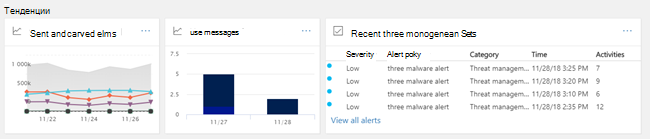

# Панель мониторинга безопасности

[!INCLUDE [Microsoft 365 Defender rebranding](../includes/microsoft-defender-for-office.md)]

## Основные функции и открытие панели мониторинга безопасности

Центр [& безопасности](../../compliance/microsoft-365-compliance-center.md) позволяет организации управлять защитой и соответствием требованиям. Если у вас есть необходимые разрешения, панель мониторинга безопасности позволяет просматривать состояние защиты от угроз, а также просматривать и действовать по оповещениям о безопасности.

Просмотрите видео, чтобы получить обзор, а затем прочитайте эту статью, чтобы узнать больше.

> [!VIDEO https://www.microsoft.com/videoplayer/embed/RE1VV3o]

В зависимости от подписки организации панель мониторинга безопасности включает несколько виджетов, таких как Сводка управления угрозами, состояние защиты от угроз, глобальное еженедельное обнаружение угроз, вредоносные программы и другие, как описано в следующих разделах.

Чтобы просмотреть панель мониторинга безопасности в Центре [&](../../compliance/microsoft-365-compliance-center.md)безопасности, перейдите на панель мониторинга **управления** \> **угрозами.**

> [!NOTE]
> Вы должны быть глобальным администратором, администратором безопасности или читателем безопасности, чтобы просмотреть панель мониторинга безопасности. Некоторые виджеты требуют дополнительных разрешений для просмотра. Дополнительные дополнительные новости см. [в центре разрешений](permissions-in-the-security-and-compliance-center.md)& безопасности.

## Сводка по управлению угрозами

Виджет Сводки управления угрозами рассказывает вам сразу, как ваша организация была защищена от угроз за последние семь (7) дней.

Сведения, которые вы увидите в сводке управления угрозами, зависят от того, что включает подписка. В следующей таблице описывается, какие сведения включены для Office 365 E3 и Office 365 E5.

|Office 365 E3|Office 365 E5|
|---|---|
|Вредоносные сообщения заблокированы Заблокированы фишинговые сообщения Сообщения, отчитались пользователи    |Вредоносные сообщения заблокированы Заблокированы фишинговые сообщения Сообщения, отчитались пользователи Вредоносные программы нулевого дня заблокированы Обнаружение расширенных фишинговых сообщений Заблокированы вредоносные URL-адреса|

Чтобы просмотреть или получить доступ к виджету Сводки управления угрозами, необходимо иметь разрешения на просмотр отчетов Defender для Office 365. Чтобы узнать больше, см. в обзоре Разрешений, необходимых для просмотра отчетов [Defender для Office 365 отчетов?.](view-reports-for-mdo.md#what-permissions-are-needed-to-view-the-defender-for-office-365-reports)

## Состояние защиты от угроз

Виджет Состояние защиты от угроз показывает эффективность защиты от угроз с помощью тренда и подробного представления о фишинге и вредоносных программах.

Сведения зависят от того, Microsoft 365 подписка включает Exchange Online Protection  (EOP) с Microsoft [Defender](defender-for-office-365.md)для Office 365 .

|Если подписка включает в себя...|Вы увидите эти сведения|
|---|---|
|EOP, но не Microsoft Defender для Office 365|Вредоносная электронная почта, обнаруженная и заблокированная EOP.
 См. [отчет о состоянии защиты от угроз (EOP).](view-email-security-reports.md#threat-protection-status-report)|
|Microsoft Defender для Office 365|Вредоносный контент и вредоносная электронная почта, обнаруженные и заблокированные EOP и Defender для Office 365 
 Сводное количество уникальных сообщений электронной почты с вредоносным [контентом,](zero-hour-auto-purge.md)заблокированным антивирусным двигателем, автоматической очисткой нулевого часа и функциями Defender для Office 365 (в том числе Сейф [Links,](safe-links.md)Сейф [Attachments](safe-attachments.md)и [Anti-phishing в Defender для Office 365).](set-up-anti-phishing-policies.md#exclusive-settings-in-anti-phishing-policies-in-microsoft-defender-for-office-365) 
 См. [отчет о состоянии защиты от угроз.](view-reports-for-mdo.md#threat-protection-status-report)|

Чтобы просмотреть или получить доступ к виджету Состояние защиты от угроз, необходимо иметь разрешения на просмотр отчетов Defender для Office 365. Чтобы узнать больше, см. в этой ссылке, какие разрешения необходимы для просмотра отчетов [Defender для Office 365 отчетов?](view-reports-for-mdo.md#what-permissions-are-needed-to-view-the-defender-for-office-365-reports)

## Обнаружение глобальной еженедельной угрозы

Виджет Global Weekly Threats показывает, сколько угроз было обнаружено в сообщениях электронной почты за последние семь (7) дней.

Метрики вычисляются так, как описано в следующей таблице:

|Метрика|Как вычисляется|
|---|---|
|Отсканированные сообщения|Количество отсканированных сообщений электронной почты, умноженных на число получателей|
|Угрозы остановлены|Количество сообщений электронной почты, идентифицированных как содержащих вредоносные программы, умноженных на число получателей|
|Заблокировано [Defender для Office 365](defender-for-office-365.md)|Количество сообщений электронной почты, заблокированных Defender для Office 365, умножено на количество получателей|
|Удалено после доставки|Количество сообщений, удаленных [путем](zero-hour-auto-purge.md) автоматической очистки с нулевой часовой отметкой, умноженное на число получателей|

## Вредоносные программы

В виджетах вредоносных программ покажут сведения о тенденциях вредоносных программ и типах семей вредоносных программ за последние семь (7) дней.

## Аналитика

Идеи не только поверхностные ключевые проблемы, которые необходимо рассмотреть, они также включают рекомендации и действия, которые следует учитывать.

Например, вы можете увидеть доставку фишинговых сообщений электронной почты, так как некоторые пользователи отключили свои параметры нежелательной почты. Дополнительные сведения о том, как работают идеи, см. в центре отчетов и [& безопасности.](reports-and-insights-in-security-and-compliance.md)

## Анализ угроз и реагирование на них

Если в вашей организации подписка включает Microsoft Defender для [Office 365 Plan 2,](office-365-ti.md)в панели мониторинга безопасности есть раздел, который включает расширенные средства расследования и реагирования на угрозы. К этим [средствам относятся возможности автоматического](automated-investigation-response-office.md)расследования и ответа. Автоматическое расследование и реагирование могут быть полезны в таких сценариях, как быстрое устранение [скомпрометизированных учетных записей пользователей.](address-compromised-users-quickly.md)

Дополнительные дополнительные информации см. в дополнительных подробной информации о том, как начать использовать автоматизированные исследования и ответы [(AIR) в Office 365.](office-365-air.md)

## Тенденции

В нижней части панели мониторинга безопасности находится раздел **Trends,** в котором подводятся итоги потоков электронной почты для организации. Отчеты предоставляют сведения о электронной почте, классифицируются как спам, вредоносные программы, попытки фишинга и хорошая электронная почта. Щелкните плитку, чтобы просмотреть более подробные сведения в отчете.

Кроме того, если в подписке вашей организации содержится Defender для Office 365  [Plan 2,](office-365-ti.md)в этом разделе также будет отчет о недавних предупреждениях об управлении угрозами, который позволяет группе безопасности просматривать и принимать меры в отношении высокооритетных оповещений о безопасности.

Чтобы просмотреть или получить доступ к виджету отправленной и полученной электронной почты, необходимо иметь разрешения на просмотр отчетов Defender для Office 365 сообщений. Чтобы узнать больше, см. в обзоре Разрешений, необходимых для просмотра отчетов [Defender для Office 365 отчетов?.](view-reports-for-mdo.md#what-permissions-are-needed-to-view-the-defender-for-office-365-reports)

Чтобы просмотреть или получить доступ к виджету Недавние оповещения об управлении угрозами, необходимо иметь разрешения на просмотр оповещений. Дополнительные новости см. в обзоре [разрешений RBAC, необходимых для просмотра оповещений.](../../compliance/alert-policies.md#rbac-permissions-required-to-view-alerts)

## Статьи по теме

[Просмотр отчетов о безопасности почты в Центре безопасности и соответствия требованиям](view-email-security-reports.md)

[Просмотр отчетов для Microsoft Defender для Office 365](view-reports-for-mdo.md)

[Defender для Office 365](defender-for-office-365.md)

[Office 365 Исследование угроз и реагирование](office-365-ti.md)