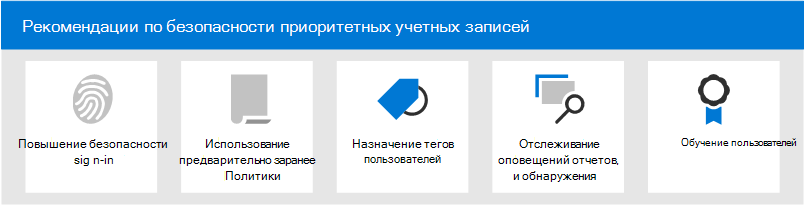

# Рекомендации по безопасности для приоритетных учетных записей в Microsoft 365

Не все учетные записи пользователей имеют доступ к одной и той же информации компании. Некоторые учетные записи имеют доступ к конфиденциальным данным, таким как финансовые данные, сведения о разработке продукта, доступ партнеров к критически важным системам сборки и другие. В случае взлома учетные записи, которые имеют доступ к конфиденциальной информации, представляют собой серьезную угрозу. Мы называем эти типы учетных записей _приоритетными._ Приоритетные учетные записи включают (но не ограничиваются) руководителями, ciSOs, CFOs, учетными записями администратора инфраструктуры, учетными записями системы сборки и т. д.

Для злоумышленников обычные фишинговые атаки, отбрасывавшие случайные сети для обычных или неизвестных пользователей, неэффективны. С другой стороны, атаки  _фишинга_ и китобойного промысла, нацеленные на приоритетные учетные записи, очень полезны для злоумышленников. Таким образом, учетные записи приоритетов требуют более сильной, чем обычной защиты, чтобы предотвратить компромисс учетной записи.

Microsoft 365 и Microsoft Defender для Office 365 содержат несколько ключевых функций, которые обеспечивают дополнительные уровни безопасности для приоритетных учетных записей. В этой статье описываются эти возможности и их использование.

****

|Task|Все корпоративные планы Office 365|Microsoft 365 E3|Microsoft 365 E5|
|---|:---:|:---:|:---:|
|[Повышение безопасности входных данных для учетных записей приоритетов](#increase-sign-in-security-for-priority-accounts)||||
|[Используйте строгие предустановленные политики безопасности для учетных записей приоритета](#use-strict-preset-security-policies-for-priority-accounts)||||
|[Применение тегов пользователей к учетным записям приоритета](#apply-user-tags-to-priority-accounts)||||
|[Мониторинг учетных записей приоритетов в оповещениях, отчетах и обнаружениях](#monitor-priority-accounts-in-alerts-reports-and-detections)||||
|[Обучение пользователей](#train-users)||||
|

> [!NOTE]
> Сведения о защите привилегированных _учетных записей_ (учетных записей администратора) см. [в этом разделе.](/azure/architecture/framework/security/critical-impact-accounts)

## Повышение безопасности входных данных для учетных записей приоритетов

Учетные записи приоритета требуют повышенной безопасности входных данных. Вы можете повысить безопасность их регистрации, требуя многофакторной проверки подлинности (MFA) и отключения устаревших протоколов проверки подлинности.

Инструкции см. [в шаге 1. Повышение безопасности входных данных для удаленных сотрудников с помощью MFA.](../../solutions/empower-people-to-work-remotely-secure-sign-in.md) Хотя эта статья посвящена удаленным рабочим, те же понятия применяются и к приоритетным пользователям.

**Примечание.** Настоятельно рекомендуется глобально отключить устаревшие протоколы проверки подлинности для всех приоритетных пользователей, как описано в предыдущей статье. Если бизнес-требования мешают вам это сделать, Exchange Online предлагает следующие элементы управления, которые помогут ограничить область устаревших протоколов проверки подлинности:

- Политики проверки подлинности  и правила клиентского доступа в Exchange Online можно использовать для блокировки или допуска основных протоколов проверки подлинности и устаревшей проверки подлинности, таких как POP3, IMAP4 и SMTP для определенных пользователей. 

- Вы можете отключить доступ к POP3 и IMAP4 для отдельных почтовых ящиков. Вы можете отключить проверку подлинности SMTP на организационном уровне и включить ее в определенных почтовых ящиках, которые по-прежнему этого требуют. Инструкции см. в следующих разделах:
  - [Включить или отключить доступ к POP3 или IMAP4 для пользователя](/exchange/clients-and-mobile-in-exchange-online/pop3-and-imap4/enable-or-disable-pop3-or-imap4-access)
  - [Включить или отключить проверку подлинности отправки SMTP клиента (SMTP AUTH)](/exchange/clients-and-mobile-in-exchange-online/authenticated-client-smtp-submission)

Кроме того, стоит отметить, что базовая проверка подлинности находится в процессе обесценения в Exchange Online для веб-служб Exchange web Services (EWS), Exchange ActiveSync, POP3, IMAP4 и удаленной PowerShell. Подробные сведения см. в этом [блоге.](https://developer.microsoft.com/office/blogs/deferred-end-of-support-date-for-basic-authentication-in-exchange-online/)

## Используйте строгие предустановленные политики безопасности для учетных записей приоритета

Приоритетные пользователи требуют более строгих действий для различных средств защиты, доступных в Exchange Online Protection (EOP) и Defender for Office 365.

Например, вместо доставки сообщений, классифицированных как нежелательной почты, в папку нежелательной почты следует карантить те же сообщения, если они предназначены для учетных записей приоритета.

Этот строгий подход можно реализовать для учетных записей приоритетов с помощью строгого профиля в заранее заданной политике безопасности.

Предустановленные политики безопасности являются удобным и центральным расположением для применения рекомендуемых параметров строгой политики для всех защиты в EOP и Defender для Office 365. Дополнительные сведения см. в [предустановленных политиках безопасности в EOP и Microsoft Defender для Office 365.](preset-security-policies.md)

Сведения о том, чем параметры строгой политики отличаются от параметров политики по умолчанию и стандартных, см. в разделе Рекомендуемые параметры безопасности EOP и [Microsoft Defender для Office 365.](recommended-settings-for-eop-and-office365.md)

## Применение тегов пользователей к учетным записям приоритета

Теги пользователей в Microsoft Defender для Office 365 Plan 2 (в составе Microsoft 365 E5 или подписки на надстройку) являются способом быстрой идентификации и классификации определенных пользователей или групп пользователей в отчетах и расследованиях инцидентов.

**Учетные записи** приоритета — это тип встроенного тега пользователя (известного как системный тег), который можно использовать для выявления инцидентов и оповещений, которые включают учетные записи приоритета. Дополнительные сведения о **приоритетных учетных записях см.** в руб. Управление и мониторинг [учетных записей приоритетов.](../../admin/setup/priority-accounts.md)

Вы также можете создать настраиваемые теги для дальнейшей идентификации и классификации учетных записей приоритета. Дополнительные сведения см. [в тегах пользователей.](user-tags.md) Обратите внимание, что вы можете управлять учетной **записью приоритетов** (системные теги) в том же интерфейсе, что и пользовательские теги пользователей.

## Мониторинг учетных записей приоритетов в оповещениях, отчетах и обнаружениях

После обеспечения безопасности и тегов приоритетных пользователей можно использовать доступные отчеты, оповещения и расследования в EOP и Defender для Office 365, чтобы быстро определить инциденты или обнаружения, которые связаны с учетной записью приоритета. Функции, поддерживают теги пользователей, описаны в следующей таблице.

 

****

|Возможность|Описание|
|---|---|
|Оповещения|Теги пользователей затронутых пользователей видны и доступны в качестве фильтров на странице Оповещений **View** в Центре & соответствия требованиям. Дополнительные сведения см. в [обзоре Оповещений о просмотре.](../../compliance/alert-policies.md#viewing-alerts)|
|Обозреватель угроз 
 Обнаружение в режиме реального времени|В **обозревателе** угроз (Microsoft Defender для Office 365 Plan 2) или обнаружениях в режиме реального времени **(Microsoft** Defender для Office 365 Plan 1) теги пользователей видны в представлении сетки электронной почты и вылете сведений электронной почты. Теги пользователей также доступны в качестве фильтруемого свойства. Дополнительные сведения см. в [тегах в обозревателе угроз.](threat-explorer.md#tags-in-threat-explorer)|
|Представления кампании|Теги пользователей являются одним из многих фильтруемых свойств в представлениях кампании в Microsoft Defender для Office 365 Plan 2. Дополнительные сведения см. в [дополнительных сведениях о представлениях кампании.](campaigns.md)|
|отчет о состоянии защиты от угроз;|Практически во всех таблицах представлений и подробных данных в отчете о состоянии защиты от угроз можно отфильтровать результаты по **учетным записям приоритета.** Дополнительные сведения см. в [отчете о состоянии защиты от угроз.](view-email-security-reports.md#threat-protection-status-report)|
|Проблемы электронной почты для отчета о приоритетных учетных записях|Отчет **о проблемах** электронной почты для отчетов о приоритетных учетных записях в центре администрирования Exchange (EAC) содержит сведения о неделивных и отложенных сообщениях для учетных записей **приоритета.** Дополнительные сведения см. в сообщении о проблемах электронной почты [для отчета о приоритетных учетных записях.](/exchange/monitoring/mail-flow-reports/mfr-email-issues-for-priority-accounts-report)|
|

## Обучение пользователей

Обучение пользователей приоритетным учетным записям поможет сэкономить этим пользователям и вашей группе операций безопасности много времени и разочарований. Опытные пользователи реже открывают вложения или щелкают ссылки в сомнительных сообщениях электронной почты, и они с большей вероятностью избегают подозрительных веб-сайтов.

Руководство по  кампании кибербезопасности школы Кеннеди в Гарварде предоставляет отличные рекомендации по созданию сильной культуры осведомленности о безопасности в вашей организации, включая обучение пользователей выявлению фишинговых атак.

Microsoft 365 предоставляет следующие ресурсы, которые помогут информировать пользователей в вашей организации:

 

****

|Понятие|Ресурсы|Описание|
|---|---|---|
|Microsoft 365|[Настраиваемые пути обучения](/office365/customlearning/)|Эти ресурсы помогут вам собрать обучение пользователей в организации.|
|Безопасность Microsoft 365|[Модуль обучения: защита организации встроенной и интеллектуальной безопасностью от Microsoft 365](/learn/modules/security-with-microsoft-365)|Этот модуль позволяет описать, как функции безопасности Microsoft 365 работают вместе, и сформулировать преимущества этих функций безопасности.|
|Многофакторная проверка подлинности|[Двухшаговая проверка: что такое дополнительная страница проверки?](/azure/active-directory/user-help/multi-factor-authentication-end-user-first-time)|Эта статья помогает конечным пользователям понять, что такое многофакторная проверка подлинности и почему она используется в организации.|
|Обучение имитации атаки|[Начало использования обучения имитации атаки](attack-simulation-training-get-started.md)|Обучение имитации атак в Microsoft Defender для Office 365 Plan 2 позволяет администратору настраивать, запускать и отслеживать смоделированные фишинговые атаки против определенных групп пользователей.|

Кроме того, Корпорация Майкрософт рекомендует пользователям принимать меры, описанные в этой статье: Защита учетной записи и устройств от хакеров [и вредоносных программ.](https://support.microsoft.com/office/066d6216-a56b-4f90-9af3-b3a1e9a327d6) Эти действия включают в себя:

- Использование надежных паролей
- Защита устройств
- Включение функций безопасности на ПК Windows 10 и Mac (для неугодных устройств)

## См. также

[Объявление о приоритетной защите учетных записей в Microsoft Defender для Office 365](https://techcommunity.microsoft.com/t5/microsoft-defender-for-office/announcing-priority-account-protection-in-microsoft-defender-for/ba-p/1696385)