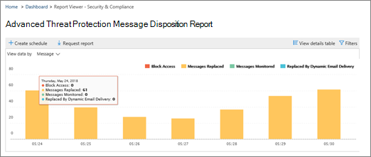

# Настройка и загрузка настраиваемого отчета в центре безопасности &amp; и соответствия требованиям

В [центре соответствия &amp; требованиям безопасности](https://protection.office.com)доступны некоторые [отчеты и](reports-and-insights-in-security-and-compliance.md) сведения, помогающие группе безопасности Организации уменьшить риски и устранить угрозы в Организации. Если вы являетесь участником группы безопасности вашей организации, вы можете настроить отчет с помощью настраиваемых диапазонов дат и фильтров, а затем скачать настраиваемый отчет. 
  
## Загрузка настраиваемого отчета

> [!IMPORTANT]
> Убедитесь, что у вас есть необходимые [разрешения для центра безопасности &amp; и соответствия требованиям](permissions-in-the-security-and-compliance-center.md). В общем случае глобальные администраторы, администраторы безопасности и средства чтения безопасности могут получать доступ к отчетам &amp; в центре безопасности и соответствия требованиям. 
  
1. В [центре безопасности &amp; и соответствия требованиям](https://protection.office.com)откройте **панель мониторинга** **отчетов** \> .
    
2. Выберите отчет. (Для этого примера мы будем использовать отчет об ликвидации сообщений.) 
  
3. В левом верхнем углу отчета выберите **запрос отчета**.
    
4. В диалоговом окне **запрос отчета** укажите имя, дату начала и дату окончания для отчета. Затем нажмите кнопку **Далее**. 
  
5. Укажите фильтры, которые необходимо использовать для отчета. (Например, вы можете указать IP-адрес клиента для отчета об ликвидации сообщений.) Затем нажмите кнопку **Далее**.
    
6. Укажите получателей электронной почты для отчета, а затем нажмите кнопку **сохранить**.
    
## Статьи по теме

[Отчеты и аналитика в центре безопасности &amp; и соответствия требованиям](reports-and-insights-in-security-and-compliance.md)
  
[Создание расписания для отчета в центре безопасности &amp; и соответствия требованиям](create-a-schedule-for-a-report.md)
  
[Управление расписаниями для отчетов в центре &amp; безопасности и соответствия требованиям](manage-schedules-for-multiple-reports.md)
  
[Загрузка существующих отчетов в центре безопасности &amp; и соответствия требованиям](download-existing-reports.md)
  

