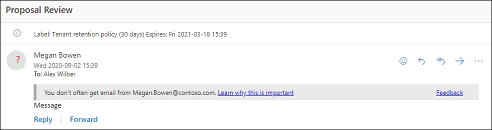

# Политики защиты от фишинга в Microsoft 365Anti-phishing policies in Microsoft 365

[!INCLUDE [Microsoft 365 Defender rebranding](../includes/microsoft-defender-for-office.md)]

**Область применения****Applies to**
- [Exchange Online ProtectionExchange Online Protection](exchange-online-protection-overview.md)
- [Microsoft Defender для Office 365 (план 1 и план 2)Microsoft Defender for Office 365 plan 1 and plan 2](defender-for-office-365.md)
- [Microsoft 365 DefenderMicrosoft 365 Defender](../defender/microsoft-365-defender.md)

Политики настройки параметров защиты от фишинга доступны в Microsoft 365 организациях с Exchange Online почтовыми ящиками, автономными организациями Exchange Online Protection (EOP) без Exchange Online почтовых ящиков и Microsoft Defender для Office 365 организаций.Policies to configure anti-phishing protection settings are available in Microsoft 365 organizations with Exchange Online mailboxes, standalone Exchange Online Protection (EOP) organizations without Exchange Online mailboxes, and Microsoft Defender for Office 365 organizations.

Примеры Microsoft Defender для Office 365 организаций:Examples of Microsoft Defender for Office 365 organizations include:

- Microsoft 365 корпоративный E5, Microsoft 365 для образования A5 и т. д.Microsoft 365 Enterprise E5, Microsoft 365 Education A5, etc.
- [Microsoft 365 корпоративныйMicrosoft 365 Enterprise](https://www.microsoft.com/microsoft-365/enterprise/home)
- [Microsoft 365 бизнесMicrosoft 365 Business](https://www.microsoft.com/microsoft-365/business)
- [Microsoft Defender для Office 365 как надстройкаMicrosoft Defender for Office 365 as an add-on](https://products.office.com/exchange/advance-threat-protection)

Различия высокого уровня между политиками защиты от фишинга в EOP и политиками защиты от фишинга в Defender для Office 365 описаны в следующей таблице:The high-level differences between anti-phishing policies in EOP and anti-phishing policies in Defender for Office 365 are described in the following table:

 

****

|ФункцияFeature|Политики защиты от фишинга в EOPAnti-phishing policies in EOP|Политики защиты от фишинга в Defender для Office 365Anti-phishing policies in Defender for Office 365|
|---|:---:|:---:|
|Автоматически созданная политика по умолчаниюAutomatically created default policy|||
|Создание настраиваемых политикCreate custom policies|||
|Общие параметры политики\*Common policy settings\*|||
|Параметры SpoofSpoof settings|||
|Первый контакт совет по безопасностиFirst contact safety tip|||
|Параметры обезличенияImpersonation settings|||
|Расширенные пороговые значения фишингаAdvanced phishing thresholds|||
|

\* В политике по умолчанию имя политики и описание являются только для чтения (описание пусто), и нельзя указать, к кому применяется политика (политика по умолчанию применяется ко всем получателям).\* In the default policy, the policy name, and description are read-only (the description is blank), and you can't specify who the policy applies to (the default policy applies to all recipients).

Чтобы настроить политики защиты от фишинга, см. в следующих статьях:To configure anti-phishing policies, see the following articles:

- [Настройка политик защиты от фишинга в EOPConfigure anti-phishing policies in EOP](configure-anti-phishing-policies-eop.md)
- [Настройка политик защиты от фишинга в Microsoft Defender для Office 365Configure anti-phishing policies in Microsoft Defender for Office 365](configure-mdo-anti-phishing-policies.md)

В остальной части этой статьи описываются параметры, доступные в политиках защиты от фишинга в EOP и Defender для Office 365.The rest of this article describes the settings that are available in anti-phishing policies in EOP and Defender for Office 365.

## Общие параметры политикиCommon policy settings

Следующие параметры политики доступны в политиках защиты от фишинга в EOP и Defender для Office 365:The following policy settings are available in anti-phishing policies in EOP and Defender for Office 365:

- **Имя.** Нельзя переименовать политику защиты от фишинга по умолчанию.**Name**: You can't rename the default anti-phishing policy. После создания настраиваемой политики защиты от фишинга переименовать политику на портале Microsoft 365 Defender.After you create a custom anti-phishing policy, you can't rename the policy in the Microsoft 365 Defender portal.

- **Описание** Вы не можете добавить описание в политику защиты от фишинга по умолчанию, но вы можете добавить и изменить описание для созданных вами пользовательских политик.**Description** You can't add a description to the default anti-phishing policy, but you can add and change the description for custom policies that you create.

- **Пользователи, группы и домены:** определяет внутренних получателей, к которые применяется политика защиты от фишинга.**Users, groups, and domains**: Identifies internal recipients that the anti-phishing policy applies to. Это значение требуется в настраиваемой политике и не доступно в политике по умолчанию (политика по умолчанию применяется ко всем получателям).This value is required in custom policies, and not available in the default policy (the default policy applies to all recipients).

  Условие или исключение можно использовать только один раз, но можно указать для них несколько значений.You can only use a condition or exception once, but you can specify multiple values for the condition or exception. Указать несколько значений в одном условии или исключении можно с помощью оператора OR (например, _\<recipient1\>_ or _\<recipient2\>_).Multiple values of the same condition or exception use OR logic (for example, _\<recipient1\>_ or _\<recipient2\>_). Между разными условиями и исключениями используется оператор AND (например, _\<recipient1\>_ and _\<member of group 1\>_).Different conditions or exceptions use AND logic (for example, _\<recipient1\>_ and _\<member of group 1\>_).

  - **Пользователи:** один или несколько почтовых ящиков, почтовых пользователей или почтовых контактов в вашей организации.**Users**: One or more mailboxes, mail users, or mail contacts in your organization.
  - **Группы.** Одна или несколько групп в вашей организации.**Groups**: One or more groups in your organization.
  - **Домены.** Один или несколько настроенных принятых доменов [в](/exchange/mail-flow-best-practices/manage-accepted-domains/manage-accepted-domains) Microsoft 365.**Domains**: One or more of the configured [accepted domains](/exchange/mail-flow-best-practices/manage-accepted-domains/manage-accepted-domains) in Microsoft 365.

  - **Исключить этих пользователей, группы и домены:** Исключения для политики.**Exclude these users, groups, and domains**: Exceptions for the policy. Параметры и поведение в точности похожи на условия:The settings and behavior are exactly like the conditions:
    - **Users****Users**
    - **Группы****Groups**
    - **Домены****Domains**

  > [!NOTE]
  > По крайней мере один выбор в параметрах **Пользователи,** группы и домены требуется в настраиваемой политике защиты от фишинга, чтобы определить получателей сообщений, к которые применяется  <u>политика.</u>At least one selection in the **Users, groups, and domains** settings is required in custom anti-phishing policies to identify the message **recipients** <u>that the policy applies to</u>. Политики защиты от фишинга в Defender для  Office 365 также имеют параметры обезличения, в которых можно <u></u> указать отдельные адреса электронной почты отправитель или домены отправитель, которые получат защиту от обезличения, как описано далее в этой статье.Anti-phishing policies in Defender for Office 365 also have [impersonation settings](#impersonation-settings-in-anti-phishing-policies-in-microsoft-defender-for-office-365) where you can specify individual sender email addresses or sender domains <u>that will receive impersonation protection</u> as described later in this article.

## Параметры SpoofSpoof settings

Спуфинг — это когда адрес From в сообщении электронной почты (адрес отправитель, показанный в клиентах электронной почты) не соответствует домену источника электронной почты.Spoofing is when the From address in an email message (the sender address that's shown in email clients) doesn't match the domain of the email source. Дополнительные сведения о подмене см. в [Microsoft 365.](anti-spoofing-protection.md)For more information about spoofing, see [Anti-spoofing protection in Microsoft 365](anti-spoofing-protection.md).

Следующие параметры подмены доступны в политиках защиты от фишинга в EOP и Defender для Office 365:The following spoof settings are available in anti-phishing policies in EOP and Defender for Office 365:

- **Включите подмену сведений:** включается или выключается подмена сведений.**Enable spoof intelligence**: Turns spoof intelligence on or off. Рекомендуется оставить его включенным.We recommend that you leave it turned on.

  Когда включена разведка подмены, в разведданных подмены показаны поддельные отправители, которые были автоматически обнаружены и разрешены или заблокированы с помощью подмены. When spoof intelligence is enabled, the **spoof intelligence insight** shows spoofed senders that were automatically detected and allowed or blocked by spoof intelligence. Вы можете вручную переопредить вердикт о подмене сведений, чтобы разрешить или заблокировать обнаруженных подмена отправителей изнутри.You can manually override the spoof intelligence verdict to allow or block the detected spoofed senders from within the insight. Но когда это происходит, подмена отправитель исчезает из анализа подмены сведений и теперь видна только на вкладке **Spoof** в списке "Разрешить или заблокировать клиента".But when you do, the spoofed sender disappears from the spoof intelligence insight, and is now visible only on the **Spoof** tab in the Tenant Allow/Block List. Вы также можете вручную создавать записи для подмены отправителей или блокировать их в списке разрешить или заблокировать клиента.You can also manually create allow or block entries for spoofed senders in the Tenant Allow/Block List. Дополнительные сведения см. в следующих статьях:For more information, see the following articles:

  - [Spoof intelligence insight in EOPSpoof intelligence insight in EOP](learn-about-spoof-intelligence.md)
  - [Управление списком разрешить или блокировать клиента в EOPManage the Tenant Allow/Block List in EOP](tenant-allow-block-list.md)

  > [!NOTE]
  >
  > - Защита от спуфинга включена по умолчанию в политике защиты от фишинга по умолчанию и в любых новых настраиваемой политике защиты от фишинга, которые вы создаете.Anti-spoofing protection is enabled by default in the default anti-phishing policy and in any new custom anti-phishing policies that you create.
  > - Вам не нужно отключать защиту от подмены, если запись MX не означает Microsoft 365; Вместо этого вы включаете усиленную фильтрацию соединителя.You don't need to disable anti-spoofing protection if your MX record doesn't point to Microsoft 365; you enable Enhanced Filtering for Connectors instead. Инструкции см. в [расширенной фильтрации соединители в Exchange Online](/Exchange/mail-flow-best-practices/use-connectors-to-configure-mail-flow/enhanced-filtering-for-connectors).For instructions, see [Enhanced Filtering for Connectors in Exchange Online](/Exchange/mail-flow-best-practices/use-connectors-to-configure-mail-flow/enhanced-filtering-for-connectors).
  > - Отключение защиты от спуфинга  только отключает неявную защиту от подмены из композитных проверок [проверки подлинности.](email-validation-and-authentication.md#composite-authentication)Disabling anti-spoofing protection only disables _implicit_ spoofing protection from [composite authentication](email-validation-and-authentication.md#composite-authentication) checks. Если отправитель не  проводит явные проверки [DMARC,](use-dmarc-to-validate-email.md) в которых политика настроена на карантин или отклоняется, сообщение по-прежнему находится на карантине или отклоняется.If the sender fails _explicit_ [DMARC](use-dmarc-to-validate-email.md) checks where the policy is set to quarantine or reject, the message is still quarantined or rejected.

- **Неавентированные** уведомления отправитель: Эти уведомления доступны только при включенной подмене сведений.**Unauthenticated sender notifications**: These notifications are available only when spoof intelligence is turned on. Сведения см. в следующем разделе.See the information in the next section.
- **Действия.** Для сообщений от заблокированных подменяющих отправителей (автоматически заблокированных подменой сведений или вручную заблокированных в списке Tenant Allow/Block), вы также можете указать действие, которое необходимо принять для этих сообщений:**Actions**: For messages from blocked spoofed senders (automatically blocked by spoof intelligence or manually blocked in the Tenant Allow/Block list), you can also specify the action to take on the messages:
  - **Перемещение сообщений в папки** нежелательной почты получателей. Это значение по умолчанию.**Move messages to the recipients' Junk Email folders**: This is the default value. Сообщение доставляется в почтовый ящик и перемещается в папку нежелательной почты.The message is delivered to the mailbox and moved to the Junk Email folder. В Exchange Online сообщение перемещается в папку нежелательной почты, если правило нежелательной почты включено в почтовом ящике (оно включено по умолчанию).In Exchange Online, the message is moved to the Junk Email folder if the junk email rule is enabled on the mailbox (it's enabled by default). Дополнительные сведения см. в [сообщении Configure junk email settings on Exchange Online почтовых](configure-junk-email-settings-on-exo-mailboxes.md)ящиках в Microsoft 365 .For more information, see [Configure junk email settings on Exchange Online mailboxes in Microsoft 365](configure-junk-email-settings-on-exo-mailboxes.md).
  - **Карантин сообщения.** Отправляет сообщение на карантин вместо предполагаемых получателей.**Quarantine the message**: Sends the message to quarantine instead of the intended recipients. Сведения о карантине см. в следующих статьях:For information about quarantine, see the following articles:
    - [Карантин в Microsoft 365Quarantine in Microsoft 365](quarantine-email-messages.md)
    - [Управление карантинными сообщениями и файлами в качестве администратора в Microsoft 365Manage quarantined messages and files as an admin in Microsoft 365](manage-quarantined-messages-and-files.md)
    - [Поиск и освобождение карантинов сообщений в качестве пользователя в Microsoft 365Find and release quarantined messages as a user in Microsoft 365](find-and-release-quarantined-messages-as-a-user.md)

### Неавентированный отправительUnauthenticated sender

Неавентированные уведомления отправитель являются частью параметров [Spoof,](#spoof-settings) доступных в политиках защиты от фишинга в EOP и Defender для Office 365, как описано в предыдущем разделе.The unauthenticated sender notifications are part of the [Spoof settings](#spoof-settings) that are available in anti-phishing policies in EOP and Defender for Office 365 as described in the previous section. Следующие параметры доступны только при включенной подмене сведений:The following settings are available only when spoof intelligence is turned on:

- **Показать (?)** для неавентированных отправителей для подмены: Это уведомление добавляет знак вопроса добавляется к фотографии отправителей в поле From,  если сообщение не проходит проверки SPF или DKIM и сообщение не передает DMARC или композитную проверку подлинности [.](email-validation-and-authentication.md#composite-authentication)**Show (?) for unauthenticated senders for spoof**: This notification adds a question mark is added to the sender's photo in the From box if the message does not pass SPF or DKIM checks **and** the message does not pass DMARC or [composite authentication](email-validation-and-authentication.md#composite-authentication). После отключения этого параметра знак вопроса не добавляется на фотографию отправитель.When this setting is turned off, the question mark isn't added to the sender's photo.

- **Показать тег "via"?**: Это уведомление добавляет тег via (chris@contoso.com <u>через</u> fabrikam.com) в поле From, если домен в адресе From (отправитель сообщений, отображаемого в клиентах электронной почты) отличается от домена в подписи DKIM или **адреса MAIL FROM.****Show "via" tag?**: This notification adds the via tag (chris@contoso.com <u>via</u> fabrikam.com) in the From box if the domain in the From address (the message sender that's displayed in email clients) is different from the domain in the DKIM signature or the **MAIL FROM** address. Дополнительные сведения об этих адресах см. [в обзоре стандартов сообщений электронной почты.](how-office-365-validates-the-from-address.md#an-overview-of-email-message-standards)For more information about these addresses, see [An overview of email message standards](how-office-365-validates-the-from-address.md#an-overview-of-email-message-standards).

Чтобы предотвратить добавление знака вопроса или тега в сообщения определенных отправителей, у вас есть следующие параметры:To prevent the question mark or via tag from being added to messages from specific senders, you have the following options:

- Разрешить подмене отправитель в  подмене сведений или вручную в [списке Разрешить клиента / Блок](tenant-allow-block-list.md).Allow the spoofed sender in the [spoof intelligence insight](learn-about-spoof-intelligence.md) or manually in the [Tenant Allow/Block List](tenant-allow-block-list.md). Разрешение подмены отправителю позволит предотвратить отображение тега в сообщениях от отправиющего, если неавентированное удостоверение отправитель отключено.Allowing the spoofed sender will prevent the via tag from appearing in messages from the sender when unauthenticated sender identification is disabled.
- [Настройка проверки подлинности электронной почты](email-validation-and-authentication.md#configure-email-authentication-for-domains-you-own) для домена отправитель.[Configure email authentication](email-validation-and-authentication.md#configure-email-authentication-for-domains-you-own) for the sender domain.
  - Для знака вопроса на фотографии отправитель, SPF или DKIM являются наиболее важными.For the question mark in the sender's photo, SPF or DKIM are the most important.
  - Для тега с помощью тега подтвердим домен в подписи DKIM или в **адресе MAIL FROM** совпадает (или является поддоманом) домена в адресе From.For the via tag, confirm the domain in the DKIM signature or the **MAIL FROM** address matches (or is a subdomain of) the domain in the From address.

Дополнительные сведения см. в [сообщении Identify suspicious messages in Outlook.com и Outlook в Интернете](https://support.microsoft.com/office/3d44102b-6ce3-4f7c-a359-b623bec82206)For more information, see [Identify suspicious messages in Outlook.com and Outlook on the web](https://support.microsoft.com/office/3d44102b-6ce3-4f7c-a359-b623bec82206)

## Первый контакт совет по безопасностиFirst contact safety tip

Параметры первого **контакта Show совет по безопасности** доступны в EOP и Defender для Office 365 организаций и не имеют никакой зависимости от параметров защиты от подмены или обезличения.The **Show first contact safety tip** settings is available in EOP and Defender for Office 365 organizations, and has no dependency on spoof intelligence or impersonation protection settings. В совет по безопасности показана получателям в следующих сценариях:The safety tip is shown to recipients in the following scenarios:

- В первый раз они получают сообщение от отправительThe first time they get a message from a sender
- Они не часто получают сообщения от отправитель.They don't often get messages from the sender.

Эта возможность добавляет дополнительный уровень защиты от потенциальных атак обезличения, поэтому рекомендуется включить его.This capability adds an extra layer of security protection against potential impersonation attacks, so we recommend that you turn it on.

Первый контакт совет по безопасности также заменяет необходимость создания правил потока почты (также известных как правила транспорта), которые добавляют заглавную ссылку **X-MS-Exchange-EnableFirstContactSafetyTip** со значением **Enable** to messages (хотя эта возможность по-прежнему доступна).The first contact safety tip also replaces the need to create mail flow rules (also known as transport rules) that add the header named **X-MS-Exchange-EnableFirstContactSafetyTip** with the value **Enable** to messages (although this capability is still available).

## Эксклюзивные параметры в политиках защиты от фишинга в Microsoft Defender для Office 365Exclusive settings in anti-phishing policies in Microsoft Defender for Office 365

В этом разделе описываются параметры политики, доступные только в политиках защиты от фишинга в Defender для Office 365.This section describes the policy settings that are only available in anti-phishing policies in Defender for Office 365.

> [!NOTE]
> Политика защиты от фишинга по умолчанию в  Defender for Office 365 обеспечивает защиту от подмены и сведения о почтовых ящиках для всех получателей.The default anti-phishing policy in Defender for Office 365 provides [spoof protection](set-up-anti-phishing-policies.md#spoof-settings) and mailbox intelligence for all recipients. Однако другие доступные функции защиты  [от](#impersonation-settings-in-anti-phishing-policies-in-microsoft-defender-for-office-365) обезличения и расширенные параметры не настроены и не включены в политике по умолчанию.However, the other available [impersonation protection](#impersonation-settings-in-anti-phishing-policies-in-microsoft-defender-for-office-365) features and [advanced settings](set-up-anti-phishing-policies.md#advanced-phishing-thresholds-in-anti-phishing-policies-in-microsoft-defender-for-office-365) are not configured or enabled in the default policy. Чтобы включить все функции защиты, измените политику защиты от фишинга по умолчанию или создайте дополнительные политики защиты от фишинга.To enable all protection features, modify the default anti-phishing policy or create additional anti-phishing policies.

### Параметры обезличения в политиках защиты от фишинга в Microsoft Defender для Office 365Impersonation settings in anti-phishing policies in Microsoft Defender for Office 365

В качестве внешнего имени отправитель или домен электронной почты отправитель в сообщении выглядит так же, как реальный отправитель или домен:Impersonation is where the sender or the sender's email domain in a message looks similar to a real sender or domain:

- Пример олицетворения домена contoso.com – ćóntoso.com.An example impersonation of the domain contoso.com is ćóntoso.com.
- Пример олицетворения пользователя michelle@contoso.com – michele@contoso.com.An example impersonation of the user michelle@contoso.com is michele@contoso.com.

Олицетворенный домен можно считать законным (зарегистрированным доменом, настроенными записями проверки подлинности электронной почты и т. д.), если только он не создан с целью обмана получателей.An impersonated domain might otherwise be considered legitimate (registered domain, configured email authentication records, etc.), except its intent is to deceive recipients.

Следующие параметры обезличения доступны только в политиках защиты от фишинга в Defender для Office 365:The following impersonation settings are only available in anti-phishing policies in Defender for Office 365:

- **Включить пользователей для защиты:** предотвращает заданные внутренние или внешние адреса электронной почты от вымещены **в качестве отправителей сообщений**.**Enable users to protect**: Prevents the specified internal or external email addresses from being impersonated **as message senders**. Например, вы получаете сообщение электронной почты от вице-президента вашей компании с просьбой отправить ей некоторые внутренние сведения о компании.For example, you receive an email message from the Vice President of your company asking you to send her some internal company information. Вы бы это сделаете?Would you do it? Многие люди будут отправлять ответ, не думая.Many people would send the reply without thinking.

  Защищенные пользователи можно использовать для добавления внутренних и внешних адресов электронной почты отправитель, чтобы защитить от внешнего обезличения.You can use protected users to add internal and external sender email addresses to protect from impersonation. Этот список  отправителей, защищенных от внешнего имени пользователя,  отличается от списка получателей, к которые применяется политика (все получатели для политики по умолчанию; конкретные получатели, настроенные в разделе **Пользователи,** группы и домены в разделе [Общие](#common-policy-settings) параметры политики).This list of **senders** that are protected from user impersonation is different from the list of **recipients** that the policy applies to (all recipients for the default policy; specific recipients as configured in the **Users, groups, and domains** setting in the [Common policy settings](#common-policy-settings) section).

  > [!NOTE]
  >
  > - В каждой политике защиты от фишинга можно указать максимум 350 защищенных пользователей (адреса электронной почты отправитель).In each anti-phishing policy, you can specify a maximum of 350 protected users (sender email addresses). В нескольких политиках нельзя указать одного и того же защищенного пользователя.You can't specify the same protected user in multiple policies. Таким образом, независимо от количества политик, применимых к получателю, максимальное число защищенных пользователей (адресов электронной почты отправитель) для каждого отдельного получателя составляет 350.So, regardless of how many policies apply to a recipient, the maximum number of protected users (sender email addresses) for each individual recipient is 350. Дополнительные сведения о приоритете политики и о том, как обработка политики прекращается после первой политики, см. в дополнительных сведениях о порядке и [приоритете защиты электронной почты.](how-policies-and-protections-are-combined.md)For more information about policy priority and how policy processing stops after the first policy is applied, see [Order and precedence of email protection](how-policies-and-protections-are-combined.md).
  > - Защита от обезличения пользователя не работает, если отправитель и получатель ранее связывались по электронной почте.User impersonation protection does not work if the sender and recipient have previously communicated via email. Если отправитель и получатель никогда не связывались по электронной почте, сообщение будет определено как попытка обезличения.If the sender and recipient have never communicated via email, the message will be identified as an impersonation attempt.

  По умолчанию адреса электронной почты отправильщика не настроены для защиты от обезличения пользователей для **защиты.**By default, no sender email addresses are configured for impersonation protection in **Users to protect**. Поэтому по умолчанию никакие адреса электронной почты отправильщика не покрываются защитой от обезличения, как в политике по умолчанию, так и в пользовательских политиках.Therefore, by default, no sender email addresses are covered by impersonation protection, either in the default policy or in custom policies.

  При добавлении внутренних или внешних адресов электронной почты в список пользователей сообщения этих отправителей подвергаются проверке защиты от внешнего лица.  When you add internal or external email addresses to the **Users to protect** list, messages from those **senders** are subject to impersonation protection checks. Сообщение проверяется на вымысление, если  сообщение отправляется получателю, к который применяется политика (всем получателям политики по умолчанию;  **Пользователи, группы и получатели** доменов в настраиваемой политике.The message is checked for impersonation **if** the message is sent to a **recipient** that the policy applies to (all recipients for the default policy; **Users, groups, and domains** recipients in custom policies). Если в адресе электронной почты отправляющей стороны обнаружено обезличение, к сообщению применяются действия защиты от обезличения для пользователей (что делать с сообщением, показывать ли императерированные советы по безопасности пользователей и т. д.).If impersonation is detected in the sender's email address, the impersonation protections actions for users are applied to the message (what to do with the message, whether to show impersonated users safety tips, etc.).

- **Включить домены для защиты:** предотвращает вымыщение указанных доменов в домене отправитель **сообщения.****Enable domains to protect**: Prevents the specified domains from being impersonated **in the message sender's domain**. Например, все домены, которые у вас[есть](/exchange/mail-flow-best-practices/manage-accepted-domains/manage-accepted-domains)(допустимые домены) или определенные настраиваемые домены (домены, которые вы владеете или партнером).For example, all domains that you own ([accepted domains](/exchange/mail-flow-best-practices/manage-accepted-domains/manage-accepted-domains)) or specific custom domains (domains you own or partner domains). Этот список  доменов отправитель, защищенных от обезличения,  отличается от списка получателей, к которые применяется политика (все получатели для политики по умолчанию; конкретные получатели, настроенные в разделе **Пользователи,** группы и домены в разделе [Общие](#common-policy-settings) параметры политики).This list of **sender domains** that are protected from impersonation is different from the list of **recipients** that the policy applies to (all recipients for the default policy; specific recipients as configured in the **Users, groups, and domains** setting in the [Common policy settings](#common-policy-settings) section).

  > [!NOTE]
  > Максимальное число защищенных доменов, которые можно определить во всех политиках защиты от фишинга, — 50.The maximum number of protected domains that you can define in all anti-phishing policies is 50.

  По умолчанию домены отправитель не настроены для защиты от обезличения в **доменах Enable для защиты.**By default, no sender domains are configured for impersonation protection in **Enable domains to protect**. Поэтому по умолчанию никакие домены отправитель не покрываются защитой от внешнего имени, как в политике по умолчанию, так и в пользовательских политиках.Therefore, by default, no sender domains are covered by impersonation protection, either in the default policy or in custom policies.

  При добавлении доменов в домены **Enable** для  защиты списка сообщения от отправителей в этих доменах подвергаются проверкам защиты от обезличения.When you add domains to the **Enable domains to protect** list, messages from **senders in those domains** are subject to impersonation protection checks. Сообщение проверяется на вымысление, если  сообщение отправляется получателю, к который применяется политика (всем получателям политики по умолчанию;  **Пользователи, группы и получатели** доменов в настраиваемой политике.The message is checked for impersonation **if** the message is sent to a **recipient** that the policy applies to (all recipients for the default policy; **Users, groups, and domains** recipients in custom policies). Если в домене отправщика обнаружено обезличение, к сообщению применяются действия защиты от обезличения для доменов (что делать с сообщением, показывать ли императерированные советы безопасности пользователей и т. д.).If impersonation is detected in the sender's domain, the impersonation protection actions for domains are applied to the message (what to do with the message, whether to show impersonated users safety tips, etc.).

- **Действия.** Выберите действие для принятия входящие сообщения, содержащие попытки обезличения в отношении защищенных пользователей и защищенных доменов в политике.**Actions**: Choose the action to take on inbound messages that contain impersonation attempts against the protected users and protected domains in the policy. Можно указать различные действия для обезличения защищенных пользователей и вымысления защищенных доменов:You can specify different actions for impersonation of protected users vs. impersonation of protected domains:
  - **Не применяйте никаких действий****Don't apply any action**
  - **Перенаправление** сообщения на другие адреса электронной почты: отправляет сообщение указанным получателям, а не предполагаемым получателям.**Redirect message to other email addresses**: Sends the message to the specified recipients instead of the intended recipients.
  - **Перемещение сообщений в** папки нежелательной почты получателей: сообщение доставляется в почтовый ящик и перемещается в папку нежелательной почты.**Move messages to the recipients' Junk Email folders**: The message is delivered to the mailbox and moved to the Junk Email folder. В Exchange Online сообщение перемещается в папку нежелательной почты, если правило нежелательной почты включено в почтовом ящике (оно включено по умолчанию).In Exchange Online, the message is moved to the Junk Email folder if the junk email rule is enabled on the mailbox (it's enabled by default). Дополнительные сведения см. в [сообщении Configure junk email settings on Exchange Online почтовых](configure-junk-email-settings-on-exo-mailboxes.md)ящиках в Microsoft 365 .For more information, see [Configure junk email settings on Exchange Online mailboxes in Microsoft 365](configure-junk-email-settings-on-exo-mailboxes.md).
  - **Карантин сообщения.** Отправляет сообщение на карантин вместо предполагаемых получателей.**Quarantine the message**: Sends the message to quarantine instead of the intended recipients. Сведения о карантине см. в следующих статьях:For information about quarantine, see the following articles:
    - [Карантин в Microsoft 365Quarantine in Microsoft 365](quarantine-email-messages.md)
    - [Управление карантинными сообщениями и файлами в качестве администратора в Microsoft 365Manage quarantined messages and files as an admin in Microsoft 365](manage-quarantined-messages-and-files.md)
    - [Поиск и освобождение карантинов сообщений в качестве пользователя в Microsoft 365Find and release quarantined messages as a user in Microsoft 365](find-and-release-quarantined-messages-as-a-user.md)
  - Доставка сообщения и добавление других адресов в строку **BCC:** Доставка сообщения для получателей и молча доставить сообщение указанным получателям.**Deliver the message and add other addresses to the Bcc line**: Deliver the message to the intended recipients and silently deliver the message to the specified recipients.
  - **Удалите сообщение перед его доставкой.** Безмолвно удаляет все сообщение, включая все вложения.**Delete the message before it's delivered**: Silently deletes the entire message, including all attachments.

- **Советы по** безопасности обезличения: включите или отключите следующие советы по безопасности обезличения, которые будут отображаться в сообщениях, которые не проверяют себя.**Impersonation safety tips**: Turn on or turn off the following impersonation safety tips that will appear messages that fail impersonation checks:
  - **Показать подсказку для обезличенных** пользователей. Адрес From содержит включить **пользователей для защиты** пользователя.**Show tip for impersonated users**: The From address contains an **Enable users to protect** user. Доступно только в **том случае, если** включена и настроена защита пользователей.Available only if **Enable users to protect** is turned on and configured.
  - **Показать подсказку для обезличенных доменов.** Адрес From содержит **домены Enable для защиты домена.****Show tip for impersonated domains**: The From address contains an **Enable domains to protect** domain. Доступно только в том **случае, если** включить и настроить домены для защиты.Available only if **Enable domains to protect** is turned on and configured.
  - **Показать** подсказку для необычных символов. Адрес From содержит необычные наборы символов (например, математические  символы и текст или  сочетание букв верхнего и нижнего шкафа) в Вметь пользователей защищать отправитель или домены Включить для защиты домена отправитель.**Show tip for unusual characters**: The From address contains unusual character sets (for example, mathematical symbols and text or a mix of uppercase and lowercase letters) in an **Enable users to protect** sender or an **Enable domains to protect** sender domain.  Доступно только в **том случае, если**   включено и настроено включить и включить домены для защиты или включить их.Available only if **Enable users to protect** _or_ **Enable domains to protect** is turned on and configured.

- **Включить разведданные почтовых ящиков:** включает или отключает искусственный интеллект (AI), определяя шаблоны электронной почты пользователей с их частыми контактами.**Enable mailbox intelligence**: Enables or disables artificial intelligence (AI) that determines user email patterns with their frequent contacts. Этот параметр помогает ИИ различать сообщения от легальных и выдающих себя отправителей.This setting helps the AI distinguish between messages from legitimate and impersonated senders.

  Например, Gabriela Laureano (glaureano@contoso.com) является генеральным директором вашей компании, поэтому вы добавляете ее в качестве защищенного отправитель в Enable **users to protect** settings of the policy.For example, Gabriela Laureano (glaureano@contoso.com) is the CEO of your company, so you add her as a protected sender in the **Enable users to protect** settings of the policy. Но некоторые из получателей, которые применяются для регулярного общения с поставщиком, который также называется Gabriela Laureano (glaureano@fabrikam.com).But, some of the recipients that the policy applies to communicate regularly with a vendor who is also named Gabriela Laureano (glaureano@fabrikam.com). Так как у этих получателей есть glaureano@fabrikam.com связи с glaureano@fabrikam.com, данные почтовых ящиков не идентифицируют сообщения из glaureano@fabrikam.com как попытку glaureano@contoso.com для этих получателей.Because those recipients have a communication history with glaureano@fabrikam.com, mailbox intelligence will not identify messages from glaureano@fabrikam.com as an impersonation attempt of glaureano@contoso.com for those recipients.

  Чтобы использовать частые контакты, которые были выучатся с помощью разведки почтовых ящиков (и  их отсутствие), чтобы защитить пользователей от атак обезличения, вы можете включить защиту от обезличения разведки после того, как вы включите включить разведку почтовых ящиков. To use frequent contacts that were learned by mailbox intelligence (and lack thereof) to help protect users from impersonation attacks, you can turn on **Enable intelligence impersonation protection** after you turn on **Enable mailbox intelligence**.

- **Включи защиту** от обезличения разведки: Включи этот параметр, чтобы указать действие, которое необходимо принять для обнаружения сообщений для обнаружения обезличения из результатов разведки почтовых ящиков:**Enable intelligence impersonation protection**: Turn on this setting to specify the action to take on messages for impersonation detections from mailbox intelligence results:
  - **Не применяйте** никаких действий. Обратите внимание, что  это значение имеет тот же результат, что и включение сведении почтовых ящиков, но отключение защиты от обезличения.**Don't apply any action**: Note that this value has the same result as turning on **Mailbox intelligence** but turning off **Enable intelligence impersonation protection**.
  - **Перенаправление сообщения на другие адреса электронной почты****Redirect message to other email addresses**
  - **Перемещение сообщения в папки нежелательной почты получателей****Move message to the recipients' Junk Email folders**
  - **Карантин сообщения****Quarantine the message**
  - **Доставка сообщения и добавление других адресов в строку Bcc****Deliver the message and add other addresses to the Bcc line**
  - **Удаление сообщения перед его доставкой****Delete the message before it's delivered**

- **Добавление надежных отправителей и доменов:** Исключения из параметров защиты от обезличения.**Add trusted senders and domains**: Exceptions to the impersonation protection settings. Сообщения из указанных доменов отправителей и отправителей никогда не классифицируются политикой как атаки на основе обезличения.Messages from the specified senders and sender domains are never classified as impersonation-based attacks by the policy. Другими словами, действие для защищенных отправителей, защищенных доменов или защиты от разведданных почтовых ящиков не применяется к этим доверенным отправителям или доменам отправителей.In other words, the action for protected senders, protected domains, or mailbox intelligence protection aren't applied to these trusted senders or sender domains. Максимальное ограничение для этих списков — около 1000 записей.The maximum limit for these lists is approximately 1000 entries.

### Расширенные пороговые значения фишинга в политиках защиты от фишинга в Microsoft Defender для Office 365Advanced phishing thresholds in anti-phishing policies in Microsoft Defender for Office 365

Следующие расширенные пороги фишинга доступны только в политиках защиты от фишинга в Defender для Office 365.The following advanced phishing thresholds are only available in anti-phishing policies in Defender for Office 365. Эти пороговые значения контролируют чувствительность применения моделей машинного обучения к сообщениям для определения вердикта по фишингу:These thresholds control the sensitivity for applying machine learning models to messages to determine a phishing verdict:

- **1 . Стандарт:** Это значение по умолчанию.**1 - Standard**: This is the default value. Серьезность действий, принятых в сообщении, зависит от степени уверенности в том, что сообщение является фишингом (низкая, средняя, высокая или очень высокая достоверность).The severity of the action that's taken on the message depends on the degree of confidence that the message is phishing (low, medium, high, or very high confidence). Например, сообщения, которые идентифицированы как фишинг с очень высокой степенью уверенности, применяются наиболее строго, в то время как сообщения, которые идентифицированы как фишинг с низкой степенью уверенности, применяются менее строго.For example, messages that are identified as phishing with a very high degree of confidence have the most severe actions applied, while messages that are identified as phishing with a low degree of confidence have less severe actions applied.
- **2 . Агрессивные** сообщения, которые определены как фишинг с высокой степенью уверенности, рассматриваются так, как если бы они были идентифицированы с очень высокой степенью уверенности.**2 - Aggressive**: Messages that are identified as phishing with a high degree of confidence are treated as if they were identified with a very high degree of confidence.
- **3.** Более агрессивные сообщения, которые идентифицированы как фишинг со средней или высокой степенью уверенности, рассматриваются так, как если бы они были идентифицированы с очень высокой степенью уверенности.**3 - More aggressive**: Messages that are identified as phishing with a medium or high degree of confidence are treated as if they were identified with a very high degree of confidence.
- **4.** Наиболее агрессивные сообщения, которые идентифицированы как фишинг с низкой, средней или высокой степенью уверенности, рассматриваются так, как если бы они были идентифицированы с очень высокой степенью уверенности.**4 - Most aggressive**: Messages that are identified as phishing with a low, medium, or high degree of confidence are treated as if they were identified with a very high degree of confidence.

Вероятность ложных срабатывай (хороших сообщений, отмеченных как плохие) увеличивается по мере увеличения этого параметра.The chance of false positives (good messages marked as bad) increases as you increase this setting. Сведения о рекомендуемых параметрах см. в политике защиты от фишинга в [Microsoft Defender для Office 365 параметров.](recommended-settings-for-eop-and-office365.md#anti-phishing-policy-settings-in-microsoft-defender-for-office-365)For information about the recommended settings, see [anti-phishing policy in Microsoft Defender for Office 365 settings](recommended-settings-for-eop-and-office365.md#anti-phishing-policy-settings-in-microsoft-defender-for-office-365).
