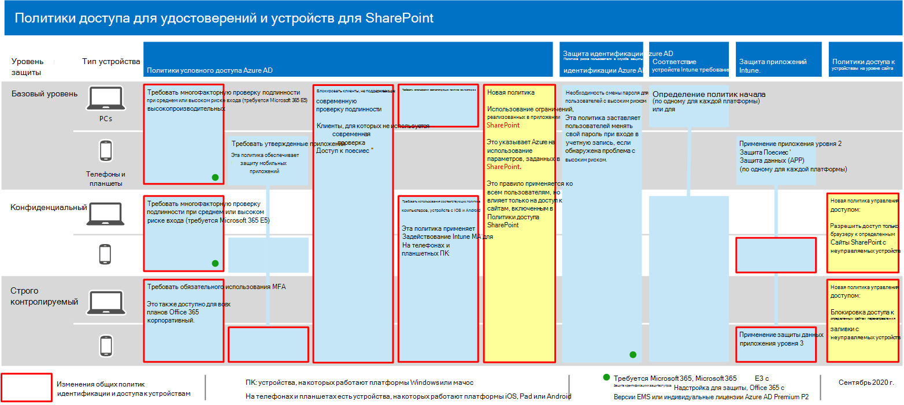

# Рекомендации политики для защиты сайтов и файлов SharePoint

В этой статье описано, как реализовать рекомендуемые политики доступа к удостоверениям и устройствам для защиты SharePoint и OneDrive для бизнеса. Это руководство построено на [общих политиках доступа к удостоверениям и устройствам.](identity-access-policies.md)

Эти рекомендации основаны на трех различных уровнях безопасности и защиты файлов SharePoint, которые можно применять в зависимости от степени детализации ваших потребностей: **базовый,** конфиденциальный и строго **регулируемый**. Дополнительные сведения об этих уровнях безопасности и рекомендуемых клиентских операционных системах, на которые ссылается эта рекомендация в [обзоре.](microsoft-365-policies-configurations.md)

Помимо реализации этого руководства обязательно настройте на сайтах SharePoint необходимый уровень защиты, включая настройку соответствующих разрешений для конфиденциального и строго регулируемого контента.

## Обновление общих политик для поддержки SharePoint и OneDrive для бизнеса

Чтобы защитить файлы в SharePoint и OneDrive, на следующей схеме показано, какие политики необходимо обновить из общих политик доступа к удостоверениям и устройствам.

[См. более крупную версию этого изображения](https://github.com/MicrosoftDocs/microsoft-365-docs/raw/public/microsoft-365/media/microsoft-365-policies-configurations/identity-access-ruleset-sharepoint.png)

Если вы включили SharePoint при создании общих политик, вам нужно только создать новые политики. Для политик условного доступа SharePoint включает OneDrive.

Новые политики реализуют защиту устройств для конфиденциального и строго регулируемого контента, применяя определенные требования к доступу к сайтам SharePoint, которые вы указываете.

В следующей таблице перечислены политики, которые необходимо просмотреть и обновить, или создать новые для SharePoint. Общие политики ссылались на связанные инструкции по настройке в статье "Общие политики доступа к удостоверениям [и устройствам".](identity-access-policies.md)

|Уровень защиты|Политики|Дополнительная информация|
|---|---|---|
|**Базовый уровень**|[Требовать многофаксную оценку, если риск при *входе* средний или *высокий*](identity-access-policies.md#require-mfa-based-on-sign-in-risk)|Включить SharePoint в назначение облачных приложений.|
||[Блокирование клиентов, не поддерживающих современную проверку подлинности](identity-access-policies.md#block-clients-that-dont-support-modern-authentication)|Включить SharePoint в назначение облачных приложений.|
||[Применение политик защиты данных APP](identity-access-policies.md#apply-app-data-protection-policies)|Убедитесь, что все рекомендуемые приложения включены в список приложений. Обязательно обновите политику для каждой платформы (iOS, Android, Windows).|
||[Требовать использования соответствующих политике компьютеров](identity-access-policies.md#require-compliant-pcs-but-not-compliant-phones-and-tablets)|Включит SharePoint в список облачных приложений.|
||[Использование принудительно примененных ограничений для приложений в SharePoint](#use-app-enforced-restrictions-in-sharepoint)|Добавьте эту новую политику. Это указывает Azure Active Directory (Azure AD) на использование параметров, указанных в SharePoint. Эта политика применяется ко всем пользователям, но влияет только на доступ к сайтам, включенным в политики доступа SharePoint.|
|**Конфиденциально**|[Требовать многофаксную оценку, если риск при входе *низкий,* *средний* или *высокий*](identity-access-policies.md#require-mfa-based-on-sign-in-risk)|Включаем SharePoint в назначения облачных приложений.|
||[Требовать совместимые компьютеры *и мобильные* устройства](identity-access-policies.md#require-compliant-pcs-and-mobile-devices)|Включит SharePoint в список облачных приложений.|
||[Политика управления доступом SharePoint:](#sharepoint-access-control-policies)разрешить доступ только из браузера к определенным сайтам SharePoint с неугодных устройств.|Это предотвращает редактирование и скачивание файлов. Используйте PowerShell для указания сайтов.|
|**Строго контролируемый**|[*Всегда требуется* многофаксная](identity-access-policies.md#require-mfa-based-on-sign-in-risk)|Включить SharePoint в назначение облачных приложений.|
||[Политика управления доступом SharePoint:](#use-app-enforced-restrictions-in-sharepoint)блокировка доступа к определенным сайтам SharePoint с неугодных устройств.|Используйте PowerShell для указания сайтов.|
|

## Использование принудительно примененных к приложениям ограничений в SharePoint

Если вы реализуете элементы управления доступом в SharePoint, необходимо создать эту политику условного доступа в Azure AD, чтобы сообщить Azure AD о принудительном выполнении политик, настроенных в SharePoint. Эта политика применяется ко всем пользователям, но затрагивает доступ к сайтам, которые вы указываете с помощью PowerShell, только при создании элементов управления доступом в SharePoint.

Чтобы настроить эту политику, см. раздел "Блокировка или ограничение доступа к определенным коллекциям веб-сайтов SharePoint или учетным записям OneDrive" в подстроке "Управление доступом с [неугодных устройств".](https://docs.microsoft.com/sharepoint/control-access-from-unmanaged-devices)

## Политики управления доступом SharePoint

Корпорация Майкрософт рекомендует защищать контент на сайтах SharePoint с помощью конфиденциального и строго регулируемого контента с помощью элементов управления доступом к устройствам. Для этого необходимо создать политику, которая определяет уровень защиты и сайты, к которые необходимо применить защиту.

- Конфиденциальные сайты: разрешить доступ только для браузера. Это не позволяет пользователям редактировать и скачивать файлы.
- Строго регулируемые сайты: блокировка доступа с неугодных устройств.

См. раздел "Блокировка или ограничение доступа к определенным коллекциям сайтов SharePoint или учетным записям OneDrive" в под управлением доступа с [неугодных устройств.](https://docs.microsoft.com/sharepoint/control-access-from-unmanaged-devices)

## Как эти политики работают вместе

Важно понимать, что разрешения для сайтов SharePoint обычно основаны на бизнес-потребности в доступе к сайтам. Эти разрешения управляются владельцами сайтов и могут быть очень динамическими. Использование политик доступа к устройствам SharePoint обеспечивает защиту этих сайтов независимо от того, назначены ли пользователи группе Azure AD, связанной с базовой, конфиденциальной или строго регулируемой защитой.

На следующем рисунке приводится пример того, как политики доступа к устройствам SharePoint защищают доступ к сайтам для пользователя.

[См. более крупную версию этого изображения](https://github.com/MicrosoftDocs/microsoft-365-docs/raw/public/microsoft-365/media/microsoft-365-policies-configurations/SharePoint-rules-scenario.png)

Ему назначены базовые политики условного доступа, но он может получить доступ к сайтам SharePoint с конфиденциальной или строго регулируемой защитой.

- Если Он имеет доступ к конфиденциальному или строго регулируемым сайту, он является участником своего ПК, его доступ предоставляется, если его компьютер соответствует требованиям.
- Если Ерма получает доступ к конфиденциальному сайту, он является участником неугодного телефона, что разрешено для пользователей базового уровня, он получит доступ только в браузере к конфиденциальному сайту из-за политики доступа к устройствам, настроенной для этого сайта.
- Если Ерма получит доступ к строго регулируемому сайту, он является участником неугодного телефона, он будет заблокирован из-за политики доступа, настроенной для этого сайта. Он может получить доступ к этому сайту только с помощью управляемого и совместимго ПК.

## Следующий этап

Настройте политики условного доступа для:

- [Microsoft Teams](teams-access-policies.md)
- [Exchange Online](secure-email-recommended-policies.md)
