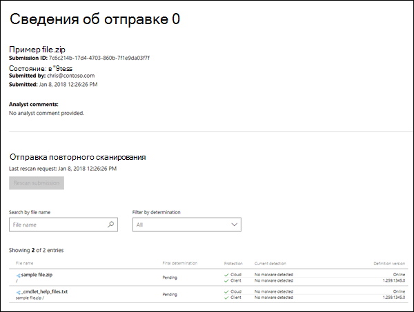

# Отправка вредоносных программ и не вредоносных программ в Корпорацию Майкрософт для анализаSubmit malware and non-malware to Microsoft for analysis

[!INCLUDE [Microsoft 365 Defender rebranding](../includes/microsoft-defender-for-office.md)]

**Область применения****Applies to**
- [Exchange Online ProtectionExchange Online Protection](exchange-online-protection-overview.md)
- [Microsoft Defender для Office 365 (план 1 и план 2)Microsoft Defender for Office 365 plan 1 and plan 2](defender-for-office-365.md)
- [Microsoft 365 DefenderMicrosoft 365 Defender](../defender/microsoft-365-defender.md)

> [!NOTE]
> Если вы администратор в организации с Exchange Online почтовыми ящиками, рекомендуем использовать портал Отправки в Центре & соответствия требованиям.If you're an admin in an organization with Exchange Online mailboxes, we recommend that you use the Submissions portal in the Security & Compliance Center. Дополнительные сведения см. в материале Использование отправки администратора для отправки в Корпорацию Майкрософт подозрительных [спама, фишинга, URL-адресов и файлов.](admin-submission.md)For more information, see [Use Admin Submission to submit suspected spam, phish, URLs, and files to Microsoft](admin-submission.md).

В Microsoft 365 организациях с почтовыми ящиками в Exchange Online или автономных организациях Exchange Online Protection (EOP) без Exchange Online почтовых ящиков EOP включает защиту от вредоносных программ, которая автоматически включена.In Microsoft 365 organizations with mailboxes in Exchange Online or standalone Exchange Online Protection (EOP) organizations without Exchange Online mailboxes, EOP includes anti-malware protection that's automatically enabled. Дополнительные сведения см. в [программе Защита от вредоносных программ в EOP.](anti-malware-protection.md)For more information, see [Anti-malware protection in EOP](anti-malware-protection.md).

Вы, вероятно, слышали следующие лучшие практики в течение многих лет:You've probably heard the following best practices for years:

- Избегайте открытия подозрительных сообщений.Avoid opening messages that look suspicious.
- Никогда не открывай вложение от кого-то, кого вы не знаете.Never open an attachment from someone you don't know.
- Избегайте открытия вложений в сообщениях, которые призывают вас открыть или щелкнуть их.Avoid opening attachments in messages that urge you to open or click them.

Но что делать, если вы получаете сообщение с подозрительным вложением?But what can you do if you receive a message with a suspicious attachment? Или что делать, если вы подозреваете, что компьютер или устройство было заражено вложением электронной почты, которое прошло наши фильтры?Or what if you suspect that your computer or device was infected by an email attachment that made it past our filters? В этих случаях необходимо отправить вложение вредоносных программ в Корпорацию Майкрософт.In these cases, you should submit the malware attachment to Microsoft. И наоборот, если вложение в сообщении электронной почты было неправильно идентифицировано как вредоносное ПО, вы также можете отправить его.Conversely, if an attachment in an email message was incorrectly identified as malware, you can submit that, too.

## Что нужно знать перед началом работыWhat do you need to know before you begin?

- Сообщения с вложениями, которые содержат скрипты или другие вредоносные исполняемые, считаются вредоносными программами, и вы можете использовать процедуры в этой статье, чтобы сообщить о них.Messages with attachments that contain scripts or other malicious executables are considered malware, and you can use the procedures in this article to report them.

- Сообщения со ссылками на вредоносные сайты считаются спамом.Messages with links to malicious sites are considered spam. Дополнительные сведения о сообщении о нежелательной почте и не спаме см. в материалах [Report messages and files to Microsoft.](report-junk-email-messages-to-microsoft.md)For more information about reporting spam and non-spam, see [Report messages and files to Microsoft](report-junk-email-messages-to-microsoft.md).

## Отправка файлов вредоносных программ в Корпорацию МайкрософтSubmit malware files to Microsoft

Перейдите портал для обнаружения угроз (Microsoft) веб-сайт для <https://www.microsoft.com/wdsi/filesubmission> отправки файла.Go to the Microsoft Security Intelligence website at <https://www.microsoft.com/wdsi/filesubmission> to submit the file. Чтобы получать обновления анализа, войдите на веб-сайт или введите допустимый адрес электронной почты.To receive analysis updates, sign into the website, or enter a valid email address. Рекомендуется использовать свою учетную запись Microsoft work или school.We recommend that you use your Microsoft work or school account.

После отправки файла или файлов обратите внимание на **ID** отправки, созданный для примера отправки `7c6c214b-17d4-4703-860b-7f1e9da03f7f` (например).After you've uploaded the file or files, note the **Submission ID** that's created for your sample submission (for example, `7c6c214b-17d4-4703-860b-7f1e9da03f7f`).

После получения примера мы будем исследовать.After we receive the sample, we'll investigate. Если мы определяем, что пример файла вредоносный, мы примем меры по исправлению, чтобы предотвратить незамеченное вредоносное ПО.If we determine that the sample file is malicious, we'll take corrective action to prevent the malware from going undetected.

Если вы продолжаете получать зараженные сообщения или вложения, вам следует скопировать заглавные книги сообщений из сообщения электронной почты и обратиться в службу поддержки и обслуживания клиентов Майкрософт для получения дополнительной помощи.If you continue receiving infected messages or attachments, then you should copy the message headers from the email message, and contact Microsoft Customer Service and Support for further assistance. Убедитесь, что ваш **ID отправки также** готов.Be sure to have your **Submission ID** ready as well.

## Отправка файлов, не вредоносных программ, в Корпорацию МайкрософтSubmit non-malware files to Microsoft

Вы также можете отправить на веб-сайт файл, который, по вашему мнению, был неправильно определен в качестве вредоносных программ (просто выберите **Нет** для вопроса, считаете ли вы, что этот файл содержит **вредоносные программы?).**You can also submit a file that you believe was incorrectly identified as malware to the website (just select **No** for the question, **Do you believe this file contains malware?**).

После получения примера мы будем исследовать.After we receive the sample, we'll investigate. Если мы определим, что пример файла чист, мы примем меры по исправлению, чтобы предотвратить обнаружение файла в качестве вредоносных программ.If we determine that the sample file is clean, we'll take corrective action to prevent the file from being detected as malware.
