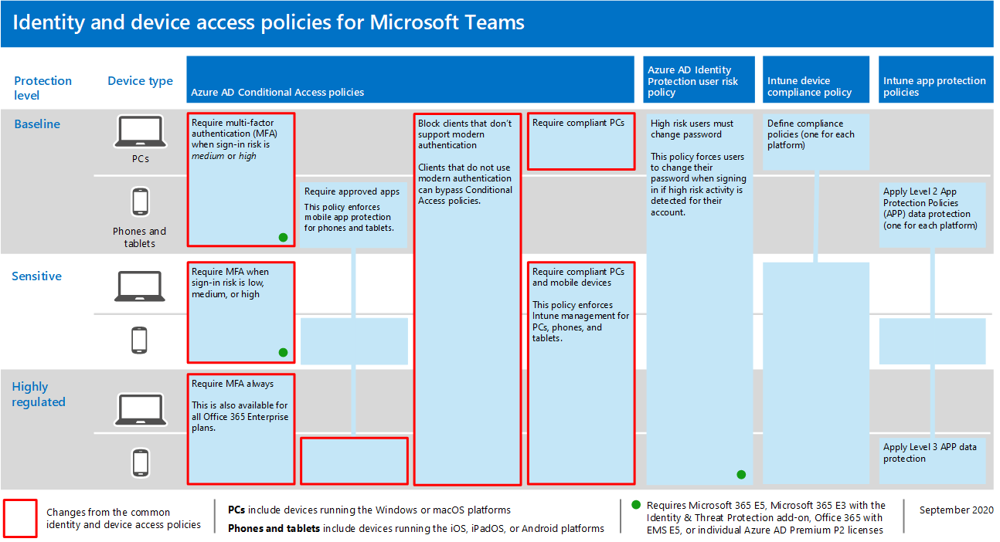

# Рекомендации политики для защиты чатов, групп и файлов TeamsPolicy recommendations for securing Teams chats, groups, and files

В этой статье описано, как реализовать рекомендуемые политики доступа к удостоверениям и устройствам для защиты чатов, групп и содержимого Microsoft Teams, например файлов и календарей.This article describes how to implement the recommended identity and device-access policies to protect Microsoft Teams chats, groups, and content such as files and calendars. Это руководство построено на общих политиках доступа к [удостоверениям](identity-access-policies.md)и устройствам с дополнительной информацией, относящуюся к Teams.This guidance builds on the [common identity and device access policies](identity-access-policies.md), with additional information that's Teams-specific. Так как Teams интегрируется с другими нашими продуктами, см. также рекомендации политики для защиты сайтов и файлов [SharePoint,](sharepoint-file-access-policies.md) а также рекомендации политики для [защиты электронной почты.](secure-email-recommended-policies.md)Because Teams integrates with our other products, also see [Policy recommendations for securing SharePoint sites and files](sharepoint-file-access-policies.md) and [Policy recommendations for securing email](secure-email-recommended-policies.md).

Эти рекомендации основаны на трех различных уровнях безопасности и защиты для Teams, которые можно применять в зависимости от степени детализации ваших потребностей: базовые, конфиденциальные и строго регулируемые.These recommendations are based on three different tiers of security and protection for Teams that can be applied based on the granularity of your needs: baseline, sensitive, and highly regulated. Вы можете узнать больше об этих уровнях безопасности и рекомендуемых политиках, на которые ссылались эти рекомендации в конфигурациях доступа к удостоверениям [и устройствам.](microsoft-365-policies-configurations.md)You can learn more about these security tiers and the recommended policies referenced by these recommendations in the [Identity and device access configurations](microsoft-365-policies-configurations.md).

В эту статью включены дополнительные рекомендации по развертыванию Teams, в том числе для пользователей за пределами организации.More recommendations specific to Teams deployment are included in this article to cover specific authentication circumstances, including for users outside your organization. Для обеспечения полной безопасности необходимо следовать этим рекомендациям.You will need to follow this guidance for a complete security experience.

## Начало работы с Teams перед другими зависимыми службамиGetting started with Teams before other dependent services

Вам не нужно включить зависимые службы для начала работы с Microsoft Teams.You don't need to enable dependent services to get started with Microsoft Teams. Все эти службы "просто работают".These services will all "just work." Однако необходимо быть готовым к управлению следующими элементами, связанными со службами:However, you do need to be prepared to manage the following service-related elements:

- Группы Microsoft 365Microsoft 365 groups
- Сайты групп SharePointSharePoint team sites
- OneDrive для бизнесаOneDrive for Business
- Почтовые ящики ExchangeExchange mailboxes
- Потоковая видео и планы Планировщика (если эти службы включены)Stream videos and Planner plans (if these services are enabled)

## Обновление общих политик для поддержки TeamsUpdating common policies to include Teams

Чтобы защитить чат, группы и содержимое в Teams, на следующей схеме показано, какие политики необходимо обновить из общих политик доступа к удостоверениям и устройствам.To protect chat, groups and content in Teams, the following diagram illustrates which policies to update from the the common identity and device access policies. Чтобы каждая политика обновлялась, убедитесь, что Teams и зависимые службы включены в назначение облачных приложений.For each policy to update, make sure that Teams and dependent services are included in the assignment of cloud apps.

[См. более крупную версию этого изображенияSee a larger version of this image](https://github.com/MicrosoftDocs/microsoft-365-docs/raw/public/microsoft-365/media/microsoft-365-policies-configurations/identity-access-ruleset-teams.png)

Эти службы являются зависимыми службами, которые необходимо включить в назначение облачных приложений для Teams:These services are the dependent services to include in the assignment of cloud apps for Teams:

- Microsoft TeamsMicrosoft Teams
- SharePoint и OneDrive для бизнесаSharePoint and OneDrive for Business
- Exchange OnlineExchange Online
- Skype для бизнеса OnlineSkype for Business Online
- Microsoft Stream (записи собраний)Microsoft Stream (meeting recordings)
- Планировщик (задачи Планировщика и данные плана)Microsoft Planner (Planner tasks and plan data)

В этой таблице перечислены политики, которые необходимо пересмотреть, и ссылки на каждую политику в общих политиках доступа к удостоверениям и устройствам [с](identity-access-policies.md)более широким набором политик для всех приложений Office.This table lists the policies that need to be revisited and links to each policy in the [common identity and device access policies](identity-access-policies.md), which has the wider policy set for all Office applications.

|Уровень защитыProtection level|ПолитикиPolicies|Дополнительные сведения о реализации TeamsFurther information for Teams implementation|
|---|---|---|
|**Базовый уровень****Baseline**|[Требовать многофаксную оценку, если риск при *входе* средний или *высокий*Require MFA when sign-in risk is *medium* or *high*](identity-access-policies.md#require-mfa-based-on-sign-in-risk)|Убедитесь, что Teams и зависимые службы включены в список приложений.Be sure Teams and dependent services are included in the list of apps. В Teams также есть правила гостевого доступа и внешнего доступа, которые вы узнаете об этих правилах далее в этой статье.Teams has Guest Access and External Access rules to consider as well, you'll learn more about these rules later in this article.|
||[Блокирование клиентов, не поддерживающих современную проверку подлинностиBlock clients that don't support modern authentication](identity-access-policies.md#block-clients-that-dont-support-multi-factor)|Включаем Teams и зависимые службы в назначение облачных приложений.Include Teams and dependent services in the assignment of cloud apps.|
||[Необходимость смены пароля для пользователей с высоким рискомHigh risk users must change password](identity-access-policies.md#high-risk-users-must-change-password)|Заставляет пользователей Teams сменить пароль при входе в учетную запись, если для их учетной записи обнаружены действия с высоким уровнем риска.Forces Teams users to change their password when signing in if high-risk activity is detected for their account. Убедитесь, что Teams и зависимые службы включены в список приложений.Be sure Teams and dependent services are included in the list of apps.|
||[Применение политик защиты данных APPApply APP data protection policies](identity-access-policies.md#apply-app-data-protection-policies)|Убедитесь, что Teams и зависимые службы включены в список приложений.Be sure Teams and dependent services are included in the list of apps. Обновите политику для каждой платформы (iOS, Android, Windows).Update the policy for each platform (iOS, Android, Windows).|
||[Определение политик соответствия устройств требованиямDefine device compliance policies](identity-access-policies.md#define-device-compliance-policies)|Включаем Teams и зависимые службы в эту политику.Include Teams and dependent services in this policy.|
||[Требовать использования соответствующих политике компьютеровRequire compliant PCs](identity-access-policies.md#require-compliant-pcs-but-not-compliant-phones-and-tablets)|Включаем Teams и зависимые службы в эту политику.Include Teams and dependent services in this policy.|
|**Конфиденциально****Sensitive**|[Требовать многофаксную оценку, если риск при входе *низкий,* *средний* или *высокий*Require MFA when sign-in risk is *low*, *medium* or *high*](identity-access-policies.md#require-mfa-based-on-sign-in-risk)|В Teams также есть правила гостевого доступа и внешнего доступа, которые вы узнаете об этих правилах далее в этой статье.Teams has Guest Access and External Access rules to consider as well, you'll learn more about these rules later in this article. Включаем Teams и зависимые службы в эту политику.Include Teams and dependent services in this policy.|
||[Требовать совместимые компьютеры *и мобильные* устройстваRequire compliant PCs *and* mobile devices](identity-access-policies.md#require-compliant-pcs-and-mobile-devices)|Включаем Teams и зависимые службы в эту политику.Include Teams and dependent services in this policy.|
|**Строго контролируемый****Highly regulated**|[Всегда требуется многофаксная многофаксная *многофаксная**Always* require MFA](identity-access-policies.md#require-mfa-based-on-sign-in-risk)|Независимо от удостоверения пользователя, MFA будет использоваться вашей организацией.Regardless of user identity, MFA will be used by your organization. Включаем Teams и зависимые службы в эту политику.Include Teams and dependent services in this policy. |
|

## Архитектура зависимых служб TeamsTeams dependent services architecture

Для справки на следующей схеме показано, на чем основывается Teams.For reference, the following diagram illustrates the services Teams relies on. Дополнительные сведения и иллюстрации см. в microsoft Teams и связанных службах повышения производительности [в Microsoft 365 для ИТ-архитекторов.](../../solutions/productivity-illustrations.md)For more information and illustrations, see [Microsoft Teams and related productivity services in Microsoft 365 for IT architects](../../solutions/productivity-illustrations.md).

[См. более крупную версию этого изображенияSee a larger version of this image](https://github.com/MicrosoftDocs/microsoft-365-docs/raw/public/microsoft-365/media/microsoft-365-policies-configurations/identity-access-logical-architecture-teams.png)

## Гостевой и внешний доступ для TeamsGuest and external access for Teams

Microsoft Teams определяет следующие типы доступа:Microsoft Teams defines the following access types:

- **Гостевой** доступ использует учетную запись Azure AD B2B для гостя или внешнего пользователя, который может быть добавлен в качестве участника команды и иметь все разрешения на доступ к коммуникациям и ресурсам команды.**Guest access** uses an Azure AD B2B account for a guest or external user that can be added as a member of a team and have all permissioned access to the communication and resources of the team.

- **Внешний доступ** для внешнего пользователя без учетной записи Azure AD B2B.**External access** is for an external user that does not have an Azure AD B2B account. Внешний доступ может включать приглашения и участие в звонках, чатах и собраниях, но не включает членство в команде и доступ к ресурсам команды.External access can include invitations and participation in calls, chats, and meetings, but does not include team membership and access to the resources of the team.

Политики условного доступа применяются только к гостевому доступу в Teams, так как существует соответствующая учетная запись Azure AD B2B.Conditional Access policies only apply to guest access in Teams because there is a corresponding Azure AD B2B account.

<!--
In Azure AD, guest and external users are the same. The user type for both of these is Guest. Guest users are B2B users. Microsoft Teams differentiates between guest users and external users in the app. While it's important to understand how each of these are treated in Teams, both types of users are B2B users in Azure AD and the recommended policies for B2B users apply to both.

-->

Рекомендуемые политики, разрешающие доступ гостевых и внешних пользователей с учетной записью Azure AD B2B, см. в политиках, разрешающих гостевой и внешний доступ к учетной записи [B2B.](identity-access-policies-guest-access.md)For recommended policies to allow access for guest and external users with an Azure AD B2B account, see [Policies for allowing guest and external B2B account access](identity-access-policies-guest-access.md).

### Гостевой доступ в TeamsGuest access in Teams

В дополнение к политикам для пользователей, которые являются внутренними по вашей организации или организации, администраторы могут разрешить гостевой доступ для индивидуального доступа пользователей, которые являются внешними по бизнесу или организации, для доступа к ресурсам Teams и взаимодействия с внутренними людьми для таких вещей, как групповые беседы, чат и собрания.In addition to the policies for users who are internal to your business or organization, administrators may enable guest access to allow, on a user-by-user basis, people who are external to your business or organization to access Teams resources and interact with internal people for things like group conversations, chat, and meetings.

Дополнительные сведения о гостевом доступе и его реализации см. в гостевом [доступе Teams.](https://docs.microsoft.com/microsoftteams/guest-access)For more information about guest access and how to implement it, see  [Teams guest access](https://docs.microsoft.com/microsoftteams/guest-access).

### Внешний доступ в TeamsExternal access in Teams

Внешний доступ иногда путают с гостевим доступом, поэтому важно понимать, что эти два не внутренних механизма доступа являются разными типами доступа.External access is sometimes confused with guest access, so it's important to be clear that these two non-internal access mechanisms are different types of access.

Внешний доступ — это способ для пользователей Teams из всего внешнего домена находить, звонить, общаться в чате и устанавливать собрания с пользователями в Teams.External access is a way for Teams users from an entire external domain to find, call, chat, and set up meetings with your users in Teams. Администраторы Teams настраивают внешний доступ на уровне организации.Teams administrators configure external access at the organization level. Дополнительные сведения см. в под [управлением внешним доступом в Microsoft Teams.](https://docs.microsoft.com/microsoftteams/manage-external-access)For more information, see [Manage external access in Microsoft Teams](https://docs.microsoft.com/microsoftteams/manage-external-access).

Пользователи внешнего доступа имеют меньший доступ и функциональные возможности, чем отдельные пользователи, добавленные через гостевой доступ.External access users have less access and functionality than an individual who's been added via guest access. Например, пользователи внешнего доступа могут общаться с внутренними пользователями в Teams, но не могут получать доступ к каналам команд, файлам и другим ресурсам.For example, external access users can chat with your internal users with Teams but cannot access team channels, files, or other resources.

Внешний доступ не использует учетные записи пользователей Azure AD B2B и поэтому не использует политики условного доступа.External access does not use Azure AD B2B user accounts and therefore does not use Conditional Access policies.

## Политики TeamsTeams policies

Вне общих политик, перечисленных выше, существуют специальные политики Teams, которые можно и нужно настроить для управления различными функциональными возможностями Teams.Outside of the common policies listed above, there are Teams-specific policies that can and should be configured to manage various Teams functionalities.

### Политики Teams и каналовTeams and channels policies

Teams и каналы — это два часто используемых элемента в Microsoft Teams, и существуют политики, которые можно использовать для управления тем, что пользователи могут и не могут делать при использовании команд и каналов.Teams and channels are two commonly used elements in Microsoft Teams, and there are policies you can put in place to control what users can and cannot do when using teams and channels. Хотя вы можете создать глобальную команду, если в вашей организации имеется не более 5000 пользователей, скорее всего, будет полезно иметь меньшие команды и каналы для определенных целей в соответствии с потребностями организации.While you can create a global team, if your organization has 5000 users or less, you are likely to find it helpful to have smaller teams and channels for specific purposes, in-line with your organizational needs.

Рекомендуется изменить политику по умолчанию или создать настраиваемые политики, и вы можете узнать больше об управлении политиками по этой ссылке: управление политиками [команд в Microsoft Teams.](https://docs.microsoft.com/microsoftteams/teams-policies)Changing the default policy or creating custom policies would be recommended, and you can learn more about managing your policies at this link: [Manage teams policies in Microsoft Teams](https://docs.microsoft.com/microsoftteams/teams-policies).

### Политики обмена сообщениямиMessaging policies

Управление сообщениями или чатом также может быть за счет глобальной политики по умолчанию или с помощью настраиваемой политики, что позволяет пользователям общаться друг с другом соответствующим образом.Messaging, or chat, can also be managed through the default global policy, or through custom policies, and this can help your users communicate with one another in a way that's appropriate for your organization. Эти сведения можно просмотреть в управлении политиками [обмена сообщениями в Teams.](https://docs.microsoft.com/microsoftteams/messaging-policies-in-teams)This information can be reviewed at [Managing messaging policies in Teams](https://docs.microsoft.com/microsoftteams/messaging-policies-in-teams).

### Политики собранийMeeting policies

Обсуждение Teams не будет завершено без планирования и реализации политик собраний Teams.No discussion of Teams would be complete without planning and implementing policies around Teams meetings. Собрания — это важный компонент Teams, позволяющий пользователям формально встречаться и представлять их одновременно многим пользователям, а также делиться содержимым, относяимся к собранию.Meetings are an essential component of Teams, allowing people to formally meet and present to many users at once, and to share content relevant to the meeting. Крайне важно установить правильные политики для организации в отношении собраний.Setting the right policies for your organization around meetings is essential.

Дополнительные сведения об управлении [политиками собраний в Teams.](https://docs.microsoft.com/microsoftteams/meeting-policies-in-teams)For more information, review [Manage meeting policies in Teams](https://docs.microsoft.com/microsoftteams/meeting-policies-in-teams).

### Политики разрешений для приложенийApp permission policies

Teams также позволяет использовать приложения в различных местах, таких как каналы или личные чаты.Teams also allows you to use apps in various places, such as channels or personal chats. Наличие политик для того, какие приложения можно добавлять и использовать, а также где, важно для поддержания среды с богатым содержимым, которая также является безопасной.Having policies around what apps can be added and used, and where, is essential to maintaining a content-rich environment that is also secure.

Дополнительные прочтения о политиках разрешений для приложений можно узнать в под управлением политик разрешений [приложений в Microsoft Teams.](https://docs.microsoft.com/microsoftteams/teams-app-permission-policies)For more reading about App Permission Policies, check out [Manage app permission policies in Microsoft Teams](https://docs.microsoft.com/microsoftteams/teams-app-permission-policies).

## Дальнейшие действияNext steps

Настройте политики условного доступа для:Configure Conditional Access policies for:

- [Exchange OnlineExchange Online](secure-email-recommended-policies.md)
- [SharePointSharePoint](sharepoint-file-access-policies.md)
