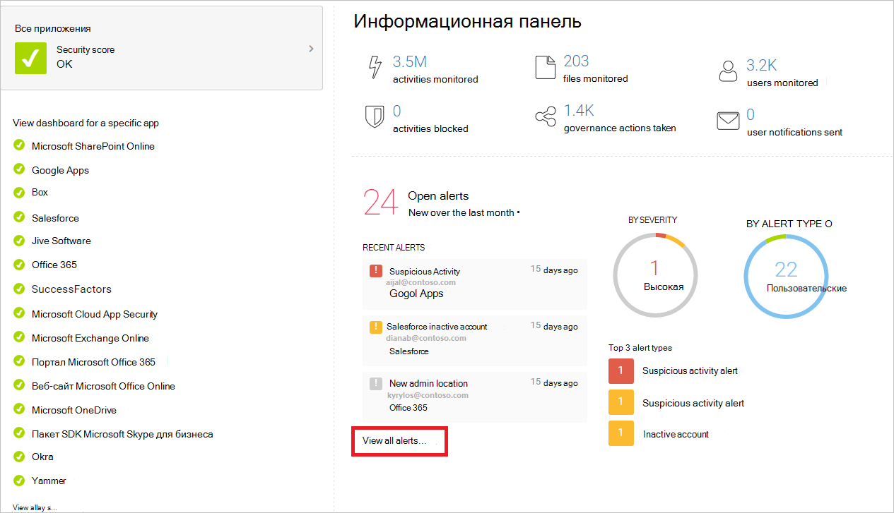

# Настройка клиента Microsoft 365 для улучшения безопасности Configure your Microsoft 365 tenant for increased security

[!INCLUDE [Microsoft 365 Defender rebranding](../includes/microsoft-defender-for-office.md)]

**Область применения****Applies to**
- [Exchange Online ProtectionExchange Online Protection](exchange-online-protection-overview.md)
- [Microsoft Defender для Office 365 (план 1 и план 2)Microsoft Defender for Office 365 plan 1 and plan 2](defender-for-office-365.md)
- [Microsoft 365 DefenderMicrosoft 365 Defender](../defender/microsoft-365-defender.md)

В этом разделе вы можете пройти рекомендуемую конфигурацию для параметров для всех клиентов, которые влияют на безопасность Microsoft 365 среды.This topic walks you through recommended configuration for tenant-wide settings that affect the security of your Microsoft 365 environment. Для обеспечения безопасности может потребоваться более или менее безопасная безопасность.Your security needs might require more or less security. Используйте эти рекомендации в качестве отправной точки.Use these recommendations as a starting point.

## Проверка Office 365 балловCheck Office 365 Secure Score

Office 365 Secure Score анализирует безопасность организации на основе регулярных действий и параметров безопасности и назначает оценку.Office 365 Secure Score analyzes your organization's security based on your regular activities and security settings and assigns a score. Начните с сведений о текущем показателе.Begin by taking note of your current score. Настройка некоторых параметров для клиента увеличит ваш балл.Adjusting some tenant-wide settings will increase your score. Цель заключается не в достижении максимального балла, а в том, чтобы иметь возможность защитить окружающую среду, которая не влияет на производительность для пользователей.The goal is not to achieve the max score, but to be aware of opportunities to protect your environment that do not negatively affect productivity for your users. См. [запись Microsoft Secure Score](../defender/microsoft-secure-score.md).See [Microsoft Secure Score](../defender/microsoft-secure-score.md).

## Настройка политик управления угрозами в центре Microsoft 365 безопасностиTune threat management policies in the Microsoft 365 security center

Центр Microsoft 365 безопасности включает возможности, защищающие среду.The Microsoft 365 security center includes capabilities that protect your environment. Он также включает отчеты и панели мониторинга, которые можно использовать для мониторинга и принятия мер.It also includes reports and dashboards you can use to monitor and take action. В некоторых областях есть конфигурации политик по умолчанию.Some areas come with default policy configurations. В некоторых областях не содержатся политики или правила по умолчанию.Some areas do not include default policies or rules. Посетите эти политики под управлением угрозами, чтобы настроить параметры управления угрозами для более безопасной среды.Visit these policies under threat management to tune threat management settings for a more secure environment.

 

****

|ОбластьArea|Включает политику по умолчаниюIncludes a default policy|РекомендацияRecommendation|
|---|---|---|
|**Anti-phishing****Anti-phishing**|ДаYes|<ul><li>Защита от обезличения . Если у вас есть Defender для Office 365 и настраиваемый домен, настройте параметры защиты от внешнего имени в политике защиты от фишинга по умолчанию, чтобы защитить учетные записи электронной почты наиболее ценных пользователей, таких как генеральный директор, и защитить домен.Impersonation protection — If you have Defender for Office 365 and a custom domain, configure the impersonation protection settings in the default anti-phishing policy to protect the email accounts of your most valuable users, such as your CEO, and to protect your domain. Дополнительные сведения. [Параметры обезличения в политиках по](set-up-anti-phishing-policies.md#impersonation-settings-in-anti-phishing-policies-in-microsoft-defender-for-office-365) борьбе с фишингом и [представление о обезличии](impersonation-insight.md)More information: [Impersonation settings in anti-phishing policies](set-up-anti-phishing-policies.md#impersonation-settings-in-anti-phishing-policies-in-microsoft-defender-for-office-365) and [Impersonation insight](impersonation-insight.md)</li><li>Spoof intelligence — просмотр отправителей, которые подменяют домен.Spoof intelligence — Review senders who are spoofing your domain. Блокировка или разрешение этих отправителей.Block or allow these senders. Дополнительные сведения: [сведения о подмене](learn-about-spoof-intelligence.md) сведений в EOP и [управление списком разрешить или блокировать клиента.](tenant-allow-block-list.md)More information: [Spoof intelligence insight in EOP](learn-about-spoof-intelligence.md) and [Manage the Tenant Allow/Block List](tenant-allow-block-list.md).</li></ul>|
|**Двигатель для борьбы с вредоносными программами****Anti-Malware Engine**|ДаYes|Изменение политики по умолчанию:Edit the default policy: <ul><li>Выберите **Включить фильтр общих вложений**Select **Enable the common attachments filter**</li></ul> 
 Вы также можете создавать настраиваемые политики фильтрации вредоносных программ и применять их к указанным пользователям, группам или доменам в вашей организации.You can also create custom malware filter policies and apply them to specified users, groups, or domains in your organization. 
 Дополнительные сведения:More information: <ul><li>[Защита от вредоносных программAnti-malware protection](anti-malware-protection.md)</li><li>[Настройка политик защиты от вредоносных программConfigure anti-malware policies](configure-anti-malware-policies.md)</li></ul>|
|**Сейф Вложения в Microsoft Defender для Office 365****Safe Attachments in Microsoft Defender for Office 365**|НетNo|На главной странице Сейф вложения щелкните **Глобальные параметры** и включайте этот параметр:On the main page for Safe Attachments, click **Global settings** and turn on this setting: <ul><li>**Включение Defender для Office 365 в SharePoint, OneDrive и Microsoft Teams****Turn on Defender for Office 365 for SharePoint, OneDrive, and Microsoft Teams**</li></ul> 
 Создайте политику Сейф вложения с помощью этих параметров:Create a Safe Attachments policy with these settings: <ul><li> **Блок.** **Выберите блок в** качестве неизвестного ответа на вредоносные программы.**Block**: Select **Block** as the unknown malware response.</li><li>**Включить** перенаправление. Проверьте это поле и введите адрес электронной почты, например учетную запись администратора или карантина.**Enable redirect**: Check this box and enter an email address, such as an admin or quarantine account.</li><li>**Применение выше выбора, если** сканирование вредоносных программ для вложений раз или ошибка происходит : Проверьте это поле.**Apply the above selection if malware scanning for attachments times out or error occurs**: Check this box.</li><li>\**_Применяется к_*: **Получатель домена выберите** \> домен.\**_Applied to_*: **The recipient domain is** \> select your domain.</li></ul> 
 Дополнительные сведения: Сейф вложения для [SharePoint, OneDrive и Microsoft Teams](mdo-for-spo-odb-and-teams.md) и настройка [Сейф вложения](set-up-safe-attachments-policies.md)More information: [Safe Attachments for SharePoint, OneDrive, and Microsoft Teams](mdo-for-spo-odb-and-teams.md) and [Set up Safe Attachments policies](set-up-safe-attachments-policies.md)|
|**Сейф Ссылки в Microsoft Defender для Office 365****Safe Links in Microsoft Defender for Office 365**|ДаYes|На главной странице для Сейф ссылки щелкните **Глобальные параметры:**On the main page for Safe Links, click **Global settings**: <ul><li>**Используйте Сейф ссылки в: Office 365 приложениях.** Убедитесь, что этот параметр включен.**Use Safe Links in: Office 365 applications**: Verify this setting is turned on.</li><li>Не отслеживайте, когда пользователи **нажимают Сейф ссылки:** отключите этот параметр для отслеживания щелчков пользователей.**Do not track when users click Safe Links**: Turn this setting off to track user clicks.</li></ul> 
 Создайте политику Сейф ссылки с этими настройками:Create a Safe Links policy with these settings: <ul><li>**Выберите действие для неизвестных потенциально вредоносных** URL-адресов в **сообщениях.** Убедитесь, что этот параметр в действии .**Select the action for unknown potentially malicious URLs in messages**: Verify this setting is **On**.</li><li>Выберите действие для неизвестных или потенциально вредоносных **URL-адресов** в Microsoft Teams : Убедитесь, что этот параметр **в действии**.**Select the action for unknown or potentially malicious URLs within Microsoft Teams**: Verify this setting is **On**.</li><li>**Применение сканирования URL-адреса в** режиме реального времени для подозрительных ссылок и ссылок, которые указывают на файлы: Проверьте это поле.**Apply real-time URL scanning for suspicious links and links that point to files**: Check this box.</li><li>**Подождите, пока проверка URL-адресов** завершится перед доставкой сообщения. Проверьте это поле.**Wait for URL scanning to complete before delivering the message**: Check this box.</li><li>**Применение Сейф ссылки на сообщения электронной почты,** отправленные в организации: Проверьте этот поле**Apply Safe Links to email messages sent within the organization**: Check this box</li><li>**Не позволяйте пользователям щелкнуть исходный URL-адрес:** Проверьте это поле.**Do not allow users to click through to original URL**: Check this box.</li><li>**Применяется к**: **Получатель домена выберите** \> домен.**Applied To**: **The recipient domain is** \> select your domain.</li></ul> 
 Дополнительные сведения. [Настройка Сейф ссылки](set-up-safe-links-policies.md).More information: [Set up Safe Links policies](set-up-safe-links-policies.md).|
|**Anti-Spam (фильтрация почты)****Anti-Spam (Mail filtering)**|ДаYes| Что нужно посмотреть: слишком много нежелательной почты — выберите настраиваемые параметры и отредактировать политику фильтра нежелательной почты по умолчанию.What to watch for: Too much spam — Choose the Custom settings and edit the Default spam filter policy. Дополнительные сведения: [Microsoft 365 защита от нежелательной почты.](anti-spam-protection.md)More information: [Microsoft 365 Email Anti-Spam Protection](anti-spam-protection.md).|
|***Проверка подлинности электронной почты******Email Authentication***|ДаYes|Проверка подлинности электронной почты с помощью системы доменных имен (DNS) добавляет проверяемые сведения в сообщения электронной почты о отправителье электронной почты.Email authentication uses a Domain Name System (DNS) to add verifiable information to email messages about the sender of an email. Microsoft 365 настраивает проверку подлинности электронной почты для домена по умолчанию (onmicrosoft.com), но Microsoft 365 администраторы также могут использовать проверку подлинности электронной почты для пользовательских доменов.Microsoft 365 sets up email authentication for its default domain (onmicrosoft.com), but Microsoft 365 admins can also use email authentication for custom domains. Используются три метода проверки подлинности:Three authentication methods are used: <ul><li>Структура политики отправитель (или SPF).Sender Policy Framework (or SPF).</li><ul><li>Для установки [см. в Microsoft 365 настройка SPF](set-up-spf-in-office-365-to-help-prevent-spoofing.md)для предотвращения подмены.For setup, see [Set up SPF in Microsoft 365 to help prevent spoofing](set-up-spf-in-office-365-to-help-prevent-spoofing.md).</li></ul> <li>DomainKeys Identified Mail (DKIM).DomainKeys Identified Mail (DKIM).</li><ul><li>См. [в этой ссылке Использование DKIM для проверки исходящие сообщения электронной почты, отправленной из настраиваемого домена.](use-dkim-to-validate-outbound-email.md)See [Use DKIM to validate outbound email sent from your custom domain](use-dkim-to-validate-outbound-email.md).</li><li>После настройки DKIM встроим его в центр безопасности.After you've configured DKIM, enable it in the security center.</li></ul><li>Проверка подлинности, отчетности и соответствия на основе доменных сообщений (DMARC).Domain-based Message Authentication, Reporting, and Conformance (DMARC).</li><ul><li>Для установки DMARC [используйте DMARC](use-dmarc-to-validate-email.md)для проверки электронной почты в Microsoft 365.For DMARC setup [Use DMARC to validate email in Microsoft 365](use-dmarc-to-validate-email.md).</li></ul></ul>|
|

> [!NOTE]
> Для нестандартных развертывания SPF, гибридных развертывания и устранения неполадок: как Microsoft 365 [использует sender Policy Framework (SPF)](how-office-365-uses-spf-to-prevent-spoofing.md)для предотвращения подмены.For non-standard deployments of SPF, hybrid deployments, and troubleshooting: [How Microsoft 365 uses Sender Policy Framework (SPF) to prevent spoofing](how-office-365-uses-spf-to-prevent-spoofing.md).

## Просмотр панелей мониторинга и отчетов в Центре & безопасностиView dashboards and reports in the Security & Compliance Center

Чтобы узнать больше о состоянии среды, посетите эти отчеты и панели мониторинга.Visit these reports and dashboards to learn more about the health of your environment. Данные в этих отчетах станут богаче по мере использования Office 365 служб.The data in these reports will become richer as your organization uses Office 365 services. На данный момент ознакомьтесь с тем, что можно отслеживать и принимать меры.For now, be familiar with what you can monitor and take action on. Дополнительные сведения см. в сообщении Центра [& безопасности.](../../compliance/reports-in-security-and-compliance.md)For more information, see [Reports in the Security & Compliance Center](../../compliance/reports-in-security-and-compliance.md).

 

****

|Информационная панельDashboard|ОписаниеDescription|
|---|---|
|[Панель мониторинга управления угрозамиThreat management dashboard](security-dashboard.md)|В разделе **Управление** угрозами центра безопасности используйте эту панель мониторинга, чтобы увидеть угрозы, которые уже обработаны, а также в качестве удобного средства для представления отчетов бизнес-органам, принимающим решения, о том, какие возможности расследования и реагирования на угрозы уже были сделаны для обеспечения безопасности вашего бизнеса.In the **Threat management** section of the security center, use this dashboard to see threats that have already been handled, and as a handy tool for reporting out to business decision makers on what threat investigation and response capabilities have already done to secure your business.|
|[отчет обозревателя угроз (или обнаружение в режиме реального времени)](threat-explorer.md);[Threat Explorer (or real-time detections)](threat-explorer.md)|Это также в разделе **Управление угрозами** центра безопасности.This is also in the **Threat management** section of the security center. При расследовании или атаке на клиента используйте Explorer (или обнаружения в режиме реального времени) для анализа угроз.If you are investigating or experiencing an attack against your tenant, use Explorer (or real-time detections) to analyze threats. Обозреватель (и отчет о обнаружениях в режиме реального времени) показывает объем атак с течением времени, и эти данные можно анализировать по семействам угроз, инфраструктуре злоумышленников и более.Explorer (and the real-time detections report) shows you the volume of attacks over time, and you can analyze this data by threat families, attacker infrastructure, and more. Вы также можете отметить любое подозрительное сообщение электронной почты в списке Инциденты.You can also mark any suspicious email for the Incidents list.|
|Отчеты — панель мониторингаReports — Dashboard|В разделе **Отчеты** центра безопасности просматривайте отчеты аудита для SharePoint и Exchange Online организаций.In the **Reports** section of security center, view audit reports for your SharePoint Online and Exchange Online organizations. Вы также можете Azure Active Directory отчеты о входе пользователя в Azure AD, отчеты об активности пользователей и журнал аудита Azure AD со страницы **Отчеты просмотров.**You can also access Azure Active Directory (Azure AD) user sign-in reports, user activity reports, and the Azure AD audit log from the **View reports** page.|
|

## Настройка дополнительных параметров Exchange Online для клиентаConfigure additional Exchange Online tenant-wide settings

Многие элементы управления для обеспечения безопасности и защиты в центре администрирования Exchange также включены в центр безопасности.Many of the controls for security and protection in the Exchange admin center are also included in the security center. Вам не нужно настраивать их в обоих местах.You do not need to configure these in both places. Вот несколько дополнительных параметров, которые рекомендуется.Here are a couple of additional settings that are recommended.

 

****

|ОбластьArea|Включает политику по умолчаниюIncludes a default policy|РекомендацияRecommendation|
|---|---|---|
|**Почтовые Flow** (правила потока почты, также известные как правила транспорта)**Mail Flow** (mail flow rules, also known as transport rules)|НетNo|Добавьте правило потока почты, чтобы защититься от программ-вымогателей, блокируя исполняемые типы файлов и Office, содержащие макрос.Add a mail flow rule to help protect against ransomware by blocking executable file types and Office file types that contain macros. Дополнительные сведения см. в приложении [Use mail flow rules to inspect message attachments in Exchange Online.](/exchange/security-and-compliance/mail-flow-rules/inspect-message-attachments)For more information, see [Use mail flow rules to inspect message attachments in Exchange Online](/exchange/security-and-compliance/mail-flow-rules/inspect-message-attachments). 
 Дополнительные разделы:See these additional topics: <ul><li>[Защита от программ-шантажистовProtect against ransomware](../../admin/security-and-compliance/secure-your-business-data.md#5-protect-against-ransomware)</li><li>[Защита от вредоносных программ и программ-вымогателей в Microsoft 365Malware and Ransomware Protection in Microsoft 365](/compliance/assurance/assurance-malware-and-ransomware-protection)</li><li>[Восстановление после атаки вымогателей в Office 365Recover from a ransomware attack in Office 365](recover-from-ransomware.md)</li></ul> 
 Создайте правило потока почты для предотвращения автоматической пересылки электронной почты во внешние домены.Create a mail flow rule to prevent auto-forwarding of email to external domains. Дополнительные сведения см. в сведениях о смягчении правил внешнего переададации клиентов [с помощью безопасной оценки.](/archive/blogs/office365security/mitigating-client-external-forwarding-rules-with-secure-score)For more information, see [Mitigating Client External Forwarding Rules with Secure Score](/archive/blogs/office365security/mitigating-client-external-forwarding-rules-with-secure-score). 
 Дополнительные сведения: правила потока [почты (правила транспорта) в Exchange Online](/exchange/security-and-compliance/mail-flow-rules/mail-flow-rules)More information: [Mail flow rules (transport rules) in Exchange Online](/exchange/security-and-compliance/mail-flow-rules/mail-flow-rules)|
|**Включить современную проверку подлинности****Enable modern authentication**|НетNo|Современная проверка подлинности является обязательным условием для использования многофакторной проверки подлинности (MFA).Modern authentication is a prerequisite for using multi-factor authentication (MFA). MFA рекомендуется для обеспечения доступа к облачным ресурсам, включая электронную почту.MFA is recommended for securing access to cloud resources, including email. 
 См. эти разделы:See these topics: <ul><li>[Включение и отключение современной проверки подлинности в Exchange OnlineEnable or disable modern authentication in Exchange Online](/Exchange/clients-and-mobile-in-exchange-online/enable-or-disable-modern-authentication-in-exchange-online)</li><li>[Skype для бизнеса Online: Включить клиента для современной проверки подлинностиSkype for Business Online: Enable your tenant for modern authentication](https://social.technet.microsoft.com/wiki/contents/articles/34339.skype-for-business-online-enable-your-tenant-for-modern-authentication.aspx)</li></ul> 
 Современная проверка подлинности включена по умолчанию для Office 2016 года, SharePoint Online и OneDrive для бизнеса.Modern authentication is enabled by default for Office 2016 clients, SharePoint Online, and OneDrive for Business. 
 Дополнительные сведения. Как работает современная проверка подлинности [для Office 2013 и Office 2016 г.](../../enterprise/modern-auth-for-office-2013-and-2016.md)More information: [How modern authentication works for Office 2013 and Office 2016 client apps](../../enterprise/modern-auth-for-office-2013-and-2016.md)|
|

## Настройка политик общего доступа для клиента в SharePoint центре администрированияConfigure tenant-wide sharing policies in SharePoint admin center

Рекомендации Корпорации Майкрософт по настройке SharePoint сайтов группы на более высоких уровнях защиты, начиная с базовой защиты.Microsoft recommendations for configuring SharePoint team sites at increasing levels of protection, starting with baseline protection. Дополнительные сведения см. в рекомендациях политики по обеспечению безопасности [SharePoint сайтов и файлов.](sharepoint-file-access-policies.md)For more information, see [Policy recommendations for securing SharePoint sites and files](sharepoint-file-access-policies.md).

SharePoint сайтов группы, настроенных на базовом уровне, позволяют обмениваться файлами с внешними пользователями с помощью анонимных ссылок доступа.SharePoint team sites configured at the baseline level allow sharing files with external users by using anonymous access links. Рекомендуется использовать этот подход вместо отправки файлов по электронной почте.This approach is recommended instead of sending files in email.

Для поддержки целей базовой защиты настройте политики общего доступа для всех клиентов, как это рекомендуется здесь.To support the goals for baseline protection, configure tenant-wide sharing policies as recommended here. Параметры общего доступа для отдельных сайтов могут быть более жесткими, чем эта политика для клиента, но не более допустимой.Sharing settings for individual sites can be more restrictive than this tenant-wide policy, but not more permissive.

 

****

|ОбластьArea|Включает политику по умолчаниюIncludes a default policy|РекомендацияRecommendation|
|---|---|---|
|**Общий** доступ (SharePoint Online и OneDrive для бизнеса)**Sharing** (SharePoint Online and OneDrive for Business)|ДаYes|Внешний общий доступ включен по умолчанию.External sharing is enabled by default. Рекомендуется использовать эти параметры:These settings are recommended: <ul><li>Разрешить общий доступ к аутентификации внешних пользователей и использование анонимных ссылок доступа (параметр по умолчанию).Allow sharing to authenticated external users and using anonymous access links (default setting).</li><li>Анонимные ссылки доступа истекают в течение многих дней.Anonymous access links expire in this many days. Введите номер при желании, например 30 дней.Enter a number, if desired, such as 30 days.</li><li>Тип ссылки по умолчанию — выберите Внутренний (только для людей в организации).Default link type — select Internal (people in the organization only). Пользователи, желающие поделиться с помощью анонимных ссылок, должны выбрать этот параметр из меню общего доступа.Users who wish to share using anonymous links must choose this option from the sharing menu.</li></ul> 
 Дополнительные сведения. [Обзор внешнего общего доступа](/sharepoint/external-sharing-overview)More information: [External sharing overview](/sharepoint/external-sharing-overview)|
|

SharePoint центра администрирования и OneDrive для бизнеса центра администрирования включают те же параметры.SharePoint admin center and OneDrive for Business admin center include the same settings. Параметры в любом центре администрирования применяются к обоим.The settings in either admin center apply to both.

## Настройка параметров в Azure Active DirectoryConfigure settings in Azure Active Directory

Не забудьте посетить эти две области в Azure Active Directory, чтобы завершить настройку для более безопасных сред для клиента.Be sure to visit these two areas in Azure Active Directory to complete tenant-wide setup for more secure environments.

### Настройка именных местоположений (при условном доступе)Configure named locations (under conditional access)

Если в вашей организации есть офисы с защищенным доступом к сети, добавьте надежные диапазоны IP-адресов в Azure Active Directory именуемого расположения.If your organization includes offices with secure network access, add the trusted IP address ranges to Azure Active Directory as named locations. Эта функция помогает уменьшить количество сообщений о ложных срабатывательном элементе для событий риска при входе.This feature helps reduce the number of reported false positives for sign-in risk events.

См.: [Имена местоположений в Azure Active Directory](/azure/active-directory/active-directory-named-locations)See: [Named locations in Azure Active Directory](/azure/active-directory/active-directory-named-locations)

### Блокировка приложений, которые не поддерживают современную проверку подлинностиBlock apps that don't support modern authentication

Многофакторная проверка подлинности требует приложений, поддерживаюющих современную проверку подлинности.Multi-factor authentication requires apps that support modern authentication. Приложения, которые не поддерживают современную проверку подлинности, не могут быть заблокированы с помощью правил условного доступа.Apps that do not support modern authentication cannot be blocked by using conditional access rules.

В безопасных средах обязательно отключать проверку подлинности для приложений, которые не поддерживают современную проверку подлинности.For secure environments, be sure to disable authentication for apps that do not support modern authentication. Это можно сделать в Azure Active Directory с помощью скорого управления.You can do this in Azure Active Directory with a control that is coming soon.

В то же время используйте один из следующих методов для выполнения этого для SharePoint Online и OneDrive для бизнеса:In the meantime, use one of the following methods to accomplish this for SharePoint Online and OneDrive for Business:

- Используйте PowerShell, [см. в рублях Block apps, которые не используют современную](/mem/intune/protect/app-modern-authentication-block)проверку подлинности (ADAL).Use PowerShell, see [Block apps that do not use modern authentication (ADAL)](/mem/intune/protect/app-modern-authentication-block).

- Настройте это в центре администрирования SharePoint на странице "Доступ к устройству" — "Управление доступом из приложений, не пользуемых современной проверкой подлинности".Configure this in the SharePoint admin center on the "device access' page — "Control access from apps that don't use modern authentication." Выберите блок.Choose Block.

## Начало работы с Cloud App Security или Office 365 Cloud App SecurityGet started with Cloud App Security or Office 365 Cloud App Security

Используйте Office 365 Cloud App Security для оценки риска, оповещения о подозрительной активности и автоматического принятия действий.Use Office 365 Cloud App Security to evaluate risk, to alert on suspicious activity, and to automatically take action. Требуется Office 365 E5.Requires Office 365 E5 plan.

Или используйте Microsoft Cloud App Security для получения более глубокой видимости даже после предоставления доступа, комплексного управления и улучшенной защиты для всех облачных приложений, включая Office 365.Or, use Microsoft Cloud App Security to obtain deeper visibility even after access is granted, comprehensive controls, and improved protection for all your cloud applications, including Office 365.

Так как это решение рекомендует план EMS E5, рекомендуется начать с Cloud App Security, чтобы использовать его с другими приложениями SaaS в среде.Because this solution recommends the EMS E5 plan, we recommend you start with Cloud App Security so you can use this with other SaaS applications in your environment. Начните с политик и параметров по умолчанию.Start with default policies and settings.

Дополнительные сведения:More information:

- [Развертывание Cloud App SecurityDeploy Cloud App Security](/cloud-app-security/getting-started-with-cloud-app-security)
- [Дополнительные сведения о Microsoft Cloud App SecurityMore information about Microsoft Cloud App Security](https://www.microsoft.com/cloud-platform/cloud-app-security)
- [Что такое Cloud App Security?What is Cloud App Security?](/cloud-app-security/what-is-cloud-app-security)

## Дополнительные ресурсыAdditional resources

Эти статьи и руководства предоставляют дополнительные предписывающие сведения для обеспечения безопасности Microsoft 365 среды:These articles and guides provide additional prescriptive information for securing your Microsoft 365 environment:

- [Руководство по безопасности](microsoft-security-guidance-for-political-campaigns-nonprofits-and-other-agile-o.md) Корпорации Майкрософт для политических кампаний, некоммерческих организаций и других гибких организаций (эти рекомендации можно использовать в любой среде, особенно в облачных средах)[Microsoft security guidance for political campaigns, nonprofits, and other agile organizations](microsoft-security-guidance-for-political-campaigns-nonprofits-and-other-agile-o.md) (you can use these recommendation in any environment, especially cloud-only environments)

- [Рекомендуемые политики безопасности и конфигурации](microsoft-365-policies-configurations.md) для удостоверений и устройств (эти рекомендации включают помощь для сред AD FS)[Recommended security policies and configurations for identities and devices](microsoft-365-policies-configurations.md) (these recommendations include help for AD FS environments)
