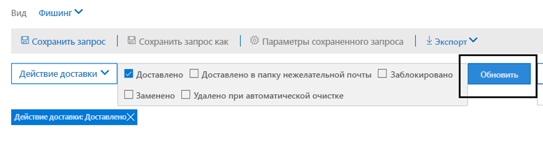

# Обозреватель угроз и обнаружение в режиме реального времени

Если в вашей организации используется [office 365 Advanced Threat protection](office-365-atp.md) (Office 365 ATP), а у вас есть [необходимые разрешения](#required-licenses-and-permissions), то у вас есть **проводник** или **Обнаружение в режиме реального времени** (ранее отчеты в *режиме реального времени* — [Просмотреть новые](#new-features-in-threat-explorer-and-real-time-detections)возможности!). В центре безопасности & соответствия требованиям перейдите в раздел **Управление угрозами**, а затем выберите **проводник** _или_ **Обнаружение в режиме реального времени**.

| В плане ATP 2 вы увидите: | В плане ATP 1 вы увидите: |
|---|---|
|||
|

С помощью Explorer (или обнаружением в режиме реального времени) у вас есть мощный отчет, который позволяет группе по обеспечению безопасности выполнять эффективное и эффективное исследование угроз и реагирование на них. Отчет напоминает следующее изображение:

С помощью этого отчета можно выполнить следующие действия:

- [Наличие вредоносных программ, обнаруженных функциями безопасности Microsoft 365](#see-malware-detected-in-email-by-technology)
- [Просмотрите данные о фишинговых URL-адресах и нажмите кнопку вредоносности](#view-data-about-phishing-urls-and-click-verdict)
- [Запуск автоматического расследования и обработки ответа из представления в проводнике](#start-automated-investigation-and-response) (только ATP, план 2)
- ... [Изучите вредоносные сообщения электронной почты и многое другое](#more-ways-to-use-explorer-or-real-time-detections)!

## Улучшения в проводнике по угрозам и обнаружения в режиме реального времени

В рамках улучшения процесса поиска мы внесли несколько обновлений в обозреватель угроз и обнаружение в режиме реального времени. Это улучшения опыта работы, в которых основное внимание уделяется повышенному последовательному улучшению качества. Эти изменения описаны ниже. 

- [Улучшения часового пояса](#timezone-improvements)
- [Обновление в процессе обновления](#update-in-the-refresh-process)
- [Детализация диаграммы для добавления в фильтры](#chart-drilldown-to-add-to-filters)
- [Обновление сведений о продукте](#in-product-information-updates)

### Улучшения часового пояса 

Будет показан часовой пояс для записей электронной почты в портале, а также для экспортированных данных. Часовой пояс будет отображаться во всех таких возможностях, как сетка электронной почты, всплывающее окно со сведениями, временная шкала электронной почты и Похожие сообщения электронной почты, поэтому часовой пояс для набора результатов становится понятен пользователю. 

### Обновление в процессе обновления 

Мы слышали Отзывы об путанице с автоматическим обновлением (например, по дате, когда вы измените дату, обновите страницу) и обновите вручную (для других фильтров). Аналогично, удаление фильтров приводит к автоматическому обновлению, что приводит к ситуациям, в которых изменение различных фильтров при изменении запроса может привести к несогласованному поиску. Чтобы устранить эту проблему, мы передвигаясь к механизму фильтрации вручную.
С точки зрения взаимодействия пользователь может применить и удалить другой диапазон фильтров (из набора фильтров и даты), а затем нажать кнопку обновить, чтобы отфильтровать результаты после определения запроса. Кнопка Обновить также была обновлена, чтобы она была четко вызвана на экране. Мы также обновили подсказки и документацию по продуктам, связанные с этим изменением. 

### Детализация диаграммы для добавления в фильтры

Теперь вы можете щелкнуть значения условных обозначений диаграммы, чтобы добавить это значение в качестве фильтра. Обратите внимание, что по-прежнему потребуется нажать кнопку обновить, чтобы отфильтровать результаты в соответствии с описанным выше изменением.

### Обновление сведений о продукте 

Кроме того, следует ознакомиться с дополнительными сведениями в продукте. Например, общее количество результатов поиска в сетке (см. ниже), а также улучшения вокруг меток, сообщений об ошибках и подсказок, чтобы получить дополнительные сведения вокруг фильтров, результатов поиска и набора результатов. 

## Новые функции обнаружения в режиме реального времени

## Новые возможности в обозревателе угроз и обнаружение в режиме реального времени

Три новых функции, добавленные в обозреватель угроз и обнаружение в режиме реального времени:

- [Предварительный просмотр заголовка сообщения электронной почты и загружаемого текста сообщения](#preview-email-header-and-download-email-body)
- [Временная шкала электронной почты](#email-timeline)
- [Экспорт URL-адреса щелкните данные](#export-url-click-data)

Эти новые функции описаны ниже.

### Предварительный просмотр заголовка сообщения электронной почты и загружаемого текста сообщения

Возможность предварительного просмотра заголовка и загрузки текста сообщения электронной почты — это новые функции, доступные в обозревателе угроз. Администраторы смогут анализировать загруженные заголовки/сообщения электронной почты для угроз. Поскольку загрузка сообщений электронной почты может привести к снижению вероятности получения информации, этот процесс контролируется с помощью управления доступом на основе ролей (RBAC). Новая роль, *Предварительная версия*, должна быть добавлена в другую группу ролей (например, с помощью операций безопасности или администратора безопасности), чтобы предоставить возможность загружать сообщения и предварительные заголовки в представлении всех сообщений электронной почты.

Но в Explorer (и в режиме реального времени) также добавляются новые новые поля, которые позволяют получить более полную картину места, где размещается сообщение электронной почты. Часть цели этого изменения заключается в том, чтобы упростить поиск в ходе проведения операций по обеспечению безопасности для пользователей, но в итоге вы можете узнать о местоположении проблемных сообщений с первого взгляда.

Как это сделать? Состояние доставки теперь разбивается на два столбца:

- **Действие доставки** — Каков статус этого сообщения?
- **Место доставки** — где было отправлено это сообщение электронной почты в результате?

Действие доставки — это действие, выполняемое по электронной почте из-за существующих политик или обнаружений. Возможные действия, которые может выполнить электронная почта:

|Отобран  |Нежелательная почта  |Заблокировано  |Меня  |
|---------|---------|---------|---------|
|Сообщение было доставлено в папку "Входящие" или в папку пользователя, и пользователь может напрямую получить к нему доступ.    | Сообщение отправлено в папку "спам" или "Удаленная папка" пользователя, и у пользователя есть доступ к сообщениям в этих папках.       | Все сообщения электронной почты, которые помещены в карантин, не выполнены или были удалены. Она полностью недоступна пользователю!     | Любое сообщение электронной почты, в которое заменяются файлы. txt, которые имеют вредоносные файлы.     |
    

| Отобран | Нежелательная почта | Заблокировано | Меня |
|---|---|---|---|
|Сообщение было доставлено в папку "Входящие" пользователя или в другую папку, и пользователь может напрямую получить к ней доступ.| Сообщение отправлено в папку "спам" или "Удаленная папка" пользователя, и у пользователя есть доступ к сообщениям электронной почты в этих папках.| Сообщения электронной почты, которые помещены в карантин, не выполнены или были удалены, недоступны для пользователя.| Все сообщения электронной почты, в которых вредоносные вложения были заменены на файлы. txt, которые задали вредоносные вложения.|
|

И вот что может видеть пользователь, и что он не может:

| Доступ для конечных пользователей | Недоступно для конечных пользователей |
|---|---|
|Отобран|Заблокировано|
|Нежелательная почта|Меня|

В местоположении доставки отображаются результаты политик и обнаружений, которые запускают после доставки. Он связан с действием доставки. Это поле было добавлено для получения подробных сведений о действиях, выполняемых при обнаружении проблемных сообщений. Ниже приведены возможные значения расположения доставки.

- **Папка "Входящие" или "папка"**: сообщение электронной почты находится в папке "Входящие" или папке (в соответствии с правилами электронной почты).
- **Локальная или внешняя**: почтовый ящик не существует в облаке, но является локальным.
- **Папка "спам**": сообщение электронной почты находится в папке "Нежелательная почта" пользователя.
- **Папка "Удаленные**": сообщение электронной почты в папке "Удаленные" пользователя.
- **Карантин**: сообщение электронной почты в карантине и не находится в почтовом ящике пользователя.
- **Сбой**: почтовому ящику не удалось подключиться к почтовому ящику.
- **Удалено**: сообщение электронной почты будет потеряно в любом месте почтового процесса.

### Временная шкала электронной почты

**Временная шкала электронной почты** — это еще одна новая функция проводника, предназначенная для улучшения качества работы для администраторов. Она вырезается по случайному расходу, так как в этом случае сокращается время, затрачиваемое на проверку различных расположений для ознакомления с событием. Когда несколько событий происходят в, или близко к, одно и то же время в сообщении электронной почты, эти события будут отображаться в представлении временной шкалы. В действительности некоторые события, которые происходят после доставки в почту, будут записываться в столбце "специальное действие". Объединение информации из временной шкалы с особым действием, выполняемым при последующей доставке почты, предоставит администраторам сведения о том, как работают их политики, и в некоторых случаях для окончательной оценки была выполнена окончательная маршрутизация.

Подробнее о том, как изучать вредоносные сообщения электронной почты, можно узнать [в статье исследование и исправление вредоносных сообщений электронной почты, которые были доставлены в Office 365](investigate-malicious-email-that-was-delivered.md).

### Экспорт URL-адреса щелкните данные

Кроме того, вы можете экспортировать отчеты для URL-адресов, которые вы щелкаете в Microsoft Excel, чтобы просмотреть идентификационный номер своего сообщения, а затем нажмите кнопку вредоносности, сделав задачу понимания того, где ваш URL-адрес стал проще. Вот как это работает. Начиная с управления угрозами на панели быстрого запуска Office 365, щелкните эту цепочку.

**Explorer** \> **Просмотр фишинга** \> **Щелкает мышью** \> **Самые популярные URL-адреса или верхние щелчки URL** \> **Щелкните любую запись, чтобы открыть всплывающее меню URL-адреса**

Если щелкнуть URL-адрес в списке, появится кнопка "создать экспорт" на панели "вылет". Используйте эту кнопку для перемещения данных в электронную таблицу Excel для упрощения создания отчетов.

Вы можете перейти к тому же расположению в отчете о обнаружениях в режиме реального времени следующим образом:

**Explorer** \> Обнаружение в режиме **реального времени** \> **Просмотр фишинга** \> **URL-адреса** \> **Самые популярные URL-адреса или верхние щелчки** \> **Щелкните любую запись, чтобы открыть всплывающее меню** \> URL-адреса **Перейдите на вкладку "нажатия".**

> [!TIP]
> ИДЕНТИФИКАТОР сетевого сообщения сопоставляет нажатие кнопки обратно с определенными сообщениями при поиске по проводнику или связанным сторонним средствам с помощью идентификатора сетевого сообщения. При поиске по сетевому сообщению администратору будет предоставлено сообщение, связанное с результатом нажатия кнопки. При экспорте учетная идентификация идентификатора сетевого сообщения делает анализ более быстрым и мощным.

## Просмотр вредоносных программ, обнаруженных технологией

Предположим, вы хотите увидеть вредоносную программу, обнаруженную в электронном письме, с помощью технологии Microsoft 365. Для этого воспользуйтесь представлением " [Электронная почта > просмотр вредоносных программ](threat-explorer-views.md#email--malware) в проводнике (или обнаружения в режиме реального времени).

1. В центре безопасности & соответствия требованиям ( [https://protection.office.com](https://protection.office.com) ) выберите Обозреватель **управления угрозами**  >  **Explorer** (или **Обнаружение в режиме реального времени**). (В этом примере используется Explorer.)

2. В меню **вид** выберите пункт **Электронная почта**  >  **Malware**.

   

3. Нажмите **отправитель**, а затем выберите **Базовая**  >  **технология обнаружения**.

   Теперь ваши технологии обнаружения доступны в качестве фильтров для отчета.

   

4. Выберите параметр, а затем нажмите кнопку **Обновить** , чтобы применить этот фильтр.

   

Отчет обновляется для отображения результатов, обнаруженных в сообщении электронной почты, с использованием выбранного варианта технологии. Отсюда вы можете провести дальнейший анализ.

## Просмотрите данные о фишинговых URL-адресах и нажмите кнопку вредоносности

Предположим, вы хотите увидеть почтовые сообщения с помощью URL-адресов, включая список разрешенных, заблокированных и переопределенных URL-адресов. Для определения URL-адресов, которые были нажаты, необходимо настроить [безопасные ссылки ATP](atp-safe-links.md) . Убедитесь, что вы настроили [политики безопасных ссылок ATP](set-up-atp-safe-links-policies.md) для защиты от щелчка по времени и регистрации в Вердиктс по безопасным каналам ATP.

Чтобы просмотреть URL-адреса фишинга в сообщениях и щелкать URL-адреса в сообщениях фишинга, используйте [сообщение электронной почты > "фишинг](threat-explorer-views.md#email--phish) " проводника (или обнаружение в режиме реального времени).

1. В центре безопасности & соответствия требованиям ( [https://protection.office.com](https://protection.office.com) ) выберите Обозреватель **управления угрозами**  >  **Explorer** (или **Обнаружение в режиме реального времени**). (В этом примере используется Explorer.)

2. В меню **вид** выберите пункт фишинг **электронной почты**  >  **Phish**.

   

3. Нажмите **отправитель**, а затем выберите **URL-адреса**  >  **нажмите кнопку вредоносности**.

4. Выберите один или несколько параметров, например **заблокировано** и **блокировать переопределение**, а затем нажмите кнопку **Обновить** , расположенную в той же строке, что и параметры применения этого фильтра. (Не обновите окно браузера.)

   

    Отчет обновляется для отображения двух различных таблиц URL-адресов на вкладке URL-адрес отчета:

   - **Топ URL-адресов** это URL-адреса, содержащиеся в фильтруемых сообщениях, и количество действий по доставке для каждого URL-адреса. В представлении "фишинг сообщения" Этот список, как правило, содержит допустимые URL-адреса. Злоумышленники включают в свои сообщения сочетания хороших и недостоверных URL-адресов, чтобы попытаться доставить их, но они станут интереснее для пользователя щелкнуть. Таблица URL-адресов сортируется по общему количеству электронной почты (но обратите внимание, что этот столбец скрыт для упрощения представления).

   - **Наиболее посещаемые щелчки** — это безопасные ссылки, которые были выбраны, отсортированные по общему количеству щелчков (этот столбец также не отображается для упрощения представления). Общее количество подсчетов по столбцу указывает на безопасные ссылки нажмите кнопку счетчик вредоносности для каждого нажатого URL-адреса. В представлении "фишинг сообщений" чаще всего используются подозрительные или вредоносные URL-адреса, но они могут включать URL-адреса, которые не являются угрозами, но находятся в сообщениях фишинга. URL-адреса, на которые вы щелкнете ссылки, не отображаются здесь.

   В двух таблицах URL-адресов отображаются самые популярные URL-адреса в сообщениях фишинга по доставке и размещению, а также отображаются нажатия клавиш URL-адреса, которые были заблокированы (или посещены несмотря на предупреждение), чтобы определить, какие потенциальные неправильные ссылки были получены пользователями и работали с пользователями. Отсюда вы можете провести дальнейший анализ. Например, под диаграммой можно увидеть самые популярные URL-адреса в сообщениях электронной почты, которые были заблокированы в среде Организации.

   

   Выберите URL-адрес, чтобы просмотреть более подробные сведения.
   
   > [!NOTE]
   > В всплывающем диалоговом окне URL-адреса удаляется фильтрация по сообщениям электронной почты, чтобы показать полное представление о доступности URL-адресов в вашей среде. Это позволяет отфильтровывать сообщения электронной почты в проводнике, чтобы найти конкретные URL-адреса, которые являются потенциальными угрозами, а затем расширить свои знания о возможностях URL-адресов в вашей среде (с помощью диалогового окна "сведения об URL-адресе") без необходимости добавлять фильтры URL-адресов в представление "Проводник".

## Просмотр сообщений электронной почты, сообщаемых пользователями

Предположим, что вы хотите видеть сообщения электронной почты, которые пользователи в организации сообщают как нежелательные, не спам или фишинг с помощью [надстройки Report Message для Outlook и Outlook в Интернете](enable-the-report-message-add-in.md). Для этого используйте представление [отправки > электронной почты](threat-explorer-views.md#email--submissions) в проводнике (или обнаружения в режиме реального времени).

1. В центре безопасности & соответствия требованиям ( [https://protection.office.com](https://protection.office.com) ) выберите Обозреватель **управления угрозами**  >  **Explorer** (или **Обнаружение в режиме реального времени**). (В этом примере используется Explorer.)

2. В меню **вид** выберите пункт отправки **электронной почты**  >  **Submissions**.

   

3. Щелкните **отправитель**, а затем выберите тип **основного**  >  **отчета**.

4. Выберите параметр, например " **Фишинг**", а затем нажмите кнопку **Обновить** .

   

Отчет обновляется для отображения данных о сообщениях электронной почты, о которых пользователи в организации сообщают в качестве попытки фишинга. Вы можете использовать эти сведения для проведения дальнейшего анализа и, при необходимости, настройки [политик защиты от фишинга ATP](configure-atp-anti-phishing-policies.md).

## Запуск автоматического исследования и ответа

> [!NOTE]
> Автоматизированное исследование и возможности реагирования доступны в **office 365 ATP (план 2** ) и **Office 365**

(NEW!) [Автоматическое исследование и отклики](automated-investigation-response-office.md) могут сэкономить время и усилия группы по обеспечению безопасности при исследовании и уменьшении кибератаки. Кроме настройки оповещений, которые могут активировать стратегия безопасности, можно запустить процесс автоматического исследования и ответа из представления в проводнике.

Подробнее об этом можно узнать в статье [Пример: администратор безопасности запускает исследование в проводнике](automated-investigation-response-office.md#example-a-security-administrator-triggers-an-investigation-from-threat-explorer).

## Дополнительные способы использования проводника (или обнаружения в режиме реального времени)

В дополнение к сценариям, описанным в этой статье, в проводнике (или обнаружения в режиме реального времени) доступны многие дополнительные возможности отчета.

- [Поиск и изучение доставленной нежелательной почты](investigate-malicious-email-that-was-delivered.md)
- [Просмотр вредоносных файлов, обнаруженных в SharePoint Online, OneDrive и Microsoft Teams](malicious-files-detected-in-spo-odb-or-teams.md)
- [Обзор представлений в обозревателе угроз (и обнаружения в режиме реального времени)](threat-explorer-views.md)
- [Автоматизированный анализ угроз и реакция на угрозы в службе защиты от угроз (Майкрософт)](https://docs.microsoft.com/microsoft-365/security/mtp/mtp-autoir)

## Обязательные лицензии и разрешения

Для получения проводника или обнаружения в режиме реального времени необходимо наличие [Office 365 ATP](office-365-atp.md) .

- Explorer включен в план 2 для Office 365 ATP 2.
- Отчет об обнаружении в реальном времени включается в план 1 для Office 365 ATP 1.
- Запланируйте Назначение лицензий для всех пользователей, которые должны быть защищены в Office 365 ATP. (Проводник или обнаружение в режиме реального времени показывает данные обнаружения для лицензированных пользователей.)

Для просмотра и использования проводника или обнаружения в режиме реального времени необходимы соответствующие разрешения, такие как предоставленные администратору безопасности или средству чтения безопасности.

- Для &amp; центра соответствия требованиям безопасности необходимо назначить одну из следующих ролей:

  - Управление организацией
  - Администратор безопасности (это можно назначить в центре администрирования Azure Active Directory ( [https://aad.portal.azure.com](https://aad.portal.azure.com) )).
  - Читатель сведений о безопасности

- Для Exchange Online необходимо назначить одну из следующих ролей в центре администрирования Exchange ( [https://outlook.office365.com/ecp](https://outlook.office365.com/ecp) ) или с помощью командлетов PowerShell (см. [Exchange Online PowerShell](https://docs.microsoft.com/powershell/exchange/exchange-online-powershell)):

  - Управление организацией
  - Управление организацией с правами только на просмотр
  - Роль получателей с правами только на просмотр
  - Управление соответствием требованиям

Дополнительные сведения о ролях и разрешениях можно найти в следующих ресурсах:

- [Разрешения в центре безопасности и &amp; соответствия требованиям](permissions-in-the-security-and-compliance-center.md)
- [Разрешения компонентов в Exchange Online](https://docs.microsoft.com/exchange/permissions-exo/feature-permissions)

## Некоторые различия между обозревателем угроз и обнаружениями в режиме реального времени

- Отчет об **обнаружении в реальном времени** доступен в Office 365 ATP 1 (план 1), а **Обозреватель угроз** доступен в Office 365 ATP (план 2).
- Отчет об **обнаружении в реальном времени** позволяет просматривать определения в режиме реального времени. **Обозреватель угроз** также делает это, но также позволяет просматривать дополнительные сведения о конкретной атаке.
- Представление " **все сообщения электронной почты** " доступно в **обозревателе угроз** (не в отчете об **обнаружении в режиме реального времени** ).
- В **обозревателе угроз**включены дополнительные возможности фильтрации и доступные действия.

Более подробную информацию можно узнать в статье [Office 365 ATP Service Description: сведения о доступности функций в планах расширенной защиты от угроз (ATP)](https://docs.microsoft.com/office365/servicedescriptions/office-365-advanced-threat-protection-service-description#feature-availability-across-advanced-threat-protection-atp-plans).

