# Обнаружение обозревателя угроз и обнаружения в режиме реального времени

**Область применения**
- [Microsoft Defender для Office 365 (план 1 и план 2)](defender-for-office-365.md)
- [Microsoft 365 Defender](../defender/microsoft-365-defender.md)

Если в вашей организации есть microsoft [Defender для Office 365,](defender-for-office-365.md)и у  вас есть необходимые [разрешения,](#required-licenses-and-permissions)у вас есть обнаружения explorer или в режиме реального времени **(ранее** отчеты в режиме реального времени *—* см. [новые!).](#new-features-in-threat-explorer-and-real-time-detections) В Центре & безопасности перейдите к управлению угрозами, а затем выберите **обнаружение Explorer** _или_ в **режиме реального времени.**

 

****

|В Microsoft Defender для Office 365 Plan 2 см.:|В Microsoft Defender для Office 365 1 см.:|
|---|---|
|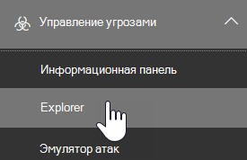|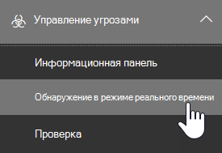|
|

Обнаружение explorer или в режиме реального времени помогает группе операций безопасности эффективно исследовать угрозы и реагировать на них. Отчет напоминает следующее изображение:

В этом отчете вы можете:

- [См. вредоносные программы, обнаруженные Microsoft 365 функциями безопасности](#see-malware-detected-in-email-by-technology)
- [Просмотр фишинговых URL-адресов и щелкните данные вердикта](#view-phishing-url-and-click-verdict-data)
- [Запустите автоматизированный процесс расследования](#start-automated-investigation-and-response) и ответа из представления в Explorer (только defender for Office 365 Plan 2)
- [Изучение вредоносных сообщений электронной почты и других](#more-ways-to-use-explorer-and-real-time-detections)

## Улучшения в области охоты на угрозы

### Введение alert ID для оповещений MDO в обнаружениях Explorer и в режиме реального времени (Предварительная версия)

Сегодня при переходе из оповещений в Обозреватель угроз открывается фильтрованный вид в Explorer, а представление фильтруется идентификатором политики оповещения (идентификатор политики является уникальным идентификатором для политики оповещения).
Мы делаем эту интеграцию более актуальной, введя ID оповещений (см. пример оповещений ниже) в обнаружениях Обозреватель угроз и в режиме реального времени, чтобы вы могли видеть сообщения, соответствующие конкретному оповещению, а также количество электронных сообщений. Вы также сможете увидеть, было ли сообщение частью оповещения, а также перейти от этого сообщения к определенному оповещению.

В URL-адресе доступен ID оповещения при просмотре отдельного оповещения; пример `https://protection.office.com/viewalerts?id=372c9b5b-a6c3-5847-fa00-08d8abb04ef1` .

> [!div class="mx-imgBorder"]
> 

> [!div class="mx-imgBorder"]
> 

### Расширение ограничения хранения и поиска данных Explorer (и обнаружения в режиме реального времени) для пробных клиентов с 7 до 30 дней (предварительная версия)

В рамках этого изменения вы сможете искать и фильтровать данные электронной почты в течение 30 дней (увеличение по сравнению с предыдущими 7 днями) при обнаружении в режиме реального времени обозревателя угроз для обоих клиентов defender для Office P1 и P2 пробных клиентов.
Это не влияет на клиентов P1 и P2/E5, у которых уже есть 30-дневные возможности хранения данных и поиска.

### Обновленные ограничения для экспорта записей для обозревателя угроз (Preview)

В рамках этого обновления количество строк для записей электронной почты, которые можно экспортировать из Обозревателя угроз, увеличивается с 9990 до 200 000 записей. Набор столбцов, которые можно экспортировать в настоящее время, останется тем же, но количество строк увеличится с текущего лимита.

### Теги в обозревателе угроз

> [!NOTE]
> Функция тегов пользователя находится в *предварительном просмотре,* доступна не всем и подлежит изменениям. Сведения о расписании выпуска ознакомьтесь с Microsoft 365 плана.

Теги пользователей определяют определенные группы пользователей в Microsoft Defender для Office 365. Дополнительные сведения о тегах, включая лицензирование и конфигурацию, см. в [тегах User.](user-tags.md)

В Обозревателе угроз можно увидеть сведения о тегах пользователей в следующих действиях.

#### Представление сетки электронной почты

Столбец **Теги** в сетке электронной почты содержит все теги, которые были применены к почтовым ящикам отправитель или получатель. По умолчанию сначала показаны системные теги, такие как учетные записи приоритетов.

> [!div class="mx-imgBorder"]
> 

#### Фильтрация

Теги можно использовать в качестве фильтра. Охота только на приоритетные учетные записи или определенные сценарии тегов пользователей. Можно также исключить результаты с определенными тегами. Совмещайте эту функцию с другими фильтрами, чтобы сузить область исследования.

> [!div class="mx-imgBorder"]
> 

#### Вылет детализации электронной почты

Чтобы просмотреть отдельные теги отправитель и получатель, выберите субъект, чтобы открыть вылет сведений о сообщении. На **вкладке Сводка** теги отправитель и получатель показаны отдельно, если они присутствуют для электронной почты.
Сведения об отдельных тегах для отправитель и получатель также распространяется на экспортируемую CSV-информацию, где эти сведения можно увидеть в двух отдельных столбцах.

> [!div class="mx-imgBorder"]
> 

Сведения о тегах также показаны в вылете url-адресов. Чтобы просмотреть его, перейдите в просмотр фишинга или все сообщения электронной почты, а затем на **вкладку URL-адрес** или **URL-адрес.** Выберите отдельный флажок URL-адреса, чтобы просмотреть дополнительные сведения о щелчках для этого URL-адреса, включая теги, связанные с этим щелчком.

### Обновленное представление Временной шкалы

> [!div class="mx-imgBorder"]
> 
>
Узнайте больше, посмотрев [это](https://www.youtube.com/watch?v=UoVzN0lYbfY&list=PL3ZTgFEc7LystRja2GnDeUFqk44k7-KXf&index=4) видео.

## Улучшения в области охоты на угрозы (предстоящие)

### Обновленные сведения об угрозах для электронной почты

Мы уделяем основное внимание улучшениям платформы и качества данных, чтобы повысить точность и согласованность данных для записей электронной почты. Улучшения включают объединение сведений о предварительной доставке и после доставки, например действий, выполненных по электронной почте в рамках процесса ZAP, в одну запись. Кроме того, в список включены дополнительные сведения, такие как вердикт о нежелательной почте, угрозы на уровне сущности (например, вредоносный URL-адрес), а также последние расположения доставки.

После этих обновлений вы увидите одну запись для каждого сообщения, независимо от различных событий после доставки, которые влияют на сообщение. Действия могут включать ZAP, ручное исправление (что означает действие администратора), динамическую доставку и так далее.

В дополнение к показу вредоносных программ и фишинговых угроз, вы видите вердикт о нежелательной почте, связанный с электронной почтой. В сообщении электронной почты см. все угрозы, связанные с электронной почтой, а также соответствующие технологии обнаружения. Электронная почта может иметь ноль, одну или несколько угроз. Текущие угрозы см. в разделе **Подробные** сведения о вылете электронной почты. Для нескольких угроз (например, вредоносных программ и фишинга) техническое поле **Detection** показывает сопоставление обнаружения угроз, которое является технологией обнаружения, которая идентифицировала угрозу.

Набор технологий обнаружения теперь включает новые методы обнаружения, а также технологии обнаружения нежелательной почты. Вы можете использовать один и тот же набор технологий обнаружения для фильтрации результатов в различных представлениях электронной почты (Malware, Phish, All Email).

> [!NOTE]
> Анализ вердикта не обязательно должен быть привязан к сущностям. Например, сообщение электронной почты можно классифицировать как фишинг или спам, но нет URL-адресов, которые были бы штампуются с помощью вердикта о фишинге и нежелательной почте. Это потому, что фильтры также оценивают содержимое и другие сведения для электронной почты перед назначением вердикта.

#### Угрозы в URL-адресах

Теперь вы можете увидеть конкретную угрозу URL-адреса на вкладке Сведения о **вылете электронной** почты. Угрозой могут быть *вредоносные программы,* *фишинг,* *спам* или *нет*.)

> [!div class="mx-imgBorder"]
> 

### Обновленное представление временной шкалы (предстоящий)

> [!div class="mx-imgBorder"]
> 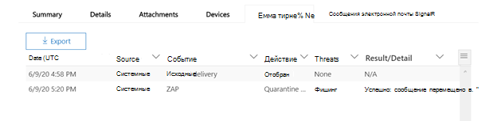

Представление Timeline определяет все события доставки и после доставки. Она включает сведения об угрозе, которая была обнаружена в тот момент для подмножество этих событий. В представлении Timeline также содержится информация о любых дополнительных действиях (таких как zaP или ручное исправление), а также о результатах этого действия. Сведения о представлении временной шкалы включают в себя:

- **Источник:** Источник события. Это может быть администратор/система/пользователь.
- **Событие:** Включает события верхнего уровня, такие как исходная доставка, исправление вручную, ZAP, отправка и динамическая доставка.
- **Действие:** Конкретное действие, которое было принято в рамках действия ZAP или администратора (например, мягкое удаление).
- **Угрозы:** Покрывает угрозы (вредоносные программы, фишинг, спам), выявленные на данный момент времени.
- **Результат/сведения:** Дополнительные сведения о результате действия, например о том, было ли оно выполнено в рамках действия ZAP/admin.

### Исходное и последнее расположение доставки

В настоящее время мы видим расположение доставки в сетке электронной почты и вылете электронной почты. Поле **расположения доставки** становится переименованным в **_исходное расположение_ доставки *_. И мы представляем другое поле, _ последнее*_расположение доставки_**.

**Исходное расположение доставки** даст дополнительные сведения о том, где было доставлено письмо изначально. **В последнем расположении** доставки будет заявно, где после системных действий, таких как *действия ZAP* или администратора, например *Move to deleted items,* сообщение электронной почты было отправлено. Последнее расположение доставки предназначено для того, чтобы сообщить администраторам последнее известное расположение сообщения после доставки или любые действия системы или администратора. В нем не содержатся действия конечных пользователей по электронной почте. Например, если пользователь удалил сообщение или переместил сообщение в архив/pst, расположение "доставка" сообщения не будет обновлено. Но если системное действие обновило расположение (например, ZAP в результате перехода  электронной почты на карантин), последнее расположение доставки будет показываться как "карантин".

> [!div class="mx-imgBorder"]
> 

> [!NOTE]
> Существует несколько случаев, когда расположение **доставки** и **действие Delivery могут** демонстрироваться как "неизвестные":
>
> - При доставке сообщения расположение доставки  может быть "доставлено" и "неизвестно", но правило "Входящие" переместило сообщение в папку по умолчанию (например, в Draft или Archive), а не в папку "Входящие" или "Нежелательной почты". 
>
> - **Последнее расположение доставки** может быть неизвестно, было ли предпринята попытка действия администратора или системы (например, ZAP), но сообщение не было найдено. Обычно действие происходит после того, как пользователь переместил или удалил сообщение. В таких случаях проверьте **столбец Result/Details** в представлении временной шкалы. Посмотрите на заявление "Сообщение перемещено или удалено пользователем".

> [!div class="mx-imgBorder"]
> 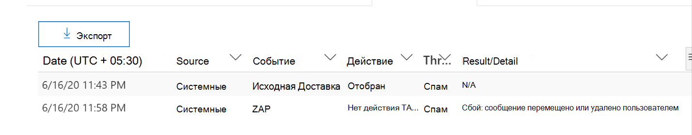

### Дополнительные действия

*Дополнительные действия* были применены после доставки электронной почты. Они могут включать  *ZAP,* ручное исправление (действия, принятые администратором, такие как мягкое *удаление),* динамическая доставка и обработка *(для* электронной почты, которая была обнаружена задним числом как хорошая).

> [!NOTE]
> В рамках ожидающих изменений значение "Removed by ZAP", в настоящее время всплыть в фильтре Действия доставки, удаляется. У вас будет способ поиска всех сообщений электронной почты с помощью попытки ZAP с помощью **дополнительных действий.**

> [!div class="mx-imgBorder"]
> 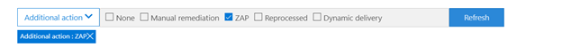

### Переопределения системы

*Переопределения* системы позволяют делать исключения из предназначенного расположения доставки сообщения. Расположение доставки, предоставляемого системой, переопределяется в зависимости от угроз и других обнаружений, выявленных стеком фильтрации. Переопределения системы могут быть заданы через политику клиента или пользователя для доставки сообщения, как это предложено политикой. Переопределения могут определять непреднамеренные доставки вредоносных сообщений из-за пробелов в конфигурациях, таких как чрезмерно широкая политика Сейф отправитель, заданная пользователем. Эти переопределяемые значения могут быть:

- Разрешено политикой пользователя. Пользователь создает политики на уровне почтовых ящиков, чтобы разрешить домены или отправителей.

- Заблокировано политикой пользователя: пользователь создает политики на уровне почтовых ящиков для блокировки доменов или отправителей.

- Разрешено политикой организации. Группы безопасности организации устанавливают политики или правила потока Exchange (также известные как правила транспорта), чтобы разрешить отправителям и доменам пользователей в их организации. Это может быть для набора пользователей или всей организации.

- Заблокировано политикой организации: группы безопасности организации устанавливают политики или правила потока почты, чтобы блокировать отправителей, домены, языки сообщений или исходные ИП для пользователей в их организации. Это может быть применено к набору пользователей или всей организации.

- Расширение файлов, заблокированное политикой организации: группа безопасности организации блокирует расширение имени файла с помощью параметров политики защиты от вредоносных программ. Эти значения теперь будут отображаться в сведениях электронной почты, чтобы помочь в расследованиях. Команды Secops также могут использовать функцию фильтрации с богатыми возможностями для фильтрации заблокированных расширений файлов.

> [!div class="mx-imgBorder"]
> 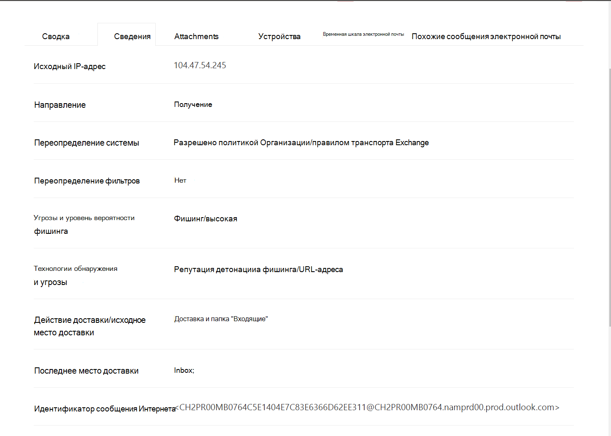

### Улучшения для работы с URL-адресом и щелчками

Улучшения включают в себя:

- Показать полный щелкнув URL-адрес (в том числе все параметры запроса, которые являются частью URL-адреса) в разделе **Щелчки** в флажок URL-адрес. В настоящее время домен URL-адреса и путь отображаются в панели заголовков. Мы расширяем эту информацию, чтобы показать полный URL-адрес.

- Исправление фильтров URL-адресов *(URL-адрес* и URL-адрес, а также URL-адрес домена и *пути):* Обновления влияют на поиск сообщений, содержащих URL-адрес и нажмите кнопку вердикт.  Мы включили поддержку для протокольного агностика поиска, поэтому вы можете искать URL-адрес без использования `http` . По умолчанию url-карты поиска для http, если явно не указано другое значение. Например:
  - Поиск с префиксом и без него в полях `http://` **фильтрации** URL-адресов, **URL-адресов** и **URL-адресов.** Результаты поиска должны быть одинаковыми.
  - Поиск `https://` префикса в **URL-адресе.** Если значение не задано, `http://` префикс предполагается.
  - `/`игнорируется в начале и конце пути **URL-адресов,** **URL-адресов,** **URL-адресов и полей путей.** `/` в конце поля **URL-адрес** игнорируется.

### Уровень доверия к фишингу

Уровень уверенности в фишинге помогает определить степень уверенности, с которой электронное письмо было классифицируются как "фишинг". Два возможных значения : *High* и *Normal*. На начальных стадиях этот фильтр будет доступен только в представлении Phish обозревателя угроз.

### СИГНАЛ URL-адреса ZAP

Url-сигнал ZAP обычно используется для сценариев оповещения о фишинге ZAP, в которых сообщение электронной почты было идентифицировано как Фишинг и удалено после доставки. Этот сигнал соединяет оповещение с соответствующими результатами в Explorer. Это один из IOCs для оповещения.

Чтобы улучшить процесс охоты, мы обновили обнаружение обозревателя угроз и в режиме реального времени, чтобы сделать процесс охоты более последовательным. Изменения описаны здесь:

- [Улучшения в поясе времени](#timezone-improvements)
- [Обновление в процессе обновления](#update-in-the-refresh-process)
- [Сверла диаграммы, чтобы добавить к фильтрам](#chart-drilldown-to-add-to-filters)
- [В обновлениях сведений о продукте](#in-product-information-updates)

### Фильтр по тегам пользователей

Теперь можно сортировать и фильтровать системные или настраиваемые теги пользователей, чтобы быстро понять область угроз. Дополнительные данные см. [в тегах пользователей.](user-tags.md)

> [!IMPORTANT]
> Фильтрация и сортировка по тегам пользователей в настоящее время находятся в режиме предварительного просмотра. Эта функция может быть существенно изменена до ее коммерческого выпуска. Корпорация Майкрософт не предоставляет никаких гарантий, не выражая или подразумевая, в отношении сведений, предоставленных о нем.

> [!div class="mx-imgBorder"]
> 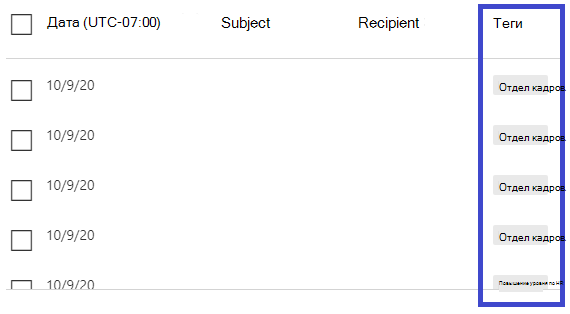

### Улучшения в поясе времени

Вы увидите часовой пояс для записей электронной почты на портале, а также для экспортных данных. Он будет виден во всех событиях, таких как сетка электронной почты, вылет подробных сведений, хронология электронной почты и аналогичные сообщения электронной почты, поэтому часовой пояс для набора результатов понятен.

> [!div class="mx-imgBorder"]
> 

### Обновление в процессе обновления

Некоторые пользователи прокомментировали путаницу с автоматическим обновлением (например, как только вы измените дату, страница обновляется) и ручным обновлением (для других фильтров). Аналогичным образом удаление фильтров приводит к автоматическому обновлению. Изменение фильтров при изменении запроса может привести к непоследовательному опытом поиска. Чтобы устранить эти проблемы, мы переходим к механизму ручного фильтрации.

С точки зрения опыта пользователь может применить и удалить различные диапазоны фильтров (от набора фильтров и даты) и выбрать кнопку обновления для фильтрации результатов после определения запроса. Кнопка обновления также теперь подчеркивается на экране. Мы также обновили соответствующие инструменты и документацию по продуктам.

> [!div class="mx-imgBorder"]
> 

### Сверла диаграммы, чтобы добавить к фильтрам

Теперь можно наметить значения легенды, чтобы добавить их в качестве фильтров. Выберите **кнопку Обновить** для фильтрации результатов.

> [!div class="mx-imgBorder"]
> 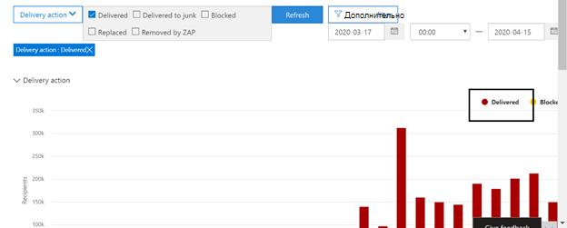

### Обновления информации в продукте

Дополнительные сведения теперь доступны в продукте, например общее количество результатов поиска в сетке (см. ниже). Мы улучшили метки, сообщения об ошибках и инструменты, чтобы предоставить дополнительные сведения о фильтрах, опыте поиска и наборе результатов.

> [!div class="mx-imgBorder"]
> 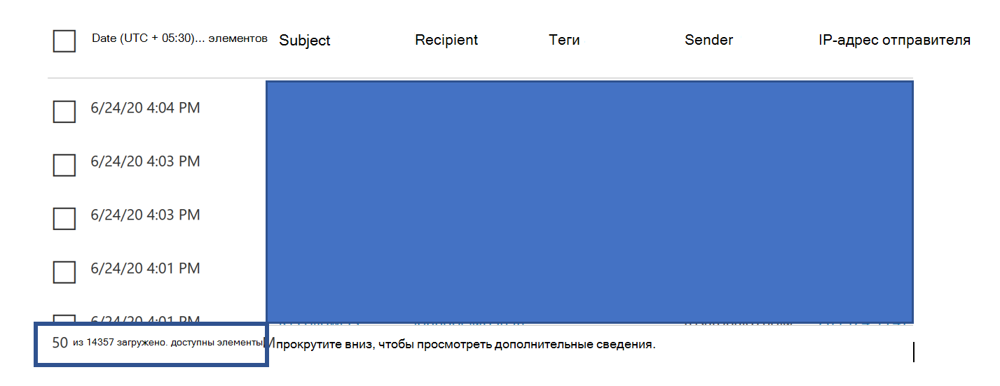

## Расширенные возможности в Обозревателе угроз

### Лучшие целевые пользователи

Сегодня мы обналичим список наиболее целевых пользователей в представлении вредоносных программ для электронной почты в разделе **Топ семей вредоносных программ.** Мы также расширим это представление в представлениях Фишинг и Все сообщения электронной почты. Вы сможете просмотреть топ-5 целевых пользователей, а также количество попыток для каждого пользователя для соответствующего представления. Например, в представлении Phish вы увидите число попыток фишинга.

Вы сможете экспортировать список целевых пользователей до 3000, а также количество попыток автономного анализа для каждого представления электронной почты. Кроме того, при выборе количества попыток (например, 13 попыток на изображении ниже) откроется фильтрованное представление в Обозревателе угроз, чтобы вы могли просмотреть дополнительные сведения по электронным письмам и угрозам для этого пользователя.

> [!div class="mx-imgBorder"]
> 

### Exchange правила транспорта

В рамках обогащения данных вы сможете увидеть все различные правила транспорта Exchange(ETR), которые были применены к сообщению. Эти сведения будут доступны в представлении сетки электронной почты. Чтобы просмотреть его, выберите **параметры Column** в сетке, а затем **добавьте Exchange правила** транспорта из столбцов. Он также будет виден на **флаауте Details** в электронной почте.

Вы сможете увидеть как GUID, так и имя правил транспорта, примененных к сообщению. Вы сможете искать сообщения с помощью имени правила транспорта. Это поиск "Содержит", который означает, что вы также можете делать частичные поиски.

> [!IMPORTANT]
> Поиск etr и доступность имен зависят от конкретной роли, назначенной вам. Для просмотра имен и поиска etr необходимо иметь одну из следующих ролей/разрешений. Если вам не назначены какие-либо из этих ролей, вы не можете видеть имена правил транспорта или искать сообщения с помощью имен ETR. Однако в сведениях электронной почты можно увидеть метку ETR и сведения GUID. Другие опытом просмотра записей в сетках электронной почты, вылеты электронной почты, фильтры и экспорт не затронуты.
>
> - Только EXO — предотвращение потери данных: все
> - Только EXO — O365SupportViewConfig: Все
> - Microsoft Azure Active Directory EXO — администратор безопасности: все
> - AAD или EXO — считыватель безопасности: все
> - Только EXO — правила транспорта: все
> - Только EXO — View-Only конфигурация: все
>
> В сетке электронной почты, вылете Подробные сведения и экспортируемом CSV etRs представлены с именем/GUID, как показано ниже.
>
> > [!div class="mx-imgBorder"]
> > 

### Входящие соединители

Соединители — это набор инструкций, которые настраивают потоки электронной почты в вашу Microsoft 365 или Office 365 организацию. Они позволяют применять любые ограничения безопасности или элементы управления. В Обозревателе угроз теперь можно просматривать соединители, связанные с электронной почтой, и искать сообщения с помощью имен соединитеителей.

Поиск соединители "содержит" в природе, что означает, что частичный поиск ключевых слов также должен работать. В представлении главной сетки, вылете Details и экспортируемом CSV соединители показаны в формате Name/GUID, как показано здесь:

> [!div class="mx-imgBorder"]
> 

## Новые функции в области обнаружения и обнаружения угроз в режиме реального времени

- [Просмотр фишинговых сообщений электронной почты, отосланных обезличенным пользователям и доменам](#view-phishing-emails-sent-to-impersonated-users-and-domains)
- [Просмотр заголовки электронной почты и загрузка тела электронной почты](#preview-email-header-and-download-email-body)
- [Шкала электронной почты](#email-timeline)
- [Экспорт URL-адреса щелкните данные](#export-url-click-data)

### Просмотр фишинговых сообщений электронной почты, отосланных обезличенным пользователям и доменам

Для выявления попыток фишинга в отношении пользователей и доменов, которые являются вымыщенными пользователями, необходимо добавить в список пользователей для *защиты.* Для доменов администраторы должны либо включить *домены Организации,* либо добавить доменное имя в *домены для защиты.* Защищаемые домены находятся на странице *политики* защиты от фишинга в разделе *Impersonation.*

Чтобы просмотреть фишинговые сообщения и найти обезличенных пользователей или доменов, используйте представление [> Phish](threat-explorer-views.md) Explorer.

В этом примере используется обозреватель угроз.

1. В Центре [&](https://protection.office.com) безопасности (выберите управление угрозами > Explorer (или обнаружение в https://protection.office.com) режиме реального времени).

2. В меню Просмотр выберите адрес электронной почты > Фишинг.

   Здесь вы можете выбрать **вымысенный домен или** **вымысли пользователя**.

3. **ЛИБО** выберите **обезличенный домен,** а затем введите защищенный домен в текстовом ящике.

   Например, поиск защищенных доменных имен, таких как *contoso,* *contoso.com* или *contoso.com.au.*

4. Выберите тему любого сообщения в вкладке Email > подробные сведения, чтобы увидеть дополнительные сведения о обезличеженном домене или обнаруженном расположении.

    **OR**

    Выберите **обезличенный пользователь** и введите защищенный адрес электронной почты в текстовом ящике.

    > [!TIP]
    > **Для наилучших результатов** используйте *полные адреса электронной почты* для поиска защищенных пользователей. Вы найдете защищенного пользователя быстрее и успешнее, если вы firstname.lastname@contoso.com, *например,* при расследовании вымыкания пользователя. При поиске защищенного домена поиск будет принимать корневой домен (например contoso.com) и доменное имя *(contoso).* Поиск корневого *домена contoso.com* возвращает как contoso.com,  так и *contoso доменного имени.*

5. Выберите тему **любого** сообщения в вкладке Сведения о вкладке **Электронной** почты, чтобы увидеть дополнительные сведения о пользователе или домене  >   и *обнаруженном расположении.*

    :::image type="content" source="../../media/threat-ex-views-impersonated-user-image.png" alt-text="Обозреватель угроз подробно представляет для защищенного пользователя расположение обнаружения и обнаруженную угрозу (здесь фишинговое вымысление пользователя).":::

> [!NOTE]
> На шаге 3 или 5, если вы выбираете технологию обнаружения и выберите домен Impersonation или  пользователя **Impersonation** соответственно, сведения в вкладке Сведения электронной почты о пользователе или домене и обнаруженном расположении будут показаны только на сообщениях, связанных с пользователем или доменом, перечисленным на странице политики защиты от   >   фишинга.  

### Просмотр заголовки электронной почты и загрузка тела электронной почты

Теперь вы можете просмотреть заголовок электронной почты и скачать тело электронной почты в Обозревателе угроз. Администраторы могут анализировать загруженные загона или сообщения электронной почты на угрозы. Поскольку загрузка сообщений электронной почты может привести к риску воздействия информации, этот процесс контролируется управлением доступом на основе ролей (RBAC). Чтобы предоставить возможность скачивать сообщения во всех сообщениях электронной почты, в другую группу ролей (например, в службу безопасности или администратор безопасности) должна быть добавлена новая роль Preview. Однако просмотр загона электронной почты не требует дополнительных ролей (кроме того, что требуется для просмотра сообщений в Обозревателе угроз).

Обнаружение explorer и в режиме реального времени также получит новые поля, которые предоставляют более полное представление о том, где приземлились сообщения электронной почты. Эти изменения упрощают охоту в службах безопасности. Но главным результатом является то, что вы можете узнать расположение проблемных сообщений электронной почты с первого взгляда.

Как это сделать? Теперь состояние доставки разбито на два столбца:

- **Действие доставки** — состояние электронной почты.
- **Расположение доставки** . Где была отправлена электронная почта.

*Действие доставки* — это действие, принятое по электронной почте в связи с существующими политиками или обнаружениями. Вот возможные действия для электронной почты:

 

****

|Доставлено|Junked|Заблокировано|Заменено|
|---|---|---|---|
|Электронная почта была доставлена в папку или папку пользователя, и пользователь может получить к ней доступ.|Электронная почта была отправлена в папку Нежелательной или Удаленная, и пользователь может получить к ней доступ.|Сообщения электронной почты, которые находятся на карантине, которые не удалось или были отброшены. Эти сообщения недоступны пользователю.|В электронной почте вредоносные вложения .txt файлами, в которые вложено вредоносное.|
|

Вот что пользователь может и не может видеть:

 

****

|Доступные конечным пользователям|Недоступные для конечных пользователей|
|---|---|
|Доставлено|Заблокировано|
|Junked|Заменено|
|

**Расположение доставки** показывает результаты политик и обнаружения, которые запускают после доставки. Это связано с **_действием Delivery._** Это возможные значения:

- *Папка "Входящие"* или "Папка": электронная почта находится в папке "Входящие" или "Папка" (в соответствии с правилами электронной почты).
- *On-prem или external.* Почтовый ящик не существует в облаке, но находится на локальном сервере.
- *Нежелательной папки:* электронная почта находится в нежелательной папке пользователя.
- *Папка удаленных элементов:* электронная почта в папке удаленных элементов пользователя.
- *Карантин.* Электронная почта находится в карантине, а не в почтовом ящике пользователя.
- *Не удалось:* сообщение не удалось достичь почтового ящика.
- *Сброс:* сообщение потерялось где-то в потоке почты.

### Шкала электронной почты

Временная **шкала** электронной почты — это новая функция Explorer, которая улучшает возможности охоты для администраторов. Это сокращает время, затраченное на проверку различных местоположений, чтобы попытаться понять событие. Когда несколько событий происходят в одно и то же время при прибытии электронной почты, эти события отображаются в представлении временной шкалы. Некоторые события, которые происходят с вашей почтой после доставки, запечатлены в столбце **Специальный действий.** Администраторы могут комбинировать сведения из временной шкалы с специальными действиями, принятыми в почтовой почте после доставки, чтобы получить представление о том, как работают их политики, где была окончательно отправлена почта, а в некоторых случаях — о том, какой была окончательная оценка.

Дополнительные сведения см. в [сообщении Investigate and remediate malicious email,](investigate-malicious-email-that-was-delivered.md)которое было доставлено в Office 365.

### Экспорт URL-адреса щелкните данные

Теперь можно экспортировать отчеты для щелчков URL Microsoft Excel  чтобы просмотреть их сетевой ИД сообщения и нажать **вердикт,** который помогает объяснить, откуда появился трафик нажатием URL-адреса. Вот как это работает: в области управления угрозами Office 365 панели быстрого запуска следуйте этой цепочке:

**Обозреватель** \> **Просмотр фишинга** \> **Щелчки** \> **Верхние URL-адреса** **или URL-адреса выберите** \> любую запись, чтобы открыть флажок URL-адреса.

При выборе URL-адреса в списке на  панели вылетов будет указана новая кнопка Экспорт. Используйте эту кнопку, чтобы переместить данные в Excel таблицу для упростить отчеты.

Следуйте этому пути, чтобы добраться до того же расположения в отчете о обнаружениях в режиме реального времени:

**Обозреватель** \> **Обнаружение в режиме реального времени** \> **Просмотр фишинга** \> **URL-адреса** \> **Верхние URL-адреса** или **верхние щелчки** выберите любую запись, чтобы открыть флажок URL-адреса, перейдите \> на \> вкладку **Clicks.**

> [!TIP]
> В сетевом ID-сообщении при поиске по ID через Explorer или связанных сторонних средствах щелкните кнопку назад к определенным почтовым ящикам. Такие поиски определяют сообщение электронной почты, связанное с результатом щелчка мыши. Более быстрый и мощный анализ позволяет быстрее и мощнее провести сопоставленный сетевой ID-сообщение.

> [!div class="mx-imgBorder"]
> 

## См. вредоносные программы, обнаруженные в электронной почте с помощью технологии

Предположим, вы хотите увидеть вредоносные программы, обнаруженные в электронной почте, отсорт Microsoft 365 технологией. Для этого используйте представление [> вредоносных программ](threat-explorer-views.md#email--malware) Explorer (или обнаружения в режиме реального времени).

1. В Центре & безопасности выберите Обозреватель управления угрозами (или обнаружение в <https://protection.office.com>  \>  **режиме реального времени).** (В этом примере используется Explorer.)

2. В меню **Просмотр** выберите вредоносные **программы электронной** \> **почты**.

   > [!div class="mx-imgBorder"]
   > 

3. Щелкните **отправитель,** а затем выберите **технологию Basic** \> **Detection.**

   Теперь технологии обнаружения доступны в качестве фильтров для отчета.

   > [!div class="mx-imgBorder"]
   > 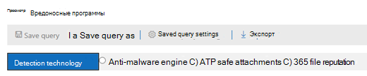

4. Выберите параметр. Затем выберите **кнопку Обновить,** чтобы применить этот фильтр.

   > [!div class="mx-imgBorder"]
   > 

Отчет обновляется, чтобы показать результаты, обнаруженные вредоносными программами в электронной почте с помощью выбранного вами параметра технологии. Далее можно провести дополнительный анализ.

## Просмотр фишинговых URL-адресов и щелкните данные вердикта

Предположим, что вы хотите видеть попытки фишинга с помощью URL-адресов в электронной почте, включая список URL-адресов, которые были разрешены, заблокированы и переопределены. Чтобы определить url-адреса, которые были нажаты, [необходимо настроить Сейф ссылки.](safe-links.md) Убедитесь, что Сейф [ссылки](set-up-safe-links-policies.md) для защиты и ведения журнала по ссылкам при Сейф ссылки.

Чтобы просмотреть URL-адреса фишинга в сообщениях и нажать [   >   ](threat-explorer-views.md#email--phish) на URL-адреса в фишинговых сообщениях, используйте представление фишинга электронной почты Explorer или обнаружения в режиме реального времени.

1. В Центре & безопасности выберите Обозреватель управления угрозами (или обнаружение в <https://protection.office.com>  \>  **режиме реального времени).** (В этом примере используется Explorer.)

2. В меню **Просмотр** выберите фишинг **электронной** \> **почты**.

   > [!div class="mx-imgBorder"]
   > 

3. Щелкните **отправитель,** а затем выберите **URL-адреса** \> **нажмите кнопку вердикт**.

4. Выберите один или несколько  параметров, таких как Заблокировано и **Блок** переопределено, а затем выберите кнопку **Обновление** на той же строке, что и параметры для применения этого фильтра. (Не обновляйте окно браузера.)

   > [!div class="mx-imgBorder"]
   > 

   Отчет обновляется, чтобы показать две разные таблицы URL-адресов на вкладке URL-адреса в отчете:

   - **Верхние URL-адреса** — это URL-адреса в сообщениях, которые отфильтровываются, и для каждого URL-адреса учитываются действия доставки электронной почты. В представлении электронной почты Фишинг этот список обычно содержит законные URL-адреса. Злоумышленники включают сочетание хороших и плохих URL-адресов в сообщениях, чтобы попытаться доставить их, но они делают вредоносные ссылки более интересными. Таблица URL-адресов сортируется по общему счету электронной почты, но этот столбец скрыт для упрощения представления.

   - **Верхние щелчки** — Сейф url-адреса, на которые были нажаты ссылки, отсортировали по общему счету щелчка. Этот столбец также не отображается, чтобы упростить представление. Общие числа по столбцу указывают, Сейф ссылки нажмите количество приговора для каждого нажав URL-адрес. В представлении электронной почты Фишинг это обычно подозрительные или вредоносные URL-адреса. Но представление может включать URL-адреса, которые не являются угрозами, но находятся в фишинговых сообщениях. URL-адреса, нажав на незаверстатьные ссылки, здесь не указаны.

   В двух таблицах URL-адресов указаны лучшие URL-адреса в фишинговых сообщениях электронной почты по действию доставки и расположению. В таблицах указаны url-адреса, которые были заблокированы или посетили, несмотря на предупреждение, поэтому вы можете увидеть, какие потенциальные плохие ссылки были представлены пользователям и что пользователь щелкнул. Далее можно провести дополнительный анализ. Например, ниже диаграммы можно увидеть верхние URL-адреса в сообщениях электронной почты, заблокированных в среде организации.

   > [!div class="mx-imgBorder"]
   > 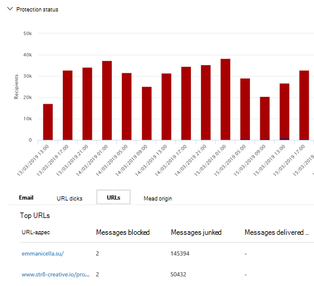

   Выберите URL-адрес, чтобы просмотреть более подробные сведения.

   > [!NOTE]
   > В диалоговом окне флажок URL-адреса фильтрация сообщений электронной почты удаляется, чтобы показать полное представление экспозиции URL-адреса в вашей среде. Это позволяет фильтровать сообщения электронной почты, которые вас беспокоят в Explorer, находить конкретные URL-адреса, которые являются потенциальными угрозами, а затем расширять представление об экспозиции URL-адресов в среде (через диалоговое окно сведений URL-адреса), не добавляя url-адреса в представление обозревателя.

### Интерпретация вердиктов нажмите кнопку

В вылетах электронной почты или URL-адресов, нажатий кнопки "Топ", а также в наших впечатлениях от фильтрации вы увидите различные значения вердикта:

- **Нет:** Невозможно зафиксировать вердикт для URL-адреса. Пользователь мог щелкнуть URL-адрес.
- **Разрешено:** Пользователю было разрешено перемещаться по URL-адресу.
- **Заблокировано:** Пользователю было заблокировано перемещение по URL-адресу.
- **Ожидая вердикта:** Пользователю была представлена страница, ожидаемая детонации.
- **Заблокировано переопределено:** Пользователю было заблокировано перемещение непосредственно по URL-адресу. Но пользователь перегородит блок, чтобы перейти к URL-адресу.
- **В ожидании вердикта обойти:** Пользователю была представлена страница детонации. Но пользователь перегородит сообщение, чтобы получить доступ к URL-адресу.
- **Ошибка:** Пользователю была представлена страница ошибки или произошла ошибка при захвате вердикта.
- **Сбой:** При записи приговора произошло неизвестное исключение. Пользователь мог щелкнуть URL-адрес.

## Просмотр сообщений электронной почты, сообщаемой пользователями

Предположим, что вы хотите видеть сообщения электронной почты, которые  пользователи в организации сообщали как нежелательной, а не нежелательной *или* фишинговой через надстройку Report [Message](enable-the-report-message-add-in.md) или надстройку Report [Phishing.](enable-the-report-phish-add-in.md) Чтобы увидеть их, используйте представление [   >  **отправки**](threat-explorer-views.md#email--submissions) электронной почты explorer (или обнаружение в режиме реального времени).

1. В Центре & безопасности выберите Обозреватель управления угрозами (или обнаружение в <https://protection.office.com>  \>  **режиме реального времени).** (В этом примере используется Explorer.)

2. В меню **Просмотр** выберите **отправку** \> **электронной почты.**

   > [!div class="mx-imgBorder"]
   > 

3. Щелкните **отправитель,** а затем выберите **тип** \> **Базового отчета.**

4. Выберите параметр, например **Фишинг,** а затем выберите кнопку **Обновить.**

   > [!div class="mx-imgBorder"]
   > 

Отчет обновляется, чтобы показать данные о сообщениях электронной почты, которые люди в организации сообщали как попытку фишинга. Эти сведения можно использовать для проведения дополнительного анализа и, при необходимости, настройки политик защиты от фишинга в [Microsoft Defender](configure-mdo-anti-phishing-policies.md)для Office 365 .

## Запуск автоматического расследования и ответа

> [!NOTE]
> Возможности автоматического расследования и ответа доступны в Microsoft Defender для Office 365 *2* и *Office 365 E5.*

[Автоматическое расследование и реагирование](automated-investigation-response-office.md) могут сэкономить время и усилия группы операций безопасности, затраченные на расследование и смягчение кибератак. Помимо настройки оповещений, которые могут вызвать книгу безопасности, можно запустить автоматизированный процесс расследования и ответа из представления в Explorer. Дополнительные сведения [см. в примере. Администратор безопасности запускает расследование из Explorer.](automated-investigation-response-office.md#example-a-security-administrator-triggers-an-investigation-from-threat-explorer)

## Дополнительные способы обнаружения explorer и в режиме реального времени

В дополнение к сценариям, описанным в этой статье, у вас есть еще много вариантов отчетности, доступных с Explorer (или обнаружения в режиме реального времени). См. следующие статьи:

- [Поиск и изучение доставленной нежелательной почты](investigate-malicious-email-that-was-delivered.md)
- [Просмотр вредоносных файлов, обнаруженных в SharePoint Online, OneDrive и Microsoft Teams](./mdo-for-spo-odb-and-teams.md)
- [Обзор представлений в Обозревателе угроз (и обнаружения в режиме реального времени)](threat-explorer-views.md)
- [отчет о состоянии защиты от угроз](view-email-security-reports.md#threat-protection-status-report);
- [Автоматическое исследование и ответ в Microsoft 365 Defender](../defender/m365d-autoir.md)

## Обязательные лицензии и разрешения

Вы должны иметь [Microsoft Defender для Office 365](defender-for-office-365.md) для использования обнаружения Explorer или в режиме реального времени.

- Explorer включен в Defender для Office 365 Plan 2.
- Отчет о обнаружениях в режиме реального времени включен в Defender для Office 365 плана 1.
- Планирование назначения лицензий для всех пользователей, которые должны быть защищены Defender для Office 365. Обнаружение explorer и в режиме реального времени показывает данные обнаружения для лицензированных пользователей.

Чтобы просмотреть и использовать обнаружения Explorer или в режиме реального времени, необходимо иметь соответствующие разрешения, например разрешения, предоставленные администратору безопасности или считывателя безопасности.

- Для Центра & безопасности вам должна быть назначена одна из следующих ролей:

  - Управление организацией
  - Администратор безопасности (это может быть назначено в центре администрирования Azure Active Directory ( <https://aad.portal.azure.com> )
  - Читатель сведений о безопасности

- Для Exchange Online, вам должна быть назначена одна из следующих ролей в центре администрирования Exchange () или <https://admin.protection.outlook.com/ecp/> [Exchange Online PowerShell:](/powershell/exchange/exchange-online-powershell)

  - Управление организацией
  - Управление организацией только с правом на просмотр
  - Получатели только для чтения
  - Управление соответствием требованиям

Дополнительные информацию о ролях и разрешениях см. в следующих ресурсах:

- [Разрешения на портале Microsoft 365 Defender](permissions-microsoft-365-security-center.md)
- [Разрешения компонентов в Exchange Online](/exchange/permissions-exo/feature-permissions)

## Различия между обнаружением обозревателя угроз и обнаружения в режиме реального времени

- Отчет *о обнаружениях в* режиме реального времени доступен в Defender для Office 365 плана 1. *Обозреватель угроз* доступен в Defender для Office 365 Plan 2.
- Отчет о обнаружениях в режиме реального времени позволяет просматривать обнаружения в режиме реального времени. Обозреватель угроз также делает это, но также предоставляет дополнительные сведения для данной атаки.
- Все *представления электронной* почты доступны в Обозревателе угроз, но не в отчете о обнаружениях в режиме реального времени.
- Дополнительные возможности фильтрации и доступные действия включены в Обозреватель угроз. Дополнительные сведения см. в [описании Microsoft Defender для службы Office 365:](/office365/servicedescriptions/office-365-advanced-threat-protection-service-description#feature-availability-across-advanced-threat-protection-atp-plans)доступность функций в Defender для Office 365 планов.

## Другие статьи

[Изучение сообщений электронной почты на странице Сущности электронной почты](mdo-email-entity-page.md)
