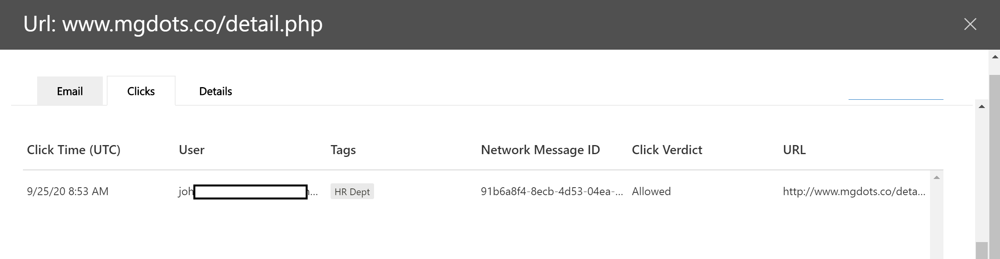

# Обозреватель угроз и обнаружение угроз в режиме реального времени

**Область применения**
- [Microsoft Defender для Office 365 (план 1 и план 2)](https://go.microsoft.com/fwlink/?linkid=2148715)
- [Microsoft 365 Defender](https://go.microsoft.com/fwlink/?linkid=2118804)

Если в вашей организации есть Microsoft Defender для Office [365](office-365-atp.md)и  у вас есть необходимые [разрешения,](#required-licenses-and-permissions)у вас есть обнаружение проводника или в режиме реального времени **(ранее** отчеты в режиме реального времени *—* новые возможности [!).](#new-features-in-threat-explorer-and-real-time-detections) В Центре безопасности & соответствия требованиям перейдите в центр управления угрозами, а затем выберите **"Проводник"**  или "Обнаружение угроз **в режиме реального времени".** 

|В Microsoft Defender для Office 365 (план 2) вы увидите:|В Microsoft Defender для Office 365 (план 1) вы увидите:|
|---|---|
|||
|

Обнаружение в проводнике или в режиме реального времени помогает группе безопасности эффективно исследовать угрозы и реагировать на них. Отчет похож на следующее изображение:

С помощью этого отчета вы можете:

- [См. вредоносные программы, обнаруженные функциями безопасности Microsoft 365](#see-malware-detected-in-email-by-technology)
- [Просмотр фишинговых URL-адресов и щелкните данные решения](#view-phishing-url-and-click-verdict-data)
- [Запуск автоматизированного исследования и](#start-automated-investigation-and-response) реагирования на них из представления в проводнике (только в Защитнике для Office 365 (план 2)
- [Изучение вредоносной электронной почты и другие](#more-ways-to-use-explorer-and-real-time-detections)

## Улучшения обозревателя угроз и обнаружения угроз в режиме реального времени

### Теги в обозревателе угроз

> [!NOTE]
> Функция тегов пользователей доступна в режиме *предварительного* просмотра, доступна не всем и может быть измениться. Сведения о расписании выпусков можно узнать в плане microsoft 365.

Теги пользователей определяют определенные группы пользователей в Microsoft Defender для Office 365. Дополнительные сведения о тегах, включая лицензирование и настройку, см. в [тегах пользователя.](user-tags.md)

В обозревателе угроз можно увидеть сведения о тегах пользователей в следующих интерфейсах.

#### Представление сетки электронной почты

Столбец **"Теги"** в сетке электронной почты содержит все теги, примененные к почтовым ящикам отправитель или получатель. По умолчанию системные теги, такие как учетные записи с приоритетом, сначала показываются.

> [!div class="mx-imgBorder"]
> 

#### Фильтрация

Теги можно использовать в качестве фильтра. Выслегать только учетные записи с учетной записью приоритета или определенными сценариями тегов пользователей. Вы также можете исключить результаты с определенными тегами. Объединяйте эту функцию с другими фильтрами, чтобы сузить область исследования.

> [!div class="mx-imgBorder"]
> 

#### Flyout подробных сообщений электронной почты
Чтобы просмотреть отдельные теги для отправитель и получатель, выберите тему, чтобы открыть flyout сведений о сообщении. На **вкладке "Сводка"** теги отправитель и получатель показаны отдельно, если они присутствуют для сообщения электронной почты.
Сведения об отдельных тегах для отправитель и получатель также распространяется на экспортировать CSV-данные, где эти сведения можно увидеть в двух отдельных столбцах.

> [!div class="mx-imgBorder"]
> 

Сведения о тегах также показаны во flyout щелчков URL-адреса. Чтобы просмотреть его, перейдите в представление "Фишинг" или "Все сообщения электронной почты", а затем на **вкладку "URL-адреса"** **или "Нажатие URL-адреса".** Выберите отдельный флажок URL-адреса, чтобы просмотреть дополнительные сведения о щелчках для этого URL-адреса, включая теги, связанные с этим щелчком.

> [!div class="mx-imgBorder"]
> 

## Улучшения охоты на угрозы (предстоящие)

### Обновленные сведения об угрозах для электронных писем

Мы уделяли основное внимание улучшению платформы и качества данных, чтобы повысить точность и согласованность данных для записей электронной почты. Усовершенствования включают консолидацию сведений о до доставке и после доставки, например действий, выполненных с электронной почтой в рамках процесса ZAP, в единую запись. Также включены дополнительные сведения, такие как решение о нежелательной почте, угрозы на уровне сущности (например, какой URL-адрес был вредоносным), а также последние расположения доставки.

После этих обновлений вы увидите одну запись для каждого сообщения, независимо от того, какие события после доставки влияют на сообщение. Действия могут включать zap, исправление вручную (то есть действие администратора), динамическую доставку и так далее.

Помимо показа вредоносных программ и фишинговых угроз, вы увидите решение о нежелательной почте, связанное с сообщением электронной почты. В сообщении электронной почты см. все угрозы, связанные с электронной почтой, а также соответствующие технологии обнаружения. Сообщение электронной почты может иметь ноль, одну или несколько угроз. Текущие угрозы вы увидите в разделе **"Сведения"** во flyout электронной почты. Для нескольких угроз (например, вредоносных  программ и фишинга) техническое поле обнаружения показывает сопоставление обнаружения угроз, которое является технологией обнаружения, которая идентифицировала угрозу.

Набор технологий обнаружения теперь включает новые методы обнаружения, а также технологии обнаружения нежелательной почты. Вы можете использовать тот же набор технологий обнаружения для фильтрации результатов по различным представлениям электронной почты (вредоносные программы, фишинг, вся электронная почта).

> [!NOTE]
> Анализ заключениеов не обязательно должен быть привязан к сущностям. Например, сообщение может быть классифицировано как фишинговое или нежелательное, но url-адреса, помеченные с помощью решения о фишинге или нежелательной почте, не существуют. Это необходимо, так как фильтры также оценивают содержимое и другие сведения для сообщения электронной почты перед назначением решения.

#### Угрозы в URL-адресах

Теперь вы можете увидеть определенную угрозу ДЛЯ URL-адреса на вкладке "Сведения" во flyout **электронной почты.** Угрозой может быть *вредоносная программа,* *фишинг,* *спам* или *нет.)*

> [!div class="mx-imgBorder"]
> 

### Обновленное представление временной шкалы (предстоящий)

> [!div class="mx-imgBorder"]
> 

Представление временной шкалы определяет все события доставки и после доставки. Он содержит сведения об угрозе, обнаруженной на этом этапе для подмножеств этих событий. Представление временной шкалы также предоставляет сведения о любых дополнительных действиях (например, zap или исправлении вручную), а также о результатах этого действия. Сведения о представлении временной шкалы включают:

- **Источник:** Источник события. Это может быть администратор, система или пользователь.
- **Событие:** Включает события верхнего уровня, такие как исходная доставка, исправление вручную, ZAP, отправки и динамическая доставка.
- **Действие:** Конкретное действие, которое было принято в рамках zaP или действий администратора (например, мягкое удаление).
- **Угрозы:** Охватывает угрозы (вредоносные программы, фишинг, спам), выявленные на этом этапе.
- **Результат/сведения:** Дополнительные сведения о результате действия, например о том, было ли оно выполнено в рамках действия ZAP/admin.

### Исходное и последнее место доставки

В настоящее время место доставки можно ухитить в сетке электронной почты и во flyout электронной почты. Поле **расположения доставки** получает переименование **_Исходное расположение_ доставки *_. Кроме того, мы представляем другое поле, _Latest*_delivery location_**.

**Исходное расположение доставки** позволит получить дополнительные сведения о том, где изначально было доставлено сообщение электронной почты. **В последнем расположении** доставки будет нахождения сообщения электронной почты после действий системы, таких как *ZAP* или действий администратора, таких как перемещение *в удаленные элементы.* Последнее место доставки предназначено для того, чтобы сообщить администраторам о последнем известном расположении сообщения после доставки или о любых действиях системы или администратора. Он не включает действия конечных пользователей в сообщении электронной почты. Например, если пользователь удалил сообщение или переместил его в архив или pst, расположение доставки сообщения не будет обновлено. Но если системное действие обновило расположение (например, zap, в результате  чего сообщение электронной почты перемещается в карантин), последняя доставка будет показываться как "карантин".

> [!div class="mx-imgBorder"]
> 

> [!NOTE]
> Существует несколько случаев,  когда место доставки и **действие доставки** могут быть "неизвестными":
>
> - Если сообщение  доставлено, возможно,  расположение доставки будет "доставлено", а "неизвестно", но правило папки "Входящие" переместило сообщение в папку по умолчанию (например, черновик или архив), а не в папку "Входящие" или "Нежела гостевая почта".
>
> - **Последнее место доставки** может быть неизвестно, если предпринята попытка администратора или системы (например, ZAP), но сообщение не найдено. Обычно действие происходит после того, как пользователь переместил или удалил сообщение. В таких случаях проверьте **столбец результатов и сведений** в представлении временной шкалы. Найми заявление "Сообщение перемещено или удалено пользователем".

> [!div class="mx-imgBorder"]
> 

### Дополнительные действия

*После доставки* сообщения были применены дополнительные действия. Они могут включать *zap,* ручное исправление *(действие* администратора, такое как мягкое *удаление),* динамическую доставку и повторное обработку *(для* сообщения электронной почты, которое было задним числом обнаружено как хорошее).

> [!NOTE]
> - В рамках ожидающих изменений значение "Removed by ZAP", в настоящее время добавленное в фильтр действий доставки, удаляется. Вы сможете найти все сообщения электронной почты с помощью функции ZAP с помощью **дополнительных действий.**
>
> - Для технологий обнаружения и  дополнительных действий **(особенно** для сценариев ZAP) будут добавлены новые поля и значения. Вам потребуется оценить существующие сохраненные запросы и отслеживаемые запросы, чтобы убедиться, что они работают с новыми значениями.

> [!div class="mx-imgBorder"]

> 

### Переопределения системы

*Системные переопределения* позволяют делать исключения из расположения доставки сообщения. Расположение доставки, предоставляемого системой, переопределяется в зависимости от угроз и других обнаружений, выявленных стеком фильтрации. Переопределения системы можно настроить с помощью политики клиента или пользователя, чтобы доставить сообщение, как это предлагается политикой. Переопределения могут определять непреднамеренное доставку вредоносных сообщений из-за недочетов конфигурации, таких как чрезмерно широкая политика безопасных отправитель, заданная пользователем. Эти значения переопределения могут быть:

- Разрешено политикой пользователя: пользователь создает политики на уровне почтового ящика, чтобы разрешить домены или отправителей.
- Заблокировано политикой пользователя: пользователь создает политики на уровне почтового ящика для блокировки доменов или отправителей.
- Разрешено политикой организации: группы безопасности организации устанавливают политики или правила потока почты Exchange (также известные как правила транспорта), чтобы разрешить отправителей и домены для пользователей в организации. Это может быть для набора пользователей или всей организации.
- Заблокировано политикой организации: группы безопасности организации устанавливают политики или правила потока почты, блокируют отправителей, домены, языки сообщений или исходные IPS для пользователей в организации. Это может быть применено к набору пользователей или всей организации.
- Расширение файлов, заблокированное политикой организации: группа безопасности организации блокирует расширение имени файла с помощью параметров политики защиты от вредоносных программ. Эти значения теперь будут отображаться в сведениях электронной почты для помощи в расследованиях. Группы секопов также могут использовать функцию фильтрации с помощью функций фильтрации по заблокированным расширениям файлов.

> [!div class="mx-imgBorder"]
> 

### Улучшения для работы с URL-адресом и щелчками

К улучшениям относятся:

- Показать url-адрес с полным щелчком (включая все параметры запроса, которые являются частью URL-адреса) в разделе **"Щелчки"** во flyout URL-адреса. В настоящее время домен URL и путь отображаются в заголовке. Мы расширяем эти сведения, чтобы показать полный URL-адрес.

- Исправления в фильтрах URL-адресов *(в* сравнении с доменом *URL* и url-адресом и *путем).* Обновления влияют на поиск сообщений, содержащих решение URL-адреса или щелчка. Мы включили поддержку поиска, не относящемся к протоколу, поэтому вы можете искать URL-адрес без `http` использования. По умолчанию поиск URL-адресов сопостает http, если не указано явно другое значение. Например,

   -  Поиск с префиксом и без него в `http://` **полях** URL-адреса, **домена URL** и **URL-адреса и фильтра путей.** Результаты поиска должны быть одинаковыми.

   -  Поиск `https://` префикса в **URL-адресе.** Если значение не указано, предполагается `http://` префикс.

   - `/`игнорируется в начале и конце url-пути, **URL-домена,** **домена URL и полей пути.** `/` в конце поля **URL-адреса** игнорируется.

### Уровень уверенности в фишинге

Уровень уверенности в фишинге помогает определить степень уверенности, с которой сообщение было классифицированы как "фишинговое". Два возможных значения: *High* и *Normal.* На начальных этапах этот фильтр будет доступен только в представлении "Фишинг" обозревателя угроз.

### Сигнал URL-адреса ZAP

Сигнал URL-адреса ZAP обычно используется для сценариев фишинговых оповещений ZAP, в которых сообщение было определено как фишинговое и удалено после доставки. Этот сигнал связывает оповещение с соответствующими результатами в проводнике. Это один из оповещений об IOC.

Чтобы улучшить процесс охоты, мы обновили обозреватель угроз и обнаружение угроз в режиме реального времени, чтобы сделать его более согласованным. Изменения описаны здесь:

- [Улучшения в timezone](#timezone-improvements)
- [Обновление в процессе обновления](#update-in-the-refresh-process)
- [Сверло диаграммы для добавления к фильтрам](#chart-drilldown-to-add-to-filters)
- [В обновлениях сведений о продукте](#in-product-information-updates)

### Фильтрация по тегам пользователей

Теперь можно сортировать и фильтровать системные или настраиваемые теги пользователей, чтобы быстро понять область угроз. Дополнительные данные [см. в тегах пользователей.](user-tags.md)

> [!IMPORTANT]
> Фильтрация и сортировка по тегам пользователей в настоящее время находятся в открытой предварительной версии. Эти функции могут быть существенно изменены до коммерческого выпуска. Корпорация Майкрософт не дает никаких гарантий, как прямого, так и подразумеваемого, в отношении предоставляемой информации о ней.

### Улучшения в timezone

Вы увидите часовой пояс для записей электронной почты на портале, а также для экспортных данных. Он будет виден во всех действиях, таких как сетка электронной почты, flyout сведений, временная шкала электронной почты и подобные сообщения электронной почты, поэтому часовой пояс для набора результатов понятен.

> [!div class="mx-imgBorder"]
> 

### Обновление в процессе обновления

Некоторые пользователи комментировали путаницу с автоматическим обновлением (например, как только вы измените дату, обновляете страницу) и ручным обновлением (для других фильтров). Аналогично удаление фильтров приводит к автоматическому обновлению. Изменение фильтров при изменении запроса может привести к несогласованным поисковым запросам. Чтобы устранить эти проблемы, мы переходим к механизму фильтрации вручную.

С точки зрения интерфейса пользователь может применять и удалять различные фильтры (из набора фильтров и даты) и нажимать кнопку обновления для фильтрации результатов после определения запроса. Теперь кнопка обновления также подчеркнута на экране. Мы также обновили соответствующие инструменты и документацию по продукту.

> [!div class="mx-imgBorder"]
> 

### Сверло диаграммы для добавления к фильтрам

Теперь можно отметить значения легенд, чтобы добавить их в качестве фильтров. Выберите **кнопку** "Обновить", чтобы отфильтровать результаты.

> [!div class="mx-imgBorder"]
> 

### Обновления сведений о продукте

Теперь в продукте доступны дополнительные сведения, например общее количество результатов поиска в сетке (см. ниже). Мы улучшили метки, сообщения об ошибках и панели инструментов, чтобы предоставить дополнительные сведения о фильтрах, средствах поиска и наборе результатов.

> [!div class="mx-imgBorder"]
> 

## Расширенные возможности в обозревателе угроз

### Пользователи с лучшими целевыми объектами

Сегодня мы откроем список самых целевых пользователей в представлении "Вредоносные программы" для сообщений электронной почты в разделе "Семейства самых **вредоносных программ".** Мы также расширим это представление в представлениях "Фишинг" и "Все сообщения электронной почты". Вы сможете просмотреть пять наиболее целевых пользователей, а также количество попыток для каждого пользователя в соответствующем представлении. Например, в представлении "Фишинг" вы увидите количество попыток фишинга.

Вы сможете экспортировать список целевых пользователей (не более 3000), а также количество попыток автономного анализа для каждого представления электронной почты. Кроме того, выбор количества попыток (например, 13 попыток на изображении ниже) откроет отфильтрованное представление в обозревателе угроз, чтобы вы могли просмотреть дополнительные сведения о сообщениях электронной почты и угрозах для этого пользователя.

> [!div class="mx-imgBorder"]
> 

### Правила транспорта Exchange

В рамках обогащения данных вы сможете увидеть все различные правила транспорта Exchange (ETR), которые были применены к сообщению. Эти сведения будут доступны в представлении сетки электронной почты. Чтобы просмотреть его, выберите **параметры столбца** в сетке, а затем добавьте правило транспорта **Exchange** из параметров столбца. Он также будет виден во flyout **Сведений** в сообщении электронной почты.

Вы сможете увидеть как GUID, так и имя правил транспорта, которые были применены к сообщению. Вы сможете искать сообщения, используя имя правила транспорта. Это поиск "Содержит", что означает, что вы также можете частично искать.

#### Важное примечание.

Поиск etr и доступность имен зависят от конкретной роли, назначенной вам. Для просмотра имен etr и поиска необходима одна из следующих ролей и разрешений. Если вам не назначены какие-либо из этих ролей, вы не сможете видеть имена правил транспорта или искать сообщения с помощью имен etr. Однако вы можете увидеть метку ETR и сведения о GUID в сведениях электронной почты. Другие опытом просмотра записей в сетках электронной почты, flyouts электронной почты, фильтрах и экспорте не затронуты.

- Только EXO — предотвращение потери данных: все
- Только EXO — O365SupportViewConfig: все
- Microsoft Azure Active Directory или EXO — администратор безопасности: все
- AAD или EXO — читатель безопасности: все
- Только EXO — правила транспорта: все
- Только EXO — View-Only конфигурация: все

В сетке электронной почты, во флажок "Сведения" и экспортируемом CSV-адресе etRs представлены с именем/GUID, как показано ниже.

> [!div class="mx-imgBorder"]
> 

### Входящие соединители

Соединители — это коллекция инструкций по настройке потока электронной почты в вашу организацию Microsoft 365 или Office 365 и из нее. Они позволяют применять любые ограничения безопасности или элементы управления. Теперь в обозревателе угроз можно просматривать соединители, связанные с электронной почтой, и искать сообщения электронной почты с помощью имен соединитеев.

Поиск соединители по своей природе "содержит", что означает, что также должен работать частичный поиск по ключевым словам. В представлении "Главная сетка", во flyout Details и в экспортируемом CSV-формате соединители показаны в формате "Имя/GUID", как показано ниже:

> [!div class="mx-imgBorder"]
> 

## Новые функции в обозревателе угроз и обнаружении угроз в режиме реального времени

В обозревателе угроз и при обнаружении угроз в режиме реального времени доступны три новые функции:

- [Предварительный просмотр заголовщика электронной почты и загрузка тела сообщения](#preview-email-header-and-download-email-body)
- [Временная шкала электронной почты](#email-timeline)
- [Экспорт данных щелчка URL-адреса](#export-url-click-data)

Эти новые функции описаны ниже.

### Предварительный просмотр заголовщика электронной почты и загрузка тела сообщения

Теперь вы можете просмотреть заголовщик электронной почты и скачать его текст в обозревателе угроз, чтобы администраторы могли анализировать загруженные заголовки и сообщения электронной почты на угрозы. Так как загрузка сообщений электронной почты может привести к риску подверженности риску информации, этот процесс управляется управлением доступом на основе ролей (RBAC). Новую роль *Preview* необходимо добавить в другую группу ролей (например, "Операции безопасности" или "Администратор безопасности"), чтобы предоставить возможность скачивать сообщения в представлении всех сообщений электронной почты. Однако просмотр загона электронной почты не требует дополнительной роли (кроме того, что требуется для просмотра сообщений в обозревателе угроз).

Обнаружение проводника и обнаружения в режиме реального времени также получит новые поля, которые предоставляют более полное представление о том, где находится ваше сообщение электронной почты. Эти изменения упрощают поиск в целях обеспечения безопасности. Но главный результат — вы можете быстро узнать расположение проблемных сообщений электронной почты.

Как это делается? Теперь состояние доставки разбито на два столбца:

- **Действие доставки** — состояние сообщения электронной почты.
- **Место доставки** — куда было перена отправлено сообщение электронной почты.

*Действие доставки* — это действие, которое по электронной почте происходит из-за существующих политик или обнаружений. Вот возможные действия для сообщения электронной почты:

|Доставлено|Junked|Заблокировано|Заменено|
|---|---|---|---|
|Электронная почта была доставлена в папку "Входящие" или папку пользователя, и пользователь может получить к ней доступ.|Сообщение электронной почты было отправлено в папку пользователя "Нежеланая почта" или "Удалено", и пользователь может получить к нему доступ.|Сообщения электронной почты, которые находятся в карантине, которые не удалось отправить или были отброшены. Эти сообщения недоступны пользователю.|В сообщениях электронной почты были вредоносные вложения, замененные TXT-файлами, которые сообщили, что вложение является вредоносным.|

Вот что пользователь может и не может видеть:

|Доступно для конечных пользователей|Недоступно для конечных пользователей|
|---|---|
|Доставлено|Заблокировано|
|Junked|Заменено|

**Место доставки** показывает результаты политик и обнаружений, которые запускались после доставки. Он связан с действием **_доставки._** Возможные значения:

- *Папка "Входящие"* или "Входящие": сообщение находится в папке "Входящие" или в папке (в соответствии с правилами электронной почты).
- *Локальное или внешнее*: почтовый ящик не существует в облаке, но находится локально.
- *Папка нежелательной* почты: сообщение находится в папке нежелательной почты пользователя.
- *Папка "Удаленные"*— сообщение электронной почты в папке "Удаленные" пользователя.
- *Карантин:* сообщение находится в карантине, а не в почтовом ящике пользователя.
- *Failed*: The email failed to reach the mailbox.
- *Отброшено:* сообщение потеряно где-то в потоке почты.

### Временная шкала электронной почты

Временная **шкала электронной** почты — это новая функция проводника, которая улучшает поиск для администраторов. Он сокращает время, затраченное на проверку различных местоположений, чтобы попытаться понять событие. Когда несколько событий происходят одновременно или почти одновременно с сообщением электронной почты, эти события отображаются в представлении временной шкалы. Некоторые события, которые происходят с вашей электронной почтой после доставки, фиксются в **столбце "Специальное действие".** Администраторы могут комбинировать информацию из временной шкалы с особыми действиями, принятыми после доставки почты, чтобы получить представление о том, как работают их политики, куда была отправлена почта, а в некоторых случаях и о том, какая была окончательная оценка.

Дополнительные сведения см. в теме "Исследование и исправление вредоносной электронной почты, [доставленной в Office 365".](investigate-malicious-email-that-was-delivered.md)

### Экспорт данных щелчка URL-адреса

Теперь вы можете экспортировать отчеты о нажатии URL-адреса в Microsoft Excel, чтобы просмотреть их сетевой ИД сообщения и решение щелчка, что помогает объяснить, откуда был трафик щелчка URL-адреса.   Вот как это работает: в службе управления угрозами на панели быстрого запуска Office 365 следуйте этой цепочке:

**Проводник** \> **Просмотр фишинга** \> **Нажатия** \> **Верхние URL-адреса** или URL-адреса при нажатии кнопки "Top **Clicks"** (Нажатие верхнего URL-адреса) выбирают любую запись, чтобы \> открыть этот флажок.

При выборе URL-адреса в списке на  панели вы увидите новую кнопку "Экспорт". Эта кнопка используется для перемещения данных в таблицу Excel для упростить отчетность.

Следуйте этому пути, чтобы добраться до того же места в отчете об обнаружении в режиме реального времени:

**Проводник** \> **Обнаружение в режиме реального времени** \> **Просмотр фишинга** \> **URL-адреса** \> **Top URLs** or **Top Clicks** \> Select any record to open the URL flyout \> navigate to the **Clicks** tab.

> [!TIP]
> При поиске по ИД в проводнике или связанных сторонних средствах при поиске по ИД с помощью сетевого сообщения возвращается ссылка на определенные сообщения. Такие поисковые запросы определяют сообщение электронной почты, связанное с результатом щелчка. Наличие коррелирующих сетевых сообщений позволяет быстрее и мощнее анализировать их.

> [!div class="mx-imgBorder"]
> 

## См. вредоносные программы, обнаруженные в электронной почте по технологии

Предположим, вы хотите увидеть вредоносные программы, обнаруженные в электронной почте, отсортировали по технологии Microsoft 365. Для этого используйте представление "Электронная [почта > вредоносных](threat-explorer-views.md#email--malware) программ" в проводнике (или обнаружение вредоносных программ в режиме реального времени).

1. В Центре безопасности & соответствия требованиям ( ) выберите обозреватель управления угрозами (или обнаружение <https://protection.office.com>  \>  **в режиме реального времени).** (В этом примере используется проводник.)

2. В меню **"Вид"** выберите "Вредоносные программы **электронной** \> **почты".**

   > [!div class="mx-imgBorder"]
   > 

3. Щелкните **"Отправитель"** и выберите **технологию** \> **базового обнаружения.**

   Теперь технологии обнаружения доступны в качестве фильтров для отчета.

   > [!div class="mx-imgBorder"]
   > 

4. Выберите параметр. Затем выберите **кнопку** "Обновить", чтобы применить этот фильтр.

   > [!div class="mx-imgBorder"]
   > 

Отчет обновляется, чтобы показать результаты обнаружения вредоносных программ в электронной почте с использованием выбранной технологии. Здесь можно провести дополнительный анализ.

## Просмотр фишинговых URL-адресов и щелкните данные решения

Предположим, что вы хотите увидеть попытки фишинга по URL-адресам в электронной почте, включая список разрешенных, заблокированных и переопределяющих URL-адресов. Чтобы определить URL-адреса,  которые были нажаты, необходимо настроить безопасные ссылки. Убедитесь, что  вы настроили политики безопасных ссылок для защиты при щелчке мышью и ведения журнала по решениям по щелчку с помощью безопасных ссылок.

Чтобы просмотреть фишинговые URL-адреса в сообщениях и щелкнуть их в фишинговых сообщениях, используйте представление "Фишинг электронной почты" в проводнике или в режиме реального времени. [   >   ](threat-explorer-views.md#email--phish)

1. В Центре безопасности & соответствия требованиям ( ) выберите обозреватель управления угрозами (или обнаружение <https://protection.office.com>  \>  **в режиме реального времени).** (В этом примере используется проводник.)

2. В меню **"Вид"** выберите **"Фишинг** \> **электронной почты".**

   > [!div class="mx-imgBorder"]
   > 

3. Щелкните **"Отправитель"** и выберите **"URL-адреса"** \> **"Щелкните решение".**

4. Выберите один или несколько  параметров, например "Заблокировано" и  "Переопределено блокировкой", а затем нажав кнопку "Обновить" в той же строке, что и параметры применения этого фильтра. (Не обновляйте окно браузера.)

   > [!div class="mx-imgBorder"]
   > 

   Отчет обновляется для показа двух разных таблиц URL-адресов на вкладке "URL-адрес" в отчете:

   - **Верхние URL-адреса** — это URL-адреса в отфильтрованных сообщениях и количество действий доставки электронной почты для каждого URL-адреса. В представлении "Фишинговое сообщение" этот список обычно содержит подлинные URL-адреса. Злоумышленники включают в свои сообщения несколько url-адресов хорошего и плохого, чтобы попытаться доставить их, но они делают вредоносные ссылки более интересными. Таблица URL-адресов сортируется по общему количества сообщений электронной почты, но этот столбец скрыт для упрощения представления.

   - **Наиболее часто щелкают** URL-адреса с оболочкой "Безопасные ссылки", которые отсортировали по общему число щелчков. Этот столбец также не отображается для упрощения представления. Общее количество по столбцам указывает число щелчков по "безопасным ссылкам" для каждого щелкнуваемого URL-адреса. В представлении фишинга это обычно подозрительные или вредоносные URL-адреса. Но представление может включать URL-адреса, которые не являются угрозами, но находятся в фишинговых сообщениях. Url clicks on unwrapped links don't show up here.

   В двух таблицах URL-адресов указаны лучшие URL-адреса в фишинговых сообщениях электронной почты по действию доставки и расположению. В таблицах представлены щелчки URL-адресов, заблокированные или посещаемые несмотря на предупреждение, поэтому вы можете увидеть, какие потенциальные плохое ссылки были представлены пользователям и что пользователь щелкнул. Здесь можно провести дополнительный анализ. Например, под диаграммой можно увидеть верхние URL-адреса в сообщениях электронной почты, заблокированных в среде организации.

   > [!div class="mx-imgBorder"]
   > 

   Выберите URL-адрес для просмотра более подробных сведений.

   > [!NOTE]
   > Во flyout диалоговом окне URL-адреса фильтрация сообщений электронной почты удаляется, чтобы показать полное представление экспозиции URL-адреса в вашей среде. Это позволяет фильтровать сообщения электронной почты, которые вас беспокоит, в проводнике, находить конкретные URL-адреса, которые являются потенциальными угрозами, а затем расширять представление о экспозиции URL-адресов в вашей среде (через диалоговое окно сведений о URL-адресе), не добавляя фильтры URL-адресов в само представление проводника.

### Интерпретация заключениеов по щелчку

В окнах "Электронная почта" или "URL-адрес", "Лучшие щелчки", а также в наших фильтрах вы увидите различные значения решения:

- **Нет:** Не удается зафиксировать заключение для URL-адреса. Пользователь мог щелкнуть URL-адрес.
- **Разрешено:** Пользователю было разрешено перейти по URL-адресу.
- **Заблокировано:** Пользователю было заблокировано переход по URL-адресу.
- **Ожидающих заключение:** Пользователю была представлена страница ожидания детонации.
- **Заблокировано переопределено:** Пользователю было заблокировано прямое перемещение по URL-адресу. Но пользователь переиграет блок, чтобы перейти к URL-адресу.
- **Ожидающих заключение обошел:** Пользователю была представлена страница детонации. Но пользователь переимежает сообщение, чтобы получить доступ к URL-адресу.
- **Ошибка:** Пользователю была представлена страница ошибки или произошла ошибка при захвате решения.
- **Сбой:** При записи решения возникло неизвестное исключение. Пользователь мог щелкнуть URL-адрес.

## Просмотр сообщений электронной почты, отправленных пользователями

Предположим, что вы хотите увидеть сообщения электронной почты, которые  пользователи в вашей организации сообщили как нежелательные, не нежелательные или фишинговые с помощью надстройки Report [Message](enable-the-report-message-add-in.md) или надстройки Report  [Phishing.](enable-the-report-phish-add-in.md) Чтобы просмотреть их, используйте представление [ **"Отправки**  > ](threat-explorer-views.md#email--submissions) электронной почты" в проводнике (или обнаружение в режиме реального времени).

1. В Центре безопасности & соответствия требованиям ( ) выберите обозреватель управления угрозами (или обнаружение <https://protection.office.com>  \>  **в режиме реального времени).** (В этом примере используется проводник.)

2. В меню **"Вид"** выберите пункт **"Отправки** \> **электронной почты".**

   > [!div class="mx-imgBorder"]
   > 

3. Щелкните **"Отправитель"** и выберите **"Базовый** \> **тип отчета".**

4. Выберите вариант, например **"Фишинг",** а затем кнопку **"Обновить".**

   > [!div class="mx-imgBorder"]
   > 

Отчет обновляется, чтобы показать данные о сообщениях электронной почты, которые люди в вашей организации сообщили как фишинговые. Эти сведения можно использовать для дальнейшего анализа и при необходимости настройки политик защиты от фишинга в [Microsoft Defender для Office 365.](configure-atp-anti-phishing-policies.md)

## Запуск автоматизированного исследования и реагирования

> [!NOTE]
> Функции автоматического исследования и реагирования доступны в *Microsoft Defender для Office 365 (план 2)* и Office *365 E5.*

[Автоматизированное исследование и реагирование](automated-investigation-response-office.md) на них может сэкономить время и усилия группы по обеспечению безопасности, затраченные на исследование и реагирование на кибератаки. Помимо настройки оповещений, которые могут запускать книгу безопасности, можно запустить автоматизированный процесс исследования и реагирования из представления в проводнике. Дополнительные сведения [см. в примере: администратор безопасности инициирует исследование из проводника.](automated-investigation-response-office.md#example-a-security-administrator-triggers-an-investigation-from-threat-explorer)

## Дополнительные способы использования обнаружения в проводнике и в режиме реального времени

Помимо сценариев, описанных в этой статье, в проводнике (или при обнаружении в режиме реального времени) доступно гораздо больше возможностей для отчетов. См. следующие статьи:

- [Поиск и изучение доставленной нежелательной почты](investigate-malicious-email-that-was-delivered.md)
- [Просмотр вредоносных файлов, обнаруженных в SharePoint Online, OneDrive и Microsoft Teams](malicious-files-detected-in-spo-odb-or-teams.md)
- [Обзор представлений в обозревателе угроз (и обнаружения в режиме реального времени)](threat-explorer-views.md)
- [отчет о состоянии защиты от угроз](view-email-security-reports.md#threat-protection-status-report);
- [Автоматизированный анализ угроз и реакция на угрозы в службе защиты от угроз (Майкрософт)](https://docs.microsoft.com/microsoft-365/security/mtp/mtp-autoir)

## Обязательные лицензии и разрешения

Для использования обнаружения проводника или обнаружения в режиме реального времени необходимо использовать Microsoft Defender для [Office 365.](office-365-atp.md)

- Explorer входит в состав Защитника Office 365 (план 2).
- Отчет об обнаружении в режиме реального времени входит в состав Защитника для Office 365 (план 1).
- Запланируйте назначение лицензий всем пользователям, которые должны быть защищены Защитником для Office 365. Обнаружение проводника и обнаружения в режиме реального времени показывает данные об обнаружении лицензированных пользователей.

Для просмотра и использования обнаружений проводника или обнаружения в режиме реального времени необходимы соответствующие разрешения, например разрешения, предоставленные администратору безопасности или читателю безопасности.

- Для Центра безопасности & соответствия требованиям должна быть назначена одна из следующих ролей:

  - Управление организацией
  - Администратор безопасности (он может быть назначен в Центре администрирования Azure Active Directory ( <https://aad.portal.azure.com> )
  - Читатель сведений о безопасности

- Для Exchange Online вам должна быть назначена одна из следующих ролей в Центре администрирования Exchange () или <https://admin.protection.outlook.com/ecp/> [Exchange Online PowerShell:](https://docs.microsoft.com/powershell/exchange/exchange-online-powershell)

  - Управление организацией
  - Управление организацией только с правом на просмотр
  - Получатели только для чтения
  - Управление соответствием требованиям

Дополнительные информацию о ролях и разрешениях см. в следующих ресурсах:

- [Разрешения в Центре безопасности и соответствия требованиям](permissions-in-the-security-and-compliance-center.md)
- [Разрешения компонентов в Exchange Online](https://docs.microsoft.com/exchange/permissions-exo/feature-permissions)

## Различия между обозревателем угроз и обнаружением в режиме реального времени

- Отчет *об обнаружении в режиме* реального времени доступен в Защитнике Office 365 (план 1). *Обозреватель угроз* доступен в Защитнике office 365 (план 2).
- Отчет об обнаружении в режиме реального времени позволяет просматривать обнаружения в режиме реального времени. Это также делает обозреватель угроз, но также предоставляет дополнительные сведения о заданной атаке.
- Представление *"Все сообщения* электронной почты" доступно в обозревателе угроз, но не в отчете об обнаружении угроз в режиме реального времени.
- В обозреватель угроз включены дополнительные возможности фильтрации и доступные действия. Дополнительные сведения см. в описании службы Microsoft Defender для Office 365: доступность функций в планах [Защитника для Office 365.](https://docs.microsoft.com/office365/servicedescriptions/office-365-advanced-threat-protection-service-description#feature-availability-across-advanced-threat-protection-atp-plans)
