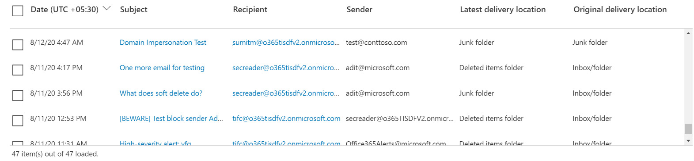
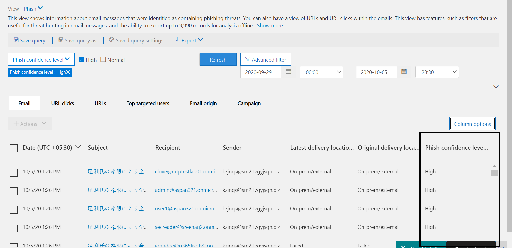

# Обозреватель угроз и обнаружение угроз в режиме реального времениThreat Explorer and Real-time detections

Если в вашей организации есть Microsoft Defender для [Office 365](office-365-atp.md) и  у вас есть необходимые [разрешения,](#required-licenses-and-permissions)у вас есть доступ к обнаружению в проводнике или в режиме реального *времени,* которые ранее были отчетами в режиме реального *времени.*If your organization has [Microsoft Defender for Office 365](office-365-atp.md) and you have the [necessary permissions](#required-licenses-and-permissions), you have access to *Explorer* or *Real-time detections*, which were formerly *Real-time reports*. ([См. новые возможности.](#new-features-in-threat-explorer-and-real-time-detections)) В Центре безопасности & соответствия требованиям перейдите в центр управления угрозами, а затем выберите **"Проводник"**  или "Обнаружение угроз **в режиме реального времени".** ([See what's new.](#new-features-in-threat-explorer-and-real-time-detections)) In the Security & Compliance Center, go to **Threat management**, and then select **Explorer** _or_ **Real-time detections**.

|В Microsoft Defender для Office 365 (план 2) вы увидите:With Microsoft Defender for Office 365 Plan 2, you see:|В Microsoft Defender для Office 365 (план 1) вы увидите:With Microsoft Defender for Office 365 Plan 1, you see:|
|---|---|
|||
|

Обнаружение в проводнике или в режиме реального времени помогает группе безопасности эффективно исследовать угрозы и реагировать на них.Explorer or Real-time detections helps your security operations team investigate and respond to threats efficiently. Отчет похож на следующее изображение:The report resembles the following image:

С помощью этого отчета вы можете:With this report, you can:

- [См. вредоносные программы, обнаруженные функциями безопасности Microsoft 365See malware detected by Microsoft 365 security features](#see-malware-detected-in-email-by-technology)
- [Просмотр фишинговых URL-адресов и щелкните данные решенияView phishing URL and click verdict data](#view-phishing-url-and-click-verdict-data)
- [Запуск автоматизированного исследования и](#start-automated-investigation-and-response) реагирования на них из представления в проводнике (только в Защитнике для Office 365 (план 2)[Start an automated investigation and response process from a view in Explorer](#start-automated-investigation-and-response) (Defender for Office 365 Plan 2 only)
- [Изучение вредоносной электронной почты и другиеInvestigate malicious email, and more](#more-ways-to-use-explorer-and-real-time-detections)

## Улучшения обозревателя угроз и обнаружения угроз в режиме реального времениImprovements to Threat Explorer and Real-time detections

### Теги в обозревателе угрозTags in Threat Explorer

> [!NOTE]
> Функция тегов пользователей доступна в режиме *предварительного* просмотра, доступна не всем и может быть внося изменения.The user tags feature is in *Preview*, isn't available to everyone, and is subject to change. Сведения о расписании выпусков можно узнать в плане microsoft 365.For information about the release schedule, check out the Microsoft 365 roadmap.

Теги пользователей определяют определенные группы пользователей в Microsoft Defender для Office 365.User tags identify specific groups of users in Microsoft Defender for Office 365. Дополнительные сведения о тегах, включая лицензирование и настройку, см. в [тегах пользователя.](user-tags.md)For more information about tags, including licensing and configuration, see [User tags](user-tags.md).

В обозревателе угроз можно увидеть сведения о тегах пользователей в следующих интерфейсах.In Threat Explorer, you can see information about user tags in the following experiences.

#### Представление сетки электронной почтыEmail grid view

Столбец **"Теги"** в сетке электронной почты содержит все теги, примененные к почтовым ящикам отправитель или получатель.The **Tags** column in the email grid contains all the tags that have been applied to the sender or recipient mailboxes. По умолчанию системные теги, такие как учетные записи с приоритетом, сначала показываются.By default, system tags like priority accounts are shown first.

> [!div class="mx-imgBorder"]
> 

#### ФильтрацияFiltering

Теги можно использовать в качестве фильтра.You can use tags as a filter. Выследить поиск только в учетных записях с учетной записью приоритета или в определенных сценариях с тегами пользователей.Hunt just across priority accounts or specific user tags scenarios. Вы также можете исключить результаты с определенными тегами.You can also exclude results that have certain tags. Объединяйте эту функцию с другими фильтрами, чтобы сузить область исследования.Combine this functionality with other filters to narrow your scope of investigation.

> [!div class="mx-imgBorder"]
> 

#### Flyout email detail flyoutEmail detail flyout
Чтобы просмотреть отдельные теги для отправитель и получатель, выберите тему, чтобы открыть flyout сведений о сообщении.To view the individual tags for sender and recipient, select the subject to open the message details flyout. На **вкладке "Сводка"** теги отправитель и получатель показаны отдельно, если они присутствуют для сообщения электронной почты.On the **Summary** tab, the sender and recipient tags are shown separately, if they're present for an email.
Сведения об отдельных тегах для отправитель и получатель также распространяется на экспортировать CSV-данные, где эти сведения можно увидеть в двух отдельных столбцах.The information about individual tags for sender and recipient also extends to exported CSV data, where you can see these details in two separate columns.

> [!div class="mx-imgBorder"]
> 

Сведения о тегах также показаны во flyout щелчков URL-адреса.Tags information is also shown in the URL clicks flyout. Чтобы просмотреть его, перейдите в представление "Фишинг" или "Все сообщения электронной почты", а затем на **вкладку "URL-адреса"** или **"Нажатие URL-адреса".** Выберите отдельный флажок URL-адреса, чтобы просмотреть дополнительные сведения о щелчках для этого URL-адреса, включая теги, связанные с этим щелчком.To view it, go to Phish or All Email view and then to the **URLs** or **URL Clicks** tab. Select an individual URL flyout to view additional details about clicks for that URL, including tags associated with that click.

> [!div class="mx-imgBorder"]
> 

## Улучшения охоты на угрозы (предстоящие)Improvements to the threat hunting experience (upcoming)

### Обновленные сведения об угрозах для электронных писемUpdated threat information for emails

Мы уделяли основное внимание улучшению платформы и качества данных, чтобы повысить точность и согласованность данных для записей электронной почты.We've focused on platform and data-quality improvements to increase data accuracy and consistency for email records. Усовершенствования включают консолидацию сведений о до доставке и после доставки, например действий, выполненных с электронной почтой в рамках процесса ZAP, в единую запись.Improvements include consolidation of pre-delivery and post-delivery information, such as actions executed on an email as part of the ZAP process, into a single record. Также включены дополнительные сведения, такие как решение о нежелательной почте, угрозы на уровне сущности (например, какой URL-адрес был вредоносным), а также последние расположения доставки.Additional details like spam verdict, entity-level threats (for example, which URL was malicious), and latest delivery locations are also included.

После этих обновлений вы увидите одну запись для каждого сообщения, независимо от того, какие события после доставки влияют на сообщение.After these updates, you'll see a single entry for each message, regardless of the different post-delivery events that affect the message. Действия могут включать ZAP, исправление вручную (то есть действие администратора), динамическую доставку и так далее.Actions can include ZAP, manual remediation (which means admin action), dynamic delivery, and so on.

Помимо показа вредоносных программ и фишинговых угроз, вы увидите решение о нежелательной почте, связанном с сообщением электронной почты.In addition to showing malware and phishing threats, you see the spam verdict associated with an email. В сообщении электронной почты см. все угрозы, связанные с электронной почтой, а также соответствующие технологии обнаружения.Within the email, see all the threats associated with the email along with the corresponding detection technologies. Сообщение электронной почты может иметь ноль, одну или несколько угроз.An email can have zero, one, or multiple threats. Текущие угрозы вы увидите в разделе **"Сведения"** во flyout электронной почты.You'll see the current threats in the **Details** section of the email flyout. Для нескольких угроз (например, вредоносных  программ и фишинга) техническое поле обнаружения показывает сопоставление обнаружения угроз, которое является технологией обнаружения, которая идентифицировала угрозу.For multiple threats (such as malware and phishing), the **Detection tech** field shows the threat-detection mapping, which is the detection technology that identified the threat.

Набор технологий обнаружения теперь включает новые методы обнаружения, а также технологии обнаружения нежелательной почты.The set of detection technologies now includes new detection methods, as well as spam-detection technologies. Вы можете использовать тот же набор технологий обнаружения для фильтрации результатов по различным представлениям электронной почты (вредоносные программы, фишинг, все сообщения электронной почты).You can use the same set of detection technologies to filter the results across the different email views (Malware, Phish, All Email).

> [!NOTE]
> Анализ заключениеов не обязательно должен быть привязан к сущностям.Verdict analysis might not necessarily be tied to entities. Например, сообщение может быть классифицировано как фишинговое или нежелательное, но url-адреса, помеченные решением о фишинге или нежелательной почте, не существуют.As an example, an email might be classified as phish or spam, but there are no URLs that are stamped with a phish/spam verdict. Это необходимо, так как фильтры также оценивают содержимое и другие сведения для сообщения электронной почты перед назначением решения.This is because the filters also evaluate content and other details for an email before assigning a verdict.

#### Угрозы в URL-адресахThreats in URLs

Теперь вы можете увидеть определенную угрозу ДЛЯ URL-адреса на вкладке "Сведения" во flyout **электронной почты.** Угрозой может быть *вредоносная программа,* *фишинг,* *спам* или *нет.)*You can now see the specific threat for a URL on the email flyout **Details** tab. The threat can be *malware*, *phish*, *spam*, or *none*.)

> [!div class="mx-imgBorder"]
> 

### Обновленное представление временной шкалы (предстоящие)Updated timeline view (upcoming)

> [!div class="mx-imgBorder"]
> 

Представление временной шкалы определяет все события доставки и после доставки.Timeline view identifies all delivery and post-delivery events. Он включает сведения об угрозе, обнаруженной на этом этапе, для подмножеств этих событий.It includes information about the threat identified at that point of time for a subset of these events. Представление временной шкалы также предоставляет сведения о любых дополнительных действиях (например, zap или исправлении вручную), а также о результатах этого действия.Timeline view also provides information about any additional action taken (such as ZAP or manual remediation), along with the result of that action. Сведения о представлении временной шкалы включают:Timeline view information includes:

- **Источник:** Источник события.**Source:** Source of the event. Это может быть администратор, система или пользователь.It can be admin/system/user.
- **Событие:** Включает события верхнего уровня, такие как исходная доставка, исправление вручную, ZAP, отправки и динамическая доставка.**Event:** Includes top-level events like original delivery, manual remediation, ZAP, submissions, and dynamic delivery.
- **Действие:** Конкретное действие, которое было принято в рамках zaP или действий администратора (например, мягкое удаление).**Action:** The specific action that was taken either as part of ZAP or admin action (for example, soft delete).
- **Угрозы:** Охватывает угрозы (вредоносные программы, фишинг, спам), выявленные на этом этапе.**Threats:** Covers the threats (malware, phish, spam) identified at that point of time.
- **Результат/сведения:** Дополнительные сведения о результате действия, например о том, было ли оно выполнено в рамках действия ZAP/admin.**Result/Details:** More information about the result of the action, such as whether it was performed as part of ZAP/admin action.

### Исходное и последнее место доставкиOriginal and latest delivery location

В настоящее время место доставки находится в сетке электронной почты и во flyout электронной почты.Currently, we surface delivery location in the email grid and email flyout. The **Delivery location** field is getting renamed \* Original delivery *_location_* _.The **Delivery location** field is getting renamed \**_Original delivery location_* _. Кроме того, мы представляем другое поле, _\*_"Последнее место доставки"._\*_And we're introducing another field, _*_Latest delivery location_*_.

_Original *delivery location*\* will give more information about where an email was delivered initially._ *Original delivery location*\* will give more information about where an email was delivered initially. **В последнем расположении** доставки будет нахождения сообщения электронной почты после действий системы, таких как *ZAP* или действий администратора, таких как перемещение *в удаленные элементы.***Latest delivery location** will state where an email landed after system actions like *ZAP* or admin actions like *Move to deleted items*. Последняя доставка предназначена для того, чтобы сообщить администраторам о последнем известном расположении сообщения после доставки или любых действиях системы или администратора.Latest delivery location is intended to tell admins the message's last-known location post-delivery or any system/admin actions. Он не включает действия конечных пользователей в сообщении электронной почты.It doesn't include any end-user actions on the email. Например, если пользователь удалил сообщение или переместил его в архив или pst, расположение доставки сообщения не будет обновлено.For example, if a user deleted a message or moved the message to archive/pst, the message "delivery" location won't be updated. Но если системное действие обновило расположение (например, zap, в результате  чего сообщение электронной почты перемещается в карантин), последняя доставка будет показываться как "карантин".But if a system action updated the location (for example, ZAP resulting in an email moving to quarantine), **Latest delivery location** would show as "quarantine."

> [!div class="mx-imgBorder"]
> 

> [!NOTE]
> Существует несколько случаев,  когда место доставки и **действие доставки** могут быть "неизвестными":There are a few cases where **Delivery location** and **Delivery action** may show as "unknown":
>
> - Если сообщение  доставлено, возможно,  расположение доставки будет "доставлено", а "неизвестно", но правило папки "Входящие" переместило сообщение в папку по умолчанию (например, черновик или архив), а не в папку "Входящие" или "Нежела гостевая почта".You might see **Delivery location** as "delivered" and **Delivery location** as "unknown" if the message was delivered, but an Inbox rule moved the message to a default folder (such as Draft or Archive) instead of to the Inbox or Junk Email folder.
>
> - **Последнее место доставки** может быть неизвестно, если предпринята попытка администратора или системы (например, ZAP), но сообщение не найдено.**Latest delivery location** can be unknown if an admin/system action (such as ZAP) was attempted, but the message wasn't found. Обычно действие происходит после того, как пользователь переместил или удалил сообщение.Typically, the action happens after the user  moved or deleted the message. В таких случаях проверьте **столбец результатов и сведений** в представлении временной шкалы.In such cases, verify the **Result/Details** column in timeline view. Найми заявление "Сообщение перемещено или удалено пользователем".Look for the statement "Message moved or deleted by the user."

> [!div class="mx-imgBorder"]
> 

### Дополнительные действияAdditional actions

*После доставки* сообщения были применены дополнительные действия.*Additional actions* were applied after delivery of the email. Они могут включать *zap,* ручное исправление *(действие* администратора, такое как мягкое *удаление),* динамическую доставку и повторное обработку *(для* сообщения электронной почты, которое было задним числом обнаружено как хорошее).They can include *ZAP*, *manual remediation* (action taken by an Admin such as soft delete), *dynamic delivery*, and *reprocessed* (for an email that was retroactively detected as good).

> [!NOTE]
> - В рамках ожидающих изменений значение "Removed by ZAP", в настоящее время добавленное в фильтр действий доставки, удаляется.As part of the pending changes, the "Removed by ZAP" value currently surfaced in the Delivery Action filter is going away. Вы сможете найти все сообщения электронной почты с помощью функции ZAP с помощью **дополнительных действий.**You'll have a way to search for all email with the ZAP attempt through **Additional actions**.
>
> - Для технологий обнаружения и  дополнительных действий **(особенно** для сценариев ZAP) будут добавлены новые поля и значения.There will be new fields and values for **Detection technologies** and **Additional actions** (especially for ZAP scenarios). Вам потребуется оценить существующие сохраненные запросы и отслеживаемые запросы, чтобы убедиться, что они работают с новыми значениями.You'll need to evaluate your existing saved queries and tracked queries to make sure they work with the new values.

> [!div class="mx-imgBorder"]

> 

### Переопределения системыSystem overrides

*Системные переопределения* позволяют делать исключения из расположения доставки сообщения.*System overrides* enable you to make exceptions to the intended delivery location of a message. Расположение доставки, предоставляемого системой, переопределяется в зависимости от угроз и других обнаружений, выявленных стеком фильтрации.You override the delivery location provided by the system, based on the threats and other detections identified by the filtering stack. Переопределения системы можно настроить с помощью политики клиента или пользователя, чтобы доставить сообщение, как это предлагается политикой.System overrides can be set through tenant or user policy to deliver the message as suggested by the policy. Переопределения могут определять непреднамеренное доставку вредоносных сообщений из-за пробелов в конфигурации, таких как чрезмерно широкая политика безопасных отправитель, заданная пользователем.Overrides can identify unintentional delivery of malicious messages due to configurations gaps, such as an overly broad Safe Sender policy set by a user. Эти значения переопределения могут быть:These override values can be:

- Разрешено политикой пользователя: пользователь создает политики на уровне почтового ящика, чтобы разрешить домены или отправителей.Allowed by user policy: A user creates policies at the mailbox level to allows domains or senders.
- Заблокировано политикой пользователя: пользователь создает политики на уровне почтового ящика для блокировки доменов или отправителей.Blocked by user policy: A user creates policies at the mail box level to block domains or senders.
- Разрешено политикой организации: группы безопасности организации устанавливают политики или правила потока почты Exchange (также известные как правила транспорта), чтобы разрешить отправителей и домены для пользователей в организации.Allowed by org policy: The organization's security teams set policies or Exchange mail flow rules (also known as transport rules) to allow senders and domains for users in their organization. Это может быть для набора пользователей или всей организации.This can be for a set of users or the entire organization.
- Заблокировано политикой организации: группы безопасности организации устанавливают политики или правила потока почты, блокируют отправителей, домены, языки сообщений или исходные IPS для пользователей в организации.Blocked by org policy: The organization's security teams set policies or mail flow rules to block senders, domains, message languages, or source IPs for users in their organization. Это может применяться к набору пользователей или всей организации.This can be applied to a set of users or the entire organization.
- Расширение файлов, заблокированное политикой организации: группа безопасности организации блокирует расширение имени файла с помощью параметров политики защиты от вредоносных программ.File extension blocked by org policy: An organization's security team blocks a file name extension through the anti-malware policy settings. Эти значения теперь будут отображаться в сведениях электронной почты для помощи в расследованиях.These values will now be displayed in email details to help with investigations. Группы secops также могут использовать функцию фильтрации с помощью функции фильтрации по заблокированным расширениям файлов.Secops teams can also use the rich-filtering capability to filter on blocked file extensions.

> [!div class="mx-imgBorder"]
> 

### Улучшения для работы с URL-адресом и щелчкамиImprovements for the URL and clicks experience

К улучшениям относятся:The improvements include:

- Показать url-адрес с полным щелчком (включая все параметры запроса, которые являются частью URL-адреса) в разделе **"Щелчки"** во flyout URL-адреса.Show the full clicked URL (including any query parameters that are part of the URL) in the **Clicks** section of the URL flyout. В настоящее время домен URL и путь отображаются в заголовке.Currently, the URL domain and path appear in the title bar. Мы расширяем эти сведения, чтобы показать полный URL-адрес.We're extending that information to show the full URL.

- Исправления в фильтрах URL-адресов *(в* сравнении с доменом *URL* и url-адресом и *путем).* Обновления влияют на поиск сообщений, содержащих решение URL-адреса или щелчка.Fixes across URL filters (*URL* versus *URL domain* versus *URL domain and path*): The updates affect searching for messages that contain a URL/click verdict. Мы включили поддержку поиска, не относящемся к протоколу, поэтому вы можете искать URL-адрес без `http` использования.We enabled support for protocol-agnostic searches, so you can search for a URL without using `http`. По умолчанию url-адрес поиска сопостает http, если не указано явно другое значение.By default, the URL search maps to http, unless another value is explicitly specified. Например:For example:

   -  Поиск с префиксом и без него в `http://` **полях** URL-адреса, **домена URL** и **URL-адреса и фильтра** пути.Search with and without the `http://` prefix in the **URL**, **URL Domain**, and **URL Domain and Path** filter fields. Результаты поиска должны быть одинаковыми.The searches should show the same results.

   -  Поиск `https://` префикса в **URL-адресе.**Search for the `https://` prefix in **URL**. Если значение не указано, предполагается `http://` префикс.When no value is specified, the `http://` prefix is assumed.

   - `/`игнорируется в начале и конце URL-пути, **URL-домена,** **домена URL и полей пути.**`/` is ignored at the beginning and end of the **URL path**, **URL Domain**, **URL domain and path** fields. `/` в конце поля **URL-адреса** игнорируется.`/` at the end of the **URL** field is ignored.

### Уровень уверенности в фишингеPhish confidence level

Уровень уверенности в фишинге помогает определить степень уверенности, с которой сообщение было классифицированы как "фишинговое".Phish confidence level helps identify the degree of confidence with which an email was categorized as "phish." Два возможных значения: *High* и *Normal.*The two possible values are *High* and *Normal*. На начальных этапах этот фильтр будет доступен только в представлении "Фишинг" обозревателя угроз.In the initial stages, this filter will be available only in the Phish view of Threat Explorer.

### Сигнал URL-адреса ZAPZAP URL signal

Сигнал URL-адреса ZAP обычно используется для сценариев фишинговых оповещений ZAP, в которых сообщение было определено как фишинговое и удалено после доставки.The ZAP URL signal is typically used for ZAP Phish alert scenarios where an email was identified as Phish and removed after delivery. Этот сигнал связывает оповещение с соответствующими результатами в проводнике.This signal connects the alert with the corresponding results in Explorer. Это один из оповещений об IOC.It's one of the IOCs for the alert.

Чтобы улучшить процесс охоты, мы обновили обозреватель угроз и обнаружение угроз в режиме реального времени, чтобы сделать его более согласованным.To improve the hunting process, we've updated Threat Explorer and Real-time detections to make the hunting experience more consistent. Изменения описаны здесь:The changes are outlined here:

- [Улучшения в timezoneTimezone improvements](#timezone-improvements)
- [Обновление в процессе обновленияUpdate in the refresh process](#update-in-the-refresh-process)
- [Сверло диаграммы для добавления к фильтрамChart drilldown to add to filters](#chart-drilldown-to-add-to-filters)
- [В обновлениях сведений о продуктеIn product information updates](#in-product-information-updates)

### Фильтрация по тегам пользователейFilter by user tags

Теперь можно сортировать и фильтровать системные или настраиваемые теги пользователей, чтобы быстро понять область угроз.You can now sort and filter on system or custom user tags to quickly grasp the scope of threats. Дополнительные данные [см. в тегах пользователей.](user-tags.md)To learn more, see [User tags](user-tags.md).

> [!IMPORTANT]
> Фильтрация и сортировка по тегам пользователей в настоящее время находятся в открытой предварительной версии.Filtering and sorting by user tags is currently in public preview. Эти функции могут быть существенно изменены до коммерческого выпуска.This functionality may be substantially modified before it's commercially released. Корпорация Майкрософт не дает никаких гарантий, как прямого, так и подразумеваемого, в отношении предоставляемой информации о ней.Microsoft makes no warranties, express or implied, with respect to the information provided about it.

### Улучшения в timezoneTimezone improvements

Вы увидите часовой пояс для записей электронной почты на портале, а также для экспортных данных.You'll see the time zone for the email records in the Portal as well as for Exported data. Он будет виден во всех действиях, таких как сетка электронной почты, flyout сведений, временная шкала электронной почты и подобные сообщения электронной почты, поэтому часовой пояс для набора результатов понятен.It will be visible across experiences like Email Grid, Details flyout, Email Timeline, and Similar Emails, so the time zone for the result set is clear.

> [!div class="mx-imgBorder"]
> 

### Обновление в процессе обновленияUpdate in the refresh process

Некоторые пользователи комментировали путаницу с автоматическим обновлением (например, как только вы измените дату, обновляете страницу) и ручным обновлением (для других фильтров).Some users have commented about confusion with automatic refresh (for example, as soon as you change the date, the page refreshes) and manual refresh (for other filters). Аналогично удаление фильтров приводит к автоматическому обновлению.Similarly, removing filters leads to automatic refresh. Изменение фильтров при изменении запроса может привести к несогласованным поисковым запросам.Changing filters while modifying the query can cause inconsistent search experiences. Чтобы устранить эти проблемы, мы переходим к механизму фильтрации вручную.To resolve these issues, we're moving to a manual-filtering mechanism.

С точки зрения интерфейса пользователь может применять и удалять различные фильтры (из набора фильтров и даты) и нажимать кнопку обновления для фильтрации результатов после определения запроса.From an experience standpoint, the user can apply and remove the different range of filters (from the filter set and date) and select the refresh button to filter the results after they've defined the query. Теперь кнопка обновления также подчеркнута на экране.The refresh button is also now emphasized on the screen. Мы также обновили соответствующие инструменты и документацию по продуктам.We've also updated the related tooltips and in-product documentation.

> [!div class="mx-imgBorder"]
> 

### Сверло диаграммы для добавления к фильтрамChart drilldown to add to filters

Теперь можно отметить значения легенд, чтобы добавить их в качестве фильтров.You can now chart legend values to add them as filters. Выберите **кнопку** "Обновить", чтобы отфильтровать результаты.Select the **Refresh** button to filter the results.

> [!div class="mx-imgBorder"]
> 

### Обновления сведений о продуктеIn-product information updates

Теперь в продукте доступны дополнительные сведения, например общее количество результатов поиска в сетке (см. ниже).Additional details are now available within the product, such as the total number of search results within the grid (see below). Мы улучшили метки, сообщения об ошибках и панели инструментов, чтобы предоставить дополнительные сведения о фильтрах, средствах поиска и наборе результатов.We've improved labels, error messages, and tooltips to provide more information about the filters, search experience, and result set.

> [!div class="mx-imgBorder"]
> 

## Расширенные возможности в обозревателе угрозExtended capabilities in Threat Explorer

### Пользователи с лучшими целевыми объектамиTop targeted users

Сегодня мы откроем список самых целевых пользователей в представлении "Вредоносные программы" для сообщений электронной почты в разделе "Семейства самых **вредоносных программ".**Today we expose the list of the top targeted users in the Malware view for emails, in the **Top Malware Families** section. Мы также расширим это представление в представлениях "Фишинг" и "Все сообщения электронной почты".We'll be extending this view in the Phish and All Email views as well. Вы сможете просмотреть пять наиболее целевых пользователей, а также количество попыток для каждого пользователя в соответствующем представлении.You'll be able to see the top-five targeted users, along with the number of attempts for each user for the corresponding view. Например, для представления "Фишинг" вы увидите количество попыток фишинга.For example, for Phish view, you'll see the number of Phish attempts.

Вы сможете экспортировать список целевых пользователей (не более 3000), а также количество попыток автономного анализа для каждого представления электронной почты.You'll be able to export the list of targeted users, up to a limit of 3,000, along with the number of attempts for offline analysis for each email view. Кроме того, выбор количества попыток (например, 13 попыток на изображении ниже) откроет отфильтрованное представление в обозревателе угроз, чтобы вы могли просмотреть дополнительные сведения о сообщениях электронной почты и угрозах для этого пользователя.In addition, selecting the number of attempts (for example, 13 attempts in the image below) will open a filtered view in Threat Explorer, so you can see more details across emails and threats for that user.

> [!div class="mx-imgBorder"]
> 

### Правила транспорта ExchangeExchange transport rules

В рамках обогащения данных вы сможете увидеть все различные правила транспорта Exchange (ETR), которые были применены к сообщению.As part of data enrichment, you'll be able to see all the different Exchange transport rules (ETR) that were applied to a message. Эти сведения будут доступны в представлении сетки электронной почты.This information will be available in the Email grid view. Чтобы просмотреть его, выберите **параметры столбца** в сетке, а затем добавьте правило транспорта **Exchange** из параметров столбца.To view it,  select **Column options** in the grid and then **Add Exchange Transport Rule** from the column options. Он также будет виден во flyout **Сведений** в сообщении электронной почты.It will also be visible on the **Details** flyout in the email.

Вы сможете увидеть как GUID, так и имя правил транспорта, которые были применены к сообщению.You'll be able to see both the GUID and the name of the transport rules that were applied to the message. Вы сможете искать сообщения, используя имя правила транспорта.You'll be able to search for the messages by using the name of the transport rule. Это поиск "Содержит", что означает, что вы также можете частично искать.This is a "Contains" search, which means you can do partial searches as well.

#### Важное примечание.Important note:

Поиск etr и доступность имен зависят от конкретной роли, назначенной вам.ETR search and name availability depend on the specific role that's assigned to you. Для просмотра имен etr и поиска необходима одна из следующих ролей и разрешений.You need to have one of the following roles/permissions to view the ETR names and search. Если вам не назначены какие-либо из этих ролей, вы не сможете видеть имена правил транспорта или искать сообщения с помощью имен etr.If you don't have any of these roles assigned to you, you can't see the names of the transport rules or search for messages by using ETR names. Однако вы можете увидеть метку ETR и сведения о GUID в сведениях электронной почты.However, you could see the ETR label and GUID information in the Email Details. Другие опытом просмотра записей в сетках электронной почты, flyouts электронной почты, фильтрах и экспорте не затронуты.Other record-viewing experiences in Email Grids, Email flyouts, Filters, and Export are not affected.

- Только EXO — предотвращение потери данных: всеEXO Only - Data Loss Prevention: All
- Только EXO — O365SupportViewConfig: всеEXO Only - O365SupportViewConfig: All
- Microsoft Azure Active Directory или EXO — администратор безопасности: всеMicrosoft Azure Active Directory or EXO - Security Admin: All
- AAD или EXO — читатель безопасности: всеAAD or EXO - Security Reader: All
- Только EXO — правила транспорта: всеEXO Only - Transport Rules: All
- Только EXO — View-Only конфигурация: всеEXO Only - View-Only Configuration: All

В сетке электронной почты, во flyout и экспортируемой CSV-таблице etRs представлены имя/GUID, как показано ниже.Within the email grid, Details flyout, and Exported CSV, the ETRs are presented with a Name/GUID as shown below.

> [!div class="mx-imgBorder"]
> 

### Входящие соединителиInbound connectors

Соединители — это коллекция инструкций по настройке потока электронной почты в вашу организацию Microsoft 365 или Office 365 и из нее.Connectors are a collection of instructions that customize how your email flows to and from your Microsoft 365 or Office 365 organization. Они позволяют применять любые ограничения безопасности или элементы управления.They enable you to apply any security restrictions or controls. Теперь в обозревателе угроз можно просматривать соединители, связанные с электронной почтой, и искать сообщения электронной почты с помощью имен соединитеев.Within Threat Explorer, you can now view the connectors that are related to an email and search for emails by using connector names.

Поиск соединители по своей природе "содержит", что означает, что также должен работать частичный поиск по ключевым словам.The search for connectors is "contains" in nature, which means partial keyword searches should work as well. В представлении "Главная сетка", во flyout Details и в экспортируемом CSV-формате соединители показаны в формате "Имя/GUID", как показано ниже:Within the Main grid view, the Details flyout, and the Exported CSV, the connectors are shown in the Name/GUID format as shown here:

> [!div class="mx-imgBorder"]
> 

## Новые функции в обозревателе угроз и обнаружении угроз в режиме реального времениNew features in Threat Explorer and Real-time detections

В обозревателе угроз и при обнаружении угроз в режиме реального времени доступны три новые функции:Three new features are available in Threat Explorer and Real-time detections:

- [Предварительный просмотр заголовщика электронной почты и загрузка тела сообщенияPreview email header and download email body](#preview-email-header-and-download-email-body)
- [Временная шкала электронной почтыEmail timeline](#email-timeline)
- [Экспорт данных щелчка URL-адресаExport URL click data](#export-url-click-data)

Эти новые функции описаны ниже.These new features are outlined below.

### Предварительный просмотр заголовщика электронной почты и загрузка тела сообщенияPreview email header and download email body

Теперь вы можете просмотреть заголовщик электронной почты и скачать его текст в обозревателе угроз, чтобы администраторы могли анализировать загруженные заголовки и сообщения электронной почты на угрозы.You can now preview an email header and download the email body in Threat Explorer Admins can analyze downloaded headers/email messages for threats. Так как загрузка сообщений электронной почты может привести к риску разлиения информации, этот процесс управляется управлением доступом на основе ролей (RBAC).Because downloading email messages can risk exposure of information, this process is controlled by role-based access control (RBAC). Новую роль *Preview* необходимо добавить в другую группу ролей (например, "Операции безопасности" или "Администратор безопасности"), чтобы предоставить возможность скачивать сообщения и заглавные сообщения предварительного просмотра во всех сообщениях электронной почты.A new role, *Preview*, must be added to another role group (such as Security Operations or Security Administrator) to grant the ability to download mails and preview headers in all-email messages view.

Обнаружение проводника и обнаружения в режиме реального времени также получит новые поля, которые предоставляют более полное представление о том, где находится ваше сообщение электронной почты.Explorer and Real-time detections will also get new fields that provide a more complete picture of where your email messages land. Эти изменения упрощают поиск в целях обеспечения безопасности.These changes  make hunting easier for Security Ops. Но главный результат — вы можете быстро узнать расположение проблемных сообщений электронной почты.But the main result is you can know the location of problem email messages at a glance.

Как это делается?How is this done? Теперь состояние доставки разбито на два столбца:Delivery status is now broken out into two columns:

- **Действие доставки** — состояние сообщения электронной почты.**Delivery action** - Status of the email.
- **Место доставки** — куда было перена отправлено сообщение электронной почты.**Delivery location** - Where the email was routed.

*Действие доставки* — это действие, которое по электронной почте происходит из-за существующих политик или обнаружений.*Delivery action* is the action taken on an email due to existing policies or detections. Вот возможные действия для сообщения электронной почты:Here are the possible actions for an email:

|ДоставленоDelivered|JunkedJunked|ЗаблокированоBlocked|ЗамененоReplaced|
|---|---|---|---|
|Электронная почта была доставлена в папку "Входящие" или папку пользователя, и пользователь может получить к ней доступ.Email was delivered to the inbox or folder of a user, and the user can access it.|Сообщение электронной почты было отправлено в папку пользователя "Нежеланая почта" или "Удалено", и пользователь может получить к нему доступ.Email was sent to the user's Junk  or Deleted folder, and the user can access it.|Сообщения электронной почты, которые находятся в карантине, которые не удалось отправить или были отброшены.Emails that are quarantined, that failed, or were dropped. Эти сообщения недоступны пользователю.These mails are inaccessible to the user.|В сообщениях электронной почты были вредоносные вложения, замененные TXT-файлами, которые сообщали, что вложение является вредоносным.Email had malicious attachments replaced by .txt files that state the attachment was malicious.|

Вот что пользователь может и не может видеть:Here is what the user can and can't see:

|Доступно для конечных пользователейAccessible to end users|Недоступно для конечных пользователейInaccessible to end users|
|---|---|
|ДоставленоDelivered|ЗаблокированоBlocked|
|JunkedJunked|ЗамененоReplaced|

**Место доставки** показывает результаты политик и обнаружений, которые запускают после доставки.**Delivery location** shows the results of policies and detections that run post-delivery. Он связан с действием *_*Delivery_\* _.It's linked to \**_Delivery action_* _. Возможные значения:These are the possible values:

- _Inbox или папка\*: сообщение находится в папке "Входящие" или в папке (в соответствии с правилами электронной почты)._Inbox or folder\*: The email is in the inbox or a folder (according to your email rules).
- *Локальное или внешнее*: почтовый ящик не существует в облаке, но находится локально.*On-prem or external*: The mailbox doesn't exist on cloud but is on-premises.
- *Папка нежелательной* почты: сообщение находится в папке нежелательной почты пользователя.*Junk folder*: The email is in a user's Junk folder.
- *Папка "Удаленные"*— сообщение электронной почты в папке "Удаленные" пользователя.*Deleted items folder*: The email in a user's Deleted items folder.
- *Карантин:* сообщение находится в карантине, а не в почтовом ящике пользователя.*Quarantine*: The email is in quarantine and not in a user's mailbox.
- *Failed*: The email failed to reach the mailbox.*Failed*: The email failed to reach the mailbox.
- *Отброшено:* сообщение потеряно где-то в потоке почты.*Dropped*: The email got lost somewhere in the mail flow.

### Временная шкала электронной почтыEmail timeline

Временная **шкала электронной** почты — это новая функция проводника, которая улучшает поиск для администраторов.The **Email timeline** is a new Explorer feature that improves the hunting experience for admins. Он сокращает время, затраченное на проверку различных местоположений, чтобы попытаться понять событие.It cuts the time spent checking different locations to try to understand the event. Когда несколько событий происходят одновременно или почти одновременно с сообщением электронной почты, эти события отображаются в представлении временной шкалы.When multiple events happen at or close to the same time an email arrives, those events are displayed in a timeline view. Некоторые события, которые происходят с вашей электронной почтой после доставки, фиксются в **столбце "Специальное действие".**Some events that happen to your email post-delivery are captured in the **Special action** column. Администраторы могут комбинировать информацию из временной шкалы с особыми действиями, принятыми после доставки почты, чтобы получить представление о том, как работают их политики, куда была отправлена почта, а в некоторых случаях и о том, какая была окончательная оценка.Admins can combine  information from the timeline with the special action taken on the mail post-delivery to get insight into how their policies work, where the mail was finally routed, and, in some cases, what the final assessment was.

Дополнительные сведения см. в теме "Исследование и исправление вредоносной электронной почты, [доставленной в Office 365".](investigate-malicious-email-that-was-delivered.md)For more information, see [Investigate and remediate malicious email that was delivered in Office 365](investigate-malicious-email-that-was-delivered.md).

### Экспорт данных щелчка URL-адресаExport URL click data

Теперь вы можете экспортировать отчеты о нажатии URL-адреса в Microsoft Excel, чтобы просмотреть их сетевой ИД сообщения и нажать **заключение,** что помогает объяснить, откуда был трафик щелчка URL-адреса. You can now export reports for URL clicks to Microsoft Excel to view their **network message ID** and **click verdict**, which helps explain where your URL click traffic originated. Вот как это работает: в службе управления угрозами на панели быстрого запуска Office 365 следуйте этой цепочке:Here's how it works: In Threat Management on the Office 365 quick-launch bar, follow this chain:

**Проводник** \> **Просмотр фишинга** \> **Нажатия** \> **Верхние URL-адреса** или URL-адреса при нажатии кнопки "Top **Clicks"** (Нажатие верхнего URL-адреса) выбирают любую запись, чтобы \> открыть этот флажок.**Explorer** \> **View Phish** \> **Clicks** \> **Top URLs** or **URL Top Clicks** \> select any record to open the URL flyout.

При выборе URL-адреса в списке на  панели вы увидите новую кнопку "Экспорт".When you select a URL in the list, you'll see a new **Export** button on the fly-out panel. Эта кнопка используется для перемещения данных в таблицу Excel для упростить отчетность.Use this button to move data to an Excel spreadsheet for easier reporting.

Следуйте этому пути, чтобы попасть в то же расположение в отчете об обнаружении в режиме реального времени:Follow this path to get to the same location in the Real-time detections report:

**Проводник** \> **Обнаружение в режиме реального времени** \> **Просмотр фишинга** \> **URL-адреса** \> **Top URLs** or **Top Clicks** \> Select any record to open the URL flyout \> navigate to the **Clicks** tab.**Explorer** \> **Real-time detections** \> **View Phish** \> **URLs** \> **Top URLs** or **Top Clicks** \> Select any record to open the URL flyout \> navigate to the **Clicks** tab.

> [!TIP]
> При поиске по ИД в проводнике или связанных сторонних средствах при поиске по ИД с помощью ИД сетевых сообщений возвращается ссылка на определенные сообщения.The Network Message ID maps the click back to specific mails when you search on the ID through Explorer or associated third-party tools. Такие поисковые запросы определяют сообщение электронной почты, связанное с результатом щелчка.Such searches identify the email associated with a click result. Наличие коррелирующих сетевых сообщений позволяет быстрее и мощнее анализировать их.Having the correlated Network Message ID makes for quicker and more powerful analysis.

> [!div class="mx-imgBorder"]
> 

## См. вредоносные программы, обнаруженные в электронной почте по технологииSee malware detected in email by technology

Предположим, вы хотите увидеть вредоносные программы, обнаруженные в электронной почте, отсортировали по технологии Microsoft 365.Suppose you want to see malware detected in email sorted by Microsoft 365 technology. Для этого используйте представление "Электронная [почта > вредоносных](threat-explorer-views.md#email--malware) программ" в проводнике (или обнаружение вредоносных программ в режиме реального времени).To do this, use the [Email > Malware](threat-explorer-views.md#email--malware) view of Explorer (or Real-time detections).

1. В Центре безопасности & соответствия требованиям ( ) выберите обозреватель управления угрозами (или обнаружение <https://protection.office.com>  \>  **в режиме реального времени).**In the Security & Compliance Center (<https://protection.office.com>), choose **Threat management** \> **Explorer** (or **Real-time detections**). (В этом примере используется проводник.)(This example uses Explorer.)

2. В меню **"Вид"** выберите "Вредоносные программы **электронной** \> **почты".**In the **View** menu, choose **Email** \> **Malware**.

   > [!div class="mx-imgBorder"]
   > 

3. Щелкните **"Отправитель"** и выберите **технологию** \> **базового обнаружения.**Click **Sender**, and then choose **Basic** \> **Detection technology**.

   Технологии обнаружения теперь доступны в качестве фильтров для отчета.Your detection technologies are now available as filters for the report.

   > [!div class="mx-imgBorder"]
   > 

4. Выберите параметр.Choose an option. Затем выберите **кнопку "Обновить",** чтобы применить этот фильтр.Then select the **Refresh** button to apply that filter.

   > [!div class="mx-imgBorder"]
   > 

Отчет обновляется, чтобы показать результаты обнаружения вредоносных программ в электронной почте с использованием выбранной технологии.The report refreshes to show the results that malware detected in email, using the technology option you selected. Здесь можно провести дополнительный анализ.From here, you can conduct further analysis.

## Просмотр фишинговых URL-адресов и щелкните данные решенияView phishing URL and click verdict data

Предположим, что вы хотите увидеть попытки фишинга по URL-адресам в электронной почте, включая список разрешенных, заблокированных и переопределяющих URL-адресов.Suppose that you want to see phishing attempts through URLs in email, including a list of URLs that were allowed, blocked, and overridden. Чтобы определить URL-адреса,  которые были нажаты, необходимо настроить безопасные ссылки.To identify URLs that were clicked, [Safe Links](atp-safe-links.md) must be configured. Убедитесь, что  вы настроили политики безопасных ссылок для защиты при щелчке мышью и ведения журнала по решениям по щелчку с помощью безопасных ссылок.Make sure that you set up [Safe Links policies](set-up-atp-safe-links-policies.md) for time-of-click protection and logging of click verdicts by Safe Links.

Чтобы просмотреть фишинговые URL-адреса в сообщениях и щелкнуть их в фишинговых сообщениях, используйте представление "Фишинг электронной почты" в проводнике или в режиме реального времени. [   >   ](threat-explorer-views.md#email--phish)To review phish URLs in messages and clicks on URLs in phish messages, use the [**Email** > **Phish**](threat-explorer-views.md#email--phish) view of Explorer or Real-time detections.

1. В Центре безопасности & соответствия требованиям ( ) выберите обозреватель управления угрозами (или обнаружение <https://protection.office.com>  \>  **в режиме реального времени).**In the Security & Compliance Center (<https://protection.office.com>), choose **Threat management** \> **Explorer** (or **Real-time detections**). (В этом примере используется проводник.)(This example uses Explorer.)

2. В меню **"Вид"** выберите **"Фишинг** \> **электронной почты".**In the **View** menu, choose **Email** \> **Phish**.

   > [!div class="mx-imgBorder"]
   > 

3. Щелкните **"Отправитель"** и выберите **"URL-адреса"** \> **"Щелкните решение".**Click **Sender**, and then choose **URLs** \> **Click verdict**.

4. Выберите один или несколько  параметров, например "Заблокировано" и  "Переопределено блокировкой", а затем нажав кнопку "Обновить" в той же строке, что и параметры применения этого фильтра.Select one or more options, such as **Blocked** and **Block overridden**, and then select the **Refresh** button on the same line as the options to apply that filter. (Не обновляйте окно браузера.)(Don't refresh your browser window.)

   > [!div class="mx-imgBorder"]
   > 

   Отчет обновляется для показа двух разных таблиц URL-адресов на вкладке "URL-адрес" в отчете:The report refreshes to show two different URL tables on the URL tab under the report:

   - **Верхние URL-адреса** — это URL-адреса в отфильтрованных сообщениях и количество действий доставки электронной почты для каждого URL-адреса.**Top URLs** are the URLs in the messages that you filtered down to and the email delivery action counts for each URL. В представлении "Фишинговое сообщение" этот список обычно содержит подлинные URL-адреса.In the Phish email view, this list typically contains legitimate URLs. Злоумышленники включают в свои сообщения несколько url-адресов хорошего и плохого, чтобы попытаться доставить их, но они делают вредоносные ссылки более интересными.Attackers include a mix of good and bad URLs in their messages to try to get them delivered, but they make the malicious links look more interesting. Таблица URL-адресов сортируется по общему количества сообщений электронной почты, но этот столбец скрыт для упрощения представления.The table of URLs is sorted by total email count, but this column is hidden to simplify the view.

   - **Наиболее часто щелкают** URL-адреса с оболочкой "Безопасные ссылки", которые отсортировали по общему число щелчков.**Top clicks** are the Safe Links-wrapped URLs that were clicked, sorted by total click count. Этот столбец также не отображается для упрощения представления.This column also isn't displayed, to simplify the view. Общее количество по столбцам указывает число щелчков по "безопасным ссылкам" для каждого щелкнуваемого URL-адреса.Total counts by column indicate the Safe Links click verdict count for each clicked URL. В представлении фишинга это обычно подозрительные или вредоносные URL-адреса.In the Phish email view, these are usually suspicious or malicious URLs. Но представление может включать URL-адреса, которые не являются угрозами, но находятся в фишинговых сообщениях.But the view could include URLs that aren't threats but are in phish messages. URL-адреса, нажатие на неподдерживаемую ссылку, не показываются здесь.URL clicks on unwrapped links don't show up here.

   В двух таблицах URL-адресов указаны лучшие URL-адреса в фишинговых сообщениях электронной почты по действию доставки и расположению.The two URL tables show top URLs in phishing email messages by delivery action and location. В таблицах представлены щелчки URL-адресов, заблокированные или посещаемые несмотря на предупреждение, поэтому вы можете увидеть, какие потенциальные плохое ссылки были представлены пользователям и что пользователь щелкнул.The tables show URL clicks that were blocked or visited despite a warning, so you can see what potential bad links were presented to users and that the user's clicked. Здесь можно провести дополнительный анализ.From here, you can conduct further analysis. Например, под диаграммой можно увидеть верхние URL-адреса в сообщениях электронной почты, заблокированных в среде организации.For example, below the chart you can see the top URLs in email messages that were blocked in your organization's environment.

   > [!div class="mx-imgBorder"]
   > 

   Выберите URL-адрес для просмотра более подробных сведений.Select a URL to view more detailed information.

   > [!NOTE]
   > Во flyout диалоговом окне URL-адреса фильтрация сообщений электронной почты удаляется, чтобы показать полное представление экспозиции URL-адреса в вашей среде.In the URL flyout dialog box, the filtering on email messages is removed to show the full view of the URL's exposure in your environment. Это позволяет фильтровать сообщения электронной почты, которые вас беспокоит, в проводнике, находить конкретные URL-адреса, которые являются потенциальными угрозами, а затем расширять представление о экспозиции URL-адресов в вашей среде (через диалоговое окно сведений о URL-адресе), не добавляя фильтры URL-адресов в само представление проводника.This lets you filter for email messages you're concerned about in Explorer, find specific URLs that are potential threats, and then expand your understanding of the URL exposure in your environment (via the URL details dialog box) without having to add URL filters to the Explorer view itself.

### Интерпретация заключениеов по щелчкуInterpretation of click verdicts

В окнах "Электронная почта" или "URL-адрес", "Лучшие щелчки", а также в наших фильтрах вы увидите различные значения решения:Within the Email or URL flyouts, Top Clicks as well as within our filtering experiences, you'll see different click verdict values:

- **Нет:** Не удается зафиксировать заключение для URL-адреса.**None:** Unable to capture the verdict for the URL. Пользователь мог щелкнуть URL-адрес.The user might have clicked through the URL.
- **Разрешено:** Пользователю было разрешено перейти по URL-адресу.**Allowed:** The user was allowed to navigate to the URL.
- **Заблокировано:** Пользователю было заблокировано переход по URL-адресу.**Blocked:** The user was blocked from navigating to the URL.
- **Ожидающих заключение:** Пользователю была представлена страница ожидания детонации.**Pending verdict:** The user was presented with the detonation-pending page.
- **Заблокировано переопределено:** Пользователю было заблокировано прямое перемещение по URL-адресу.**Blocked overridden:** The user was blocked from navigating directly to the URL. Но пользователь переиграет блок, чтобы перейти к URL-адресу.But the user overrode the block to navigate to the URL.
- **Ожидающих заключение обошел:** Пользователю была представлена страница детонации.**Pending verdict bypassed:** The user was presented with the detonation page. Но пользователь переимежает сообщение, чтобы получить доступ к URL-адресу.But the user overrode the message to access the URL.
- **Ошибка:** Пользователю была представлена страница ошибки или произошла ошибка при захвате решения.**Error:** The user was presented with the error page, or an error occurred in capturing the verdict.
- **Сбой:** При записи решения возникло неизвестное исключение.**Failure:** An unknown exception occurred while capturing the verdict. Пользователь мог щелкнуть URL-адрес.The user might have clicked through the URL.

## Просмотр сообщений электронной почты, отправленных пользователямиReview email messages reported by users

Предположим, что вы хотите увидеть сообщения электронной почты, которые  пользователи в вашей организации сообщили как нежелательные, не нежелательные или фишинговые с помощью надстройки Report Message для Outlook и Outlook в [Интернете.](enable-the-report-message-add-in.md) Suppose that you want to see email messages that users in your organization reported as *Junk*, *Not Junk*, or *Phishing* through the [Report Message add-in for Outlook and Outlook on the web](enable-the-report-message-add-in.md). Чтобы просмотреть их, используйте представление [ **"Отправки**  > ](threat-explorer-views.md#email--submissions) электронной почты" в проводнике (или обнаружение в режиме реального времени).To see them, use the [**Email** > **Submissions**](threat-explorer-views.md#email--submissions) view of Explorer (or Real-time detections).

1. В Центре безопасности & соответствия требованиям ( ) выберите обозреватель управления угрозами (или обнаружение <https://protection.office.com>  \>  **в режиме реального времени).**In the Security & Compliance Center (<https://protection.office.com>), choose **Threat management** \> **Explorer** (or **Real-time detections**). (В этом примере используется проводник.)(This example uses Explorer.)

2. В меню **"Вид"** выберите пункт **"Отправки** \> **электронной почты".**In the **View** menu, choose **Email** \> **Submissions**.

   > [!div class="mx-imgBorder"]
   > 

3. Щелкните **"Отправитель"** и выберите **"Базовый** \> **тип отчета".**Click **Sender**, and then choose **Basic** \> **Report type**.

4. Выберите параметр, например **"Фишинг",** а затем кнопку **"Обновить".**Select an option, such as **Phish**, and then select the **Refresh** button.

   > [!div class="mx-imgBorder"]
   > 

Отчет обновляется, чтобы показать данные о сообщениях электронной почты, которые люди в вашей организации сообщили как фишинговые.The report refreshes to show data about email messages that people in your organization reported as a phishing attempt. Эти сведения можно использовать для дальнейшего анализа и при необходимости настройки политик защиты от фишинга в [Microsoft Defender для Office 365.](configure-atp-anti-phishing-policies.md)You can use this information to conduct further analysis, and, if necessary, adjust your [anti-phishing policies in Microsoft Defender for Office 365](configure-atp-anti-phishing-policies.md).

## Запуск автоматизированного исследования и реагированияStart automated investigation and response

> [!NOTE]
> Функции автоматического исследования и реагирования доступны в *Microsoft Defender для Office 365 (план 2)* и Office *365 E5.*Automated investigation and response capabilities are available in *Microsoft Defender for Office 365 Plan 2* and *Office 365 E5*.

[Автоматизированное исследование и реагирование](automated-investigation-response-office.md) на них может сэкономить время и усилия группы по обеспечению безопасности, затраченные на исследование и реагирование на кибератаки.[Automated investigation and response](automated-investigation-response-office.md) can save your security operations team time and effort spent investigating and mitigating cyberattacks. Помимо настройки оповещений, которые могут запускать книгу безопасности, можно запустить автоматизированный процесс исследования и реагирования из представления в проводнике.In addition to configuring alerts that can trigger a security playbook, you can start an automated investigation and response process from a view in Explorer. Дополнительные сведения [см. в примере: администратор безопасности инициирует исследование из проводника.](automated-investigation-response-office.md#example-a-security-administrator-triggers-an-investigation-from-threat-explorer)For details, see [Example: A security administrator triggers an investigation from Explorer](automated-investigation-response-office.md#example-a-security-administrator-triggers-an-investigation-from-threat-explorer).

## Дополнительные способы использования обнаружения в проводнике и в режиме реального времениMore ways to use Explorer and Real-time detections

Помимо сценариев, описанных в этой статье, в проводнике (или при обнаружении в режиме реального времени) доступно гораздо больше возможностей для отчетов.In addition to the scenarios outlined in this article, you have many more reporting options available with Explorer (or Real-time detections). См. следующие статьи:See the following articles:

- [Поиск и изучение доставленной нежелательной почтыFind and investigate malicious email that was delivered](investigate-malicious-email-that-was-delivered.md)
- [Просмотр вредоносных файлов, обнаруженных в SharePoint Online, OneDrive и Microsoft TeamsView malicious files detected in SharePoint Online, OneDrive, and Microsoft Teams](malicious-files-detected-in-spo-odb-or-teams.md)
- [Обзор представлений в обозревателе угроз (и обнаружения в режиме реального времени)Get an overview of the views in Threat Explorer (and Real-time detections)](threat-explorer-views.md)
- [отчет о состоянии защиты от угроз](view-email-security-reports.md#threat-protection-status-report);[Threat protection status report](view-email-security-reports.md#threat-protection-status-report)
- [Автоматизированный анализ угроз и реакция на угрозы в службе защиты от угроз (Майкрософт)Automated investigation and response in Microsoft Threat Protection](https://docs.microsoft.com/microsoft-365/security/mtp/mtp-autoir)

## Обязательные лицензии и разрешенияRequired licenses and permissions

Для использования обнаружения проводника или обнаружения в режиме реального времени необходимо использовать Microsoft Defender для [Office 365.](office-365-atp.md)You must have [Microsoft Defender for Office 365](office-365-atp.md) to use Explorer or Real-time detections.

- Проводник входит в состав Защитника office 365 (план 2).Explorer is included in Defender for Office 365 Plan 2.
- Отчет об обнаружении в режиме реального времени входит в состав Защитника для Office 365 (план 1).The Real-time detections report is included in Defender for Office 365 Plan 1.
- Запланируйте назначение лицензий всем пользователям, которые должны быть защищены Защитником для Office 365.Plan to assign licenses for all users who should be protected by Defender for Office 365. Обнаружение проводника и обнаружения в режиме реального времени показывает данные об обнаружении лицензированных пользователей.Explorer and Real-time detections show detection data for licensed users.

Для просмотра и использования обнаружений проводника или обнаружения в режиме реального времени необходимы соответствующие разрешения, например разрешения, предоставленные администратору безопасности или читателю безопасности.To view and use Explorer or Real-time detections, you must have appropriate permissions, such as those granted to a security administrator or security reader.

- Для Центра безопасности & соответствия требованиям должна быть назначена одна из следующих ролей:For the Security & Compliance Center, you must have one of the following roles assigned:

  - Управление организациейOrganization Management
  - Администратор безопасности (он может быть назначен в Центре администрирования Azure Active Directory ( <https://aad.portal.azure.com> )Security Administrator (this can be assigned in the Azure Active Directory admin center (<https://aad.portal.azure.com>)
  - Читатель сведений о безопасностиSecurity Reader

- Для Exchange Online вам должна быть назначена одна из следующих ролей в Центре администрирования Exchange () или <https://admin.protection.outlook.com/ecp/> [Exchange Online PowerShell:](https://docs.microsoft.com/powershell/exchange/exchange-online-powershell)For Exchange Online, you must have one of the following roles assigned in either the Exchange admin center (<https://admin.protection.outlook.com/ecp/>) or [Exchange Online PowerShell](https://docs.microsoft.com/powershell/exchange/exchange-online-powershell):

  - Управление организациейOrganization Management
  - Управление организацией только с правом на просмотрView-Only Organization Management
  - Получатели только для чтенияView-Only Recipients
  - Управление соответствием требованиямCompliance Management

Дополнительные информацию о ролях и разрешениях см. в следующих ресурсах:To learn more about roles and permissions, see the following resources:

- [Разрешения в Центре безопасности и соответствия требованиямPermissions in the Security & Compliance Center](permissions-in-the-security-and-compliance-center.md)
- [Разрешения компонентов в Exchange OnlineFeature permissions in Exchange Online](https://docs.microsoft.com/exchange/permissions-exo/feature-permissions)

## Различия между обозревателем угроз и обнаружением угроз в режиме реального времениDifferences between Threat Explorer and Real-time detections

- Отчет *об обнаружении в режиме* реального времени доступен в Защитнике Office 365 (план 1).The *Real-time detections* report is available in Defender for Office 365 Plan 1. *Обозреватель угроз* доступен в Защитнике office 365 (план 2).*Threat Explorer* is available in Defender for Office 365 Plan 2.
- Отчет об обнаружении в режиме реального времени позволяет просматривать обнаружения в режиме реального времени.The Real-time detections report allows you to view detections in real time. Обозреватель угроз также делает это, но также предоставляет дополнительные сведения для данной атаки.Threat Explorer does this as well, but it also provides additional details for a given attack.
- Представление *"Все сообщения* электронной почты" доступно в обозревателе угроз, но не в отчете об обнаружении угроз в режиме реального времени.An *All email* view is available in Threat Explorer but not in the Real-time detections report.
- В обозреватель угроз включены дополнительные возможности фильтрации и доступные действия.More filtering capabilities and available actions are included in Threat Explorer. Дополнительные сведения см. в описании службы Microsoft Defender для Office 365: доступность функций в планах [Защитника для Office 365.](https://docs.microsoft.com/office365/servicedescriptions/office-365-advanced-threat-protection-service-description#feature-availability-across-advanced-threat-protection-atp-plans)For more information, see [Microsoft Defender for Office 365 Service Description: Feature availability across Defender for Office 365 plans](https://docs.microsoft.com/office365/servicedescriptions/office-365-advanced-threat-protection-service-description#feature-availability-across-advanced-threat-protection-atp-plans).
