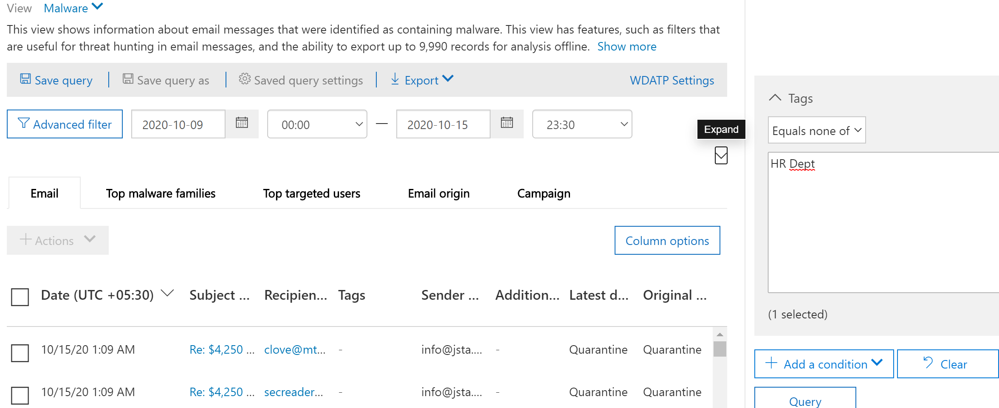

# Обнаружение обозревателя угроз и обнаружения в режиме реального времениThreat Explorer and Real-time detections

**Область применения****Applies to**
- [Microsoft Defender для Office 365 (план 1 и план 2)Microsoft Defender for Office 365 plan 1 and plan 2](defender-for-office-365.md)
- [Microsoft 365 DefenderMicrosoft 365 Defender](../defender/microsoft-365-defender.md)

Если в вашей организации есть microsoft [Defender для Office 365,](defender-for-office-365.md)и у  вас есть необходимые [разрешения,](#required-licenses-and-permissions)у вас есть обнаружения explorer или в режиме реального времени **(ранее** отчеты в режиме реального времени *—* см. [новые!).](#new-features-in-threat-explorer-and-real-time-detections)If your organization has [Microsoft Defender for Office 365](defender-for-office-365.md), and you have the [necessary permissions](#required-licenses-and-permissions), you have either **Explorer** or **Real-time detections** (formerly *Real-time reports* — [see what's new](#new-features-in-threat-explorer-and-real-time-detections)!). В Центре & безопасности перейдите к управлению угрозами, а затем выберите **обнаружение Explorer** _или_ в **режиме реального времени.**In the Security & Compliance Center, go to **Threat management**, and then choose **Explorer** _or_ **Real-time detections**.

 

****

|В Microsoft Defender для Office 365 Plan 2 см.:With Microsoft Defender for Office 365 Plan 2, you see:|В Microsoft Defender для Office 365 1 см.:With Microsoft Defender for Office 365 Plan 1, you see:|
|---|---|
|||
|

Обнаружение explorer или в режиме реального времени помогает группе операций безопасности эффективно исследовать угрозы и реагировать на них.Explorer or Real-time detections helps your security operations team investigate and respond to threats efficiently. Отчет напоминает следующее изображение:The report resembles the following image:

В этом отчете вы можете:With this report, you can:

- [См. вредоносные программы, обнаруженные Microsoft 365 функциями безопасностиSee malware detected by Microsoft 365 security features](#see-malware-detected-in-email-by-technology)
- [Просмотр фишинговых URL-адресов и щелкните данные вердиктаView phishing URL and click verdict data](#view-phishing-url-and-click-verdict-data)
- [Запустите автоматизированный процесс расследования](#start-automated-investigation-and-response) и ответа из представления в Explorer (только defender for Office 365 Plan 2)[Start an automated investigation and response process from a view in Explorer](#start-automated-investigation-and-response) (Defender for Office 365 Plan 2 only)
- [Изучение вредоносных сообщений электронной почты и другихInvestigate malicious email, and more](#more-ways-to-use-explorer-and-real-time-detections)

## Улучшения в области охоты на угрозыImprovements to Threat Hunting Experience

### Введение alert ID для Defender для Office 365 оповещений в explorer/Real-time detectionsIntroduction of Alert ID for Defender for Office 365 alerts within Explorer/Real-time detections

Сегодня при переходе из оповещений в Обозреватель угроз открывается фильтрованный вид в Explorer, а представление фильтруется идентификатором политики оповещения (идентификатор политики является уникальным идентификатором для политики оповещения).Today, if you navigate from an alert to Threat Explorer, it opens a filtered view within the Explorer, with the view filtered by Alert policy ID (policy ID being a unique identifier for an Alert policy).
Мы делаем эту интеграцию более актуальной, введя ID оповещений (см. пример оповещений ниже) в обнаружениях Обозреватель угроз и в режиме реального времени, чтобы вы могли видеть сообщения, соответствующие конкретному оповещению, а также количество электронных сообщений.We are making this integration more relevant by introducing the alert ID (see an example of alert ID below) in Threat Explorer and Real-time detections so that you see messages which are relevant to the specific alert, as well as a count of emails. Вы также сможете увидеть, было ли сообщение частью оповещения, а также перейти от этого сообщения к определенному оповещению.You will also be able to see if a message was part of an alert, as well as navigate from that message to the specific alert.

В URL-адресе доступен ID оповещения при просмотре отдельного оповещения; пример `https://protection.office.com/viewalerts?id=372c9b5b-a6c3-5847-fa00-08d8abb04ef1` .Alert ID is available within the URL when you are viewing an individual alert; an example being `https://protection.office.com/viewalerts?id=372c9b5b-a6c3-5847-fa00-08d8abb04ef1`.

> [!div class="mx-imgBorder"]
> 

> [!div class="mx-imgBorder"]
> 

### Расширение ограничения хранения и поиска данных Explorer (и обнаружения в режиме реального времени) для клиентов пробных периодов с 7 до 30 днейExtending the Explorer (and Real-time detections) data retention and search limit for trial tenants from 7 to 30 days

В рамках этого изменения вы сможете искать и фильтровать данные электронной почты в течение 30 дней (увеличение по сравнению с предыдущими 7 днями) при обнаружении в режиме реального времени обозревателя угроз для обоих клиентов defender для Office P1 и P2 пробных клиентов.As part of this change, you will be able to search for, and filter email data across 30 days (an increase from the previous 7 days) in Threat Explorer/Real-time detections for both Defender for Office P1 and P2 trial tenants.
Это не влияет на клиентов P1 и P2/E5, у которых уже есть 30-дневные возможности хранения данных и поиска.This does not impact any production tenants for both P1 and P2/E5 customers, which already has the 30 day data retention and search capabilities.

### Обновленные ограничения для экспорта записей для обозревателя угрозUpdated limits for Export of records for Threat Explorer

В рамках этого обновления количество строк для записей электронной почты, которые можно экспортировать из Обозревателя угроз, увеличивается с 9990 до 200 000 записей.As part of this update, the number of rows for Email records that can be exported from Threat Explorer is increased from 9990 to 200,000 records. Набор столбцов, которые можно экспортировать в настоящее время, останется тем же, но количество строк увеличится с текущего лимита.The set of columns that can be exported currently will remain the same, but the number of rows will increase from the current limit.

### Теги в обозревателе угрозTags in Threat Explorer

> [!NOTE]
> Функция тегов пользователя находится в *предварительном просмотре,* доступна не всем и подлежит изменениям.The user tags feature is in *Preview*, isn't available to everyone, and is subject to change. Сведения о расписании выпуска ознакомьтесь с Microsoft 365 плана.For information about the release schedule, check out the Microsoft 365 roadmap.

Теги пользователей определяют определенные группы пользователей в Microsoft Defender для Office 365.User tags identify specific groups of users in Microsoft Defender for Office 365. Дополнительные сведения о тегах, включая лицензирование и конфигурацию, см. в [тегах User.](user-tags.md)For more information about tags, including licensing and configuration, see [User tags](user-tags.md).

В Обозревателе угроз можно увидеть сведения о тегах пользователей в следующих действиях.In Threat Explorer, you can see information about user tags in the following experiences.

#### Представление сетки электронной почтыEmail grid view

Столбец **Теги** в сетке электронной почты содержит все теги, которые были применены к почтовым ящикам отправитель или получатель.The **Tags** column in the email grid contains all the tags that have been applied to the sender or recipient mailboxes. По умолчанию сначала показаны системные теги, такие как учетные записи приоритетов.By default, system tags like priority accounts are shown first.

> [!div class="mx-imgBorder"]
> 

#### ФильтрацияFiltering

Теги можно использовать в качестве фильтра.You can use tags as a filter. Охота только на приоритетные учетные записи или определенные сценарии тегов пользователей.Hunt just across priority accounts or specific user tags scenarios. Можно также исключить результаты с определенными тегами.You can also exclude results that have certain tags. Совмещайте эту функцию с другими фильтрами, чтобы сузить область исследования.Combine this functionality with other filters to narrow your scope of investigation.

> [!div class="mx-imgBorder"]
> 

#### Вылет детализации электронной почтыEmail detail flyout

Чтобы просмотреть отдельные теги отправитель и получатель, выберите субъект, чтобы открыть вылет сведений о сообщении.To view the individual tags for sender and recipient, select the subject to open the message details flyout. На **вкладке Сводка** теги отправитель и получатель показаны отдельно, если они присутствуют для электронной почты.On the **Summary** tab, the sender and recipient tags are shown separately, if they're present for an email.
Сведения об отдельных тегах для отправитель и получатель также распространяется на экспортируемую CSV-информацию, где эти сведения можно увидеть в двух отдельных столбцах.The information about individual tags for sender and recipient also extends to exported CSV data, where you can see these details in two separate columns.

> [!div class="mx-imgBorder"]
> 

Сведения о тегах также показаны в вылете url-адресов.Tags information is also shown in the URL clicks flyout. Чтобы просмотреть его, перейдите в просмотр фишинга или все сообщения электронной почты, а затем на **вкладку URL-адрес** или **URL-адрес.** Выберите отдельный флажок URL-адреса, чтобы просмотреть дополнительные сведения о щелчках для этого URL-адреса, включая теги, связанные с этим щелчком.To view it, go to Phish or All Email view and then to the **URLs** or **URL Clicks** tab. Select an individual URL flyout to view additional details about clicks for that URL, including tags associated with that click.

### Обновленное представление Временной шкалыUpdated Timeline View

> [!div class="mx-imgBorder"]
> 
>
Узнайте больше, посмотрев [это](https://www.youtube.com/watch?v=UoVzN0lYbfY&list=PL3ZTgFEc7LystRja2GnDeUFqk44k7-KXf&index=4) видео.Learn more by watching [this video](https://www.youtube.com/watch?v=UoVzN0lYbfY&list=PL3ZTgFEc7LystRja2GnDeUFqk44k7-KXf&index=4).

## Улучшения в области охоты на угрозы (предстоящие)Improvements to the threat hunting experience (upcoming)

### Обновленные сведения об угрозах для электронной почтыUpdated threat information for emails

Мы уделяем основное внимание улучшениям платформы и качества данных, чтобы повысить точность и согласованность данных для записей электронной почты.We've focused on platform and data-quality improvements to increase data accuracy and consistency for email records. Улучшения включают объединение сведений о предварительной доставке и после доставки, например действий, выполненных по электронной почте в рамках процесса ZAP, в одну запись.Improvements include consolidation of pre-delivery and post-delivery information, such as actions executed on an email as part of the ZAP process, into a single record. Кроме того, в список включены дополнительные сведения, такие как вердикт о нежелательной почте, угрозы на уровне сущности (например, вредоносный URL-адрес), а также последние расположения доставки.Additional details like spam verdict, entity-level threats (for example, which URL was malicious), and latest delivery locations are also included.

После этих обновлений вы увидите одну запись для каждого сообщения, независимо от различных событий после доставки, которые влияют на сообщение.After these updates, you'll see a single entry for each message, regardless of the different post-delivery events that affect the message. Действия могут включать ZAP, ручное исправление (что означает действие администратора), динамическую доставку и так далее.Actions can include ZAP, manual remediation (which means admin action), dynamic delivery, and so on.

В дополнение к показу вредоносных программ и фишинговых угроз, вы видите вердикт о нежелательной почте, связанный с электронной почтой.In addition to showing malware and phishing threats, you see the spam verdict associated with an email. В сообщении электронной почты см. все угрозы, связанные с электронной почтой, а также соответствующие технологии обнаружения.Within the email, see all the threats associated with the email along with the corresponding detection technologies. Электронная почта может иметь ноль, одну или несколько угроз.An email can have zero, one, or multiple threats. Текущие угрозы см. в разделе **Подробные** сведения о вылете электронной почты.You'll see the current threats in the **Details** section of the email flyout. Для нескольких угроз (например, вредоносных программ и фишинга) техническое поле **Detection** показывает сопоставление обнаружения угроз, которое является технологией обнаружения, которая идентифицировала угрозу.For multiple threats (such as malware and phishing), the **Detection tech** field shows the threat-detection mapping, which is the detection technology that identified the threat.

Набор технологий обнаружения теперь включает новые методы обнаружения, а также технологии обнаружения нежелательной почты.The set of detection technologies now includes new detection methods, as well as spam-detection technologies. Вы можете использовать один и тот же набор технологий обнаружения для фильтрации результатов в различных представлениях электронной почты (Malware, Phish, All Email).You can use the same set of detection technologies to filter the results across the different email views (Malware, Phish, All Email).

> [!NOTE]
> Анализ вердикта не обязательно должен быть привязан к сущностям.Verdict analysis might not necessarily be tied to entities. Например, сообщение электронной почты можно классифицировать как фишинг или спам, но нет URL-адресов, которые были бы штампуются с помощью вердикта о фишинге и нежелательной почте.As an example, an email might be classified as phish or spam, but there are no URLs that are stamped with a phish/spam verdict. Это потому, что фильтры также оценивают содержимое и другие сведения для электронной почты перед назначением вердикта.This is because the filters also evaluate content and other details for an email before assigning a verdict.

#### Угрозы в URL-адресахThreats in URLs

Теперь вы можете увидеть конкретную угрозу URL-адреса на вкладке Сведения о **вылете электронной** почты. Угрозой могут быть *вредоносные программы,* *фишинг,* *спам* или *нет*.)You can now see the specific threat for a URL on the email flyout **Details** tab. The threat can be *malware*, *phish*, *spam*, or *none*.)

> [!div class="mx-imgBorder"]
> 

### Обновленное представление временной шкалы (предстоящий)Updated timeline view (upcoming)

> [!div class="mx-imgBorder"]
> 

Представление Timeline определяет все события доставки и после доставки.Timeline view identifies all delivery and post-delivery events. Она включает сведения об угрозе, которая была обнаружена в тот момент для подмножество этих событий.It includes information about the threat identified at that point of time for a subset of these events. В представлении Timeline также содержится информация о любых дополнительных действиях (таких как zaP или ручное исправление), а также о результатах этого действия.Timeline view also provides information about any additional action taken (such as ZAP or manual remediation), along with the result of that action. Сведения о представлении временной шкалы включают в себя:Timeline view information includes:

- **Источник:** Источник события.**Source:** Source of the event. Это может быть администратор/система/пользователь.It can be admin/system/user.
- **Событие:** Включает события верхнего уровня, такие как исходная доставка, исправление вручную, ZAP, отправка и динамическая доставка.**Event:** Includes top-level events like original delivery, manual remediation, ZAP, submissions, and dynamic delivery.
- **Действие:** Конкретное действие, которое было принято в рамках действия ZAP или администратора (например, мягкое удаление).**Action:** The specific action that was taken either as part of ZAP or admin action (for example, soft delete).
- **Угрозы:** Покрывает угрозы (вредоносные программы, фишинг, спам), выявленные на данный момент времени.**Threats:** Covers the threats (malware, phish, spam) identified at that point of time.
- **Результат/сведения:** Дополнительные сведения о результате действия, например о том, было ли оно выполнено в рамках действия ZAP/admin.**Result/Details:** More information about the result of the action, such as whether it was performed as part of ZAP/admin action.

### Исходное и последнее расположение доставкиOriginal and latest delivery location

В настоящее время мы видим расположение доставки в сетке электронной почты и вылете электронной почты.Currently, we surface delivery location in the email grid and email flyout. Поле **расположения доставки** становится переименованным в **_исходное расположение_ доставки *_. И мы представляем другое поле, _ последнее*_расположение доставки_**.The **Delivery location** field is getting renamed **_Original delivery location_*_. And we're introducing another field, _*_Latest delivery location_**.

**Исходное расположение доставки** даст дополнительные сведения о том, где было доставлено письмо изначально.**Original delivery location** will give more information about where an email was delivered initially. **В последнем расположении** доставки будет заявно, где после системных действий, таких как *действия ZAP* или администратора, например *Move to deleted items,* сообщение электронной почты было отправлено.**Latest delivery location** will state where an email landed after system actions like *ZAP* or admin actions like *Move to deleted items*. Последнее расположение доставки предназначено для того, чтобы сообщить администраторам последнее известное расположение сообщения после доставки или любые действия системы или администратора.Latest delivery location is intended to tell admins the message's last-known location post-delivery or any system/admin actions. В нем не содержатся действия конечных пользователей по электронной почте.It doesn't include any end-user actions on the email. Например, если пользователь удалил сообщение или переместил сообщение в архив/pst, расположение "доставка" сообщения не будет обновлено.For example, if a user deleted a message or moved the message to archive/pst, the message "delivery" location won't be updated. Но если системное действие обновило расположение (например, ZAP в результате перехода  электронной почты на карантин), последнее расположение доставки будет показываться как "карантин".But if a system action updated the location (for example, ZAP resulting in an email moving to quarantine), **Latest delivery location** would show as "quarantine."

> [!div class="mx-imgBorder"]
> 

> [!NOTE]
> Существует несколько случаев, когда расположение **доставки** и **действие Delivery могут** демонстрироваться как "неизвестные":There are a few cases where **Delivery location** and **Delivery action** may show as "unknown":
>
> - При доставке сообщения расположение доставки  может быть "доставлено" и "неизвестно", но правило "Входящие" переместило сообщение в папку по умолчанию (например, в Draft или Archive), а не в папку "Входящие" или "Нежелательной почты". You might see **Delivery location** as "delivered" and **Delivery location** as "unknown" if the message was delivered, but an Inbox rule moved the message to a default folder (such as Draft or Archive) instead of to the Inbox or Junk Email folder.
>
> - **Последнее расположение доставки** может быть неизвестно, было ли предпринята попытка действия администратора или системы (например, ZAP), но сообщение не было найдено.**Latest delivery location** can be unknown if an admin/system action (such as ZAP) was attempted, but the message wasn't found. Обычно действие происходит после того, как пользователь переместил или удалил сообщение.Typically, the action happens after the user  moved or deleted the message. В таких случаях проверьте **столбец Result/Details** в представлении временной шкалы.In such cases, verify the **Result/Details** column in timeline view. Посмотрите на заявление "Сообщение перемещено или удалено пользователем".Look for the statement "Message moved or deleted by the user."

> [!div class="mx-imgBorder"]
> 

### Дополнительные действияAdditional actions

*Дополнительные действия* были применены после доставки электронной почты.*Additional actions* were applied after delivery of the email. Они могут включать  *ZAP,* ручное исправление (действия, принятые администратором, такие как мягкое *удаление),* динамическая доставка и обработка *(для* электронной почты, которая была обнаружена задним числом как хорошая).They can include *ZAP*, *manual remediation* (action taken by an Admin such as soft delete), *dynamic delivery*, and *reprocessed* (for an email that was retroactively detected as good).

> [!NOTE]
> В рамках ожидающих изменений значение "Removed by ZAP", в настоящее время всплыть в фильтре Действия доставки, удаляется.As part of the pending changes, the "Removed by ZAP" value currently surfaced in the Delivery Action filter is going away. У вас будет способ поиска всех сообщений электронной почты с помощью попытки ZAP с помощью **дополнительных действий.**You'll have a way to search for all email with the ZAP attempt through **Additional actions**.

> [!div class="mx-imgBorder"]
> 

### Переопределения системыSystem overrides

*Переопределения* системы позволяют делать исключения из предназначенного расположения доставки сообщения.*System overrides* enable you to make exceptions to the intended delivery location of a message. Расположение доставки, предоставляемого системой, переопределяется в зависимости от угроз и других обнаружений, выявленных стеком фильтрации.You override the delivery location provided by the system, based on the threats and other detections identified by the filtering stack. Переопределения системы могут быть заданы через политику клиента или пользователя для доставки сообщения, как это предложено политикой.System overrides can be set through tenant or user policy to deliver the message as suggested by the policy. Переопределения могут определять непреднамеренные доставки вредоносных сообщений из-за пробелов в конфигурациях, таких как чрезмерно широкая политика Сейф отправитель, заданная пользователем.Overrides can identify unintentional delivery of malicious messages due to configurations gaps, such as an overly broad Safe Sender policy set by a user. Эти переопределяемые значения могут быть:These override values can be:

- Разрешено политикой пользователя. Пользователь создает политики на уровне почтовых ящиков, чтобы разрешить домены или отправителей.Allowed by user policy: A user creates policies at the mailbox level to allows domains or senders.

- Заблокировано политикой пользователя: пользователь создает политики на уровне почтовых ящиков для блокировки доменов или отправителей.Blocked by user policy: A user creates policies at the mail box level to block domains or senders.

- Разрешено политикой организации. Группы безопасности организации устанавливают политики или правила потока Exchange (также известные как правила транспорта), чтобы разрешить отправителям и доменам пользователей в их организации.Allowed by org policy: The organization's security teams set policies or Exchange mail flow rules (also known as transport rules) to allow senders and domains for users in their organization. Это может быть для набора пользователей или всей организации.This can be for a set of users or the entire organization.

- Заблокировано политикой организации: группы безопасности организации устанавливают политики или правила потока почты, чтобы блокировать отправителей, домены, языки сообщений или исходные ИП для пользователей в их организации.Blocked by org policy: The organization's security teams set policies or mail flow rules to block senders, domains, message languages, or source IPs for users in their organization. Это может быть применено к набору пользователей или всей организации.This can be applied to a set of users or the entire organization.

- Расширение файлов, заблокированное политикой организации: группа безопасности организации блокирует расширение имени файла с помощью параметров политики защиты от вредоносных программ.File extension blocked by org policy: An organization's security team blocks a file name extension through the anti-malware policy settings. Эти значения теперь будут отображаться в сведениях электронной почты, чтобы помочь в расследованиях.These values will now be displayed in email details to help with investigations. Команды Secops также могут использовать функцию фильтрации с богатыми возможностями для фильтрации заблокированных расширений файлов.Secops teams can also use the rich-filtering capability to filter on blocked file extensions.

> [!div class="mx-imgBorder"]
> 

### Улучшения для работы с URL-адресом и щелчкамиImprovements for the URL and clicks experience

Улучшения включают в себя:The improvements include:

- Показать полный щелкнув URL-адрес (в том числе все параметры запроса, которые являются частью URL-адреса) в разделе **Щелчки** в флажок URL-адрес.Show the full clicked URL (including any query parameters that are part of the URL) in the **Clicks** section of the URL flyout. В настоящее время домен URL-адреса и путь отображаются в панели заголовков.Currently, the URL domain and path appear in the title bar. Мы расширяем эту информацию, чтобы показать полный URL-адрес.We're extending that information to show the full URL.

- Исправление фильтров URL-адресов *(URL-адрес* и URL-адрес, а также URL-адрес домена и *пути):* Обновления влияют на поиск сообщений, содержащих URL-адрес и нажмите кнопку вердикт. Fixes across URL filters (*URL* versus *URL domain* versus *URL domain and path*): The updates affect searching for messages that contain a URL/click verdict. Мы включили поддержку для протокольного агностика поиска, поэтому вы можете искать URL-адрес без использования `http` .We enabled support for protocol-agnostic searches, so you can search for a URL without using `http`. По умолчанию url-карты поиска для http, если явно не указано другое значение.By default, the URL search maps to http, unless another value is explicitly specified. Например:For example:
  - Поиск с префиксом и без него в полях `http://` **фильтрации** URL-адресов, **URL-адресов** и **URL-адресов.**Search with and without the `http://` prefix in the **URL**, **URL Domain**, and **URL Domain and Path** filter fields. Результаты поиска должны быть одинаковыми.The searches should show the same results.
  - Поиск `https://` префикса в **URL-адресе.**Search for the `https://` prefix in **URL**. Если значение не задано, `http://` префикс предполагается.When no value is specified, the `http://` prefix is assumed.
  - `/`игнорируется в начале и конце пути **URL-адресов,** **URL-адресов,** **URL-адресов и полей путей.**`/` is ignored at the beginning and end of the **URL path**, **URL Domain**, **URL domain and path** fields. `/` в конце поля **URL-адрес** игнорируется.`/` at the end of the **URL** field is ignored.

### Уровень доверия к фишингуPhish confidence level

Уровень уверенности в фишинге помогает определить степень уверенности, с которой электронное письмо было классифицируются как "фишинг".Phish confidence level helps identify the degree of confidence with which an email was categorized as "phish." Два возможных значения : *High* и *Normal*.The two possible values are *High* and *Normal*. На начальных стадиях этот фильтр будет доступен только в представлении Phish обозревателя угроз.In the initial stages, this filter will be available only in the Phish view of Threat Explorer.

### СИГНАЛ URL-адреса ZAPZAP URL signal

Url-сигнал ZAP обычно используется для сценариев оповещения о фишинге ZAP, в которых сообщение электронной почты было идентифицировано как Фишинг и удалено после доставки.The ZAP URL signal is typically used for ZAP Phish alert scenarios where an email was identified as Phish and removed after delivery. Этот сигнал соединяет оповещение с соответствующими результатами в Explorer.This signal connects the alert with the corresponding results in Explorer. Это один из IOCs для оповещения.It's one of the IOCs for the alert.

Чтобы улучшить процесс охоты, мы обновили обнаружение обозревателя угроз и в режиме реального времени, чтобы сделать процесс охоты более последовательным.To improve the hunting process, we've updated Threat Explorer and Real-time detections to make the hunting experience more consistent. Изменения описаны здесь:The changes are outlined here:

- [Улучшения в поясе времениTimezone improvements](#timezone-improvements)
- [Обновление в процессе обновленияUpdate in the refresh process](#update-in-the-refresh-process)
- [Сверла диаграммы, чтобы добавить к фильтрамChart drilldown to add to filters](#chart-drilldown-to-add-to-filters)
- [В обновлениях сведений о продуктеIn product information updates](#in-product-information-updates)

### Фильтр по тегам пользователейFilter by user tags

Теперь можно сортировать и фильтровать системные или настраиваемые теги пользователей, чтобы быстро понять область угроз.You can now sort and filter on system or custom user tags to quickly grasp the scope of threats. Дополнительные данные см. [в тегах пользователей.](user-tags.md)To learn more, see [User tags](user-tags.md).

> [!IMPORTANT]
> Фильтрация и сортировка по тегам пользователей в настоящее время находятся в режиме предварительного просмотра.Filtering and sorting by user tags is currently in public preview. Эта функция может быть существенно изменена до ее коммерческого выпуска.This functionality may be substantially modified before it's commercially released. Корпорация Майкрософт не предоставляет никаких гарантий, не выражая или подразумевая, в отношении сведений, предоставленных о нем.Microsoft makes no warranties, express or implied, with respect to the information provided about it.

> [!div class="mx-imgBorder"]
> 

### Улучшения в поясе времениTimezone improvements

Вы увидите часовой пояс для записей электронной почты на портале, а также для экспортных данных.You'll see the time zone for the email records in the Portal as well as for Exported data. Он будет виден во всех событиях, таких как сетка электронной почты, вылет подробных сведений, хронология электронной почты и аналогичные сообщения электронной почты, поэтому часовой пояс для набора результатов понятен.It will be visible across experiences like Email Grid, Details flyout, Email Timeline, and Similar Emails, so the time zone for the result set is clear.

> [!div class="mx-imgBorder"]
> 

### Обновление в процессе обновленияUpdate in the refresh process

Некоторые пользователи прокомментировали путаницу с автоматическим обновлением (например, как только вы измените дату, страница обновляется) и ручным обновлением (для других фильтров).Some users have commented about confusion with automatic refresh (for example, as soon as you change the date, the page refreshes) and manual refresh (for other filters). Аналогичным образом удаление фильтров приводит к автоматическому обновлению.Similarly, removing filters leads to automatic refresh. Изменение фильтров при изменении запроса может привести к непоследовательному опытом поиска.Changing filters while modifying the query can cause inconsistent search experiences. Чтобы устранить эти проблемы, мы переходим к механизму ручного фильтрации.To resolve these issues, we're moving to a manual-filtering mechanism.

С точки зрения опыта пользователь может применить и удалить различные диапазоны фильтров (от набора фильтров и даты) и выбрать кнопку обновления для фильтрации результатов после определения запроса.From an experience standpoint, the user can apply and remove the different range of filters (from the filter set and date) and select the refresh button to filter the results after they've defined the query. Кнопка обновления также теперь подчеркивается на экране.The refresh button is also now emphasized on the screen. Мы также обновили соответствующие инструменты и документацию по продуктам.We've also updated the related tooltips and in-product documentation.

> [!div class="mx-imgBorder"]
> 

### Сверла диаграммы, чтобы добавить к фильтрамChart drilldown to add to filters

Теперь можно наметить значения легенды, чтобы добавить их в качестве фильтров.You can now chart legend values to add them as filters. Выберите **кнопку Обновить** для фильтрации результатов.Select the **Refresh** button to filter the results.

> [!div class="mx-imgBorder"]
> 

### Обновления информации в продуктеIn-product information updates

Дополнительные сведения теперь доступны в продукте, например общее количество результатов поиска в сетке (см. ниже).Additional details are now available within the product, such as the total number of search results within the grid (see below). Мы улучшили метки, сообщения об ошибках и инструменты, чтобы предоставить дополнительные сведения о фильтрах, опыте поиска и наборе результатов.We've improved labels, error messages, and tooltips to provide more information about the filters, search experience, and result set.

> [!div class="mx-imgBorder"]
> 

## Расширенные возможности в Обозревателе угрозExtended capabilities in Threat Explorer

### Лучшие целевые пользователиTop targeted users

Сегодня мы обналичим список наиболее целевых пользователей в представлении вредоносных программ для электронной почты в разделе **Топ семей вредоносных программ.**Today we expose the list of the top targeted users in the Malware view for emails, in the **Top Malware Families** section. Мы также расширим это представление в представлениях Фишинг и Все сообщения электронной почты.We'll be extending this view in the Phish and All Email views as well. Вы сможете просмотреть топ-5 целевых пользователей, а также количество попыток для каждого пользователя для соответствующего представления.You'll be able to see the top-five targeted users, along with the number of attempts for each user for the corresponding view. Например, в представлении Phish вы увидите число попыток фишинга.For example, for Phish view, you'll see the number of Phish attempts.

Вы сможете экспортировать список целевых пользователей до 3000, а также количество попыток автономного анализа для каждого представления электронной почты.You'll be able to export the list of targeted users, up to a limit of 3,000, along with the number of attempts for offline analysis for each email view. Кроме того, при выборе количества попыток (например, 13 попыток на изображении ниже) откроется фильтрованное представление в Обозревателе угроз, чтобы вы могли просмотреть дополнительные сведения по электронным письмам и угрозам для этого пользователя.In addition, selecting the number of attempts (for example, 13 attempts in the image below) will open a filtered view in Threat Explorer, so you can see more details across emails and threats for that user.

> [!div class="mx-imgBorder"]
> 

### Exchange правила транспортаExchange transport rules

В рамках обогащения данных вы сможете увидеть все различные правила транспорта Exchange(ETR), которые были применены к сообщению.As part of data enrichment, you'll be able to see all the different Exchange transport rules (ETR) that were applied to a message. Эти сведения будут доступны в представлении сетки электронной почты.This information will be available in the Email grid view. Чтобы просмотреть его, выберите **параметры Column** в сетке, а затем **добавьте Exchange правила** транспорта из столбцов.To view it,  select **Column options** in the grid and then **Add Exchange Transport Rule** from the column options. Он также будет виден на **флаауте Details** в электронной почте.It will also be visible on the **Details** flyout in the email.

Вы сможете увидеть как GUID, так и имя правил транспорта, примененных к сообщению.You'll be able to see both the GUID and the name of the transport rules that were applied to the message. Вы сможете искать сообщения с помощью имени правила транспорта.You'll be able to search for the messages by using the name of the transport rule. Это поиск "Содержит", который означает, что вы также можете делать частичные поиски.This is a "Contains" search, which means you can do partial searches as well.

> [!IMPORTANT]
> Поиск etr и доступность имен зависят от конкретной роли, назначенной вам.ETR search and name availability depend on the specific role that's assigned to you. Для просмотра имен и поиска etr необходимо иметь одну из следующих ролей/разрешений.You need to have one of the following roles/permissions to view the ETR names and search. Если вам не назначены какие-либо из этих ролей, вы не можете видеть имена правил транспорта или искать сообщения с помощью имен ETR.If you don't have any of these roles assigned to you, you can't see the names of the transport rules or search for messages by using ETR names. Однако в сведениях электронной почты можно увидеть метку ETR и сведения GUID.However, you could see the ETR label and GUID information in the Email Details. Другие опытом просмотра записей в сетках электронной почты, вылеты электронной почты, фильтры и экспорт не затронуты.Other record-viewing experiences in Email Grids, Email flyouts, Filters, and Export are not affected.
>
> - Только EXO — предотвращение потери данных: всеEXO Only - Data Loss Prevention: All
> - Только EXO — O365SupportViewConfig: ВсеEXO Only - O365SupportViewConfig: All
> - Microsoft Azure Active Directory EXO — администратор безопасности: всеMicrosoft Azure Active Directory or EXO - Security Admin: All
> - AAD или EXO — считыватель безопасности: всеAAD or EXO - Security Reader: All
> - Только EXO — правила транспорта: всеEXO Only - Transport Rules: All
> - Только EXO — View-Only конфигурация: всеEXO Only - View-Only Configuration: All
>
> В сетке электронной почты, вылете Подробные сведения и экспортируемом CSV etRs представлены с именем/GUID, как показано ниже.Within the email grid, Details flyout, and Exported CSV, the ETRs are presented with a Name/GUID as shown below.
>
> > [!div class="mx-imgBorder"]
> > 

### Входящие соединителиInbound connectors

Соединители — это набор инструкций, которые настраивают потоки электронной почты в вашу Microsoft 365 или Office 365 организацию.Connectors are a collection of instructions that customize how your email flows to and from your Microsoft 365 or Office 365 organization. Они позволяют применять любые ограничения безопасности или элементы управления.They enable you to apply any security restrictions or controls. В Обозревателе угроз теперь можно просматривать соединители, связанные с электронной почтой, и искать сообщения с помощью имен соединитеителей.Within Threat Explorer, you can now view the connectors that are related to an email and search for emails by using connector names.

Поиск соединители "содержит" в природе, что означает, что частичный поиск ключевых слов также должен работать.The search for connectors is "contains" in nature, which means partial keyword searches should work as well. В представлении главной сетки, вылете Details и экспортируемом CSV соединители показаны в формате Name/GUID, как показано здесь:Within the Main grid view, the Details flyout, and the Exported CSV, the connectors are shown in the Name/GUID format as shown here:

> [!div class="mx-imgBorder"]
> 

## Новые функции в области обнаружения и обнаружения угроз в режиме реального времениNew features in Threat Explorer and Real-time detections

- [Просмотр фишинговых сообщений электронной почты, отосланных обезличенным пользователям и доменамView phishing emails sent to impersonated users and domains](#view-phishing-emails-sent-to-impersonated-users-and-domains)
- [Просмотр заголовки электронной почты и загрузка тела электронной почтыPreview email header and download email body](#preview-email-header-and-download-email-body)
- [Шкала электронной почтыEmail timeline](#email-timeline)
- [Экспорт URL-адреса щелкните данныеExport URL click data](#export-url-click-data)

### Просмотр фишинговых сообщений электронной почты, отосланных обезличенным пользователям и доменамView phishing emails sent to impersonated users and domains

Для выявления попыток фишинга в отношении пользователей и доменов, которые являются вымыщенными пользователями, необходимо добавить в список пользователей для *защиты.*To identify phishing attempts against users and domains that are impersonated users must be added to the list of *Users to protect*. Для доменов администраторы должны либо включить *домены Организации,* либо добавить доменное имя в *домены для защиты.*For domains, admins must either enable *Organization domains*, or add a domain name to *Domains to protect*. Защищаемые домены находятся на странице *политики* защиты от фишинга в разделе *Impersonation.*The domains to protect are found on the *Anti-Phishing policy page* in the *Impersonation* section.

Чтобы просмотреть фишинговые сообщения и найти обезличенных пользователей или доменов, используйте представление [> Phish](threat-explorer-views.md) Explorer.To review phish messages and search for impersonated users or domains, use the [Email > Phish view](threat-explorer-views.md) of Explorer.

В этом примере используется обозреватель угроз.This example uses Threat Explorer.

1. В Центре [&](https://protection.office.com) безопасности (выберите управление угрозами > Explorer (или обнаружение в https://protection.office.com) режиме реального времени).In the [Security & Compliance Center](https://protection.office.com) (https://protection.office.com), choose Threat management > Explorer (or Real-time detections).

2. В меню Просмотр выберите адрес электронной почты > Фишинг.In the View menu, choose Email > Phish.

   Здесь вы можете выбрать **вымысенный домен или** **вымысли пользователя**.Here you can choose **impersonated domain** or **impersonated user**.

3. **ЛИБО** выберите **обезличенный домен,** а затем введите защищенный домен в текстовом ящике.**EITHER** select **Impersonated domain**, and then type a protected domain in the textbox.

   Например, поиск защищенных доменных имен, таких как *contoso,* *contoso.com* или *contoso.com.au.*For example, search for protected domain names like *contoso*, *contoso.com*, or *contoso.com.au*.

4. Выберите тему любого сообщения в вкладке Email > подробные сведения, чтобы увидеть дополнительные сведения о обезличеженном домене или обнаруженном расположении.Select the Subject of any message under the Email tab > Details tab to see additional impersonation information like Impersonated Domain / Detected location.

    **OR****OR**

    Выберите **обезличенный пользователь** и введите защищенный адрес электронной почты в текстовом ящике.Select **Impersonated user** and type a protected user's email address in the textbox.

    > [!TIP]
    > **Для наилучших результатов** используйте *полные адреса электронной почты* для поиска защищенных пользователей.**For best results**, use *full email addresses* to search protected users. Вы найдете защищенного пользователя быстрее и успешнее, если вы firstname.lastname@contoso.com, *например,* при расследовании вымыкания пользователя.You will find your protected user quicker and more successfully if you search for *firstname.lastname@contoso.com*, for example, when investigating user impersonation. При поиске защищенного домена поиск будет принимать корневой домен (например contoso.com) и доменное имя *(contoso).*When searching for a protected domain the search will take the root domain (contoso.com, for example), and the domain name (*contoso*). Поиск корневого *домена contoso.com* возвращает как contoso.com,  так и *contoso доменного имени.*Searching for the root domain *contoso.com* will return both impersonations of *contoso.com* and the domain name *contoso*.

5. Выберите тему **любого** сообщения в вкладке Сведения о вкладке **Электронной** почты, чтобы увидеть дополнительные сведения о пользователе или домене  >   и *обнаруженном расположении.*Select the **Subject** of any message under **Email tab** > **Details tab** to see additional impersonation information about the user or domain, and the *Detected location*.

    :::image type="content" source="../../media/threat-ex-views-impersonated-user-image.png" alt-text="Обозреватель угроз подробно представляет для защищенного пользователя расположение обнаружения и обнаруженную угрозу (здесь фишинговое вымысление пользователя).":::

> [!NOTE]
> На шаге 3 или 5, если вы выбираете технологию обнаружения и выберите домен Impersonation или  пользователя **Impersonation** соответственно, сведения в вкладке Сведения электронной почты о пользователе или домене и обнаруженном расположении будут показаны только на сообщениях, связанных с пользователем или доменом, перечисленным на странице политики защиты от   >   фишинга.  In step 3 or 5, if you choose **Detection Technology** and select **Impersonation domain** or **Impersonation user** respectively, the information in the **Email tab** > **Details tab** about the user or domain, and the *Detected location* will be shown only on the messages that are related to the user or domain listed on the *Anti-Phishing policy* page.

### Просмотр заголовки электронной почты и загрузка тела электронной почтыPreview email header and download email body

Теперь вы можете просмотреть заголовок электронной почты и скачать тело электронной почты в Обозревателе угроз.You can now preview an email header and download the email body in Threat Explorer. Администраторы могут анализировать загруженные загона или сообщения электронной почты на угрозы.Admins can analyze downloaded headers/email messages for threats. Поскольку загрузка сообщений электронной почты может привести к риску воздействия информации, этот процесс контролируется управлением доступом на основе ролей (RBAC).Because downloading email messages can risk exposure of information, this process is controlled by role-based access control (RBAC). Чтобы предоставить возможность скачивать сообщения во всех сообщениях электронной почты, в другую группу ролей (например, в службу безопасности или администратор безопасности) должна быть добавлена новая роль Preview.A new role, *Preview*, must be added to another role group (such as Security Operations or Security Administrator) to grant the ability to download mails in all-email messages view. Однако просмотр загона электронной почты не требует дополнительных ролей (кроме того, что требуется для просмотра сообщений в Обозревателе угроз).However, viewing the email header does not require any additional role (other than what is required to view messages in Threat Explorer).

Обнаружение explorer и в режиме реального времени также получит новые поля, которые предоставляют более полное представление о том, где приземлились сообщения электронной почты.Explorer and Real-time detections will also get new fields that provide a more complete picture of where your email messages land. Эти изменения упрощают охоту в службах безопасности.These changes  make hunting easier for Security Ops. Но главным результатом является то, что вы можете узнать расположение проблемных сообщений электронной почты с первого взгляда.But the main result is you can know the location of problem email messages at a glance.

Как это сделать?How is this done? Теперь состояние доставки разбито на два столбца:Delivery status is now broken out into two columns:

- **Действие доставки** — состояние электронной почты.**Delivery action** - Status of the email.
- **Расположение доставки** . Где была отправлена электронная почта.**Delivery location** - Where the email was routed.

*Действие доставки* — это действие, принятое по электронной почте в связи с существующими политиками или обнаружениями.*Delivery action* is the action taken on an email due to existing policies or detections. Вот возможные действия для электронной почты:Here are the possible actions for an email:

 

****

|ДоставленоDelivered|JunkedJunked|ЗаблокированоBlocked|ЗамененоReplaced|
|---|---|---|---|
|Электронная почта была доставлена в папку или папку пользователя, и пользователь может получить к ней доступ.Email was delivered to the inbox or folder of a user, and the user can access it.|Электронная почта была отправлена в папку Нежелательной или Удаленная, и пользователь может получить к ней доступ.Email was sent to the user's Junk  or Deleted folder, and the user can access it.|Сообщения электронной почты, которые находятся на карантине, которые не удалось или были отброшены.Emails that are quarantined, that failed, or were dropped. Эти сообщения недоступны пользователю.These mails are inaccessible to the user.|В электронной почте вредоносные вложения .txt файлами, в которые вложено вредоносное.Email had malicious attachments replaced by .txt files that state the attachment was malicious.|
|

Вот что пользователь может и не может видеть:Here is what the user can and can't see:

 

****

|Доступные конечным пользователямAccessible to end users|Недоступные для конечных пользователейInaccessible to end users|
|---|---|
|ДоставленоDelivered|ЗаблокированоBlocked|
|JunkedJunked|ЗамененоReplaced|
|

**Расположение доставки** показывает результаты политик и обнаружения, которые запускают после доставки.**Delivery location** shows the results of policies and detections that run post-delivery. Это связано с **_действием Delivery._**It's linked to **_Delivery action_**. Это возможные значения:These are the possible values:

- *Папка "Входящие"* или "Папка": электронная почта находится в папке "Входящие" или "Папка" (в соответствии с правилами электронной почты).*Inbox or folder*: The email is in the inbox or a folder (according to your email rules).
- *On-prem или external.* Почтовый ящик не существует в облаке, но находится на локальном сервере.*On-prem or external*: The mailbox doesn't exist on cloud but is on-premises.
- *Нежелательной папки:* электронная почта находится в нежелательной папке пользователя.*Junk folder*: The email is in a user's Junk folder.
- *Папка удаленных элементов:* электронная почта в папке удаленных элементов пользователя.*Deleted items folder*: The email in a user's Deleted items folder.
- *Карантин.* Электронная почта находится в карантине, а не в почтовом ящике пользователя.*Quarantine*: The email is in quarantine and not in a user's mailbox.
- *Не удалось:* сообщение не удалось достичь почтового ящика.*Failed*: The email failed to reach the mailbox.
- *Сброс:* сообщение потерялось где-то в потоке почты.*Dropped*: The email got lost somewhere in the mail flow.

### Шкала электронной почтыEmail timeline

Временная **шкала** электронной почты — это новая функция Explorer, которая улучшает возможности охоты для администраторов.The **Email timeline** is a new Explorer feature that improves the hunting experience for admins. Это сокращает время, затраченное на проверку различных местоположений, чтобы попытаться понять событие.It cuts the time spent checking different locations to try to understand the event. Когда несколько событий происходят в одно и то же время при прибытии электронной почты, эти события отображаются в представлении временной шкалы.When multiple events happen at or close to the same time an email arrives, those events are displayed in a timeline view. Некоторые события, которые происходят с вашей почтой после доставки, запечатлены в столбце **Специальный действий.**Some events that happen to your email post-delivery are captured in the **Special action** column. Администраторы могут комбинировать сведения из временной шкалы с специальными действиями, принятыми в почтовой почте после доставки, чтобы получить представление о том, как работают их политики, где была окончательно отправлена почта, а в некоторых случаях — о том, какой была окончательная оценка.Admins can combine  information from the timeline with the special action taken on the mail post-delivery to get insight into how their policies work, where the mail was finally routed, and, in some cases, what the final assessment was.

Дополнительные сведения см. в [сообщении Investigate and remediate malicious email,](investigate-malicious-email-that-was-delivered.md)которое было доставлено в Office 365.For more information, see [Investigate and remediate malicious email that was delivered in Office 365](investigate-malicious-email-that-was-delivered.md).

### Экспорт URL-адреса щелкните данныеExport URL click data

Теперь можно экспортировать отчеты для щелчков URL Microsoft Excel  чтобы просмотреть их сетевой ИД сообщения и нажать **вердикт,** который помогает объяснить, откуда появился трафик нажатием URL-адреса.You can now export reports for URL clicks to Microsoft Excel to view their **network message ID** and **click verdict**, which helps explain where your URL click traffic originated. Вот как это работает: в области управления угрозами Office 365 панели быстрого запуска следуйте этой цепочке:Here's how it works: In Threat Management on the Office 365 quick-launch bar, follow this chain:

**Обозреватель** \> **Просмотр фишинга** \> **Щелчки** \> **Верхние URL-адреса** **или URL-адреса выберите** \> любую запись, чтобы открыть флажок URL-адреса.**Explorer** \> **View Phish** \> **Clicks** \> **Top URLs** or **URL Top Clicks** \> select any record to open the URL flyout.

При выборе URL-адреса в списке на  панели вылетов будет указана новая кнопка Экспорт.When you select a URL in the list, you'll see a new **Export** button on the fly-out panel. Используйте эту кнопку, чтобы переместить данные в Excel таблицу для упростить отчеты.Use this button to move data to an Excel spreadsheet for easier reporting.

Следуйте этому пути, чтобы добраться до того же расположения в отчете о обнаружениях в режиме реального времени:Follow this path to get to the same location in the Real-time detections report:

**Обозреватель** \> **Обнаружение в режиме реального времени** \> **Просмотр фишинга** \> **URL-адреса** \> **Верхние URL-адреса** или **верхние щелчки** выберите любую запись, чтобы открыть флажок URL-адреса, перейдите \> на \> вкладку **Clicks.****Explorer** \> **Real-time detections** \> **View Phish** \> **URLs** \> **Top URLs** or **Top Clicks** \> Select any record to open the URL flyout \> navigate to the **Clicks** tab.

> [!TIP]
> В сетевом ID-сообщении при поиске по ID через Explorer или связанных сторонних средствах щелкните кнопку назад к определенным почтовым ящикам.The Network Message ID maps the click back to specific mails when you search on the ID through Explorer or associated third-party tools. Такие поиски определяют сообщение электронной почты, связанное с результатом щелчка мыши.Such searches identify the email associated with a click result. Более быстрый и мощный анализ позволяет быстрее и мощнее провести сопоставленный сетевой ID-сообщение.Having the correlated Network Message ID makes for quicker and more powerful analysis.

> [!div class="mx-imgBorder"]
> 

## См. вредоносные программы, обнаруженные в электронной почте с помощью технологииSee malware detected in email by technology

Предположим, вы хотите увидеть вредоносные программы, обнаруженные в электронной почте, отсорт Microsoft 365 технологией.Suppose you want to see malware detected in email sorted by Microsoft 365 technology. Для этого используйте представление [> вредоносных программ](threat-explorer-views.md#email--malware) Explorer (или обнаружения в режиме реального времени).To do this, use the [Email > Malware](threat-explorer-views.md#email--malware) view of Explorer (or Real-time detections).

1. В Центре & безопасности выберите Обозреватель управления угрозами (или обнаружение в <https://protection.office.com>  \>  **режиме реального времени).**In the Security & Compliance Center (<https://protection.office.com>), choose **Threat management** \> **Explorer** (or **Real-time detections**). (В этом примере используется Explorer.)(This example uses Explorer.)

2. В меню **Просмотр** выберите вредоносные **программы электронной** \> **почты**.In the **View** menu, choose **Email** \> **Malware**.

   > [!div class="mx-imgBorder"]
   > 

3. Щелкните **отправитель,** а затем выберите **технологию Basic** \> **Detection.**Click **Sender**, and then choose **Basic** \> **Detection technology**.

   Теперь технологии обнаружения доступны в качестве фильтров для отчета.Your detection technologies are now available as filters for the report.

   > [!div class="mx-imgBorder"]
   > 

4. Выберите параметр.Choose an option. Затем выберите **кнопку Обновить,** чтобы применить этот фильтр.Then select the **Refresh** button to apply that filter.

   > [!div class="mx-imgBorder"]
   > 

Отчет обновляется, чтобы показать результаты, обнаруженные вредоносными программами в электронной почте с помощью выбранного вами параметра технологии.The report refreshes to show the results that malware detected in email, using the technology option you selected. Далее можно провести дополнительный анализ.From here, you can conduct further analysis.

## Просмотр фишинговых URL-адресов и щелкните данные вердиктаView phishing URL and click verdict data

Предположим, что вы хотите видеть попытки фишинга с помощью URL-адресов в электронной почте, включая список URL-адресов, которые были разрешены, заблокированы и переопределены.Suppose that you want to see phishing attempts through URLs in email, including a list of URLs that were allowed, blocked, and overridden. Чтобы определить url-адреса, которые были нажаты, [необходимо настроить Сейф ссылки.](safe-links.md)To identify URLs that were clicked, [Safe Links](safe-links.md) must be configured. Убедитесь, что Сейф [ссылки](set-up-safe-links-policies.md) для защиты и ведения журнала по ссылкам при Сейф ссылки.Make sure that you set up [Safe Links policies](set-up-safe-links-policies.md) for time-of-click protection and logging of click verdicts by Safe Links.

Чтобы просмотреть URL-адреса фишинга в сообщениях и нажать [   >   ](threat-explorer-views.md#email--phish) на URL-адреса в фишинговых сообщениях, используйте представление фишинга электронной почты Explorer или обнаружения в режиме реального времени.To review phish URLs in messages and clicks on URLs in phish messages, use the [**Email** > **Phish**](threat-explorer-views.md#email--phish) view of Explorer or Real-time detections.

1. В Центре & безопасности выберите Обозреватель управления угрозами (или обнаружение в <https://protection.office.com>  \>  **режиме реального времени).**In the Security & Compliance Center (<https://protection.office.com>), choose **Threat management** \> **Explorer** (or **Real-time detections**). (В этом примере используется Explorer.)(This example uses Explorer.)

2. В меню **Просмотр** выберите фишинг **электронной** \> **почты**.In the **View** menu, choose **Email** \> **Phish**.

   > [!div class="mx-imgBorder"]
   > 

3. Щелкните **отправитель,** а затем выберите **URL-адреса** \> **нажмите кнопку вердикт**.Click **Sender**, and then choose **URLs** \> **Click verdict**.

4. Выберите один или несколько  параметров, таких как Заблокировано и **Блок** переопределено, а затем выберите кнопку **Обновление** на той же строке, что и параметры для применения этого фильтра.Select one or more options, such as **Blocked** and **Block overridden**, and then select the **Refresh** button on the same line as the options to apply that filter. (Не обновляйте окно браузера.)(Don't refresh your browser window.)

   > [!div class="mx-imgBorder"]
   > 

   Отчет обновляется, чтобы показать две разные таблицы URL-адресов на вкладке URL-адреса в отчете:The report refreshes to show two different URL tables on the URL tab under the report:

   - **Верхние URL-адреса** — это URL-адреса в сообщениях, которые отфильтровываются, и для каждого URL-адреса учитываются действия доставки электронной почты.**Top URLs** are the URLs in the messages that you filtered down to and the email delivery action counts for each URL. В представлении электронной почты Фишинг этот список обычно содержит законные URL-адреса.In the Phish email view, this list typically contains legitimate URLs. Злоумышленники включают сочетание хороших и плохих URL-адресов в сообщениях, чтобы попытаться доставить их, но они делают вредоносные ссылки более интересными.Attackers include a mix of good and bad URLs in their messages to try to get them delivered, but they make the malicious links look more interesting. Таблица URL-адресов сортируется по общему счету электронной почты, но этот столбец скрыт для упрощения представления.The table of URLs is sorted by total email count, but this column is hidden to simplify the view.

   - **Верхние щелчки** — Сейф url-адреса, на которые были нажаты ссылки, отсортировали по общему счету щелчка.**Top clicks** are the Safe Links-wrapped URLs that were clicked, sorted by total click count. Этот столбец также не отображается, чтобы упростить представление.This column also isn't displayed, to simplify the view. Общие числа по столбцу указывают, Сейф ссылки нажмите количество приговора для каждого нажав URL-адрес.Total counts by column indicate the Safe Links click verdict count for each clicked URL. В представлении электронной почты Фишинг это обычно подозрительные или вредоносные URL-адреса.In the Phish email view, these are usually suspicious or malicious URLs. Но представление может включать URL-адреса, которые не являются угрозами, но находятся в фишинговых сообщениях.But the view could include URLs that aren't threats but are in phish messages. URL-адреса, нажав на незаверстатьные ссылки, здесь не указаны.URL clicks on unwrapped links don't show up here.

   В двух таблицах URL-адресов указаны лучшие URL-адреса в фишинговых сообщениях электронной почты по действию доставки и расположению.The two URL tables show top URLs in phishing email messages by delivery action and location. В таблицах указаны url-адреса, которые были заблокированы или посетили, несмотря на предупреждение, поэтому вы можете увидеть, какие потенциальные плохие ссылки были представлены пользователям и что пользователь щелкнул.The tables show URL clicks that were blocked or visited despite a warning, so you can see what potential bad links were presented to users and that the user's clicked. Далее можно провести дополнительный анализ.From here, you can conduct further analysis. Например, ниже диаграммы можно увидеть верхние URL-адреса в сообщениях электронной почты, заблокированных в среде организации.For example, below the chart you can see the top URLs in email messages that were blocked in your organization's environment.

   > [!div class="mx-imgBorder"]
   > 

   Выберите URL-адрес, чтобы просмотреть более подробные сведения.Select a URL to view more detailed information.

   > [!NOTE]
   > В диалоговом окне флажок URL-адреса фильтрация сообщений электронной почты удаляется, чтобы показать полное представление экспозиции URL-адреса в вашей среде.In the URL flyout dialog box, the filtering on email messages is removed to show the full view of the URL's exposure in your environment. Это позволяет фильтровать сообщения электронной почты, которые вас беспокоят в Explorer, находить конкретные URL-адреса, которые являются потенциальными угрозами, а затем расширять представление об экспозиции URL-адресов в среде (через диалоговое окно сведений URL-адреса), не добавляя url-адреса в представление обозревателя.This lets you filter for email messages you're concerned about in Explorer, find specific URLs that are potential threats, and then expand your understanding of the URL exposure in your environment (via the URL details dialog box) without having to add URL filters to the Explorer view itself.

### Интерпретация вердиктов нажмите кнопкуInterpretation of click verdicts

В вылетах электронной почты или URL-адресов, нажатий кнопки "Топ", а также в наших впечатлениях от фильтрации вы увидите различные значения вердикта:Within the Email or URL flyouts, Top Clicks as well as within our filtering experiences, you'll see different click verdict values:

- **Нет:** Невозможно зафиксировать вердикт для URL-адреса.**None:** Unable to capture the verdict for the URL. Пользователь мог щелкнуть URL-адрес.The user might have clicked through the URL.
- **Разрешено:** Пользователю было разрешено перемещаться по URL-адресу.**Allowed:** The user was allowed to navigate to the URL.
- **Заблокировано:** Пользователю было заблокировано перемещение по URL-адресу.**Blocked:** The user was blocked from navigating to the URL.
- **Ожидая вердикта:** Пользователю была представлена страница, ожидаемая детонации.**Pending verdict:** The user was presented with the detonation-pending page.
- **Заблокировано переопределено:** Пользователю было заблокировано перемещение непосредственно по URL-адресу.**Blocked overridden:** The user was blocked from navigating directly to the URL. Но пользователь перегородит блок, чтобы перейти к URL-адресу.But the user overrode the block to navigate to the URL.
- **В ожидании вердикта обойти:** Пользователю была представлена страница детонации.**Pending verdict bypassed:** The user was presented with the detonation page. Но пользователь перегородит сообщение, чтобы получить доступ к URL-адресу.But the user overrode the message to access the URL.
- **Ошибка:** Пользователю была представлена страница ошибки или произошла ошибка при захвате вердикта.**Error:** The user was presented with the error page, or an error occurred in capturing the verdict.
- **Сбой:** При записи приговора произошло неизвестное исключение.**Failure:** An unknown exception occurred while capturing the verdict. Пользователь мог щелкнуть URL-адрес.The user might have clicked through the URL.

## Просмотр сообщений электронной почты, сообщаемой пользователямиReview email messages reported by users

Предположим, что вы хотите видеть сообщения электронной почты, которые  пользователи в организации сообщали как нежелательной, а не нежелательной *или* фишинговой через надстройку Report [Message](enable-the-report-message-add-in.md) или надстройку Report [Phishing.](enable-the-report-phish-add-in.md)Suppose that you want to see email messages that users in your organization reported as *Junk*, *Not Junk*, or *Phishing* through the [Report Message add-in](enable-the-report-message-add-in.md) or the [Report Phishing add-in](enable-the-report-phish-add-in.md). Чтобы увидеть их, используйте представление [   >  **отправки**](threat-explorer-views.md#email--submissions) электронной почты explorer (или обнаружение в режиме реального времени).To see them, use the [**Email** > **Submissions**](threat-explorer-views.md#email--submissions) view of Explorer (or Real-time detections).

1. В Центре & безопасности выберите Обозреватель управления угрозами (или обнаружение в <https://protection.office.com>  \>  **режиме реального времени).**In the Security & Compliance Center (<https://protection.office.com>), choose **Threat management** \> **Explorer** (or **Real-time detections**). (В этом примере используется Explorer.)(This example uses Explorer.)

2. В меню **Просмотр** выберите **отправку** \> **электронной почты.**In the **View** menu, choose **Email** \> **Submissions**.

   > [!div class="mx-imgBorder"]
   > 

3. Щелкните **отправитель,** а затем выберите **тип** \> **Базового отчета.**Click **Sender**, and then choose **Basic** \> **Report type**.

4. Выберите параметр, например **Фишинг,** а затем выберите кнопку **Обновить.**Select an option, such as **Phish**, and then select the **Refresh** button.

   > [!div class="mx-imgBorder"]
   > 

Отчет обновляется, чтобы показать данные о сообщениях электронной почты, которые люди в организации сообщали как попытку фишинга.The report refreshes to show data about email messages that people in your organization reported as a phishing attempt. Эти сведения можно использовать для проведения дополнительного анализа и, при необходимости, настройки политик защиты от фишинга в [Microsoft Defender](configure-mdo-anti-phishing-policies.md)для Office 365 .You can use this information to conduct further analysis, and, if necessary, adjust your [anti-phishing policies in Microsoft Defender for Office 365](configure-mdo-anti-phishing-policies.md).

## Запуск автоматического расследования и ответаStart automated investigation and response

> [!NOTE]
> Возможности автоматического расследования и ответа доступны в Microsoft Defender для Office 365 *2* и *Office 365 E5.*Automated investigation and response capabilities are available in *Microsoft Defender for Office 365 Plan 2* and *Office 365 E5*.

[Автоматическое расследование и реагирование](automated-investigation-response-office.md) могут сэкономить время и усилия группы операций безопасности, затраченные на расследование и смягчение кибератак.[Automated investigation and response](automated-investigation-response-office.md) can save your security operations team time and effort spent investigating and mitigating cyberattacks. Помимо настройки оповещений, которые могут вызвать книгу безопасности, можно запустить автоматизированный процесс расследования и ответа из представления в Explorer.In addition to configuring alerts that can trigger a security playbook, you can start an automated investigation and response process from a view in Explorer. Дополнительные сведения [см. в примере. Администратор безопасности запускает расследование из Explorer.](automated-investigation-response-office.md#example-a-security-administrator-triggers-an-investigation-from-threat-explorer)For details, see [Example: A security administrator triggers an investigation from Explorer](automated-investigation-response-office.md#example-a-security-administrator-triggers-an-investigation-from-threat-explorer).

## Дополнительные способы обнаружения explorer и в режиме реального времениMore ways to use Explorer and Real-time detections

В дополнение к сценариям, описанным в этой статье, у вас есть еще много вариантов отчетности, доступных с Explorer (или обнаружения в режиме реального времени).In addition to the scenarios outlined in this article, you have many more reporting options available with Explorer (or Real-time detections). См. следующие статьи:See the following articles:

- [Поиск и изучение доставленной нежелательной почтыFind and investigate malicious email that was delivered](investigate-malicious-email-that-was-delivered.md)
- [Просмотр вредоносных файлов, обнаруженных в SharePoint Online, OneDrive и Microsoft TeamsView malicious files detected in SharePoint Online, OneDrive, and Microsoft Teams](./mdo-for-spo-odb-and-teams.md)
- [Обзор представлений в Обозревателе угроз (и обнаружения в режиме реального времени)Get an overview of the views in Threat Explorer (and Real-time detections)](threat-explorer-views.md)
- [отчет о состоянии защиты от угроз](view-email-security-reports.md#threat-protection-status-report);[Threat protection status report](view-email-security-reports.md#threat-protection-status-report)
- [Автоматическое исследование и ответ в Microsoft 365 DefenderAutomated investigation and response in Microsoft 365 Defender](../defender/m365d-autoir.md)

## Обязательные лицензии и разрешенияRequired licenses and permissions

Вы должны иметь [Microsoft Defender для Office 365](defender-for-office-365.md) для использования обнаружения Explorer или в режиме реального времени.You must have [Microsoft Defender for Office 365](defender-for-office-365.md) to use Explorer or Real-time detections.

- Explorer включен в Defender для Office 365 Plan 2.Explorer is included in Defender for Office 365 Plan 2.
- Отчет о обнаружениях в режиме реального времени включен в Defender для Office 365 плана 1.The Real-time detections report is included in Defender for Office 365 Plan 1.
- Планирование назначения лицензий для всех пользователей, которые должны быть защищены Defender для Office 365.Plan to assign licenses for all users who should be protected by Defender for Office 365. Обнаружение explorer и в режиме реального времени показывает данные обнаружения для лицензированных пользователей.Explorer and Real-time detections show detection data for licensed users.

Чтобы просмотреть и использовать обнаружения Explorer или в режиме реального времени, необходимо иметь соответствующие разрешения, например разрешения, предоставленные администратору безопасности или считывателя безопасности.To view and use Explorer or Real-time detections, you must have appropriate permissions, such as those granted to a security administrator or security reader.

- Для Центра & безопасности вам должна быть назначена одна из следующих ролей:For the Security & Compliance Center, you must have one of the following roles assigned:

  - "Управление организацией"Organization Management
  - Администратор безопасности (это может быть назначено в центре администрирования Azure Active Directory ( <https://aad.portal.azure.com> )Security Administrator (this can be assigned in the Azure Active Directory admin center (<https://aad.portal.azure.com>)
  - Читатель сведений о безопасностиSecurity Reader

- Для Exchange Online, вам должна быть назначена одна из следующих ролей в центре администрирования Exchange () или <https://admin.protection.outlook.com/ecp/> [Exchange Online PowerShell:](/powershell/exchange/exchange-online-powershell)For Exchange Online, you must have one of the following roles assigned in either the Exchange admin center (<https://admin.protection.outlook.com/ecp/>) or [Exchange Online PowerShell](/powershell/exchange/exchange-online-powershell):

  - "Управление организацией"Organization Management
  - Управление организацией только с правом на просмотрView-Only Organization Management
  - Получатели только для чтенияView-Only Recipients
  - "Управление соответствием требованиям"Compliance Management

Дополнительные информацию о ролях и разрешениях см. в следующих ресурсах:To learn more about roles and permissions, see the following resources:

- [Разрешения на портале Microsoft 365 DefenderPermissions in the Microsoft 365 Defender portal](permissions-microsoft-365-security-center.md)
- [Разрешения компонентов в Exchange OnlineFeature permissions in Exchange Online](/exchange/permissions-exo/feature-permissions)

## Различия между обнаружением обозревателя угроз и обнаружения в режиме реального времениDifferences between Threat Explorer and Real-time detections

- Отчет *о обнаружениях в* режиме реального времени доступен в Defender для Office 365 плана 1.The *Real-time detections* report is available in Defender for Office 365 Plan 1. *Обозреватель угроз* доступен в Defender для Office 365 Plan 2.*Threat Explorer* is available in Defender for Office 365 Plan 2.
- Отчет о обнаружениях в режиме реального времени позволяет просматривать обнаружения в режиме реального времени.The Real-time detections report allows you to view detections in real time. Обозреватель угроз также делает это, но также предоставляет дополнительные сведения для данной атаки.Threat Explorer does this as well, but it also provides additional details for a given attack.
- Все *представления электронной* почты доступны в Обозревателе угроз, но не в отчете о обнаружениях в режиме реального времени.An *All email* view is available in Threat Explorer but not in the Real-time detections report.
- Дополнительные возможности фильтрации и доступные действия включены в Обозреватель угроз.More filtering capabilities and available actions are included in Threat Explorer. Дополнительные сведения см. в [описании Microsoft Defender для службы Office 365:](/office365/servicedescriptions/office-365-advanced-threat-protection-service-description#feature-availability-across-advanced-threat-protection-atp-plans)доступность функций в Defender для Office 365 планов.For more information, see [Microsoft Defender for Office 365 Service Description: Feature availability across Defender for Office 365 plans](/office365/servicedescriptions/office-365-advanced-threat-protection-service-description#feature-availability-across-advanced-threat-protection-atp-plans).

## Другие статьиOther articles

[Изучение сообщений электронной почты на странице Сущности электронной почтыInvestigate emails with the Email Entity Page](mdo-email-entity-page.md)
