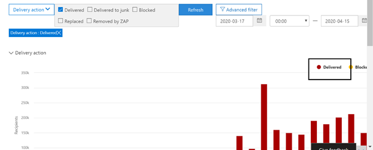

# Обозреватель угроз и обнаружение в режиме реального времениThreat Explorer and real-time detections

[!INCLUDE [Microsoft 365 Defender rebranding](../includes/microsoft-defender-for-office.md)]

Если в вашей организации используется [office 365 Advanced Threat protection](office-365-atp.md) (Office 365 ATP), а у вас есть [необходимые разрешения](#required-licenses-and-permissions), то у вас есть **проводник** или **Обнаружение в режиме реального времени** (ранее отчеты в *режиме реального времени* — [Просмотреть новые](#new-features-in-threat-explorer-and-real-time-detections)возможности!).If your organization has [Office 365 Advanced Threat Protection](office-365-atp.md) (Office 365 ATP), and you have the [necessary permissions](#required-licenses-and-permissions), you have either **Explorer** or **real-time detections** (formerly *real-time reports* — [see what's new](#new-features-in-threat-explorer-and-real-time-detections)!). В центре безопасности & соответствия требованиям перейдите в раздел **Управление угрозами**, а затем выберите **проводник** _или_ **Обнаружение в режиме реального времени**.In the Security & Compliance Center, go to **Threat management**, and then choose **Explorer** _or_ **Real-time detections**.

|В плане ATP 2 вы увидите:With ATP Plan 2, you see:|В плане ATP 1 вы увидите:With ATP Plan 1, you see:|
|---|---|
|||
|

С помощью Explorer (или обнаружением в режиме реального времени) у вас есть мощный отчет, который позволяет группе по обеспечению безопасности выполнять эффективное и эффективное исследование угроз и реагирование на них.With Explorer (or real-time detections), you have a powerful report that enables your Security Operations team to investigate and respond to threats effectively and efficiently. Отчет напоминает следующее изображение:The report resembles the following image:

С помощью этого отчета можно выполнить следующие действия:With this report, you can:

- [Наличие вредоносных программ, обнаруженных функциями безопасности Microsoft 365See malware detected by Microsoft 365 security features](#see-malware-detected-in-email-by-technology)
- [Просмотрите данные о фишинговых URL-адресах и нажмите кнопку вредоносностиView data about phishing URLs and click verdict](#view-data-about-phishing-urls-and-click-verdict)
- [Запуск автоматического расследования и обработки ответа из представления в проводнике](#start-automated-investigation-and-response) (только ATP, план 2)[Start an automated investigation and response process from a view in Explorer](#start-automated-investigation-and-response) (ATP Plan 2 only)
- ... [Изучите вредоносные сообщения электронной почты и многое другое](#more-ways-to-use-explorer-or-real-time-detections)!... [Investigate malicious email, and more](#more-ways-to-use-explorer-or-real-time-detections)!

## Теги в обозревателе угрозTags in Threat Explorer

> [!NOTE] 
> Функция "Теги пользователей" Предварительная версия, недоступна всем и может быть изменена.The user tags feature is in Preview, isn't available to everyone, and is subject to change. За сведениями о расписании выпуска, ознакомьтесь с планом Microsoft 365.For information about the release schedule, check out the Microsoft 365 roadmap.

Теги пользователя — это идентификаторы для определенных групп пользователей в защитнике Майкрософт для Office 365.User tags are identifiers for specific groups of users in Microsoft Defender for Office 365. Дополнительные сведения о тегах, лицензировании и настройке тегов можно узнать здесь: [User tagss in Office 365 ATP](user-tags.md).For more information around Tags, licensing and configuring Tags, read more here: [User tags in Office 365 ATP](user-tags.md).

В обозревателе угроз вы увидите информацию по тегам пользователя в следующих статьях:Within Threat Explorer, you will be able to see information around User Tags in the following experiences:

#### Представление сетки электронной почтыEmail Grid View

Столбец Tags, показанный в сетке электронной почты, будет содержать все теги, которые были применены к почтовым ящикам отправителя или получателя.The Tags column shown in the email grid would contains all the tags that have been applied to the sender or recipient mailboxes. По умолчанию в первую очередь отображаются системные теги, такие как учетные записи приоритетов.By default, system tags like priority accounts are shown first.

#### ФильтрацияFiltering
Теперь у нас есть теги в качестве фильтра, чтобы можно было выполнять поиск только в учетных записях приоритетов или определенных пользовательских тегов (и даже исключать результаты с определенными тегами в составе этого интерфейса).We now have Tags as a filter so you can hunt just across priority accounts, or specific User tags scenarios (and even exclude results with certain tags as part of this experience). Объединение этих элементов с несколькими другими предоставленными нами фильтрами поможет сузить область расследованияCombining these with the multiple other filters that we provide, would help you to narrow down your scope of investigation

#### Всплывающее меню сведений электронной почтыEmail Detail Flyout
Чтобы просмотреть отдельные теги для отправителя и получателя, щелкните тему.To view the individual tags for sender and Recipient, click on the subject. Откроется всплывающее окно со сведениями о сообщении.It opens the message details flyout. На вкладке Сводка Теги отправитель и получатель отображаются отдельно, если они есть для электронной почты.In the summary tab, sender and recipient tags are shown separately, if they are present for an email.
Сведения об отдельных тегах для отправителя и получателя также расширяются до экспортированного CSV-файла, где эти сведения можно увидеть в двух отдельных столбцах.The information about individual tags for sender and Recipient, also extends to exported CSV, where you can see these details in 2 separate columns. 

Сведения о тегах также отображаются при нажатии кнопки всплывающее окно URL-адреса.Tags information is also shown in URL clicks flyout. Чтобы перейти к всплывающему меню URL-адреса, необходимо перейти в режим "фишинг" или "все сообщение электронной почты", а затем по URL-адресам или по URL-адресам. щелчок по отдельному всплывающему URL-адресу приведет к дополнительным сведениям о щелчках для этого URL-адреса, а также к тегам, связанным сTo get to the URL clicks flyout, you would need to go to Phish or All Email view, and then to URLs or URL Clicks Tab. Clicking on an individual URL flyout would show more details about Clicks for that URL, and would have Tags associated with that click. 

## Улучшения интерфейса по поиску угроз (предстоящие)Improvements to Threat Hunting Experience (upcoming)

### Обновлены сведения об угрозе для сообщений электронной почтыUpdated Threat Information for Emails

Мы нацелены на улучшения качества платформы и данных для повышения точности и целостности данных для записей электронной почты.We have focused on platform and data quality improvements to increase data accuracy and consistency for email records. Этот набор обновлений включает консолидацию сведений о предварительной доставке и последующей доставке (пример действия, выполняемого по электронной почте в процессе ZAP) в одну запись вместе с дополнительными возможностями, такими как спам вредоносности, угрозы уровня объекта (например, какой URL-адрес является вредоносным) и последние места доставки.These set of updates includes consolidation of pre-delivery and post-delivery information (example action executed on an email as part of ZAP process) into a single record  along with added richness like Spam verdict, Entity level threats (e.g., which URL was malicious) and latest delivery locations. 

После выполнения этих обновлений вы увидите одну запись для каждого сообщения, независимо от того, какие события после доставки выполнены над сообщением.After these updates, you'll see a single entry for each message, regardless of the different post-delivery events that have taken place on the message. Действия могут включать ZAP, ручное исправление (то есть действие администратора), динамическую доставку и т. д.Actions can include ZAP, Manual Remediation (which means admin action), Dynamic Delivery etc. 

В дополнение к показу угроз вредоносных программ и фишинговых угроз вы сможете просматривать нежелательные сообщения, связанные с вредоносности.In addition to showing malware and phish threats, you'll now be able to see spam verdict associated with an email. В сообщении электронной почты отображаются все угрозы, связанные с электронной почтой, а также соответствующие технологии обнаружения.Within the email, you will be able to see all the threats associated with the email along with the corresponding detection technologies. Каждый адрес электронной почты может иметь 0, 1 или несколько угроз.Each email can have 0, 1, or multiple threats. Текущие угрозы отображаются в разделе сведения в всплывающем окне сообщения электронной почты.You'll see the current Threats in the Details section of the Email flyout. Кроме того, при обнаружении нескольких угроз (например, сообщения электронной почты с использованием вредоносных программ и фишинга), при обнаружении технического поля будет выдаваться сопоставление Threat-Detection, что означает, что обнаружение технического светоиндикатора для идентификации угрозы.Additionally, for multiple threats (e.g., an email having both Malware and Phish), Detection tech field would give the Threat-Detection mapping, meaning which detection tech led to the identification of the Threat.

Набор технологий обнаружения обновлен и включал новые методы обнаружения, а также технологии обнаружения нежелательной почты, а также все различные представления электронной почты (вредоносные программы, фишинг, вся электронная почта), у вас будет одинаковый, согласованный набор технологий обнаружения для фильтрации результатов.The set of detection technologies has been updated to include new detection methods, as well as spam detection technologies, and across all the different email views (Malware, Phish, All Email), you'll have the same, consistent set of Detection technologies to filter the results. 

> [!NOTE]
> Анализ вредоносности может быть необязательно связан с сущностями.Verdict analysis might not necessarily be tied to entities. Например, электронная почта может классифицироваться как фишинг или Нежелательная почта, но на них нет URL-адресов, на которые помечаются вредоносностиные фишинговые или нежелательные сообщения.As an example, an email might be classified as Phish or Spam, but there are no URLs which have any Phish/Spam verdict stamped on them. Это связано с тем, что наши фильтры также оценивают контент и другие сведения о сообщении электронной почты перед назначением вредоносности.This is because our filters also evaluate content and other details for an email, before assigning a verdict. 
 
#### Угрозы в URL-адресахThreats in URLs

В всплывающем окне сообщения электронной почты — > Вкладка сведений можно просмотреть определенную угрозу для URL-адреса (угроза для URL-адреса может представлять собой вредоносную программу, фишинг, Нежелательная почта или нет).Within email flyout-> Details tab, you would now be able to see the specific threat for a URL (Threat for a URL can be Malware, Phish, Spam or None)

> [!div class="mx-imgBorder"]
> 

### Обновленное представление временной шкалы (предстоящие)Updated Timeline View (upcoming)

> [!div class="mx-imgBorder"]
> 

Кроме определения всех событий доставки и последующей доставки, представление временной шкалы также предоставляет сведения об угрозе, определенном в данный момент времени для подмножества этих событий.In addition to identifying all delivery and post-delivery events, timeline view also gives information about the Threat identified at that point of time for a subset of these events. Кроме того, здесь вы можете получить дополнительные сведения о дополнительных действиях (например, ZAP, ручное исправление) и результат этого действия.It also gives you more information about Additional Actions (e.g., ZAP, Manual Remediation) along with the Result of that action. Представление временной шкалы содержит сведения о первоначальной доставке и последующем выполнении всех событий, выполняемых после доставки в сообщении электронной почты.Timeline view contains information about the Original delivery and subsequently any post-delivery events performed on an email.

-   Источник: это может быть администратором/системой/пользователем в зависимости от источника события.Source: This can be Admin/System/user based on what was the source of the event.
-   Событие: сюда входят такие события верхнего уровня, как первоначальная доставка, ручное исправление, ZAP, отправку и динамическая доставка.Event: This includes top-level events like Original Delivery, Manual Remediation, ZAP, Submissions, and Dynamic Delivery.
-   Действие: это относится к определенному действию, которое было выполнено как часть ZAP или действия администратора (например, обратимое удаление).Action: This covers the specific action that was taken either as part of ZAP or Admin Action (e.g., Soft Delete).
-   Угрозы: посвященные угрозам (вредоносные программы, фишинг, Нежелательная почта), определенные на данный момент времени.Threats: Covers the threats (Malware, Phish, Spam) identified at that point of time.
-   Result/Details: содержит дополнительные сведения о результатах действия, независимо от того, было ли оно выполнено в ходе действия ZAP/admin.Result/Details: Covers more information about the Result of the Action, whether it was performed as part of ZAP/Admin Action.

### Исходное и Последнее место доставкиOriginal and Latest Delivery location

Сегодня мы указываем расположение доставки в сетке электронной почты и всплывающем меню электронной почты.Today, we surface delivery Location within email grid and email flyout. После пересылки поле место доставки будет переименовано в исходное место доставки.Going forward, the Delivery Location field will be renamed to Original Delivery Location. Кроме того, мы также представляем другое поле, называемое последним местом доставки.Additionally, we're also introducing another field called Latest delivery location. 

Исходное место доставки будет предоставлять дополнительные сведения о том, куда было доставлено электронное письмо изначально.The original delivery location would give more information about where an email was delivered initially. Последнее место доставки будет содержать место, в котором электронная почта может быть удалена после системных действий, таких как ZAP или действия администратора, например **Перемещение к удаленным элементам**.The latest delivery location would include location where an email may have landed after system actions like ZAP or admin actions like **Move to Deleted Items**. Последнее место доставки предназначено для информирования администраторов о последнем известном расположении сообщения после доставки или каких-либо действий системы или администратора.Latest delivery location is intended to inform admins of the message's last known location post-delivery or any system/admin actions. Он не включает в себя действия, связанные с конечными пользователями.By design, it doesn't include any end-user-related actions on the email. Например: Если пользователь удаляет сообщение или перемещает сообщение в архив/PST, место сообщения "Доставка" не будет обновляться.For example: if a user deletes a message or moves the message to archive/pst, the message "delivery" location will not be updated. Однако если в системном действии Обновлено расположение (например, ZAP приводит к перемещению электронного сообщения в карантин), в качестве карантина будет отображаться Последнее место доставки.However, if a system action updated the location (e.g., ZAP resulting in an email moving to Quarantine), you would see the Latest delivery location as Quarantine. 

> [!div class="mx-imgBorder"]
> 

> [!NOTE]
> Существует несколько случаев, когда место доставки и действие доставки могут показывать значение Unknown в качестве значения:There are few cases where Delivery Location and Delivery Action may show 'Unknown' as the value:
> 
> - Вы можете увидеть местоположение доставки как доставленное и место доставки как неизвестное.You might see Delivery location as Delivered, and Delivery Location as Unknown. Это происходит, когда сообщение было доставлено, но правило папки "Входящие" переместил сообщение в папку по умолчанию (черновик, архив и т. д.) вместо папок "Входящие" и "Нежелательная почта".This happens when the message was delivered, but an Inbox rule moved the message to a default folder (Draft, Archive, etc.) instead of the Inbox or Junk Email folders. 
> 
> - Последнее место доставки может быть неизвестным, если предпринята попытка выполнить действие администратора или системы (например,. ZAP, действие администратора), но сообщение не найдено.Latest Delivery Location can be unknown if an admin/system action (e.g., ZAP, Admin Action) is attempted, but the message isn't found. Как правило, это действие происходит после перемещения или удаления сообщения пользователем.Typically, the action happens after the user has moved or deleted the Message. В таких случаях проверьте столбец результат/сведения в представлении временная шкала.In such cases, verify the Result/Details Column in timeline view. Найдите сообщение: сообщение перемещено или удалено пользователем.Look for the message: Message moved or deleted by the user.

> [!div class="mx-imgBorder"]
> 

### Дополнительные действияAdditional Actions 

Дополнительные действия состоят из примененных действий POST для доставки электронной почты и могут включать ZAP, ручное исправление (действие, выполняемое администратором, например, обратимое удаление), динамическую доставку и повторной обработки (сообщение электронной почты было ретроактивели обнаружено как хорошее).Additional Actions consist of the actions that were applied post the delivery of the Email, and can include ZAP, Manual Remediation (action taken by an Admin e.g., Soft Delete), Dynamic Delivery, and Reprocessed (an email was retroactively detected as good). 

> [!NOTE]
>
> - В рамках этого изменения значение свойства ZAPd, которое отображается в данный момент в фильтре действий доставки, исчезает.As part of this change, the Removed by ZAP value currently surfaced in the Delivery Action filter is going away. Вы можете найти все сообщения электронной почты с помощью ZAP, попытайтесь выполнить дополнительные действия.You'll have a way to search for all email with the ZAP attempt through the Additional Actions.
>
> - Существуют новые поля и значения для технологий обнаружения и дополнительные действия (особенно для сценариев ZAP).There will be new fields and values for Detection technologies and Additional actions (especially for ZAP scenarios). Оцените существующие сохраненные запросы и отслеживаемые запросы, чтобы убедиться, что они работают с новыми значениями.Evaluate your existing Saved Queries and Tracked queries to make sure they work with the new values. 

> [!div class="mx-imgBorder"]
> 

### Переопределение системыSystem overrides 

Переопределение системы — это метод создания исключений для предполагаемого места доставки сообщения путем переопределения места доставки, предоставленного системой (на основе угроз и других обнаруженных в стеке фильтрации).System overrides are a method of making exceptions to the intended delivery location of a message by overriding the delivery location provided by system (based on the threats and other detections identified by our filtering stack). Переопределение системы можно задать с помощью политики клиента или пользователя, чтобы доставить сообщение согласно рекомендациям политики.System overrides can be set through tenant or user policy to deliver the message as suggested by the policy. Переопределения полезны при определении непреднамеренной доставки вредоносных сообщений из-за разрывов конфигураций (например, очень обширная политика безопасных отправителей, установленная пользователем).Overrides are useful in identifying any unintentional delivery of malicious messages due to configurations gaps (for example, a very broad Safe Sender policy set by a user). Эти значения переопределения могут быть следующими:These override values can be:

- Разрешено политикой пользователя: это происходит, когда пользователь разрешает домены или отправители, создавая политики на уровне почтового ящика.Allowed by user policy: This is when a user allows domains or senders by creating policies at the mailbox level.
- Заблокировано политикой пользователя: это происходит, когда пользователь блокирует домены или отправители, создавая политики на уровне почтового ящика.Blocked by user policy: This is when a user blocks domains or senders by creating policies at the mailbox level.
- Разрешено политикой Организации: это происходит в том случае, если группы безопасности Организации настроили политики или правила для почтовых ящиков Exchange (также называемые правилами транспорта), чтобы разрешить отправителям и доменам пользователей в своей организации.Allowed by org policy: This is when the organization's security teams set policies or Exchange mail flow rules (also known as transport rules) to allow senders and domains for users in their organization. Это может быть группа пользователей или вся Организация.This can be for a set of users or the entire organization.
- Заблокировано политикой Организации. это происходит в том случае, если группа безопасности Организации устанавливает политики или правила обработки почтового ящика, чтобы заблокировать отправители, домены, языки сообщений или исходные IP-адреса для пользователей в своей организации.Blocked by org policy: This is when the organization's security teams set policies or mail flow rules to block senders, domains, message languages, or source IPs for users in their organization. Это также можно сделать для набора пользователей или всей Организации.This can also be for a set of users or the entire organization.
- Расширение файла, заблокированное политикой Организации: это вызвано тем, что расширение типа файла блокируется группами безопасности Организации через параметры политики защиты от вредоносных программ.File extension blocked by org policy: This is when a file type extension is blocked by the security teams of an organization through the anti-malware policy settings. Теперь эти значения будут отображаться в сведениях по электронной почте, чтобы помочь в расследовании.These values will now be displayed in email details to help with investigations. Секопс Teams также может фильтровать заблокированные расширения файлов с помощью функции фильтрации с расширенными возможностями.Secops teams can also filter on blocked file extensions using the rich filtering capability.

> [!div class="mx-imgBorder"]
> 

### Улучшения, связанные с URL-адресом и щелчками интерфейсаImprovements around URL and Clicks Experience

В набор улучшений, направленных на URL-адреса и URL-адреса, входят:The set of improvements focused towards URL and URL clicks data include:

 - Отображается полный URL-адрес (включая все параметры запроса, являющиеся частью URL-адреса) в разделе "команды" в всплывающем окне URL-адреса.Showing full Clicked URL (including any query Parameters which are part of URL) within the Clicks Section in URL Flyout. В настоящее время вы выводите домен URL и путь в заголовке окна.Currently we show the URL domain and path in title bar. Мы расширены эти сведения, чтобы показать полный URL-адрес.We're extending that information to show the full URL.
 
 - Исправления в фильтрах URL-адресов (URL-адрес и домен URL-адреса VS URL-адрес домена и путь): мы внесли обновления, чтобы искать сообщения, содержащие URL-адреса/щелкните вредоносности.Fixes across URL filters (URL vs URL domain vs URL Domain and path): We've made updates around searching for messages that contain a URL/Click verdict. В рамках этого мы включили поддержку поиска независимого протокола (то есть можно напрямую выполнить поиск по URL-адресу без HTTP).As part of that, we've enabled support for protocol agnostic searches (meaning, you can directly search for a URL without http). По умолчанию поиск URL-адресов сопоставляется с HTTP, если явно не указано иное.By default, the URL search maps to http, unless explicitly specified. Например:For example:

   1. Поиск с `http://` префиксом "URL", "домен URL" и "домен URL-адрес и путь" в полях фильтра "URL", "домен URL" и "домен URL".Search with and without the `http://` prefix in "URL", "URL Domain", and "URL Domain and Path" filter fields. Такое поведение является согласованным и должно отображать тот же результат.This behavior is consistent, and should show the same result.
   
   1. Выполните поиск `https://` префикса в поле "URL-адрес".Search for the `https://` prefix in "URL". Если этот параметр не указан, `http://` используется префикс.When not present, the `http://` prefix is assumed.
   
   1. `/` в начале и в конце поля "URL-путь", "домен URL", "домен URL и путь" игнорируются.`/` in beginning and end of the "URL path", "URL Domain", "URL domain and path" fields is ignored. `/` в конце поля "URL" игнорируется.`/` at the end of the "URL" field is ignored. 

### Уровень вероятности фишингаPhish Confidence Level

Уровень вероятности фишинга помогает определить степень уверенности, с которой электронное письмо было отнесено к категории фишинга.Phish confidence level helps to identify the degree of confidence, with which an email was categorized as Phish. Два возможных значения: высокая и обычная.The two possible values are High and Normal. На начальных стадиях этот фильтр будет доступен только в представлении фишинга обозревателя угроз.In the initial stages, this filter will be available only in the Phish view of Threat Explorer.

### Сигнал URL-адреса ZAPZAP URL Signal 

Обычно используется для сценариев фишинга ZAP, когда электронная почта была идентифицирована как фишинг и удалена после доставки.Typically used for ZAP Phish Alert scenarios where an email was identified as Phish and removed after delivery. Используется для подключения оповещения с соответствующими результатами в проводнике.This is used to connect the alert with the corresponding results in Explorer. Это один из Иокс для оповещения.It is one of the IOCs for the alert. 

## Улучшения в проводнике по угрозам и Real-Time обнаруженияExperience Improvements to Threat Explorer and Real-Time Detections

В рамках улучшения процесса поиска мы внесли несколько обновлений в обозреватель угроз и обнаружение Real-Time.As part of improving the hunting process, we have made a few updates to Threat Explorer and Real-Time Detections. Это улучшения опыта работы, в которых основное внимание уделяется повышенному последовательному улучшению качества.These are ‘experience’ improvements, with the focus on making the hunting experience more consistent. Эти изменения описаны ниже.These changes are outlined below:

- [Улучшения часового поясаTimezone improvements](#timezone-improvements)
- [Обновление в процессе обновленияUpdate in the Refresh process](#update-in-the-refresh-process)
- [Детализация диаграммы для добавления в фильтрыChart drilldown to add to filters](#chart-drilldown-to-add-to-filters)
- [Обновление сведений о продуктеIn product information updates](#in-product-information-updates)

### Улучшения часового поясаTimezone improvements

Вы увидите часовой пояс для записей электронной почты в портале, а также для экспортированных данных.You will see the timezone for the email records within the Portal, as well as for Exported data. Часовой пояс будет отображаться во всех таких возможностях, как сетка электронной почты, всплывающее окно со сведениями, временная шкала электронной почты и Похожие сообщения электронной почты, поэтому часовой пояс для набора результатов становится понятен пользователю.The timezone will be visible across experiences like Email Grid, Details Flyout, Email Timeline, and Similar Emails, so that the timezone for the result set is clear to the user.

> [!div class="mx-imgBorder"]
> 

### Обновление в процессе обновленияUpdate in the Refresh process

Мы слышали Отзывы об путанице с автоматическим обновлением (например, по дате, когда вы измените дату, обновите страницу) и обновите вручную (для других фильтров).We have heard feedback around confusion with automatic refresh (e.g. for date, as soon as you change the date, the page would refresh) and manual refresh (for other filters). Аналогично, удаление фильтров приводит к автоматическому обновлению, что приводит к ситуациям, в которых изменение различных фильтров при изменении запроса может привести к несогласованному поиску.Similarly, removing filters leads to automatic refresh, this causes situations where changing the different filters while modifying the query can cause inconsistent search experiences. Чтобы устранить эту проблему, мы передвигаясь к механизму фильтрации вручную.To solve this, we are moving to a manual filtering mechanism.

С точки зрения взаимодействия пользователь может применить и удалить другой диапазон фильтров (из набора фильтров и даты), а затем нажать кнопку обновить, чтобы отфильтровать результаты после определения запроса.From an experience standpoint, the user can apply and remove the different range of filters (from the filter set, and date), and press the refresh button to filter the results once they are done with defining the query. Кнопка Обновить также была обновлена, чтобы она была четко вызвана на экране.The refresh button has also been updated to call it out clearly on the screen. Мы также обновили подсказки и документацию по продуктам, связанные с этим изменением.We have also updated tooltips and in-product documentation around this change.

> [!div class="mx-imgBorder"]
> 

### Детализация диаграммы для добавления в фильтрыChart drilldown to add to filters

Теперь вы можете щелкнуть значения условных обозначений диаграммы, чтобы добавить это значение в качестве фильтра.You will now be able to click on the chart legend values to add that value as a filter. Обратите внимание, что по-прежнему потребуется нажать кнопку обновить, чтобы отфильтровать результаты в соответствии с описанным выше изменением.Note that you will still have to click on the refresh button to filter the results as part of the change described above.

> [!div class="mx-imgBorder"]
> 

### Обновление сведений о продуктеIn product information updates

Кроме того, следует ознакомиться с дополнительными сведениями в продукте.You should also see additional details within the product. Например, общее количество результатов поиска в сетке (см. ниже), а также улучшения вокруг меток, сообщений об ошибках и подсказок, чтобы получить дополнительные сведения вокруг фильтров, результатов поиска и набора результатов.For example, the total number of search results within grid (see below), as well as improvements around labels, error messages and tooltips, to give more information around filters, search experience, and result set.

> [!div class="mx-imgBorder"]
> 

## Расширенные возможности в обозревателе угрозExtended capabilities in Threat Explorer

### Основные целевые пользователиTop targeted users

Сегодня мы предоставляем список лучших целевых пользователей в представлении вредоносных программ для сообщений (в разделе самые распространенные семейства вредоносных программ).Today we expose the list of the top targeted users in the Malware View for Emails (within the Top Malware Families section). Это представление будет расширено в виде фишинга и всех представлений электронной почты, где вы сможете просматривать пять целевых пользователей, а также число попыток для каждого пользователя в соответствующем представлении (например, для режима "фишинг" вы увидите число попыток фишинга).We will be extending this view within Phish and All Email views as well, where you will be able to see the top five targeted users along with the number of attempts for each user for the corresponding view (for example, for Phish view you will be able to see the number of Phish attempts).
Вы также сможете экспортировать список пользователей, которым назначено максимальное количество попыток для автономного анализа для каждого представления электронной почты: 3000, а также число попыток автономного анализа.You will also be able to export the list of targeted users up to a limit of 3000 along with the number of attempts for offline analysis for each email view. В дополнение к этому, выберите нет.In addition to that, selecting No. количество попыток (например, 13 попыток) открывает отфильтрованное представление в обозревателе угроз, поэтому вы можете просматривать более подробные сведения по сообщениям электронной почты и угрозам для этого пользователя.of attempts (for example, 13 attempts below) would open a filtered view in Threat Explorer, so that you can look at more details across emails and threats for that user.

> [!div class="mx-imgBorder"]
> 

### Правила транспорта ExchangeExchange transport rules
В рамках обогащения данных также должны быть видны все правила транспорта, которые были применены к сообщению.As part of data enrichment, you should also be able to see all the different transport rules which were applied to a message. Эти сведения будут отображаться в представлении "Сетка почты" (чтобы просмотреть это, выберите параметры столбца в таблице и добавьте правило транспорта Exchange из параметров столбца в таблице), а также всплывающее меню сведений в сообщении электронной почты.This information will be present within the Email grid view (to view this, select Column options in the grid and add Exchange Transport Rule from the Column options in the grid) as well as Details flyout in the email.
Вы сможете увидеть как GUID, так и имя правил транспорта, которые были применены к сообщению.You would be able to see both the GUID as well as the name of the transport rules which were applied to the message. Кроме того, вы сможете искать сообщения, используя имя правила транспорта.Additionally, you would be able to search for the messages using the name of the transport rule. Это будет Поиск "Contains", что означает, что вы сможете выполнять поиск с использованием частичного поиска.This would be a ‘Contains’ search which means you will be able to search using partial searches as well.

#### Важное замечание:Important Note:
ETR поиска и доступности имен будут зависеть от конкретной роли, назначенной пользователю.ETR search and name availability would depend on the specific role that has been assigned to you. Для просмотра имен ETR и поиска необходимо иметь одну из следующих ролей и разрешений.You will need to have one of the following roles/permissions in order to view the ETR names and search.  Если вам не назначены никакие из следующих ролей, вы не сможете просматривать имена правил транспорта и искать сообщения с помощью имен ETR.If you do not have any of the following roles assigned to you, you will not be able to see the names of the transport rules, and search for the messages using the ETR names. Тем не менее, вы увидите метку ETR и информацию об идентификаторе GUID в сведениях электронной почты.However, you will be able to see the ETR label and GUID information within the Email Details. Другие возможности по просмотру записей в сетках электронной почты, всплывающих сообщениях, фильтрах и экспорте не затрагиваются.Your other experiences around viewing records in Email Grids, Email flyouts, Filters, and Export are not impacted.

- EXO только защита от потери данных: всеEXO Only - Data Loss Prevention: All
- Только EXO — O365SupportViewConfig: ALLEXO Only - O365SupportViewConfig: All
- AAD или EXO — администратор безопасности: всеAAD or EXO - Security Admin: All
- AAD или EXO — средство чтения безопасности: ALLAAD or EXO - Security Reader: All
- Только EXO правила транспорта: ALLEXO Only - Transport Rules: All
- EXO только конфигурация View-Only: ALLEXO Only - View-Only Configuration: All

В таблице электронной почты, всплывающем окне со сведениями и экспортированном CSV-файле в ETR отображаются имя/GUID, как показано ниже.Within the email grid, Details flyout, and Exported CSV, the ETRs are presented with a Name/GUID as shown below.

> [!div class="mx-imgBorder"]
> 

### Входящие соединителиInbound connectors

Соединители это набор инструкций, которые настраивают способ обработки электронной почты в организации Microsoft 365 или Office 365, с возможностью применять какие-либо ограничения безопасности или элементы управления.Connectors are a collection of instructions that customize the way your email flows to and from your Microsoft 365 or Office 365 organization, with the ability to apply any security restriction or controls. В обозревателе угроз теперь можно просматривать соединители, связанные с электронной почтой, а также искать сообщения электронной почты с помощью имен соединителей.Within Threat Explorer, you will now have the ability to view the connectors which are related to an email as well as search for emails using the connector names.
Поиск соединителей "содержит" в природе означает, что также должны работать частичные поиски ключевых слов.The search for connectors is ‘Contains’ in nature which means partial keyword searches should work as well.
В представлении основная сетка, всплывающее меню сведений и экспортированный CSV-файл отображаются в формате имя/GUID, как показано ниже:Within the Main grid view, the Details flyout, and the Exported CSV, the connectors are shown in the Name/GUID format as shown below:

> [!div class="mx-imgBorder"]
> 

## Новые возможности в обозревателе угроз и обнаружение в режиме реального времениNew features in Threat Explorer and real-time detections

Три новых функции, добавленные в обозреватель угроз и обнаружение в режиме реального времени:Three new features added into Threat Explorer and real-time detections:

- [Предварительный просмотр заголовка сообщения электронной почты и загружаемого текста сообщенияPreview email header and download email body](#preview-email-header-and-download-email-body)
- [Временная шкала электронной почтыEmail timeline](#email-timeline)
- [Экспорт URL-адреса щелкните данныеExport URL click data](#export-url-click-data)

Эти новые функции описаны ниже.These new features are outlined below.

### Предварительный просмотр заголовка сообщения электронной почты и загружаемого текста сообщенияPreview email header and download email body

Возможность предварительного просмотра заголовка и загрузки текста сообщения электронной почты — это новые функции, доступные в обозревателе угроз.The ability to preview an email header and download the email body are new features available in Threat Explorer. Администраторы смогут анализировать загруженные заголовки/сообщения электронной почты для угроз.Admins will be able to analyze downloaded headers/email messages for threats. Поскольку загрузка сообщений электронной почты может привести к снижению вероятности получения информации, этот процесс контролируется с помощью управления доступом на основе ролей (RBAC).Because downloading email messages can risk the exposure of information, this process is controlled by roles-based access control (RBAC). Новая роль, *Предварительная версия*, должна быть добавлена в другую группу ролей (например, с помощью операций безопасности или администратора безопасности), чтобы предоставить возможность загружать сообщения и предварительные заголовки в представлении всех сообщений электронной почты.A new role, *Preview*, must be added to another role group (such as Security Operations or Security Administrator) to grant the ability to download mails and preview headers in all-email messages view.

Но в Explorer (и в режиме реального времени) также добавляются новые новые поля, которые позволяют получить более полную картину места, где размещается сообщение электронной почты.But Explorer (and real-time detections) also adds fresh new fields designed to give you a more complete picture of where your email messages land. Часть цели этого изменения заключается в том, чтобы упростить поиск в ходе проведения операций по обеспечению безопасности для пользователей, но в итоге вы можете узнать о местоположении проблемных сообщений с первого взгляда.Part of the goal of this change is to make hunting easier for Security Ops people, but the net result is knowing the location of problem email messages at a glance.

Как это сделать?How is this done? Состояние доставки теперь разбивается на два столбца:Delivery Status is now broken out into two columns:

- **Действие доставки** — Каков статус этого сообщения?**Delivery Action** - What is the status of this email?
- **Место доставки** — где было отправлено это сообщение электронной почты в результате?**Delivery Location** - Where was this email routed as a result?

Действие доставки — это действие, выполняемое по электронной почте из-за существующих политик или обнаружений.Delivery Action is the action taken on an email due to existing policies or detections. Возможные действия, которые может выполнить электронная почта:Here are the possible actions an email can take:

|ОтобранDelivered|Нежелательная почтаJunked|ЗаблокированоBlocked|МеняReplaced|
|---|---|---|---|
|Сообщение было доставлено в папку "Входящие" или в папку пользователя, и пользователь может напрямую получить к нему доступ.Email was delivered to Inbox or folder of a user and the user can directly access it.|Сообщение отправлено в папку "спам" или "Удаленная папка" пользователя, и у пользователя есть доступ к сообщениям в этих папках.Email was sent to either user’s Junk folder or Deleted folder, and the user has access to emails in those folders.|Все сообщения электронной почты, которые помещены в карантин, не выполнены или были удалены.Any emails that are quarantined, that  failed, or were dropped. Она полностью недоступна пользователю!This is completely inaccessible by the user!|Любое сообщение электронной почты, в которое заменяются файлы. txt, которые имеют вредоносные файлы.Any email where malicious attachments are replaced by .txt files that state the attachment was malicious.|

|ОтобранDelivered|Нежелательная почтаJunked|ЗаблокированоBlocked|МеняReplaced|
|---|---|---|---|
|Сообщение было доставлено в папку "Входящие" пользователя или в другую папку, и пользователь может напрямую получить к ней доступ.Email was delivered to the user's inbox or another folder, and the user can directly access it.|Сообщение отправлено в папку "спам" или "Удаленная папка" пользователя, и у пользователя есть доступ к сообщениям электронной почты в этих папках.Email was sent to either user's Junk folder or Deleted folder, and the user has access to email messages in those folders.|Сообщения электронной почты, которые помещены в карантин, не выполнены или были удалены, недоступны для пользователя.Any email messages that are quarantined, that failed, or were dropped, and are not accessible by the user.|Все сообщения электронной почты, в которых вредоносные вложения были заменены на файлы. txt, которые задали вредоносные вложения.Any email messages where malicious attachments were replaced by .txt files that state the attachments were malicious.|
|

И вот что может видеть пользователь, и что он не может:And here is what the user can see, and what they can't:

|Доступ для конечных пользователейAccessible to end users|Недоступно для конечных пользователейInaccessible to end users|
|---|---|
|ОтобранDelivered|ЗаблокированоBlocked|
|Нежелательная почтаJunked|МеняReplaced|

В местоположении доставки отображаются результаты политик и обнаружений, которые запускают после доставки.Delivery location shows the results of policies and detections that run post-delivery. Он связан с действием доставки.It's linked to a Delivery Action. Это поле было добавлено для получения подробных сведений о действиях, выполняемых при обнаружении проблемных сообщений.This field was added to give insight into the action taken when a problem mail is found. Ниже приведены возможные значения расположения доставки.Here are the possible values of delivery location:

- **Папка "Входящие" или "папка"**: сообщение электронной почты находится в папке "Входящие" или папке (в соответствии с правилами электронной почты).**Inbox or folder**: The email is in inbox or a folder (according to your email rules).
- **Локальная или внешняя**: почтовый ящик не существует в облаке, но является локальным.**On-prem or external**: The mailbox doesn't exist on cloud but is on-premises.
- **Папка "спам**": сообщение электронной почты находится в папке "Нежелательная почта" пользователя.**Junk folder**: The email is in the Junk folder of a user.
- **Папка "Удаленные**": сообщение электронной почты в папке "Удаленные" пользователя.**Deleted items folder**: The email in the Deleted items folder of a user.
- **Карантин**: сообщение электронной почты в карантине и не находится в почтовом ящике пользователя.**Quarantine**: The email in quarantine, and is not in a user's mailbox.
- **Сбой**: почтовому ящику не удалось подключиться к почтовому ящику.**Failed**: The email failed to reach the mailbox.
- **Удалено**: сообщение электронной почты будет потеряно в любом месте почтового процесса.**Dropped**: The email gets lost somewhere in the mail flow.

### Временная шкала электронной почтыEmail timeline

**Временная шкала электронной почты** — это еще одна новая функция проводника, предназначенная для улучшения качества работы для администраторов.The **Email Timeline** is another new Explorer feature aimed at making the hunting experience better for admins. Она вырезается по случайному расходу, так как в этом случае сокращается время, затрачиваемое на проверку различных расположений для ознакомления с событием.It cuts down on randomization because there is less time spent checking different locations to try to understand the event. Когда несколько событий происходят в, или близко к, одно и то же время в сообщении электронной почты, эти события будут отображаться в представлении временной шкалы.When multiple events happen at, or close to, the same time on an email, those events will show up in a timeline view. В действительности некоторые события, которые происходят после доставки в почту, будут записываться в столбце "специальное действие".In fact, some events that happen post-delivery to your mail will be captured in the 'Special action' column. Объединение информации из временной шкалы с особым действием, выполняемым при последующей доставке почты, предоставит администраторам сведения о том, как работают их политики, и в некоторых случаях для окончательной оценки была выполнена окончательная маршрутизация.Combining the information from the timeline of that mail with the special action taken on the mail post-delivery will give admins insight into how their policies work, where the mail was finally routed, and, in some cases, what the final assessment was.

Подробнее о том, как изучать вредоносные сообщения электронной почты, можно узнать [в статье исследование и исправление вредоносных сообщений электронной почты, которые были доставлены в Office 365](investigate-malicious-email-that-was-delivered.md).For more discussion about investigating malicious email messages, see [Investigate and remediate malicious email that was delivered in Office 365](investigate-malicious-email-that-was-delivered.md).

### Экспорт URL-адреса щелкните данныеExport URL click data

Кроме того, вы можете экспортировать отчеты для URL-адресов, которые вы щелкаете в Microsoft Excel, чтобы просмотреть идентификационный номер своего сообщения, а затем нажмите кнопку вредоносности, сделав задачу понимания того, где ваш URL-адрес стал проще.Also, you will now be able to export reports for URL clicks to Microsoft Excel in order to view both their Network Message ID, and their Click Verdict, making the task of understanding where your URL click traffic originated easier. Вот как это работает.Here's how it works. Начиная с управления угрозами на панели быстрого запуска Office 365, щелкните эту цепочку.Starting in Threat Management on the Office 365 quick-launch, click through this chain:

**Explorer** \> **Просмотр фишинга** \> **Щелкает мышью** \> **Самые популярные URL-адреса или верхние щелчки URL** \> **Щелкните любую запись, чтобы открыть всплывающее меню URL-адреса****Explorer** \> **View Phish** \> **Clicks** \> **Top URLs or URL Top Clicks** \> **Click on any record to open URL flyout**

Если щелкнуть URL-адрес в списке, появится кнопка "создать экспорт" на панели "вылет".When you click on a URL in the list, you'll see a new Export button on the fly-out panel. Используйте эту кнопку для перемещения данных в электронную таблицу Excel для упрощения создания отчетов.Use this button to move data to an Excel spreadsheet for easier reporting.

Вы можете перейти к тому же расположению в отчете о обнаружениях в режиме реального времени следующим образом:You can get to the same location in the real-time detections report as follows:

**Explorer** \> Обнаружение в режиме **реального времени** \> **Просмотр фишинга** \> **URL-адреса** \> **Самые популярные URL-адреса или верхние щелчки** \> **Щелкните любую запись, чтобы открыть всплывающее меню** \> URL-адреса **Перейдите на вкладку "нажатия".****Explorer** \> **Real-time Detections** \> **View Phish** \> **URLs** \> **Top URLs or Top Clicks** \> **Click on any record to open URL flyout** \> **Navigate to the Clicks Tab.**

> [!TIP]
> ИДЕНТИФИКАТОР сетевого сообщения сопоставляет нажатие кнопки обратно с определенными сообщениями при поиске по проводнику или связанным сторонним средствам с помощью идентификатора сетевого сообщения.Network Message ID maps the click back to specific mails when you search through Explorer or associated 3rd party tools via Network Message ID. При поиске по сетевому сообщению администратору будет предоставлено сообщение, связанное с результатом нажатия кнопки.Searching through the Network Message ID will give admins the specific email associated with a click result. При экспорте учетная идентификация идентификатора сетевого сообщения делает анализ более быстрым и мощным.On export having, the correlating identification of Network Message ID makes for quicker and more powerful analysis.

> [!div class="mx-imgBorder"]
> 

## Просмотр вредоносных программ, обнаруженных технологиейSee malware detected in email by technology

Предположим, вы хотите увидеть вредоносную программу, обнаруженную в электронном письме, с помощью технологии Microsoft 365.Suppose you want to see malware detected in email, by Microsoft 365 technology. Для этого воспользуйтесь представлением " [Электронная почта > просмотр вредоносных программ](threat-explorer-views.md#email--malware) в проводнике (или обнаружения в режиме реального времени).To do this, use the [Email > Malware](threat-explorer-views.md#email--malware) view of Explorer (or real-time detections).

1. В центре безопасности & соответствия требованиям ( [https://protection.office.com](https://protection.office.com) ) выберите Обозреватель **управления угрозами**  >  **Explorer** (или **Обнаружение в режиме реального времени**).In the Security & Compliance Center ([https://protection.office.com](https://protection.office.com)), choose **Threat management** > **Explorer** (or **Real-time detections**). (В этом примере используется Explorer.)(This example uses Explorer.)

2. В меню **вид** выберите пункт **Электронная почта**  >  **Malware**.In the **View** menu, choose **Email** > **Malware**.

   > [!div class="mx-imgBorder"]
   > 

3. Нажмите **отправитель**, а затем выберите **Базовая**  >  **технология обнаружения**.Click **Sender**, and then choose **Basic** > **Detection technology**.

   Теперь ваши технологии обнаружения доступны в качестве фильтров для отчета.Your detection technologies are now available as filters for the report.

   > [!div class="mx-imgBorder"]
   > 

4. Выберите параметр, а затем нажмите кнопку **Обновить** , чтобы применить этот фильтр.Select an option, and then click the **Refresh** button to apply that filter.

   > [!div class="mx-imgBorder"]
   > 

Отчет обновляется для отображения результатов, обнаруженных в сообщении электронной почты, с использованием выбранного варианта технологии.The report refreshes to show the results malware detected in email, using the technology option you selected. Отсюда вы можете провести дальнейший анализ.From here, you can conduct further analysis.

## Просмотрите данные о фишинговых URL-адресах и нажмите кнопку вредоносностиView data about phishing URLs and click verdict

Предположим, вы хотите увидеть почтовые сообщения с помощью URL-адресов, включая список разрешенных, заблокированных и переопределенных URL-адресов.Suppose that you want to see phishing attempts through URLs in email, including a list of URLs that were allowed, blocked, and overridden. Для идентификации URL-адресов, которые были выбраны, необходимо настроить [безопасные ссылки](atp-safe-links.md) .Identifying URLs that were clicked requires [Safe Links](atp-safe-links.md) to be configured. Убедитесь, что вы настроили [политики безопасных ссылок](set-up-atp-safe-links-policies.md) для защиты от щелчка по времени и регистрации щелкните Вердиктс по безопасному каналу связи.Make sure that you have set up [Safe Links policies](set-up-atp-safe-links-policies.md) for time-of-click protection and logging of click verdicts by Safe Links.

Чтобы просмотреть URL-адреса фишинга в сообщениях и щелкать URL-адреса в сообщениях фишинга, используйте [сообщение электронной почты > "фишинг](threat-explorer-views.md#email--phish) " проводника (или обнаружение в режиме реального времени).To review phish URLs in messages and clicks on URLs in phish messages, use the [Email > Phish](threat-explorer-views.md#email--phish) view of Explorer (or real-time detections).

1. В центре безопасности & соответствия требованиям ( [https://protection.office.com](https://protection.office.com) ) выберите Обозреватель **управления угрозами**  >  **Explorer** (или **Обнаружение в режиме реального времени**).In the Security & Compliance Center ([https://protection.office.com](https://protection.office.com)), choose **Threat management** > **Explorer** (or **Real-time detections**). (В этом примере используется Explorer.)(This example uses Explorer.)

2. В меню **вид** выберите пункт фишинг **электронной почты**  >  **Phish**.In the **View** menu, choose **Email** > **Phish**.

   > [!div class="mx-imgBorder"]
   > 

3. Нажмите **отправитель**, а затем выберите **URL-адреса**  >  **нажмите кнопку вредоносности**.Click **Sender**, and then choose **URLs** > **Click verdict**.

4. Выберите один или несколько параметров, например **заблокировано** и **блокировать переопределение**, а затем нажмите кнопку **Обновить** , расположенную в той же строке, что и параметры применения этого фильтра.Select one or more options, such as **Blocked** and **Block overridden**, and then click the **Refresh** button that is on the same line as the options to apply that filter. (Не обновите окно браузера.)(Don't refresh your browser window.)

   > [!div class="mx-imgBorder"]
   > 

   Отчет обновляется для отображения двух различных таблиц URL-адресов на вкладке URL-адрес отчета:The report refreshes to show two different URL tables on the URL tab under the report:

   - **Топ URL-адресов** это URL-адреса, содержащиеся в фильтруемых сообщениях, и количество действий по доставке для каждого URL-адреса.**Top URLs** are the URLs contained in the messages you have filtered down to, and the email delivery action counts for each URL. В представлении "фишинг сообщения" Этот список, как правило, содержит допустимые URL-адреса.In the phish email view, this list typically will contain legitimate URLs. Злоумышленники включают в свои сообщения сочетания хороших и недостоверных URL-адресов, чтобы попытаться доставить их, но они станут интереснее для пользователя щелкнуть.Attackers include a mix of good and bad URLs in their messages to try to get them delivered, but they will make the malicious links more interesting for the user to click. Таблица URL-адресов сортируется по общему количеству электронной почты (но обратите внимание, что этот столбец скрыт для упрощения представления).The table of URLs is sorted by total email count (but note that this column is hidden to simplify the view).

   - **Наиболее посещаемые щелчки** — это безопасные ссылки, которые были выбраны, отсортированные по общему количеству щелчков (этот столбец также не отображается для упрощения представления).**Top clicks** are the Safe Links wrapped URLs that were clicked, sorted by total click count (this column is also not shown to simplify the view). Общее количество подсчетов по столбцу указывает на безопасные ссылки нажмите кнопку счетчик вредоносности для каждого нажатого URL-адреса.Total counts by column indicate the Safe Links click verdict count for each clicked URL. В представлении "фишинг сообщений" чаще всего используются подозрительные или вредоносные URL-адреса, но они могут включать URL-адреса, которые не являются угрозами, но находятся в сообщениях фишинга.In the phish email view, these are more often suspicious or malicious URLs, but could include URLs that are not threats but are in phish messages. URL-адреса, на которые вы щелкнете ссылки, не отображаются здесь.URL clicks on unwrapped links will not show up here.

   В двух таблицах URL-адресов отображаются самые популярные URL-адреса в сообщениях фишинга по доставке и размещению, а также отображаются нажатия клавиш URL-адреса, которые были заблокированы (или посещены несмотря на предупреждение), чтобы определить, какие потенциальные неправильные ссылки были получены пользователями и работали с пользователями.The two URL tables show top URLs in phishing email messages by delivery action and location, and they show URL clicks that were blocked (or visited despite a warning) so that you can understand what potential bad links were received by users and interacted with by users. Отсюда вы можете провести дальнейший анализ.From here, you can conduct further analysis. Например, под диаграммой можно увидеть самые популярные URL-адреса в сообщениях электронной почты, которые были заблокированы в среде Организации.For example, below the chart, you can see the top URLs in email messages that were blocked in your organization's environment.

   > [!div class="mx-imgBorder"]
   > 

   Выберите URL-адрес, чтобы просмотреть более подробные сведения.Select a URL to view more detailed information.

   > [!NOTE]
   > В всплывающем диалоговом окне URL-адреса удаляется фильтрация по сообщениям электронной почты, чтобы показать полное представление о доступности URL-адресов в вашей среде.In the URL flyout dialog, the filtering on email messages is removed to show you the full view of the URL's exposure in your environment. Это позволяет отфильтровывать сообщения электронной почты в проводнике, чтобы найти конкретные URL-адреса, которые являются потенциальными угрозами, а затем расширить свои знания о возможностях URL-адресов в вашей среде (с помощью диалогового окна "сведения об URL-адресе") без необходимости добавлять фильтры URL-адресов в представление "Проводник".This lets you filter down email messages in Explorer to ones you are concerned about, find specific URLs that are potential threats, then expand your understanding of the URL exposure in your environment (via the URL details dialog) without having to add URL filters to the Explorer view itself.

### Интерпретация различных щелчков мыши вердиктсInterpretation of different click verdicts

В всплывающих окнах электронной почты или URL-адресов, верхних щелчков, а также в нашем стиле фильтрации вы увидите различные значения щелчка в рамках вашего интерфейса.Within the Email or URL flyouts, Top Clicks as well as within our filtering experiences, you will see different click values as part of your hunting experience. Ниже приведены возможные значения параметра Click Вердиктс и их интерпретация:Below are the possible values of Click Verdicts and their interpretation:

- **Нет**: не удалось записать вредоносности для URL-адреса.**None**: We were unable to capture the verdict for the URL. Возможно, пользователь выполнил щелчок по URL-адресу.The user might have clicked through the URL.
- **Разрешено**: пользователю разрешено переходить по URL-адресу.**Allowed**: The user was allowed to navigate to the URL.
- **Заблокировано**: пользователю запрещено переходить по URL-адресу.**Blocked**: The User was blocked from navigating to the URL.
- **Ожидающие вредоносности**: пользователь был представлен на странице "ожидается детонации".**Pending verdict**: The user was presented with the detonation pending page.
- **Блокировка переопределена**: пользователь заблокирован для перехода по URL-адресу; Тем не менее, пользователь метод блок, чтобы перейти по URL-адресу.**Blocked overridden**: The user was blocked from navigating to the URL; however, the user overrode the block to navigate to the URL.
- **Ожидающие вредоносности обходится**: пользователь представил страницу детонации; Тем не менее, пользователь метод страницу, чтобы перейти по URL-адресу.**Pending verdict bypassed**: The user was presented with the detonation page; however, the user overrode the page to navigate to the URL.
- **Ошибка**: пользователь представил страницу с сообщением об ошибке.**Error**: The user was presented with the error page. Это также может означать, что произошла ошибка при захвате вредоносности.This can also mean there was an error in capturing the verdict.
- **Сбой**: при записи вредоносности возникло неизвестное исключение.**Failure**: There was unknown exception while capturing the verdict. Возможно, пользователь выполнил щелчок по URL-адресу.The user might have clicked through the URL.

## Просмотр сообщений электронной почты, сообщаемых пользователямиReview email messages reported by users

Предположим, что вы хотите видеть сообщения электронной почты, которые пользователи в организации сообщают как нежелательные, не спам или фишинг с помощью [надстройки Report Message для Outlook и Outlook в Интернете](enable-the-report-message-add-in.md).Suppose that you want to see email messages that users in your organization have reported as Junk, Not Junk, or Phishing by using the [Report Message add-in for Outlook and Outlook on the web](enable-the-report-message-add-in.md). Для этого используйте представление [отправки > электронной почты](threat-explorer-views.md#email--submissions) в проводнике (или обнаружения в режиме реального времени).To do this, use the [Email > Submissions](threat-explorer-views.md#email--submissions) view of Explorer (or real-time detections).

1. В центре безопасности & соответствия требованиям ( [https://protection.office.com](https://protection.office.com) ) выберите Обозреватель **управления угрозами**  >  **Explorer** (или **Обнаружение в режиме реального времени**).In the Security & Compliance Center ([https://protection.office.com](https://protection.office.com)), choose **Threat management** > **Explorer** (or **Real-time detections**). (В этом примере используется Explorer.)(This example uses Explorer.)

2. В меню **вид** выберите пункт отправки **электронной почты**  >  **Submissions**.In the **View** menu, choose **Email** > **Submissions**.

   > [!div class="mx-imgBorder"]
   > 

3. Щелкните **отправитель**, а затем выберите тип **основного**  >  **отчета**.Click **Sender**, and then choose **Basic** > **Report type**.

4. Выберите параметр, например " **Фишинг**", а затем нажмите кнопку **Обновить** .Select an option, such as **Phish**, and then click the **Refresh** button.

   > [!div class="mx-imgBorder"]
   > 

Отчет обновляется для отображения данных о сообщениях электронной почты, о которых пользователи в организации сообщают в качестве попытки фишинга.The report refreshes to show data about email messages that people in your organization have reported as a phishing attempt. Вы можете использовать эти сведения для проведения дальнейшего анализа и, при необходимости, настройки [политик защиты от фишинга ATP](configure-atp-anti-phishing-policies.md).You can use this information to conduct further analysis, and if necessary, adjust your [ATP anti-phishing policies](configure-atp-anti-phishing-policies.md).

## Запуск автоматического исследования и ответаStart automated investigation and response

> [!NOTE]
> Автоматизированное исследование и возможности реагирования доступны в **office 365 ATP (план 2** ) и **Office 365**Automated investigation and response capabilities are available in **Office 365 ATP Plan 2** and **Office 365 E5**.

(NEW!) [Автоматическое исследование и отклики](automated-investigation-response-office.md) могут сэкономить время и усилия группы по обеспечению безопасности при исследовании и уменьшении кибератаки.(NEW!) [Automated investigation and response](automated-investigation-response-office.md) can save your security operations team much time and effort in investigating and mitigating cyberattacks. Кроме настройки оповещений, которые могут активировать стратегия безопасности, можно запустить процесс автоматического исследования и ответа из представления в проводнике.In addition to configuring alerts that can trigger a security playbook, you can start an automated investigation and response process from a view in Explorer.

Подробнее об этом можно узнать в статье [Пример: администратор безопасности запускает исследование в проводнике](automated-investigation-response-office.md#example-a-security-administrator-triggers-an-investigation-from-threat-explorer).For details on this, see [Example: A security administrator triggers an investigation from Explorer](automated-investigation-response-office.md#example-a-security-administrator-triggers-an-investigation-from-threat-explorer).

## Дополнительные способы использования проводника (или обнаружения в режиме реального времени)More ways to use Explorer (or real-time detections)

В дополнение к сценариям, описанным в этой статье, в проводнике (или обнаружения в режиме реального времени) доступны многие дополнительные возможности отчета.In addition to the scenarios outlined in this article, you have many more reporting options available with Explorer (or real-time detections).

- [Поиск и изучение доставленной нежелательной почтыFind and investigate malicious email that was delivered](investigate-malicious-email-that-was-delivered.md)
- [отчет о состоянии защиты от угроз](view-email-security-reports.md#threat-protection-status-report);[Threat protection status report](view-email-security-reports.md#threat-protection-status-report)
- [Обзор представлений в обозревателе угроз (и обнаружения в режиме реального времени)Get an overview of the views in Threat Explorer (and real-time detections)](threat-explorer-views.md)
- [Автоматизированный анализ угроз и реакция на угрозы в службе защиты от угроз (Майкрософт)Automated investigation and response in Microsoft Threat Protection](https://docs.microsoft.com/microsoft-365/security/mtp/mtp-autoir)

## Обязательные лицензии и разрешенияRequired licenses and permissions

Для получения проводника или обнаружения в режиме реального времени необходимо наличие [Office 365 ATP](office-365-atp.md) .You must have [Office 365 ATP](office-365-atp.md) to get Explorer or real-time detections.

- Explorer включен в план 2 для Office 365 ATP 2.Explorer is included in Office 365 ATP Plan 2.
- Отчет об обнаружении в реальном времени включается в план 1 для Office 365 ATP 1.The real-time detections report is included in Office 365 ATP Plan 1.
- Запланируйте Назначение лицензий для всех пользователей, которые должны быть защищены в Office 365 ATP.Plan to assign licenses for all users who should be protected by Office 365 ATP. (Проводник или обнаружение в режиме реального времени показывает данные обнаружения для лицензированных пользователей.)(Explorer or real-time detections shows detection data for licensed users.)

Для просмотра и использования проводника или обнаружения в режиме реального времени необходимы соответствующие разрешения, такие как предоставленные администратору безопасности или средству чтения безопасности.To view and use Explorer or real-time detections, you must have appropriate permissions, such as those granted to a security administrator or security reader.

- Для &amp; центра соответствия требованиям безопасности необходимо назначить одну из следующих ролей:For the Security &amp; Compliance Center, you must have one of the following roles assigned:

  - Управление организациейOrganization Management
  - Администратор безопасности (это можно назначить в центре администрирования Azure Active Directory ( [https://aad.portal.azure.com](https://aad.portal.azure.com) )).Security Administrator (this can be assigned in the Azure Active Directory admin center ([https://aad.portal.azure.com](https://aad.portal.azure.com)))
  - Читатель сведений о безопасностиSecurity Reader

- Для Exchange Online необходимо назначить одну из следующих ролей в центре администрирования Exchange ( [https://outlook.office365.com/ecp](https://outlook.office365.com/ecp) ) или с помощью командлетов PowerShell (см. [Exchange Online PowerShell](https://docs.microsoft.com/powershell/exchange/exchange-online-powershell)):For Exchange Online, you must have one of the following roles assigned in either the Exchange admin center ([https://outlook.office365.com/ecp](https://outlook.office365.com/ecp)) or with PowerShell cmdlets (See [Exchange Online PowerShell](https://docs.microsoft.com/powershell/exchange/exchange-online-powershell)):

  - Управление организациейOrganization Management
  - Управление организацией с правами только на просмотрView-only Organization Management
  - Роль получателей с правами только на просмотрView-Only Recipients role
  - Управление соответствием требованиямCompliance Management

Дополнительные сведения о ролях и разрешениях можно найти в следующих ресурсах:To learn more about roles and permissions, see the following resources:

- [Разрешения в центре безопасности и &amp; соответствия требованиямPermissions in the Security &amp; Compliance Center](permissions-in-the-security-and-compliance-center.md)
- [Разрешения компонентов в Exchange OnlineFeature permissions in Exchange Online](https://docs.microsoft.com/exchange/permissions-exo/feature-permissions)

## Некоторые различия между обозревателем угроз и обнаружениями в режиме реального времениSome differences between Threat Explorer and real-time detections

- Отчет об **обнаружении в реальном времени** доступен в Office 365 ATP 1 (план 1), а **Обозреватель угроз** доступен в Office 365 ATP (план 2).The **real-time detections** report is available in Office 365 ATP Plan 1, whereas **Threat Explorer** is available in Office 365 ATP Plan 2.
- Отчет об **обнаружении в реальном времени** позволяет просматривать определения в режиме реального времени.The **real-time detections** report allows you to view detections in real time. **Обозреватель угроз** также делает это, но также позволяет просматривать дополнительные сведения о конкретной атаке.**Threat Explorer** does this as well, but also allows you to view additional details for a given attack.
- Представление " **все сообщения электронной почты** " доступно в **обозревателе угроз** (не в отчете об **обнаружении в режиме реального времени** ).An **All email** view is available in **Threat Explorer** (and is not in the **real-time detections** report).
- В **обозревателе угроз**включены дополнительные возможности фильтрации и доступные действия.More filtering capabilities and available actions are included in **Threat Explorer**.

Более подробную информацию можно узнать в статье [Office 365 ATP Service Description: сведения о доступности функций в планах расширенной защиты от угроз (ATP)](https://docs.microsoft.com/office365/servicedescriptions/office-365-advanced-threat-protection-service-description#feature-availability-across-advanced-threat-protection-atp-plans).For more details, see [Office 365 ATP Service Description: Feature availability across Advanced Threat Protection (ATP) plans](https://docs.microsoft.com/office365/servicedescriptions/office-365-advanced-threat-protection-service-description#feature-availability-across-advanced-threat-protection-atp-plans).
