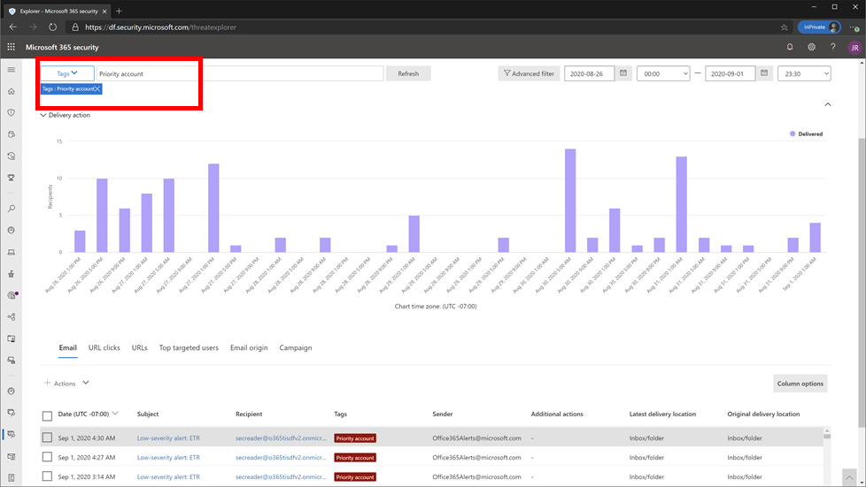
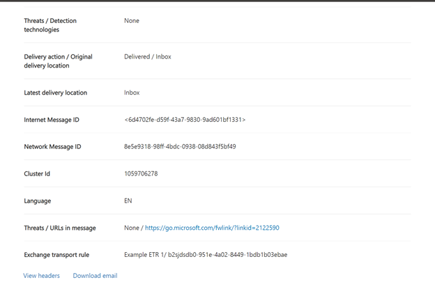

# Охота на угрозы в обозревателе угроз для Microsoft Defender для Office 365

В этой статье

- [Обозреватель угроз](#threat-explorer-walk-through)
- [Исследование электронной почты](#email-investigation)
- [Исправление электронной почты](#email-remediation)
- [Улучшения в области охоты на угрозы](#improvements-to-threat-hunting-experience)

> [!NOTE]
> Это часть трехсерийной серии по обозревателю угроз **(Explorer),** безопасности электронной почты **и** основам обнаружения explorer и в режиме реального времени **(например,** различия между инструментами и разрешениями, необходимыми для их работы).  Другие две статьи этой серии : безопасность электронной почты с помощью [обозревателя](email-security-in-microsoft-defender.md) угроз и обозревателя угроз и базов обнаружения [в режиме реального времени.](real-time-detections.md)

**Область применения**
- [Microsoft Defender для Office 365 (план 1 и план 2)](defender-for-office-365.md)
- [Microsoft 365 Defender](../defender/microsoft-365-defender.md)

Если в вашей организации есть [microsoft Defender для](defender-for-office-365.md)Office 365, и у вас  есть [разрешения,](#required-licenses-and-permissions)вы можете использовать обнаружения **Explorer** или в режиме реального времени для обнаружения и устранения угроз.

На портале Microsoft 365 Defender () перейдите к совместной работе & электронной почты, а затем выберите обнаружение Explorer или в <https://security.microsoft.com>   **режиме реального времени.** Чтобы сделать непосредственно на странице, используйте <https://security.microsoft.com/threatexplorer> или <https://security.microsoft.com/realtimereports>

С помощью этих средств можно выполнять перечисленные ниже действия.

- См. вредоносные программы, обнаруженные Microsoft 365 функциями безопасности
- Просмотр фишинговых URL-адресов и щелкните данные вердикта
- Запуск автоматизированного процесса расследования и ответа из представления в Explorer
- Изучение вредоносных сообщений электронной почты и других

Дополнительные сведения см. в [сообщении email security with Threat Explorer.](email-security-in-microsoft-defender.md)

## Обозреватель угроз

В Microsoft Defender для Office 365 существуют два плана подписки: Plan 1 и Plan 2. Средства для охоты на угрозы, управляемые вручную, существуют в обоих планах под разными именами и с различными возможностями.

Defender for Office 365 Plan 1 *использует* обнаружения в режиме реального времени , который является подмножество средства охоты Найт Explorer *(также* называемый *Explorer)* в плане 2. В этой серии статей большинство примеров были созданы с помощью полного обозревателя угроз. Администраторы должны проверить все действия в обнаружениях в режиме реального времени, чтобы узнать, где они применяются.

После того как вы перейдите в **Explorer,** по умолчанию, вы прибудете на страницу **Вредоносные** программы, но используйте падение **представления,** чтобы ознакомиться с вашими вариантами. Если вы охотитесь за фишингом или копаете в кампанию угроз, выберите эти представления.

> [!div class="mx-imgBorder"]
> 

После того, как пользователь операции безопасности (Sec Ops) выбирает данные, которые они хотят видеть, является ли область узкого представления,  как пользовательские **представления,** или более широкое представление, как все сообщения электронной почты, они могут использовать кнопку Отправитель для дальнейшего фильтрации. Не забудьте выбрать Обновление для выполнения действий фильтрации.

> [!div class="mx-imgBorder"]
> 

Уточнение фокуса в explorer или обнаружение в режиме реального времени можно мыслить в слоях. Первый — **Просмотр**. Второй можно подумать как *фильтрованный фокус*. Например, вы можете отследить действия, предпринятые при поиске угрозы, записав такие решения: Чтобы найти проблему в Explorer, я выбрал просмотр вредоносных программ с фокусом фильтра **получателя.** Это упрощает отслеживание действий.

> [!TIP]
> Если sec Ops использует теги для маркировки учетных записей, которые они считают высокооценными целями, они могут делать выборы, такие как просмотр фишинга с фокусом фильтра Теги (включив диапазон дат, если *используется)*.  Это покажет им все попытки фишинга, направленные на их высокие целевые значения пользователей во время диапазона времени (например, даты, когда некоторые фишинговые атаки происходят много для их отрасли).

Уточнения можно сделать в диапазоне дат с помощью элементов управления диапазоном дат. Здесь вы можете увидеть Обозреватель в **представлении вредоносных программ** с фокусом **фильтра технологии** обнаружения. Но это кнопка **Расширенный фильтр,** которая позволяет командам Sec Ops копать глубоко.

> [!div class="mx-imgBorder"]
> 

Щелкнув **расширенный** фильтр, всплывет панель, которая позволит охотникам sec Ops самостоятельно создавать запросы, позволяя им включать или исключать сведения, которые они должны видеть. И диаграмма, и таблица на странице Explorer будут отражать их результаты.

> [!div class="mx-imgBorder"]
> 

Используйте **кнопку Параметры Столбец,** чтобы получить наиболее полезные сведения на таблице:

> [!div class="mx-imgBorder"]
> 

> [!div class="mx-imgBorder"]
> 

В том же мьене убедитесь, что протестировать параметры отображения. Различные аудитории будут хорошо реагировать на различные презентации одинаковых данных. Для некоторых зрителей карта **"Происхождение** электронной почты" может показать, что угроза распространена или скрыта быстрее, чем параметр **отображения** Кампании рядом с ней. Sec Ops может использовать эти дисплеи, чтобы наилучшим образом сделать пункты, подчеркивая необходимость безопасности и защиты, или для более позднего сравнения, чтобы продемонстрировать эффективность своих действий.

> [!div class="mx-imgBorder"]
> 

> [!div class="mx-imgBorder"]
> 

### Исследование электронной почты

Когда вы видите подозрительное сообщение электронной почты, щелкните имя, чтобы расширить флажок справа. Здесь доступен баннер, который позволяет sec Ops видеть страницу сущности [электронной](mdo-email-entity-page.md) почты.

Страница сущности электронной почты объединяет содержимое, которое можно найти в статье **Details,** **Attachments**, **Devices,** но включает более организованные данные. Это включает в себя такие вещи, как результаты DMARC, простой текстовый дисплей заголовка электронной почты с вариантом копирования, сведения о вердикте о вложениях, которые были надежно взорваны, и файлы эти детонации упали (могут включать IP-адреса, которые были связаться и скриншоты страниц или файлов). Url-адреса и их решения также перечислены с аналогичными сведениями.

Когда вы достигнете этого этапа, страница сущности электронной почты будет иметь решающее значение для последнего шага —*исправление.*

> [!div class="mx-imgBorder"]
> 

> [!TIP]
> Дополнительные сведения о богатой странице сущности электронной почты (см. ниже на вкладке **Analysis),** включая результаты взорванных вложений, результаты для включенных URL-адресов и безопасный предварительный просмотр электронной почты, нажмите [здесь](mdo-email-entity-page.md).

> [!div class="mx-imgBorder"]
> 

### Исправление электронной почты

После того как человек Sec Ops определяет, что сообщение электронной почты представляет собой угрозу, следующий шаг обнаружения Explorer или в режиме реального времени устраняет угрозу и устраняет ее. Это можно сделать, вернувшись в Обозреватель угроз, выбрав почтовый ящик для проблемной электронной почты и используя кнопку **Действия.**

> [!div class="mx-imgBorder"]
> 

Здесь аналитик может принимать меры, такие как сообщение почты как спам, фишинг или вредоносные программы, контакты с получателями или дальнейшие расследования, которые могут включать запуск книг автоматического расследования и ответа (или AIR) (если у вас есть план 2). Или, почта также может быть отчитаться как чистая.

> [!div class="mx-imgBorder"]
> 

## Улучшения в области охоты на угрозы

### Alert ID

При переходе из оповещений в Обозреватель угроз представление будет фильтроваться по **alert ID**.  Это также применяется при обнаружении в режиме реального времени. Показаны сообщения, соответствующие определенному оповещению, а также общее число сообщений электронной почты. Вы сможете узнать, было ли сообщение частью оповещений, а также перейти от этого сообщения к связанному оповещению.

Наконец, в URL-адрес включен iD оповещений, например: `https://https://security.microsoft.com/viewalerts`

> [!div class="mx-imgBorder"]
> 

> [!div class="mx-imgBorder"]
> 

### Расширение лимита хранения и поиска данных Explorer (и обнаружения в режиме реального времени) для клиентов пробных периодов

В рамках этого изменения аналитики смогут искать и фильтровать данные электронной почты в течение 30 дней (увеличено с семи дней) при обнаружении в обозревателе угроз и в режиме реального времени для клиентов defender для Office P1 и P2. Это не влияет на производственных клиентов P1 и P2 E5, где по умолчанию хранения уже 30 дней.

### Обновленный лимит экспорта

Количество записей электронной почты, которые можно экспортировать из Обозревателя угроз, сейчас составляет 200 000 (было 9990). Набор столбцов, которые можно экспортировать, не изменяется.

### Теги в обозревателе угроз

> [!NOTE]
> Функция тегов пользователя находится в предварительной версии и может быть доступна не всем. Кроме того, предварительные просмотры могут изменяться. Сведения о расписании выпуска ознакомьтесь с Microsoft 365 плана.

Теги пользователей определяют определенные группы пользователей в Microsoft Defender для Office 365. Дополнительные сведения о тегах, включая лицензирование и конфигурацию, см. в [тегах User.](user-tags.md)

В Обозревателе угроз можно увидеть сведения о тегах пользователей в следующих действиях.

#### Представление сетки электронной почты

Когда аналитики смотрят на столбец **Теги** сетки электронной почты, они видят все теги, которые были применены к почтовым ящикам отправитель или получатель. По умолчанию сначала показаны системные теги, такие как *учетные* записи приоритетов.

> [!div class="mx-imgBorder"]
> 

#### Фильтрация

Теги можно использовать в качестве фильтров. Охота только на учетные записи приоритетов или использование определенных сценариев тегов пользователей таким образом. Можно также исключить результаты с определенными тегами. Объединяйте теги с другими фильтрами и диапазонами дат, чтобы сузить область исследования.

> [!div class="mx-imgBorder"]
> 

#### Вылет детализации электронной почты

Чтобы просмотреть отдельные теги для отправитель и получатель, выберите электронную почту, чтобы открыть вылет сведений о сообщении. На **вкладке Сводка** теги отправитель и получатель показаны отдельно. Сведения об отдельных тегах отправитель и получатель могут экспортироваться в качестве данных CSV.

> [!div class="mx-imgBorder"]
> 

Сведения о тегах также показаны в вылете url-адресов. Чтобы просмотреть его, перейдите в фишинг или все представления электронной почты > **URL-адрес** или вкладку **Щелчки** URL-адресов. Выберите отдельный url-адрес, чтобы узнать дополнительные сведения о щелчках для этого URL-адреса, включая все теги, связанные с этим щелчком.

### Обновленное представление Временной шкалы

> [!div class="mx-imgBorder"]
> 
>
Узнайте больше, посмотрев [это](https://www.youtube.com/watch?v=UoVzN0lYbfY&list=PL3ZTgFEc7LystRja2GnDeUFqk44k7-KXf&index=4) видео.

## Расширенные возможности

### Лучшие целевые пользователи

Топ семей вредоносных программ показывает **топ целевых пользователей в** разделе Вредоносные программы. Верхние целевые пользователи также будут расширены с помощью представлений фишинга и всех сообщений электронной почты. Аналитики смогут видеть топ-5 целевых пользователей, а также количество попыток для каждого пользователя в каждом представлении.

Пользователи операций безопасности смогут экспортировать список целевых пользователей, не более 3000, а также количество попыток для автономного анализа для каждого представления электронной почты. Кроме того, выбор количества попыток (например, 13 попыток на изображении ниже) откроет фильтрованное представление в Обозревателе угроз, чтобы вы могли видеть дополнительные сведения по электронной почте и угрозы для этого пользователя.

> [!div class="mx-imgBorder"]
> 

### Exchange правила транспорта

Группа операций безопасности сможет просматривать все правила транспорта Exchange (или правила потока почты), применяемые к сообщению, в представлении сетки электронной почты. Выберите **параметры Столбец** в сетке и добавьте **Exchange правила транспорта** из столбцов. Параметр Exchange транспортных правил также отображается в вылете **Details** в электронной почте.

Отображаются имена и GUID правил транспорта, применяемых к сообщению. Аналитики смогут искать сообщения с помощью имени правила транспорта. Это поиск CONTAINS, который означает, что вы также можете делать частичные поиски.

> [!IMPORTANT]
> Exchange поиска правил транспорта и доступности имен зависит от конкретной роли, назначенной вам. Для просмотра имен правил транспорта и поиска необходимо иметь одну из следующих ролей или разрешений. Однако даже без ролей или разрешений ниже аналитик может видеть метку правил транспорта и сведения GUID в сведениях электронной почты. Другие опытом просмотра записей в сетках электронной почты, вылеты электронной почты, фильтры и экспорт не затронуты.
>
> - Exchange Online Только - Предотвращение потери данных: все
> - Exchange Online Только - O365SupportViewConfig: Все
> - Microsoft Azure Active Directory или Exchange Online - администратор безопасности: все
> - Azure Active Directory или Exchange Online - Считыватель безопасности: все
> - Exchange Online Только - Правила транспорта: Все
> - Exchange Online Только — View-Only конфигурация: все
>
> В сетке электронной почты, вылете Подробные сведения и экспортируемом CSV etRs представлены с именем/GUID, как показано ниже.
>
> > [!div class="mx-imgBorder"]
> > 

### Входящие соединители

Соединители — это набор инструкций, которые настраивают потоки электронной почты в вашу Microsoft 365 или Office 365 организацию. Они позволяют применять любые ограничения безопасности или элементы управления. В Обозревателе угроз можно просматривать соединители, связанные с электронной почтой, и искать сообщения с помощью имен соединитеителей.

Поиск соединители — это запрос CONTAINS, что означает, что может работать частичный поиск по ключевым словам:

> [!div class="mx-imgBorder"]
> 

## Обязательные лицензии и разрешения

Вы должны иметь [Microsoft Defender для Office 365](defender-for-office-365.md) для использования обнаружения Explorer или в режиме реального времени.

- Explorer включен в Defender для Office 365 Plan 2.
- Отчет о обнаружениях в режиме реального времени включен в Defender для Office 365 плана 1.
- Планирование назначения лицензий для всех пользователей, которые должны быть защищены Defender для Office 365. Обнаружение explorer и в режиме реального времени показывает данные обнаружения для лицензированных пользователей.

Чтобы просмотреть и использовать обнаружения Explorer или в режиме реального времени, необходимо иметь следующие разрешения:

- Для портала Microsoft 365 Defender:
  - Управление организацией
  - Администратор безопасности (это может быть назначено в центре администрирования Azure Active Directory ( <https://aad.portal.azure.com> )
  - Читатель сведений о безопасности
- Для Exchange Online:
  - Управление организацией
  - Управление организацией только с правом на просмотр
  - Получатели только для чтения
  - Управление соответствием требованиям

Дополнительные информацию о ролях и разрешениях см. в следующих ресурсах:

- [Разрешения на портале Microsoft 365 Defender](permissions-microsoft-365-security-center.md)
- [Разрешения компонентов в Exchange Online](/exchange/permissions-exo/feature-permissions)
- [Exchange Online PowerShell](/powershell/exchange/exchange-online-powershell)

## Дополнительная информация

- [Поиск и изучение доставленной нежелательной почты](investigate-malicious-email-that-was-delivered.md)
- [Просмотр вредоносных файлов, обнаруженных в SharePoint Online, OneDrive и Microsoft Teams](mdo-for-spo-odb-and-teams.md)
- [Обзор представлений в Обозревателе угроз (и обнаружения в режиме реального времени)](threat-explorer-views.md)
- [отчет о состоянии защиты от угроз](view-email-security-reports.md#threat-protection-status-report);
- [Автоматизированный анализ угроз и реакция на угрозы в службе защиты от угроз (Майкрософт)](automated-investigation-response-office.md)
- [Изучение сообщений электронной почты на странице Сущности электронной почты](mdo-email-entity-page.md)
