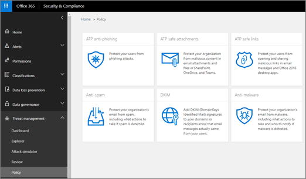

# Отслеживание угроз — новые и заслуживающие внимания

[!INCLUDE [Microsoft 365 Defender rebranding](../includes/microsoft-defender-for-office.md)]

**Область применения**
- [Microsoft Defender для Office 365 (план 2)](office-365-atp.md)
- [Microsoft 365 Defender](../mtp/microsoft-threat-protection.md)

[Возможности Office 365 Threat Investigation and Response](office-365-ti.md) позволяют группе безопасности вашей организации обнаруживть угрозы кибербезопасности и принимать меры в отношении них. Возможности Office 365 Threat Investigation and Response включают функции отслеживания угроз, в том числе заслуживающие внимания отслеживания. Ознакомьтесь с этой статьей, чтобы получить обзор этих новых функций и дальнейшие действия.

> [!IMPORTANT]
> Office 365 Threat Intelligence теперь является Microsoft Defender для Office 365 (план 2), а также дополнительными возможностями защиты от угроз. Дополнительные информации см. в описании планов и цен в Microsoft Defender для [Office 365,](https://products.office.com/exchange/advance-threat-protection) а также в описании службы [Microsoft Defender для Office 365.](https://docs.microsoft.com/office365/servicedescriptions/office-365-advanced-threat-protection-service-description)

## Что такое отслеживание угроз?

Отслеживание угроз — это информационные виджеты и представления, которые предоставляют вам аналитику по различным вопросам кибербезопасности, которые могут повлиять на вашу компанию. Например, можно просмотреть сведения о тенденциях вредоносных кампаний с помощью отслеживания угроз.

Большинство страниц отслеживания включают периодически обновляющиеся номера, виджеты, которые помогут вам понять, какие проблемы являются наибольшими  или стали самыми распространенными, а также быструю ссылку в столбце "Действия" в проводнике, где можно просмотреть более подробные сведения.

Trackers — лишь некоторые из многих отличных функций, которые вы получаете с [помощью Microsoft Defender для Office 365 (план 2).](office-365-ti.md) Отслеживание угроз включает [отслеживающие](#noteworthy-trackers)угрозы, [отслеживающие](#trending-trackers) [тенденции,](#tracked-queries)отслеживающие запросы и [сохраненные запросы.](#saved-queries)

Чтобы просмотреть и использовать отслеживание угроз для своей организации, перейдите в Центр безопасности и соответствия & () и выберите "Отслеживание угроз управления <https://protection.office.com>  \> **угрозами".**

> [!NOTE]
> Для использования отслеживания угроз необходимо быть глобальным администратором, администратором безопасности или читательом безопасности. См. ["Разрешения" в Центре безопасности & соответствия требованиям.](permissions-in-the-security-and-compliance-center.md)

### Заслуживающие внимания отслеживатели

Следует обратить внимание на то, что вы найдете большие и меньшие угрозы и риски, о которых, как мы считаем, вам следует знать. Заслуживающие внимания отслеживания помогают определить, существуют ли эти проблемы в вашей среде Microsoft 365, а также ссылки на статьи (например, эти статьи), которые дают вам дополнительные сведения о том, что происходит, и как они повратратно помогают вашей организации использовать Office 365. Является ли это большой новой угрозой (например, Wannacry, Petya) или существующей угрозой, которая может создать некоторые новые проблемы (например, наш другой адресный элемент Nemucod), здесь вы найдете важные новые элементы, которые вы и ваша группа безопасности должны периодически проверять и проверять.

Как правило, отслеживатели будут размещаться в течение пары недель, когда мы определяем новые угрозы и считаем, что вам может потребоваться дополнительная видимость этой функции. После того как будет пройден самый большой риск для угрозы, мы удалим этот элемент. Таким образом, мы можем поддерживать список в актуальном состоянии с другими соответствующими новыми элементами.

### Отслеживающие тенденции

Отслеживающие тенденции (ранее называемые кампаниями) выделяют новые угрозы, полученные в электронной почте организации за прошедшую неделю.

Отслеживающие тенденции дают вам представление о новых угрозах, которые следует проанализировать, чтобы обеспечить готовность вашей корпоративной среды к атакам в более широкой корпоративной среде.

### Отслеживаемая запроса

Отслеживаемая запроса использует сохраненные запросы для периодической оценки активности Microsoft 365 в вашей организации. Это дает вам тенденции событий, и в ближайшие месяцы будет больше. Отслеживаются запросы, которые запускаются автоматически, предоставляя вам сведения о времени, не запоминая повторно запускать запросы.

### Сохраненные запросы

Сохраненные запросы также находятся в разделе "Trackers". Сохраненные запросы можно использовать для хранения общих поисковых запросов в проводнике, которые необходимо возвращать к более быстрому и многократному, без необходимости повторного создания поиска каждый раз.

С помощью кнопки "Сохранить запрос" в верхней части страницы  проводника всегда можно сохранить запрос "Заслуживающий внимания" или любой из ваших собственных запросов проводника. Все, что там сохранено, будет по-разыскано в списке **сохраненных** запросов на странице "Отслеживание".

## Trackers and Explorer

Независимо от того, просматриваете ли вы электронную почту, содержимое или действия Office (в ближайшее время), обозреватель и отслеживающие действия помогут вам исследовать и отслеживать риски и угрозы безопасности. В совокупности trackers предоставляют вам информацию для защиты пользователей, выделяя новые, важные и часто отслеживаемые проблемы, обеспечивая более надную защиту вашего бизнеса при переходе в облако.

Помните, что вы всегда можете предоставить нам отзывы об этой или других  функций безопасности Microsoft 365, нажав кнопку "Отзывы" в правом нижнем углу обзора Центра безопасности и соответствия требованиям & соответствия [требованиям.](https://support.microsoft.com/office/a5f2fd18-b029-4257-b5a8-ae83e7768c85)

## Trackers and Microsoft Defender for Office 365

В связи с нашей надежной угрозой мы выделяем расширенные угрозы вредоносных программ, обнаруженные с помощью безопасных [вложений.](atp-safe-attachments.md) Если вы клиент Office 365 корпоративный E5 и не используете [Microsoft Defender для Office 365,](office-365-atp.md)вы должны быть включены в вашу подписку. Защитник Office 365 имеет значение, даже если у вас есть другие средства защиты, фильтрующие поток электронной почты со службами Office 365. Однако функции защиты от нежелательной почты и [безопасных ссылок](atp-safe-links.md) лучше всего работают, если основное решение для обеспечения безопасности электронной почты — Office 365.

В современном мире с угрозами запуск только традиционных сканирований на вредоносные программы означает, что вы недостаточно хорошо защищены от атак. Современные более сложные злоумышленники используют распространенные инструменты для создания новых, запутавных или отложенных атак, которые не распознаются традиционными антивредоносными механизмами на основе сигнатур. Функция безопасных вложений принимает вложения электронной почты и детонирует их в виртуальной среде, чтобы определить, являются ли они безопасными или вредоносными. Этот процесс детонации открывает каждый файл в среде виртуального компьютера, а затем следит за тем, что происходит после открытия файла. Будь то PDF-файл, сжатый файл или документ Office, вредоносный код можно скрыть в файле, активировав его только после того, как злоумышленник откроет его на своем компьютере. Путем детонации и анализа файла в потоке электронной почты функции Защитника Office 365 находят эти угрозы на основе поведения, репутации файла и ряда правил с помощью ауризма.

Новый фильтр важных угроз выделяет элементы, которые были недавно обнаружены с помощью функции "Безопасные вложения". Эти обнаружения представляют элементы, которые являются новыми вредоносными файлами, которые ранее не были найдены в Microsoft 365 в потоке электронной почты или электронной почте других клиентов. Обратите внимание на элементы в отслеживаемом угрозе, посмотрите, на кого они нацелены, и просмотрите сведения о детонации, показанные на вкладке "Расширенный анализ" (можно найти, щелкнув тему сообщения электронной почты в проводнике). Обратите внимание, что эта вкладка будет находиться только в сообщениях электронной почты, обнаруженных функцией "Безопасные вложения". Этот отслеживатель содержит этот фильтр, но вы также можете использовать этот фильтр для других поисковых запросов в проводнике.

## Дальнейшие действия

- If your organization doesn't already have these Office 365 Threat Investigation and Response [capabilities, see How do we get Office 365 Threat Investigation and Response capabilities?](office-365-ti.md).

- Убедитесь, что вашей группе безопасности назначены правильные роли и разрешения. Вы должны быть глобальным администратором или иметь роль администратора безопасности или поиска и очистки в Центре безопасности & соответствия требованиям. См. ["Разрешения" в Центре безопасности & соответствия требованиям.](permissions-in-the-security-and-compliance-center.md)

- Следите за тем, чтобы новые отслеживатели отыскались в среде Microsoft 365. Если он доступен, вы найдете здесь свои trackers. Go to **Threat management** \> **Threat trackers**.

- Если вы еще не сделали этого, узнайте больше о Microsoft Defender для [Office 365](office-365-atp.md) для своей организации, включая безопасные ссылки и безопасные [вложения.](atp-safe-attachments.md) 
