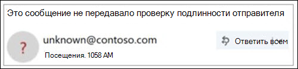
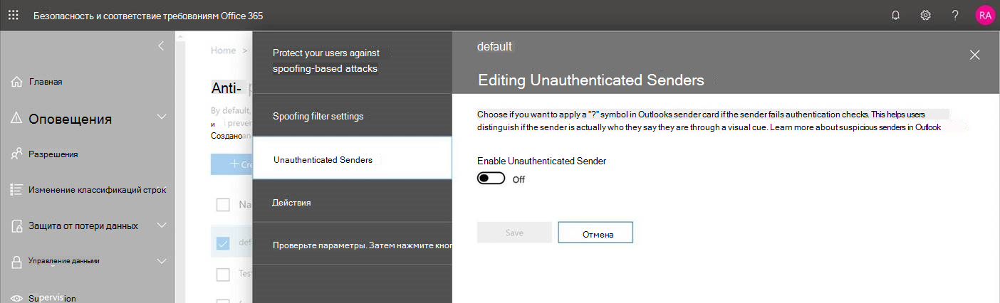

# Непроверенный отправитель

> [!NOTE]
> Эти обновления выводятся сейчас и могут быть недоступны для всех пользователей. Эта функция поддерживается для пользователей Enterprise Outlook.com и корпоративных приложений Win32 для Outlook. В настоящее время оно недоступно для пользователей Office 365.

Чтобы предотвратить доступ к почтовому ящику с помощью фишинговых сообщений, Office 365 проверяет, что отправители говорят о том, что они говорят о том, что они говорят о нежелательной почте и отмечают подозрительные сообщения.

> [!IMPORTANT]
> Если сообщение помечено как фишинг, Outlook отображает предупреждение в верхней части страницы, но все ссылки в сообщении все равно можно открыть.

## Как определить подозрительные сообщения в папке "Входящие"?

В Outlook отображаются индикаторы, когда отправитель сообщения не может быть идентифицирован или его удостоверение отличается от того, которое отображается в адресе отправителя.

## Отображается значок "?" в изображении отправителя

Когда Office 365 не удается проверить подлинность отправителя с помощью методик проверки подлинности электронной почты, в изображении отправителя отображается "?".

Не все сообщения, которые не прошли проверку подлинности, являются вредоносными. Однако следует быть внимательным при взаимодействии с сообщениями, которые не прошли проверку подлинности, если вы не распознаете отправителя. Или, если вы распознаете отправителя, который обычно не содержит "?" в изображении отправителя, но вы неожиданно видите его, это может быть подписание отправителя.

## Как управлять сообщениями, принимающими непроверенные отправители 

Если вы являетесь клиентом Office 365, вы можете управлять этим компонентом с помощью центра безопасности & соответствия требованиям Office 365.

- В центре безопасности & соответствия требованиям глобальные администраторы и администраторы безопасности могут включать и отключать эту функцию с помощью защиты от спуфинга в политике защиты от фишинга. Кроме того, вы можете использовать командлет **Set-AntiPhishPolicy** в Exchange Online PowerShell. Дополнительные сведения см [в статье Защита от фишинга в Office 365](anti-phishing-protection.md) и [Set-AntiPhishPolicy](https://docs.microsoft.com/powershell/module/exchange/advanced-threat-protection/set-antiphishpolicy).

    

- Если администратор определил ложное срабатывание, а отправитель не должен получать непроверенную обработку отправителя, можно выполнить одно из следующих действий, чтобы добавить отправителя в список разрешенных поддельных поддельных поддельных поддельных поддельных подделки:

  - Добавьте доменную связь с помощью анализа сведений о подделких. Дополнительные сведения [: обзор подделки информации](walkthrough-spoof-intelligence-insight.md).

  - Добавьте доменную комбинацию с помощью командлета **Set-PhishFilterPolicy** в Exchange Online PowerShell. Дополнительные сведения: [Set-PhishFilterPolicy](https://docs.microsoft.com/powershell/module/exchange/advanced-threat-protection/set-phishfilterpolicy) и [Настройка антифишинга Office 365 ATP и политики защиты от фишинга](set-up-anti-phishing-policies.md).

Кроме того, мы не будем применять непроверенный отправитель, если сообщение было доставлено в папку "Входящие" с помощью правил для почтового процесса (которые также называются правилами транспорта) или списком безопасных доменов (политик защиты от нежелательной почты).

## Как управлять тегом "Via" 

Если вы являетесь клиентом Office 365, вы можете управлять этим компонентом с помощью центра безопасности & соответствия требованиям Office 365, аналогично тому, как вы управляете непроверенным способом отправителя. Если добавить отправителя в список разрешенных поддельных поддельных поддельных поддельных поддельных поддельных поддельных подделкий, то обработка

## Вопросы и ответы

### В каких критериях Outlook.com и Outlook для рабочего стола Win32 используется для добавления свойств "?" и "Via"?

Для "?" в образе отправителя: Outlook.com требует, чтобы сообщение передавало либо проверку подлинности SPF, либо проверку подлинности DKIM, либо был получен либо проход dMarc, либо составной проход проверки подлинности из службы Office 365 спуфинг. Дополнительные сведения см. в статье [Set up SPF in Office 365, чтобы предотвратить спуфинг](set-up-spf-in-office-365-to-help-prevent-spoofing.md) и [использовать DKIM для проверки исходящей электронной почты, отправленной из личного домена в Office 365](use-dkim-to-validate-outbound-email.md).

Для тега Via: Если домен, указанный в адресе отправителя, отличается от домена в подписи DKIM или в SMTP-почте FROM, Outlook.com отображает домен в одном из этих двух полей (предложив подпись DKIM).

### Как удалить "?", не используя список разрешенных поддельных поддельных поддельных поддельных подделки?

Для "?" в изображении отправителя: в качестве отправителя необходимо проверить подлинность сообщения с помощью SPF или DKIM.

Для тега Via: в качестве отправителя необходимо убедиться, что домен в подписи DKIM или SMTP-почте — то же, что и, или является поддоменом домена, в адресе отправителя.

### Outlook.com и Outlook для рабочего стола Win32 показывать это сообщение для каждого сообщения, которое не проходит проверку подлинности?

Не обязательно. Кроме того, для проверки подлинности отправителя в Office 365 могут быть другими свойствами сообщения.

## Статьи по теме

[Защитите свою учетную запись электронной почты Outlook.com](https://support.microsoft.com/en-us/office/help-protect-your-outlook-com-email-account-a4f20fc5-4307-4ece-8231-6d4d4bd8a9ba)

[Работа с фишингом или подменой в Outlook.com](https://support.office.com/article/0d882ea5-eedc-4bed-aebc-079ffa1105a3)

[Фильтрация нежелательной почты и спама в Outlook в Интернете](https://support.office.com/article/db786e79-54e2-40cc-904f-d89d57b7f41d)
