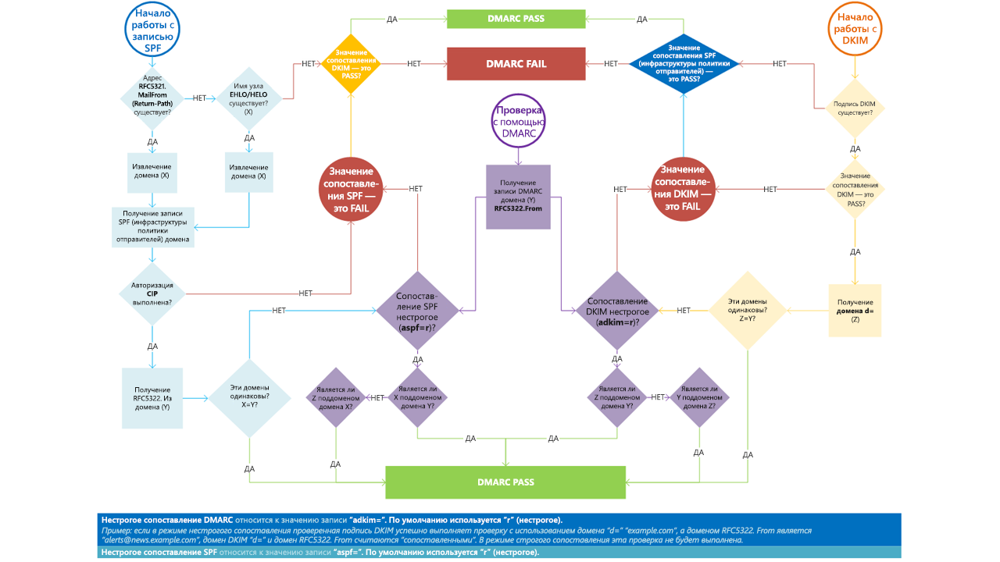

# <a name="use-dmarc-to-validate-email"></a><span data-ttu-id="3eb17-103">Использование протокола DMARC для проверки электронной почты</span><span class="sxs-lookup"><span data-stu-id="3eb17-103">Use DMARC to validate email</span></span>

[!INCLUDE [Microsoft 365 Defender rebranding](../includes/microsoft-defender-for-office.md)]

<span data-ttu-id="3eb17-104">**Область применения**</span><span class="sxs-lookup"><span data-stu-id="3eb17-104">**Applies to**</span></span>
- [<span data-ttu-id="3eb17-105">Exchange Online Protection</span><span class="sxs-lookup"><span data-stu-id="3eb17-105">Exchange Online Protection</span></span>](exchange-online-protection-overview.md)
- [<span data-ttu-id="3eb17-106">Microsoft Defender для Office 365 (план 1 и план 2)</span><span class="sxs-lookup"><span data-stu-id="3eb17-106">Microsoft Defender for Office 365 plan 1 and plan 2</span></span>](defender-for-office-365.md)
- [<span data-ttu-id="3eb17-107">Microsoft 365 Defender</span><span class="sxs-lookup"><span data-stu-id="3eb17-107">Microsoft 365 Defender</span></span>](../defender/microsoft-365-defender.md)

<span data-ttu-id="3eb17-p101">Протокол [DMARC](https://dmarc.org) (Domain-based Message Authentication, Reporting, and Conformance) используется в сочетании с инфраструктурой политики отправителей (SPF) и механизмом DKIM (DomainKeys Identified Mail) для проверки подлинности отправителей и подтверждения того, что сообщения, отправленные в конечные почтовые системы из вашего домена, являются доверенными. Использование технологии DMARC вместе с SPF и DKIM обеспечит дополнительную защиту от поддельной электронной почты. DMARC помогает получающим почтовым системам определить, что делать с сообщениями, отправленными из вашего домена, которые не прошли проверки SPF или DKIM.</span><span class="sxs-lookup"><span data-stu-id="3eb17-p101">Domain-based Message Authentication, Reporting, and Conformance ([DMARC](https://dmarc.org)) works with Sender Policy Framework (SPF) and DomainKeys Identified Mail (DKIM) to authenticate mail senders and ensure that destination email systems trust messages sent from your domain. Implementing DMARC with SPF and DKIM provides additional protection against spoofing and phishing email. DMARC helps receiving mail systems determine what to do with messages sent from your domain that fail SPF or DKIM checks.</span></span>

> [!TIP]
> <span data-ttu-id="3eb17-111">Посетите каталог [Ассоциации информационной безопасности Майкрософт (MISA)](https://www.microsoft.com/misapartnercatalog), чтобы просмотреть сторонних поставщиков, предлагающих услуги отчетности DMARC для Microsoft 365.</span><span class="sxs-lookup"><span data-stu-id="3eb17-111">Visit the [Microsoft Intelligent Security Association (MISA)](https://www.microsoft.com/misapartnercatalog) catalog to view third-party vendors offering DMARC reporting for Microsoft 365.</span></span>

## <a name="how-do-spf-and-dmarc-work-together-to-protect-email-in-microsoft-365"></a><span data-ttu-id="3eb17-112">Как SPF в сочетании с протоколом DMARC обеспечивают защиту электронной почты в Microsoft 365?</span><span class="sxs-lookup"><span data-stu-id="3eb17-112">How do SPF and DMARC work together to protect email in Microsoft 365?</span></span>

 <span data-ttu-id="3eb17-p102">Электронное сообщение может содержать несколько адресов отправителей. Эти адреса могут использоваться для различных целей. Вот примеры некоторых таких адресов.</span><span class="sxs-lookup"><span data-stu-id="3eb17-p102">An email message may contain multiple originator or sender addresses. These addresses are used for different purposes. For example, consider these addresses:</span></span>

- <span data-ttu-id="3eb17-p103">**"Mail From" address** — указывает отправителя и адрес, на который следует отправлять уведомления о возврате, если возникнут проблемы с доставкой сообщения. Этот адрес задан в конверте сообщения и обычно не отображается почтовым приложением. Он иногда называется адресом 5321.MailFrom или адресом reverse-path.</span><span class="sxs-lookup"><span data-stu-id="3eb17-p103">**"Mail From" address**: Identifies the sender and specifies where to send return notices if any problems occur with the delivery of the message, such as non-delivery notices. This appears in the envelope portion of an email message and is not usually displayed by your email application. This is sometimes called the 5321.MailFrom address or the reverse-path address.</span></span>

- <span data-ttu-id="3eb17-p104">**"From" address** — адрес, который указывается в почтовом приложении как адрес отправителя. Этот адрес указывает автора сообщения электронной почты, вернее почтовый ящик человека или системы. Это поле иногда зовется адресом 5322.From.</span><span class="sxs-lookup"><span data-stu-id="3eb17-p104">**"From" address**: The address displayed as the From address by your mail application. This address identifies the author of the email. That is, the mailbox of the person or system responsible for writing the message. This is sometimes called the 5322.From address.</span></span>

<span data-ttu-id="3eb17-p105">Для предоставления списка авторизованных IP-адресов отправки для указанного домена инфраструктура SPF использует запись DNS TXT. Как правило, проверки SPF выполняются только для адреса 5321.MailFrom. Это означает, что если используется только инфраструктура SPF, то проверка подлинности адреса 5322.From не выполняется. Такое поведение приводит к возникновению ситуаций, когда пользователь может получить сообщение с поддельного адреса 5322.From, которое, тем не менее, успешно прошло проверку SPF. Например, рассмотрим следующую запись SMTP:</span><span class="sxs-lookup"><span data-stu-id="3eb17-p105">SPF uses a DNS TXT record to provide a list of authorized sending IP addresses for a given domain. Normally, SPF checks are only performed against the 5321.MailFrom address. This means that the 5322.From address is not authenticated when you use SPF by itself. This allows for a scenario where a user can receive a message which passes an SPF check but has a spoofed 5322.From sender address. For example, consider this SMTP transcript:</span></span>

```console
S: Helo woodgrovebank.com
S: Mail from: phish@phishing.contoso.com
S: Rcpt to: astobes@tailspintoys.com
S: data
S: To: "Andrew Stobes" <astobes@tailspintoys.com>
S: From: "Woodgrove Bank Security" <security@woodgrovebank.com>
S: Subject: Woodgrove Bank - Action required
S:
S: Greetings User,
S:
S: We need to verify your banking details.
S: Please click the following link to verify that we have the right information for your account.
S:
S: https://short.url/woodgrovebank/updateaccount/12-121.aspx
S:
S: Thank you,
S: Woodgrove Bank
S: .
```

<span data-ttu-id="3eb17-128">В этой записи имеются следующие адреса отправителей:</span><span class="sxs-lookup"><span data-stu-id="3eb17-128">In this transcript, the sender addresses are as follows:</span></span>

- <span data-ttu-id="3eb17-129">Адрес отправителя (5321.MailFrom): phish@phishing.contoso.com</span><span class="sxs-lookup"><span data-stu-id="3eb17-129">Mail from address (5321.MailFrom): phish@phishing.contoso.com</span></span>

- <span data-ttu-id="3eb17-130">Адрес "От" (5322.From): security@woodgrovebank.com</span><span class="sxs-lookup"><span data-stu-id="3eb17-130">From address (5322.From): security@woodgrovebank.com</span></span>

<span data-ttu-id="3eb17-p106">Если вы настроили SPF, то принимающий сервер проверяет адрес "Отправитель" phish@phishing.contoso.com. Если сообщение получено из допустимого источника для домена phishing.contoso.com, то проверка SPF проходит успешно. Поскольку в почтовом клиенте отображается только адрес "От", пользователь видит, что это письмо отправлено с адреса security@woodgrovebank.com. Ввиду того, что использовалась лишь одна инфраструктура SPF, проверка допустимости адреса woodgrovebank.com никогда не выполнялась.</span><span class="sxs-lookup"><span data-stu-id="3eb17-p106">If you configured SPF, then the receiving server performs a check against the Mail from address phish@phishing.contoso.com. If the message came from a valid source for the domain phishing.contoso.com then the SPF check passes. Since the email client only displays the From address, the user sees that this message came from security@woodgrovebank.com. With SPF alone, the validity of woodgrovebank.com was never authenticated.</span></span>

<span data-ttu-id="3eb17-p107">Если используется DMARC, принимающий сервер также проверяет адрес "От". В примере выше, если имеется запись DMARC TXT для адреса woodgrovebank.com, то проверка адреса "От" завершится сбоем.</span><span class="sxs-lookup"><span data-stu-id="3eb17-p107">When you use DMARC, the receiving server also performs a check against the From address. In the example above, if there is a DMARC TXT record in place for woodgrovebank.com, then the check against the From address fails.</span></span>

## <a name="what-is-a-dmarc-txt-record"></a><span data-ttu-id="3eb17-137">Что такое запись DMARC TXT?</span><span class="sxs-lookup"><span data-stu-id="3eb17-137">What is a DMARC TXT record?</span></span>

<span data-ttu-id="3eb17-p108">Аналогично записям DNS для SPF, запись для DMARC представляет собой текстовую запись DNS (TXT), которая позволяет предотвратить спуфинг и фишинг. Записи DMARC TXT публикуются в DNS. Записи DMARC TXT позволяют проверить происхождение сообщения электронной почты путем сверки IP-адреса автора письма с предполагаемым владельцем отправляющего домена. Запись DMARC TXT позволяет определить уполномоченные серверы исходящей электронной почты. Конечные почтовые системы в свою очередь проверяют, были ли получаемые сообщения отправлены уполномоченными серверами исходящей электронной почты.</span><span class="sxs-lookup"><span data-stu-id="3eb17-p108">Like the DNS records for SPF, the record for DMARC is a DNS text (TXT) record that helps prevent spoofing and phishing. You publish DMARC TXT records in DNS. DMARC TXT records validate the origin of email messages by verifying the IP address of an email's author against the alleged owner of the sending domain. The DMARC TXT record identifies authorized outbound email servers. Destination email systems can then verify that messages they receive originate from authorized outbound email servers.</span></span>

<span data-ttu-id="3eb17-143">Запись DMARC TXT корпорации Майкрософт имеет примерно следующий вид:</span><span class="sxs-lookup"><span data-stu-id="3eb17-143">Microsoft's DMARC TXT record looks something like this:</span></span>

```console
_dmarc.microsoft.com.   3600    IN      TXT     "v=DMARC1; p=none; pct=100; rua=mailto:d@rua.agari.com; ruf=mailto:d@ruf.agari.com; fo=1"
```

<span data-ttu-id="3eb17-144">Корпорация Майкрософт отправляет свои отчеты DMARC сторонней компании [Agari](https://agari.com).</span><span class="sxs-lookup"><span data-stu-id="3eb17-144">Microsoft sends its DMARC reports to [Agari](https://agari.com), a third party.</span></span> <span data-ttu-id="3eb17-145">Эта компания собирает и анализирует полученные отчеты.</span><span class="sxs-lookup"><span data-stu-id="3eb17-145">Agari collects and analyzes DMARC reports.</span></span> <span data-ttu-id="3eb17-146">Посетите [каталог MISA](https://www.microsoft.com/misapartnercatalog), чтобы просмотреть других сторонних поставщиков, предлагающих услуги отчетности DMARC для Microsoft 365.</span><span class="sxs-lookup"><span data-stu-id="3eb17-146">Please visit the [MISA catalog](https://www.microsoft.com/misapartnercatalog) to view more third-party vendors offering DMARC reporting for Microsoft 365.</span></span>

## <a name="set-up-dmarc-for-inbound-mail"></a><span data-ttu-id="3eb17-147">Настройка протокола DMARC для входящей почты</span><span class="sxs-lookup"><span data-stu-id="3eb17-147">Set up DMARC for inbound mail</span></span>

<span data-ttu-id="3eb17-p110">Вам не нужно абсолютно ничего делать, чтобы настроить протокол DMARC в отношении почты, которую вы получаете в Microsoft 365. Мы позаботились об этом за вас. Если хотите узнать, что происходит с почтой, которая не прошла наши проверки DMARC, ознакомьтесь c разделом [Как Microsoft 365 обрабатывает входящую почту, не прошедшую проверки DMARC](#how-microsoft-365-handles-inbound-email-that-fails-dmarc).</span><span class="sxs-lookup"><span data-stu-id="3eb17-p110">You don't have to do a thing to set up DMARC for mail that you receive in Microsoft 365. We've taken care of everything for you. If you want to learn what happens to mail that fails to pass our DMARC checks, see [How Microsoft 365 handles inbound email that fails DMARC](#how-microsoft-365-handles-inbound-email-that-fails-dmarc).</span></span>

## <a name="set-up-dmarc-for-outbound-mail-from-microsoft-365"></a><span data-ttu-id="3eb17-151">Настройка DMARC для исходящей почты из Microsoft 365</span><span class="sxs-lookup"><span data-stu-id="3eb17-151">Set up DMARC for outbound mail from Microsoft 365</span></span>

<span data-ttu-id="3eb17-p111">Если вы пользуетесь Microsoft 365 без личного домена, то есть используете домен onmicrosoft.com, вам не нужно ничего делать, чтобы настроить или реализовать DMARC для своей организации. Инфраструктура политики отправителей уже автоматически настроена, и в Microsoft 365 автоматически создается подпись DKIM для исходящей почты. Дополнительные сведения об этой подписи см. в разделе [Настройка по умолчанию для DKIM и Microsoft 365](use-dkim-to-validate-outbound-email.md#DefaultDKIMbehavior).</span><span class="sxs-lookup"><span data-stu-id="3eb17-p111">If you use Microsoft 365 but you aren't using a custom domain, that is, you use onmicrosoft.com, you don't need to do anything else to configure or implement DMARC for your organization. SPF is already set up for you and Microsoft 365 automatically generates a DKIM signature for your outgoing mail. For more information about this signature, see [Default behavior for DKIM and Microsoft 365](use-dkim-to-validate-outbound-email.md#DefaultDKIMbehavior).</span></span>

 <span data-ttu-id="3eb17-p112">Если у вас есть личный домен или помимо Microsoft 365 вы также используете локальные серверы Exchange, необходимо вручную реализовать DMARC для исходящей почты. Вот как реализовать DMARC для личного домена:</span><span class="sxs-lookup"><span data-stu-id="3eb17-p112">If you have a custom domain or you are using on-premises Exchange servers in addition to Microsoft 365, you need to manually implement DMARC for your outbound mail. Implementing DMARC for your custom domain includes these steps:</span></span>

- [<span data-ttu-id="3eb17-157">Шаг 1. Определение допустимых источников почты для домена</span><span class="sxs-lookup"><span data-stu-id="3eb17-157">Step 1: Identify valid sources of mail for your domain</span></span>](#step-1-identify-valid-sources-of-mail-for-your-domain)

- [<span data-ttu-id="3eb17-158">Шаг 2. Настройка SPF для вашего домена</span><span class="sxs-lookup"><span data-stu-id="3eb17-158">Step 2: Set up SPF for your domain</span></span>](#step-2-set-up-spf-for-your-domain)

- [<span data-ttu-id="3eb17-159">Шаг 3. Настройка DKIM для вашего личного домена</span><span class="sxs-lookup"><span data-stu-id="3eb17-159">Step 3: Set up DKIM for your custom domain</span></span>](#step-3-set-up-dkim-for-your-custom-domain)

- [<span data-ttu-id="3eb17-160">Шаг 4. Создание записи DMARC TXT для вашего домена</span><span class="sxs-lookup"><span data-stu-id="3eb17-160">Step 4: Form the DMARC TXT record for your domain</span></span>](#step-4-form-the-dmarc-txt-record-for-your-domain)

### <a name="step-1-identify-valid-sources-of-mail-for-your-domain"></a><span data-ttu-id="3eb17-161">Шаг 1. Определение допустимых источников почты для домена</span><span class="sxs-lookup"><span data-stu-id="3eb17-161">Step 1: Identify valid sources of mail for your domain</span></span>

<span data-ttu-id="3eb17-p113">Если вы уже настроили инфраструктуру SPF, то вы уже выполнили все необходимые действия. Тем не менее, существует ряд дополнительных факторов, которые следует учитывать при развертывании DMARC. При определении источников почты для домена вы должны задать себе два вопроса:</span><span class="sxs-lookup"><span data-stu-id="3eb17-p113">If you have already set up SPF then you have already gone through this exercise. However, for DMARC, there are additional considerations. When identifying sources of mail for your domain there are two questions you need to answer:</span></span>

- <span data-ttu-id="3eb17-165">Какие IP-адреса используются для отправки почты из моего домена?</span><span class="sxs-lookup"><span data-stu-id="3eb17-165">What IP addresses send messages from my domain?</span></span>

- <span data-ttu-id="3eb17-166">Будут ли совпадать домены в адресах 5321.MailFrom и 5322 в сообщениях, отправляемых третьими сторонами от моего имени?</span><span class="sxs-lookup"><span data-stu-id="3eb17-166">For mail sent from third parties on my behalf, will the 5321.MailFrom and 5322.From domains match?</span></span>

### <a name="step-2-set-up-spf-for-your-domain"></a><span data-ttu-id="3eb17-167">Шаг 2. Настройка SPF для вашего домена</span><span class="sxs-lookup"><span data-stu-id="3eb17-167">Step 2: Set up SPF for your domain</span></span>

<span data-ttu-id="3eb17-168">Теперь, когда у вас есть список всех допустимых отправителей, можно приступать к выполнению инструкций из статьи [Настройка SPF для предотвращения спуфинга](set-up-spf-in-office-365-to-help-prevent-spoofing.md).</span><span class="sxs-lookup"><span data-stu-id="3eb17-168">Now that you have a list of all your valid senders you can follow the steps to [Set up SPF to help prevent spoofing](set-up-spf-in-office-365-to-help-prevent-spoofing.md).</span></span>

<span data-ttu-id="3eb17-169">Например, предположим, что для отправки почты с домена contoso.com используются Exchange Online, локальный сервер Exchange с IP-адресом 192.168.0.1 и веб-приложение с IP-адресом 192.168.100.100. Тогда запись SPF TXT будет выглядеть следующим образом:</span><span class="sxs-lookup"><span data-stu-id="3eb17-169">For example, assuming contoso.com sends mail from Exchange Online, an on-premises Exchange server whose IP address is 192.168.0.1, and a web application whose IP address is 192.168.100.100, the SPF TXT record would look like this:</span></span>

```console
contoso.com  IN  TXT  " v=spf1 ip4:192.168.0.1 ip4:192.168.100.100 include:spf.protection.outlook.com -all"
```

<span data-ttu-id="3eb17-170">Рекомендуется, чтобы в записи SPF TXT учитывались сторонние отправители.</span><span class="sxs-lookup"><span data-stu-id="3eb17-170">As a best practice, ensure that your SPF TXT record takes into account third-party senders.</span></span>

### <a name="step-3-set-up-dkim-for-your-custom-domain"></a><span data-ttu-id="3eb17-171">Шаг 3. Настройка DKIM для вашего личного домена</span><span class="sxs-lookup"><span data-stu-id="3eb17-171">Step 3: Set up DKIM for your custom domain</span></span>

<span data-ttu-id="3eb17-p114">После настройки инфраструктуры SPF необходимо настроить метод DKIM. DKIM позволяет добавлять цифровую подпись в заголовки сообщений электронной почты. Если не настраивать DKIM и вместо этого позволить Microsoft 365 использовать для вашего домена конфигурацию DKIM по умолчанию, то это может привести к тому, что проверки DMARC будут завершаться сбоем. Это вызвано тем, что в конфигурации DKIM по умолчанию в качестве адреса 5322.From указан начальный домен onmicrosoft.com, а не ваш личный домен. Это приводит к несоответствию адресов 5321.MailFrom и 5322.From в сообщениях электронной почты, отправляемых из вашего домена.</span><span class="sxs-lookup"><span data-stu-id="3eb17-p114">Once you have set up SPF, you need to set up DKIM. DKIM lets you add a digital signature to email messages in the message header. If you do not set up DKIM and instead allow Microsoft 365 to use the default DKIM configuration for your domain, DMARC may fail. This is because the default DKIM configuration uses your initial onmicrosoft.com domain as the 5322.From address, not your custom domain. This forces a mismatch between the 5321.MailFrom and the 5322.From addresses in all email sent from your domain.</span></span>

<span data-ttu-id="3eb17-p115">Если у вас имеются сторонние отправители, которые отправляют почту от вашего имени, и адреса 5321.MailFrom и 5322.From в такой почте не совпадают, то проверки DMARC для такой почты будут завешаться сбоем. Чтобы избежать этого, необходимо настроить DKIM для своего домена с учетом сведений о таких сторонних отправителях. Это позволит Microsoft 365 проверять подлинность электронной почты из таких сторонних служб. Кроме того, с помощью этого метода другие почтовые системы, такие как Yahoo, Gmail и Comcast, могут проверять почту, отправляемую в эти системы сторонними почтовыми службами, так, будто она была отправлена вами. Преимущество этого заключается в том, что ваши клиенты могут устанавливать отношения доверия с вашим доменом, независимо от расположения вашего почтового ящика. Одновременно с этим, Office 365 не будет отмечать сообщения как спам из-за спуфинга, поскольку почта будет проходить проверку подлинности для вашего домена.</span><span class="sxs-lookup"><span data-stu-id="3eb17-p115">If you have third-party senders that send mail on your behalf and the mail they send has mismatched 5321.MailFrom and 5322.From addresses, DMARC will fail for that email. To avoid this, you need to set up DKIM for your domain specifically with that third-party sender. This allows Microsoft 365 to authenticate email from this 3rd-party service. However, it also allows others, for example, Yahoo, Gmail, and Comcast, to verify email sent to them by the third-party as if it was email sent by you. This is beneficial because it allows your customers to build trust with your domain no matter where their mailbox is located, and at the same time Microsoft 365 won't mark a message as spam due to spoofing because it passes authentication checks for your domain.</span></span>

<span data-ttu-id="3eb17-182">Инструкции по настройке DKIM для вашего домена, включая порядок настройки метода DKIM для сторонних отправителей, чтобы они могли подделывать ваш домен, см. в статье [Проверка исходящей электронной почты, отправляемой с личного домена, с помощью DKIM](use-dkim-to-validate-outbound-email.md).</span><span class="sxs-lookup"><span data-stu-id="3eb17-182">For instructions on setting up DKIM for your domain, including how to set up DKIM for third-party senders so they can spoof your domain, see [Use DKIM to validate outbound email sent from your custom domain](use-dkim-to-validate-outbound-email.md).</span></span>

### <a name="step-4-form-the-dmarc-txt-record-for-your-domain"></a><span data-ttu-id="3eb17-183">Шаг 4. Создание записи DMARC TXT для вашего домена</span><span class="sxs-lookup"><span data-stu-id="3eb17-183">Step 4: Form the DMARC TXT record for your domain</span></span>

<span data-ttu-id="3eb17-p116">В этом разделе описаны наиболее часто используемые варианты использования синтаксиса для Microsoft 365, хотя существуют и другие. Создайте запись DMARC TXT для вашего домена в следующем формате:</span><span class="sxs-lookup"><span data-stu-id="3eb17-p116">Although there are other syntax options that are not mentioned here, these are the most commonly used options for Microsoft 365. Form the DMARC TXT record for your domain in the format:</span></span>

```console
_dmarc.domain  TTL  IN  TXT  "v=DMARC1; p=policy; pct=100"
```

<span data-ttu-id="3eb17-186">где:</span><span class="sxs-lookup"><span data-stu-id="3eb17-186">where:</span></span>

- <span data-ttu-id="3eb17-p117">*domain* — домен, который нужно защитить. По умолчанию запись защищает почту из домена и всех его поддоменов. Например, если указать \_dmarc.contoso.com, то DMARC будет обеспечивать защиту из этого домена и всех его поддоменов, таких как housewares.contoso.com или plumbing.contoso.com.</span><span class="sxs-lookup"><span data-stu-id="3eb17-p117">*domain* is the domain you want to protect. By default, the record protects mail from the domain and all subdomains. For example, if you specify \_dmarc.contoso.com, then DMARC protects mail from the domain and all subdomains, such as housewares.contoso.com or plumbing.contoso.com.</span></span>

- <span data-ttu-id="3eb17-p118">*TTL* — этот параметр всегда должен быть равен одному часу. Срок жизни (TTL) измеряется либо в часах (1 час), либо в минутах (60 минут) или в секундах (3600 секунд). Это зависит от регистратора доменных имен.</span><span class="sxs-lookup"><span data-stu-id="3eb17-p118">*TTL* should always be the equivalent of one hour. The unit used for TTL, either hours (1 hour), minutes (60 minutes), or seconds (3600 seconds), will vary depending on the registrar for your domain.</span></span>

- <span data-ttu-id="3eb17-192">*pct=100* — обозначает, что это правило следует применять в отношении абсолютно всей почты.</span><span class="sxs-lookup"><span data-stu-id="3eb17-192">*pct=100* indicates that this rule should be used for 100% of email.</span></span>

- <span data-ttu-id="3eb17-p119">*policy* — определяет политику, которой должен руководствоваться принимающий сервер в случае, если почта не прошла проверки DMARC. Для этого параметра можно задать значение "none", "quarantine" или "reject".</span><span class="sxs-lookup"><span data-stu-id="3eb17-p119">*policy* specifies what policy you want the receiving server to follow if DMARC fails. You can set the policy to none, quarantine, or reject.</span></span>

<span data-ttu-id="3eb17-195">Чтобы узнать больше о параметрах, которые следует использовать, ознакомьтесь с понятиями, изложенными в разделе [Рекомендации по реализации протокола DMARC в Microsoft 365](#best-practices-for-implementing-dmarc-in-microsoft-365).</span><span class="sxs-lookup"><span data-stu-id="3eb17-195">For information about which options to use, become familiar with the concepts in [Best practices for implementing DMARC in Microsoft 365](#best-practices-for-implementing-dmarc-in-microsoft-365).</span></span>

<span data-ttu-id="3eb17-196">Примеры:</span><span class="sxs-lookup"><span data-stu-id="3eb17-196">Examples:</span></span>

- <span data-ttu-id="3eb17-197">Параметру "policy" присвоено значение "none"</span><span class="sxs-lookup"><span data-stu-id="3eb17-197">Policy set to none</span></span>

    ```console
    _dmarc.contoso.com 3600 IN  TXT  "v=DMARC1; p=none"
    ```

- <span data-ttu-id="3eb17-198">Параметру "policy" присвоено значение "quarantine"</span><span class="sxs-lookup"><span data-stu-id="3eb17-198">Policy set to quarantine</span></span>

    ```console
    _dmarc.contoso.com 3600 IN  TXT  "v=DMARC1; p=quarantine"
    ```

- <span data-ttu-id="3eb17-199">Параметру "policy" присвоено значение "reject"</span><span class="sxs-lookup"><span data-stu-id="3eb17-199">Policy set to reject</span></span>

    ```console
    _dmarc.contoso.com  3600 IN  TXT  "v=DMARC1; p=reject"
    ```

<span data-ttu-id="3eb17-p120">Создав запись, необходимо обновить ее у регистратора доменных имен. Инструкции по добавлению записи DMARC TXT в свои записи DNS для Microsoft 365 см. в статье [Создание записей DNS для Microsoft 365 при самостоятельном управлении записями DNS](../../admin/get-help-with-domains/create-dns-records-at-any-dns-hosting-provider.md).</span><span class="sxs-lookup"><span data-stu-id="3eb17-p120">Once you have formed your record, you need to update the record at your domain registrar. For instructions on adding the DMARC TXT record to your DNS records for Microsoft 365, see [Create DNS records for Microsoft 365 when you manage your DNS records](../../admin/get-help-with-domains/create-dns-records-at-any-dns-hosting-provider.md).</span></span>

## <a name="dmarc-mail-public-preview-feature"></a><span data-ttu-id="3eb17-202">Почта DMARC (общедоступная предварительная версия)</span><span class="sxs-lookup"><span data-stu-id="3eb17-202">DMARC Mail (Public Preview feature)</span></span>
> [!CAUTION]
> <span data-ttu-id="3eb17-203">Сообщения могут рассылаться не ежедневно, а сам отчет может измениться во время общедоступной предварительной версии.</span><span class="sxs-lookup"><span data-stu-id="3eb17-203">Mails may not be sent out daily, and the report itself may change during public preview.</span></span>  <span data-ttu-id="3eb17-204">Электронные сообщения сводного отчета DMARC можно ожидать от учетных записей потребителей (таких как учетные записи hotmail.com, outlook.com или live.com).</span><span class="sxs-lookup"><span data-stu-id="3eb17-204">The DMARC aggregate report emails can be expected from the Consumer accounts (such as hotmail.com, outlook.com, or live.com accounts).</span></span>

<span data-ttu-id="3eb17-205">В этом примере запись типа TXT DMARC **_dmarc.microsoft.com.   3600    IN      TXT     "v=DMARC1; p=none; pct=100; rua=mailto:d@rua.agari.com; ruf=mailto:d@ruf.agari.com; fo=1"** можно увидеть адрес *rua*, который в данном случае обрабатывается сторонней компанией Agari.</span><span class="sxs-lookup"><span data-stu-id="3eb17-205">In this example DMARC TXT record **_dmarc.microsoft.com.   3600    IN      TXT     "v=DMARC1; p=none; pct=100; rua=mailto:d@rua.agari.com; ruf=mailto:d@ruf.agari.com; fo=1"** you can see the *rua* address, in this case, processed by third-party company Agari.</span></span> <span data-ttu-id="3eb17-206">Этот адрес используется для отправки "сводного отзыва" для анализа и создания отчета.</span><span class="sxs-lookup"><span data-stu-id="3eb17-206">This address is used to send 'aggregate feedback' for analysis, and which is used to generate a report.</span></span>

> [!TIP]
> <span data-ttu-id="3eb17-207">Посетите [каталог MISA](https://www.microsoft.com/misapartnercatalog), чтобы просмотреть других сторонних поставщиков, предлагающих услуги отчетности DMARC для Microsoft 365.</span><span class="sxs-lookup"><span data-stu-id="3eb17-207">Please visit the [MISA catalog](https://www.microsoft.com/misapartnercatalog) to view more third-party vendors offering DMARC reporting for Microsoft 365.</span></span> <span data-ttu-id="3eb17-208">Дополнительные сведения об адресах rua DMARC см. в статье [Доменная проверка подлинности сообщений, создание отчетов и соответствие IETF.org (DMARC)](https://datatracker.ietf.org/doc/html/rfc7489).</span><span class="sxs-lookup"><span data-stu-id="3eb17-208">See [IETF.org's 'Domain-based Message Authentication, Reporting, and Conformance (DMARC)'](https://datatracker.ietf.org/doc/html/rfc7489) for more information on DMARC 'rua' addresses.</span></span>

## <a name="best-practices-for-implementing-dmarc-in-microsoft-365"></a><span data-ttu-id="3eb17-209">Рекомендации по реализации протокола DMARC в Microsoft 365</span><span class="sxs-lookup"><span data-stu-id="3eb17-209">Best practices for implementing DMARC in Microsoft 365</span></span>

<span data-ttu-id="3eb17-p124">Реализовать DMARC можно постепенно, чтобы это не влияло на остальной поток обработки почты. Создайте и внедрите план расширения, руководствуясь приведенными ниже действиями. Прежде чем переходить к следующему действию, каждое из этих действий следует сначала выполнить в отношении поддомена, других поддоменов и, наконец, в отношении домена верхнего уровня.</span><span class="sxs-lookup"><span data-stu-id="3eb17-p124">You can implement DMARC gradually without impacting the rest of your mail flow. Create and implement a roll-out plan that follows these steps. Do each of these steps first with a sub-domain, then other sub-domains, and finally with the top-level domain in your organization before moving on to the next step.</span></span>

1. <span data-ttu-id="3eb17-213">Организуйте отслеживание влияния реализации DMARC</span><span class="sxs-lookup"><span data-stu-id="3eb17-213">Monitor the impact of implementing DMARC</span></span>

    <span data-ttu-id="3eb17-p125">Начните с простой записи режима отслеживания для поддомена или домена, запрашивающих у получателей DMARC отправку статистики о сообщениях, которые, как им видно, используют ваш домен. Запись режима отслеживания  это запись DMARC TXT, в которой параметру политики присвоено значение "none" (p=none). Многие компании публикуют записи DMARC TXT с параметром "p=none", поскольку они точно не знают, какой объем почты они могут потерять, если применят более строгую политику DMARC.</span><span class="sxs-lookup"><span data-stu-id="3eb17-p125">Start with a simple monitoring-mode record for a sub-domain or domain that requests that DMARC receivers send you statistics about messages that they see using that domain. A monitoring-mode record is a DMARC TXT record that has its policy set to none (p=none). Many companies publish a DMARC TXT record with p=none because they are unsure about how much email they may lose by publishing a more restrictive DMARC policy.</span></span>

    <span data-ttu-id="3eb17-p126">Это можно сделать даже до реализации SPF или метода DKIM в своей инфраструктуре обмена сообщениями. Однако вы не сможете организовать эффективное помещение почты в карантин или ее отклонение с помощью DMARC, пока также не реализуете SPF и DKIM. После внедрения SPF и DKIM в отчетах, создаваемых DMARC, будут указываться сведения о количестве и источниках сообщений, прошедших проверки, а также тех, которые не прошли их. Можно с легкостью увидеть, какой объем допустимого трафика подвергается проверкам, а какой  нет. После чего можно устранить любые возникшие проблемы. Вы также сможете увидеть объем отправляемых мошеннических сообщений и их источники.</span><span class="sxs-lookup"><span data-stu-id="3eb17-p126">You can do this even before you've implemented SPF or DKIM in your messaging infrastructure. However, you won't be able to effectively quarantine or reject mail by using DMARC until you also implement SPF and DKIM. As you introduce SPF and DKIM, the reports generated through DMARC will provide the numbers and sources of messages that pass these checks, and those that don't. You can easily see how much of your legitimate traffic is or isn't covered by them, and troubleshoot any problems. You'll also begin to see how many fraudulent messages are being sent, and from where.</span></span>

2. <span data-ttu-id="3eb17-222">Запросите у внешних почтовых систем помещение на карантин почты, не прошедшей проверки DMARC</span><span class="sxs-lookup"><span data-stu-id="3eb17-222">Request that external mail systems quarantine mail that fails DMARC</span></span>

    <span data-ttu-id="3eb17-p127">Если вы полагаете, что весь или почти весь ваш допустимый трафик защищен с помощью инфраструктуры SPF и DKIM, а также понимаете последствия реализации протокола DMARC, можно внедрить политику карантина. Политика карантина  это запись DMARC TXT, в которой параметру политики присвоено значение "quarantine" (p=quarantine). Таким образом вы просите получателей DMARC помещать сообщения из вашего домена, которые не прошли проверки DMARC, в локальный аналог папки нежелательной почты, а не в папки входящей почты ваших клиентов.</span><span class="sxs-lookup"><span data-stu-id="3eb17-p127">When you believe that all or most of your legitimate traffic is protected by SPF and DKIM, and you understand the impact of implementing DMARC, you can implement a quarantine policy. A quarantine policy is a DMARC TXT record that has its policy set to quarantine (p=quarantine). By doing this, you are asking DMARC receivers to put messages from your domain that fail DMARC into the local equivalent of a spam folder instead of your customers' inboxes.</span></span>

3. <span data-ttu-id="3eb17-226">Запросите у внешних почтовых систем не принимать сообщения, не прошедшие проверки DMARC</span><span class="sxs-lookup"><span data-stu-id="3eb17-226">Request that external mail systems not accept messages that fail DMARC</span></span>

    <span data-ttu-id="3eb17-p128">Последним шагом является реализация политики отклонения. Политика отклонения  это запись DMARC TXT, в которой параметру политики присвоено значение "reject" (p=reject). Таким образом вы просите получателей DMARC не принимать сообщения, которые не прошли проверки DMARC.</span><span class="sxs-lookup"><span data-stu-id="3eb17-p128">The final step is implementing a reject policy. A reject policy is a DMARC TXT record that has its policy set to reject (p=reject). When you do this, you're asking DMARC receivers not to accept messages that fail the DMARC checks.</span></span>

4. <span data-ttu-id="3eb17-230">Как настроить DMARC для поддомена?</span><span class="sxs-lookup"><span data-stu-id="3eb17-230">How to set up DMARC for subdomain?</span></span>

   <span data-ttu-id="3eb17-231">DMARC реализуется путем публикации политики в виде TXT-записи в DNS и является иерархическим объектом (например, политика, опубликованная для contoso.com, будет применяться к sub.domain.contonos.com, если для этого поддомена явным образом не определена другая политика).</span><span class="sxs-lookup"><span data-stu-id="3eb17-231">DMARC is implemented by publishing a policy as a TXT record in DNS and is hierarchical (e.g. a policy published for contoso.com will apply to sub.domain.contonos.com unless a different policy is explicitly defined for the subdomain).</span></span> <span data-ttu-id="3eb17-232">Это удобно, так как организации могут указывать меньшее число записей DMARC верхнего уровня для большего покрытия.</span><span class="sxs-lookup"><span data-stu-id="3eb17-232">This is useful as organizations may be able to specify a smaller number of high-level DMARC records for wider coverage.</span></span> <span data-ttu-id="3eb17-233">Следует проявлять осторожность при настройке явных записей DMARC поддомена, где не нужно, чтобы дочерние домены наследовали запись DMARC домена верхнего уровня.</span><span class="sxs-lookup"><span data-stu-id="3eb17-233">Care should be taken to configure explicit subdomain DMARC records where you do not want the subdomains to inherit the top-level domain's DMARC record.</span></span>

   <span data-ttu-id="3eb17-234">Кроме того, вы можете добавить политику с подстановочным знаком для DMARC, если поддомены не должны отправлять почту, добавив значение `sp=reject`.</span><span class="sxs-lookup"><span data-stu-id="3eb17-234">Also, you can add a wildcard-type policy for DMARC when subdomains shouldn't be sending email, by adding the `sp=reject` value.</span></span> <span data-ttu-id="3eb17-235">Например:</span><span class="sxs-lookup"><span data-stu-id="3eb17-235">For example:</span></span>

   ```text
   _dmarc.contoso.com. TXT "v=DMARC1; p=reject; sp=reject; ruf=mailto:authfail@contoso.com; rua=mailto:aggrep@contoso.com"
   ```

## <a name="how-microsoft-365-handles-outbound-email-that-fails-dmarc"></a><span data-ttu-id="3eb17-236">Как Microsoft 365 обрабатывает исходящую почту, не прошедшую проверку DMARC</span><span class="sxs-lookup"><span data-stu-id="3eb17-236">How Microsoft 365 handles outbound email that fails DMARC</span></span>

<span data-ttu-id="3eb17-237">Если исходящее из Microsoft 365 сообщение не прошло проверки DMARC, а вы реализовали политику карантина (p=quarantine) или политику отклонения (p=reject), то такое сообщение перенаправляется через [Пул доставки сообщений с более высокой степенью опасности для исходящих сообщений](high-risk-delivery-pool-for-outbound-messages.md).</span><span class="sxs-lookup"><span data-stu-id="3eb17-237">If a message is outbound from Microsoft 365 and fails DMARC, and you have set the policy to p=quarantine or p=reject, the message is routed through the [High-risk delivery pool for outbound messages](high-risk-delivery-pool-for-outbound-messages.md).</span></span> <span data-ttu-id="3eb17-238">Возможность переопределить исходящую почту отсутствует.</span><span class="sxs-lookup"><span data-stu-id="3eb17-238">There is no override for outbound email.</span></span>

<span data-ttu-id="3eb17-p132">Если опубликовать политику отклонения DMARC (p=reject), никто из клиентов в Microsoft 365 не сможет подделать ваш домен, поскольку сообщения не будут проходить через проверки SPF или DKIM для вашего домена при перенаправлении исходящей почты через службу. Однако если опубликовать политику отклонения DMARC, но не применять проверку подлинности через Microsoft 365 абсолютно для всей почты, часть входящей почты может быть отмечена как спам (как описано выше), или она будет отклонена, если не опубликовать SPF и попытаться перенаправить ее через службу в качестве исходящей почты. Это может произойти, например, если при создании записи DMARC TXT вы забыли включить в нее ряд IP-адресов серверов и приложений, отправляющих почту от имени вашего домена.</span><span class="sxs-lookup"><span data-stu-id="3eb17-p132">If you publish a DMARC reject policy (p=reject), no other customer in Microsoft 365 can spoof your domain because messages will not be able to pass SPF or DKIM for your domain when relaying a message outbound through the service. However, if you do publish a DMARC reject policy but don't have all of your email authenticated through Microsoft 365, some of it may be marked as spam for inbound email (as described above), or it will be rejected if you do not publish SPF and try to relay it outbound through the service. This happens, for example, if you forget to include some of the IP addresses for servers and apps that send mail on behalf of your domain when you form your DMARC TXT record.</span></span>

## <a name="how-microsoft-365-handles-inbound-email-that-fails-dmarc"></a><span data-ttu-id="3eb17-242">Как Microsoft 365 обрабатывает входящую почту, не прошедшую проверку DMARC</span><span class="sxs-lookup"><span data-stu-id="3eb17-242">How Microsoft 365 handles inbound email that fails DMARC</span></span>

<span data-ttu-id="3eb17-243">Если политика DMARC отправляющего сервера имеет значение `p=reject`, [Exchange Online Protection](exchange-online-protection-overview.md) (EOP) будет отмечать сообщения как поддельные, а не отклонять их.</span><span class="sxs-lookup"><span data-stu-id="3eb17-243">If the DMARC policy of the sending server is `p=reject`, [Exchange Online Protection](exchange-online-protection-overview.md) (EOP) marks the message as spoof instead of rejecting it.</span></span> <span data-ttu-id="3eb17-244">Другими словами, в случае исходящей почты служба Microsoft 365 рассматривает политики `p=reject` и `p=quarantine` как одинаковые.</span><span class="sxs-lookup"><span data-stu-id="3eb17-244">In other words, for inbound email, Microsoft 365 treats `p=reject` and `p=quarantine` the same way.</span></span> <span data-ttu-id="3eb17-245">Администраторы могут настроить действия для сообщений, классифицированных как поддельные, в [политике защиты от фишинга](set-up-anti-phishing-policies.md).</span><span class="sxs-lookup"><span data-stu-id="3eb17-245">Admins can define the action to take on messages classified as spoof within the [anti-phishing policy](set-up-anti-phishing-policies.md).</span></span>

<span data-ttu-id="3eb17-p134">Такая конфигурация Microsoft 365 обусловлена тем, что некоторые допустимые сообщения могут не проходить проверки DMARC. Например, сообщение может не пройти проверки DMARC, если оно отправлено в список рассылки, который в последствии пересылает его всем получателям, указанным в списке. Если Microsoft 365 отклонит эти сообщения, получатели могут безвозвратно потерять важную почту. Вместо этого такие сообщения будут по-прежнему не проходить проверки DMARC, однако они будут отмечены как спам, а не отклонены. При необходимости пользователи могут воспользоваться приведенными ниже способами, чтобы получить такие сообщения.</span><span class="sxs-lookup"><span data-stu-id="3eb17-p134">Microsoft 365 is configured like this because some legitimate email may fail DMARC. For example, a message might fail DMARC if it is sent to a mailing list that then relays the message to all list participants. If Microsoft 365 rejected these messages, people could lose legitimate email and have no way to retrieve it. Instead, these messages will still fail DMARC but they will be marked as spam and not rejected. If desired, users can still get these messages in their inbox through these methods:</span></span>

- <span data-ttu-id="3eb17-251">Пользователи могут добавить надежных отправителей в список с помощью своих почтовых клиентов.</span><span class="sxs-lookup"><span data-stu-id="3eb17-251">Users add safe senders individually by using their email client.</span></span>

- <span data-ttu-id="3eb17-252">Администраторы могут использовать [аналитику спуфинга](learn-about-spoof-intelligence.md) или [список разрешенных и заблокированных клиентов](tenant-allow-block-list.md), чтобы разрешить сообщения от подделанных отправителей.</span><span class="sxs-lookup"><span data-stu-id="3eb17-252">Admins can use the [spoof intelligence insight](learn-about-spoof-intelligence.md) or the [Tenant Allow/Block List](tenant-allow-block-list.md) to allow messages from the spoofed sender.</span></span>

- <span data-ttu-id="3eb17-253">Администраторы могут создать для всех пользователей правило обработки потока почты Exchange (правило транспорта), разрешающее отправку сообщений для этих конкретных отправителей.</span><span class="sxs-lookup"><span data-stu-id="3eb17-253">Admins create an Exchange mail flow rule (also known as a transport rule) for all users that allows messages for those particular senders.</span></span>

<span data-ttu-id="3eb17-254">Дополнительные сведения см. в статье [Создание списков надежных отправителей](create-safe-sender-lists-in-office-365.md).</span><span class="sxs-lookup"><span data-stu-id="3eb17-254">For more information, see [Create safe sender lists](create-safe-sender-lists-in-office-365.md).</span></span>

## <a name="how-microsoft-365-utilizes-authenticated-received-chain-arc"></a><span data-ttu-id="3eb17-255">Как Microsoft 365 использует Authenticated Received Chain (ARC)</span><span class="sxs-lookup"><span data-stu-id="3eb17-255">How Microsoft 365 utilizes Authenticated Received Chain (ARC)</span></span>

<span data-ttu-id="3eb17-256">Все размещенные почтовые ящики в Microsoft 365 теперь получают преимущества ARC с улучшенной надежностью доставки сообщений и защитой от спуфинга.</span><span class="sxs-lookup"><span data-stu-id="3eb17-256">All hosted mailboxes in Microsoft 365 will now gain the benefit of ARC with improved deliverability of messages and enhanced anti-spoofing protection.</span></span> <span data-ttu-id="3eb17-257">ARC сохраняет результаты проверки подлинности писем от всех посредников (переходов), когда письмо направляется с исходного сервера в почтовый ящик получателя.</span><span class="sxs-lookup"><span data-stu-id="3eb17-257">ARC preserves the email authentication results from all participating intermediaries, or hops, when an email is routed from the originating server to the recipient mailbox.</span></span> <span data-ttu-id="3eb17-258">До ARC изменения, вносимые посредниками в маршрут письма, например правила пересылки или автоматические подписи, могли приводить к сбоям DMARC к моменту поступления письма в почтовый ящик получателя.</span><span class="sxs-lookup"><span data-stu-id="3eb17-258">Before ARC, modifications performed by intermediaries in email routing, like forwarding rules or automatic signatures, could cause DMARC failures by the time the email reached the recipient mailbox.</span></span> <span data-ttu-id="3eb17-259">При использовании ARC криптографическая сохранность результатов проверки подлинности позволяет Microsoft 365 подтверждать подлинность отправителя сообщения электронной почты.</span><span class="sxs-lookup"><span data-stu-id="3eb17-259">With ARC, the cryptographic preservation of the authentication results allows Microsoft 365 to verify the authenticity of an email's sender.</span></span>

<span data-ttu-id="3eb17-260">В настоящее время Microsoft 365 использует ARC для подтверждения результатов проверки подлинности, если корпорация Майкрософт является подтверждающим центром ARC, но в будущем планируется добавить поддержку сторонних подтверждающих центров.</span><span class="sxs-lookup"><span data-stu-id="3eb17-260">Microsoft 365 currently utilizes ARC to verify authentication results when Microsoft is the ARC Sealer, but plan to add support for third-party ARC sealers in the future.</span></span>

## <a name="troubleshooting-your-dmarc-implementation"></a><span data-ttu-id="3eb17-261">Устранение неполадок реализации DMARC</span><span class="sxs-lookup"><span data-stu-id="3eb17-261">Troubleshooting your DMARC implementation</span></span>

<span data-ttu-id="3eb17-262">Если в записях MX своего домена первым указан домен, отличный от EOP, то для вашего домена не будут принудительно применяться проверки DMARC.</span><span class="sxs-lookup"><span data-stu-id="3eb17-262">If you have configured your domain's MX records where EOP is not the first entry, DMARC failures will not be enforced for your domain.</span></span>

<span data-ttu-id="3eb17-p136">Если вы являетесь клиентом, а ваша основная запись MX не указывает на EOP, вы не сможете воспользоваться преимуществами DMARC. Например, DMARC не будет работать, если вы настроите запись MX таким образом, чтобы она указывала на локальный почтовый сервер, а затем перенаправите почту в EOP с помощью соединителя. В этом случае получающий домен является одним из ваших обслуживающих доменов, тогда как EOP не является основной системой обмена электронной почтой. К примеру, допустим, что в записи MX домен contoso.com указывает сам на себя и использует EOP в качестве вспомогательной записи MX, тогда запись MX для домена contoso.com будет выглядеть следующим образом:</span><span class="sxs-lookup"><span data-stu-id="3eb17-p136">If you're a customer, and your domain's primary MX record does not point to EOP, you will not get the benefits of DMARC. For example, DMARC won't work if you point the MX record to your on-premises mail server and then route email to EOP by using a connector. In this scenario, the receiving domain is one of your Accepted-Domains but EOP is not the primary MX. For example, suppose contoso.com points its MX at itself and uses EOP as a secondary MX record, contoso.com's MX record looks like the following:</span></span>

```console
contoso.com     3600   IN  MX  0  mail.contoso.com
contoso.com     3600   IN  MX  10 contoso-com.mail.protection.outlook.com
```

<span data-ttu-id="3eb17-267">Вся или почти вся электронная почта сначала будет перенаправляться в домен mail.contoso.com, поскольку это основная система обмена электронной почтой, а затем в домен EOP.</span><span class="sxs-lookup"><span data-stu-id="3eb17-267">All, or most, email will first be routed to mail.contoso.com since it's the primary MX, and then mail will get routed to EOP.</span></span> <span data-ttu-id="3eb17-268">В некоторых случаях вы можете даже не указать EOP в записи MX и просто воспользоваться соединителями для перенаправления почты.</span><span class="sxs-lookup"><span data-stu-id="3eb17-268">In some cases, you might not even list EOP as an MX record at all and simply hook up connectors to route your email.</span></span> <span data-ttu-id="3eb17-269">Домен EOP не обязательно должен быть первым элементом, для которого требуется выполнить проверку DMARC.</span><span class="sxs-lookup"><span data-stu-id="3eb17-269">EOP does not have to be the first entry for DMARC validation to be done.</span></span> <span data-ttu-id="3eb17-270">Просто это обеспечивает проверку, так как мы не можем быть уверены, что все локальные серверы и серверы, не связанные с Office 365, выполняют проверки DMARC.</span><span class="sxs-lookup"><span data-stu-id="3eb17-270">It just ensures the validation, as we cannot be certain that all on-premise/non-O365 servers will do DMARC checks.</span></span>  <span data-ttu-id="3eb17-271">DMARC может быть принудительно применен для домена клиента (не сервера) при настройке записи TXT DMARC, но такое применение осуществляется сервером-получателем.</span><span class="sxs-lookup"><span data-stu-id="3eb17-271">DMARC is eligible to be enforced for a customer's domain (not server) when you set up the DMARC TXT record, but it is up to the receiving server to actually do the enforcement.</span></span>  <span data-ttu-id="3eb17-272">Если настроить EOP как сервер-получатель, EOP принудительно применит DMARC.</span><span class="sxs-lookup"><span data-stu-id="3eb17-272">If you set up EOP as the receiving server, then EOP does the DMARC enforcement.</span></span>



## <a name="for-more-information"></a><span data-ttu-id="3eb17-274">Дополнительные сведения</span><span class="sxs-lookup"><span data-stu-id="3eb17-274">For more information</span></span>

<span data-ttu-id="3eb17-p138">Хотите узнать больше о протоколе DMARC? Эти ресурсы помогут вам.</span><span class="sxs-lookup"><span data-stu-id="3eb17-p138">Want more information about DMARC? These resources can help.</span></span>

- <span data-ttu-id="3eb17-277">[Заголовки сообщений защиты от спама](anti-spam-message-headers.md) включают поля синтаксиса и заголовка, которые Microsoft 365 использует для проверок DMARC.</span><span class="sxs-lookup"><span data-stu-id="3eb17-277">[Anti-spam message headers](anti-spam-message-headers.md) includes the syntax and header fields used by Microsoft 365 for DMARC checks.</span></span>

- <span data-ttu-id="3eb17-278">Пройдите [курс обучения DMARC](https://www.m3aawg.org/activities/training/dmarc-training-series), предлагаемый компанией M<sup>3</sup>AAWG (Messaging, Malware, Mobile Anti-Abuse Working Group).</span><span class="sxs-lookup"><span data-stu-id="3eb17-278">Take the [DMARC Training Series](https://www.m3aawg.org/activities/training/dmarc-training-series) from M<sup>3</sup>AAWG (Messaging, Malware, Mobile Anti-Abuse Working Group).</span></span>

- <span data-ttu-id="3eb17-279">Воспользуйтесь контрольным списком, представленным на сайте [dmarcian](https://space.dmarcian.com/deployment/).</span><span class="sxs-lookup"><span data-stu-id="3eb17-279">Use the checklist at [dmarcian](https://space.dmarcian.com/deployment/).</span></span>

- <span data-ttu-id="3eb17-280">Посетите сайт источника по адресу [DMARC.org](https://dmarc.org).</span><span class="sxs-lookup"><span data-stu-id="3eb17-280">Go directly to the source at [DMARC.org](https://dmarc.org).</span></span>

## <a name="see-also"></a><span data-ttu-id="3eb17-281">См. также</span><span class="sxs-lookup"><span data-stu-id="3eb17-281">See also</span></span>

[<span data-ttu-id="3eb17-282">Как Microsoft 365 использует инфраструктуру политики отправителей (SPF) для предотвращения спуфинга</span><span class="sxs-lookup"><span data-stu-id="3eb17-282">How Microsoft 365 uses Sender Policy Framework (SPF) to prevent spoofing</span></span>](how-office-365-uses-spf-to-prevent-spoofing.md)

[<span data-ttu-id="3eb17-283">Настройка SPF в Microsoft 365 для предотвращения спуфинга</span><span class="sxs-lookup"><span data-stu-id="3eb17-283">Set up SPF in Microsoft 365 to help prevent spoofing</span></span>](set-up-spf-in-office-365-to-help-prevent-spoofing.md)

[<span data-ttu-id="3eb17-284">Проверка исходящей электронной почты, отправляемой с личного домена в Microsoft 365, с помощью DKIM</span><span class="sxs-lookup"><span data-stu-id="3eb17-284">Use DKIM to validate outbound email sent from your custom domain in Microsoft 365</span></span>](use-dkim-to-validate-outbound-email.md)
