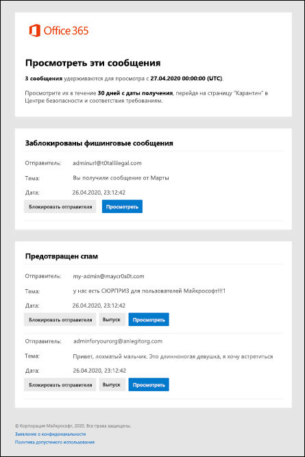

# Использование уведомлений о нежелательной почте для освобождения и отправки отчетов о сообщениях, помещенных в карантинUse user spam notifications to release and report quarantined messages

В организациях Microsoft 365 с почтовыми ящиками в Exchange Online или в автономных организациях Exchange Online Protection (EOP) без почтовых ящиков Exchange Online на карантине хранятся потенциально опасные или нежелательные сообщения.In Microsoft 365 organizations with mailboxes in Exchange Online or standalone Exchange Online Protection (EOP) organizations without Exchange Online mailboxes, quarantine holds potentially dangerous or unwanted messages. Дополнительные сведения см в разделе [сообщения, помещенные в карантин, в EOP](quarantine-email-messages.md).For more information, see [Quarantined messages in EOP](quarantine-email-messages.md).

По умолчанию уведомления о нежелательной почте для конечных пользователей отключаются в политиках защиты от нежелательной почты.By default, end-user spam notifications are disabled in anti-spam policies. Когда администратор [включает уведомления конечных пользователей о нежелательной почте](configure-your-spam-filter-policies.md#configure-end-user-spam-notifications), получатели (включая общие почтовые ящики) будут получать периодические уведомления об их сообщениях, которые были помещены в карантин как спам, Массовая Электронная почта или фишинг (на апрель 2020).When an admin [enables end-user spam notifications](configure-your-spam-filter-policies.md#configure-end-user-spam-notifications), recipients (including shared mailboxes) will receive periodic notifications about their messages that were quarantined as spam, bulk email, or (as of April 2020) phishing.

> [!NOTE]
> Сообщения, помещенные в карантин как высокодостоверные фишингом, вредоносные программы или правила обработки почты (также называемые правилами транспорта), доступны только администраторам.Messages that were quarantined as high confidence phishing, malware, or by mail flow rules (also known as transport rules) are only available to admins. Дополнительные сведения см. в разделе [Управление сообщениями и файлами на карантине в качестве администратора в EOP](manage-quarantined-messages-and-files.md).For more information, see [Manage quarantined messages and files as an admin in EOP](manage-quarantined-messages-and-files.md).

Уведомление о нежелательной почте для конечных пользователей содержит следующие сведения для каждого сообщения в карантине:An end-user spam notification contains the following information for each quarantined message:

- **Отправитель**: имя и адрес электронной почты для отправки сообщения, помещенного в карантин.**Sender**: The send name and email address of the quarantined message.

- **Тема**: текст строки темы сообщения, помещенного в карантин.**Subject**: The subject line text of the quarantined message.

- **Дата**: Дата и время (в формате UTC), когда сообщение было помещено в карантин.**Date**: The date and time (in UTC) that the message was quarantined.

- **Блокировать отправителя**: щелкните эту ссылку, чтобы добавить отправителя в список заблокированных отправителей.**Block Sender**: Click this link to add the sender to your Blocked Senders list. Дополнительные сведения [см.](https://support.microsoft.com/office/b29fd867-cac9-40d8-aed1-659e06a706e4)For more information, see [Block a mail sender](https://support.microsoft.com/office/b29fd867-cac9-40d8-aed1-659e06a706e4).

- **Выпуск**: сообщения о нежелательной почте (нефишинге) вы можете освободить это сообщение, не открывая центр безопасности & соответствия требованиям.**Release**: For spam (not phish) messages, you can release the message here without going to Quarantine the Security & Compliance Center.

- **Рецензирование**: щелкните эту ссылку, чтобы перейти к карантину в центре безопасности & соответствия требованиям, в котором можно выпустить, удалить или сообщить о сообщениях, помещенных в карантин.**Review**: Click this link to go to Quarantine in the Security & Compliance Center, where you can release, delete or report your quarantined messages. Дополнительные сведения см. [в статье Find and Release messages, помещенных в карантин, в качестве пользователя в EOP](find-and-release-quarantined-messages-as-a-user.md).For more information, see [Find and release quarantined messages as a user in EOP](find-and-release-quarantined-messages-as-a-user.md).

