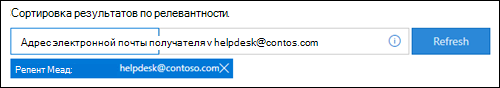

# <a name="view-and-release-quarantined-messages-from-shared-mailboxes"></a>Просмотр и освобождение карантинов сообщений из общих почтовых ящиков

> [!NOTE]
> Функции, описанные в этой статье, в настоящее время находятся в предварительном просмотре, недоступны для всех и могут изменяться.

Пользователи могут управлять карантинными сообщениями, если они являются одним из получателей, как описано в "Поиске и выпуске карантиных сообщений как пользователя [в EOP".](find-and-release-quarantined-messages-as-a-user.md) Но как насчет общих почтовых ящиков, в которых у пользователя есть полный доступ и разрешения отправки как или отправки от имени в почтовый ящик, как описано в общих почтовых [ящиках в Exchange Online?](/exchange/collaboration-exo/shared-mailboxes)

Ранее для пользователей возможность управлять карантинными сообщениями, отправленными в общий почтовый ящик, требовала, чтобы администраторы не включили автомаппирование для общего почтового ящика (он включен по умолчанию, когда администратор предоставляет пользователю доступ к другому почтовому ящику). Однако в зависимости от размера и количества почтовых ящиков, к которые имеет доступ  пользователь, производительность может страдать при попытках Outlook открыть все почтовые ящики, к которые имеет доступ пользователь. По этой причине многие администраторы предпочитают удалять [автомаппирование для общих почтовых ящиков.](/outlook/troubleshoot/profiles-and-accounts/remove-automapping-for-shared-mailbox)

Теперь автомаппация больше не требуется пользователям для управления карантинными сообщениями, отправленными в общие почтовые ящики. Это просто работает. Существует два различных метода доступа к карантинным сообщениям, отправленным в общий почтовый ящик:

- Если администратор включил уведомления о нежелательной почте конечных пользователей в политиках по борьбе со спамом, любой пользователь, который имеет доступ к уведомлениям о нежелательной почте конечных пользователей в общем почтовом ящике, может нажать кнопку Обзор в уведомлении, чтобы перейти на карантин на портале Microsoft 365 Defender. [](configure-your-spam-filter-policies.md#configure-end-user-spam-notifications)  Обратите внимание, что этот метод позволяет пользователям управлять карантинными сообщениями, отправленными в общий почтовый ящик. Пользователи не могут управлять собственными карантинными сообщениями в этом контексте.

- Пользователь может [перейти на карантин на портале Microsoft 365 Defender.](find-and-release-quarantined-messages-as-a-user.md) По умолчанию показаны только сообщения, отправленные пользователю. Однако пользователь может изменить результаты **Сортировки** (кнопку **ID** сообщения по умолчанию) на адрес электронной почты получателя, ввести общий почтовый ящик, а затем щелкнуть **Обновить,** чтобы увидеть карантинные сообщения, отправленные в общий почтовый ящик.

  

Независимо от метода, пользователи могут избежать путаницы, включив столбец **Получатель** для карантинов сообщений. Максимальное число столбцов для отображения — 7, поэтому пользователю потребуется нажать кнопку **Изменить** столбцы, удалить существующий столбец (например, тип политики), выбрать получателя, а затем нажмите кнопку **Сохранить** или Сохранить по **умолчанию.**

  

## <a name="things-to-keep-in-mind"></a>Важная информация

- Первый пользователь, который будет действовать в карантинном сообщении, решает судьбу сообщения для всех, кто использует общий почтовый ящик. Например, если общий почтовый ящик получает доступ к 10 пользователям и пользователь решает удалить карантиное сообщение, сообщение удаляется для всех 10 пользователей. Кроме того, если пользователь решает выпустить сообщение, оно выпущено в общий почтовый ящик и доступно всем другим пользователям общего почтового ящика.

- В настоящее время кнопка **отправитель** блока недоступна в флажке **Details** для карантинов, отправленных в общий почтовый ящик.

- Что касается операций карантина для общих почтовых ящиков, то при использовании вложенных групп безопасности для предоставления доступа к общему почтовому ящику рекомендуется не более двух уровней вложенных групп. Например, группа A входит в группу B, которая входит в группу C. Чтобы назначить разрешения для общего почтового ящика, не добавляйте пользователя в группу А, а затем назначьте группу C в общий почтовый ящик.  

- Чтобы управлять карантинными сообщениями для общего почтового [ящика в Exchange Online PowerShell,](/powershell/exchange/connect-to-exchange-online-powershell)конечному пользователю необходимо использовать для идентификации сообщений комлет [Get-QuarantineMessage](/powershell/module/exchange/get-quarantinemessage) с общим почтовым ящиком для определения значения параметра _RecipientAddress._ Пример.

  ```powershell
  Get-QuarantinedMessage -RecipientAddress officeparty@contoso.com
  ```

  Затем конечный пользователь может выбрать карантинное сообщение из списка, чтобы просмотреть или принять меры.

  В этом примере показаны все карантинные сообщения, отправленные в общий почтовый ящик, а затем первое сообщение в списке из карантина (первое сообщение в списке — 0, второе — 1 и так далее).

  ```powershell
  $SharedMessages = Get-QuarantinedMessage -RecipientAddress officeparty@contoso.com | select -ExpandProperty Identity
  $SharedMessages
  Release-QuarantinedMessage -Identity $SharedMessages[0]
  ```

  Подробные сведения о синтаксисе и параметрах см. в таких разделах:

  - [Get-QuarantineMessage](/powershell/module/exchange/get-quarantinemessage)
  - [Get-QuarantineMessageHeader](/powershell/module/exchange/get-quarantinemessageheader)
  - [Preview-QuarantineMessage](/powershell/module/exchange/preview-quarantinemessage)
  - [Release-QuarantineMessage](/powershell/module/exchange/release-quarantinemessage)
