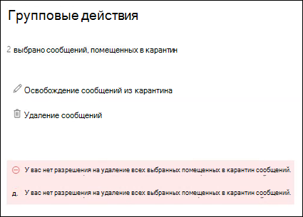

# <a name="view-and-release-quarantined-messages-from-shared-mailboxes"></a><span data-ttu-id="a87d5-103">Просмотр и освобождение сообщений, помещенных в карантин, из общих почтовых ящиков</span><span class="sxs-lookup"><span data-stu-id="a87d5-103">View and release quarantined messages from shared mailboxes</span></span>

> [!NOTE]
> <span data-ttu-id="a87d5-104">Функции, описанные в этой статье, в настоящее время доступны для всех и могут быть изменены.</span><span class="sxs-lookup"><span data-stu-id="a87d5-104">The features that are described in this article are currently in Preview, aren't available to everyone, and are subject to change.</span></span>

<span data-ttu-id="a87d5-105">Пользователи могут управлять сообщениями в карантине, где они являются одним из получателей, как описано в статье [Поиск и освобождение сообщений, помещенных в карантин, в качестве пользователя в EOP](find-and-release-quarantined-messages-as-a-user.md).</span><span class="sxs-lookup"><span data-stu-id="a87d5-105">Users can manage quarantined messages where they are one of the recipients as described in [Find and release quarantined messages as a user in EOP](find-and-release-quarantined-messages-as-a-user.md).</span></span> <span data-ttu-id="a87d5-106">Но как насчет общих почтовых ящиков, в которых пользователь имеет разрешения "полный доступ" и "Отправить от имени" для почтового ящика, как описано в статье [Общие почтовые ящики в Exchange Online](https://docs.microsoft.com/exchange/collaboration-exo/shared-mailboxes)?</span><span class="sxs-lookup"><span data-stu-id="a87d5-106">But what about shared mailboxes where the user has Full Access and Send As or Send on Behalf permissions to the mailbox as described in [Shared mailboxes in Exchange Online](https://docs.microsoft.com/exchange/collaboration-exo/shared-mailboxes)?</span></span>

<span data-ttu-id="a87d5-107">Ранее пользователи могут управлять сообщениями в карантине, отправленные в общий почтовый ящик, необходимые для администраторов, чтобы оставить автосопоставление включенным для общего почтового ящика (он включен по умолчанию, когда администратор предоставляет пользователю доступ к другому почтовому ящику).</span><span class="sxs-lookup"><span data-stu-id="a87d5-107">Previously, the ability for users to manage quarantined messages sent to a shared mailbox required admins to leave automapping enabled for the shared mailbox (it's enabled by default when an admin gives a user access to another mailbox).</span></span> <span data-ttu-id="a87d5-108">Тем не менее, в зависимости от размера и количества почтовых ящиков, к которым у пользователя есть доступ, производительность может снизиться, если вы попытаетесь открыть *все* почтовые ящики, к которым у пользователя есть доступ.</span><span class="sxs-lookup"><span data-stu-id="a87d5-108">However, depending on the size and number of mailboxes that the user has access to, performance can suffer as Outlooks tries to open *all* mailboxes that the user has access to.</span></span> <span data-ttu-id="a87d5-109">По этой причине многие администраторы выбирают [Удаление автосопоставления для общих почтовых ящиков](https://docs.microsoft.com/outlook/troubleshoot/profiles-and-accounts/remove-automapping-for-shared-mailbox).</span><span class="sxs-lookup"><span data-stu-id="a87d5-109">For this reason, many admins choose to [remove automapping for shared mailboxes](https://docs.microsoft.com/outlook/troubleshoot/profiles-and-accounts/remove-automapping-for-shared-mailbox).</span></span>

<span data-ttu-id="a87d5-110">Теперь, чтобы пользователи могли управлять помещенными в карантин сообщениями, отправленными в общие почтовые ящики, автосопоставление больше не требуется.</span><span class="sxs-lookup"><span data-stu-id="a87d5-110">Now, automapping is no longer required for users to manage quarantined messages that were sent to shared mailboxes.</span></span> <span data-ttu-id="a87d5-111">Он просто работает.</span><span class="sxs-lookup"><span data-stu-id="a87d5-111">It just works.</span></span> <span data-ttu-id="a87d5-112">Существует два разных способа доступа к сообщениям в карантине, которые были отправлены в общий почтовый ящик:</span><span class="sxs-lookup"><span data-stu-id="a87d5-112">There are two different methods to access quarantined messages that were sent to a shared mailbox:</span></span>

- <span data-ttu-id="a87d5-113">Если администратор [включил уведомления пользователя о](https://docs.microsoft.com/microsoft-365/security/office-365-security/configure-your-spam-filter-policies) нежелательной почте в политиках защиты от нежелательной почты, любой пользователь, имеющий доступ к уведомлениям о нежелательной почте в общем почтовом ящике, может нажать кнопку " **Обзор** " в уведомлении, чтобы перейти в карантин в центре безопасности & соответствия требованиям.</span><span class="sxs-lookup"><span data-stu-id="a87d5-113">If the admin has [enabled end-user spam notifications](https://docs.microsoft.com/microsoft-365/security/office-365-security/configure-your-spam-filter-policies) in anti-spam policies, any user that has access to the end-user spam notifications in the shared mailbox can click the **Review** button in the notification to go to quarantine in the Security & Compliance Center.</span></span> <span data-ttu-id="a87d5-114">Обратите внимание, что этот метод позволяет пользователям управлять только сообщениями в карантине, которые были отправлены в общий почтовый ящик.</span><span class="sxs-lookup"><span data-stu-id="a87d5-114">Note that this method only allows users to manage quarantined messages that were sent to the shared mailbox.</span></span> <span data-ttu-id="a87d5-115">Пользователи не могут управлять своими собственными сообщениями в карантине в этом контексте.</span><span class="sxs-lookup"><span data-stu-id="a87d5-115">Users can't manage their own quarantine messages in this context.</span></span>

- <span data-ttu-id="a87d5-116">Пользователь может [Перейти к карантину в центре безопасности & соответствия требованиям](find-and-release-quarantined-messages-as-a-user.md).</span><span class="sxs-lookup"><span data-stu-id="a87d5-116">The user can [go to the quarantine in the Security & Compliance Center](find-and-release-quarantined-messages-as-a-user.md).</span></span> <span data-ttu-id="a87d5-117">По умолчанию отображаются только те сообщения, которые были отправлены пользователю.</span><span class="sxs-lookup"><span data-stu-id="a87d5-117">By default, only messages that were sent to the user are shown.</span></span> <span data-ttu-id="a87d5-118">Однако пользователь может изменить **результаты сортировки** ( **кнопка идентификатора сообщения** по умолчанию) на **адрес электронной почты получателя**, ввести адрес электронной почты для общего почтового ящика, а затем нажать кнопку **Обновить** , чтобы просмотреть помещенные в карантин сообщения, отправленные в общий почтовый ящик.</span><span class="sxs-lookup"><span data-stu-id="a87d5-118">However, the user can change the **Sort results** (the **Message ID button** by default) to **Recipient email address**, enter the shared mailbox email address, and then click **Refresh** to see the quarantined messages that were sent to the shared mailbox.</span></span>

  

<span data-ttu-id="a87d5-120">Независимо от метода пользователи могут избежать путаницы, включив столбец **получателя** для сообщений, помещенных в карантин.</span><span class="sxs-lookup"><span data-stu-id="a87d5-120">Regardless of the method, users can avoid confusion by including the **Recipient** column for quarantined messages.</span></span> <span data-ttu-id="a87d5-121">Максимальное число отображаемых столбцов равно 7, поэтому пользователю потребуется щелкнуть **изменить столбцы**, удалить существующий столбец (например, **тип политики**), выбрать пункт **получатель**, а затем **сохранить** или сохранить **как по умолчанию**.</span><span class="sxs-lookup"><span data-stu-id="a87d5-121">The maximum number of columns to display is 7, so the user will need to click **Modify columns**, remove an existing column (for example, **Policy type**), select **Recipient**, and then click **Save** or **Save as default**.</span></span>

  

## <a name="things-to-keep-in-mind"></a><span data-ttu-id="a87d5-123">Важная информация</span><span class="sxs-lookup"><span data-stu-id="a87d5-123">Things to keep in mind</span></span>

- <span data-ttu-id="a87d5-124">Первый пользователь, работающий с сообщением в карантине, определяет Фате сообщения для всех пользователей, использующих общий почтовый ящик.</span><span class="sxs-lookup"><span data-stu-id="a87d5-124">The first user to act on the quarantined message decides the fate of the message for everyone who uses the shared mailbox.</span></span> <span data-ttu-id="a87d5-125">Например, если к общему почтовому ящику обращаются 10 пользователей, а пользователь решил удалить сообщение из карантина, сообщение будет удалено для всех 10 пользователей.</span><span class="sxs-lookup"><span data-stu-id="a87d5-125">For example, if a shared mailbox is accessed by 10 users, and a user decides to delete the quarantine message, the message is deleted for all 10 users.</span></span> <span data-ttu-id="a87d5-126">Аналогично, если пользователь решит освободить сообщение, он будет выпущен в общий почтовый ящик и будет доступен всем остальным пользователям общего почтового ящика.</span><span class="sxs-lookup"><span data-stu-id="a87d5-126">Likewise, if a user decides to release the message, it's released to the shared mailbox and is accessible by all other users of the shared mailbox.</span></span>

- <span data-ttu-id="a87d5-127">В настоящее время, если пользователь выбирает несколько сообщений на карантине, отправленных в общий почтовый ящик, при нажатии кнопки **освободить сообщения** или **удалять сообщения** из всплывающего меню " **групповые действия** " возвращаются следующие ошибки.</span><span class="sxs-lookup"><span data-stu-id="a87d5-127">Currently, if a user selects multiple quarantined messages that were sent to the shared mailbox, the following misleading errors are returned when the user clicks **Release messages** or **Delete messages** in the **Bulk actions** flyout:</span></span>

  > <span data-ttu-id="a87d5-128">У вас нет разрешения на удаление всех выбранных помещенных в карантин сообщений.</span><span class="sxs-lookup"><span data-stu-id="a87d5-128">You do not have permission to release all selected quarantined messages.</span></span>
  >
  > <span data-ttu-id="a87d5-129">У вас нет разрешения на удаление всех выбранных помещенных в карантин сообщений.</span><span class="sxs-lookup"><span data-stu-id="a87d5-129">You do not have permission to delete all selected quarantined messages.</span></span>

  <span data-ttu-id="a87d5-130">Независимо от ошибки, действие выполняется над сообщениями, и эта ошибка может быть проигнорирована.</span><span class="sxs-lookup"><span data-stu-id="a87d5-130">Regardless of the error, the action is taken on the messages, and the error can be ignored.</span></span>

  

- <span data-ttu-id="a87d5-132">В настоящее время кнопка " **блокировать отправитель** " недоступна в всплывающем меню **сведений** для сообщений, отправленных в папку "помещено в карантин".</span><span class="sxs-lookup"><span data-stu-id="a87d5-132">Currently, the **Block sender** button is not available in the **Details** flyout for quarantined messages that were sent to the shared mailbox.</span></span>

- <span data-ttu-id="a87d5-133">Чтобы управлять сообщениями, помещенными в карантин, для общего почтового ящика в [Exchange Online PowerShell](https://docs.microsoft.com/powershell/exchange/connect-to-exchange-online-powershell), конечному пользователю потребуется использовать командлет [Get-QuarantineMessage](https://docs.microsoft.com/powershell/module/exchange/get-quarantinemessage) с адресом электронной почты для общего почтового ящика в качестве значения параметра _получательимеет адрес_ для идентификации сообщений.</span><span class="sxs-lookup"><span data-stu-id="a87d5-133">To manage quarantined messages for the shared mailbox in [Exchange Online PowerShell](https://docs.microsoft.com/powershell/exchange/connect-to-exchange-online-powershell), the end-user will need to use the [Get-QuarantineMessage](https://docs.microsoft.com/powershell/module/exchange/get-quarantinemessage) cmdlet with shared mailbox email address for the value of the _RecipientAddress_ parameter to identify the messages.</span></span> <span data-ttu-id="a87d5-134">Пример:</span><span class="sxs-lookup"><span data-stu-id="a87d5-134">For example:</span></span>

  ```powershell
  Get-QuarantinedMessage -RecipientAddress officeparty@contoso.com
  ```

  <span data-ttu-id="a87d5-135">Затем конечный пользователь может выбрать в списке сообщение, помещенное в карантин, для просмотра или выполнения действий.</span><span class="sxs-lookup"><span data-stu-id="a87d5-135">Then, the end-user can select a quarantined message from the list to view or take action on.</span></span>

  <span data-ttu-id="a87d5-136">В этом примере показаны все сообщения на карантине, которые были отправлены в общий почтовый ящик, а затем освобождается первое сообщение в списке из карантина (первое сообщение в списке равно 0, второе — 1 и т. д.).</span><span class="sxs-lookup"><span data-stu-id="a87d5-136">This example shows all of the quarantined messages that were sent to the shared mailbox, and then releases the first message in the list from quarantine (the first message in the list is 0, the second is 1, and so on).</span></span>

  ```powershell
  $SharedMessages = Get-QuarantinedMessage -RecipientAddress officeparty@contoso.com | select -ExpandProperty Identity
  $SharedMessages
  Release-QuarantinedMessage -Identity $SharedMessages[0]
  ```

  <span data-ttu-id="a87d5-137">Подробные сведения о синтаксисе и параметрах см. в таких разделах:</span><span class="sxs-lookup"><span data-stu-id="a87d5-137">For detailed syntax and parameter information, see the following topics:</span></span>

  - [<span data-ttu-id="a87d5-138">Get — QuarantineMessage</span><span class="sxs-lookup"><span data-stu-id="a87d5-138">Get-QuarantineMessage</span></span>](https://docs.microsoft.com/powershell/module/exchange/get-quarantinemessage)
  - [<span data-ttu-id="a87d5-139">Get — Куарантинемессажехеадер</span><span class="sxs-lookup"><span data-stu-id="a87d5-139">Get-QuarantineMessageHeader</span></span>](https://docs.microsoft.com/powershell/module/exchange/get-quarantinemessageheader)
  - [<span data-ttu-id="a87d5-140">Preview — QuarantineMessage</span><span class="sxs-lookup"><span data-stu-id="a87d5-140">Preview-QuarantineMessage</span></span>](https://docs.microsoft.com/powershell/module/exchange/preview-quarantinemessage)
  - [<span data-ttu-id="a87d5-141">Release — QuarantineMessage</span><span class="sxs-lookup"><span data-stu-id="a87d5-141">Release-QuarantineMessage</span></span>](https://docs.microsoft.com/powershell/module/exchange/release-quarantinemessage)
