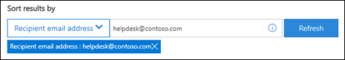
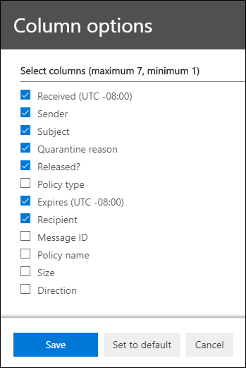

# <a name="view-and-release-quarantined-messages-from-shared-mailboxes"></a><span data-ttu-id="f9cc2-103">Просмотр и освобождение сообщений на карантине из общих почтовых ящиков</span><span class="sxs-lookup"><span data-stu-id="f9cc2-103">View and release quarantined messages from shared mailboxes</span></span>

> [!NOTE]
> <span data-ttu-id="f9cc2-104">Функции, описанные в этой статье, в настоящее время доступны в предварительной версии, доступны не всем и могут быть измениться.</span><span class="sxs-lookup"><span data-stu-id="f9cc2-104">The features that are described in this article are currently in Preview, aren't available to everyone, and are subject to change.</span></span>

<span data-ttu-id="f9cc2-105">Пользователи могут управлять сообщениями на карантине, если они являются одним из получателей, как описано в описании в описании и освобождении сообщений на карантине в качестве пользователя [в EOP.](find-and-release-quarantined-messages-as-a-user.md)</span><span class="sxs-lookup"><span data-stu-id="f9cc2-105">Users can manage quarantined messages where they are one of the recipients as described in [Find and release quarantined messages as a user in EOP](find-and-release-quarantined-messages-as-a-user.md).</span></span> <span data-ttu-id="f9cc2-106">Но как насчет общих почтовых ящиков, в которых у пользователя есть разрешения "Полный доступ" и "Отправить как" или "Отправить от имени", как описано в общих почтовых ящиках [в Exchange Online?](https://docs.microsoft.com/exchange/collaboration-exo/shared-mailboxes)</span><span class="sxs-lookup"><span data-stu-id="f9cc2-106">But what about shared mailboxes where the user has Full Access and Send As or Send on Behalf permissions to the mailbox as described in [Shared mailboxes in Exchange Online](https://docs.microsoft.com/exchange/collaboration-exo/shared-mailboxes)?</span></span>

<span data-ttu-id="f9cc2-107">Ранее для управления сообщениями, отправленными в общий почтовый ящик, пользователям требовалось, чтобы администраторы не включили автомагистрали для общего почтового ящика (она включена по умолчанию, когда администратор предоставляет пользователю доступ к другому почтовому ящику).</span><span class="sxs-lookup"><span data-stu-id="f9cc2-107">Previously, the ability for users to manage quarantined messages sent to a shared mailbox required admins to leave automapping enabled for the shared mailbox (it's enabled by default when an admin gives a user access to another mailbox).</span></span> <span data-ttu-id="f9cc2-108">Однако в зависимости от размера и количества почтовых ящиков, к которые пользователь имеет  доступ, производительность может ухуметь, когда Outlook пытается открыть все почтовые ящики, к которые пользователь имеет доступ.</span><span class="sxs-lookup"><span data-stu-id="f9cc2-108">However, depending on the size and number of mailboxes that the user has access to, performance can suffer as Outlooks tries to open *all* mailboxes that the user has access to.</span></span> <span data-ttu-id="f9cc2-109">По этой причине многие администраторы предпочитают удалять [автомагистрали для общих почтовых ящиков.](https://docs.microsoft.com/outlook/troubleshoot/profiles-and-accounts/remove-automapping-for-shared-mailbox)</span><span class="sxs-lookup"><span data-stu-id="f9cc2-109">For this reason, many admins choose to [remove automapping for shared mailboxes](https://docs.microsoft.com/outlook/troubleshoot/profiles-and-accounts/remove-automapping-for-shared-mailbox).</span></span>

<span data-ttu-id="f9cc2-110">Теперь автомагистрали больше не требуются для управления сообщениями на карантине, отправленными в общие почтовые ящики.</span><span class="sxs-lookup"><span data-stu-id="f9cc2-110">Now, automapping is no longer required for users to manage quarantined messages that were sent to shared mailboxes.</span></span> <span data-ttu-id="f9cc2-111">Он просто работает.</span><span class="sxs-lookup"><span data-stu-id="f9cc2-111">It just works.</span></span> <span data-ttu-id="f9cc2-112">Существует два разных способа доступа к сообщениям на карантине, отправленным в общий почтовый ящик:</span><span class="sxs-lookup"><span data-stu-id="f9cc2-112">There are two different methods to access quarantined messages that were sent to a shared mailbox:</span></span>

- <span data-ttu-id="f9cc2-113">Если администратор [](https://docs.microsoft.com/microsoft-365/security/office-365-security/configure-your-spam-filter-policies) включил уведомления пользователей о нежелательной почте в политиках защиты от нежелательной почты, любой пользователь, у  которых есть доступ к уведомлениям о нежелательной почте в общем почтовом ящике, может нажать кнопку "Просмотреть" в уведомлении, чтобы перейти на карантин в Центре безопасности и соответствия & соответствия требованиям.</span><span class="sxs-lookup"><span data-stu-id="f9cc2-113">If the admin has [enabled end-user spam notifications](https://docs.microsoft.com/microsoft-365/security/office-365-security/configure-your-spam-filter-policies) in anti-spam policies, any user that has access to the end-user spam notifications in the shared mailbox can click the **Review** button in the notification to go to quarantine in the Security & Compliance Center.</span></span> <span data-ttu-id="f9cc2-114">Обратите внимание, что этот метод позволяет пользователям управлять только сообщениями на карантине, отправленными в общий почтовый ящик.</span><span class="sxs-lookup"><span data-stu-id="f9cc2-114">Note that this method only allows users to manage quarantined messages that were sent to the shared mailbox.</span></span> <span data-ttu-id="f9cc2-115">В этом контексте пользователи не могут управлять собственными сообщениями карантина.</span><span class="sxs-lookup"><span data-stu-id="f9cc2-115">Users can't manage their own quarantine messages in this context.</span></span>

- <span data-ttu-id="f9cc2-116">Пользователь может перейти в карантин в Центре [безопасности & соответствия требованиям.](find-and-release-quarantined-messages-as-a-user.md)</span><span class="sxs-lookup"><span data-stu-id="f9cc2-116">The user can [go to the quarantine in the Security & Compliance Center](find-and-release-quarantined-messages-as-a-user.md).</span></span> <span data-ttu-id="f9cc2-117">По умолчанию показываются только сообщения, отправленные пользователю.</span><span class="sxs-lookup"><span data-stu-id="f9cc2-117">By default, only messages that were sent to the user are shown.</span></span> <span data-ttu-id="f9cc2-118">Однако пользователь может изменить результаты сортировки **(кнопку** "ИД сообщения" по умолчанию) на адрес электронной почты получателя, ввести адрес электронной почты общего почтового ящика и нажать кнопку "Обновить", чтобы увидеть сообщения, отправленные в общий почтовый ящик в карантине.  </span><span class="sxs-lookup"><span data-stu-id="f9cc2-118">However, the user can change the **Sort results** (the **Message ID button** by default) to **Recipient email address**, enter the shared mailbox email address, and then click **Refresh** to see the quarantined messages that were sent to the shared mailbox.</span></span>

  

<span data-ttu-id="f9cc2-120">Независимо от метода пользователи могут избежать путаницы, включив столбец **"Получатель"** для сообщений в карантине.</span><span class="sxs-lookup"><span data-stu-id="f9cc2-120">Regardless of the method, users can avoid confusion by including the **Recipient** column for quarantined messages.</span></span> <span data-ttu-id="f9cc2-121">Максимальное число отображаемого числа столбцов — 7, поэтому пользователю потребуется нажать кнопку "Изменить столбцы", удалить существующий столбец (например, тип политики), выбрать "Получатель" и нажать кнопку "Сохранить" или "Сохранить по  умолчанию".    </span><span class="sxs-lookup"><span data-stu-id="f9cc2-121">The maximum number of columns to display is 7, so the user will need to click **Modify columns**, remove an existing column (for example, **Policy type**), select **Recipient**, and then click **Save** or **Save as default**.</span></span>

  

## <a name="things-to-keep-in-mind"></a><span data-ttu-id="f9cc2-123">Важная информация</span><span class="sxs-lookup"><span data-stu-id="f9cc2-123">Things to keep in mind</span></span>

- <span data-ttu-id="f9cc2-124">Первый пользователь, который будет действовать над сообщением, отправленным на карантин, решает, что сообщение будет отправлено всем, кто использует общий почтовый ящик.</span><span class="sxs-lookup"><span data-stu-id="f9cc2-124">The first user to act on the quarantined message decides the fate of the message for everyone who uses the shared mailbox.</span></span> <span data-ttu-id="f9cc2-125">Например, если к общему почтовому ящику имеют доступ 10 пользователей и пользователь решает удалить сообщение карантина, сообщение удаляется для всех 10 пользователей.</span><span class="sxs-lookup"><span data-stu-id="f9cc2-125">For example, if a shared mailbox is accessed by 10 users, and a user decides to delete the quarantine message, the message is deleted for all 10 users.</span></span> <span data-ttu-id="f9cc2-126">Аналогично, если пользователь решает освободить сообщение, оно освобождается в общем почтовом ящике и доступно всем другим пользователям общего почтового ящика.</span><span class="sxs-lookup"><span data-stu-id="f9cc2-126">Likewise, if a user decides to release the message, it's released to the shared mailbox and is accessible by all other users of the shared mailbox.</span></span>

- <span data-ttu-id="f9cc2-127">В настоящее **время кнопка "Блокировать** отправитель" недоступна во flyout **"Сведения"** для сообщений в карантине, отправленных в общий почтовый ящик.</span><span class="sxs-lookup"><span data-stu-id="f9cc2-127">Currently, the **Block sender** button is not available in the **Details** flyout for quarantined messages that were sent to the shared mailbox.</span></span>

- <span data-ttu-id="f9cc2-128">Чтобы управлять сообщениями на карантине для общего почтового ящика в [Exchange Online PowerShell,](https://docs.microsoft.com/powershell/exchange/connect-to-exchange-online-powershell)конечному пользователю потребуется использовать для идентификации сообщений значение параметра _RecipientAddress_ с помощью параметра [Get-QuarantineMessage](https://docs.microsoft.com/powershell/module/exchange/get-quarantinemessage) с общим адресом электронной почты почтового ящика.</span><span class="sxs-lookup"><span data-stu-id="f9cc2-128">To manage quarantined messages for the shared mailbox in [Exchange Online PowerShell](https://docs.microsoft.com/powershell/exchange/connect-to-exchange-online-powershell), the end-user will need to use the [Get-QuarantineMessage](https://docs.microsoft.com/powershell/module/exchange/get-quarantinemessage) cmdlet with shared mailbox email address for the value of the _RecipientAddress_ parameter to identify the messages.</span></span> <span data-ttu-id="f9cc2-129">Пример:</span><span class="sxs-lookup"><span data-stu-id="f9cc2-129">For example:</span></span>

  ```powershell
  Get-QuarantinedMessage -RecipientAddress officeparty@contoso.com
  ```

  <span data-ttu-id="f9cc2-130">Затем конечный пользователь может выбрать сообщение в карантине из списка, чтобы просмотреть или принять меры.</span><span class="sxs-lookup"><span data-stu-id="f9cc2-130">Then, the end-user can select a quarantined message from the list to view or take action on.</span></span>

  <span data-ttu-id="f9cc2-131">В этом примере показаны все сообщения на карантине, отправленные в общий почтовый ящик, а затем первое сообщение в списке освобождается из карантина (первое сообщение в списке — 0, второе — 1 и так далее).</span><span class="sxs-lookup"><span data-stu-id="f9cc2-131">This example shows all of the quarantined messages that were sent to the shared mailbox, and then releases the first message in the list from quarantine (the first message in the list is 0, the second is 1, and so on).</span></span>

  ```powershell
  $SharedMessages = Get-QuarantinedMessage -RecipientAddress officeparty@contoso.com | select -ExpandProperty Identity
  $SharedMessages
  Release-QuarantinedMessage -Identity $SharedMessages[0]
  ```

  <span data-ttu-id="f9cc2-132">Подробные сведения о синтаксисе и параметрах см. в таких разделах:</span><span class="sxs-lookup"><span data-stu-id="f9cc2-132">For detailed syntax and parameter information, see the following topics:</span></span>

  - [<span data-ttu-id="f9cc2-133">Get-QuarantineMessage</span><span class="sxs-lookup"><span data-stu-id="f9cc2-133">Get-QuarantineMessage</span></span>](https://docs.microsoft.com/powershell/module/exchange/get-quarantinemessage)
  - [<span data-ttu-id="f9cc2-134">Get-QuarantineMessageHeader</span><span class="sxs-lookup"><span data-stu-id="f9cc2-134">Get-QuarantineMessageHeader</span></span>](https://docs.microsoft.com/powershell/module/exchange/get-quarantinemessageheader)
  - [<span data-ttu-id="f9cc2-135">Preview-QuarantineMessage</span><span class="sxs-lookup"><span data-stu-id="f9cc2-135">Preview-QuarantineMessage</span></span>](https://docs.microsoft.com/powershell/module/exchange/preview-quarantinemessage)
  - [<span data-ttu-id="f9cc2-136">Release-QuarantineMessage</span><span class="sxs-lookup"><span data-stu-id="f9cc2-136">Release-QuarantineMessage</span></span>](https://docs.microsoft.com/powershell/module/exchange/release-quarantinemessage)
