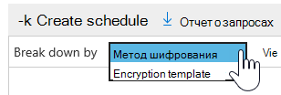
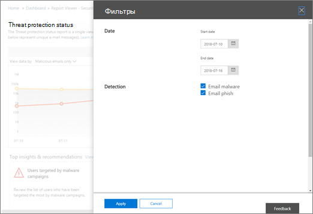
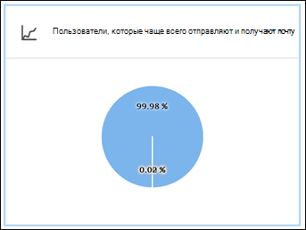
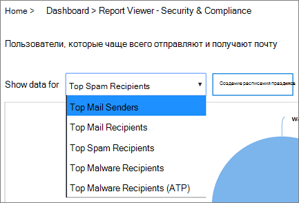
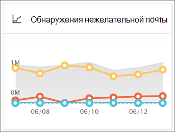
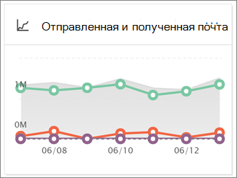
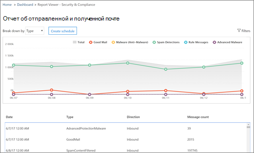

# Просмотр отчетов о безопасности почты в Центре безопасности и соответствия требованиямView email security reports in the Security & Compliance Center

В [центре безопасности & соответствия](https://protection.office.com) доступны разнообразные отчеты, которые помогут вам понять, как функции безопасности электронной почты, такие как защита от нежелательной почты, защита от вредоносных программ и функции шифрования в Microsoft 365 защищают вашу организацию.A variety of reports are available in the [Security & Compliance Center](https://protection.office.com) to help you see how email security features, such as anti-spam, anti-malware, and encryption features in Microsoft 365 are protecting your organization. Если у вас есть [необходимые разрешения](#what-permissions-are-needed-to-view-these-reports), вы можете просмотреть эти отчеты в центре безопасности & соответствия требованиям, перейдя **Reports** на \> **панель мониторинга**отчетов.If you have the [necessary permissions](#what-permissions-are-needed-to-view-these-reports), you can view these reports in the Security & Compliance Center by going to **Reports** \> **Dashboard**.

К отчетам по безопасности электронной почты относятся следующие:Your email security reports include the following:

- [URL-адрес отчета защиты от угроз](#url-threat-protection-report-new) (**New!**)[URL Threat Protection report](#url-threat-protection-report-new) (**NEW!**)
- [Отчет о скомпрометированных пользователяхCompromised Users report](#compromised-users-report)
- [Отчет о шифрованииEncryption report](#encryption-report)
- [отчет о состоянии защиты от угроз](#threat-protection-status-report);[Threat Protection Status report](#threat-protection-status-report)
- [Отчет об обнаружении вредоносных программMalware Detections report](#malware-detections-report)
- [Отчет о самых вредоносных программахTop Malware report](#top-malware-report)
- [Отчет по основным отправителям и получателямTop Senders and Recipients report](#top-senders-and-recipients-report)
- [Отчет об обнаружении поддельных поддельныхSpoof Detections report](#spoof-detections-report)
- [Отчет об обнаружении нежелательной почтыSpam Detections report](#spam-detections-report)
- [Отчет о отправленных и полученных сообщениях электронной почтыSent and received email report](#sent-and-received-email-report)
- [Отчет о сообщениях, отчет о пользователяхUser-reported messages report](#user-reported-messages-report)

## URL-адрес отчета защиты от угроз (**New!**)URL Threat Protection report (**NEW!**)

Отчет по защите от угроз URL-адресов доступен всем, у кого есть:The URL Threat Protection report is available to anyone with:

- Надстройка Exchange Online Protection *и* Advanced Threat protection (план 1 *или* план 2)An Exchange Online Protection, *and* Advanced Threat Protection add-on (Plan 1 *or* Plan 2)
- Подписка на Microsoft 365A Microsoft 365 E5 subscription

Это отчет "по щелчку", который содержит два агрегированных представления.This is a 'click-centric' report that has two aggregated views.

1. Первое представление — это *действие по защите от использования URL-адресов*, которое ориентировано на отображение числа щелчков по URL-адресам пользователей в клиенте, а также по результату щелчка мыши.The first view is by *URL click-protection action*, which is focused on showing the number of URL clicks by users within the tenant, and the result of the click. Затем щелкните здесь, чтобы убедиться, что пользователь выбрал страницу блокировки на вредоносный веб-сайт (он может быть отключен администратором в политике безопасных ссылок).A click here indicates that the user has clicked through the block page to the malicious website (this can be disabled by the administrator within a Safe Links policy).

2. Второе представление — *URL-адрес щелкните приложения*, в котором отображается количество URL-адресов, которые используются в других приложениях, поддерживающих безопасные ссылки (например, в клиенте электронной почты или в Microsoft Word).The second view is *URL click by applications*, which shows the number of URLs click in different applications that support Safe Links today, such as in an email client or in Microsoft Word. Данные в обоих статистических представлениях обновляются каждые 4 часа.Data in both aggregated views are refreshed once every 4 hours.

В таблице сведений в отчете защита от угроз URL-адресов представлено практические представление обо всех нажатиях в клиенте, а также содержатся подробные сведения, такие как *имя пользователя*, *URL-адрес*, *идентификатор сетевого сообщения* (если URL-адрес был выбран из сообщения электронной почты), а также другие ценные сведения, полезные для исследований и анализа.The details table of the URL Threat Protection report provides a near-real-time view of all clicks that happen within the tenant, and it includes investigative information such as *username*, *URL*, the *network message ID* (if the URL was clicked from an email), and other valuable pieces of information useful for investigations and analyses.

По умолчанию в отчете отображаются данные по щелчкам только с URL-адресов, которые были заблокированы с помощью безопасных ссылок, но Кроме того, можно просмотреть сведения обо всех кнопках URL-адреса, выбрав в фильтрах *Разрешенные URL* -адреса.By default, the report only shows data on clicks from URLs that were blocked by Safe Links, but it is also possible to see information for all URL clicks through selecting *Allowed URLs* checkbox in the filters.

В этом отчете не будут применятся данные щелчков из пользователей, для которых политика "безопасные ссылки" имеет установленный флажок *не отслеживать нажатия пользователем* .This report will not have data of clicks from users where the Safe Links policy applied has the *Do not track user clicks* option selected.

## Отчет о скомпрометированных пользователяхCompromised Users report

Этот отчет, доступный всем пользователям Exchange Online Protection, показывает число учетных записей пользователей, помеченных как подозрительные или ограниченные, данные, особенно полезные в качестве учетных записей, могут быть непроблематичными или даже скомпрометированы.This report, available to anyone with Exchange Online Protection, shows the number of user accounts marked as Suspicious or Restricted users, data particularly useful as accounts enter either of the states that indicate the user account may be problematic, or even compromised. При частом использовании отчет о скомпрометированных пользователях может нарушить пиковые значения и даже тенденции в учетных записях, помеченных в подозрительных или ограниченных состояниях, что свидетельствует о проблемах с безопасностью и веллнесс клиента.With frequent use, the Compromised User report can spot spikes, and even trends, in accounts marked in suspicious or restricted states, giving evidence there could be an issue with security and the wellness of your tenant.

## Отчет о шифрованииEncryption report

В **отчете о шифровании** представлены сведения о зашифрованных сообщениях электронной почты с помощью политик организации или конечных пользователей.The **Encryption report** shows information about email messages that were encrypted, either through your organization's policies, or through end-user controls. Группа безопасности Организации может использовать сведения из этого отчета для определения шаблонов и профилактического применения или настройки политик для конфиденциальных сообщений электронной почты.Your organization's security team can use information in this report to identify patterns and proactively apply or adjust policies for sensitive email messages.

Чтобы просмотреть этот отчет, в центре безопасности & соответствия требованиям откройте отчет о **Reports** \> **Dashboard** \> **шифровании**панели мониторинга отчетов.To view this report, in the Security & Compliance Center, go to **Reports** \> **Dashboard** \> **Encryption report**.

При первом открытии отчета вы увидите сведения о методах шифрования, используемых в сообщениях электронной почты за прошедшие семь (7) дней.When the report first opens, you'll see data about encryption methods used on email messages for the past seven (7) days. Вы можете изменить диапазон дат и сведения, отображаемые в отчете, щелкнув **фильтры** в правом верхнем углу экрана.You can change the date range and the details that are displayed in the report by clicking **Filters** in the upper right corner of the screen.

Для просмотра данных с помощью шаблона шифрования (или метода) также можно использовать меню " **разделить по** ".You can also use the **Break down by** menu to view data by encryption template (or method).

Вы также можете использовать меню **Просмотр данных,** чтобы изменить представление, чтобы увидеть количество зашифрованных сообщений для пяти самых популярных доменов получателей.And, you can use the **View data by** menu to change the view to see counts of encrypted messages to the top five recipient domains.

Благодаря гибкости нового отчета о шифровании можно просматривать тенденции и выполнять соответствующие действия.With the flexibility of the new Encryption report, you can view trends and take appropriate actions. Например, если вы видите большое количество сообщений электронной почты, зашифрованных пользователями, может потребоваться добавить политику шифрования для автоматизации шифрования для определенных вариантов использования.For example, if you see a high number of email messages encrypted by users, you might want to add an encryption policy to automate encryption for certain use cases. (Чтобы получить помощь, ознакомьтесь со статьей [Определение правил для обработки почтового процесса для шифрования сообщений электронной почты в Microsoft 365](../../compliance/define-mail-flow-rules-to-encrypt-email.md).) Другой пример: если у вас есть доступ к шаблонам шифрования, но никто их не использует, вы можете узнать, требуется ли пользователям обучение для этой функции.(To get help with that, see [Define mail flow rules to encrypt email messages in Microsoft 365](../../compliance/define-mail-flow-rules-to-encrypt-email.md).) As another example, if you have a number of encryption templates available but no one is using them, you might explore whether users need training for that feature.

Используйте этот отчет, чтобы группа безопасности и соответствия требованиям Организации отслеживать использование шифрования сообщений и требуются ли дальнейшие действия.Use this report enables your organization's security and compliance team to monitor how message encryption is being used, and whether further actions are needed. Дополнительные сведения о шифровании приведены [в разделе Шифрование электронной почты в Microsoft 365](../../compliance/email-encryption.md).To learn more about encryption, see [Email encryption in Microsoft 365](../../compliance/email-encryption.md).

## отчет о состоянии защиты от угроз;Threat Protection Status report

Отчет **о состоянии защиты от угроз** — это интеллектуальный отчет, показывающий вредоносную электронную почту, которая была обнаружена и заблокирована службой Exchange Online Protection.The **Threat Protection Status** report is a smart report that shows malicious email that was detected and blocked by Exchange Online Protection. Этот отчет полезен для просмотра сообщений электронной почты, определенных в качестве вредоносных программ или фишинговых атак, с течением времени (до 90 дней), а также позволяет администраторам безопасности определять тенденции или определять необходимость внесения изменений в политики.This report is useful for viewing email identified as malware or a phishing attempt over time (up to 90 days), and it enables security administrators to identify trends or determine whether policies need adjustments.

> [!NOTE]
> Отчет о состоянии защиты от угроз доступен клиентам, у которых есть [Office 365 ATP](https://docs.microsoft.com/microsoft-365/security/office-365-security/office-365-atp) или [Exchange Online Protection](exchange-online-protection-overview.md) (EOP); Однако сведения, отображаемые в отчете о состоянии защиты от угроз для клиентов ATP, скорее всего, будут содержать данные, отличные от данных, которые могут видеть пользователи EOP.A Threat Protection Status report is available to customers who have either [Office 365 ATP](https://docs.microsoft.com/microsoft-365/security/office-365-security/office-365-atp) or [Exchange Online Protection](exchange-online-protection-overview.md) (EOP); however, the information that is displayed in the Threat Protection Status report for ATP customers will likely contain different data than what EOP customers might see. Например, пользователи EOP могут просматривать сведения о вредоносных программах, обнаруженных в электронной почте, но не могут получить сведения о [вредоносных файлах, обнаруженных в SharePoint Online, OneDrive или Microsoft Teams](https://docs.microsoft.com/microsoft-365/security/office-365-security/atp-for-spo-odb-and-teams), с возможностью, характерной для ATP.For example, EOP customers can view information about malware detected in email, but not information about [malicious files detected in SharePoint Online, OneDrive, or Microsoft Teams](https://docs.microsoft.com/microsoft-365/security/office-365-security/atp-for-spo-odb-and-teams), an ATP-specific capability. ([Дополнительные сведения об отчетах ATP](https://docs.microsoft.com/microsoft-365/security/office-365-security/view-reports-for-atp).)([Learn more about ATP reports](https://docs.microsoft.com/microsoft-365/security/office-365-security/view-reports-for-atp).)

Чтобы просмотреть этот отчет, в [центре безопасности & соответствия требованиям](https://protection.office.com)выберите **Reports** \> **Dashboard** \> **состояние защиты от угроз**панели мониторинга отчетов.To view this report, in the [Security & Compliance Center](https://protection.office.com), go to **Reports** \> **Dashboard** \> **Threat Protection Status**.

Когда вы впервые открываете отчет о состоянии защиты от угроз, в отчете отображаются данные за прошедшие семь дней по умолчанию; Тем не менее, вы можете выбрать **фильтры** и изменить диапазон дат в течение до 90 дней.When you first open the Threat Protection Status report, the report shows data for the past seven days by default; however, you can click **Filters** and change the date range for up to 90 days of detail. (Если вы используете пробную подписку, вы можете использовать не более 30 дней данных.)(If you are using a trial subscription, you might be limited to 30 days' of data.)

Этот отчет полезен для просмотра эффективности и воздействия [функций Exchange Online Protection](https://docs.microsoft.com/microsoft-365/security/office-365-security/eop-features)в Организации, а также для долгосрочного тенденций.This report is useful for viewing the effectiveness and impact of your organization's [Exchange Online Protection features](https://docs.microsoft.com/microsoft-365/security/office-365-security/eop-features), and for longer-term trending.

Вы также можете выбрать, следует ли просматривать данные для сообщений электронной почты, определенных как вредоносные, сообщения электронной почты, которые определены как почтовые фишингы, или как содержащие вредоносные программы.You can also choose whether to view data for email identified as malicious, email identified as a phishing attempts, or email identified as containing malware.

## Отчет об обнаружении вредоносных программMalware Detections report

Отчет об **обнаружении вредоносных программ** показывает, сколько входящих и исходящих сообщений было обнаружено как содержащее вредоносные программы для вашей организации.The **Malware Detections** report shows how many incoming and outgoing messages were detected as containing malware for your organization.

Чтобы просмотреть этот отчет, в [центре безопасности & соответствия требованиям](https://protection.office.com)перейдите в раздел **отчеты об** \> **Dashboard** \> **обнаружении вредоносных программ**на панели мониторинга отчетов.To view this report, in the [Security & Compliance Center](https://protection.office.com), go to **Reports** \> **Dashboard** \> **Malware Detections**.

Как и в случае с другими отчетами, например с [отчетом о состоянии защиты от угроз](#threat-protection-status-report), в отчете по умолчанию отображаются данные за прошедшие семь дней.Similar to other reports, like the [Threat Protection Status report](#threat-protection-status-report), the report displays data for the past seven days by default. Тем не менее, вы можете выбрать **фильтры** , чтобы изменить диапазон дат.However, you can choose **Filters** to change the date range.

## Отчет о самых вредоносных программахTop Malware report

В отчете о **самых вредоносных программах** отображаются различные виды вредоносных программ, обнаруженных в [Exchange Online](https://docs.microsoft.com/microsoft-365/security/office-365-security/eop-features).The **Top Malware** report shows the various kinds of malware that was detected by [Exchange Online](https://docs.microsoft.com/microsoft-365/security/office-365-security/eop-features).

Чтобы просмотреть этот отчет, в [центре безопасности & соответствия требованиям](https://protection.office.com)перейдите к разделу **Reports** \> **Dashboard** \> **Лучшая вредоносная программа**панели мониторинга отчетов.To view this report, in the [Security & Compliance Center](https://protection.office.com), go to **Reports** \> **Dashboard** \> **Top Malware**.

При наведении указателя на сектор на круговой диаграмме отображается название типа вредоносных программ и количество сообщений, обнаруженных при наличии вредоносных программ.When you hover over a wedge in the pie chart, you can see the name of a kind of malware and how many messages were detected as having that malware.

Щелкните отчет, чтобы открыть его в новом окне браузера, где можно получить более подробное представление отчета.Click (or tap) the report to open it in a new browser window, where you can get a more detailed view of the report.

Под диаграммой вы увидите список обнаруженных вредоносных программ и количество сообщений, обнаруженных при наличии вредоносных программ.Below the chart, you'll see a list of detected malware and how many messages were detected as having that malware.

## Отчет по основным отправителям и получателямTop Senders and Recipients report

Отчет по **верхнему отправителям и получателям** представляет собой круговую диаграмму, в которой показаны лучшие отправители электронной почты.The **Top Senders and Recipients** report is a pie chart showing your top email senders.

Чтобы просмотреть этот отчет, в [центре безопасности & соответствия требованиям](https://protection.office.com)перейдите в раздел **Reports** \> **панели мониторинга "отчеты"** \> **верхнего отправителя и получателей**.To view this report, in the [Security & Compliance Center](https://protection.office.com), go to **Reports** \> **Dashboard** \> **Top Senders and Recipients**.

При наведении указателя на сектор на круговой диаграмме можно увидеть количество отправленных или полученных сообщений.When you hover over a wedge in the pie chart, you can see a count of messages sent or received.

Щелкните отчет, чтобы открыть его в новом окне браузера, где можно получить более подробное представление отчета.Click (or tap) the report to open it in a new browser window, where you can get a more detailed view of the report.

Используйте список **Показать данные** , чтобы выбрать, следует ли просматривать данные для отправителей, получателей, нежелательной почты и получателей вредоносных программ.Use the **Show data for** list to choose whether to view data for top senders, receivers, spam recipients, and malware recipients. Вы также можете узнать, кто получил вредоносную программу, обнаруженную [Exchange Online Protection](exchange-online-protection-overview.md).You can also see who received malware that was detected by [Exchange Online Protection](exchange-online-protection-overview.md).

Под диаграммой вы узнаете, кто из первых отправителя или получателей почтовых сообщений, а также количество сообщений, отправленных или полученных в течение определенного периода времени.Below the chart, you'll see who the top email senders or recipients were, along with a count of messages sent or received for the given time period.

## Отчет об обнаружении поддельных поддельныхSpoof Detections report

Отчет об **обнаружении поддельных** поддельных сообщений показывает, сколько почтовых сообщений было обнаружено и какие из них были признаны "хорошими" (подделка почты выполнена по законным бизнес-причинам).The **Spoof Detections** report shows how many spoof mail messages were detected, and of those, which ones were considered "good" (spoof mail done for legitimate business reasons).

Чтобы просмотреть этот отчет, в [центре безопасности & соответствия требованиям](https://protection.office.com)перейдите к **Reports** \> **Dashboard** \> **поддельной почте**панели мониторинга отчетов.To view this report, in the [Security & Compliance Center](https://protection.office.com), go to **Reports** \> **Dashboard** \> **Spoof Mail**.

Когда вы наводите указатель мыши на день в диаграмме, вы можете узнать, сколько поступило поддельное сообщение.When you hover over a day in the chart, you can see how many spoof mail messages came through.

Щелкните отчет, чтобы открыть его в новом окне браузера, где можно получить более подробное представление отчета.Click (or tap) the report to open it in a new browser window, where you can get a more detailed view of the report. Чтобы узнать больше о защите от спуфинга, ознакомьтесь со статьей [Защита от спуфинга в Microsoft 365](anti-spoofing-protection.md).To learn more about anti-spoof protection, see [Anti-spoofing protection in Microsoft 365](anti-spoofing-protection.md).

## Отчет об обнаружении нежелательной почтыSpam Detections report

В отчете **обнаружения нежелательной почты** отображается весь нежелательный контент, заблокированный Exchange Online.The **Spam Detections** report shows all the spam content blocked by Exchange Online. Сообщения подсчитываются для каждого сообщения, а не для каждого получателя.Messages are counted per message, and not per recipient. Например, если сообщение электронной почты было отправлено получателям в Организации 100, оно считается одним сообщением.For example, if an email message was sent to 100 recipients in your organization, it is counted as one message.

Чтобы просмотреть этот отчет, в [центре безопасности & соответствия требованиям](https://protection.office.com)перейдите в раздел **отчеты об** \> **Dashboard** \> **обнаружении нежелательной почты**на панели мониторинга.To view this report, in the [Security & Compliance Center](https://protection.office.com), go to **Reports** \> **Dashboard** \> **Spam Detections**.

Когда вы наводите указатель мыши на день в диаграмме, вы можете узнать, сколько элементов было заблокировано в этот день, а также как эти элементы классифицируются по категориям.When you hover over a day in the chart, you can see how many items were blocked that day, as well as how those items are categorized. Например, вы можете узнать, сколько нежелательных сообщений было отфильтровано, и сколько элементов было получено из IP-адреса, заблокированного протоколом Интернета (IP).For example, you can see how many spam messages were filtered, and how many items came from a blocked Internet Protocol (IP) address.

Щелкните отчет, чтобы открыть его в новом окне браузера, где можно получить более подробное представление отчета.Click (or tap) the report to open it in a new browser window, where you can get a more detailed view of the report.

Под диаграммой вы увидите список обнаруженных сообщений о нежелательной почте.Below the chart, you'll see a list of spam items that were detected. Выберите элемент, чтобы просмотреть дополнительные сведения, например сведения о том, является ли сообщение нежелательной почтой входящим или исходящим, его ИДЕНТИФИКАТОРом и получателем.Select an item to view additional information, such as whether the spam item was inbound or outbound, its message ID, and its recipient. Дополнительные сведения о защите от нежелательной почты см в статье [Office 365 защита от нежелательной](https://docs.microsoft.com/microsoft-365/security/office-365-security/anti-spam-and-anti-malware-protection)почты.To learn more about anti-spam protection, see [Office 365 email anti-spam protection](https://docs.microsoft.com/microsoft-365/security/office-365-security/anti-spam-and-anti-malware-protection).

## Отчет о отправленных и полученных сообщениях электронной почтыSent and received email report

Отчет о **отправленных и полученных сообщениях** — это интеллектуальный отчет, в котором отображаются сведения о входящих и исходящих сообщениях электронной почты, в том числе об обнаружении нежелательной почты, вредоносных программах и сообщениях электронной почты, определенныхThe **Sent and received email** report is a smart report that shows information about incoming and outgoing email, including spam detections, malware, and email identified as "good."

Чтобы просмотреть этот отчет, в [центре безопасности & соответствия требованиям](https://protection.office.com)перейдите к **Reports** \> **панели мониторинга** отчетов \> **Отправленные и полученные сообщения электронной почты**.To view this report, in the [Security & Compliance Center](https://protection.office.com), go to **Reports** \> **Dashboard** \> **Sent and received email**.

Когда вы наводите указатель мыши на день в диаграмме, вы можете видеть, сколько сообщений было поступило, и как эти сообщения классифицируются по категориям.When you hover over a day in the chart, you can see how many messages came in, and how those messages are categorized. Например, вы можете узнать, сколько сообщений было определено как содержащие вредоносные программы, и сколько было определено как спам.For example, you can see how many messages were detected as containing malware, and how many were identified as spam.

Щелкните отчет, чтобы открыть его в новом окне браузера, где можно получить более подробное представление отчета.Click (or tap) the report to open it in a new browser window, where you can get a more detailed view of the report.

Для просмотра сведений по типу или по направлению (входящее и исходящее) можно использовать список **разбивки по** списку.You can use the **Break down by** list to view information by type or by direction (incoming and outgoing).

Под диаграммой вы увидите список категорий электронной почты, например **гудмаил**, **спамконтентфилтеред**и т. д.Below the chart, you'll see a list of email categories, such as **GoodMail**, **SpamContentFiltered**, and so on. Выберите категорию, чтобы просмотреть дополнительные сведения, такие как действия, предпринятые для вредоносных программ, а также сведения о том, является ли электронная почта входящей или исходящей.Select a category to view additional information, such as actions that were taken for malware, and whether email was incoming or outgoing.

Дополнительные сведения об аналитике электронной почты см [в статье Управление почтовыми сообщениями в Microsoft 365](https://docs.microsoft.com/microsoft-365/security/office-365-security/mail-flow-intelligence-in-office-365).To learn more about email intelligence, see [Mail flow intelligence in Microsoft 365](https://docs.microsoft.com/microsoft-365/security/office-365-security/mail-flow-intelligence-in-office-365).

## Отчет о сообщениях, отчет о пользователяхUser-reported messages report

Отчет о сообщениях в отчетах о **пользователях** содержит сведения о сообщениях электронной почты, которые пользователи сообщили как нежелательные, фишинговые попытки или хорошие сообщения с помощью [надстройки Report Message](https://docs.microsoft.com/microsoft-365/security/office-365-security/enable-the-report-message-add-in).The **User-reported messages** report shows information about email messages that users have reported as junk, phishing attempts, or good mail by using the [Report Message add-in](https://docs.microsoft.com/microsoft-365/security/office-365-security/enable-the-report-message-add-in).

Для каждого сообщения доступны подробные сведения, в том числе причина доставки, такие как исключение политики нежелательной почты или правило обработки почты, настроенное для Организации.Details are available for each message, including the delivery reason, such a spam policy exception or mail flow rule configured for your organization. Чтобы просмотреть сведения, выберите элемент в списке пользователь — отчеты, а затем просмотрите сведения на вкладках **Сводка** и **сведения** .To view details, select an item in the user-reports list, and then view the information on the **Summary** and **Details** tabs.

Чтобы просмотреть этот отчет, в [центре безопасности & соответствия требованиям](https://protection.office.com)выполните одно из следующих действий.To view this report, in the [Security & Compliance Center](https://protection.office.com), do one of the following:

- Перейдите к **Threat management** \> **Dashboard** \> **сообщению, сообщенному пользователями**панели управления угрозами.Go to **Threat management** \> **Dashboard** \> **User-reported messages**.

- Перейдите к разделу **Управление угрозами** \> **Обзор** \> **сообщений, отправленных пользователями**.Go to **Threat management** \> **Review** \> **User-reported messages**.

> [!IMPORTANT]
> Чтобы отчет о сообщениях, отправленных пользователями, работал правильно, **необходимо включить ведение журнала аудита** для среды Office 365.In order for the User-reported messages report to work correctly, **audit logging must be turned on** for your Office 365 environment. Это обычно делается для пользователей, которым назначена роль "журналы аудита" в Exchange Online.This is typically done by someone who has the Audit Logs role assigned in Exchange Online. Дополнительную информацию можно узнать [в статье Включение и отключение поиска в журнале аудита Microsoft 365](https://docs.microsoft.com/microsoft-365/compliance/turn-audit-log-search-on-or-off).For more information, see [Turn Microsoft 365 audit log search on or off](https://docs.microsoft.com/microsoft-365/compliance/turn-audit-log-search-on-or-off).

## Какие разрешения необходимы для просмотра отчетов?What permissions are needed to view these reports?

Для просмотра и использования отчетов, описанных в этой статье, **необходимо назначить соответствующую роль для центра безопасности & соответствия требованиям и центра администрирования Exchange**.In order to view and use the reports described in this article, **you must have an appropriate role assigned for both the Security & Compliance Center and the Exchange admin center**.

- Для центра безопасности & соответствия требованиям необходимо назначить одну из следующих ролей:For the Security & Compliance Center, you must have one of the following roles assigned:

  -Управление организацией — администратор безопасности (его можно назначить в центре администрирования Azure Active Directory ( [https://aad.portal.azure.com](https://aad.portal.azure.com) ) — средство чтения безопасности-Organization Management -Security Administrator (this can be assigned in the Azure Active Directory admin center ([https://aad.portal.azure.com](https://aad.portal.azure.com)) -Security Reader

- Для Exchange Online необходимо назначить одну из следующих ролей в центре администрирования Exchange ( [https://outlook.office365.com/ecp](https://outlook.office365.com/ecp) ) или с помощью командлетов PowerShell (см. [Exchange Online PowerShell](https://docs.microsoft.com/powershell/exchange/exchange-online/exchange-online-powershell?view=exchange-ps)):For Exchange Online, you must have one of the following roles assigned in either the Exchange admin center ([https://outlook.office365.com/ecp](https://outlook.office365.com/ecp)) or with PowerShell cmdlets (See [Exchange Online PowerShell](https://docs.microsoft.com/powershell/exchange/exchange-online/exchange-online-powershell?view=exchange-ps)):

  — Управление организацией — Управление организацией только для просмотра — только пользователи с ролью "только просмотр" — Управление соответствием требованиям-Organization Management -View-only Organization Management -View-Only Recipients role -Compliance Management

Для получения дополнительных сведений ознакомьтесь с приведенными ниже ресурсами.To learn more, see the following resources:

- [Разрешения в Центре безопасности и соответствия требованиямPermissions in the Security & Compliance Center](https://docs.microsoft.com/microsoft-365/security/office-365-security/permissions-in-the-security-and-compliance-center)
 
- [Разрешения компонентов в Exchange OnlineFeature permissions in Exchange Online](https://docs.microsoft.com/exchange/permissions-exo/feature-permissions)

## Что делать, если в отчетах данные не отображаются?What if the reports aren't showing data?

Если вы не видите данные в отчетах, дважды проверьте правильность настройки политик.If you are not seeing data in your reports, double-check that your policies are set up correctly. Чтобы узнать больше, ознакомьтесь [со статьей защита от угроз в Microsoft 365](https://docs.microsoft.com/microsoft-365/security/office-365-security/protect-against-threats).To learn more, see [Protect against threats in Microsoft 365](https://docs.microsoft.com/microsoft-365/security/office-365-security/protect-against-threats).

## Статьи по темеRelated topics

[Защита от нежелательной почты Microsoft 365Microsoft 365 Email Anti-Spam Protection](https://docs.microsoft.com/microsoft-365/security/office-365-security/anti-spam-and-anti-malware-protection)

[Отчеты и аналитика в центре безопасности & соответствия требованиямReports and insights in the Security & Compliance Center](https://docs.microsoft.com/microsoft-365/security/office-365-security/reports-and-insights-in-security-and-compliance)

[Создание расписания для отчета в центре безопасности & соответствия требованиямCreate a schedule for a report in the Security & Compliance Center](https://docs.microsoft.com/microsoft-365/security/office-365-security/create-a-schedule-for-a-report)

[Настройка и загрузка настраиваемого отчета в центре безопасности & соответствия требованиямSet up and download a custom report in the Security & Compliance Center](https://docs.microsoft.com/microsoft-365/security/office-365-security/set-up-and-download-a-custom-report)