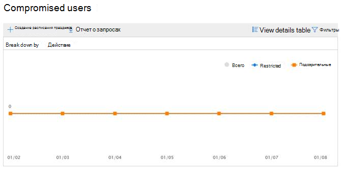
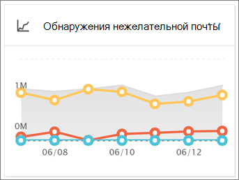

# Просмотр отчетов о безопасности почты в Центре безопасности и соответствия требованиям

В [центре безопасности & соответствия](https://protection.office.com) доступны разнообразные отчеты, которые помогут вам понять, как функции безопасности электронной почты, такие как защита от нежелательной почты, защита от вредоносных программ и функции шифрования в Microsoft 365 защищают вашу организацию. Если у вас есть [необходимые разрешения](#what-permissions-are-needed-to-view-these-reports), вы можете просмотреть эти отчеты в центре безопасности & соответствия требованиям, перейдя **Reports** на \> **панель мониторинга**отчетов. Чтобы перейти непосредственно к панели мониторинга отчетов, откройте ее <https://protection.office.com/insightdashboard> .

## Отчет о скомпрометированных пользователях

В отчете **скомпрометированные пользователи** отображается количество учетных записей пользователей, которые были помечены как **подозрительные** или **ограниченные** в течение последних 7 дней. Учетные записи в любом из этих состояний являются проблематичными или даже скомпрометированными. При частом использовании отчет можно использовать для выявления пиков и даже тенденций в подозрительных или ограниченных учетных записях. Дополнительные сведения о скомпрометированных пользователях можно узнать [в разделе ответ на скомпрометированную учетную запись электронной почты](responding-to-a-compromised-email-account.md).

В статистическом представлении отображаются данные за последние 90 дней, а в подробном представлении отображаются данные за последние 30 дней.

Чтобы просмотреть отчет, откройте [Центр безопасности & соответствия требованиям](https://protection.office.com), перейдите в **Reports** \> **панель мониторинга** отчетов и выберите **скомпрометированных пользователей**. Чтобы перейти непосредственно к отчету, откройте его <https://protection.office.com/reportv2?id=CompromisedUsers> .

Вы можете отфильтровать как диаграмму, так и таблицу сведений, щелкнув **фильтры** и выбрав одно или несколько из следующих значений:

- **Дата начала** и **Дата окончания**

- **Подозрительные**: учетная запись пользователя отправила подозрительные сообщения электронной почты и подвержена неограниченной отправке электронной почты.

- **Ограничено**: учетной записи пользователя запрещено отправлять электронную почту из-за очень подозрительных шаблонов.

Если щелкнуть **Таблица Просмотр сведений**, можно увидеть следующие сведения:

- **Время создания**
- **Идентификатор пользователя**
- **Действие**

Чтобы вернуться к представлению отчета, нажмите кнопку **Просмотреть отчет**.

## Отчет о шифровании

**Отчет о шифровании** доступен в EOP (подписка на почтовые ящики в Exchange Online или отдельном EOP без почтовых ящиков Exchange Online). Группа безопасности Организации может использовать сведения из этого отчета для определения шаблонов и профилактического применения или настройки политик для конфиденциальных сообщений электронной почты. Например:

- Если вы видите большое количество сообщений электронной почты, зашифрованных пользователями, может потребоваться добавить политику шифрования для автоматизации шифрования для определенных вариантов использования. Для получения дополнительных сведений см. [Определение правил для почтового процесса для шифрования сообщений электронной почты в Microsoft 365](../../compliance/define-mail-flow-rules-to-encrypt-email.md).

- Если у вас есть доступ к шаблонам шифрования, но никто их не использует, вы можете узнать, нужна ли для пользователей обучение функций.

Представление "Статистическая поддержка" позволяет фильтровать данные за последние 90 дней, в то время как в представлении Detailing допускается фильтрация в течение 10 дней.

Чтобы просмотреть отчет, откройте [Центр безопасности & соответствия требованиям](https://protection.office.com), откройте **Reports** \> **панель мониторинга "отчеты"** и выберите пункт " **отчет о шифровании**". Чтобы перейти непосредственно к отчету, откройте его <https://protection.office.com/reportv2?id=EncryptionReport> .

Дополнительные сведения о шифровании приведены [в разделе Шифрование электронной почты в Microsoft 365](../../compliance/email-encryption.md).

### Представление отчета для отчета о шифровании

На диаграмме можно использовать следующие фильтры:

- **Просмотр данных по: отчет о шифровании сообщений** и **разбивка по: метод шифрования**: доступны следующие методы шифрования:

  - **Шифрование пользователем**
  - **Шифрование с помощью политики**

  При нажатии кнопки **фильтры**можно изменить диаграмму с помощью следующих фильтров:

  - **Дата начала** и **Дата окончания**
  - Метод шифрования.
  - Шаблон шифрования.

- **Просмотр данных по: отчет о шифровании сообщений** и **разбивка по: шаблон шифрования**: доступны следующие методы шифрования:

  - **Не пересылать**
  - **Только шифрование**
  - **OME Previous**
  - **Custom**

  При нажатии кнопки **фильтры**можно изменить диаграмму с помощью следующих фильтров:

  - **Дата начала** и **Дата окончания**
  - Метод шифрования
  - Шаблон шифрования

- **Просмотр данных: пять доменов получателей**: в этом представлении отображается круговая диаграмма с числом отправленных сообщений для топ 5 доменов получателей.

  При нажатии кнопки **фильтры**можно **выбрать начальную и** **конечную**даты.

### Представление таблицы сведений для отчета о шифровании

Если щелкнуть **Таблица Просмотр сведений**, отображаемая информация зависит от диаграммы, которую Вы искали:

- **Разбейте на: метод шифрования** или **разбивка по: шаблон шифрования**: отображаются следующие сведения:

  - **Date**
  - **Адрес отправителя**
  - **Шаблон шифрования**
  - **Метод шифрования**
  - **Адрес получателя**
  - **Тема**

- **Просмотр данных: 5 самых популярных доменов получателей**:

  - **Date**
  - **домен получателя;**
  - **Количество сообщений**
  
Если в представлении Таблица сведений щелкнуть **фильтры** , вы можете изменить результаты с помощью следующих фильтров:

- **Дата начала** и **Дата окончания**
- Метод шифрования
- Шаблон шифрования

Чтобы вернуться к представлению отчета, нажмите кнопку **Просмотреть отчет**.

## Отчет о состоянии Mailflow

В **отчете о состоянии Mailflow** содержатся сведения о вредоносных и нежелательных сообщениях, фишинговых сообщениях и пограничных блокировках сообщений. Для получения дополнительных сведений обратитесь к [отчету о состоянии Mailflow](view-mail-flow-reports.md#mailflow-status-report).

## Обнаружение вредоносных программ в отчете электронной почты

В отчете об **обнаружении вредоносных программ в сообщении электронной почты** отображаются сведения об обнаружении вредоносных программ в входящих и исходящих сообщениях электронной почты (вредоносная программа, обнаруженная Exchange Online Protection или EOP). Дополнительные сведения о защите от вредоносных программ в EOP можно найти [в статье Защита от вредоносных программ в EOP](anti-malware-protection.md).

 Фильтр представления статистических данных допускает 90 дней, в то время как фильтр таблицы сведений разрешает только 10 дней.

Чтобы просмотреть отчет, откройте [Центр безопасности & соответствия требованиям](https://protection.office.com), перейдите на **Reports** \> **панель мониторинга** отчетов и выберите **Обнаружение вредоносных программ в электронной почте**. Чтобы перейти непосредственно к отчету, откройте его <https://protection.office.com/reportv2?id=MalwareDetections> .

Вы можете отфильтровать как диаграмму, так и таблицу сведений, щелкнув **фильтры** и выбрав:

- **Дата начала** и **Дата окончания**
- **Получение**
- **Прав**

Если щелкнуть **Таблица Просмотр сведений**, можно увидеть следующие сведения:

- **Date**
- **Адрес отправителя**
- **Адрес получателя**
- **КОД сообщения**
- **Тема**
- **Filename**
- **Имя вредоносной программы**

Чтобы вернуться к представлению отчета, нажмите кнопку **Просмотреть отчет**.

## Отчет о отправленных и полученных сообщениях электронной почты

Отчет о **отправленных и полученных сообщениях** содержит сведения о вредоносных и нежелательных сообщениях, правилах обработки почты (также называемых правилами транспорта) и расширенные обнаружения вредоносных программ после того, как электронная почта поступает в службу. Дополнительные сведения [см.](view-mail-flow-reports.md#sent-and-received-email-report)

## Отчет об обнаружении нежелательной почты

В отчете **обнаружения нежелательной почты** отображаются нежелательные сообщения электронной почты, заблокированные EOP. Сообщения учитываются по отдельности, а не по получателям. Например, если одно и то же нежелательное сообщение было отправлено в 100 получателей в Организации, оно считается одним сообщением.

Представление "Статистическое представление" допускает фильтрацию 90 дней, а таблица сведений разрешает фильтрацию на 10 дней.

Чтобы просмотреть отчет, откройте [Центр безопасности & соответствия требованиям](https://protection.office.com), перейдите на **Reports** \> **панель мониторинга** отчетов и выберите **Обнаружение нежелательной почты**. Чтобы перейти непосредственно к отчету, откройте его <https://protection.office.com/reportv2?id=SpamDetections> .

Дополнительные сведения о защите от нежелательной почты можно найти [в статье Защита от нежелательной почты в EOP](anti-spam-protection.md).

### Режим отчета для отчета об обнаружении нежелательной почты

В представлении отчета доступны следующие диаграммы:

- **Разбить на: действие**: отображаются следующие типы событий:

  - **Фильтр нежелательного содержимого**
  - **Блокировка IP-адресов спама**
  - **Блок конверта нежелательной почты**
  - **Фильтр DBEB нежелательной почты**: пограничная блокировка на основе каталогов (DBEB)

  Когда вы наводите указатель мыши на день (точка данных) на диаграмме, вы можете узнать, сколько элементов было заблокировано в этот день, а также как эти элементы классифицируются по категориям.

  

- **Разбивается на: направление**: отображаются следующие направления:

  - **Получение**
  - **Прав**

Если в представлении отчета щелкнуть **фильтры** , вы можете изменить результаты с помощью следующих фильтров:

- **Дата начала** и **Дата окончания**
- Значения направления
- Значения типов событий

### Представление таблицы сведений для отчета об обнаружении нежелательной почты

Если в каком-либо представлении отчета выбрать **Таблица просмотреть сведения** , отображаются следующие сведения:

- **Date**
- **Адрес отправителя**
- **Адрес получателя**
- **Тип события**
- **Действие**
- **Тема**

Если вы Нажимайте **фильтры** в таблице сведений, вы можете изменить результаты с помощью следующих фильтров:

- **Дата начала** и **Дата окончания**
- Значения направления
- Значения типов событий

Чтобы вернуться к представлению отчета, нажмите кнопку **Просмотреть отчет**.

## Отчет об обнаружении поддельных поддельных

Отчет об **обнаружении поддельных** поддельных сообщений показывает, сколько почтовых сообщений было обнаружено и какие из них были признаны "хорошими" (подделка почты выполнена по законным бизнес-причинам). Дополнительные сведения о подмене данных можно найти [в статье Защита от спуфинга в EOP](anti-spoofing-protection.md).

Сводное представление отчета поддерживает 90 дней фильтрации, в то время как в подробном представлении допускается не более десяти дней фильтрации.

Чтобы просмотреть отчет, откройте [Центр безопасности & соответствия требованиям](https://protection.office.com), перейдите на **Reports** \> **панель мониторинга** отчетов и выберите **Обнаружение поддельных поддельных**данных. Чтобы перейти непосредственно к отчету, откройте его <https://protection.office.com/reportv2?id=SpoofMailReport> .

Когда вы наводите указатель мыши на день (точка данных) на диаграмме, вы можете узнать, сколько поступило сообщений с подложным сообщением.

Вы можете отфильтровать как диаграмму, так и таблицу сведений, щелкнув **фильтры** и выбрав одно или несколько из следующих значений:

- **Дата начала** и **Дата окончания**

- **Хорошая почта**

- **Перехвачено как нежелательная почта**

Если щелкнуть **Таблица Просмотр сведений**, можно увидеть следующие сведения:

- **Date**
- **Поддельный отправитель**
- **Отправитель**
- **IP-адрес отправителя**
- **Действие**
- **Количество сообщений**

Чтобы вернуться к представлению отчета, нажмите кнопку **Просмотреть отчет**.

## Отчет о состоянии защиты от угроз

Отчет **о состоянии защиты от угроз** доступен как в EOP, так и в Office 365 ATP; Тем не менее, отчеты содержат различные данные. Например, пользователи EOP могут просматривать сведения о вредоносных программах, обнаруженных в электронной почте, но не могут получить сведения о [вредоносных файлах, обнаруженных в SharePoint Online, OneDrive или Microsoft Teams](atp-for-spo-odb-and-teams.md). Более подробную информацию об отчетах Office 365 ATP можно узнать в статье [Просмотр отчетов для office 365 Advanced Threat protection](view-reports-for-atp.md).

Это интеллектуальный отчет, отображающий вредоносную электронную почту, которая была обнаружена и заблокирована, а также позволяет администраторам безопасности определять тенденции или определять, требуется ли настройка политик организации.

Чтобы просмотреть отчет, откройте [Центр безопасности & соответствия требованиям](https://protection.office.com), перейдите в **Reports** \> **панель мониторинга** отчетов и выберите **состояние защиты от угроз**. Чтобы перейти непосредственно к отчету, откройте его <https://protection.office.com/reportv2?id=ATPV2AggregateReport> .

По умолчанию на диаграмме отображаются данные за предыдущие 7 дней. При нажатии кнопки **фильтры**можно выбрать диапазон дат 90 дней (пробные подписки могут быть ограничены 30 днями). В представлении Таблица сведений можно использовать фильтрацию в течение 30 дней.

### Представление отчета о состоянии защиты от угроз

Доступны следующие представления:

- **Просмотр данных по: обзор**: отображаются следующие сведения об обнаружении:

  - **Вредоносные программы электронной почты**
  - **Фишинг электронной почты**
  - **Вредоносные программы для контента**

- **Просмотр данных по: контенту \> Вредоносные программы**: отображаются следующие сведения:

  - **Модуль защиты от вредоносных программ**
  - **Файл детонации**

- **Разделите на: технология обнаружения** и **Просмотр данных по: \> Фишинг электронной почты**: отображаются следующие сведения:

  - **Репутация создания URL-адреса для ATP**\*
  - **Расширенный фильтр фишинга**\*
  - **Защита от спуфинга: сбой DMARC**
  - **Защита от спуфинга: внутри Организации**
  - **Защита от спуфинга: внешний домен**
  - **Олицетворение торговой марки**\*
  - **Олицетворение домена**\*
  - **Репутация URL-адреса EOP**
  - **Общий фильтр фишинга**
  - **Другие**
  - **Фишинг ZAP**\*\*
  - **URL-адрес детонации**\*\*
  - **Олицетворение пользователя**\*

- **Разделите на: технология обнаружения** и **Просмотр данных по: \> вредоносные программы электронной почты**: отображаются следующие сведения:

  - **Репутация файла, созданного ATP**\*\*
  - **Модуль защиты от вредоносных программ**
  - **Блок типа файла политики защиты от вредоносных программ**
  - **Файл детонации**\*\*
  - **Репутация вредоносных файлов**
  - * * Вредоносная программа ZAP * * * *\*\*
  - **Другие**

- **Разбейте на: тип политики** и **Просмотр данных по: " \> phishing-почта** " или **"Просмотр данных по": \> вредоносные программы электронной почты**: отображаются следующие сведения:

  - **Защита от вредоносных программ**\*\*
  - **Безопасное вложение**\*\*
  - **Защита от фишинга**
  - **Защита от нежелательной почты**
  - **Правило для процесса обработки почты** (также называемое правилом транспорта)
  - **Другие**

- **Разбивается на: состояние доставки** и **Просмотр данных по: " \> phishing-почта** " или **"Просмотр данных по": \> вредоносные программы электронной почты**: отображаются следующие сведения:

  - **Сбой доставки**
  - **Утерян**
  - **Пересылаются**
  - **Размещенный почтовый ящик: настраиваемая папка**
  - **Размещенный почтовый ящик: удаленные элементы**
  - **Размещенный почтовый ящик: папка "Входящие"**
  - **Размещенный почтовый ящик: Нежелательная почта**
  - **Локальный сервер: Доставка**
  - **Карантин**

\*Только для Office 365 ATP

\*\*Автоматическая очистка (ZAP) с нулевой назначением недоступна в автономной EOP (она работает только в почтовых ящиках Exchange Online).

При нажатии кнопки **фильтры**можно изменить отчет с помощью следующих фильтров:

- **Дата начала** и **Дата окончания**
- Значение обнаружения
- **Защищено** (только для Office 365 ATP): **ATP** или **EOP**. Обратите внимание, что это фильтруемое свойство недоступно в **данных представления:: контентная \> вредоносная программа**.

### Представление таблицы сведений для отчета о состоянии защиты от угроз

Если щелкнуть **Таблица Просмотр сведений**, отображаемая информация зависит от диаграммы, которую Вы искали:

- **Просмотр данных по: контенту \> Вредоносные программы**:

- **Date**
- **Location**
- **Направлено**
- **Имя вредоносной программы**

- **Просмотр данных по: обзор**: кнопка **таблицы сведений о просмотре** недоступна.

- Все остальные диаграммы:

  - **Date**
  - **Тема**
  - **Sender**
  - **Получатели**
  - **Направлено**
  - **Состояние доставки**.
  - **Источник компромисса**

При нажатии кнопки **фильтры**можно изменить отчет с помощью следующих фильтров:

- **Дата начала** и **Дата окончания**
- Значение обнаружения
- **Защищено** (только для Office 365 ATP): **ATP** или **EOP**. Обратите внимание, что это фильтруемое свойство недоступно в **данных представления:: контентная \> вредоносная программа**.

## Отчет о самых вредоносных программах

В отчете о **самых вредоносных программах** отображаются различные виды вредоносных программ, обнаруженных в [EOP](eop-features.md).

Чтобы просмотреть отчет, откройте [Центр безопасности & соответствия требованиям](https://protection.office.com), перейдите на **Reports** \> **панель мониторинга** отчетов и выберите **самые распространенные вредоносные программы**. Чтобы перейти непосредственно к отчету, откройте его <https://protection.office.com/reportv2?id=TopMalwaret> .

При наведении указателя на сектор на круговой диаграмме отображается название типа вредоносных программ и количество сообщений, обнаруженных при наличии вредоносных программ.

Щелкните отчет, чтобы открыть его в новом окне браузера, где можно получить более подробное представление отчета.

Под диаграммой вы увидите список обнаруженных вредоносных программ и количество сообщений, обнаруженных при наличии вредоносных программ. Обратите внимание, что Статистическое представление поддерживает только фильтрацию по 90 дней.

## URL-адрес отчета о защите от угроз

Мини-приложение для этого отчета называется " **отчет о защите URL-адресов** " на панели мониторинга отчетов и доступно только в Office 365 Advanced Threat protection (ATP). Это означает следующее:

- Подписка на Microsoft 365,
- Расширенная защита от угроз (план 1 *или* план 2) к любой другой подписке, включающей в себя Exchange Online Protection (EOP).

Чтобы перейти непосредственно к отчету **Защита от угроз URL** , откройте <https://protection.office.com/reportv2?id=URLProtectionActionReport> .

> [!NOTE]
> В этот отчет не будут выбраны данные о пользователях, к которым применяется политика безопасных ссылок, выбран параметр **не отслеживать нажатия пользователем** .

### Представление отчета по URL-адресу отчета по защите от угроз

В отчете по **защите от угроз URL-адресов** имеется два агрегированных представления, которые обновляются каждые четыре часа, в которых отображаются данные за последние 90 дней:

- **URL-адрес щелкните действие защиты**: показывает количество щелчков по пользователям в Организации, а также результаты щелчка мыши:

  - **Заблокировано**
  - **Заблокировано и нажато**
  - **Переход по нажатию во время сканирования**

  Щелчок указывает на то, что пользователь выбрал страницу блокировки на вредоносный веб-сайт (администраторы могут отключить функцию "щелкать" в разделе политики безопасных ссылок).

  При нажатии кнопки **фильтры**можно изменить отчет с помощью следующих фильтров:

  - **Дата начала** и **Дата окончания**
  - Доступные действия по защите от щелчка, а также значение, **разрешенное** для просмотра сведений обо всех щелчках URL (а не только заблокированных щелчков).

- **URL-адрес щелкните по приложению**: показывает количество щелчков URL-адресов в приложениях, поддерживающих безопасные ссылки Office 365 ATP:

  - **Клиент электронной почты**
  - **PowerPoint**
  - **Word**
  - **Excel**
  - **OneNote**
  - **Visio**
  - **Teams**
  - **Other**

  При нажатии кнопки **фильтры**можно изменить отчет с помощью следующих фильтров:

  - **Дата начала** и **Дата окончания**
  - Доступные приложения.

### Представление таблицы сведений для отчета о защите от угроз

Если вы нажмете кнопку **Просмотр сведений**, отчет предоставляет представление почти в режиме реального времени для всех щелчков в Организации за последние 7 дней со следующими сведениями:

- **Щелкните время**
- **User**
- **URL-адрес**
- **Действие**
- **Приложение**

Если щелкнуть **фильтры** в представлении Таблица сведений, можно отфильтровать по тем же критериям, что и в представлении отчета, а также по **доменам** или **получателям** , разделенным запятыми.

Чтобы вернуться к представлению отчетов, нажмите кнопку **Просмотреть отчет**.

## Отчет о сообщениях, отчет о пользователях

Отчет о сообщениях в отчетах о **пользователях** содержит сведения о сообщениях электронной почты, которые пользователи сообщили как нежелательные, фишинговые попытки или хорошие сообщения с помощью [надстройки Report Message](https://docs.microsoft.com/microsoft-365/security/office-365-security/enable-the-report-message-add-in).

Для каждого сообщения доступны подробные сведения, в том числе причина доставки, такие как исключение политики нежелательной почты или правило обработки почты, настроенное для Организации. Чтобы просмотреть сведения, выберите элемент в списке пользователь — отчеты, а затем просмотрите сведения на вкладках **Сводка** и **сведения** .

Чтобы просмотреть этот отчет, в [центре безопасности & соответствия требованиям](https://protection.office.com)выполните одно из следующих действий.

- Перейдите к **Threat management** \> **Dashboard** \> **сообщению, сообщенному пользователями**панели управления угрозами.

- Перейдите к разделу **Управление угрозами** \> **Обзор** \> **сообщений, отправленных пользователями**.

> [!IMPORTANT]
> Чтобы отчет о сообщениях, отправленных пользователями, работал правильно, **необходимо включить ведение журнала аудита** для среды Office 365. Это обычно делается для пользователей, которым назначена роль "журналы аудита" в Exchange Online. Дополнительную информацию можно узнать [в статье Включение и отключение поиска в журнале аудита Microsoft 365](https://docs.microsoft.com/microsoft-365/compliance/turn-audit-log-search-on-or-off).

## Какие разрешения необходимы для просмотра отчетов?

Для просмотра и использования отчетов необходимо быть членом указанной группы ролей в центре безопасности & соответствия требованиям **и** в Exchange Online.

- В центре безопасности & соответствия требованиям необходимо быть участником одной из следующих групп ролей:

  -Управление организацией — администратор безопасности (это можно также сделать в [центре администрирования Azure Active Directory](https://aad.portal.azure.com) — средство чтения безопасности

  Дополнительные сведения см. в статье [Разрешения в Центре безопасности и соответствия требованиям](https://docs.microsoft.com/microsoft-365/security/office-365-security/permissions-in-the-security-and-compliance-center).

- В Exchange Online необходимо быть участником одной из следующих групп ролей:

  — Управление организацией — Управление организацией только для просмотра — "только просмотр получателей" — Управление соответствием требованиям

Дополнительные сведения см в разделе [разрешения в Exchange Online](https://docs.microsoft.com/Exchange/permissions-exo/permissions-exo) и [Управление группами ролей в Exchange Online](https://docs.microsoft.com/Exchange/permissions-exo/role-groups).

## Что делать, если в отчетах данные не отображаются?

Если вы не видите данные в отчетах, дважды проверьте правильность настройки политик. Чтобы узнать больше, ознакомьтесь [со статьей защита от угроз](protect-against-threats.md).

## Связанные статьи

[Защита от нежелательной почты и вредоносных программ в EOP](anti-spam-and-anti-malware-protection.md)

[Интеллектуальные отчеты и аналитика в Центре безопасности и соответствия требованиям](reports-and-insights-in-security-and-compliance.md)
