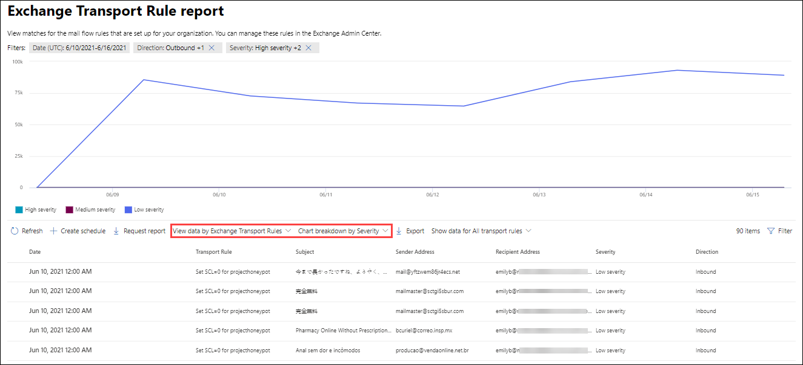

# Просмотр отчетов о безопасности электронной почты на портале Microsoft 365 Defender

[!INCLUDE [Microsoft 365 Defender rebranding](../includes/microsoft-defender-for-office.md)]

**Область применения**
- [Exchange Online Protection](exchange-online-protection-overview.md)
- [Microsoft Defender для Office 365 (план 1 и план 2)](defender-for-office-365.md)
- [Microsoft 365 Defender](../defender/microsoft-365-defender.md)

На портале Microsoft 365 Defender доступны различные отчеты, которые помогут вам увидеть, как функции безопасности электронной почты, такие как средства защиты от нежелательной почты, защиты от вредоносных программ и шифрования в <https://security.microsoft.com> Microsoft 365, защищают вашу организацию. Если у вас есть необходимые [разрешения,](#what-permissions-are-needed-to-view-these-reports)вы можете просмотреть эти отчеты  на портале Защитник Microsoft 365, переехав в отчеты электронной почты & совместной & отчеты о совместной работе \>  \> . Чтобы перейти непосредственно на **страницу отчетов & электронной почты,** откройте <https://security.microsoft.com/emailandcollabreport> .

> [!NOTE]
>
> Некоторые отчеты на странице отчетов **о совместной &** требуют Microsoft Defender для Office 365. Сведения об этих отчетах см. в отчетах [View Defender for Office 365 на портале Microsoft 365 Defender.](view-reports-for-mdo.md)
>
> Отчеты, связанные с потоком почты, теперь находятся в центре администрирования Exchange (EAC). Дополнительные сведения об этих отчетах см. в отчете о потоке [почты в новом центре администрирования Exchange.](/exchange/monitoring/mail-flow-reports/mail-flow-reports)

## Отчет о скомпрометировании пользователей

> [!NOTE]
> Этот отчет доступен в организациях Microsoft 365 с почтовыми ящиками Exchange Online. Он не доступен в автономных организациях Exchange Online Protection (EOP).

В **отчете о** скомпрометировании пользователей  показано  количество учетных записей пользователей, отмеченных как подозрительные или ограниченные в течение последних 7 дней. Учетные записи в любом из этих штатов являются проблемными или даже скомпрометированными. При частом использовании вы можете использовать отчет для задания пиков и даже тенденций в подозрительных или ограниченных учетных записях. Дополнительные сведения о скомпрометированных пользователях см. в [сообщении Responding to a compromised email account.](responding-to-a-compromised-email-account.md)

В сводном представлении показаны данные за последние 90 дней, а в представлении подробно показаны данные за последние 30 дней.

Чтобы просмотреть отчет на портале Защитник Microsoft  365, перейдите в отчеты электронной почты & совместной & отчеты о \>  \> **совместной работе.** На странице **Отчеты & электронной** почты найдите скомпрометированную пользователей и нажмите  **кнопку Просмотр сведений**. Чтобы перейти непосредственно к отчету, откройте <https://security.microsoft.com/reports/CompromisedUsers> .

На странице **"Скомпрометированная** страница пользователей" можно отфильтровать диаграмму и таблицу сведений, щелкнув **фильтр** и выбрав одно или несколько следующих значений в вылете:

- **Дата (UTC)**: **Дата начала и** дата **окончания**.
- **Действие:**
  - **Подозрительный.** Учетная запись пользователя отправила подозрительные сообщения электронной почты и может быть ограничена отправкой электронной почты.
  - **Ограничение.** Учетная запись пользователя была ограничена отправкой электронной почты из-за весьма подозрительных шаблонов.

Когда вы закончите настройку фильтров, нажмите **кнопку Применить,** **Отменить** или **очистить фильтры**.

В таблице сведений под графиком можно увидеть следующие сведения:

- **Время создания**
- **Идентификатор пользователя**
- **Действие**

## Отчет о правилах транспорта Exchange

В **отчете о** правилах транспорта Exchange показано влияние правил потока почты (также известных как правила транспорта) на входящие и исходяющие сообщения в вашей организации.

Чтобы просмотреть отчет на портале Защитник Microsoft  365, перейдите в отчеты электронной почты & совместной & отчеты о \>  \> **совместной работе.** На странице **Отчеты & сообщения** электронной почты найдите правило **транспорта Exchange** и нажмите **кнопку Просмотр сведений**. Чтобы перейти непосредственно к отчету, откройте <https://security.microsoft.com/reports/ETRRuleReport> .

На странице **отчета о правилах транспорта Exchange** доступные диаграммы и данные описаны в следующих разделах.

### Разбивка диаграмм по направлению

Если выбрать **разбивку диаграммы по направлению,** доступны последующие диаграммы:

- **Просмотр данных по правилам транспорта Exchange:**  количество входящие и исходящие сообщения, которые были затронуты правилами потока почты. 
- **Просмотр данных правил транспорта DLP Exchange:** количество  входящие и исходящие сообщения, которые были затронуты правилами предотвращения потери данных (DLP) потока почты. 

Ниже приведены следующие сведения в таблице сведений под графиком:

- **Date**
- **Политика DLP** (Просмотр данных только по **правилам транспорта DLP Exchange)**
- **Правило транспорта**
- **Тема**
- **Адрес отправителя**
- **Адрес получателя**
- **Серьезность**
- **Направление**

Вы можете фильтровать диаграмму и таблицу сведений, щелкнув **Фильтр** и выбрав одно или несколько следующих значений в вылете:

- **Дата (UTC)** **Дата начала и** дата **окончания**
- **Направление:** **исходящие и** **входящие**
- **Серьезность:** **высокая серьезность,** **средняя серьезность** и **низкая серьезность**

Когда вы закончите настройку фильтров, нажмите **кнопку Применить,** **Отменить** или **очистить фильтры**.

### Разбивка диаграммы по строгости

Если выбрать **разбивку диаграммы по строгости,** доступны последующие диаграммы:

- **Просмотр данных по правилам транспорта Exchange:** количество сообщений с высокой степенью серьезности, средней серьезности и **низкой** серьезности. Вы установите уровень серьезности в качестве действия в правиле **(Аудит** этого правила с уровнем серьезности или _SetAuditSeverity)._ Дополнительные сведения см. в сообщении о действиях правила [потока почты в Exchange Online.](/Exchange/security-and-compliance/mail-flow-rules/mail-flow-rule-actions)

- Просмотр данных по правилам транспорта **DLP Exchange:** количество сообщений  высокой степени **тяжести,** средней серьезности и низкой степени тяжести, которые были затронуты правилами потока почты DLP.

Ниже приведены следующие сведения в таблице сведений под графиком:

- **Date**
- **Политика DLP** (Просмотр данных только по **правилам транспорта DLP Exchange)**
- **Правило транспорта**
- **Тема**
- **Адрес отправителя**
- **Адрес получателя**
- **Серьезность**
- **Направление**

Вы можете фильтровать диаграмму и таблицу сведений, щелкнув **Фильтр** и выбрав одно или несколько следующих значений в вылете:

- **Дата (UTC)** **Дата начала и** дата **окончания**
- **Направление:** **исходящие и** **входящие**
- **Серьезность:** **высокая серьезность,** **средняя серьезность** и **низкая серьезность**

Когда вы закончите настройку фильтров, нажмите **кнопку Применить,** **Отменить** или **очистить фильтры**.

## Отчет о переадпорте

> [!NOTE]
> Отчет **о переадпорте** теперь доступен в EAC. Дополнительные сведения см. в [отчете автопроизводить](/exchange/monitoring/mail-flow-reports/mfr-auto-forwarded-messages-report)сообщений в новом EAC.

## Отчет о состоянии почтового потока

Отчет **о** состоянии почтового потока — это интеллектуальный отчет, в нем показаны сведения о входящих и исходяющих сообщениях электронной почты, обнаружения нежелательной почты, вредоносных программ, электронной почты, идентифицированной как "хорошая", а также сведения о разрешенной или заблокированной электронной почте на краю. Это единственный отчет, содержащий сведения о защите края, и показывает, сколько сообщений электронной почты блокируется до того, как они будут допущены в службу для оценки в Exchange Online Protection (EOP). Важно понимать, что если сообщение отправляется пяти получателям, мы считаем его пятью разными сообщениями, а не одним сообщением.

Чтобы просмотреть отчет на портале Защитник Microsoft  365, перейдите в отчеты электронной почты & совместной & отчеты о \>  \> **совместной работе.** На странице **отчеты &** электронной почты найдите сводку состояния **mailflow** и нажмите **кнопку Просмотр сведений**. Чтобы перейти непосредственно к отчету, откройте <https://security.microsoft.com/reports/mailflowStatusReport> .

### Введите представление отчета о состоянии mailflow

При открывании отчета вкладка **Type** выбирается по умолчанию. По умолчанию это представление содержит диаграмму и таблицу сведений, настроенные с помощью следующих фильтров:

- **Дата (UTC)** Последние 7 дней.
- **Направление почты:**
  - **Входящий**
  - **Исходящие**
  - **Intra-org:** это количество для сообщений в клиенте, то есть отправитель abc@domain.com получателям xyz@domain.com (засчитываются  отдельно от входящие и **исходящие)**
- **Тип:**
  - **Хорошая почта**
  - **Вредоносная программа**
  - **Спам**
  - **Защита края**
  - **Сообщения правил**
  - **Фишинговое письмо**
- **Домен**: **Все**

Диаграмма организована **значениями Type.**

Эти фильтры можно изменить, щелкнув **Фильтр** или щелкнув значение в легенде диаграммы.

Ниже приведены следующие сведения в таблице сведений под графиком:

- **Направление**
- **Тип**
- **24 часа**
- **за 3 дня;**
- **7 дней**
- **15 дней**
- **30 дней**

Если вы **нажмете Выберите категорию для получения** дополнительных сведений, вы можете выбрать из следующих значений:

- **Фишинговое письмо.** Этот выбор принимает вас к отчету о [состоянии защиты от угроз.](view-email-security-reports.md#threat-protection-status-report)
- **Вредоносные программы в электронной** почте: этот выбор принимает вас к отчету о [состоянии защиты от угрозы](view-email-security-reports.md#threat-protection-status-report).
- **Обнаружение нежелательной почты.** Этот выбор принимает вас к [отчету обнаружения нежелательной почты](view-email-security-reports.md#spam-detections-report).
- **Edge заблокирован нежелательной почты:** этот выбор принимает вас к [отчету обнаружения нежелательной почты](view-email-security-reports.md#spam-detections-report).

#### Экспорт из представления Type

Для представления подробной информации можно экспортировать данные только в течение одного дня. Поэтому, если вы хотите экспортировать данные в течение 7 дней, необходимо сделать 7 различных действий по экспорту.

Каждый экспорт .csv ограничивается 150 000 строк. Если данные за этот день содержат более 150 000 строк, будет создано несколько .csv файлов.

### Представление направления для отчета о состоянии mailflow

Если щелкнуть **вкладку Direction,** используются те же фильтры по умолчанию из представления **Type.**

Диаграмма организована **значениями Direction.**

Эти фильтры можно изменить, нажав **фильтр.** Используются те же фильтры из представления **Type.**

В таблице сведений содержатся те же сведения из **представления Type.**

Выбор **категории для получения дополнительных** сведений о выборах и поведении такой же, как представление **Type.**

#### Экспорт из представления Direction

Для представления подробной информации можно экспортировать данные только в течение одного дня. Поэтому, если вы хотите экспортировать данные в течение 7 дней, необходимо сделать 7 различных действий по экспорту.

Каждый экспорт .csv ограничивается 150 000 строк. Если данные за этот день содержат более 150 000 строк, будет создано несколько .csv файлов.

### Представление воронки для отчета о состоянии mailflow

В **представлении Воронка** показано, как функции защиты от угроз электронной почты Майкрософт фильтруют входящие и исходяющие сообщения электронной почты в вашей организации. В нем представлены сведения об общем числе сообщений электронной почты, а также о том, как настроенные функции защиты от угроз, включая защиту края, антивирусные программы, защиту от фишинга, защиту от нежелательной почты и защиту от спуфинга, влияют на этот счет.

Если щелкнуть вкладку **Воронка,** это представление по умолчанию содержит диаграмму и таблицу сведений, настроенных с помощью следующих фильтров:

- **Дата.** Последние 7 дней.

- **Направление:**
  - **Входящий**
  - **Исходящие**
  - **Intra-org.** Это количество для сообщений, отправленных в клиенте; то есть отправитель отправляет abc@domain.com получателям xyz@domain.com (засчитываются отдельно от входящие и исходящие).

Совокупное представление и представление таблицы сведений позволяет фильтровать в течение 90 дней.

Эти фильтры можно изменить, нажав **фильтр.** Используются те же фильтры из представления **Type.**

На этой диаграмме показана графа электронной почты, организованного по:

- **Всего сообщений электронной почты**
- **Электронная почта после защиты края**
- **Электронная почта после правила транспорта** (правило потока почты)
- **Электронная почта после вредоносных программ, репутации файлов, блока типа файла**
- **Электронная почта после защиты от фишинга, репутации URL-адресов, обезличения бренда и подмены**
- **Электронная почта после фильтрации массовой почты после нежелательной почты**
- **Электронная почта после обезличения пользователя и домена**\*
- **Электронная почта после детонации файла и URL-адреса**\*
- **Электронная почта, обнаруженная как доброкачественная после защиты после доставки (защита времени щелчка URL-адреса)**

\*Защитник только для Office 365

Чтобы просмотреть сообщение электронной почты, фильтруемой EOP или Defender для Office 365, щелкните значение в легенде диаграммы.

В таблице сведений содержатся следующие сведения, показанные в порядке убывающих дат:

- **Date**
- **Всего сообщений электронной почты**
- **Защита края**
- **Anti-malware, file reputation, file type block:**
  - **Репутация файла:** сообщения фильтруются из-за идентификации присоединенного файла другими клиентами Майкрософт.
  - **Блок типа файла.** Сообщения фильтруются из-за типа вредоносного файла, идентифицированного в сообщении.
- **Защита от фишинга, репутация URL-адреса, вымысление бренда, защита от подмены:**
  - **Репутация URL-адреса.** Сообщения фильтруются из-за идентификации URL-адреса другими клиентами Майкрософт.
  - **Вымысление** бренда: сообщения фильтруются из-за сообщения, исходящем от известных отправителей бренда, вымыкающих себя.
  - **Anti-spoof**: Сообщения фильтруются из-за сообщения, пытающихся подменить домен, к который принадлежит получатель, или домена, который не принадлежит отправителю сообщения.
- **Фильтрация массовой почты** для борьбы со спамом:
  - **Массовая фильтрация** почты: сообщения фильтруются на основе порогового значения уровня жалобы (BCL) в политике борьбы со спамом.
- **Вымысление** пользователя и домена (Defender для Office 365) :
  - Вымысление пользователя. Сообщения фильтруются из-за попытки выдать себя за пользователя (отправитель сообщений), определенного в параметрах защиты от фишинга.
  - **Обезличение** домена. Сообщения фильтруются из-за попытки выдать себя за домен, определенный в параметрах защиты от фишинга.
- **Детонация файлов и URL-адресов (Defender для Office 365)**:
  - **Детонация файлов:** сообщения, фильтруемые политикой Сейф вложений.
  - **Детонация URL-адреса.** Сообщение фильтруется политикой Сейф ссылки.
- Защита после доставки и **ZAP (ATP) или ZAP (EOP)**: автоматическая очистка нулевого часа (ZAP) для вредоносных программ, нежелательной почты и фишинга.

Если вы выберите строку в таблице сведений, в вылете будет показана дальнейшая разбивка учетных записей электронной почты.

#### Экспорт из представления Воронка

После нажатия **"Экспорт** в **параметрах"** можно выбрать одно из следующих значений:

- **Сводка (с данными за последние 90 дней не более)**
- **Сведения (с данными за последние 30 дней не более)**

В **соответствии с датой** выберите диапазон, а затем нажмите **кнопку Применить**. Данные для текущих фильтров будут экспортироваться в .csv файл.

Каждый экспорт .csv ограничивается 150 000 строк. Если данные содержат более 150 000 строк, будет создано несколько .csv файлов.

### Техническое представление отчета о состоянии mailflow

Представление **Tech аналогично** представлению **Воронка,** предоставляя более подробные сведения о настроенных средствах защиты от угроз. На диаграмме можно увидеть, как классифицируются сообщения на различных этапах защиты от угроз.

Если вы нажмете вкладку **"Просмотр** технологий", по умолчанию это представление содержит диаграмму и таблицу сведений, настроенные с помощью следующих фильтров:

- **Дата.** Последние 7 дней.

- **Направление:**
  - **Входящий**
  - **Исходящие**
  - **Intra-org:** это количество для сообщений в клиенте, то есть отправитель abc@domain.com отправляет получателю xyz@domain.com (рассчитывается отдельно от входящие и исходящие)

Совокупное представление и представление таблицы сведений позволяет фильтровать в течение 90 дней.

Эти фильтры можно изменить, нажав **фильтр.** Используются те же фильтры из представления **Type.**

На этой диаграмме показаны сообщения, организованные в следующие категории:

- **Всего сообщений электронной почты**
- **Edge allow** and **Edge filtered**
- **Правила транспорта позволяют и** **правила транспорта фильтруются** (правила потока почты)
- **Не вредоносные** программы, **Сейф обнаружения** вложений \* и обнаружения **вредоносных программ**
- **Не фишинг,** **отказ DMARC,** **обнаружение** обезличения, \* обнаружение **Spoof** и **обнаружение фишинга**
- **Отсутствие обнаружения с детонацией URL-адреса** и **обнаружением детонации URL-адреса**\*
- **Не нежелательной почты** и  **нежелательной почты**
- **Обнаружение ссылок,** **Сейф** \* и **ZAP**

\*Defender для Office 365

Когда вы наведите курсор над категорией на диаграмме, вы увидите количество сообщений в этой категории.

В таблице сведений содержатся следующие сведения, показанные в порядке убывающих дат:

- **Дата (UTC)**
- **Всего сообщений электронной почты**
- **Отфильтрованный край**
- **Сообщения правил:** сообщения фильтруются из-за правил потока почты (также известных как правила транспорта).
- **Антивирусный двигатель**, **Сейф вложения** \* :
- **DMARC, impersonation** \* , **spoof**, **phish filtered**:
  - **DMARC:** Сообщения фильтруются из-за отказа сообщения проверки подлинности DMARC.
- **Обнаружение детонации URL-адреса**\*
- **Фильтрация от нежелательной почты**
- **ZaP удален**
- **Обнаружение по Сейф ссылки**\*

\*Defender для Office 365

Если вы выберите строку в таблице сведений, в вылете будет показана дальнейшая разбивка учетных записей электронной почты.

#### Экспорт с точки зрения технологий

При **нажатии на экспорт** **можно** выбрать одно из следующих значений:

- **Сводка (с данными за последние 90 дней не более)**
- **Сведения (с данными за последние 30 дней не более)**

В **соответствии с датой** выберите диапазон, а затем нажмите **кнопку Применить**. Данные для текущих фильтров будут экспортироваться в .csv файл.

Каждый экспорт .csv ограничивается 150 000 строк. Если данные содержат более 150 000 строк, будет создано несколько .csv файлов.

## Отчет об обнаружении вредоносных программ

В **отчете об** обнаружении вредоносных программ показаны сведения об обнаружении вредоносных программ в входящих и исходяющих сообщениях электронной почты (вредоносные программы, обнаруженные Exchange Online Protection или EOP). Дополнительные сведения о защите от вредоносных программ в EOP см. в программе Защита от вредоносных [программ в EOP.](anti-malware-protection.md)

Совокупный фильтр представления позволяет в течение 90 дней, в то время как фильтр таблицы сведений разрешает только 10 дней.

Чтобы просмотреть отчет на портале Microsoft 365 Defender,  перейдите в отчеты электронной почты & совместной & отчеты о \>  \> **совместной работе.** На странице **Отчеты &** электронной почты найдите вредоносные программы, обнаруженные в электронной почте, а затем нажмите  **кнопку Просмотр сведений**. Чтобы перейти непосредственно к отчету, откройте <https://security.microsoft.com/reports/MalwareDetections> .

На странице **отчета об** обнаружении вредоносных программ можно фильтровать диаграмму и таблицу сведений, щелкнув **фильтр** и выбрав одно из следующих значений:

- **Дата (UTC)** **Дата начала и** дата **окончания**
- **Направление:** **входящие и** **исходящие**

В таблице сведений под графиком можно увидеть следующие сведения:

- **Date**
- **Адрес отправителя**
- **Адрес получателя**
- **ID сообщения.** Доступно в **поле заглавной области Message-ID** в загонах сообщений и должно быть уникальным. Например, значение `<08f1e0f6806a47b4ac103961109ae6ef@server.domain>` (обратите внимание на угловые скобки).
- **Тема**
- **Filename**
- **Имя вредоносных программ**

## Отчет о задержке почты

Отчет **о задержке** почты в Defender for Office 365 содержит сведения о задержке доставки почты и детонации в организации. Дополнительные сведения см. в [отчете о задержке почты.](view-reports-for-mdo.md#mail-latency-report)

## Отчет об обнаружении нежелательной почты

> [!NOTE]
> Отчет **об обнаружении нежелательной почты** в конечном итоге пройдет. Такая же информация доступна в отчете о состоянии [защиты от угроз.](#threat-protection-status-report)

## Отчет об обнаружении подмены

> [!NOTE]
> Улучшенный отчет об обнаружении Spoof, описанный в этой статье, находится в предварительной версии, подлежит изменениям и доступен не во всех организациях. Более старая версия отчета показывает только хорошую почту **и** **уловлено как spam.**

В **отчете о обнаружениях Spoof** показаны сведения о сообщениях, которые были заблокированы или разрешены из-за подмены. Дополнительные сведения о подмене см. в этой информации в [EOP.](anti-spoofing-protection.md)

Совокупное представление отчета позволяет в течение 45 дней фильтрации, в то время как представление детализации позволяет фильтровать только десять \* дней.

\* В конце концов, вы сможете использовать до 90 дней фильтрации.

Чтобы просмотреть отчет на портале Microsoft 365 Defender,  перейдите в отчеты электронной почты & совместной & отчеты о \>  \> **совместной работе.** На странице **отчеты &** сообщений о совместной работе найдите обнаружение **Spoof** и нажмите **кнопку Просмотр сведений**. Чтобы перейти непосредственно к отчету, откройте <https://security.microsoft.com/reports/SpoofMailReportV2> .

На диаграмме показаны следующие сведения:

- **Pass**
- **Fail**
- **SoftPass**
- **Нет**
- **Other**

При наведении в течение дня (точки данных) на диаграмме можно увидеть, сколько поддельных сообщений было обнаружено и почему.

На странице **Spoof mail report** можно отфильтровать диаграмму и таблицу сведений, щелкнув **фильтр** и выбрав одно или несколько следующих значений:

- **Дата (UTC)** **Дата начала и** дата **окончания**
- **Результат:**
  - **Pass**
  - **Fail**
  - **SoftPass**
  - **Нет**
  - **Other**
- **Тип Spoof:** **внутренний и** **внешний**

В таблице сведений под графиком можно увидеть следующие сведения:

- **Date**
- **Подмена пользователя**
- **Отправка инфраструктуры**
- **Тип Spoof**
- **Результат**
- **Код результатов**
- **SPF**
- **DKIM**
- **DMARC**
- **Количество сообщений**

Дополнительные сведения о сводных кодах результатов проверки подлинности см. в материале [Anti-spam message headers in Microsoft 365.](anti-spam-message-headers.md)

## Отчет о представлениях

В **отчете Submissions** показаны сведения о том, что администраторы отчитались в Корпорацию Майкрософт для анализа. Дополнительные сведения см. в материале Использование отправки администратора для отправки в Корпорацию Майкрософт подозрительных [спама, фишинга, URL-адресов и файлов.](admin-submission.md)

Чтобы просмотреть отчет на портале Microsoft 365 Defender,  перейдите в отчеты электронной почты & совместной & отчеты о \>  \> **совместной работе.** На странице **Отчеты & электронной** почты найдите **материалы** и нажмите кнопку **Просмотр сведений**. Чтобы перейти непосредственно к отчету, откройте <https://security.microsoft.com/adminSubmissionReport> . Чтобы перейти [к представлениям администратора на портале Microsoft 365 Defender,](admin-submission.md)нажмите **кнопку Перейти к отправкам.**

На диаграмме показаны следующие сведения:

- **Pending**
- **Выполнено**

На странице **Представления** можно фильтровать диаграмму и таблицу сведений, щелкнув **фильтр** и выбрав одно или несколько следующих значений:

- **Дата, о чем сообщалось:** **время начала и** **окончания**
- **Тип отправки:** **электронная** **почта, URL-адрес** или **файл**
- **ID отправки**
- **ID сетевого сообщения**
- **Sender**
- **Название**
- **Отправлено**
- **Причина отправки:** **не нежелательной,** **фишинг,** **вредоносные** программы или **нежелательной почты**
- **Состояние Rescan:** **ожидание или** **заполнение**

В таблице сведений ниже графика показаны те же сведения, что и  в столбцах **Group** или **Customize,** что и на вкладке Отправка для анализа в email **&** \> **отправки совместной работы.** Дополнительные сведения см. в [материале Просмотр представлений администратора в Корпорации Майкрософт.](admin-submission.md#view-admin-submissions-to-microsoft)

## отчет о состоянии защиты от угроз;

Отчет **о состоянии защиты от** угроз доступен в EOP и Defender для Office 365; однако отчеты содержат различные данные. Например, клиенты EOP могут просматривать сведения о вредоносных программах, обнаруженных в электронной почте, но не сведения о вредоносных файлах, обнаруженных Сейф вложениями для [SharePoint, OneDrive](mdo-for-spo-odb-and-teams.md)и Microsoft Teams .

В отчете приводится количество сообщений электронной почты со вредоносным контентом, например файлов или [веб-адресов](set-up-anti-phishing-policies.md#exclusive-settings-in-anti-phishing-policies-in-microsoft-defender-for-office-365)(URL-адресов), которые были заблокированы с помощью двигателя защиты от вредоносных программ, автоматической очистки нулевого часа [(ZAP)](zero-hour-auto-purge.md)и функций Defender для Office 365, таких как [Сейф Links,](safe-links.md) [Сейф Attachments](safe-attachments.md), и функции защиты от фишинга в политиках защиты от фишинга . Эти сведения можно использовать для определения тенденций или определения необходимости корректировки политик организации.

**Примечание.** Важно понимать, что если сообщение отправляется пяти получателям, мы считаем его пятью разными сообщениями, а не одним сообщением.

Чтобы просмотреть отчет на портале Microsoft 365 Defender,  перейдите в отчеты электронной почты & совместной & отчеты о \>  \> **совместной работе.** На странице **отчеты & электронной** почты найдите состояние **защиты** от угроз и нажмите **кнопку Просмотр сведений**. Чтобы перейти непосредственно к отчету, откройте один из следующих URL-адресов:

- Defender для Office 365:<https://security.microsoft.com/reports/TPSAggregateReportATP>
- EOP: <https://security.microsoft.com/reports/TPSAggregateReport>

По умолчанию на диаграмме показаны данные за последние 7 дней. При **нажатии фильтра** на странице отчета о состоянии защиты от угроз можно выбрать диапазон дат в 90 дней (пробная подписка может быть ограничена 30 днями).  Таблица сведений позволяет фильтровать в течение 30 дней.

Доступные представления описаны в следующих разделах.

### Просмотр данных по обзору

В **представлении View data by Overview** на диаграмме показаны следующие сведения об обнаружении:

- **Вредоносные программы электронной почты**
- **Фишинг электронной почты**
- **Вредоносные программы контента**

Таблица сведений недоступна ниже диаграммы.

При **нажатии фильтра** доступны следующие фильтры:

- **Дата (UTC)** **Дата начала и** дата **окончания**
- **Обнаружение:** **вредоносные программы** по **электронной почте, фишинг электронной почты** или **вредоносные программы по контенту**
- **Защищено:** **MDO** (Defender for Office 365) или **EOP**
- **Тег.** Фильтр результатов пользователями или группами с указанным тегом пользователя (включая учетные записи приоритета). Дополнительные сведения о тегах пользователей см. в [тегах пользователей.](user-tags.md)
- **Направление**
- **Домен**
- **Тип политики**

Когда вы закончите настройку фильтров, нажмите **кнопку Применить,** **Отменить** или **очистить фильтры**.

### Просмотр данных с помощью \> фишинга электронной почты и разбивки диаграмм с помощью технологии обнаружения

В **представлении данных по фишингу электронной \> почты** и разбивке диаграмм по представлению **технологии** обнаружения на диаграмме показаны следующие сведения:

- **Вредоносная репутация** URL-адреса: вредоносная репутация URL-адреса, созданная в Defender для Office 365 в других Microsoft 365 \* клиентах.
- **Расширенный фильтр:** фишинговые сигналы на основе машинного обучения.
- **Общий фильтр:** фишинговые сигналы, основанные на правилах аналитика.
- **Spoof intra-org.** Отправитель пытается подменить домен получателя.
- **Внешний домен Spoof.** Отправитель пытается подменить другой домен.
- **Spoof DMARC:** Сбой проверки подлинности DMARC в сообщениях.
- **Бренд Impersonation**: Impersonation известных брендов на основе отправителей.
- **Обнаружение с помощью смешанного анализа**
- **Репутация файла**
- **Сопоставление отпечатков**
- **Репутация детонации URL-адреса**\*
- **Детонация URL-адреса**\*
- **Пользователь impersonation**\*
- **Домен impersonation** \* : Impersonation доменов, которые клиент владеет или определяет.
- **Вымысление** сведении почтовых ящиков: обезличение пользователей, определенных администратором или \* выучатся с помощью разведки почтовых ящиков.
- **Детонация файлов**\*
- **Кампания**\*

В таблице сведений ниже диаграммы доступны следующие сведения:

- **Date**
- **Тема**
- **Sender**
- **Получатели**
- **Обнаружено**
- **Состояние доставки**
- **Источник компромисса**
- **Tags**

При **нажатии фильтра** доступны следующие фильтры:

- **Дата (UTC)** **Дата начала и** дата **окончания**
- **Обнаружение**
- **Защищено:** **MDO** (Defender for Office 365) или **EOP**
- **Направление**
- **Тег.** Фильтр результатов пользователями или группами с указанным тегом пользователя (включая учетные записи приоритета). Дополнительные сведения о тегах пользователей см. в [тегах пользователей.](user-tags.md)
- **Домен**
- **Тип политики**
- **Имя политики** (только таблица сведений)
- **Получатели**

Когда вы закончите настройку фильтров, нажмите **кнопку Применить,** **Отменить** или **очистить фильтры**.

### Просмотр данных по вредоносным программам электронной почты \> и разбивке диаграмм с помощью технологии обнаружения

В **представлении данных \> по вредоносным программам электронной** почты и разбивке диаграмм по представлению **технологии** обнаружения на диаграмме показаны следующие сведения:

- **Детонация файлов:** \* обнаружение Сейф вложения.
- **Репутация детонации файлов:** \* вся репутация вредоносных файлов, созданных Defender для Office 365 детонации.
- **Репутация файла**
- **Движок для борьбы с вредоносными** \* программами. Обнаружение с антивирусных двигателей.
- Блок типа файлов политики по борьбе с вредоносными программами. Это сообщения электронной почты, отфильтрованные **из-за** типа вредоносного файла, выявленного в сообщении.
- **Репутация вредоносного URL-адреса**
- **Отключение URL-адресов**
- **Репутация отключения URL-адресов**
- **Кампания**

В таблице сведений ниже диаграммы доступны следующие сведения:

- **Date**
- **Тема**
- **Sender**
- **Получатели**
- **Обнаружено**
- **Состояние доставки**
- **Источник компромисса**
- **Tags**

При **нажатии фильтра** доступны следующие фильтры:

- **Дата (UTC)** **Дата начала и** дата **окончания**
- **Обнаружение**
- **Защищено:** **MDO** (Defender for Office 365) или **EOP**
- **Направление**
- **Тег.** Фильтр результатов пользователями или группами с указанным тегом пользователя (включая учетные записи приоритета). Дополнительные сведения о тегах пользователей см. в [тегах пользователей.](user-tags.md)
- **Домен**
- **Тип политики**
- **Имя политики** (только таблица сведений)
- **Получатели**

Когда вы закончите настройку фильтров, нажмите **кнопку Применить,** **Отменить** или **очистить фильтры**.

### Разбивка диаграмм по типу политики и просмотру данных по фишингу электронной почты или \> просмотру данных по вредоносным программам электронной \> почты

В **разбивке диаграмм** по типу политики и просмотру данных по фишингу электронной почты или просмотру данных по представлениям вредоносных программ по электронной почте в диаграммах показаны следующие сведения: **\>** **\>**

- **Anti-malware**
- **Сейф Вложения**\*
- **Anti-phish**
- **Противодействие нежелательной почте**
- **Правило потока почты** (также известное как правило транспорта)
- **Другие**

В таблице сведений ниже диаграммы доступны следующие сведения:

- **Date**
- **Тема**
- **Sender**
- **Получатели**
- **Обнаружено**
- **Состояние доставки**
- **Источник компромисса**
- **Tags**

При **нажатии фильтра** доступны следующие фильтры:

- **Дата (UTC)** **Дата начала и** дата **окончания**
- **Обнаружение**
- **Защищено:** **MDO** (Defender for Office 365) или **EOP**
- **Направление**
- **Тег.** Фильтр результатов пользователями или группами с указанным тегом пользователя (включая учетные записи приоритета). Дополнительные сведения о тегах пользователей см. в [тегах пользователей.](user-tags.md)
- **Домен**
- **Тип политики**
- **Имя политики** (только таблица сведений)
- **Получатели**

Когда вы закончите настройку фильтров, нажмите **кнопку Применить,** **Отменить** или **очистить фильтры**.

### Разбивка диаграмм по статусу доставки и просмотру данных по фишингу электронной почты или \> просмотру данных вредоносными программами электронной \> почты

В **разбивке диаграмм** по статусу доставки и просмотру данных по фишингу электронной почты или просмотру данных по представлениям вредоносных программ по электронной почте в диаграммах показаны следующие сведения: **\>** **\>**

- **Хост-почтовый ящик: Почтовый ящик**
- **Хост-почтовый ящик: нежелательной**
- **Хост-почтовый ящик: настраиваемая папка**
- **Хост-почтовый ящик: удаленные элементы**
- **Forwarded**
- **Локального сервера: Доставлено**
- **Карантин**
- **Сбой доставки**
- **Сброс**

В таблице сведений ниже диаграммы доступны следующие сведения:

- **Date**
- **Тема**
- **Sender**
- **Получатели**
- **Обнаружено**
- **Состояние доставки**
- **Источник компромисса**
- **Tags**

При **нажатии фильтра** доступны следующие фильтры:

- **Дата (UTC)** **Дата начала и** дата **окончания**
- **Обнаружение**
- **Защищено:** **MDO** (Defender for Office 365) или **EOP**
- **Направление**
- **Тег.** Фильтр результатов пользователями или группами с указанным тегом пользователя (включая учетные записи приоритета). Дополнительные сведения о тегах пользователей см. в [тегах пользователей.](user-tags.md)
- **Домен**
- **Тип политики**
- **Имя политики** (только таблица сведений)
- **Получатели**

Когда вы закончите настройку фильтров, нажмите **кнопку Применить,** **Отменить** или **очистить фильтры**.

### Просмотр данных по вредоносным \> программам контента

В **представлении View data by Content \> Malware** на диаграмме Для Microsoft Defender для Office 365 организаций показаны следующие сведения:

- **Антивирусный** двигатель: вредоносные файлы, обнаруженные в Sharepoint, OneDrive и Microsoft Teams с помощью встроенного обнаружения вирусов в [Microsoft 365](virus-detection-in-spo.md).
- **Детонация** файлов: вредоносные файлы, обнаруженные Сейф вложениями для [SharePoint, OneDrive и Microsoft Teams](mdo-for-spo-odb-and-teams.md).

В таблице сведений ниже диаграммы доступны следующие сведения:

- **Дата (UTC)** **Дата начала и** дата **окончания**
- **Расположение**
- **Обнаружено**
- **Имя вредоносных программ**

При **нажатии фильтра** доступны следующие фильтры:

- **Дата (UTC)** **Дата начала и** дата **окончания**
- **Обнаружение:** **детонация антивирусных программ** **или детонация файлов**

Когда вы закончите настройку фильтров, нажмите **кнопку Применить,** **Отменить** или **очистить фильтры**.

### Просмотр данных путем переопределения системы

В **представлении Просмотр данных по представлению Переопределения** системы в диаграмме показаны следующие сведения о причинах переопределения:

- **Локальное пропустить**
- **РАЗРЕШЕНИЕ IP**
- **Exchange транспорта почты** (правило потока почты)
- **Организация разрешила отправителям**
- **Разрешенные домены организации**
- **ZAP не включен**
- **Папка нежелательной почты не включена**
- **Отправитель Сейф пользователя**
- **Домен пользователя Сейф**

В таблице сведений ниже диаграммы доступны следующие сведения:

- **Date**
- **Тема**
- **Sender**
- **Получатели**
- **Обнаружено**
- **Состояние доставки**
- **Источник компромисса**
- **Tags**

При **нажатии фильтра** доступны следующие фильтры:

- **Дата (UTC)** **Дата начала и** дата **окончания**
- **Обнаружение**
- **Защищено:** **MDO** (Defender for Office 365) или **EOP**
- **Направление**
- **Тег.** Фильтр результатов пользователями или группами с указанным тегом пользователя (включая учетные записи приоритета). Дополнительные сведения о тегах пользователей см. в [тегах пользователей.](user-tags.md)
- **Домен**
- **Тип политики**
- **Имя политики** (только таблица сведений)
- **Получатели**

Когда вы закончите настройку фильтров, нажмите **кнопку Применить,** **Отменить** или **очистить фильтры**.

\*Защитник только для Office 365

## Топ отчета о вредоносных программах

В **топовом отчете** о вредоносных программах показаны различные виды вредоносных программ, обнаруженных защитой от вредоносных программ [в EOP.](anti-malware-protection.md)

Чтобы просмотреть отчет на портале Microsoft 365 Defender,  перейдите в отчеты электронной почты & совместной & отчеты о \>  \> **совместной работе.** На странице **Отчеты & электронной** почты **найдите** топ вредоносных программ и нажмите кнопку **Просмотр сведений**. Чтобы перейти непосредственно к отчету, откройте <https://security.microsoft.com/reports/TopMalware> .

При наведении на клин в диаграмме пирога можно увидеть имя типа вредоносных программ и количество сообщений, обнаруженных как наличие этого вредоносного ПО.

На странице **Отчет о вредоносных** программах на странице отчетов отображается более крупная версия диаграммы пирога. В таблице сведений ниже диаграммы показаны следующие сведения:

- **Топ вредоносных программ**
- **Count**

При **нажатии фильтра** можно указать диапазон дат с **датой начала и** **датой окончания.**

## Отчет об угрозе URL-адреса

Отчет **об угрозе** URL-адресов доступен в Microsoft Defender для Office 365. Дополнительные сведения см. в [отчете об угрозе URL-адреса.](view-reports-for-mdo.md#url-threat-protection-report)

## Отчет о сообщениях пользователя

> [!IMPORTANT]
> Чтобы отчет **о сообщениях** пользователя работал **правильно,** необходимо ввести журнал аудита для Microsoft 365 среды. Обычно это делается тем, кто имеет роль журналов аудита, назначенную в Exchange Online. Дополнительные сведения см. в Microsoft 365 поиска журнала [аудита.](../../compliance/turn-audit-log-search-on-or-off.md)

Отчет **о** сообщениях пользователя показывает сведения о сообщениях электронной почты, которые пользователи сообщали как нежелательные, фишинговые попытки или хорошая почта с помощью надстройки Report [Message](enable-the-report-message-add-in.md) или надстройки [Report Phishing.](enable-the-report-phish-add-in.md)

Чтобы просмотреть отчет на портале Microsoft 365 Defender,  перейдите в отчеты электронной почты & совместной & отчеты о \>  \> **совместной работе.** На странице **Отчеты & сообщения** о  совместной работе найдите сообщения пользователя, а затем нажмите **кнопку Просмотр сведений**. Чтобы перейти непосредственно к отчету, откройте <https://security.microsoft.com/reports/userSubmissionReport> . Чтобы перейти [к представлениям администратора на портале Microsoft 365 Defender,](admin-submission.md)нажмите **кнопку Перейти к отправкам.**

На странице **Сообщения** пользователя можно фильтровать диаграмму и таблицу сведений, щелкнув **фильтр** и выбрав одно или несколько следующих значений в вылете:

- **Дата, о чем сообщалось:** **время начала и** **окончания**
- **Reported by (Сообщил)**
- **Тема письма**
- **ID сообщения**
- **ID сетевого сообщения**
- **Sender**
- **Сообщаемая причина**
  - **Не нежелательно**
  - **Фишинг**
  - **Спам**
- **Фишинговое моделирование:** **да** или **нет**

Когда вы закончите настройку фильтров, нажмите **кнопку Применить,** **Отменить** или **очистить фильтры**.

Чтобы сгруппить записи, щелкните **Группу** и выберите одно из следующих значений из списка drop down:

- **Нет**
- **Причина**
- **Sender**
- **Reported by (Сообщил)**
- **Результат Rescan**
- **Имитация фишинга**

В таблице сведений под графиком можно увидеть следующие сведения:

- **Тема письма**
- **Reported by (Сообщил)**
- **Дата сообщается**
- **Sender**
- **Сообщаемая причина**
- **Результат Rescan**
- **Tags**

Чтобы отправить сообщение в Корпорацию Майкрософт для анализа, выберите запись сообщения из таблицы, щелкните Отправка в **Корпорацию Майкрософт** для анализа, а затем выберите одно из следующих значений из списка drop down:

- **Отчет о чистоте**
- **Сообщение о фишинге**
- **Отчет о вредоносных программах**
- **Сообщить о нежелательной почте**
- **Триггерное** расследование (Defender для Office 365)

## Какие разрешения необходимы для просмотра этих отчетов?

Чтобы просмотреть и использовать отчеты, описанные в этой статье, необходимо быть членом одной из следующих групп ролей на Microsoft 365 Defender портале:

- **Управление организацией**
- **Администратор безопасности**
- **Считыватель безопасности**
- **Глобальный читатель**

Дополнительные сведения см. [на портале Permissions in the Microsoft 365 Defender.](permissions-in-the-security-and-compliance-center.md)

**Примечание.** Добавление пользователей к соответствующей роли Azure Active Directory в Центр администрирования Microsoft 365 дает пользователям необходимые разрешения на  портале Microsoft 365 Defender и разрешения на другие функции в Microsoft 365. Дополнительные сведения см. в статье [О ролях администраторов](../../admin/add-users/about-admin-roles.md).

## Что делать, если отчеты не отображают данные?

Если в отчетах нет данных, убедитесь, что политики настроены правильно. Дополнительные новости см. в [см. в руберсе Защита от угроз.](protect-against-threats.md)

## Статьи по теме

[Защита от нежелательной почты и вредоносных программ в EOP](anti-spam-and-anti-malware-protection.md)

[Интеллектуальные отчеты и сведения на Microsoft 365 Defender портале](reports-and-insights-in-security-and-compliance.md)

[Просмотр отчетов о потоке почты на Microsoft 365 Defender портале](view-mail-flow-reports.md)

[Просмотр отчетов для Defender для Office 365](view-reports-for-mdo.md)
