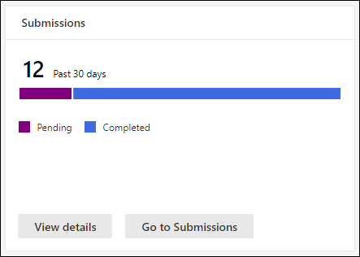

# Просмотр отчетов о безопасности электронной почты на Microsoft 365 Defender порталеView email security reports in the Microsoft 365 Defender portal

[!INCLUDE [Microsoft 365 Defender rebranding](../includes/microsoft-defender-for-office.md)]

**Область применения****Applies to**
- [Exchange Online ProtectionExchange Online Protection](exchange-online-protection-overview.md)
- [Microsoft Defender для Office 365 (план 1 и план 2)Microsoft Defender for Office 365 plan 1 and plan 2](defender-for-office-365.md)
- [Microsoft 365 DefenderMicrosoft 365 Defender](../defender/microsoft-365-defender.md)

Различные отчеты доступны на портале Microsoft 365 Defender, чтобы помочь вам увидеть, как функции безопасности электронной почты, такие как средства защиты от нежелательной почты, защиты от вредоносных программ и шифрования в Microsoft 365 защищают вашу <https://security.microsoft.com> организацию.A variety of reports are available in the Microsoft 365 Defender portal at <https://security.microsoft.com> to help you see how email security features, such as anti-spam, anti-malware, and encryption features in Microsoft 365 are protecting your organization. Если у вас [есть](#what-permissions-are-needed-to-view-these-reports)необходимые разрешения, вы можете просмотреть эти  отчеты на портале Microsoft 365 Defender, переехав в отчеты электронной почты & совместной & отчеты о \>  \> **совместной работе**.If you have the [necessary permissions](#what-permissions-are-needed-to-view-these-reports), you can view these reports in the Microsoft 365 Defender portal by going to **Reports** \> **Email & collaboration** \> **Email & collaboration reports**. Чтобы перейти непосредственно на **страницу отчетов & электронной почты,** откройте <https://security.microsoft.com/emailandcollabreport> .To go directly to the **Email & collaboration reports** page, open <https://security.microsoft.com/emailandcollabreport>.

> [!NOTE]
>
> Некоторые отчеты на странице **отчетов &** совместной работы требуют microsoft Defender для Office 365.Some of the reports on the **Email & collaboration reports** page require Microsoft Defender for Office 365. Сведения об этих отчетах см. в Office 365 view [Defender for Microsoft 365 Defender.](view-reports-for-mdo.md)For information about these reports, see [View Defender for Office 365 reports in the Microsoft 365 Defender portal](view-reports-for-mdo.md).
>
> Отчеты, связанные с потоком почты, теперь находятся Exchange центра администрирования (EAC).Reports that are related to mail flow are now in the Exchange admin center (EAC). Дополнительные сведения об этих отчетах см. в сообщении потока почты в [новом центре администрирования Exchange.](/exchange/monitoring/mail-flow-reports/mail-flow-reports)For more information about these reports, see [Mail flow reports in the new Exchange admin center](/exchange/monitoring/mail-flow-reports/mail-flow-reports).

## Отчет о скомпрометировании пользователейCompromised users report

> [!NOTE]
> Этот отчет доступен в Microsoft 365 организациях с Exchange Online почтовыми ящиками.This report is available in Microsoft 365 organizations with Exchange Online mailboxes. Он не доступен в автономных организациях Exchange Online Protection (EOP).It's not available in standalone Exchange Online Protection (EOP) organizations.

В **отчете о** скомпрометировании пользователей  показано  количество учетных записей пользователей, отмеченных как подозрительные или ограниченные в течение последних 7 дней.The **Compromised users** report shows shows the number of user accounts that were marked as **Suspicious** or **Restricted** within the last 7 days. Учетные записи в любом из этих штатов являются проблемными или даже скомпрометированными.Accounts in either of these states are problematic or even compromised. При частом использовании вы можете использовать отчет для задания пиков и даже тенденций в подозрительных или ограниченных учетных записях.With frequent use, you can use the report to spot spikes, and even trends, in suspicious or restricted accounts. Дополнительные сведения о скомпрометированных пользователях см. в [сообщении Responding to a compromised email account.](responding-to-a-compromised-email-account.md)For more information about compromised users, see [Responding to a compromised email account](responding-to-a-compromised-email-account.md).

В сводном представлении показаны данные за последние 90 дней, а в представлении подробно показаны данные за последние 30 дней.The aggregate view shows data for the last 90 days and the detail view shows data for the last 30 days.

Чтобы просмотреть отчет на портале Microsoft 365 Defender,  перейдите в отчеты электронной почты & совместной & отчеты о \>  \> **совместной работе.**To view the report in the Microsoft 365 Defender portal, go to **Reports** \> **Email & collaboration** \> **Email & collaboration reports**. На странице **Отчеты & электронной** почты найдите скомпрометированную пользователей и нажмите  **кнопку Просмотр сведений**.On the **Email & collaboration reports** page, find **Compromised users** and then click **View details**. Чтобы перейти непосредственно к отчету, откройте <https://security.microsoft.com/reports/CompromisedUsers> .To go directly to the report, open <https://security.microsoft.com/reports/CompromisedUsers>.

На странице **"Скомпрометированная** страница пользователей" можно отфильтровать диаграмму и таблицу сведений, щелкнув **фильтр** и выбрав одно или несколько следующих значений в вылете:On the **Compromised users** page, you can filter both the chart and the details table by clicking **Filter** and selecting one or more of the following values in the flyout that appears:

- **Дата (UTC)**: **Дата начала и** дата **окончания**.**Date (UTC)**: **Start date** and **End date**.
- **Действие:****Activity**:
  - **Подозрительный.** Учетная запись пользователя отправила подозрительные сообщения электронной почты и может быть ограничена отправкой электронной почты.**Suspicious**: The user account has sent suspicious email and is at risk of being restricted from sending email.
  - **Ограничение.** Учетная запись пользователя была ограничена отправкой электронной почты из-за весьма подозрительных шаблонов.**Restricted**: The user account has been restricted from sending email due to highly suspicious patterns.

Когда вы закончите настройку фильтров, нажмите **кнопку Применить,** **Отменить** или **очистить фильтры**.When you're finished configuring the filters, click **Apply**, **Cancel**, or **Clear filters**.

В таблице сведений под графиком можно увидеть следующие сведения:In the details table below the graph, you can see the following details:

- **Время создания****Creation time**
- **Идентификатор пользователя****User ID**
- **Действие****Action**

## Exchange отчет о правилах транспортаExchange transport rule report

Отчет **Exchange** транспорта показывает влияние правил потока почты (также известных как правила транспорта) на входящие и исходяющие сообщения в вашей организации.The **Exchange transport rule** report shows the effect of mail flow rules (also known as transport rules) on incoming and outgoing messages in your organization.

Чтобы просмотреть отчет на портале Microsoft 365 Defender,  перейдите в отчеты электронной почты & совместной & отчеты о \>  \> **совместной работе.**To view the report in the Microsoft 365 Defender portal, go to **Reports** \> **Email & collaboration** \> **Email & collaboration reports**. На странице **Отчеты & электронной** почты найдите правило Exchange транспорта и нажмите  **кнопку Просмотр сведений**.On the **Email & collaboration reports** page, find **Exchange transport rule** and then click **View details**. Чтобы перейти непосредственно к отчету, откройте <https://security.microsoft.com/reports/ETRRuleReport> .To go directly to the report, open <https://security.microsoft.com/reports/ETRRuleReport>.

На странице Exchange правила **транспорта** доступные диаграммы и данные описаны в следующих разделах.On the **Exchange transport rule report** page, the available charts and data are described in the following sections.

### Разбивка диаграмм по направлениюChart breakdown by Direction

Если выбрать **разбивку диаграммы по направлению,** доступны последующие диаграммы:If you select **Chart breakdown by Direction**, the follow charts are available:

- **Просмотр данных по Exchange** правил транспорта:  количество входящие и исходящие сообщения, которые были затронуты правилами потока почты. **View data by Exchange transport rules**: The number of **Inbound** and **Outbound** messages that were affected by mail flow rules.
- **Просмотр данных по правилам** транспорта Exchange DLP:  количество  входящие и исходящие сообщения, которые были затронуты правилами предотвращения потери данных (DLP) потока почты.**View data by DLP Exchange transport rules**: The number of **Inbound** and **Outbound** messages that were affected by data loss prevention (DLP) mail flow rules.

Ниже приведены следующие сведения в таблице сведений под графиком:The following information is shown in the details table below the graph:

- **Date****Date**
- **Политика DLP** (Просмотр данных только Exchange **правил транспорта)****DLP policy** (**View data by DLP Exchange transport rules** only)
- **Правило транспорта****Transport rule**
- **Тема****Subject**
- **Адрес отправителя****Sender address**
- **Адрес получателя****Recipient address**
- **Серьезность****Severity**
- **Направление****Direction**

Вы можете фильтровать диаграмму и таблицу сведений, щелкнув **Фильтр** и выбрав одно или несколько следующих значений в вылете:You can filter both the chart and the details table by clicking **Filter** and selecting one or more of the following values in the flyout that appears:

- **Дата (UTC)** **Дата начала и** дата **окончания****Date (UTC)** **Start date** and **End date**
- **Направление:** **исходящие и** **входящие****Direction**: **Outbound** and **Inbound**
- **Серьезность:** **высокая серьезность,** **средняя серьезность** и **низкая серьезность****Severity**: **High severity**, **Medium severity**, and **Low severity**

Когда вы закончите настройку фильтров, нажмите **кнопку Применить,** **Отменить** или **очистить фильтры**.When you're finished configuring the filters, click **Apply**, **Cancel**, or **Clear filters**.

### Разбивка диаграммы по строгостиChart breakdown by Severity

Если выбрать **разбивку диаграммы по строгости,** доступны последующие диаграммы:If you select **Chart breakdown by Severity**, the follow charts are available:

- **Просмотр данных по Exchange** правил транспорта: количество сообщений с высокой степенью серьезности, средней серьезности и **низкой** серьезности. **View data by Exchange transport rules**: The number of **High severity**, **Medium severity**, and **Low severity** messages. Вы установите уровень серьезности в качестве действия в правиле **(Аудит** этого правила с уровнем серьезности или _SetAuditSeverity)._You set the severity level as an action in the rule (**Audit this rule with severity level** or _SetAuditSeverity_). Дополнительные сведения см. в сообщении о действиях правила [потока почты в Exchange Online.](/Exchange/security-and-compliance/mail-flow-rules/mail-flow-rule-actions)For more information, see [Mail flow rule actions in Exchange Online](/Exchange/security-and-compliance/mail-flow-rules/mail-flow-rule-actions).

- Просмотр данных по правилам транспорта **Exchange DLP:** количество сообщений высокой  степени **тяжести,** средней степени тяжести и низкой степени тяжести, которые были затронуты правилами потока почты DLP. **View data by DLP Exchange transport rules**: The number of **High severity**, **Medium severity**, and **Low severity** messages that were affected by DLP mail flow rules.

Ниже приведены следующие сведения в таблице сведений под графиком:The following information is shown in the details table below the graph:

- **Date****Date**
- **Политика DLP** (Просмотр данных только Exchange **правил транспорта)****DLP policy** (**View data by DLP Exchange transport rules** only)
- **Правило транспорта****Transport rule**
- **Тема****Subject**
- **Адрес отправителя****Sender address**
- **Адрес получателя****Recipient address**
- **Серьезность****Severity**
- **Направление****Direction**

Вы можете фильтровать диаграмму и таблицу сведений, щелкнув **Фильтр** и выбрав одно или несколько следующих значений в вылете:You can filter both the chart and the details table by clicking **Filter** and selecting one or more of the following values in the flyout that appears:

- **Дата (UTC)** **Дата начала и** дата **окончания****Date (UTC)** **Start date** and **End date**
- **Направление:** **исходящие и** **входящие****Direction**: **Outbound** and **Inbound**
- **Серьезность:** **высокая серьезность,** **средняя серьезность** и **низкая серьезность****Severity**: **High severity**, **Medium severity**, and **Low severity**

Когда вы закончите настройку фильтров, нажмите **кнопку Применить,** **Отменить** или **очистить фильтры**.When you're finished configuring the filters, click **Apply**, **Cancel**, or **Clear filters**.

## Отчет о переадпортеForwarding report

> [!NOTE]
> Отчет **о переадпорте** теперь доступен в EAC.The **Forwarding report** is now available in the EAC. Дополнительные сведения см. в [отчете автопроизводить](/exchange/monitoring/mail-flow-reports/mfr-auto-forwarded-messages-report)сообщений в новом EAC.For more information, see [Auto forwarded messages report in the new EAC](/exchange/monitoring/mail-flow-reports/mfr-auto-forwarded-messages-report).

## Отчет о состоянии почтового потокаMailflow status report

Отчет **о** состоянии почтового потока — это интеллектуальный отчет, в нем показаны сведения о входящих и исходяющих сообщениях электронной почты, обнаружения нежелательной почты, вредоносных программ, электронной почты, идентифицированной как "хорошая", а также сведения о разрешенной или заблокированной электронной почте на краю.The **Mailflow status report** is a smart report that shows information about incoming and outgoing email, spam detections, malware, email identified as "good", and information about email allowed or blocked on the edge. Это единственный отчет, содержащий сведения о защите края, и показывает, сколько сообщений электронной почты блокируется перед тем, как быть разрешено в службу для оценки Exchange Online Protection (EOP).This is the only report that contains edge protection information, and shows just how much email is blocked before being allowed into the service for evaluation by Exchange Online Protection (EOP). Важно понимать, что если сообщение отправляется пяти получателям, мы считаем его пятью разными сообщениями, а не одним сообщением.It's important to understand that if a message is sent to five recipients we count it as five different messages and not one message.

Чтобы просмотреть отчет на портале Microsoft 365 Defender,  перейдите в отчеты электронной почты & совместной & отчеты о \>  \> **совместной работе.**To view the report in the Microsoft 365 Defender portal, go to **Reports** \> **Email & collaboration** \> **Email & collaboration reports**. На странице **отчеты &** электронной почты найдите сводку состояния **mailflow** и нажмите **кнопку Просмотр сведений**.On the **Email & collaboration reports** page, find **Mailflow status summary** and then click **View details**. Чтобы перейти непосредственно к отчету, откройте <https://security.microsoft.com/reports/mailflowStatusReport> .To go directly to the report, open <https://security.microsoft.com/reports/mailflowStatusReport>.

### Введите представление отчета о состоянии mailflowType view for the Mailflow status report

На странице **отчета о состоянии mailflow** вкладка **Тип** выбирается по умолчанию.On the **Mailflow status report** page, the **Type** tab is selected by default. По умолчанию это представление содержит диаграмму и таблицу сведений, настроенные с помощью следующих фильтров:By default, this view contains a chart and a details table that's configured with the following filters:

- **Дата (UTC)** Последние 7 дней.**Date (UTC)** The last 7 days.
- **Направление почты:****Mail direction**:
  - **Входящий****Inbound**
  - **Исходящие****Outbound**
  - **Intra-org:** это количество для сообщений в клиенте, то есть**Intra-org**: this count is for messages within a tenant i.e отправитель abc@domain.com получателям xyz@domain.com (засчитываются  отдельно от входящие и **исходящие)**sender abc@domain.com sends to recipient xyz@domain.com  (counted separately from **Inbound** and **Outbound**)
- **Тип:****Type**:
  - **Хорошая почта****Good mail**
  - **Вредоносная программа****Malware**
  - **Спам****Spam**
  - **Защита края****Edge protection**
  - **Сообщения правил****Rule messages**
  - **Фишинговое письмо****Phishing email**
- **Домен**: **Все****Domain**: **All**

Диаграмма организована **значениями Type.**The chart is organized by the **Type** values.

Эти фильтры можно изменить, нажав **фильтр.**You can change these filters by clicking **Filter**.

Ниже приведены следующие сведения в таблице сведений под графиком:The following information is shown in the details table below the graph:

- **Направление****Direction**
- **Тип****Type**
- **24 часа****24 hours**
- **за 3 дня;****3 days**
- **7 дней****7 days**
- **15 дней****15 days**
- **30 дней****30 days**

Если вы **нажмете Выберите категорию для получения** дополнительных сведений, вы можете выбрать из следующих значений:If you click **Choose a category for more details**, you can select from the following values:

- **Фишинговое письмо.** Этот выбор принимает вас к отчету о [состоянии защиты от угроз.](view-email-security-reports.md#threat-protection-status-report)**Phishing email**: This selection takes you to the [Threat protection status report](view-email-security-reports.md#threat-protection-status-report).
- **Вредоносные программы в электронной** почте: этот выбор принимает вас к отчету о [состоянии защиты от угрозы](view-email-security-reports.md#threat-protection-status-report).**Malware in email**: This selection takes you to the [Threat protection status report](view-email-security-reports.md#threat-protection-status-report).
- **Обнаружение нежелательной почты.** Этот выбор принимает вас к [отчету обнаружения нежелательной почты](view-email-security-reports.md#spam-detections-report).**Spam detections**: This selection takes you to the [Spam Detections report](view-email-security-reports.md#spam-detections-report).
- **Edge заблокирован нежелательной почты:** этот выбор принимает вас к [отчету обнаружения нежелательной почты](view-email-security-reports.md#spam-detections-report).**Edge blocked spam**: This selection takes you to the [Spam Detections report](view-email-security-reports.md#spam-detections-report).

#### Экспорт из представления TypeExport from Type view

Для представления подробной информации можно экспортировать данные только в течение одного дня.For the detail view, you can only export data for one day. Поэтому, если вы хотите экспортировать данные в течение 7 дней, необходимо сделать 7 различных действий по экспорту.So, if you want to export data for 7 days, you need to do 7 different export actions.

Каждый экспорт .csv ограничивается 150 000 строк.Each exported .csv file is limited to 150,000 rows. Если данные за этот день содержат более 150 000 строк, будет создано несколько .csv файлов.If the data for that day contains more than 150,000 rows, then multiple .csv files will be created.

### Представление направления для отчета о состоянии mailflowDirection view for the Mailflow status report

Если щелкнуть **вкладку Direction,** используются те же фильтры по умолчанию из представления **Type.**If you click the **Direction** tab, the same default filters from the **Type** view are used.

Диаграмма организована **значениями Direction.**The chart is organized by **Direction** values.

Эти фильтры можно изменить, нажав **фильтр.**You can change these filters by clicking **Filter**. Используются те же фильтры из представления **Type.**The same filters from the **Type** view are used.

В таблице сведений содержатся те же сведения из **представления Type.**The details table contains same information from the **Type** view.

Выбор **категории для получения дополнительных** сведений о выборах и поведении такой же, как представление **Type.**The **Choose a category for more details** available selections and behavior are the same as the **Type** view.

#### Экспорт из представления DirectionExport from Direction view

Для представления подробной информации можно экспортировать данные только в течение одного дня.For the detail view, you can only export data for one day. Поэтому, если вы хотите экспортировать данные в течение 7 дней, необходимо сделать 7 различных действий по экспорту.So, if you want to export data for 7 days, you need to do 7 different export actions.

Каждый экспорт .csv ограничивается 150 000 строк.Each exported .csv file is limited to 150,000 rows. Если данные за этот день содержат более 150 000 строк, будет создано несколько .csv файлов.If the data for that day contains more than 150,000 rows, then multiple .csv files will be created.

### Представление воронки для отчета о состоянии mailflowFunnel view for the Mailflow status report

В **представлении Воронка** показано, как функции защиты от угроз электронной почты Майкрософт фильтруют входящие и исходяющие сообщения электронной почты в вашей организации.The **Funnel** view shows you how Microsoft's email threat protection features filter incoming and outgoing email in your organization. В нем представлены сведения об общем числе сообщений электронной почты, а также о том, как настроенные функции защиты от угроз, включая защиту края, антивирусные программы, защиту от фишинга, защиту от нежелательной почты и защиту от спуфинга, влияют на этот счет.It provides details on the total email count, and how the configured threat protection features, including edge protection, anti-malware, anti-phishing, anti-spam, and anti-spoofing affect this count.

Если щелкнуть вкладку **Воронка,** это представление по умолчанию содержит диаграмму и таблицу сведений, настроенных с помощью следующих фильтров:If you click the **Funnel** tab, by default, this view contains a chart and a details table that's configured with the following filters:

- **Дата.** Последние 7 дней.**Date**: The last 7 days.

- **Направление:****Direction**:
  - **Входящий****Inbound**
  - **Исходящие****Outbound**
  - **Intra-org.** Это количество для сообщений, отправленных в клиенте; то есть отправитель отправляет abc@domain.com получателям xyz@domain.com (засчитываются отдельно от входящие и исходящие).**Intra-org**: This count is for messages sent within a tenant; i.e, sender abc@domain.com sends to recipient xyz@domain.com (counted separately from Inbound and Outbound).

Совокупное представление и представление таблицы сведений позволяет фильтровать в течение 90 дней.The aggregate view and details table view allow for 90 days of filtering.

Эти фильтры можно изменить, нажав **фильтр.**You can change these filters by clicking **Filter**. Используются те же фильтры из представления **Type.**The same filters from the **Type** view are used.

На этой диаграмме показана графа электронной почты, организованного по:This chart shows the email count organized by:

- **Всего сообщений электронной почты****Total email**
- **Электронная почта после защиты края****Email after edge protection**
- **Электронная почта после правила транспорта** (правило потока почты)**Email after transport rule** (mail flow rule)
- **Электронная почта после вредоносных программ, репутации файлов, блока типа файла****Email after anti-malware, file reputation, file type block**
- **Электронная почта после защиты от фишинга, репутации URL-адресов, обезличения бренда и подмены****Email after anti-phish, URL reputation, brand impersonation, anti-spoof**
- **Электронная почта после фильтрации массовой почты после нежелательной почты****Email after anti-spam, bulk mail filtering**
- **Электронная почта после обезличения пользователя и домена**\***Email after user and domain impersonation**\*
- **Электронная почта после детонации файла и URL-адреса**\***Email after file and URL detonation**\*
- **Электронная почта, обнаруженная как доброкачественная после защиты после доставки (защита времени щелчка URL-адреса)****Email detected as benign after post-delivery protection (URL click time protection)**

\*Защитник только для Office 365\* Defender for Office 365 only

Чтобы просмотреть сообщение электронной почты, фильтруемой EOP или Defender для Office 365, щелкните значение в легенде диаграммы.To view the email filtered by EOP or Defender for Office 365 separately, click on the value in the chart legend.

В таблице сведений содержатся следующие сведения, показанные в порядке убывающих дат:The details table contains the following information, shown in descending date order:

- **Date****Date**
- **Всего сообщений электронной почты****Total email**
- **Защита края****Edge protection**
- **Anti-malware, file reputation, file type block:****Anti-malware, file reputation, file type block**:
  - **Репутация файла:** сообщения фильтруются из-за идентификации присоединенного файла другими клиентами Майкрософт.**File reputation**: Messages filtered due to identification of an attached file by other Microsoft customers.
  - **Блок типа файла.** Сообщения фильтруются из-за типа вредоносного файла, идентифицированного в сообщении.**File type block**: Messages filtered due to the type of malicious file identified in the message.
- **Защита от фишинга, репутация URL-адреса, вымысление бренда, защита от подмены:****Anti-phish, URL reputation, Brand impersonation, anti-spoof**:
  - **Репутация URL-адреса.** Сообщения фильтруются из-за идентификации URL-адреса другими клиентами Майкрософт.**URL reputation**: Messages filtered due to the identification of the URL by other Microsoft customers.
  - **Вымысление** бренда: сообщения фильтруются из-за сообщения, исходящем от известных отправителей бренда, вымыкающих себя.**Brand impersonation**: Messages filtered due to the message coming from well-known brand impersonating senders.
  - **Anti-spoof**: Сообщения фильтруются из-за сообщения, пытающихся подменить домен, к который принадлежит получатель, или домена, который не принадлежит отправителю сообщения.**Anti-spoof**: Messages filtered due to the message attempting to spoof a domain that the recipient belongs to, or a domain that the message sender doesn't own.
- **Фильтрация массовой почты** для борьбы со спамом:**Anti-spam, bulk mail filtering**:
  - **Массовая фильтрация** почты: сообщения фильтруются на основе порогового значения уровня жалобы (BCL) в политике борьбы со спамом.**Bulk mail filtering**: Messages filtered based on the bulk complain level (BCL) threshold in an anti-spam policy.
- **Вымысление** пользователя и домена (Defender для Office 365) :**User and domain impersonation (Defender for Office 365)**:
  - Вымысление пользователя. Сообщения фильтруются из-за попытки выдать себя за пользователя (отправитель сообщений), определенного в параметрах защиты от фишинга.**User impersonation**: Messages filtered due to an attempt to impersonate a user (message sender) that's defined in the impersonation protection settings of an anti-phishing policy.
  - **Обезличение** домена. Сообщения фильтруются из-за попытки выдать себя за домен, определенный в параметрах защиты от фишинга.**Domain impersonation**: Messages filtered due to an attempt to impersonate a domain that's defined in the impersonation protection settings of an anti-phishing policy.
- **Детонация файлов и URL-адресов (Defender для Office 365)**:**File and URL detonation (Defender for Office 365)**:
  - **Детонация файлов:** сообщения, фильтруемые политикой Сейф вложений.**File detonation**: Messages filtered by a Safe Attachments policy.
  - **Детонация URL-адреса.** Сообщение фильтруется политикой Сейф ссылки.**URL detonation**: Message filtered by a Safe Links policy.
- Защита после доставки и **ZAP (ATP) или ZAP (EOP)**: автоматическая очистка нулевого часа (ZAP) для вредоносных программ, нежелательной почты и фишинга.**Post-delivery protection and ZAP (ATP), or ZAP (EOP)**: Zero-hour auto purge (ZAP) for malware, spam, and phishing.

Если вы выберите строку в таблице сведений, в вылете будет показана дальнейшая разбивка учетных записей электронной почты.If you select a row in the details table, a further breakdown of the email counts are shown in the flyout.

#### Экспорт из представления ВоронкаExport from Funnel view

После нажатия **"Экспорт** в **параметрах"** можно выбрать одно из следующих значений:After you click **Export** under **Options**, you can select one of the following values:

- **Сводка (с данными за последние 90 дней не более)****Summary (with data for last 90 days at most)**
- **Сведения (с данными за последние 30 дней не более)****Details (with data for last 30 days at most)**

В **соответствии с датой** выберите диапазон, а затем нажмите **кнопку Применить**.Under **Date**, choose a range, and then click **Apply**. Данные для текущих фильтров будут экспортироваться в .csv файл.Data for the current filters will be exported to a .csv file.

Каждый экспорт .csv ограничивается 150 000 строк.Each exported .csv file is limited to 150,000 rows. Если данные содержат более 150 000 строк, будет создано несколько .csv файлов.If the data contains more than 150,000 rows, then multiple .csv files will be created.

### Техническое представление отчета о состоянии mailflowTech view for the Mailflow status report

Представление **Tech аналогично** представлению **Воронка,** предоставляя более подробные сведения о настроенных средствах защиты от угроз.The **Tech view** is similar to the **Funnel** view, providing more granular details for the configured threat protections features. На диаграмме можно увидеть, как классифицируются сообщения на различных этапах защиты от угроз.From the chart, you can see how messages are categorized at the different stages of threat protection.

Если вы нажмете вкладку **"Просмотр** технологий", по умолчанию это представление содержит диаграмму и таблицу сведений, настроенные с помощью следующих фильтров:If you click the **Tech view** tab, by default, this view contains a chart and a details table that's configured with the following filters:

- **Дата.** Последние 7 дней.**Date**: The last 7 days.

- **Направление:****Direction**:
  - **Входящий****Inbound**
  - **Исходящие****Outbound**
  - **Intra-org:** это количество для сообщений в клиенте, то есть**Intra-org**: this count is for messages within a tenant i.e отправитель abc@domain.com отправляет получателю xyz@domain.com (рассчитывается отдельно от входящие и исходящие)sender abc@domain.com sends to recipient xyz@domain.com (counted separately from Inbound and Outbound)

Совокупное представление и представление таблицы сведений позволяет фильтровать в течение 90 дней.The aggregate view and details table view allow for 90 days of filtering.

Эти фильтры можно изменить, нажав **фильтр.**You can change these filters by clicking **Filter**. Используются те же фильтры из представления **Type.**The same filters from the **Type** view are used.

На этой диаграмме показаны сообщения, организованные в следующие категории:This chart shows messages organized into the following categories:

- **Всего сообщений электронной почты****Total email**
- **Edge allow** and **Edge filtered****Edge allow** and **Edge filtered**
- **Правила транспорта позволяют и** **правила транспорта фильтруются** (правила потока почты)**Transport rule allow** and **Transport rule filtered** (mail flow rules)
- **Не вредоносные** программы, **Сейф обнаружения** вложений \* и обнаружения **вредоносных программ****Not malware**, **Safe Attachments detection**\*, and **Anti-malware engine detection**
- **Не фишинг,** **отказ DMARC,** **обнаружение** обезличения, \* обнаружение **Spoof** и **обнаружение фишинга****Not phish**, **DMARC failure**, **Impersonation detection**\*, **Spoof detection**, and **Phish detection**
- **Отсутствие обнаружения с детонацией URL-адреса** и **обнаружением детонации URL-адреса**\***No detection with URL detonation** and **URL detonation detection**\*
- **Не нежелательной почты** и  **нежелательной почты****Not spam** and  **Spam**
- **Обнаружение ссылок,** **Сейф** \* и **ZAP****Non-malicious email**, **Safe Links detection**\*, and **ZAP**

\*Defender для Office 365\* Defender for Office 365

Когда вы наведите курсор над категорией на диаграмме, вы увидите количество сообщений в этой категории.When you hover over a category in the chart, you can see the number of messages in that category.

В таблице сведений содержатся следующие сведения, показанные в порядке убывающих дат:The details table contains the following information, shown in descending date order:

- **Дата (UTC)****Date (UTC)**
- **Всего сообщений электронной почты****Total email**
- **Отфильтрованный край****Edge filtered**
- **Сообщения правил:** сообщения фильтруются из-за правил потока почты (также известных как правила транспорта).**Rule messages**: Messages filtered due to  mail flow rules (also known as transport rules).
- **Антивирусный двигатель**, **Сейф вложения** \* :**Anti-malware engine**, **Safe Attachments**\*:
- **DMARC, impersonation** \* , **spoof**, **phish filtered**:**DMARC, impersonation**\*, **spoof**, **phish filtered**:
  - **DMARC:** Сообщения фильтруются из-за отказа сообщения проверки подлинности DMARC.**DMARC**: Messages filtered due to the message failing its DMARC authentication check.
- **Обнаружение детонации URL-адреса**\***URL detonation detection**\*
- **Фильтрация от нежелательной почты****Anti-spam filtered**
- **ZaP удален****ZAP removed**
- **Обнаружение по Сейф ссылки**\***Detection by Safe Links**\*

\*Defender для Office 365\* Defender for Office 365

Если вы выберите строку в таблице сведений, в вылете будет показана дальнейшая разбивка учетных записей электронной почты.If you select a row in the details table, a further breakdown of the email counts are shown in the flyout.

#### Экспорт с точки зрения технологийExport from Tech view

При **нажатии на экспорт** **можно** выбрать одно из следующих значений:On clicking **Export**, under **Options** you can select one of the following values:

- **Сводка (с данными за последние 90 дней не более)****Summary (with data for last 90 days at most)**
- **Сведения (с данными за последние 30 дней не более)****Details (with data for last 30 days at most)**

В **соответствии с датой** выберите диапазон, а затем нажмите **кнопку Применить**.Under **Date**, choose a range, and then click **Apply**. Данные для текущих фильтров будут экспортироваться в .csv файл.Data for the current filters will be exported to a .csv file.

Каждый экспорт .csv ограничивается 150 000 строк.Each exported .csv file is limited to 150,000 rows. Если данные содержат более 150 000 строк, будет создано несколько .csv файлов.If the data contains more than 150,000 rows, then multiple .csv files will be created.

## Отчет об обнаружении вредоносных программMalware detections report

В **отчете об** обнаружении вредоносных программ показаны сведения об обнаружении вредоносных программ в входящих и исходяющих сообщениях электронной почты (вредоносные программы, обнаруженные Exchange Online Protection или EOP).The **Malware detections report** report shows information about malware detections in incoming and outgoing email messages (malware detected by Exchange Online Protection or EOP). Дополнительные сведения о защите от вредоносных программ в EOP см. в программе Защита от вредоносных [программ в EOP.](anti-malware-protection.md)For more information about malware protection in EOP, see [Anti-malware protection in EOP](anti-malware-protection.md).

Совокупный фильтр представления позволяет в течение 90 дней, в то время как фильтр таблицы сведений разрешает только 10 дней.The aggregate view filter allows for 90 days, while the details table filter only allows for 10 days.

Чтобы просмотреть отчет на портале Microsoft 365 Defender,  перейдите в отчеты электронной почты & совместной & отчеты о \>  \> **совместной работе.**To view the report in the Microsoft 365 Defender portal, go to **Reports** \> **Email & collaboration** \> **Email & collaboration reports**. На странице **Отчеты &** электронной почты найдите вредоносные программы, обнаруженные в электронной почте, а затем нажмите  **кнопку Просмотр сведений**.On the **Email & collaboration reports** page, find **Malware detected in email** and then click **View details**. Чтобы перейти непосредственно к отчету, откройте <https://security.microsoft.com/reports/MalwareDetections> .To go directly to the report, open <https://security.microsoft.com/reports/MalwareDetections>.

На странице **отчета об** обнаружении вредоносных программ можно фильтровать диаграмму и таблицу сведений, щелкнув **фильтр** и выбрав одно из следующих значений:On the **Malware detections report** page, you can filter both the chart and the details table by clicking **Filter** and selecting one of the following values:

- **Дата (UTC)** **Дата начала и** дата **окончания****Date (UTC)** **Start date** and **End date**
- **Направление:** **входящие и** **исходящие****Direction**: **Inbound** and **Outbound**

В таблице сведений под графиком можно увидеть следующие сведения:In the details table below the graph, you can see the following details:

- **Date****Date**
- **Адрес отправителя****Sender address**
- **Адрес получателя****Recipient address**
- **ID сообщения.** Доступно в **поле заглавной области Message-ID** в загонах сообщений и должно быть уникальным.**Message ID**: Available in the **Message-ID** header field in the message header and should be unique. Например, значение `<08f1e0f6806a47b4ac103961109ae6ef@server.domain>` (обратите внимание на угловые скобки).An example value is `<08f1e0f6806a47b4ac103961109ae6ef@server.domain>` (note the angle brackets).
- **Тема****Subject**
- **Filename****Filename**
- **Имя вредоносных программ****Malware name**

## Отчет о задержке почтыMail latency report

Отчет **о задержке** почты в Defender for Office 365 содержит сведения о задержке доставки почты и детонации в организации.The **Mail latency report** in Defender for Office 365 contains information on the mail delivery and detonation latency experienced within your organization. Дополнительные сведения см. в [отчете о задержке почты.](view-reports-for-mdo.md#mail-latency-report)For more information, see [Mail latency report](view-reports-for-mdo.md#mail-latency-report).

## Отчет об обнаружении нежелательной почтыSpam detections report

> [!NOTE]
> Отчет **об обнаружении нежелательной почты** в конечном итоге пройдет.The **Spam detections report** will eventually go away. Такая же информация доступна в отчете о состоянии [защиты от угроз.](#threat-protection-status-report)The same information is available in the [Threat protection status report](#threat-protection-status-report).

## Отчет об обнаружении подменыSpoof detections report

> [!NOTE]
> Улучшенный отчет об обнаружении Spoof, описанный в этой статье, находится в предварительной версии, подлежит изменениям и доступен не во всех организациях.The improved Spoof detections report as described in this article is in Preview, is subject to change, and is not available in all organizations. Более старая версия отчета показывает только хорошую почту **и** **уловлено как spam.**The older version of the report shows only **Good mail** and **Caught as spam**.

В **отчете о обнаружениях Spoof** показаны сведения о сообщениях, которые были заблокированы или разрешены из-за подмены.The **Spoof detections** report shows information about messages that were blocked or allowed due to spoofing. Дополнительные сведения о подмене см. в этой информации в [EOP.](anti-spoofing-protection.md)For more information about spoofing, see [Anti-spoofing protection in EOP](anti-spoofing-protection.md).

Совокупное представление отчета позволяет в течение 45 дней фильтрации, в то время как представление детализации позволяет фильтровать только десять \* дней.The aggregate view of the report allows for 45 days of filtering\*, while the detail view only allows for ten days of filtering.

\* В конце концов, вы сможете использовать до 90 дней фильтрации.\* Eventually, you'll be able to use up to 90 days of filtering.

Чтобы просмотреть отчет на портале Microsoft 365 Defender,  перейдите в отчеты электронной почты & совместной & отчеты о \>  \> **совместной работе.**To view the report in the Microsoft 365 Defender portal, go to **Reports** \> **Email & collaboration** \> **Email & collaboration reports**. На странице **отчеты &** сообщений о совместной работе найдите обнаружение **Spoof** и нажмите **кнопку Просмотр сведений**.On the **Email & collaboration reports** page, find **Spoof detections** and then click **View details**. Чтобы перейти непосредственно к отчету, откройте <https://security.microsoft.com/reports/SpoofMailReportV2> .To go directly to the report, open <https://security.microsoft.com/reports/SpoofMailReportV2>.

На диаграмме показаны следующие сведения:The chart shows the following information:

- **Pass****Pass**
- **Fail****Fail**
- **SoftPass****SoftPass**
- **Нет****None**
- **Other****Other**

При наведении в течение дня (точки данных) на диаграмме можно увидеть, сколько поддельных сообщений было обнаружено и почему.When you hover over a day (data point) in the chart, you can see how many spoofed messages were detected and why.

На странице **Spoof mail report** можно отфильтровать диаграмму и таблицу сведений, щелкнув **фильтр** и выбрав одно или несколько следующих значений:On the **Spoof mail report** page, you can filter both the chart and the details table by clicking **Filter** and selecting one or more of the following values:

- **Дата (UTC)** **Дата начала и** дата **окончания****Date (UTC)** **Start date** and **End date**
- **Результат:****Result**:
  - **Pass****Pass**
  - **Fail****Fail**
  - **SoftPass****SoftPass**
  - **Нет****None**
  - **Other****Other**
- **Тип Spoof:** **внутренний и** **внешний****Spoof type**: **Internal** and **External**

В таблице сведений под графиком можно увидеть следующие сведения:In the details table below the graph, you can see the following details:

- **Date****Date**
- **Подмена пользователя****Spoofed user**
- **Отправка инфраструктуры****Sending infrastructure**
- **Тип Spoof****Spoof type**
- **Результат****Result**
- **Код результатов****Result code**
- **SPF****SPF**
- **DKIM****DKIM**
- **DMARC****DMARC**
- **Количество сообщений****Message count**

Дополнительные сведения о сводных кодах результатов проверки подлинности см. в материале [Anti-spam message headers in Microsoft 365.](anti-spam-message-headers.md)For more information about composite authentication result codes, see [Anti-spam message headers in Microsoft 365](anti-spam-message-headers.md).

## Отчет о представленияхSubmissions report

В **отчете Submissions** показаны сведения о том, что администраторы отчитались в Корпорацию Майкрософт для анализа.The **Submissions** report shows information about items that admins have reported to Microsoft for analysis. Дополнительные сведения см. в материале Использование отправки администратора для отправки в Корпорацию Майкрософт подозрительных [спама, фишинга, URL-адресов и файлов.](admin-submission.md)For more information, see [Use Admin Submission to submit suspected spam, phish, URLs, and files to Microsoft](admin-submission.md).

Чтобы просмотреть отчет на портале Microsoft 365 Defender,  перейдите в отчеты электронной почты & совместной & отчеты о \>  \> **совместной работе.**To view the report in the Microsoft 365 Defender portal, go to **Reports** \> **Email & collaboration** \> **Email & collaboration reports**. На странице **Отчеты & электронной** почты найдите **материалы** и нажмите кнопку **Просмотр сведений**.On the **Email & collaboration reports** page, find **Submissions** and then click **View details**. Чтобы перейти непосредственно к отчету, откройте <https://security.microsoft.com/adminSubmissionReport> .To go directly to the report, open <https://security.microsoft.com/adminSubmissionReport>. Чтобы перейти [к представлениям администратора на портале Microsoft 365 Defender,](admin-submission.md)нажмите **кнопку Перейти к отправкам.**To go to [admin submissions in the Microsoft 365 Defender portal](admin-submission.md), click **Go to Submissions**.

На диаграмме показаны следующие сведения:The chart shows the following information:

- **Pending****Pending**
- **Выполнено****Completed**

На странице **Представления** можно фильтровать диаграмму и таблицу сведений, щелкнув **фильтр** и выбрав одно или несколько следующих значений:On the **Submissions** page, you can filter both the chart and the details table by clicking **Filter** and selecting one or more of the following values:

- **Дата, о чем сообщалось:** **время начала и** **окончания****Date reported**: **Start time** and **End time**
- **Тип отправки:****Submission type**:
  - **Электронная почта****Email**
  - **URL-адрес****URL**
  - **Файл****File**
- **ID отправки****Submission ID**
- **ID сетевого сообщения****Network Message ID**
- **Sender****Sender**
- **Название****Name**
- **Отправлено****Submitted by**
- **Причина отправки:****Reason for submitting**:
  - **Не нежелательно****Not junk**
  - **Фишинг****Phish**
  - **Вредоносная программа****Malware**
  - **Спам****Spam**
- **Состояние Rescan:****Rescan status**:
  - **Pending****Pending**
  - **Выполнено****Completed**

В таблице сведений ниже графика показаны те же сведения, что и  в столбцах **Group** или **Customize,** что и на вкладке Отправка для анализа в email **&** \> **отправки совместной работы.**The details table below the graph shows the same information and has the same **Group** or **Customize columns** options as on the **Submitted for analysis** tab at **Email & collaboration** \> **Submissions**. Дополнительные сведения см. в [материале Просмотр представлений администратора в Корпорации Майкрософт.](admin-submission.md#view-admin-submissions-to-microsoft)For more information, see [View admin submissions to Microsoft](admin-submission.md#view-admin-submissions-to-microsoft).

## отчет о состоянии защиты от угроз;Threat protection status report

Отчет **о состоянии защиты от** угроз доступен в EOP и Defender для Office 365; однако отчеты содержат различные данные.The **Threat protection status** report is available in both EOP and Defender for Office 365; however, the reports contain different data. Например, клиенты EOP могут просматривать сведения о вредоносных программах, обнаруженных в электронной почте, но не сведения о вредоносных файлах, обнаруженных Сейф вложениями для [SharePoint, OneDrive](mdo-for-spo-odb-and-teams.md)и Microsoft Teams .For example, EOP customers can view information about malware detected in email, but not information about malicious files detected by [Safe Attachments for SharePoint, OneDrive, and Microsoft Teams](mdo-for-spo-odb-and-teams.md).

В отчете приводится количество сообщений электронной почты со вредоносным контентом, например файлов или [веб-адресов](set-up-anti-phishing-policies.md#exclusive-settings-in-anti-phishing-policies-in-microsoft-defender-for-office-365)(URL-адресов), которые были заблокированы с помощью двигателя защиты от вредоносных программ, автоматической очистки нулевого часа [(ZAP)](zero-hour-auto-purge.md)и функций Defender для Office 365, таких как [Сейф Links,](safe-links.md) [Сейф Attachments](safe-attachments.md), и функции защиты от фишинга в политиках защиты от фишинга .The report provides the count of email messages with malicious content, such as files or website addresses (URLs) that were blocked by the anti-malware engine, [zero-hour auto purge (ZAP)](zero-hour-auto-purge.md), and Defender for Office 365 features like [Safe Links](safe-links.md), [Safe Attachments](safe-attachments.md), and [impersonation protection features in anti-phishing policies](set-up-anti-phishing-policies.md#exclusive-settings-in-anti-phishing-policies-in-microsoft-defender-for-office-365). Эти сведения можно использовать для определения тенденций или определения необходимости корректировки политик организации.You can use this information to identify trends or determine whether organization policies need adjustment.

**Примечание.** Важно понимать, что если сообщение отправляется пяти получателям, мы считаем его пятью разными сообщениями, а не одним сообщением.**Note**: It's important to understand that if a message is sent to five recipients we count it as five different messages and not one message.

Чтобы просмотреть отчет на портале Microsoft 365 Defender,  перейдите в отчеты электронной почты & совместной & отчеты о \>  \> **совместной работе.**To view the report in the Microsoft 365 Defender portal, go to **Reports** \> **Email & collaboration** \> **Email & collaboration reports**. На странице **отчеты & электронной** почты найдите состояние **защиты** от угроз и нажмите **кнопку Просмотр сведений**.On the **Email & collaboration reports** page, find **Threat protection status** and then click **View details**. Чтобы перейти непосредственно к отчету, откройте один из следующих URL-адресов:To go directly to the report, open one of the following URLs:

- Defender для Office 365:<https://security.microsoft.com/reports/TPSAggregateReportATP>Defender for Office 365: <https://security.microsoft.com/reports/TPSAggregateReportATP>
- EOP: <https://security.microsoft.com/reports/TPSAggregateReport>EOP: <https://security.microsoft.com/reports/TPSAggregateReport>

По умолчанию на диаграмме показаны данные за последние 7 дней.By default, the chart shows data for the past 7 days. При **нажатии фильтра** на странице отчета о состоянии защиты от угроз можно выбрать диапазон дат в 90 дней (пробная подписка может быть ограничена 30 днями). If you click **Filter** on the **Threat protection status report** page, you can select a 90 day date range (trial subscriptions might be limited to 30 days). Таблица сведений позволяет фильтровать в течение 30 дней.The details table allows filtering for 30 days.

Доступные представления описаны в следующих разделах.The available views are described in the following sections.

### Просмотр данных по обзоруView data by Overview

В **представлении View data by Overview** на диаграмме показаны следующие сведения об обнаружении:In the **View data by Overview** view, the following detection information is shown in the chart:

- **Вредоносные программы электронной почты****Email malware**
- **Фишинг электронной почты****Email phish**
- **Вредоносные программы контента****Content malware**

Таблица сведений недоступна ниже диаграммы.No details table is available below the chart.

При **нажатии фильтра** доступны следующие фильтры:If you click **Filter**, the following filters are available:

- **Дата (UTC)** **Дата начала и** дата **окончания****Date (UTC)** **Start date** and **End date**
- **Обнаружение:** **вредоносные программы** по **электронной почте, фишинг электронной почты** или **вредоносные программы по контенту****Detection**: **Email malware**, **Email phish**, or **Content malware**
- **Защищено:** **MDO** (Defender for Office 365) или **EOP****Protected by**: **MDO** (Defender for Office 365) or **EOP**
- **Тег.** Фильтр результатов пользователями или группами с указанным тегом пользователя (включая учетные записи приоритета).**Tag**: Filter the results by users or groups that have had the specified user tag applied (including priority accounts). Дополнительные сведения о тегах пользователей см. в [тегах пользователей.](user-tags.md)For more information about user tags, see [User tags](user-tags.md).
- **Направление****Direction**
- **Домен****Domain**
- **Тип политики****Policy type**

Когда вы закончите настройку фильтров, нажмите **кнопку Применить,** **Отменить** или **очистить фильтры**.When you're finished configuring the filters, click **Apply**, **Cancel**, or **Clear filters**.

### Просмотр данных с помощью \> фишинга электронной почты и разбивки диаграмм с помощью технологии обнаруженияView data by Email \> Phish and Chart breakdown by Detection Technology

В **представлении данных по фишингу электронной \> почты** и разбивке диаграмм по представлению **технологии** обнаружения на диаграмме показаны следующие сведения:In the **View data by Email \> Phish** and **Chart breakdown by Detection Technology** view, the following information is shown in the chart:

- **Вредоносная репутация** URL-адреса: вредоносная репутация URL-адреса, созданная в Defender для Office 365 в других Microsoft 365 \* клиентах.**URL malicious reputation**\*: Malicious URL reputation generated from Defender for Office 365 detonations in other Microsoft 365 customers.
- **Расширенный фильтр:** фишинговые сигналы на основе машинного обучения.**Advanced filter**: Phishing signals based on machine learning.
- **Общий фильтр:** фишинговые сигналы, основанные на правилах аналитика.**General filter**: Phishing signals based on analyst rules.
- **Spoof intra-org.** Отправитель пытается подменить домен получателя.**Spoof intra-org**: Sender is trying to spoof the recipient domain.
- **Внешний домен Spoof.** Отправитель пытается подменить другой домен.**Spoof external domain**: Sender is trying to spoof some other domain.
- **Spoof DMARC:** Сбой проверки подлинности DMARC в сообщениях.**Spoof DMARC**: DMARC authentication failure on messages.
- **Бренд Impersonation**: Impersonation известных брендов на основе отправителей.**Impersonation brand**: Impersonation of well-known brands based on senders.
- **Обнаружение с помощью смешанного анализа****Mixed analysis detection**
- **Репутация файла****File reputation**
- **Сопоставление отпечатков****Fingerprint matching**
- **Репутация детонации URL-адреса**\***URL detonation reputation**\*
- **Детонация URL-адреса**\***URL detonation**\*
- **Пользователь impersonation**\***Impersonation user**\*
- **Домен impersonation** \* : Impersonation доменов, которые клиент владеет или определяет.**Impersonation domain**\*: Impersonation of domains that the customer owns or defines.
- **Вымысление** сведении почтовых ящиков: обезличение пользователей, определенных администратором или \* выучатся с помощью разведки почтовых ящиков.**Mailbox intelligence impersonation**\*: Impersonation of users defined by admin or learned through mailbox intelligence.
- **Детонация файлов**\***File detonation**\*
- **Кампания**\***Campaign**\*

В таблице сведений ниже диаграммы доступны следующие сведения:In the details table below the chart, the following information is available:

- **Date****Date**
- **Тема****Subject**
- **Sender****Sender**
- **Получатели****Recipients**
- **Обнаружено****Detected by**
- **Состояние доставки****Delivery Status**
- **Источник компромисса****Source of Compromise**
- **Tags****Tags**

При **нажатии фильтра** доступны следующие фильтры:If you click **Filter**, the following filters are available:

- **Дата (UTC)** **Дата начала и** дата **окончания****Date (UTC)** **Start date** and **End date**
- **Обнаружение****Detection**
- **Защищено:** **MDO** (Defender for Office 365) или **EOP****Protected by**: **MDO** (Defender for Office 365) or **EOP**
- **Направление****Direction**
- **Тег.** Фильтр результатов пользователями или группами с указанным тегом пользователя (включая учетные записи приоритета).**Tag**: Filter the results by users or groups that have had the specified user tag applied (including priority accounts). Дополнительные сведения о тегах пользователей см. в [тегах пользователей.](user-tags.md)For more information about user tags, see [User tags](user-tags.md).
- **Домен****Domain**
- **Тип политики****Policy type**
- **Имя политики** (только таблица сведений)**Policy name** (details table only)
- **Получатели****Recipients**

Когда вы закончите настройку фильтров, нажмите **кнопку Применить,** **Отменить** или **очистить фильтры**.When you're finished configuring the filters, click **Apply**, **Cancel**, or **Clear filters**.

### Просмотр данных по вредоносным программам электронной почты \> и разбивке диаграмм с помощью технологии обнаруженияView data by Email \> Malware and Chart breakdown by Detection Technology

В **представлении данных \> по вредоносным программам электронной** почты и разбивке диаграмм по представлению **технологии** обнаружения на диаграмме показаны следующие сведения:In the **View data by Email \> Malware** and **Chart breakdown by Detection Technology** view, the following information is shown in the chart:

- **Детонация файлов:** \* обнаружение Сейф вложения.**File detonation**\*: Detection by Safe Attachments.
- **Репутация детонации файлов:** \* вся репутация вредоносных файлов, созданных Defender для Office 365 детонации.**File detonation reputation**\*: All malicious file reputation generated by Defender for Office 365 detonations.
- **Репутация файла****File reputation**
- **Движок для борьбы с вредоносными** \* программами. Обнаружение с антивирусных двигателей.**Anti-malware engine**\*: Detection from anti-malware engines.
- Блок типа файлов политики по борьбе с вредоносными программами. Это сообщения электронной почты, отфильтрованные **из-за** типа вредоносного файла, выявленного в сообщении.**Anti-malware policy file type block**: These are email messages filtered out due to the type of malicious file identified in the message.
- **Репутация вредоносного URL-адреса****URL malicious reputation**
- **Отключение URL-адресов****URL detonation**
- **Репутация отключения URL-адресов****URL detonation reputation**
- **Кампания****Campaign**

В таблице сведений ниже диаграммы доступны следующие сведения:In the details table below the chart, the following information is available:

- **Date****Date**
- **Тема****Subject**
- **Sender****Sender**
- **Получатели****Recipients**
- **Обнаружено****Detected by**
- **Состояние доставки****Delivery Status**
- **Источник компромисса****Source of Compromise**
- **Tags****Tags**

При **нажатии фильтра** доступны следующие фильтры:If you click **Filter**, the following filters are available:

- **Дата (UTC)** **Дата начала и** дата **окончания****Date (UTC)** **Start date** and **End date**
- **Обнаружение****Detection**
- **Защищено:** **MDO** (Defender for Office 365) или **EOP****Protected by**: **MDO** (Defender for Office 365) or **EOP**
- **Направление****Direction**
- **Тег.** Фильтр результатов пользователями или группами с указанным тегом пользователя (включая учетные записи приоритета).**Tag**: Filter the results by users or groups that have had the specified user tag applied (including priority accounts). Дополнительные сведения о тегах пользователей см. в [тегах пользователей.](user-tags.md)For more information about user tags, see [User tags](user-tags.md).
- **Домен****Domain**
- **Тип политики****Policy type**
- **Имя политики** (только таблица сведений)**Policy name** (details table only)
- **Получатели****Recipients**

Когда вы закончите настройку фильтров, нажмите **кнопку Применить,** **Отменить** или **очистить фильтры**.When you're finished configuring the filters, click **Apply**, **Cancel**, or **Clear filters**.

### Разбивка диаграмм по типу политики и просмотру данных по фишингу электронной почты или \> просмотру данных по вредоносным программам электронной \> почтыChart breakdown by Policy type and View data by Email \> Phish or View data by Email \> Malware

В **разбивке диаграмм** по типу политики и просмотру данных по фишингу электронной почты или просмотру данных по представлениям вредоносных программ по электронной почте в диаграммах показаны следующие сведения: **\>** **\>**In the **Chart breakdown by Policy type** and **View data by Email \> Phish** or **View data by Email \> Malware** views, the following information is shown in the charts:

- **Anti-malware****Anti-malware**
- **Сейф Вложения**\***Safe Attachments**\*
- **Anti-phish****Anti-phish**
- **Противодействие нежелательной почте****Anti-spam**
- **Правило потока почты** (также известное как правило транспорта)**Mail flow rule** (also known as a transport rule)
- **Другие****Others**

В таблице сведений ниже диаграммы доступны следующие сведения:In the details table below the chart, the following information is available:

- **Date****Date**
- **Тема****Subject**
- **Sender****Sender**
- **Получатели****Recipients**
- **Обнаружено****Detected by**
- **Состояние доставки****Delivery Status**
- **Источник компромисса****Source of Compromise**
- **Tags****Tags**

При **нажатии фильтра** доступны следующие фильтры:If you click **Filter**, the following filters are available:

- **Дата (UTC)** **Дата начала и** дата **окончания****Date (UTC)** **Start date** and **End date**
- **Обнаружение****Detection**
- **Защищено:** **MDO** (Defender for Office 365) или **EOP****Protected by**: **MDO** (Defender for Office 365) or **EOP**
- **Направление****Direction**
- **Тег.** Фильтр результатов пользователями или группами с указанным тегом пользователя (включая учетные записи приоритета).**Tag**: Filter the results by users or groups that have had the specified user tag applied (including priority accounts). Дополнительные сведения о тегах пользователей см. в [тегах пользователей.](user-tags.md)For more information about user tags, see [User tags](user-tags.md).
- **Домен****Domain**
- **Тип политики****Policy type**
- **Имя политики** (только таблица сведений)**Policy name** (details table only)
- **Получатели****Recipients**

Когда вы закончите настройку фильтров, нажмите **кнопку Применить,** **Отменить** или **очистить фильтры**.When you're finished configuring the filters, click **Apply**, **Cancel**, or **Clear filters**.

### Разбивка диаграмм по статусу доставки и просмотру данных по фишингу электронной почты или \> просмотру данных вредоносными программами электронной \> почтыChart breakdown by Delivery status and View data by Email \> Phish or View data by Email \> Malware

В **разбивке диаграмм** по статусу доставки и просмотру данных по фишингу электронной почты или просмотру данных по представлениям вредоносных программ по электронной почте в диаграммах показаны следующие сведения: **\>** **\>**In the **Chart breakdown by Delivery status** and **View data by Email \> Phish** or **View data by Email \> Malware** views, the following information is shown in the charts:

- **Хост-почтовый ящик: Почтовый ящик****Hosted mailbox: Inbox**
- **Хост-почтовый ящик: нежелательной****Hosted mailbox: Junk**
- **Хост-почтовый ящик: настраиваемая папка****Hosted mailbox: Custom folder**
- **Хост-почтовый ящик: удаленные элементы****Hosted mailbox: Deleted items**
- **Forwarded****Forwarded**
- **Локального сервера: Доставлено****On-premises server: Delivered**
- **Карантин****Quarantine**
- **Сбой доставки****Delivery failed**
- **Сброс****Dropped**

В таблице сведений ниже диаграммы доступны следующие сведения:In the details table below the chart, the following information is available:

- **Date****Date**
- **Тема****Subject**
- **Sender****Sender**
- **Получатели****Recipients**
- **Обнаружено****Detected by**
- **Состояние доставки****Delivery Status**
- **Источник компромисса****Source of Compromise**
- **Tags****Tags**

При **нажатии фильтра** доступны следующие фильтры:If you click **Filter**, the following filters are available:

- **Дата (UTC)** **Дата начала и** дата **окончания****Date (UTC)** **Start date** and **End date**
- **Обнаружение****Detection**
- **Защищено:** **MDO** (Defender for Office 365) или **EOP****Protected by**: **MDO** (Defender for Office 365) or **EOP**
- **Направление****Direction**
- **Тег.** Фильтр результатов пользователями или группами с указанным тегом пользователя (включая учетные записи приоритета).**Tag**: Filter the results by users or groups that have had the specified user tag applied (including priority accounts). Дополнительные сведения о тегах пользователей см. в [тегах пользователей.](user-tags.md)For more information about user tags, see [User tags](user-tags.md).
- **Домен****Domain**
- **Тип политики****Policy type**
- **Имя политики** (только таблица сведений)**Policy name** (details table only)
- **Получатели****Recipients**

Когда вы закончите настройку фильтров, нажмите **кнопку Применить,** **Отменить** или **очистить фильтры**.When you're finished configuring the filters, click **Apply**, **Cancel**, or **Clear filters**.

### Просмотр данных по вредоносным \> программам контентаView data by Content \> Malware

В **представлении View data by Content \> Malware** на диаграмме Для Microsoft Defender для Office 365 организаций показаны следующие сведения:In the **View data by Content \> Malware** view, the following information is shown in the chart for Microsoft Defender for Office 365 organizations:

- **Антивирусный** двигатель: вредоносные файлы, обнаруженные в Sharepoint, OneDrive и Microsoft Teams с помощью встроенного обнаружения вирусов в [Microsoft 365](virus-detection-in-spo.md).**Anti-malware engine**: Malicious files detected in Sharepoint, OneDrive, and Microsoft Teams by the [built-in virus detection in Microsoft 365](virus-detection-in-spo.md).
- **Детонация** файлов: вредоносные файлы, обнаруженные Сейф вложениями для [SharePoint, OneDrive и Microsoft Teams](mdo-for-spo-odb-and-teams.md).**File detonation**: Malicious files detected by [Safe Attachments for SharePoint, OneDrive, and Microsoft Teams](mdo-for-spo-odb-and-teams.md).

В таблице сведений ниже диаграммы доступны следующие сведения:In the details table below the chart, the following information is available:

- **Дата (UTC)** **Дата начала и** дата **окончания****Date (UTC)** **Start date** and **End date**
- **Расположение****Location**
- **Обнаружено****Detected by**
- **Имя вредоносных программ****Malware name**

При **нажатии фильтра** доступны следующие фильтры:If you click **Filter**, the following filters are available:

- **Дата (UTC)** **Дата начала и** дата **окончания****Date (UTC)** **Start date** and **End date**
- **Обнаружение:** **детонация антивирусных программ** **или детонация файлов****Detection**: **Anti-malware engine** or **File detonation**

Когда вы закончите настройку фильтров, нажмите **кнопку Применить,** **Отменить** или **очистить фильтры**.When you're finished configuring the filters, click **Apply**, **Cancel**, or **Clear filters**.

### Просмотр данных путем переопределения системыView data by System override

В **представлении Просмотр данных по представлению Переопределения** системы в диаграмме показаны следующие сведения о причинах переопределения:In the **View data by System override** view, the following override reason information is shown in the chart:

- **Локальное пропустить****On-premises skip**
- **РАЗРЕШЕНИЕ IP****IP allow**
- **Exchange транспорта почты** (правило потока почты)**Exchange mail transport rule** (mail flow rule)
- **Организация разрешила отправителям****Organization allowed senders**
- **Разрешенные домены организации****Organization allowed domains**
- **ZAP не включен****ZAP not enabled**
- **Папка нежелательной почты не включена****Junk Mail folder not enabled**
- **Отправитель Сейф пользователя****User Safe Sender**
- **Домен пользователя Сейф****User Safe Domain**

В таблице сведений ниже диаграммы доступны следующие сведения:In the details table below the chart, the following information is available:

- **Date****Date**
- **Тема****Subject**
- **Sender****Sender**
- **Получатели****Recipients**
- **Обнаружено****Detected by**
- **Состояние доставки****Delivery Status**
- **Источник компромисса****Source of Compromise**
- **Tags****Tags**

При **нажатии фильтра** доступны следующие фильтры:If you click **Filter**, the following filters are available:

- **Дата (UTC)** **Дата начала и** дата **окончания****Date (UTC)** **Start date** and **End date**
- **Обнаружение****Detection**
- **Защищено:** **MDO** (Defender for Office 365) или **EOP****Protected by**: **MDO** (Defender for Office 365) or **EOP**
- **Направление****Direction**
- **Тег.** Фильтр результатов пользователями или группами с указанным тегом пользователя (включая учетные записи приоритета).**Tag**: Filter the results by users or groups that have had the specified user tag applied (including priority accounts). Дополнительные сведения о тегах пользователей см. в [тегах пользователей.](user-tags.md)For more information about user tags, see [User tags](user-tags.md).
- **Домен****Domain**
- **Тип политики****Policy type**
- **Имя политики** (только таблица сведений)**Policy name** (details table only)
- **Получатели****Recipients**

Когда вы закончите настройку фильтров, нажмите **кнопку Применить,** **Отменить** или **очистить фильтры**.When you're finished configuring the filters, click **Apply**, **Cancel**, or **Clear filters**.

\*Защитник только для Office 365\* Defender for Office 365 only

## Топ отчета о вредоносных программахTop malware report

В **топовом отчете** о вредоносных программах показаны различные виды вредоносных программ, обнаруженных защитой от вредоносных программ [в EOP.](anti-malware-protection.md)The **Top malware** report shows the various kinds of malware that was detected by [anti-malware protection in EOP](anti-malware-protection.md).

Чтобы просмотреть отчет на портале Microsoft 365 Defender,  перейдите в отчеты электронной почты & совместной & отчеты о \>  \> **совместной работе.**To view the report in the Microsoft 365 Defender portal, go to **Reports** \> **Email & collaboration** \> **Email & collaboration reports**. На странице **Отчеты & электронной** почты **найдите** топ вредоносных программ и нажмите кнопку **Просмотр сведений**.On the **Email & collaboration reports** page, find **Top malware** and then click **View details**. Чтобы перейти непосредственно к отчету, откройте <https://security.microsoft.com/reports/TopMalware> .To go directly to the report, open <https://security.microsoft.com/reports/TopMalware>.

При наведении на клин в диаграмме пирога можно увидеть имя типа вредоносных программ и количество сообщений, обнаруженных как наличие этого вредоносного ПО.When you hover over a wedge in the pie chart, you can see the name of a kind of malware and how many messages were detected as having that malware.

На странице **Отчет о вредоносных** программах на странице отчетов отображается более крупная версия диаграммы пирога. В таблице сведений ниже диаграммы показаны следующие сведения:On the **Top malware report** page, a larger version of the pie chart is displayed on the report page.The details table below the chart shows the following information:

- **Топ вредоносных программ****Top malware**
- **Count****Count**

При **нажатии фильтра** можно указать диапазон дат с **датой начала и** **датой окончания.**If you click **Filter**, you can specify a date range with **Start date** and **End date**.

## Отчет об угрозе URL-адресаURL threat protection report

Отчет **об угрозе** URL-адресов доступен только в Microsoft Defender для Office 365.The **URL threat protection report** is available only in Microsoft Defender for Office 365. Дополнительные сведения см. в [отчете об угрозе URL-адреса.](view-reports-for-mdo.md#url-threat-protection-report)For more information, see [URL threat protection report](view-reports-for-mdo.md#url-threat-protection-report).

## Отчет о сообщениях пользователяUser reported messages report

> [!IMPORTANT]
> Чтобы отчет **о сообщениях** пользователя работал **правильно,** необходимо ввести журнал аудита для Microsoft 365 среды.In order for the **User reported messages** report to work correctly, **audit logging must be turned on** for your Microsoft 365 environment. Обычно это делается тем, кто имеет роль журналов аудита, назначенную в Exchange Online.This is typically done by someone who has the Audit Logs role assigned in Exchange Online. Дополнительные сведения см. в Microsoft 365 поиска журнала [аудита.](../../compliance/turn-audit-log-search-on-or-off.md)For more information, see [Turn Microsoft 365 audit log search on or off](../../compliance/turn-audit-log-search-on-or-off.md).

Отчет **о** сообщениях пользователя показывает сведения о сообщениях электронной почты, которые пользователи сообщали как нежелательные, фишинговые попытки или хорошая почта с помощью надстройки Report [Message](enable-the-report-message-add-in.md) или надстройки [Report Phishing.](enable-the-report-phish-add-in.md)The **User reported messages** report shows information about email messages that users have reported as junk, phishing attempts, or good mail by using the [Report Message add-in](enable-the-report-message-add-in.md) or the [Report Phishing add-in](enable-the-report-phish-add-in.md).

Чтобы просмотреть отчет на портале Microsoft 365 Defender,  перейдите в отчеты электронной почты & совместной & отчеты о \>  \> **совместной работе.**To view the report in the Microsoft 365 Defender portal, go to **Reports** \> **Email & collaboration** \> **Email & collaboration reports**. На странице **Отчеты & сообщения** о  совместной работе найдите сообщения пользователя, а затем нажмите **кнопку Просмотр сведений**.On the **Email & collaboration reports** page, find **User reported messages** and then click **View details**. Чтобы перейти непосредственно к отчету, откройте <https://security.microsoft.com/reports/userSubmissionReport> .To go directly to the report, open <https://security.microsoft.com/reports/userSubmissionReport>. Чтобы перейти [к представлениям администратора на портале Microsoft 365 Defender,](admin-submission.md)нажмите **кнопку Перейти к отправкам.**To go to [admin submissions in the Microsoft 365 Defender portal](admin-submission.md), click **Go to Submissions**.

На странице **Сообщения** пользователя можно фильтровать диаграмму и таблицу сведений, щелкнув **фильтр** и выбрав одно или несколько следующих значений в вылете:On the **User reported messages** page, you can filter both the chart and the details table by clicking **Filter** and selecting one or more of the following values in the flyout that appears:

- **Дата, о чем сообщалось:** **время начала и** **окончания****Date reported**: **Start time** and **End time**
- **Reported by (Сообщил)****Reported by**
- **Тема письма****Email subject**
- **ID сообщения****Message reported ID**
- **ID сетевого сообщения****Network Message ID**
- **Sender****Sender**
- **Сообщаемая причина****Reported reason**
  - **Не нежелательно****Not junk**
  - **Фишинг****Phish**
  - **Спам****Spam**
- **Фишинговое моделирование:** **да** или **нет****Phish simulation**: **Yes** or **No**

Когда вы закончите настройку фильтров, нажмите **кнопку Применить,** **Отменить** или **очистить фильтры**.When you're finished configuring the filters, click **Apply**, **Cancel**, or **Clear filters**.

Чтобы сгруппить записи, щелкните **Группу** и выберите одно из следующих значений из списка drop down:To group the entries, click **Group** and select one of the following values from the drop down list:

- **Нет****None**
- **Причина****Reason**
- **Sender****Sender**
- **Reported by (Сообщил)****Reported by**
- **Результат Rescan****Rescan result**
- **Имитация фишинга****Phish simulation**

В таблице сведений под графиком можно увидеть следующие сведения:In the details table below the graph, you can see the following details:

- **Тема письма****Email subject**
- **Reported by (Сообщил)****Reported by**
- **Дата сообщается****Date reported**
- **Sender****Sender**
- **Сообщаемая причина****Reported reason**
- **Результат Rescan****Rescan result**
- **Tags****Tags**

Чтобы отправить сообщение в Корпорацию Майкрософт для анализа, выберите запись сообщения из таблицы, щелкните Отправка в **Корпорацию Майкрософт** для анализа, а затем выберите одно из следующих значений из списка drop down:To submit a message to Microsoft for analysis, select the message entry from the table, click **Submit to Microsoft for analysis** and then select one of the following values from the drop down list:

- **Отчет о чистоте****Report clean**
- **Сообщение о фишинге****Report phishing**
- **Отчет о вредоносных программах****Report malware**
- **Сообщить о нежелательной почте****Report spam**'
- **Триггерное** расследование (Defender для Office 365)**Trigger investigation** (Defender for Office 365)

## Какие разрешения необходимы для просмотра этих отчетов?What permissions are needed to view these reports?

Чтобы просмотреть и использовать отчеты, описанные в этой статье, необходимо быть членом одной из следующих групп ролей на Microsoft 365 Defender портале:In order to view and use the reports described in this article, you need to be a member of one of the following role groups in the Microsoft 365 Defender portal:

- **Управление организацией****Organization Management**
- **Администратор безопасности****Security Administrator**
- **Считыватель безопасности****Security Reader**
- **Глобальный читатель****Global Reader**

Дополнительные сведения см. в статье [Разрешения на портале Microsoft 365 Defender](permissions-microsoft-365-security-center.md).For more information, see [Permissions in the Microsoft 365 Defender portal](permissions-microsoft-365-security-center.md).

**Примечание.** Добавление пользователей к соответствующей роли Azure Active Directory в Центр администрирования Microsoft 365 дает пользователям необходимые разрешения на  портале Microsoft 365 Defender и разрешения на другие функции в Microsoft 365.**Note**: Adding users to the corresponding Azure Active Directory role in the Microsoft 365 admin center gives users the required permissions in the Microsoft 365 Defender portal _and_ permissions for other features in Microsoft 365. Дополнительные сведения см. в статье [О ролях администраторов](../../admin/add-users/about-admin-roles.md).For more information, see [About admin roles](../../admin/add-users/about-admin-roles.md).

## Что делать, если отчеты не отображают данные?What if the reports aren't showing data?

Если в отчетах нет данных, убедитесь, что политики настроены правильно.If you are not seeing data in your reports, double-check that your policies are set up correctly. Дополнительные новости см. в [см. в руберсе Защита от угроз.](protect-against-threats.md)To learn more, see [Protect against threats](protect-against-threats.md).

## Статьи по темеRelated topics

[Защита от нежелательной почты и вредоносных программ в EOPAnti-spam and anti-malware protection in EOP](anti-spam-and-anti-malware-protection.md)

[Интеллектуальные отчеты и сведения на Microsoft 365 Defender порталеSmart reports and insights in the Microsoft 365 Defender portal](reports-and-insights-in-security-and-compliance.md)

[Просмотр отчетов о потоке почты на Microsoft 365 Defender порталеView mail flow reports in the Microsoft 365 Defender portal](view-mail-flow-reports.md)

[Просмотр отчетов для Defender для Office 365View reports for Defender for Office 365](view-reports-for-mdo.md)
