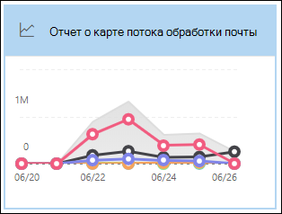

# Просмотр отчетов о потоке почты на панели мониторинга отчетов в центре & безопасности

[!INCLUDE [Microsoft 365 Defender rebranding](../includes/microsoft-defender-for-office.md)]

**Область применения**
- [Exchange Online Protection](exchange-online-protection-overview.md)
- [Microsoft Defender для Office 365 (план 1 и план 2)](defender-for-office-365.md)
- [Microsoft 365 Defender](../defender/microsoft-365-defender.md)

Помимо отчетов о потоках почты,  доступных на панели мониторинга потока почты в Центре обеспечения безопасности & соответствия требованиям, в панели отчетов доступны дополнительные отчеты о потоках почты, которые помогут отслеживать организацию Microsoft 365.

Если у вас есть [необходимые](#what-permissions-are-needed-to-view-these-reports)разрешения, вы можете просмотреть эти отчеты в Центре & соответствия требованиям, переехав на панель мониторинга   \> **отчетов**. Чтобы перейти непосредственно к панели мониторинга Отчетов, откройте <https://protection.office.com/insightdashboard> .

## Отчет connector

В **отчете Connector** показана активность потока почты на [входящие](/Exchange/mail-flow-best-practices/use-connectors-to-configure-mail-flow/use-connectors-to-configure-mail-flow) и исходящие соединители, настроенные для организации.

Чтобы просмотреть отчет, откройте центр [&](https://protection.office.com)безопасности,  перейдите к панели мониторинга отчетов и \>  выберите **отчет Connector**. Чтобы перейти непосредственно к отчету, откройте <https://protection.office.com/reportv2?id=ConnectorReport> .

### Представление отчета для отчета Connector

В представлении отчета доступны следующие диаграммы:

- **Просмотр данных по: поток почты.** На этой диаграмме показано количество входящие и исходящие сообщения, организованные по:

  - **Total**
  - **Из Интернета без соединитетеля**
  - **В Интернет без соединитетеля**
  - Определенный соединитатель, который вы настроили.

  Чтобы изолировать данные на диаграмме, используйте данные **Show** для управления, чтобы выбрать один из этих параметров или **весь поток почты.**

  

- **Просмотр данных по: использование TLS.** На этой диаграмме показан процент использования версии TLS для потока почты.

  Чтобы изолировать данные на диаграмме, используйте данные **Show** для управления, чтобы выбрать один из следующих вариантов:

  - **Весь поток почты**
  - **Из Интернета без соединитетеля**
  - **В Интернет без соединитетеля**
  - Определенный соединитатель, который вы настроили.

  

Если щелкнуть **фильтры** в представлении отчета, можно указать диапазон дат **с** датой начала и **датой окончания.**

### Представление таблицы сведений для отчета Connector

Если **щелкнуть таблицу Просмотр** сведений в представлении отчета, показано следующее:

- **Дата**
- **Направление и имя соединитетеля**
- **Тип соединителя**
- **Forced TLS?**: Значение **True или** **False**.
- **Нет TLS** (процент)
- **TLS 1.0** (процент)
- **TLS 1.1** (процент)
- **TLS 1.2** (процент)
- **Том.** Количество сообщений.

Если щелкнуть **Фильтры** в представлении таблицы сведений, можно указать диапазон дат с датой начала и  **датой окончания.**

Чтобы вернуться к представлению отчета, нажмите **кнопку Просмотр отчета**.

## Отчет о правилах транспорта Exchange

В **отчете о** правилах транспорта Exchange показано влияние правил потока почты (также известных как правила транспорта) на входящие и исходяющие сообщения в вашей организации.

Чтобы просмотреть отчет, откройте центр & безопасности,  перейдите [к](https://protection.office.com)панели мониторинга отчетов и выберите \>  правило **транспорта Exchange.** Чтобы перейти непосредственно к отчету, откройте <https://protection.office.com/reportv2?id=ETRRuleReport> .

### Представление отчета для отчета о правилах транспорта Exchange

В представлении отчета доступны следующие диаграммы:

- **Просмотр данных по: Правила транспорта** \> Exchange **Break down by: Direction:** This chart shows the number of **Inbound** and **Outbound messages** that were affected by transport rules.

- **Просмотр данных по: Правила транспорта** \> Exchange **Break down by: Severity**: This chart shows the number of **High severity** and **Medium severity**, and **Low severity** messages. Вы установите уровень серьезности в качестве действия в правиле **(Аудит** этого правила с уровнем серьезности или _SetAuditSeverity)._ Дополнительные сведения см. в сообщении о действиях правила [потока почты в Exchange Online.](//Exchange/security-and-compliance/mail-flow-rules/mail-flow-rule-actions)

- **Просмотр данных по: правила транспорта DLP Exchange** \> **Break down by: Direction:** This chart shows the number of **Inbound** and **Outbound** messages that were affected by data loss prevention (DLP) transport rules. Далее можно уточнить диаграмму, выбрав следующие параметры:

  - **Показать данные для: все правила транспорта DLP**
  - **Показать данные для: скомпрометированная пользователей**
  - **Показать данные для: Низкий объем контента, обнаруженного Патриотический акт США**

- **Просмотр данных по: правила транспорта DLP Exchange** \> **Break down by: Direction:** This view shows the number of **High severity** and **Medium severity**, and **Low severity** messages that were affected by DLP transport rules. Далее можно уточнить диаграмму, выбрав следующие параметры:

  - **Показать данные для: все правила транспорта DLP**
  - **Показать данные для: скомпрометированная пользователей**
  - **Показать данные для: Низкий объем контента, обнаруженного Патриотический акт США**

Если **щелкнуть фильтры** в представлении отчета, результаты можно изменить с помощью следующих фильтров::

- **Дата начала и** **дата окончания**
- Значения направления
- Значения серьезности

### Представление таблицы сведений для отчета о правилах транспорта Exchange

Если **щелкнуть таблицу Просмотр** сведений, показанные сведения зависят от диаграммы, на которую вы смотрите:

- **Просмотр данных по: Правила транспорта Exchange:**

  - **Дата**
  - **Правило транспорта**
  - **Тема**
  - **Адрес отправителя**
  - **Адрес получателя**
  - **Серьезность**
  - **Направление**

- **Просмотр данных по: правила транспорта DLP Exchange:**

  - **Дата**
  - **Политика защиты от потери данных**
  - **Правило транспорта**
  - **Тема**
  - **Адрес отправителя**
  - **Адрес получателя**
  - **Серьезность**
  - **Направление**

Если **щелкнуть Фильтры** в представлении таблицы сведений, результаты можно изменить следующими фильтрами:

- **Дата начала и** **дата окончания**
- Значения направления
- Значения серьезности

Чтобы вернуться к представлению отчета, нажмите **кнопку Просмотр отчета**.

## Отчет о переадпорте

В **отчете о** пересылке показаны автоматически пересылаемые сообщения организации во внешние домены из почтовых ящиков Exchange Online. Переадренные сообщения могут представлять угрозу безопасности или соответствия требованиям, а также указывать на скомпрометированную учетную запись.

Чтобы просмотреть отчет, откройте Центр [&](https://protection.office.com)безопасности,  перейдите на панель мониторинга отчетов и \>  выберите отчет **о переадпорте.** Чтобы перейти непосредственно к отчету, откройте <https://protection.office.com/reportv2?id=MailFlowForwarding> .

### Представление отчета для отчета о переадпорте

В представлении отчета доступны следующие диаграммы:

- **Показать данные для: Методы переададки:** показаны следующие методы:

  - **Правило транспорта:** Также известное как [правила потока почты.](/Exchange/security-and-compliance/mail-flow-rules/mail-flow-rules)
  - **Правило почтовых ящиков:** Также известное как [правила "Входящие".](https://support.microsoft.com/office/c24f5dea-9465-4df4-ad17-a50704d66c59)

  

- **Показать данные для: Переадправление доменов.** В этом представлении показаны домены получателей, которые являются пунктами назначения для переадправления.

  

- **Показать данные для: Переадверы**: Показаны следующие переад.

  - **Правило транспорта**
  - Почтовый ящик, содержащий правило "Входящие" пересылания.

  

Если щелкнуть **фильтры** в представлении отчета, можно указать диапазон дат **с** датой начала и **датой окончания.**

### Представление таблицы сведений для отчета о переадпорте

Если **щелкнуть таблицу Просмотр** сведений в представлении отчета, показано следующее:

- **Переадпортаторы.** **Правило** транспорта значения или почтовый ящик, содержащий правило почтовых ящиков пересылания.
- **Тип пересылания:** правило **почтовых ящиков значения** или **правило транспорта.**
- **Имя получателя**
- **домен получателя;**
- **Сведения.** Это значение GUID правила потока почты или значение RuleIdentity правила "Входящие".
- **Count**
- **Дата первой переададки**

Если щелкнуть **Фильтры** в представлении таблицы сведений, можно указать диапазон дат с датой начала и  **датой окончания.**

Чтобы вернуться к представлению отчетов, нажмите **кнопку Просмотр отчета**.

## Отчет о состоянии почтового потока

Отчет **о состоянии почтового потока** похож на отчет отправленной и полученной электронной почты, а дополнительные сведения о электронной почте разрешены или заблокированы на краю.  Это единственный отчет, содержащий сведения о защите края, и показывает, сколько сообщений электронной почты блокируется до того, как они будут допущены в службу для оценки в Exchange Online Protection (EOP). Важно понимать, что если сообщение отправляется пяти получателям, мы считаем его пятью разными сообщениями, а не одним сообщением.
Чтобы просмотреть отчет, откройте Центр [&](https://protection.office.com)безопасности,  перейдите к панели мониторинга отчетов и выберите отчет о состоянии \>  **mailflow.** Чтобы перейти непосредственно к отчету о состоянии **потока почты,** откройте <https://protection.office.com/mailflowStatusReport> .

### Введите представление отчета о состоянии mailflow

При открывании отчета вкладка **Type** выбирается по умолчанию. По умолчанию это представление содержит диаграмму и таблицу данных, настроенные с помощью следующих фильтров:

- **Дата.** Последние 7 дней.
- **Направление:**

  - **Входящий**
  - **Исходящие**
  - **Intra-org:** это количество для сообщений в клиенте, то есть отправитель abc@domain.com получателям xyz@domain.com (засчитываются  отдельно от входящие и **исходящие)**

- **Тип:**

  - **Хорошая почта**
  - **Вредоносная программа**
  - **Спам**
  - **Защита края**
  - **Сообщения правил**
  - **Фишинговое письмо**

Диаграмма организована **значениями Type.**

Эти фильтры можно изменить, щелкнув **Фильтр** или щелкнув значение в легенде диаграммы.

В таблице данных содержатся следующие сведения:

- **Направление**
- **Тип**
- **24 часа**
- **за 3 дня;**
- **7 дней**
- **15 дней**
- **30 дней**

Если вы **нажмете Выберите категорию для получения** дополнительных сведений, вы можете выбрать из следующих значений:

- **Фишинговое письмо.** Этот выбор принимает вас к отчету о [состоянии защиты от угроз.](view-email-security-reports.md#threat-protection-status-report)
- **Вредоносные программы в электронной** почте: этот выбор принимает вас к отчету о [состоянии защиты от угрозы](view-email-security-reports.md#threat-protection-status-report).
- **Обнаружение нежелательной почты.** Этот выбор принимает вас к [отчету обнаружения нежелательной почты](view-email-security-reports.md#spam-detections-report).
- **Edge заблокирован нежелательной почты:** этот выбор принимает вас к [отчету обнаружения нежелательной почты](view-email-security-reports.md#spam-detections-report).

**Экспорт:**

Для представления подробной информации можно экспортировать данные только в течение одного дня. Поэтому, если вы хотите экспортировать данные в течение 7 дней, необходимо сделать 7 различных действий по экспорту.

Каждый экспортируемый файл csv ограничен 150 000 строк. Если данные за этот день содержат более 150 000 строк, будет создано несколько файлов CSV.

### Представление направления для отчета о состоянии mailflow

Если щелкнуть **вкладку Direction,** используются те же фильтры по умолчанию из представления **Type.**

Диаграмма организована **значениями Direction.**

Эти фильтры можно изменить, щелкнув **Фильтр** или щелкнув значение в легенде диаграммы. Используются те же фильтры из представления **Type.**

Таблица данных содержит те же сведения из представления **Type.**

Выбор **категории для получения дополнительных** сведений о выборах и поведении такой же, как представление **Type.**

**Экспорт:**

Для представления подробной информации можно экспортировать данные только в течение одного дня. Поэтому, если вы хотите экспортировать данные в течение 7 дней, необходимо сделать 7 различных действий по экспорту.

Каждый экспортируемый файл csv ограничен 150 000 строк. Если данные за этот день содержат более 150 000 строк, будет создано несколько файлов CSV.

### Представление воронки для отчета о состоянии mailflow

В **представлении Воронка** показано, как функции защиты от угроз электронной почты Майкрософт фильтруют входящие и исходяющие сообщения электронной почты в вашей организации. В нем представлены сведения об общем числе сообщений электронной почты, а также о том, как настроенные функции защиты от угроз, включая защиту края, антивирусные программы, защиту от фишинга, защиту от нежелательной почты и защиту от спуфинга, влияют на этот счет.

Если щелкнуть вкладку **Воронка,** это представление по умолчанию содержит диаграмму и таблицу данных, настроенные с помощью следующих фильтров:

- **Дата.** Последние 7 дней.

- **Направление:**

  - **Входящий**
  - **Исходящие**
  - **Intra-org.** Это количество для сообщений, отправленных в клиенте; то есть отправитель отправляет abc@domain.com получателям xyz@domain.com (засчитываются отдельно от входящие и исходящие).

Совокупное представление и представление таблицы данных позволяют в течение 90 дней фильтрации.

При **нажатии фильтра** можно отфильтровать диаграмму и таблицу данных.

На этой диаграмме показана графа электронной почты, организованного по:

- **Всего сообщений электронной почты**
- **Электронная почта после защиты края**
- **Электронная почта после вредоносных программ, репутации файлов, блока типа файла**
- **Электронная почта после защиты от фишинга, репутации URL-адресов, обезличения бренда и подмены**
- **Электронная почта после фильтрации массовой почты после нежелательной почты**
- **Электронная почта после обезличения пользователя** и домена 1
- **Электронная почта после детонации файла и URL-адреса**1
- **Электронная почта, обнаруженная как доброкачественная после защиты после доставки (защита времени щелчка URL-адреса)**

1 Защитник только для Office 365

Чтобы просмотреть сообщение электронной почты, фильтруемой EOP или Defender для Office 365 отдельно, щелкните значение в легенде диаграммы.

В таблице данных содержатся следующие сведения, показанные в порядке убывающих дат:

- **Дата**
- **Всего сообщений электронной почты**
- **Защита края**
- **Anti-malware, file reputation, file type block:**
  - **Репутация файла:** сообщения фильтруются из-за идентификации присоединенного файла другими клиентами Майкрософт.
  - **Блок типа файла.** Сообщения фильтруются из-за типа вредоносного файла, идентифицированного в сообщении.
- **Защита от фишинга, репутация URL-адреса, вымысление бренда, защита от подмены:**
  - **Репутация URL-адреса.** Сообщения фильтруются из-за идентификации URL-адреса другими клиентами Майкрософт.
  - **Вымысление** бренда: сообщения фильтруются из-за сообщения, исходящем от известных отправителей бренда, вымыкающих себя.
  - **Anti-spoof**: Сообщения фильтруются из-за сообщения, пытающихся подменить домен, к который принадлежит получатель, или домена, который не принадлежит отправителю сообщения.
- **Фильтрация массовой почты** для борьбы со спамом:
  - **Массовая фильтрация** почты: сообщения фильтруются из-за попытки доставки массовой почты ее получателям.
- **Вымысление пользователя и домена (Defender for Office 365)**:
  - Вымысление пользователя. Сообщения фильтруются из-за попытки выдать себя за пользователя (отправитель сообщений), определенного в параметрах защиты от фишинга.
  - **Обезличение** домена. Сообщения фильтруются из-за попытки выдать себя за домен, определенный в параметрах защиты от фишинга.
- **Детонация файлов и URL-адресов (Defender для Office 365)**:
  - **Детонация файлов:** сообщения, фильтруемые политикой безопасных вложений.
  - **Детонация URL-адреса.** Сообщение фильтруется политикой безопасных ссылок.
- **Защита после доставки и ZAP (ATP) или ZAP (EOP)**: ZAP указывает на авточистку нулевого часа.

Если вы выберите строку в таблице данных, в вылете будет показана дальнейшая разбивка учетных записей электронной почты.

**Экспорт:**

После нажатия **"Экспорт** в **параметрах"** можно выбрать одно из следующих значений:

- **Сводка (с данными за последние 90 дней не более)**
- **Сведения (с данными за последние 30 дней не более)**

В **соответствии с датой** выберите диапазон, а затем нажмите **кнопку Применить**. Данные для текущих фильтров будут экспортироваться в файл csv.

Каждый экспортируемый файл csv ограничен 150 000 строк. Если данные содержат более 150 000 строк, будет создано несколько файлов CSV.

 

### Техническое представление отчета о состоянии mailflow

Представление **Tech аналогично** представлению **Воронка,** предоставляя более подробные сведения о настроенных средствах защиты от угроз. На диаграмме можно увидеть, как классифицируются сообщения на различных этапах защиты от угроз.

Если вы щелкните вкладку **Tech View,** по умолчанию это представление содержит диаграмму и таблицу данных, настроенные с помощью следующих фильтров:

- **Дата.** Последние 7 дней.

- **Направление:**

  - **Входящий**
  - **Исходящие**
  - **Intra-org:** это количество для сообщений в клиенте, то есть отправитель abc@domain.com отправляет получателю xyz@domain.com (рассчитывается отдельно от входящие и исходящие)

Совокупное представление и представление таблицы данных позволяют в течение 90 дней фильтрации.

При **нажатии фильтра** можно отфильтровать диаграмму и таблицу данных.

На этой диаграмме показаны сообщения, организованные в следующие категории:

- **Всего сообщений электронной почты**
- **Edge allow** and **Edge filtered**
- **Не вредоносные** программы, обнаружение безопасных **вложений,** обнаружение вредоносных \* **программ** и **сообщения правил**
- **Не фишинг,** **отказ DMARC,** **обнаружение** обезличения, **обнаружение Spoof** и **обнаружение фишинга**
- **Отсутствие обнаружения с детонацией URL-адреса** и **обнаружением детонации URL-адреса**\*
- **Не нежелательной почты** и  **нежелательной почты**
- **Не вредоносная электронная почта,** **обнаружение безопасных ссылок** \* и **ZAP**

\* Defender for Office 365

Когда вы наведите курсор над категорией на диаграмме, вы увидите количество сообщений в этой категории.

В таблице данных содержатся следующие сведения, показанные в порядке убывающих дат:

- **Дата**
- **Всего сообщений электронной почты**
- **Отфильтрованный край**
- **Антивирусный двигатель, безопасные вложения, правило фильтруется:**
  - **Фильтруется** правило: Сообщения фильтруются из-за правил потока почты (также известных как правила транспорта).
- **DMARC, impersonation, spoof, phish filtered:**
  - **DMARC:** Сообщения фильтруются из-за отказа сообщения проверки подлинности DMARC.
- **Обнаружение детонации URL-адреса**
- **Фильтрация от нежелательной почты**
- **ZaP удален**
- **Обнаружение по безопасным ссылкам**

Если вы выберите строку в таблице данных, в вылете будет показана дальнейшая разбивка учетных записей электронной почты.

**Экспорт:**

При **нажатии на экспорт** **можно** выбрать одно из следующих значений:

- **Сводка (с данными за последние 90 дней не более)**
- **Сведения (с данными за последние 30 дней не более)**

В **соответствии с датой** выберите диапазон, а затем нажмите **кнопку Применить**. Данные для текущих фильтров будут экспортироваться в файл csv.

Каждый экспортируемый файл csv ограничен 150 000 строк. Если данные содержат более 150 000 строк, будет создано несколько файлов CSV.

 

## Отправленный и полученный отчет электронной почты

Отправленный **и** полученный отчет электронной почты — это интеллектуальный отчет, в нем показаны сведения о входящих и исходяющих сообщениях электронной почты, включая обнаружение нежелательной почты, вредоносные программы и сообщения электронной почты, идентифицированные как "хорошие". Разница между этим отчетом и отчетом о состоянии [mailflow](#mailflow-status-report) заключается в том, что в этом отчете не содержатся данные о сообщениях, заблокированных краевой защитой. Важно понимать, что если сообщение отправляется пяти получателям, мы считаем его одним сообщением.

Совокупное представление и представление деталей отчета позволяют в течение 90 дней фильтрации.

Чтобы просмотреть отчет, откройте Центр & безопасности,  перейдите [на](https://protection.office.com)панель мониторинга отчетов и выберите \>  **отправленную и полученную электронную почту.** Чтобы перейти непосредственно к отчету, откройте <https://protection.office.com/reportv2?id=SentAndReceivedMailATP> .

### Представление отчета для отправленного и полученного отчета электронной почты

В представлении отчета доступны следующие диаграммы:

- **Break down by: Type:** The chart shows all available categories:

  - **Total**
  - **Хорошая почта**
  - **Вредоносные программы (антивирусные программы)** (EOP)
  - **Обнаружения нежелательной почты**
  - **Сообщения правил**
  - **Расширенные вредоносные** программы (Microsoft Defender для Office 365)

  При наведении в течение дня (точки данных) на диаграмме можно увидеть сведения за этот день.

  

- **Break down by: Direction:** The chart shows **Total,** **Inbound**, and **Outbound** data. При наведении в течение дня (точки данных) на диаграмме можно увидеть сведения за этот день.

  

- **Сверлить** \> **Malware (anti-malware)**: This selection takes you to the [Malware detections in email report.](view-email-security-reports.md#malware-detections-in-email-report)

- **Сверлить** \> **Обнаружения нежелательной почты)**: Этот выбор принимает вас к [отчету обнаружения нежелательной почты](view-email-security-reports.md#spam-detections-report).

Если **щелкнуть фильтры** в представлении отчета, результаты можно изменить с помощью следующих фильтров:

- **Дата начала и** **дата окончания**
- Значения направления
- Значения типа

Чтобы вернуться к представлению отчета, нажмите **кнопку Просмотр отчета**.

### Представление таблицы сведений для отправленного и полученного отчета электронной почты

Если **щелкнуть** таблицу Просмотр сведений в таблице **Break down by: Direction** or Break down **by: Direction** view, показано следующее:

- **Дата (UTC)**
- **Тип**
- **Направление**
- **Количество сообщений**

Если **щелкнуть Фильтры** в представлении таблицы сведений, результаты можно изменить следующими фильтрами:

- **Дата начала и** **дата окончания**
- Значения направления
- Значения типа

Чтобы вернуться к представлению отчета, нажмите **кнопку Просмотр отчета**.

## Отчет о главных отправителей и получателях

Верхний **отчет отправителей** и получателей — это диаграмма пирога, показывающая главных отправителей и получателей электронной почты.

Чтобы просмотреть отчет, откройте центр & безопасности,  [перейдите к панели](https://protection.office.com)мониторинга отчетов и выберите главных отправителей \>  **и получателей.** Чтобы перейти непосредственно к отчету, откройте <https://protection.office.com/reportv2?id=TopSenderRecipientsATP> .

### Представление отчета для главных отправителей и получателей

В представлении отчета доступны следующие диаграммы:

- **Показать данные для \> отправителей верхней почты**
- **Показать данные для \> получателей топ-почты**
- **Демонстрация данных для \> получателей нежелательной почты**
- **Показать данные для \> Лучшие получатели вредоносных программ** (EOP)
- **Показать данные для \> получателей топовых вредоносных программ (Defender для Office 365)**

Состав диаграммы пирога изменяется на основе этих выборов.

При наведении на клин в диаграмме пирога можно увидеть количество отправленных или полученных сообщений.

Если щелкнуть **фильтры** в представлении отчета, можно указать диапазон дат **с** датой начала и **датой окончания.**

### Представление таблицы сведений для отчета о главных отправителей и получателях

Если **щелкнуть таблицу Просмотр** сведений, показанные сведения зависят от диаграммы, на которую вы смотрите:

- **Показать данные для \> отправителей верхней почты**

  - **Главные отправители почты**
  - **Count**

- **Показать данные для \> получателей топ-почты**

  - **Лучшие получатели почты**
  - **Count**

- **Демонстрация данных для \> получателей нежелательной почты**

  - **Лучшие получатели нежелательной почты**
  - **Count**

- **Показать данные для \> Лучшие получатели вредоносных программ** (EOP)

  - **Лучшие получатели вредоносных программ**
  - **Count**

- **Показать данные для \> получателей топовых вредоносных программ (Defender для Office 365)**

  - **Лучшие получатели вредоносных программ (Defender для Office 365)**
  - **Count**

Если щелкнуть **Фильтры** в представлении таблицы сведений, можно указать диапазон дат с датой начала и  **датой окончания.**

Чтобы вернуться к представлению отчета, нажмите **кнопку Просмотр отчета**.

## Какие разрешения необходимы для просмотра этих отчетов?

Чтобы просмотреть и использовать отчеты, описанные в этой статье, необходимо быть членом одной из следующих групп ролей в Центре & безопасности:

- **Управление организацией**
- **Администратор безопасности**
- **Считыватель безопасности**
- **Глобальный читатель**

Дополнительные сведения см. в статье [Разрешения в Центре безопасности и соответствия требованиям](permissions-in-the-security-and-compliance-center.md).

> [!NOTE]
> Добавление пользователей в соответствующую роль Azure Active Directory в Центре безопасности Microsoft 365 предоставляет пользователям необходимые разрешения в Центре безопасности и соответствия требованиям _и_ разрешения для других функций в Microsoft 365. Дополнительные сведения см. в статье [О ролях администраторов](../../admin/add-users/about-admin-roles.md).

## Статьи по теме

[Интеллектуальные отчеты и аналитика в Центре безопасности и соответствия требованиям](reports-and-insights-in-security-and-compliance.md)

[Аналитика потока обработки почты в Центре безопасности и соответствия требованиям](mail-flow-insights-v2.md)

[Просмотр отчетов о безопасности почты в Центре безопасности и соответствия требованиям](view-email-security-reports.md)

[Просмотр отчетов для Microsoft Defender для Office 365](view-reports-for-mdo.md)
