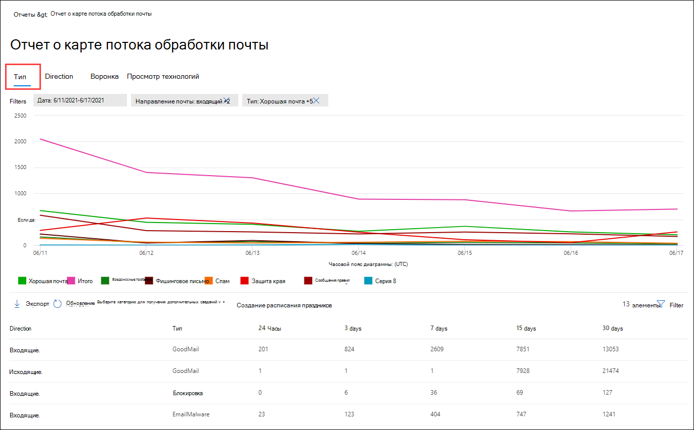

# Просмотр отчетов о потоке обработки почты на панели мониторинга отчетов в Центре & соответствия требованиямView mail flow reports in the Reports dashboard in Security & Compliance Center

[!INCLUDE [Microsoft 365 Defender rebranding](../includes/microsoft-defender-for-office.md)]

**Область применения****Applies to**
- [Exchange Online ProtectionExchange Online Protection](exchange-online-protection-overview.md)
- [Microsoft Defender для Office 365 (план 1 и план 2)Microsoft Defender for Office 365 plan 1 and plan 2](office-365-atp.md)
- [Microsoft 365 DefenderMicrosoft 365 Defender](../mtp/microsoft-threat-protection.md)

Помимо отчетов о потоке обработки  почты, доступных на панели мониторинга потока обработки почты в Центре безопасности и & соответствия требованиям, на панели мониторинга отчетов доступны различные дополнительные отчеты о потоке обработки почты, которые помогут отслеживать организацию Microsoft 365.In addition to the mail flow reports that are available in the [Mail flow dashboard](mail-flow-insights-v2.md) in the Security & Compliance Center, a variety of additional mail flow reports are available in the Reports dashboard to help you monitor your Microsoft 365 organization.

Если у вас есть [необходимые](#what-permissions-are-needed-to-view-these-reports)разрешения, вы можете просмотреть эти отчеты в Центре безопасности [&](https://protection.office.com) соответствия требованиям, переходить на панель мониторинга  \> **отчетов.**If you have the [necessary permissions](#what-permissions-are-needed-to-view-these-reports), you can view these reports in the [Security & Compliance Center](https://protection.office.com) by going to **Reports** \> **Dashboard**. Чтобы перейти непосредственно на панель мониторинга отчетов, откройте <https://protection.office.com/insightdashboard> .To go directly to the Reports dashboard, open <https://protection.office.com/insightdashboard>.

## Отчет о соединителиConnector report

В **отчете о соединители** показаны действия потока почты на входящие и исходящие соединители,  настроенные для вашей организации.The **Connector report** shows mail flow activity on the [inbound and outbound connectors](https://docs.microsoft.com/Exchange/mail-flow-best-practices/use-connectors-to-configure-mail-flow/use-connectors-to-configure-mail-flow) that are configured for your organization.

Чтобы просмотреть отчет, откройте Центр безопасности [&](https://protection.office.com)  соответствия требованиям, перейдите на панель мониторинга отчетов и выберите отчет \>  **"Соединители".**To view the report, open the [Security & Compliance Center](https://protection.office.com), go to **Reports** \> **Dashboard** and select **Connector report**. Чтобы перейти непосредственно к отчету, откройте <https://protection.office.com/reportv2?id=ConnectorReport> .To go directly to the report, open <https://protection.office.com/reportv2?id=ConnectorReport>.

### Представление отчета о соединителиReport view for the Connector report

В представлении отчета доступны следующие диаграммы:The following charts are available in report view:

- **Просмотр данных по: поток обработки** почты : на этой диаграмме показано количество входящие и исходящие сообщения, организованные по:**View data by: Mail flow**: This chart shows the number of inbound and outbound messages organized by:

  - **Total****Total**
  - **Из Интернета без соединители****From the internet without a connector**
  - **В Интернет без соединители****To the internet without a connector**
  - Определенный настроенный соединител.A specific connector that you've configured.

  Чтобы изолировать данные на диаграмме, используйте данные **"Показать"** для управления, чтобы выбрать один из этих параметров или **весь поток обработки почты.**To isolate the data in the chart, use the **Show data for** control to select one of these options or **All mail flow**.

  

- **Просмотр данных по: использование TLS**: на этой диаграмме показан процент использования версий TLS для потока обработки почты.**View data by: TLS usage**: This chart shows the percentage of Transport Layer Security (TLS) version usage for mail flow.

  Чтобы изолировать данные на диаграмме, используйте данные **"Показать"** для управления, чтобы выбрать один из следующих параметров:To isolate the data in the chart, use the **Show data for** control to select one of the following options:

  - **Весь поток почты****All mail flow**
  - **Из Интернета без соединители****From the internet without a connector**
  - **В Интернет без соединители****To the internet without a connector**
  - Определенный настроенный соединител.A specific connector that you've configured.

  

Если **щелкнуть "Фильтры"** в представлении отчета, можно указать диапазон дат с датой **начала** и **датой окончания.**If you click **Filters** in a report view, you can specify a date range with **Start date** and **End date**.

### Представление таблицы сведений для отчета о соединителиDetails table view for the Connector report

Если **щелкнуть "Просмотреть таблицу сведений"** в представлении отчета, будут показаны следующие сведения:If you click **View details table** in a report view, the following information is shown:

- **Дата****Date**
- **Направление и имя соединители****Connector direction and name**
- **Тип соединителя****Connector type**
- **Принудительный TLS?**— значение **True или** **False.****Forced TLS?**: The value **True** or **False**.
- **Нет TLS** (в процентах)**No TLS** (percentage)
- **TLS 1.0** (процент)**TLS 1.0** (percentage)
- **TLS 1.1** (процент)**TLS 1.1** (percentage)
- **TLS 1.2** (процент)**TLS 1.2** (percentage)
- **Volume**: Количество сообщений.**Volume**: The number of messages.

Если **щелкнуть "Фильтры"** в представлении таблицы сведений, можно указать диапазон дат с датой **начала** и **датой окончания.**If you click **Filters** in a details table view, you can specify a date range with **Start date** and **End date**.

Чтобы вернуться в представление отчета, щелкните **"Просмотреть отчет".**To go back to the report view, click **View report**.

## Отчет о правилах транспорта ExchangeExchange transport rule report

В **отчете о правилах** транспорта Exchange показано влияние правил потока почты (также известных как правила транспорта) на входящие и исходяющие сообщения в организации.The **Exchange transport rule report** shows the effect of mail flow rules (also known as transport rules) on incoming and outgoing messages in your organization.

Чтобы просмотреть отчет, откройте Центр безопасности [&](https://protection.office.com)  соответствия требованиям, перейдите на панель мониторинга отчетов и выберите \>  правило **транспорта Exchange.**To view the report, open the [Security & Compliance Center](https://protection.office.com), go to **Reports** \> **Dashboard** and select **Exchange Transport rule**. Чтобы перейти непосредственно к отчету, откройте <https://protection.office.com/reportv2?id=ETRRuleReport> .To go directly to the report, open <https://protection.office.com/reportv2?id=ETRRuleReport>.

### Представление отчета для отчета о правилах транспорта ExchangeReport view for the Exchange transport rule report

В представлении отчета доступны следующие диаграммы:The following charts are available in report view:

- **Просмотр данных с помощью: правила транспорта** \> Exchange **Break down by: Direction**: This chart shows the number of **Inbound** and **Outbound** messages that were affected by transport rules.**View data by: Exchange transport rules** \> **Break down by: Direction**: This chart shows the number of **Inbound** and **Outbound** messages that were affected by transport rules.

- **Просмотр данных с помощью: правила транспорта** \> Exchange **Break down by: Severity**: This chart shows the number of **High severity** and **Medium severity**, and **Low severity** messages.**View data by: Exchange transport rules** \> **Break down by: Severity**: This chart shows the number of **High severity** and **Medium severity**, and **Low severity** messages. Уровень серьезности задавается в качестве действия в правиле **(** аудит этого правила со степенью серьезности или _SetAuditSeverity)._You set the severity level as an action in the rule (**Audit this rule with severity level** or _SetAuditSeverity_). Дополнительные сведения см. в [действиях правил потока почты в Exchange Online.](https://docs.microsoft.com//Exchange/security-and-compliance/mail-flow-rules/mail-flow-rule-actions)For more information, see [Mail flow rule actions in Exchange Online](https://docs.microsoft.com//Exchange/security-and-compliance/mail-flow-rules/mail-flow-rule-actions).

- **Просмотр данных с помощью правил транспорта DLP Exchange** \> **Break down by: Direction**: This chart shows the number of **Inbound** and **Outbound** messages that were affected by data loss prevention (DLP) transport rules.**View data by: DLP Exchange transport rules** \> **Break down by: Direction**: This chart shows the number of **Inbound** and **Outbound** messages that were affected by data loss prevention (DLP) transport rules. Вы можете уточнить диаграмму, выбрав следующие параметры:You can further refine the chart by selecting on of the following options:

  - **Показать данные для: все правила транспорта DLP****Show data for: All DLP transport rules**
  - **Показать данные для: скомпрометированная пользователи****Show data for: Compromised users**
  - **Показать данные для: низкий объем обнаруженного содержимого в США****Show data for: Low volume of content detected U.S. Patriot Act**

- **Просмотр данных с помощью правил транспорта DLP Exchange** \> **Break down by: Direction**: This view shows the number of **High severity** and **Medium severity**, and **Low severity** messages that were affected by DLP transport rules.**View data by: DLP Exchange transport rules** \> **Break down by: Direction**: This view shows the number of **High severity** and **Medium severity**, and **Low severity** messages that were affected by DLP transport rules. Вы можете уточнить диаграмму, выбрав следующие параметры:You can further refine the chart by selecting on of the following options:

  - **Показать данные для: все правила транспорта DLP****Show data for: All DLP transport rules**
  - **Показать данные для: скомпрометированная пользователи****Show data for: Compromised users**
  - **Показать данные для: низкий объем обнаруженного содержимого в США****Show data for: Low volume of content detected U.S. Patriot Act**

Если **щелкнуть "Фильтры"** в представлении отчета, можно изменить результаты с помощью следующих фильтров:If you click **Filters** in a report view, you can modify the results with the following filters::

- **Дата начала и** **дата окончания****Start date** and **End date**
- Значения направленияDirection values
- Значения серьезностиSeverity values

### Представление таблицы сведений для отчета о правилах транспорта ExchangeDetails table view for the Exchange transport rule report

Если **щелкнуть таблицу "Просмотр** сведений", показанная информация зависит от диаграммы, на которую вы просматривали:If you click **View details table**, the information that's shown depends on the chart you were looking at:

- **Просмотр данных с помощью: правила транспорта Exchange:****View data by: Exchange Transport rules**:

  - **Дата****Date**
  - **Правило транспорта****Transport rule**
  - **Тема****Subject**
  - **Адрес отправителя****Sender address**
  - **Адрес получателя****Recipient address**
  - **Серьезность****Severity**
  - **Направление****Direction**

- **Просмотр данных с помощью: правила транспорта DLP Exchange:****View data by: DLP Exchange transport rules**:

  - **Дата****Date**
  - **Политика защиты от потери данных****DLP policy**
  - **Правило транспорта****Transport rule**
  - **Тема****Subject**
  - **Адрес отправителя****Sender address**
  - **Адрес получателя****Recipient address**
  - **Серьезность****Severity**
  - **Направление****Direction**

Если **щелкнуть "Фильтры"** в представлении таблицы сведений, можно изменить результаты с помощью следующих фильтров:If you click **Filters** in a details table view, you can modify the results with the following filters:

- **Дата начала и** **дата окончания****Start date** and **End date**
- Значения направленияDirection values
- Значения серьезностиSeverity values

Чтобы вернуться в представление отчета, щелкните **"Просмотреть отчет".**To go back to the report view, click **View report**.

## Отчет о переададпортеForwarding report

В **отчете о** пересылке показано, как автоматически пересылаются сообщения организации на внешние домены из почтовых ящиков Exchange Online.The **Forwarding report** shows your organization's automatically forwarded messages to external domains from Exchange Online mailboxes. Переадренные сообщения могут представлять угрозу безопасности или соответствия требованиям и указывать на скомпрометированную учетную запись.Forwarded messages can pose a security or compliance risk, and might indicate a compromised account.

Чтобы просмотреть отчет, откройте Центр безопасности [&](https://protection.office.com)соответствия  требованиям, перейдите на панель мониторинга отчетов и выберите \>  **"Отчет о переадрании".**To view the report, open the [Security & Compliance Center](https://protection.office.com), go to **Reports** \> **Dashboard** and select **Forwarding report**. Чтобы перейти непосредственно к отчету, откройте <https://protection.office.com/reportv2?id=MailFlowForwarding> .To go directly to the report, open <https://protection.office.com/reportv2?id=MailFlowForwarding>.

### Представление отчета о переададпортеReport view for the Forwarding report

В представлении отчета доступны следующие диаграммы:The following charts are available in the report view:

- **Показать данные для: методы переад вперед**: показаны следующие методы:**Show data for: Forwarding methods**: The following methods are shown:

  - **Правило транспорта:** также известное как [правила потока почты.](https://docs.microsoft.com/Exchange/security-and-compliance/mail-flow-rules/mail-flow-rules)**Transport rule**: Also known as [mail flow rules](https://docs.microsoft.com/Exchange/security-and-compliance/mail-flow-rules/mail-flow-rules).
  - **Правило почтового ящика**: также известное как [правила для входящих сообщений.](https://support.microsoft.com/office/c24f5dea-9465-4df4-ad17-a50704d66c59)**Mailbox rule**: Also known as [Inbox rules](https://support.microsoft.com/office/c24f5dea-9465-4df4-ad17-a50704d66c59).

  

- **Показать данные для: домены переадправления**: в этом представлении показаны домены получателей, которые являются пунктами назначения для переадправления.**Show data for: Forwarding domains**: This view shows the recipient domains that are the destinations for forwarding.

  

- **Показать данные для: forwarders**: показаны следующие переадверы:**Show data for: Forwarders**: The following forwarders are shown:

  - **Правило транспорта****Transport rule**
  - Почтовый ящик, содержащий правило для пересылаемой почты.The mailbox that contains the forwarding Inbox rule.

  

Если **щелкнуть "Фильтры"** в представлении отчета, можно указать диапазон дат с датой **начала** и **датой окончания.**If you click **Filters** in a report view, you can specify a date range with **Start date** and **End date**.

### Представление таблицы сведений для отчета "Переад вперед"Details table view for the Forwarding report

Если **щелкнуть "Просмотреть таблицу сведений"** в представлении отчета, будут показаны следующие сведения:If you click **View details table** in a report view, the following information is shown:

- **Пересылатели:** значение **правила транспорта** или почтовый ящик, содержащий правило пересылки входящих сообщений.**Forwarders**: The value **Transport rule** or the mailbox that contains the forwarding Inbox rule.
- **Тип пересылки:** правило почтового **ящика или** **правило транспорта.****Forwarding type**: The value **Mailbox rule** or **Transport rule**.
- **Имя получателя****Recipient name**
- **домен получателя;****Recipient domain**
- **Сведения:** это значение GUID правила потока почты или значение RuleIdentity правила для почтового ящика.**Details**: This is the GUID value of the mail flow rule, or the RuleIdentity value of the Inbox rule.
- **Count****Count**
- **Дата первой переададности****First forward date**

Если **щелкнуть "Фильтры"** в представлении таблицы сведений, можно указать диапазон дат с датой **начала** и **датой окончания.**If you click **Filters** in a details table view, you can specify a date range with **Start date** and **End date**.

Чтобы вернуться в представление отчетов, щелкните **"Просмотреть отчет".**To go back to the reports view, click **View report**.

## Отчет о состоянии потока почтыMailflow status report

Отчет **о состоянии потока** почты похож на отчет о отправленных и полученных сообщениях электронной почты с дополнительными сведениями о сообщениях электронной почты, разрешенных или заблокированных на границе. The **Mailflow status report** is similar to the [Sent and received email report](#sent-and-received-email-report), with additional information about email allowed or blocked on the edge. Это единственный отчет, который содержит сведения о защите по краям и показывает, сколько сообщений электронной почты блокируется перед тем, как получить доступ к службе для оценки в Exchange Online Protection (EOP).This is the only report that contains edge protection information, and shows just how much email is blocked before being allowed into the service for evaluation by Exchange Online Protection (EOP). Важно понимать, что если сообщение отправляется пяти получателям, мы подсчитывем его как пять разных сообщений, а не одно сообщение.It's important to understand that if a message is sent to five recipients we count it as five different messages and not one message.
Чтобы просмотреть отчет, откройте Центр безопасности [&](https://protection.office.com)соответствия  требованиям, перейдите на панель мониторинга отчетов и выберите отчет о состоянии \>  **потока обработки почты.**To view the report, open the [Security & Compliance Center](https://protection.office.com), go to **Reports** \> **Dashboard** and select **Mailflow status report**. Чтобы перейти непосредственно к **отчету о состоянии потока почты,** откройте <https://protection.office.com/mailflowStatusReport> .To go directly to the **Mail flow status report**, open <https://protection.office.com/mailflowStatusReport>.

### Представление типа для отчета о состоянии потока почтыType view for the Mailflow status report

При открываемом отчете вкладка **"Тип"** выбрана по умолчанию.When you open the report, the **Type** tab is selected by default. По умолчанию это представление содержит диаграмму и таблицу данных, настроенные с помощью следующих фильтров:By default, this view contains a chart and a data table that's configured with the following filters:

- **Дата:** последние 7 дней.**Date**: The last 7 days.
- **Направление:****Direction**:

  - **Входящий****Inbound**
  - **Исходящие****Outbound**
  - **Внутри организации:** это количество для сообщений в клиенте, то есть**Intra-org**: this count is for messages within a tenant i.e отправитель abc@domain.com получателям xyz@domain.com (учитывается отдельно от  входящие и **исходящие)**sender abc@domain.com sends to recipient xyz@domain.com  (counted separately from **Inbound** and **Outbound**)

- **Тип:****Type**:

  - **Хорошая почта****Good mail**
  - **Вредоносная программа****Malware**
  - **Спам****Spam**
  - **Защита на границе****Edge protection**
  - **Сообщения правил****Rule messages**
  - **Фишинговое письмо****Phishing email**

Диаграмма организована по **значениям Type.**The chart is organized by the **Type** values.

Вы можете изменить эти фильтры, **щелкнув** фильтр или щелкнув значение в легенде диаграммы.You can change these filters by clicking **Filter** or by clicking a value in the chart legend.

Таблица данных содержит следующие сведения:The data table contains the following information:

- **Направление****Direction**
- **Тип****Type**
- **24 часа****24 hours**
- **за 3 дня;****3 days**
- **7 дней****7 days**
- **15 дней****15 days**
- **30 дней****30 days**

Если выбрать **категорию для получения дополнительных сведений,** можно выбрать один из следующих значений:If you click **Choose a category for more details**, you can select from the following values:

- **Фишинговое сообщение** электронной почты: этот выбор перенабирает отчет [о состоянии защиты от угроз.](view-email-security-reports.md#threat-protection-status-report)**Phishing email**: This selection takes you to the [Threat protection status report](view-email-security-reports.md#threat-protection-status-report).
- **Вредоносная программа в** электронной почте: этот выбор перенабирает отчет о [состоянии защиты от угроз.](view-email-security-reports.md#threat-protection-status-report)**Malware in email**: This selection takes you to the [Threat protection status report](view-email-security-reports.md#threat-protection-status-report).
- **Обнаружение нежелательной почты:** этот выбор перенабирает отчет [об обнаружении нежелательной почты.](view-email-security-reports.md#spam-detections-report)**Spam detections**: This selection takes you to the [Spam Detections report](view-email-security-reports.md#spam-detections-report).
- **Edge blocked spam**: this selection takes you to the [Spam Detections report](view-email-security-reports.md#spam-detections-report).**Edge blocked spam**: This selection takes you to the [Spam Detections report](view-email-security-reports.md#spam-detections-report).

**Экспорт**:**Export**:

Для подробного представления можно экспортировать данные только за один день.For the detail view, you can only export data for one day. Поэтому, если вы хотите экспортировать данные за 7 дней, необходимо сделать 7 различных действий экспорта.So, if you want to export data for 7 days, you need to do 7 different export actions.

Каждый экспортированный CSV-файл может быть ограничен 150 000 строк.Each exported .csv file is limited to 150,000 rows. Если данные за этот день содержат более 150 000 строк, будет создано несколько CSV-файлов.If the data for that day contains more than 150,000 rows, then multiple .csv files will be created.

### Представление направления для отчета о состоянии потока почтыDirection view for the Mailflow status report

Если щелкнуть вкладку **"Направление",** будут использоваться те же фильтры по умолчанию из представления **"Тип".**If you click the **Direction** tab, the same default filters from the **Type** view are used.

Диаграмма организована по **значениям Направления.**The chart is organized by **Direction** values.

Вы можете изменить эти фильтры, **щелкнув** фильтр или щелкнув значение в легенде диаграммы.You can change these filters by clicking **Filter** or by clicking a value in the chart legend. Используются те же фильтры **из** представления "Тип".The same filters from the **Type** view are used.

Таблица данных содержит те же сведения из представления **"Тип".**The data table contains same information from the **Type** view.

The **Choose a category for more details** available selections and behavior are the same as the **Type** view.The **Choose a category for more details** available selections and behavior are the same as the **Type** view.

**Экспорт**:**Export**:

Для подробного представления можно экспортировать данные только за один день.For the detail view, you can only export data for one day. Поэтому, если вы хотите экспортировать данные за 7 дней, необходимо сделать 7 различных действий экспорта.So, if you want to export data for 7 days, you need to do 7 different export actions.

Каждый экспортированный CSV-файл может быть ограничен 150 000 строк.Each exported .csv file is limited to 150,000 rows. Если данные за этот день содержат более 150 000 строк, будет создано несколько CSV-файлов.If the data for that day contains more than 150,000 rows, then multiple .csv files will be created.

### Представление воронки для отчета о состоянии потока почтыFunnel view for the Mailflow status report

В **представлении воронки** показано, как функции защиты от угроз электронной почты Майкрософт фильтруют входящие и исходящую электронную почту в вашей организации.The **Funnel** view shows you how Microsoft's email threat protection features filter incoming and outgoing email in your organization. В нем представлены сведения об общем числе сообщений электронной почты и о том, как настроенные функции защиты от угроз, включая защиту от по краям, защиту от вредоносных программ, защиту от фишинга, нежелательной почты и спуфинга, влияют на это количество.It provides details on the total email count, and how the configured threat protection features, including edge protection, anti-malware, anti-phishing, anti-spam, and anti-spoofing affect this count.

Если щелкнуть вкладку **"Воронка",** по умолчанию это представление содержит диаграмму и таблицу данных, настроенные с помощью следующих фильтров:If you click the **Funnel** tab, by default, this view contains a chart and a data table that's configured with the following filters:

- **Дата:** последние 7 дней.**Date**: The last 7 days.

- **Направление:****Direction**:

  - **Входящий****Inbound**
  - **Исходящие****Outbound**
  - **Внутри организации:** это количество для сообщений, отправленных в клиенте; То есть отправитель может abc@domain.com получателям xyz@domain.com (учитывается отдельно от входящие и исходящие).**Intra-org**: This count is for messages sent within a tenant; i.e, sender abc@domain.com sends to recipient xyz@domain.com (counted separately from Inbound and Outbound).

Агрегированное представление и представление таблицы данных допускает фильтрацию в течение 90 дней.The aggregate view and data table view allow for 90 days of filtering.

Если **щелкнуть "Фильтр",** можно отфильтровать диаграмму и таблицу данных.If you click **Filter**, you can filter both the chart and the data table.

На этой диаграмме показано количество сообщений электронной почты, организованных по:This chart shows the email count organized by:

- **Всего сообщений электронной почты****Total email**
- **Электронная почта после защиты по краям****Email after edge protection**
- **Электронная почта после вредоносных программ, репутация файла, блок типов файлов****Email after anti-malware, file reputation, file type block**
- **Электронная почта после фишинга, репутации URL-адреса, фирменный подмена, защита от спуфинга****Email after anti-phish, URL reputation, brand impersonation, anti-spoof**
- **Электронная почта после нежелательной почты, массовая фильтрация почты****Email after anti-spam, bulk mail filtering**
- **Электронная почта после подступа пользователя и домена**1**Email after user and domain impersonation**1
- **Электронная почта после детонации файла и URL-адреса**1**Email after file and URL detonation**1
- **Электронная почта, обнаруженная как безвластие после защиты после доставки (защита при щелчке URL-адреса)****Email detected as benign after post-delivery protection (URL click time protection)**

1 Защитник только для Office 3651 Defender for Office 365 only

Чтобы просмотреть электронную почту, отфильтрованную по EOP или Защитнику для Office 365 отдельно, щелкните значение в легенде диаграммы.To view the email filtered by EOP or Defender for Office 365 separately, click on the value in the chart legend.

Таблица данных содержит следующие сведения, показанные в порядке убывающих дат:The data table contains the following information, shown in descending date order:

- **Дата****Date**
- **Всего сообщений электронной почты****Total email**
- **Защита на границе****Edge protection**
- **Антивредоносная программа, репутация файла, блок типов файлов:****Anti-malware, file reputation, file type block**:
  - **Репутация файла:** сообщения, отфильтрованные из-за идентификации вложенного файла другими клиентами Майкрософт.**File reputation**: Messages filtered due to identification of an attached file by other Microsoft customers.
  - **Блок типов файлов:** сообщения фильтруются из-за типа вредоносного файла, обнаруженного в сообщении.**File type block**: Messages filtered due to the type of malicious file identified in the message.
- **Защита от фишинга, репутация URL-адреса, фирменный подмена, защита от спуфинга:****Anti-phish, URL reputation, Brand impersonation, anti-spoof**:
  - **Репутация URL-адреса:** сообщения отфильтровываются из-за идентификации URL-адреса другими клиентами Майкрософт.**URL reputation**: Messages filtered due to the identification of the URL by other Microsoft customers.
  - **Фирменный под названием:** сообщения, отфильтрованные из-за сообщений от известных отправителей, которые подавят себя за фирменую марку.**Brand impersonation**: Messages filtered due to the message coming from well-known brand impersonating senders.
  - **Anti-spoof**: Messages filtered due to the message attempting to spoof a domain that the recipient belongs to, or a domain that the message sender doesn't own.**Anti-spoof**: Messages filtered due to the message attempting to spoof a domain that the recipient belongs to, or a domain that the message sender doesn't own.
- **Фильтрация нежелательной почты, массовая фильтрация почты:****Anti-spam, bulk mail filtering**:
  - **Массовая фильтрация** почты: сообщения отфильтровыются из-за попытки доставить массовые сообщения получателям.**Bulk mail filtering**: Messages filtered due to an attempt to deliver bulk mail to its recipients.
- **Поднаступ пользователя и домена (Защитник для Office 365):****User and domain impersonation (Defender for Office 365)**:
  - **Подрисовка** пользователя: сообщения, отфильтрованные из-за попытки выдать себя за пользователя (отправитель сообщений), определенного в параметрах защиты от фишинга в политике защиты от фишинга.**User impersonation**: Messages filtered due to an attempt to impersonate a user (message sender) that's defined in the impersonation protection settings of an anti-phishing policy.
  - **Подрисовка** домена: сообщения, отфильтрованные из-за попытки подлиться на домен, определенный в параметрах защиты от фишинга в политике защиты от фишинга.**Domain impersonation**: Messages filtered due to an attempt to impersonate a domain that's defined in the impersonation protection settings of an anti-phishing policy.
- **Детонация файлов и URL-адресов (Защитник для Office 365):****File and URL detonation (Defender for Office 365)**:
  - **Детонация файлов:** сообщения, отфильтрованные политикой безопасных вложений.**File detonation**: Messages filtered by a Safe Attachments policy.
  - **Детонация URL-адресов:** сообщение, отфильтрованное политикой безопасных ссылок.**URL detonation**: Message filtered by a Safe Links policy.
- Защита после доставки и автоматическая очистка (ATP) или АВТОМАТИЧЕСКАЯ ОЧИСТКА **(EOP):** АВТОМАТИЧЕСКАЯ ОЧИСТКА означает автоматическую очистку в течение нулевого часа.**Post-delivery protection and ZAP (ATP), or ZAP (EOP)**: ZAP indicates zero hour auto-purge.

Если выбрать строку в таблице данных, во flyout будет показана дополнительная разбивка по количеством сообщений электронной почты.If you select a row in the data table, a further breakdown of the email counts are shown in the flyout.

**Экспорт**:**Export**:

После нажатия кнопки **"Экспорт"** в меню **"Параметры"** можно выбрать одно из следующих значений:After you click **Export** under **Options**, you can select one of the following values:

- **Сводка (с данными не более чем за последние 90 дней)****Summary (with data for last 90 days at most)**
- **Сведения (с данными не более чем за последние 30 дней)****Details (with data for last 30 days at most)**

В **области "Дата"** выберите диапазон и нажмите кнопку **"Применить".**Under **Date**, choose a range, and then click **Apply**. Данные для текущих фильтров будут экспортироваться в CSV-файл.Data for the current filters will be exported to a .csv file.

Каждый экспортированный CSV-файл может быть ограничен 150 000 строк.Each exported .csv file is limited to 150,000 rows. Если данные содержат более 150 000 строк, будет создано несколько CSV-файлов.If the data contains more than 150,000 rows, then multiple .csv files will be created.

 

### Техническое представление отчета о состоянии потока почтыTech view for the Mailflow status report

Представление **Tech похоже** на представление **воронки,** предоставляя более подробные сведения о настроенных средствах защиты от угроз.The **Tech view** is similar to the **Funnel** view, providing more granular details for the configured threat protections features. На диаграмме можно увидеть, как сообщения классифицируются на различных этапах защиты от угроз.From the chart, you can see how messages are categorized at the different stages of threat protection.

Если щелкнуть вкладку **"Техническое** представление", по умолчанию это представление содержит диаграмму и таблицу данных, настроенные с помощью следующих фильтров:If you click the **Tech view** tab, by default, this view contains a chart and a data table that's configured with the following filters:

- **Дата:** последние 7 дней.**Date**: The last 7 days.

- **Направление:****Direction**:

  - **Входящий****Inbound**
  - **Исходящие****Outbound**
  - **Внутри организации:** это количество для сообщений в клиенте, то есть**Intra-org**: this count is for messages within a tenant i.e отправитель abc@domain.com получателям xyz@domain.com (учитывается отдельно от входящие и исходящие)sender abc@domain.com sends to recipient xyz@domain.com (counted separately from Inbound and Outbound)

Агрегированное представление и представление таблицы данных допускает фильтрацию в течение 90 дней.The aggregate view and data table view allow for 90 days of filtering.

Если **щелкнуть "Фильтр",** можно отфильтровать диаграмму и таблицу данных.If you click **Filter**, you can filter both the chart and the data table.

На этой диаграмме показаны сообщения, уорганизованные в следующие категории:This chart shows messages organized into the following categories:

- **Всего сообщений электронной почты****Total email**
- **Edge allow** and **Edge filtered****Edge allow** and **Edge filtered**
- **Не вредоносное** ПО, **обнаружение безопасных вложений,** обнаружение \* **антивредоносной программы и** сообщения **правил****Not malware**, **Safe Attachments detection**\*, **Anti-malware engine detection**, and **Rule messages**
- **Не фишинг,** **сбой DMARC,** **обнаружение** подмены, обнаружение спуфингов и обнаружение **фишинга****Not phish**, **DMARC failure**, **Impersonation detection**, **Spoof detection**, and **Phish detection**
- **Отсутствие обнаружения с детонацией URL-адресов** **и обнаружением детонации URL-адресов**\***No detection with URL detonation** and **URL detonation detection**\*
- **Не спам** и нежелаемая  **почта****Not spam** and  **Spam**
- **Невредоносная электронная почта,** **обнаружение безопасных ссылок** \* и **ZAP****Non-malicious email**, **Safe Links detection**\*, and **ZAP**

\* Защитник для Office 365\* Defender for Office 365

При наведении курсор на категорию на диаграмме можно увидеть количество сообщений в этой категории.When you hover over a category in the chart, you can see the number of messages in that category.

Таблица данных содержит следующие сведения, показанные в порядке убывающих дат:The data table contains the following information, shown in descending date order:

- **Дата****Date**
- **Всего сообщений электронной почты****Total email**
- **Отфильтрованный по краям****Edge filtered**
- **Антивредоносный механизм, безопасные вложения, отфильтрованное правило:****Anti-malware engine, Safe Attachments, rule filtered**:
  - **Отфильтрованное правило:** сообщения отфильтровыются из-за правил потока почты (также известных как правила транспорта).**Rule filtered**: Messages filtered due to  mail flow rules (also known as transport rules).
- **DMARC, подмена, подмена, фильтрация фишинга:****DMARC, impersonation, spoof, phish filtered**:
  - **DMARC**: сообщения, отфильтрованные из-за сбоя проверки подлинности DMARC.**DMARC**: Messages filtered due to the message failing its DMARC authentication check.
- **Обнаружение детонации URL-адресов****URL detonation detection**
- **Фильтрация нежелательной почты****Anti-spam filtered**
- **Удалена ZAP****ZAP removed**
- **Обнаружение с помощью безопасных ссылок****Detection by Safe Links**

Если выбрать строку в таблице данных, во flyout будет показана дополнительная разбивка по количеством сообщений электронной почты.If you select a row in the data table, a further breakdown of the email counts are shown in the flyout.

**Экспорт**:**Export**:

При нажатии кнопки **"Экспорт"** в меню **"Параметры"** можно выбрать одно из следующих значений:On clicking **Export**, under **Options** you can select one of the following values:

- **Сводка (с данными не более чем за последние 90 дней)****Summary (with data for last 90 days at most)**
- **Сведения (с данными не более чем за последние 30 дней)****Details (with data for last 30 days at most)**

В **области "Дата"** выберите диапазон и нажмите кнопку **"Применить".**Under **Date**, choose a range, and then click **Apply**. Данные для текущих фильтров будут экспортироваться в CSV-файл.Data for the current filters will be exported to a .csv file.

Каждый экспортированный CSV-файл может быть ограничен 150 000 строк.Each exported .csv file is limited to 150,000 rows. Если данные содержат более 150 000 строк, будет создано несколько CSV-файлов.If the data contains more than 150,000 rows, then multiple .csv files will be created.

 

## Отправленный и полученный отчет по электронной почтеSent and received email report

Отчет **об отправленных** и полученных сообщениях электронной почты — это интеллектуальный отчет, включающий сведения о входящих и исходяющих сообщениях электронной почты, в том числе об обнаружении нежелательной почты, вредоносных программах и сообщениях электронной почты, которые определены как "хорошие".The **Sent and received email** report is a smart report that shows information about incoming and outgoing email, including spam detections, malware, and email identified as "good." Разница между этим отчетом и отчетом [о](#mailflow-status-report) состоянии потока обработки почты состоит в том, что этот отчет не включает данные о сообщениях, заблокированных по краям защиты. Важно понимать, что если сообщение отправляется пяти получателям, оно считается одним сообщением.The difference between this report and the [Mailflow status report](#mailflow-status-report) is: this report doesn't include data about messages blocked by edge protection.It's important to understand that if a message is sent to five recipients we count it as one message.

Агрегированное представление и подробное представление отчета позволяют использовать фильтрацию в течение 90 дней.The aggregate view and the detail view of the report allow for 90 days of filtering.

Чтобы просмотреть отчет, откройте Центр безопасности [&](https://protection.office.com)соответствия  требованиям, перейдите на панель мониторинга отчетов и выберите "Отправлено" \>  **и "Получено сообщение электронной почты".**To view the report, open the [Security & Compliance Center](https://protection.office.com), go to **Reports** \> **Dashboard** and select **Sent and received email**. Чтобы перейти непосредственно к отчету, откройте <https://protection.office.com/reportv2?id=SentAndReceivedMailATP> .To go directly to the report, open <https://protection.office.com/reportv2?id=SentAndReceivedMailATP>.

### Представление отчета об отправленных и полученных сообщениях электронной почтыReport view for the Sent and received email report

В представлении отчета доступны следующие диаграммы:The following charts are available in the report view:

- **Break down by: Type**: The chart shows all available categories:**Break down by: Type**: The chart shows all available categories:

  - **Total****Total**
  - **Хорошая почта****Good mail**
  - **Вредоносная программа (EOP)****Malware (anti-malware)** (EOP)
  - **Обнаружения нежелательной почты****Spam detections**
  - **Сообщения правил****Rule messages**
  - **Advanced malware** (Microsoft Defender for Office 365)**Advanced malware** (Microsoft Defender for Office 365)

  При наведении указателя мыши на день (точку данных) на диаграмме можно увидеть подробные сведения за этот день.When you hover over a day (data point) in the chart, you can see details for that day.

  

- **Break down by: Direction**: The chart shows **Total,** **Inbound**, and **Outbound** data.**Break down by: Direction**: The chart shows **Total**, **Inbound**, and **Outbound** data. При наведении указателя мыши на день (точку данных) на диаграмме можно увидеть подробные сведения за этот день.When you hover over a day (data point) in the chart, you can see details for that day.

  

- **Drill down by** \> **Вредоносные программы (антивредоносные программы):** этот выбор перенабирает обнаружение [вредоносных программ в отчете по электронной почте.](view-email-security-reports.md#malware-detections-in-email-report)**Drill down by** \> **Malware (anti-malware)**: This selection takes you to the [Malware detections in email report](view-email-security-reports.md#malware-detections-in-email-report).

- **Drill down by** \> **Обнаружения нежелательной почты)**— этот выбор перенабирает отчет [об обнаружении нежелательной почты.](view-email-security-reports.md#spam-detections-report)**Drill down by** \> **Spam detections)**: This selection takes you to the [Spam Detections report](view-email-security-reports.md#spam-detections-report).

Если **щелкнуть "Фильтры"** в представлении отчета, можно изменить результаты с помощью следующих фильтров:If you click **Filters** in a report view, you can modify the results with the following filters:

- **Дата начала и** **дата окончания****Start date** and **End date**
- Значения направленияDirection values
- Значения типовType values

Чтобы вернуться в представление отчета, щелкните **"Просмотреть отчет".**To go back to the report view, click **View report**.

### Представление таблицы сведений для отчета о отправленных и полученных сообщениях электронной почтыDetails table view for the Sent and received email report

Если **щелкнуть "Просмотреть таблицу сведений"** в области "Разбить **по:** направление" или "Разбить **по:** представление направления", будут показаны следующие сведения:If you click **View details table** in the **Break down by: Direction** or **Break down by: Direction** view, the following information is shown:

- **Дата (UTC)****Date (UTC)**
- **Тип****Type**
- **Направление****Direction**
- **Количество сообщений****Message count**

Если **щелкнуть "Фильтры"** в представлении таблицы сведений, можно изменить результаты с помощью следующих фильтров:If you click **Filters** in a details table view, you can modify the results with the following filters:

- **Дата начала и** **дата окончания****Start date** and **End date**
- Значения направленияDirection values
- Значения типовType values

Чтобы вернуться в представление отчета, щелкните **"Просмотреть отчет".**To go back to the report view, click **View report**.

## Отчет об отправителям и получателяхTop senders and recipients report

Отчет **о наиболее отправителям** и получателях — это круговая диаграмма, на которой отображаются ваши лучшие отправитые и получатели электронной почты.The **Top senders and recipients** report is a pie chart showing your top email senders and recipients.

Чтобы просмотреть отчет, откройте Центр безопасности [&](https://protection.office.com)соответствия  требованиям, перейдите на панель мониторинга отчетов и выберите самых отправителей \>  **и получателей.**To view the report, open the [Security & Compliance Center](https://protection.office.com), go to **Reports** \> **Dashboard** and select **Top senders and recipients**. Чтобы перейти непосредственно к отчету, откройте <https://protection.office.com/reportv2?id=TopSenderRecipientsATP> .To go directly to the report, open <https://protection.office.com/reportv2?id=TopSenderRecipientsATP>.

### Представление отчета для самых отправителей и получателейReport view for the Top senders and recipient report

В представлении отчета доступны следующие диаграммы:The following charts are available in the report view:

- **Показать данные для самых \> больших отправителей почты****Show data for \> Top mail senders**
- **Показать данные для самых \> больших получателей почты****Show data for \> Top mail recipients**
- **Показать данные для самых \> нежелательных получателей****Show data for \> Top spam recipients**
- **Показать данные для \> Получатели самых вредоносных программ** (EOP)**Show data for \> Top malware recipients** (EOP)
- **Показать данные для \> самых вредоносных получателей (Defender для Office 365)****Show data for \> Top malware recipients (Defender for Office 365)**

Композиция круговой диаграммы изменяется в зависимости от этих выборов.The composition of the pie chart changes based on these selections.

При наведении курсор на замещение круговой диаграммы можно увидеть количество отправленных или полученных сообщений.When you hover over a wedge in the pie chart, you can see a count of messages sent or received.

Если **щелкнуть "Фильтры"** в представлении отчета, можно указать диапазон дат с датой **начала** и **датой окончания.**If you click **Filters** in a report view, you can specify a date range with **Start date** and **End date**.

### Представление таблицы сведений для отчета о самых отправителей и получателяхDetails table view for the Top senders and recipient report

Если **щелкнуть таблицу "Просмотр** сведений", показанная информация зависит от диаграммы, на которую вы просматривали:If you click **View details table**, the information that's shown depends on the chart you were looking at:

- **Показать данные для самых \> больших отправителей почты****Show data for \> Top mail senders**

  - **Лучшие отправитые сообщения****Top mail senders**
  - **Count****Count**

- **Показать данные для самых \> больших получателей почты****Show data for \> Top mail recipients**

  - **Получатели почты, которые больше всего****Top mail recipients**
  - **Count****Count**

- **Показать данные для самых \> нежелательных получателей****Show data for \> Top spam recipients**

  - **Получатели нежелательной почты****Top spam recipients**
  - **Count****Count**

- **Показать данные для \> Получатели самых вредоносных программ** (EOP)**Show data for \> Top malware recipients** (EOP)

  - **Получатели самых вредоносных программ****Top malware recipients**
  - **Count****Count**

- **Показать данные для \> самых вредоносных получателей (Defender для Office 365)****Show data for \> Top malware recipients (Defender for Office 365)**

  - **Получатели самых вредоносных программ (Защитник Office 365)****Top malware recipients (Defender for Office 365)**
  - **Count****Count**

Если **щелкнуть "Фильтры"** в представлении таблицы сведений, можно указать диапазон дат с датой **начала** и **датой окончания.**If you click **Filters** in a details table view, you can specify a date range with **Start date** and **End date**.

Чтобы вернуться в представление отчета, щелкните **"Просмотреть отчет".**To go back to the report view, click **View report**.

## Какие разрешения необходимы для просмотра этих отчетов?What permissions are needed to view these reports?

Чтобы просматривать и использовать отчеты &, описанные в этой статье, необходимо быть участником одной из следующих групп ролей в Центре безопасности и соответствия требованиям:In order to view and use the reports described in this article, you need to be a member of one of the following role groups in the Security & Compliance Center:

- **Управление организацией****Organization Management**
- **Администратор безопасности****Security Administrator**
- **Читатель безопасности****Security Reader**
- **Глобальный читатель****Global Reader**

Дополнительные сведения см. в статье [Разрешения в Центре безопасности и соответствия требованиям](permissions-in-the-security-and-compliance-center.md).For more information, see [Permissions in the Security & Compliance Center](permissions-in-the-security-and-compliance-center.md).

> [!NOTE]
> Добавление пользователей в соответствующую роль Azure Active Directory в Центре безопасности Microsoft 365 предоставляет пользователям необходимые разрешения в Центре безопасности и соответствия требованиям _и_ разрешения для других функций в Microsoft 365.Adding users to the corresponding Azure Active Directory role in the Microsoft 365 admin center gives users the required permissions in the Security & Compliance Center _and_ permissions for other features in Microsoft 365. Дополнительные сведения см. в статье [О ролях администраторов](../../admin/add-users/about-admin-roles.md).For more information, see [About admin roles](../../admin/add-users/about-admin-roles.md).

## Статьи по темеRelated topics

[Интеллектуальные отчеты и аналитика в Центре безопасности и соответствия требованиямSmart reports and insights in the Security & Compliance Center](reports-and-insights-in-security-and-compliance.md)

[Аналитика потока обработки почты в Центре безопасности и соответствия требованиямMail flow insights in the Security & Compliance Center](mail-flow-insights-v2.md)

[Просмотр отчетов о безопасности почты в Центре безопасности и соответствия требованиямView email security reports in the Security & Compliance Center](view-email-security-reports.md)

[Просмотр отчетов для Microsoft Defender для Office 365View reports for Microsoft Defender for Office 365](view-reports-for-atp.md)
