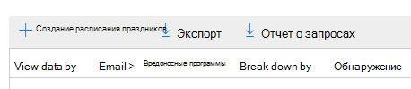
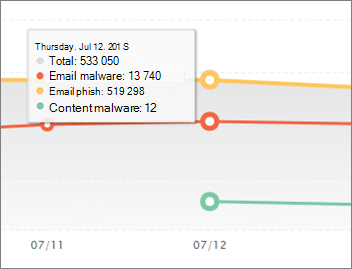
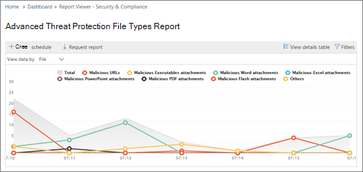
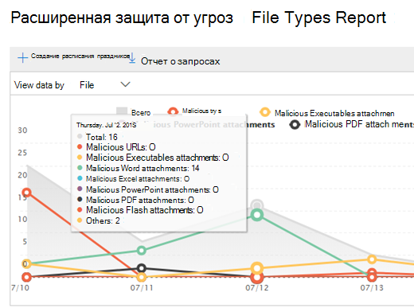

# Просмотр отчетов для Office 365 Advanced Threat protection

Если в Организации имеется [Office 365 Advanced Threat protection](office-365-atp.md) (ATP), и у вас есть [необходимые разрешения](#what-permissions-are-needed-to-view-the-atp-reports), вы можете использовать несколько отчетов ATP в центре безопасности и &amp; соответствия требованиям. (Перейдите в раздел **отчеты** \> **Панель мониторинга**.)

К отчетам ATP относятся следующие:

- [отчет о состоянии защиты от угроз](#threat-protection-status-report);
- [отчет о типах файлов ATP](#atp-file-types-report);
- [отчет о действиях с сообщениями в ATP](#atp-message-disposition-report);
- [Обнаружение или проводник в режиме реального времени](threat-explorer.md) (в зависимости от того, установлен ли для Office 365 ATP 1 (план 1) или 2)
- ... [и многое другое](#additional-reports-to-view).

В этой статье приводятся общие сведения об отчетах ATP и способах их использования.

## отчет о состоянии защиты от угроз;

Отчет **о состоянии защиты от угроз** — это единое представление, объединяющее сведения о вредоносном содержимом и вредоносных сообщениях, обнаруженных и заблокированных службой [Exchange Online Protection](exchange-online-protection-overview.md) (EOP) и [Office 365 ATP](office-365-atp.md). Этот отчет полезен для просмотра обнаружений с течением времени (до 90 дней), а также позволяет администраторам безопасности определять тенденции или определять необходимость внесения изменений в политики.

В отчете представлено общее количество уникальных сообщений электронной почты с вредоносным содержимым, такими как файлы или адреса веб-сайтов (URL-адреса), которые были заблокированы ядром защиты от вредоносных программ, функции [автоматического очистки (ZAP)](zero-hour-auto-purge.md)и ATP, такие как [безопасные ссылки](atp-safe-links.md)ATP, [безопасные вложения ATP](atp-safe-attachments.md)и [антифишинговые](set-up-anti-phishing-policies.md)функции ATP.

Фильтры и разбиения данных позволяют более детально классифицировать информацию, приведенную в этом отчете. В частности, есть меню "разбивка по", включенное для просмотров **электронной почты** \> **Phish** и **Email** \> **вредоносных программ**электронной почты. Данные будут разбиты на следующие компоненты:

|||
|---|---|
|По типу политики|Какая политика позволила бы перехватывать эти угрозы?|
|По технологии обнаружения|Какова базовая технология Майкрософт, которая перехватила угрозу?|
|По состоянию доставки|Каково Последнее состояние доставки сообщений электронной почты, обнаруженных как угрозы?|
|

> [!TIP]
> Электронная почта > фишинг | Представления вредоносных программ имеют детализированные разбивки на отображаемые технологии обнаружения, а также такие категории, как *репутация файлов, генерируемые atpми*, *файлы детонации*, *URL-адреса детонации*, *Защита от подделки: DMARC сбой*, например, полезные сведения о том, какой компонент в вашей организации перехватывает угрозы.

В этих представлениях можно экспортировать с помощью нажатия кнопки (в phishing- **Email** \> **атаках**электронной **Email** почты, \> **вредоносных программ**и **контентных** \> **вредоносных** программ). Объединенные данные, экспортированные на компьютер, можно открыть в Excel.

> [!NOTE]
> Максимальное число записей, которые можно экспортировать для **фишинга** и **вредоносных программ** , находится в разделе 10000. При экспорте представления экспортируются только самые последние записи 10000. В экспортированных данных столбец _число сообщений_ представляет количество сообщений, обнаруженных технологией обнаружения и типом политики.    

В представлениях "Обзор" и "Электронная почта" отображаются данные в течение часов обработки, а не через 24 часа (требование повтора. При увеличении скорости получается сигнал очистки.

> [!NOTE]
> Отчет о состоянии защиты от угроз доступен клиентам, у которых есть [Office 365 ATP](office-365-atp.md) или [Exchange Online Protection](exchange-online-protection-overview.md)(EOP); Однако сведения, отображаемые в отчете о состоянии защиты от угроз для клиентов ATP, скорее всего, будут содержать данные, отличные от данных, которые могут видеть пользователи EOP. Например, отчет о состоянии защиты от угроз для клиентов ATP будет содержать сведения о [вредоносных файлах, обнаруженных в SharePoint Online, OneDrive или Microsoft Teams](atp-for-spo-odb-and-teams.md). Такие сведения относятся к ATP, поэтому клиенты, у которых есть EOP, но не ATP, не увидят эти сведения в отчете о состоянии защиты от угроз.

Чтобы просмотреть отчет о состоянии защиты от угроз, в [центре безопасности и &amp; соответствия требованиям](https://protection.office.com)выберите **Reports** \> **Dashboard** \> **состояние защиты от угроз**для отчетов.

Чтобы получить подробные сведения о состоянии дня, наведите указатель на диаграмму.

По умолчанию в отчете о состоянии защиты от угроз отображаются данные за прошедшие семь дней. Тем не менее, вы можете выбрать **фильтры** и изменить диапазон дат для просмотра данных в течение до 90 дней для представления "Статистическое представление" и 30 дней для подробного представления. (Если вы используете пробную подписку, вы можете использовать не более 30 дней данных.)

Вы также можете использовать меню **Просмотр данных,** чтобы изменить сведения, отображаемые в отчете.

## Отчет о состоянии защиты URL-адресов

В этом отчете собраны данные на основе данных, и обнаружены угрозы для каждого щелчка (в то время как большинство других отчетов по электронной почте относятся к данным одного сообщения). Этот отчет предназначен для отображения угроз, которые поступают из гиперссылок в сообщениях электронной почты и документы по щелчку. Существует два представления:

|||
|---|---|
|Действие по защите URL-адресов|Просмотр числа заблокированных, заблокированных, заблокированных и переопределяемых пользователями URL-адресов, которые переопределяются с помощью команды "нажми" и разрешены пользователем.|
|URL-адрес щелчка по приложению|Просмотрите приложение, из которого был выбран URL-адрес.|
|

В таблице сведения вы сможете просмотреть дополнительные сведения о времени и сведениях о пользователях. Наконец, обратите внимание, что в отчете о состоянии защиты URL-адресов отображается функция защиты от безопасных ссылок ATP, поэтому для пользователей с включенными безопасными ссылками на ATP будут отображаться данные, отраженные в этом отчете.

> [!NOTE]
> Это отчет по *тенденциям защиты*, то есть данные представляют тенденции в более крупном наборе данных. В результате данные в статистическом представлении не доступны в режиме реального времени, но данные в представлении таблицы сведений имеют значение, поэтому вы можете увидеть небольшое расхождение между двумя представлениями.

## отчет о типах файлов ATP;

В отчете " **типы файлов ATP** " отображаются типы файлов, обнаруженных в качестве вредоносных при [безопасном вложении ATP](atp-safe-attachments.md).

Чтобы просмотреть этот отчет, в [центре безопасности и &amp; соответствия требованиям](https://protection.office.com)перейдите к **Reports** \> типам файлов **панели мониторинга** отчетов \> **ATP**.

  
Если навести указатель мыши на определенный день, можно увидеть разбивку типов вредоносных файлов, обнаруженных [безопасными вложениями ATP](atp-safe-attachments.md) и [ &amp; защитой от нежелательной почты](anti-spam-and-anti-malware-protection.md). Сводное представление отчета поддерживает 90 дней фильтрации, в то время как в подробном представлении допускается не более десяти дней фильтрации. 
  

## отчет о действиях с сообщениями в ATP;

В отчете об **ликвидации сообщений ATP** отображаются действия, предпринятые для сообщений электронной почты, которые были обнаружены как вредоносный контент.

Чтобы просмотреть этот отчет, в [центре безопасности и &amp; соответствия требованиям](https://protection.office.com)перейдите к разделу **Reports** \> **панель мониторинга** отчетов \> **ATP Message Disposition**.

При наведении указателя мыши на полоску на диаграмме можно просмотреть, какие действия были предприняты для обнаруженных сообщений электронной почты в этот день.

## Дополнительные отчеты для просмотра

Помимо отчетов ATP, описанных в этой статье, доступны некоторые другие отчеты, описанные в следующей таблице.

|||
|---|---|
|**Отчет (ы)**|**Сведения**|
|**Проводника** или **Обнаружение в режиме реального времени**: (Office 365 ATP, план 2, у пользователей есть Explorer; Пользователи Office 365 ATP 1 (план 1) имеют обнаружение в режиме реального времени.)|[Обозреватель угроз (и обнаружение в режиме реального времени)](threat-explorer.md)|
|**Отчеты о безопасности электронной почты**, например отчет о самых отправителях и получателях, отчет о поддельной почте и отчет об обнаружении нежелательной почты.|[Просмотр отчетов о безопасности электронной почты в &amp; центре безопасности и соответствия требованиям](view-email-security-reports.md)|
|**Трассировка URL-адресов для безопасных ссылок ATP**: (это отчет, созданный с помощью PowerShell.) В этом отчете представлены результаты действий безопасных ссылок ATP за прошедшие семь (7) дней.|[Справочные материалы по командлету Get – Урлтраце](https://docs.microsoft.com/powershell/module/exchange/get-urltrace)|
|**Результаты EOP и ATP**: (это настраиваемый отчет, созданный с помощью PowerShell). Этот отчет содержит такие сведения, как домен, Дата, тип события, направление, действие и количество сообщений.|[Справочные материалы по командлету Get – Маилтраффикатпрепорт](https://docs.microsoft.com/powershell/module/exchange/get-mailtrafficatpreport)|
|**Обнаружения EOP и ATP**: (это настраиваемый отчет, созданный с помощью PowerShell). Этот отчет содержит сведения о вредоносных файлах или URL-адресах, фишинговых попытках, олицетворении и других потенциальных угрозах в электронной почте или файлах.|[Справочные материалы по командлету Get – Маилдетаилатпрепорт](https://docs.microsoft.com/powershell/module/exchange/get-maildetailatpreport)|
|

## Какие разрешения необходимы для просмотра отчетов ATP?

Для просмотра и использования отчетов, описанных в этой статье, **необходимо назначить соответствующую роль для &amp; центра безопасности и центра администрирования Exchange**.

- Для &amp; центра соответствия требованиям безопасности необходимо назначить одну из следующих ролей:

  - Управление организацией
  - Администратор безопасности (это можно назначить в центре администрирования Azure Active Directory ( [https://aad.portal.azure.com](https://aad.portal.azure.com) )).
  - Оператор безопасности (это можно назначить в центре администрирования Azure Active Directory ( [https://aad.portal.azure.com](https://aad.portal.azure.com) )).
  - Читатель сведений о безопасности

- Для Exchange Online необходимо назначить одну из следующих ролей в центре администрирования Exchange ( [https://outlook.office365.com/ecp](https://outlook.office365.com/ecp) ) или с помощью командлетов PowerShell (см. [Exchange Online PowerShell](https://docs.microsoft.com/powershell/exchange/exchange-online-powershell)):

  - Управление организацией
  - Управление организацией с правами только на просмотр
  - Роль получателей с правами только на просмотр
  - Управление соответствием требованиям

Для получения дополнительных сведений ознакомьтесь с приведенными ниже ресурсами.

- [Разрешения в центре безопасности и &amp; соответствия требованиям](permissions-in-the-security-and-compliance-center.md)

- [Разрешения компонентов в Exchange Online](https://docs.microsoft.com/exchange/permissions-exo/feature-permissions)

## Что делать, если в отчетах данные не отображаются?

Если вы не видите данные в отчетах ATP, дважды проверьте правильность настройки политик. Для вашей организации должны быть определены политики [безопасных ссылок ATP](set-up-atp-safe-links-policies.md) и [политики безопасных вложений ATP](set-up-atp-safe-attachments-policies.md) для обеспечения безопасности ATP. Кроме того, вы можете увидеть [защиту от нежелательной почты и вредоносных программ в Office 365](anti-spam-and-anti-malware-protection.md).

## Связанные статьи

[Отчеты и аналитика в центре безопасности и &amp; соответствия требованиям](reports-and-insights-in-security-and-compliance.md)
  
[Разрешения ролей (Azure Active Directory](https://docs.microsoft.com/azure/active-directory/users-groups-roles/directory-assign-admin-roles#role-permissions)
