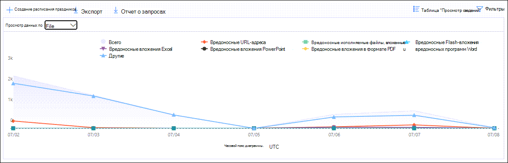

# Просмотр отчетов защитник для Office 365 в панели мониторинга отчетов в центре безопасности & соответствия требованиям

[!INCLUDE [Microsoft 365 Defender rebranding](../includes/microsoft-defender-for-office.md)]

Защитник Майкрософт для Office 365 (например, подписки 365 Microsoft для Office или защитник Майкрософт для Office 365, план 1 или защитник Microsoft для Office 365 Plan 2) содержат различные отчеты, связанные с безопасностью. Если у вас есть [необходимые разрешения](#what-permissions-are-needed-to-view-the-defender-for-office-365-reports), вы можете просмотреть эти отчеты в центре безопасности & соответствия требованиям, перейдя **Reports** на \> **панель мониторинга** отчетов. Чтобы перейти непосредственно к панели мониторинга отчетов, откройте ее <https://protection.office.com/insightdashboard> .

## Отчет о типах файлов защитника для Office 365

В отчете **Reporting Types for Office 365 Type Files Report Types (защитник для Office** ) отображается тип файлов, обнаруженных в качестве вредоносных [при наличии](atp-safe-attachments.md)

 Сводное представление отчета поддерживает 90 дней фильтрации, в то время как в подробном представлении допускается не более 10 дней фильтрации.

Чтобы просмотреть отчет, откройте [Центр безопасности & соответствия требованиям](https://protection.office.com), откройте **Reports** \> **панель мониторинга "** отчеты" и выберите **"защитник для Office 365 типы файлов"**. Чтобы перейти непосредственно к отчету, откройте его <https://protection.office.com/reportv2?id=ATPFileReport> .

> [!NOTE]
> Сведения, приведенные в этом отчете, также доступны в [отчете об ликвидации сообщений "защитник для Office 365"](#defender-for-office-365-message-disposition-report).

### Отчет по отчетам о типах файлов защитника для Office 365

Доступны следующие представления:

- **Просмотр данных: File**: диаграмма содержит следующие сведения:

  - **Вредоносные вложения Excel**
  - **Вредоносные Flash-вложения**
  - **Вредоносные вложения в формате PDF**
  - **Вредоносные вложения PowerPoint**
  - **Вредоносные URL-адреса**
  - **Вредоносные вложения Word**
  - **Вредоносные исполняемые файлы**
  - **Другие**

  Если навести указатель мыши на определенный день (точка данных), можно увидеть разбивку типов вредоносных файлов, обнаруженных [безопасными вложениями](atp-safe-attachments.md) и [защитой от вредоносных программ в EOP](anti-malware-protection.md).

  

  При нажатии кнопки **фильтры** можно изменить отчет с помощью следующих фильтров:

  - **Дата начала** и **Дата окончания**
  - Значения типов файлов, которые отображаются на диаграмме.

- **Просмотр данных по: Message**: на диаграмме представлены следующие сведения:

  - **Заблокировать доступ**
  - **Замененные сообщения**
  - **Отслеживаемые сообщения**
  - **Замещена динамической доставкой электронной почты**: Дополнительные сведения см [в разделе Динамическая доставка в политиках безопасных вложений](atp-safe-attachments.md#dynamic-delivery-in-safe-attachments-policies).

  

  При нажатии кнопки **фильтры** можно изменить отчет с помощью следующих фильтров:

  - **Дата начала** и **Дата окончания**
  - Те же значения расстановки сообщений, которые доступны на диаграмме, и дополнительные **сообщения, переданные** по значению.

### Представление таблицы сведений для отчета о типах файлов защитника для Office 365

Если вы нажмете кнопку **Просмотр сведений**, отчет предоставляет представление почти в режиме реального времени для всех щелчков, происходящих в Организации за последние 10 дней. Отображаемая информация зависит от диаграммы, которую Вы искали:

- **Просмотр данных: файл**:

  - **Date**
  - **Адрес получателя**
  - **Адрес отправителя**
  - **Идентификатор сообщения**: доступен в поле заголовка **Message — ID** в заголовке сообщения и должно быть уникальным. Пример значения: `<08f1e0f6806a47b4ac103961109ae6ef@server.domain>` (Обратите внимание на угловые скобки).
  - **File**

  При нажатии кнопки **фильтры** можно изменить отчет с помощью следующих фильтров:

  - **Дата начала** и **Дата окончания**
  - Значения типов файлов, которые отображаются на диаграмме.

- **Просмотр данных по: Message**:

  - **Date**
  - **Адрес получателя**
  - **Адрес отправителя**
  - **КОД сообщения**
  - **File**
  - **Subject**

  При нажатии кнопки **фильтры** можно изменить результаты с помощью следующих фильтров:

  - **Дата начала** и **Дата окончания**
  - Те же значения расстановки сообщений, которые доступны на диаграмме, и дополнительные **сообщения, переданные** по значению.

Чтобы вернуться к представлению отчетов, нажмите кнопку **Просмотреть отчет**.

## Отчет об ликвидации сообщений для защитника Office 365

В отчете об **ликвидации сообщений ATP** отображаются действия, предпринятые для сообщений электронной почты, которые были обнаружены как вредоносный контент.

Чтобы просмотреть отчет, откройте [Центр безопасности & соответствия требованиям](https://protection.office.com), перейдите в **Reports** \> **панель мониторинга** отчетов и выберите **защитник для Office 365 Message Disposition**. Чтобы перейти непосредственно к отчету, откройте его <https://protection.office.com/reportv2?id=ATPMessageReport> .

> [!NOTE]
> Сведения, приведенные в этом отчете, также доступны в [отчете "защитник для Office 365 типы файлов"](#defender-for-office-365-file-types-report).

### Отчет об ликвидации сообщений для защитника Office 365

Доступны следующие представления:

- **Просмотр данных по: Message**: на диаграмме представлены следующие сведения:

  - **Заблокировать доступ**
  - **Замененные сообщения**
  - **Отслеживаемые сообщения**
  - **Замещена динамической доставкой электронной почты**: Дополнительные сведения см [в разделе Динамическая доставка в политиках безопасных вложений](atp-safe-attachments.md#dynamic-delivery-in-safe-attachments-policies).

  

  При нажатии кнопки **фильтры** можно изменить отчет с помощью следующих фильтров:

  - **Дата начала** и **Дата окончания**
  - Те же значения расстановки сообщений, которые доступны на диаграмме, и дополнительные **сообщения, переданные** по значению.

- **Просмотр данных: File**: диаграмма содержит следующие сведения:

  - **Вредоносные вложения Excel**
  - **Вредоносные Flash-вложения**
  - **Вредоносные вложения в формате PDF**
  - **Вредоносные вложения PowerPoint**
  - **Вредоносные URL-адреса**
  - **Вредоносные вложения Word**
  - **Вредоносные исполняемые файлы**
  - **Другие**

  Если навести указатель мыши на определенный день (точка данных), можно увидеть разбивку типов вредоносных файлов, обнаруженных [безопасными вложениями](atp-safe-attachments.md) и [защитой от вредоносных программ в EOP](anti-malware-protection.md).

  

  При нажатии кнопки **фильтры** можно изменить отчет с помощью следующих фильтров:

  - **Дата начала** и **Дата окончания**
  - Значения типов файлов, которые отображаются на диаграмме.

### Представление таблицы сведений о защитнике для Office 365 отчет об ликвидации сообщений

Если вы нажмете кнопку **Просмотр сведений**, отчет предоставляет представление почти в режиме реального времени для всех щелчков, происходящих в Организации за последние 10 дней. Отображаемая информация зависит от диаграммы, которую Вы искали:

- **Просмотр данных по: Message**:

  - **Date**
  - **Адрес получателя**
  - **Адрес отправителя**
  - **КОД сообщения**
  - **File**
  - **Subject**

  При нажатии кнопки **фильтры** можно изменить результаты с помощью следующих фильтров:

  - **Дата начала** и **Дата окончания**
  - Те же значения расстановки сообщений, которые доступны на диаграмме, и дополнительные **сообщения, переданные** по значению.

- **Просмотр данных: файл**:

  - **Date**
  - **Адрес получателя**
  - **Адрес отправителя**
  - **КОД сообщения**
  - **File**

  При нажатии кнопки **фильтры** можно изменить отчет с помощью следующих фильтров:

  - **Дата начала** и **Дата окончания**
  - Значения типов файлов, которые отображаются на диаграмме.

Чтобы вернуться к представлению отчетов, нажмите кнопку **Просмотреть отчет**.

## Отчет о задержке почты

В **отчете о задержке почты** отображается сводное представление о доставке почты и задержках детонации в вашей организации. Время доставки почты в службе зависит от ряда факторов, и время доставки в секундах часто не является хорошим индикатором успеха или проблемы. Время медленной доставки на один день может считаться средним временем доставки в другой день или наоборот. **Отчет о задержке почты** пытается квалифицировать доставку сообщений на основе статистических данных о наблюдаемом времени доставки других сообщений:

- **50-й процентиль**: это середина времени доставки сообщений. Это значение можно считать средним временем доставки.
- **90th процентиль**: это указывает на высокую задержку доставки сообщений. Более 10% сообщений заняло больше времени, чем это значение будет доставлено.
- **99th процентиль**: указывает максимальное время ожидания доставки сообщения.

Задержка на стороне клиента и сети не включается.

Чтобы просмотреть отчет, откройте [Центр безопасности & соответствия требованиям](https://protection.office.com), перейдите в **Reports** \> **панель мониторинга** отчетов и выберите **отчет о задержке почты**. Чтобы перейти непосредственно к отчету, откройте его <https://protection.office.com/mailLatencyReport?viewid=P50> .

### Представление отчета для отчета о задержке почты

При открытии отчета по умолчанию выбирается вкладка **50 процентили** .

По умолчанию это представление содержит диаграмму, настроенную со следующими фильтрами:

- **Дата**: последние 7 дней
- **Представление сообщений**:
  - Сообщения обезврежено

На этой диаграмме показаны сообщения, упорядоченные по следующим категориям:

- **Задержка доставки почты**
- **Задержка детонации**

При наведении указателя мыши на категорию на диаграмме можно увидеть разбивку задержки в каждой категории.

Если щелкнуть **Фильтр** в представлении отчета, вы можете изменить результаты с помощью следующих фильтров:

- Все сообщения;
- Сообщения, содержащие вложения или URL-адреса

При переходе на вкладку **90th процентили** или **99th процентили** используются те же фильтры по умолчанию, что и для представления **50 процентили** .

### Представление таблицы сведений для отчета о задержке почты

В представлении Таблица сведений отображаются следующие сведения:

- **Date**
- **Процентили**
- **Количество сообщений**
- **Общая задержка**

Приведенный выше пример показывает, что в течение 14 ноября средняя задержка, использованная для всех доставленных сообщений, и обезврежено была **108,033** секунд.

Таблица сведения содержит те же сведения, что и на каждой вкладке.

## отчет о состоянии защиты от угроз;

Отчет **о состоянии защиты от угроз** — это единое представление, объединяющее сведения о вредоносном содержимом и вредоносных сообщениях, обнаруженных и заблокированных службой [Exchange Online Protection](exchange-online-protection-overview.md) (EOP) и защитником Майкрософт для Office 365. Дополнительные сведения см. в разделе [отчет о состоянии защиты от угроз](view-email-security-reports.md#threat-protection-status-report).

## URL-адрес отчета о защите от угроз

В **отчете защита от угроз URL** представлены сводные и трендовые представления для обнаруженных угроз и действий, выполняемых с помощью URL-адресов в составе [безопасных ссылок](atp-safe-links.md). В этот отчет не будут выбраны данные о пользователях, к которым применяется политика безопасных ссылок, выбран параметр **не отслеживать нажатия пользователем** .

Чтобы просмотреть отчет, откройте [Центр безопасности & соответствия требованиям](https://protection.office.com), перейдите в **Reports** \> **панель мониторинга** отчетов и выберите **отчет по защите URL-адресов**. Чтобы перейти непосредственно к отчету, откройте его <https://protection.office.com/reportv2?id=URLProtectionActionReport> .

> [!NOTE]
> Это отчет по *тенденциям защиты*, то есть данные представляют тенденции в более крупном наборе данных. В результате данные в статистическом представлении не доступны в режиме реального времени, но данные в представлении таблицы сведений имеют значение, поэтому вы можете увидеть небольшое расхождение между двумя представлениями.

### Представление отчета по URL-адресу отчета по защите от угроз

В отчете по **защите от угроз URL-адресов** имеется два агрегированных представления, которые обновляются каждые четыре часа, в которых отображаются данные за последние 90 дней:

- **URL-адрес щелкните действие защиты**: показывает количество щелчков по пользователям в Организации, а также результаты щелчка мыши:

  - **Заблокировано** (пользователь заблокирован для перехода по URL-адресу)
  - **Заблокировано и нажато**
  - **Переход по нажатию во время сканирования**

  Щелчок указывает на то, что пользователь выбрал страницу блокировки на вредоносный веб-сайт (администраторы могут отключить функцию "щелкать" в разделе политики безопасных ссылок).

  При нажатии кнопки **фильтры** можно изменить отчет с помощью следующих фильтров:

  - **Дата начала** и **Дата окончания**
  - Доступные действия по защите от щелчка, а также **разрешенное** значение (пользователю разрешено переходить по URL-адресу).

  

- **URL-адрес щелкните по приложению**: показывает число щелчков URL-адресов в приложениях, поддерживающих безопасные ссылки:

  - **Клиент электронной почты**
  - **PowerPoint**
  - **Word**
  - **Excel**
  - **OneNote**
  - **Visio**
  - **Teams**
  - **Other**

  При нажатии кнопки **фильтры** можно изменить отчет с помощью следующих фильтров:

  - **Дата начала** и **Дата окончания**
  - Доступные приложения.

### Представление таблицы сведений об URL-адресе защиты от угроз

Если вы нажмете кнопку **Просмотр сведений**, отчет предоставляет представление почти в режиме реального времени для всех щелчков в Организации за последние 7 дней со следующими сведениями:

- **Щелкните время**
- **Пользователь**
- **URL-адрес**
- **Действие**
- **Программы**

Если щелкнуть **фильтры** в представлении Таблица сведений, можно отфильтровать по тем же критериям, что и в представлении отчета, а также по **доменам** или **получателям** , разделенным запятыми.

Чтобы вернуться к представлению отчетов, нажмите кнопку **Просмотреть отчет**.

## Дополнительные отчеты для просмотра

Помимо отчетов, описанных в этом разделе, доступны некоторые другие отчеты, как описано в следующей таблице.

****

|Отчет|Тема|
|---|---|
|**Explorer** (Microsoft Defender для Office 365, план 2) или **Обнаружение в режиме реального времени** (защитник Майкрософт для Office 365, план 1)|[Обозреватель угроз (и обнаружение в режиме реального времени)](threat-explorer.md)|
|**Отчеты о безопасности электронной почты**, например отчет о самых отправителях и получателях, отчет о поддельной почте и обнаружение нежелательной почты.|[Просмотр отчетов о безопасности почты в Центре безопасности и соответствия требованиям](view-email-security-reports.md)|
|**Отчеты о движении по почте**, например отчет о перенаправлении, отчет о состоянии Mailflow и отчеты верхнего отправителя и получателей.|[Просмотр отчетов о движении по почте в центре безопасности & соответствия требованиям](view-mail-flow-reports.md)|
|**Трассировка URL-адреса для безопасных ссылок** (только PowerShell). Выходные данные этого командлета показывают результаты действий безопасных ссылок за предыдущие семь дней.|[Get — Урлтраце](https://docs.microsoft.com/powershell/module/exchange/get-urltrace)|
|**Почтовые трафик для EOP и защитника Майкрософт для Office 365** (только для PowerShell). Выходные данные этого командлета содержат сведения о домене, дате, типе события, направлении, действии и количестве сообщений.|[Get — Маилтраффикатпрепорт](https://docs.microsoft.com/powershell/module/exchange/get-mailtrafficatpreport)|
|**Подробные отчеты для EOP и защитника для обнаружения Office 365** (только для PowerShell). Выходные данные этого командлета содержат сведения о вредоносных файлах или URL-адресах, фишинговых попытках, олицетворении и других потенциальных угрозах в электронной почте или файлах.|[Get — Маилдетаилатпрепорт](https://docs.microsoft.com/powershell/module/exchange/get-maildetailatpreport)|
|

## Какие разрешения необходимы для просмотра отчетов защитника для Office 365?

Для просмотра и использования отчетов, описанных в этом разделе, необходимо быть участником одной из следующих групп ролей в центре безопасности & соответствия требованиям:

- **Управление организацией**
- **Администратор безопасности**
- **Средство чтения безопасности**
- **Глобальный читатель**

Дополнительные сведения см. в статье [Разрешения в Центре безопасности и соответствия требованиям](permissions-in-the-security-and-compliance-center.md).

**Примечание**: при добавлении пользователей в соответствующую роль Azure Active Directory в центре администрирования Microsoft 365 пользователям предоставляются необходимые разрешения в центре безопасности & соответствия требованиям _и_ разрешениях для других функций в Microsoft 365. Дополнительные сведения см. в статье [О ролях администраторов](https://docs.microsoft.com/microsoft-365/admin/add-users/about-admin-roles).

## Что делать, если в отчетах данные не отображаются?

Если вы не видите данные в отчете "защитник для Office 365", проверьте правильность настройки политик. Организация должна иметь политики безопасных [ссылок](set-up-atp-safe-links-policies.md) и [политики безопасных вложений](set-up-atp-safe-attachments-policies.md) , определенные для обеспечения защиты от защитника Office 365. Кроме того, вы можете увидеть [защиту от нежелательной почты и вредоносных программ](anti-spam-and-anti-malware-protection.md).

## Статьи по теме

[Интеллектуальные отчеты и аналитика в Центре безопасности и соответствия требованиям](reports-and-insights-in-security-and-compliance.md)
  
[Разрешения ролей (Azure Active Directory](https://docs.microsoft.com/azure/active-directory/users-groups-roles/directory-assign-admin-roles#role-permissions)
