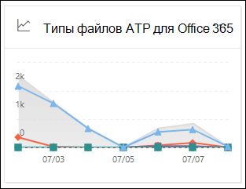
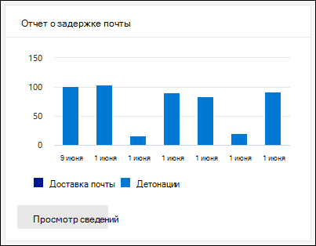

# Просмотр отчетов Defender для Office 365 на панели мониторинга отчетов в Центре & соответствия требованиямView Defender for Office 365 reports in the Reports dashboard in the Security & Compliance Center

[!INCLUDE [Microsoft 365 Defender rebranding](../includes/microsoft-defender-for-office.md)]

**Область применения****Applies to**
- [Microsoft Defender для Office 365 (план 1 и план 2)Microsoft Defender for Office 365 plan 1 and plan 2](office-365-atp.md)
- [Microsoft 365 DefenderMicrosoft 365 Defender](../mtp/microsoft-threat-protection.md)

Microsoft Defender для организаций Office 365 (например, подписки Microsoft 365 E5 или Microsoft Defender для Office 365 Plan 1 или Microsoft Defender для Office 365 Plan 2) содержат различные отчеты, связанные с безопасностью.Microsoft Defender for Office 365 organizations (for example, Microsoft 365 E5 subscriptions or Microsoft Defender for Office 365 Plan 1 or Microsoft Defender for Office 365 Plan 2 add-ons) contain a variety of security-related reports. Если у вас есть [необходимые](#what-permissions-are-needed-to-view-the-defender-for-office-365-reports)разрешения, вы можете просмотреть эти отчеты в Центре & безопасности, переехав на панель **мониторинга** \> **отчетов.**If you have the [necessary permissions](#what-permissions-are-needed-to-view-the-defender-for-office-365-reports), you can view these reports in the Security & Compliance Center by going to **Reports** \> **Dashboard**. Чтобы перейти непосредственно к панели мониторинга Отчетов, откройте <https://protection.office.com/insightdashboard> .To go directly to the Reports dashboard, open <https://protection.office.com/insightdashboard>.

## отчет о типах файлов Defender для Office 365;Defender for Office 365 file types report

Отчет **о типах файлов Defender для Office 365** показывает тип файлов, обнаруженных в качестве вредоносных с помощью [безопасных вложений.](atp-safe-attachments.md)The **Defender for Office 365 file types report** report shows you the type of files detected as malicious by [Safe Attachments](atp-safe-attachments.md).

 Совокупное представление отчета позволяет фильтровать в течение 90 дней, в то время как представление детализации позволяет фильтровать только 10 дней.The aggregate view of the report allows for 90 days of filtering, while the detail view only allows for 10 days of filtering.

Чтобы просмотреть отчет, откройте центр [&](https://protection.office.com)безопасности,  перейдите к панели мониторинга отчетов и выберите типы файлов Defender для \>  **Office 365.**To view the report, open the [Security & Compliance Center](https://protection.office.com), go to **Reports** \> **Dashboard** and select **Defender for Office 365 file types**. Чтобы перейти непосредственно к отчету, откройте <https://protection.office.com/reportv2?id=ATPFileReport> .To go directly to the report, open <https://protection.office.com/reportv2?id=ATPFileReport>.

> [!NOTE]
> Сведения в этом отчете также доступны в отчете о диспозиции [сообщений Defender for Office 365.](#defender-for-office-365-message-disposition-report)The information in this report is also available in the [Defender for Office 365 message disposition report](#defender-for-office-365-message-disposition-report).

### Представление отчета для отчета типов файлов Defender для Office 365Report view for the Defender for Office 365 file types report

Доступны следующие представления:The following views are available:

- **Просмотр данных по: Файл**: Диаграмма содержит следующую информацию:**View data by: File**: The chart contains the following information:

  - **Вредоносные вложения Excel****Malicious Excel attachments**
  - **Вредоносные flash-вложения****Malicious Flash attachments**
  - **Вредоносные вложения PDF****Malicious PDF attachments**
  - **Вредоносные вложения PowerPoint****Malicious PowerPoint attachments**
  - **Вредоносные URL-адреса****Malicious URLs**
  - **Вредоносные вложения Word****Malicious Word attachments**
  - **Вредоносные исполняемые вложения****Malicious executable attachments**
  - **Другие****Others**

  При наведении в течение определенного дня (точки данных) можно увидеть разбивку типов вредоносных файлов, обнаруженных в EOP с помощью безопасных вложений и защиты от вредоносных [программ.](anti-malware-protection.md) When you hover over a particular day (data point), you can see the breakdown of types of malicious files that were detected by [Safe Attachments](atp-safe-attachments.md) and [anti-malware protection in EOP](anti-malware-protection.md).

  

  При **нажатии фильтров** можно изменить отчет с помощью следующих фильтров:If you click **Filters**, you can modify the report with the following filters:

  - **Дата начала и** **дата окончания****Start date** and **End date**
  - Те же значения типа файлов, которые видны на диаграмме.The same file type values that are visible in the chart.

- **Просмотр данных по: Сообщение:** диаграмма содержит следующую информацию:**View data by: Message**: The chart contains the following information:

  - **Заблокировать доступ****Block access**
  - **Заменены сообщения****Messages replaced**
  - **Мониторинг сообщений****Messages monitored**
  - **Заменено динамической доставкой** электронной почты. Дополнительные сведения см. в приложении [Dynamic Delivery in Safe Attachments policies.](atp-safe-attachments.md#dynamic-delivery-in-safe-attachments-policies)**Replaced by Dynamic Email Delivery**: For more information, see [Dynamic Delivery in Safe Attachments policies](atp-safe-attachments.md#dynamic-delivery-in-safe-attachments-policies).

  

  При **нажатии фильтров** можно изменить отчет с помощью следующих фильтров:If you click **Filters**, you can modify the report with the following filters:

  - **Дата начала и** **дата окончания****Start date** and **End date**
  - Те же значения диспозиции сообщений, которые доступны на диаграмме, и дополнительные значения **сообщений.**The same message disposition values that are available in the chart, and the additional **Messages passed** value.

### Представление таблицы сведений для отчета типов файлов Defender для Office 365Details table view for the Defender for Office 365 file types report

Если щелкнуть таблицу **Просмотр** сведений, в отчете предоставляется представление в режиме почти реального времени всех щелчков, которые происходят в организации за последние 10 дней.If you click **View details table**, the report provides a near-real-time view of all clicks that happen within the organization for the last 10 days. Показанные сведения зависят от диаграммы, которую вы искали:The information that's shown depends on the chart you were looking at:

- **Просмотр данных по: Файл**:**View data by: File**:

  - **Дата****Date**
  - **Адрес получателя****Recipient address**
  - **Адрес отправителя****Sender address**
  - **ID сообщения.** Доступно в **поле заглавной области Message-ID** в загонах сообщений и должно быть уникальным.**Message ID**: Available in the **Message-ID** header field in the message header and should be unique. Например, значение `<08f1e0f6806a47b4ac103961109ae6ef@server.domain>` (обратите внимание на угловые скобки).An example value is `<08f1e0f6806a47b4ac103961109ae6ef@server.domain>` (note the angle brackets).
  - **File****File**

  При **нажатии фильтров** можно изменить отчет с помощью следующих фильтров:If you click **Filters**, you can modify the report with the following filters:

  - **Дата начала и** **дата окончания****Start date** and **End date**
  - Те же значения типа файлов, которые видны на диаграмме.The same file type values that are visible in the chart.

- **Просмотр данных по: Сообщение**:**View data by: Message**:

  - **Дата****Date**
  - **Адрес получателя****Recipient address**
  - **Адрес отправителя****Sender address**
  - **КОД сообщения****Message ID**
  - **File****File**
  - **Тема****Subject**

  При **нажатии фильтров** можно изменить результаты с помощью следующих фильтров:If you click **Filters**, you can modify the results with the following filters:

  - **Дата начала и** **дата окончания****Start date** and **End date**
  - Те же значения диспозиции сообщений, которые доступны на диаграмме, и дополнительные значения **сообщений.**The same message disposition values that are available in the chart, and the additional **Messages passed** value.

Чтобы вернуться к представлению отчетов, нажмите **кнопку Просмотр отчета**.To get back to the reports view, click **View report**.

## отчет о действиях с сообщениями в Defender для Office 365Defender for Office 365 message disposition report

В **отчете о диспозиции** сообщений ATP показаны действия, принятые для сообщений электронной почты, которые были обнаружены как вредоносные содержимые.The **ATP Message Disposition** report shows you the actions that were taken for email messages that were detected as having malicious content.

Чтобы просмотреть отчет, откройте центр & безопасности,  [перейдите к](https://protection.office.com)панели мониторинга отчетов и выберите расположение сообщений \>  Defender для **Office 365.**To view the report, open the [Security & Compliance Center](https://protection.office.com), go to **Reports** \> **Dashboard** and select **Defender for Office 365 message disposition**. Чтобы перейти непосредственно к отчету, откройте <https://protection.office.com/reportv2?id=ATPMessageReport> .To go directly to the report, open <https://protection.office.com/reportv2?id=ATPMessageReport>.

> [!NOTE]
> Сведения в этом отчете также доступны в отчете о типах файлов [Defender для Office 365.](#defender-for-office-365-file-types-report)The information in this report is also available in the [Defender for Office 365 file types report](#defender-for-office-365-file-types-report).

### Представление отчета для отчета о диспозиции сообщения Defender для Office 365Report view for the Defender for Office 365 message disposition report

Доступны следующие представления:The following views are available:

- **Просмотр данных по: Сообщение:** диаграмма содержит следующую информацию:**View data by: Message**: The chart contains the following information:

  - **Заблокировать доступ****Block access**
  - **Заменены сообщения****Messages replaced**
  - **Мониторинг сообщений****Messages monitored**
  - **Заменено динамической доставкой** электронной почты. Дополнительные сведения см. в приложении [Dynamic Delivery in Safe Attachments policies.](atp-safe-attachments.md#dynamic-delivery-in-safe-attachments-policies)**Replaced by Dynamic Email Delivery**: For more information, see [Dynamic Delivery in Safe Attachments policies](atp-safe-attachments.md#dynamic-delivery-in-safe-attachments-policies).

  

  При **нажатии фильтров** можно изменить отчет с помощью следующих фильтров:If you click **Filters**, you can modify the report with the following filters:

  - **Дата начала и** **дата окончания****Start date** and **End date**
  - Те же значения диспозиции сообщений, которые доступны на диаграмме, и дополнительные значения **сообщений.**The same message disposition values that are available in the chart, and the additional **Messages passed** value.

- **Просмотр данных по: Файл**: Диаграмма содержит следующую информацию:**View data by: File**: The chart contains the following information:

  - **Вредоносные вложения Excel****Malicious Excel attachments**
  - **Вредоносные flash-вложения****Malicious Flash attachments**
  - **Вредоносные вложения PDF****Malicious PDF attachments**
  - **Вредоносные вложения PowerPoint****Malicious PowerPoint attachments**
  - **Вредоносные URL-адреса****Malicious URLs**
  - **Вредоносные вложения Word****Malicious Word attachments**
  - **Вредоносные исполняемые вложения****Malicious executable attachments**
  - **Другие****Others**

  При наведении в течение определенного дня (точки данных) можно увидеть разбивку типов вредоносных файлов, обнаруженных в EOP с помощью безопасных вложений и защиты от вредоносных [программ.](anti-malware-protection.md) When you hover over a particular day (data point), you can see the breakdown of types of malicious files that were detected by [Safe Attachments](atp-safe-attachments.md) and [anti-malware protection in EOP](anti-malware-protection.md).

  

  При **нажатии фильтров** можно изменить отчет с помощью следующих фильтров:If you click **Filters**, you can modify the report with the following filters:

  - **Дата начала и** **дата окончания****Start date** and **End date**
  - Те же значения типа файлов, которые видны на диаграмме.The same file type values that are visible in the chart.

### Представление таблицы сведений для отчета о диспозиции сообщений Defender для Office 365Details table view for the Defender for Office 365 message disposition report

Если щелкнуть таблицу **Просмотр** сведений, в отчете предоставляется представление в режиме почти реального времени всех щелчков, которые происходят в организации за последние 10 дней.If you click **View details table**, the report provides a near-real-time view of all clicks that happen within the organization for the last 10 days. Показанные сведения зависят от диаграммы, которую вы искали:The information that's shown depends on the chart you were looking at:

- **Просмотр данных по: Сообщение**:**View data by: Message**:

  - **Дата****Date**
  - **Адрес получателя****Recipient address**
  - **Адрес отправителя****Sender address**
  - **КОД сообщения****Message ID**
  - **File****File**
  - **Тема****Subject**

  При **нажатии фильтров** можно изменить результаты с помощью следующих фильтров:If you click **Filters**, you can modify the results with the following filters:

  - **Дата начала и** **дата окончания****Start date** and **End date**
  - Те же значения диспозиции сообщений, которые доступны на диаграмме, и дополнительные значения **сообщений.**The same message disposition values that are available in the chart, and the additional **Messages passed** value.

- **Просмотр данных по: Файл**:**View data by: File**:

  - **Дата****Date**
  - **Адрес получателя****Recipient address**
  - **Адрес отправителя****Sender address**
  - **КОД сообщения****Message ID**
  - **File****File**

  При **нажатии фильтров** можно изменить отчет с помощью следующих фильтров:If you click **Filters**, you can modify the report with the following filters:

  - **Дата начала и** **дата окончания****Start date** and **End date**
  - Те же значения типа файлов, которые видны на диаграмме.The same file type values that are visible in the chart.

Чтобы вернуться к представлению отчетов, нажмите **кнопку Просмотр отчета**.To get back to the reports view, click **View report**.

## Отчет о задержке почтыMail latency report

В **отчете о задержке** почты показано совокупное представление задержки доставки почты и детонации в организации.The **Mail latency report** shows you an aggregate view of the mail delivery and detonation latency experienced within your organization. Время доставки почты в службе зависит от ряда факторов, и абсолютное время доставки в секундах часто не является хорошим показателем успешности или проблемы.Mail delivery times in the service are affected by a number of factors, and the absolute delivery time in seconds is often not a good indicator of success or a problem. Медленное время доставки в один день можно считать средним временем доставки в другой день или наоборот.A slow delivery time on one day might be considered an average delivery time on another day, or vice-versa. Отчет **о задержке** почты пытается квалифицировать доставку сообщений на основе статистических данных о наблюдаемом времени доставки других сообщений:The **Mail latency report** tries to qualify message delivery based on statistical data about the observed delivery times of other messages:

- **50-й процентиль.** Это среднее время доставки сообщений.**50th percentile**: This is the middle for message delivery times. Это значение можно рассматривать как среднее время доставки.You can consider this value as an average delivery time.
- **90-й процентиль.** Это указывает на высокую задержку доставки сообщений.**90th percentile**: This indicates a high latency for message delivery. Только 10% сообщений занимает больше времени, чем это значение для доставки.Only 10% of messages took longer than this value to deliver.
- **99-й процентиль.** Это указывает на наивысшую задержку доставки сообщений.**99th percentile**: This indicates the highest latency for message delivery.

Клиентская сторона и задержка сети не включаются.Client side and network latency are not included.

Чтобы просмотреть отчет, откройте центр [&](https://protection.office.com)безопасности,  перейдите к панели мониторинга отчетов и выберите отчет о задержке \>  **почты.**To view the report, open the [Security & Compliance Center](https://protection.office.com), go to **Reports** \> **Dashboard** and select **Mail latency report**. Чтобы перейти непосредственно к отчету, откройте <https://protection.office.com/mailLatencyReport?viewid=P50> .To go directly to the report, open <https://protection.office.com/mailLatencyReport?viewid=P50>.

### Представление отчета для отчета о задержке почтыReport view for the Mail latency report

При открывании отчета по умолчанию выбирается вкладка **50-й** процентили.When you open the report, the **50th percentiles** tab is selected by default.

По умолчанию это представление содержит диаграмму, настроенную с помощью следующих фильтров:By default, this view contains a chart that's configured with the following filters:

- **Дата:** последние 7 дней**Date**: The last 7 days
- **Просмотр сообщений:****Message View**:
  - Взорванные сообщенияDetonated messages

На этой диаграмме показаны сообщения, организованные в следующие категории:This chart shows messages organized into the following categories:

- **Задержка доставки почты****Mail delivery latency**
- **Задержка детонации****Detonation latency**

При наведении над категорией на диаграмме можно увидеть разбивку задержки в каждой категории.When you hover over a category in the chart, you can see a breakdown of the latency in each category.

При **нажатии фильтра** в представлении отчета можно изменить результаты с помощью следующих фильтров:If you click **Filter** in the report view, you can modify the results with the following filters:

- Все сообщения;All messages
- Сообщения, содержащие вложения или URL-адресаMessages that contain attachments or URLs

Если щелкнуть **вкладку 90-й** процентили или **вкладку 99-й** процентили, используются те же фильтры по умолчанию из представления **50-го** процентиля.If you click the **90th percentiles** tab or the **99th percentiles** tab, the same default filters from the **50th percentiles** view are used.

### Представление таблицы сведений для отчета о задержке почтыDetails table view for the Mail latency report

В представлении таблицы сведений показаны следующие сведения:The following information is shown in the details table view:

- **Дата****Date**
- **Percentiles****Percentiles**
- **Количество сообщений****Message count**
- **Общая задержка****Overall latency**

Выше показано, что 14 ноября средняя задержка для всех сообщений, доставленных и взорванных, была **108,033** секунды.The above shows that on November 14 the average latency experienced for all messages delivered and detonated was **108.033** seconds.

Таблица сведений содержит одинаковые сведения на каждой вкладке.The details table contains the same information on each tab.

## отчет о состоянии защиты от угроз;Threat protection status report

Отчет **о состоянии** защиты от угроз представляет собой одно представление, которое объединяет сведения о вредоносном контенте и вредоносной электронной почте, обнаруженной и заблокированной Exchange Online [Protection](exchange-online-protection-overview.md) (EOP) и Microsoft Defender для Office 365.The **Threat protection status** report is a single view that brings together information about malicious content and malicious email detected and blocked by [Exchange Online Protection](exchange-online-protection-overview.md) (EOP) and Microsoft Defender for Office 365. Дополнительные сведения см. в [отчете о состоянии защиты от угроз.](view-email-security-reports.md#threat-protection-status-report)For more information, see [Threat protection status report](view-email-security-reports.md#threat-protection-status-report).

## Отчет об угрозе URL-адресаURL threat protection report

В **отчете об угрозе** URL-адресов содержится сводка и представления тенденций для обнаруженных угроз и действий, принятых на щелчках URL-адресов в составе [безопасных ссылок.](atp-safe-links.md)The **URL threat protection report** provides summary and trend views for threats detected and actions taken on URL clicks as part of [Safe Links](atp-safe-links.md). В этом отчете не будут щелкать данные пользователей, в которых применена политика безопасных ссылок с выбранным параметром **"Не** отслеживайте щелчки пользователя".This report will not have click data from users where the Safe Links policy applied has the **Do not track user clicks** option selected.

Чтобы просмотреть отчет, откройте [центр &](https://protection.office.com)безопасности,  перейдите на панель мониторинга отчетов и выберите отчет о \>  **защите URL-адресов.**To view the report, open the [Security & Compliance Center](https://protection.office.com), go to **Reports** \> **Dashboard** and select **URL protection report**. Чтобы перейти непосредственно к отчету, откройте <https://protection.office.com/reportv2?id=URLProtectionActionReport> .To go directly to the report, open <https://protection.office.com/reportv2?id=URLProtectionActionReport>.

> [!NOTE]
> Это отчет *тенденции защиты,* то есть данные представляют тенденции в большом наборе данных.This is a *protection trend report*, meaning data represents trends in a larger dataset. В результате данные в совокупном представлении здесь недоступны в режиме реального времени, но данные в представлении таблицы сведений имеются, поэтому между этими двумя представлениями может возникнуть небольшое несоответствие.As a result, the data in the aggregate view is not available in real time here, but the data in the details table view is, so you may see a slight discrepancy between the two views.

### Представление отчета для отчета об угрозе URL-адресаReport view for the URL threat protection report

Отчет **об угрозе URL-адресов** имеет два агрегированных представления, которые обновляются один раз в четыре часа, отображая данные за последние 90 дней:The **URL threat protection** report has two aggregated views that are refreshed once every four hours that shows data for the last 90 days:

- **Действие защиты url-адресов:** показывает количество нажатий URL-адресов пользователями в организации и результаты щелчка:**URL click protection action**: Shows the number of URL clicks by users in the organization and the results of the click:

  - **Заблокировано** (пользователю было заблокировано перемещение по URL-адресу)**Blocked** (the user was blocked from navigating to the URL)
  - **Заблокировано и щелкнуть****Blocked and clicked through**
  - **Щелкнув во время сканирования****Clicked through during scan**

  Щелчком мыши указывается, что пользователь щелкнув страницу блокировки на вредоносный веб-сайт (администраторы могут отключить щелчок в политиках безопасных ссылок).A click indicates that the user has clicked through the block page to the malicious website (admins can disable click through in Safe Links policies).

  При **нажатии фильтров** можно изменить отчет с помощью следующих фильтров:If you click **Filters**, you can modify the report with the following filters:

  - **Дата начала и** **дата окончания****Start date** and **End date**
  - Доступные действия по защите щелчка, а также допустимые **значения** (пользователю было разрешено перемещаться по URL-адресу).The available click protection actions, plus the value **Allowed** (the user was allowed to navigate to the URL).

  

- **URL-адрес нажатие по** приложению: показывает количество нажатий URL-адресов приложениями, поддерживаюми безопасные ссылки:**URL click by application**: Shows the number of URL clicks by applications that support Safe Links:

  - **Клиент электронной почты****Email client**
  - **PowerPoint****PowerPoint**
  - **Word****Word**
  - **Excel****Excel**
  - **OneNote****OneNote**
  - **Visio****Visio**
  - **Teams****Teams**
  - **Other****Other**

  При **нажатии фильтров** можно изменить отчет с помощью следующих фильтров:If you click **Filters**, you can modify the report with the following filters:

  - **Дата начала и** **дата окончания****Start date** and **End date**
  - Доступные приложения.The available applications.

### Представление таблицы сведений для отчета об угрозе URL-адресаDetails table view for the URL threat protection report

Если вы **щелкните** таблицу Просмотр сведений, в отчете предоставляется представление в режиме почти реального времени всех щелчков, которые происходят в организации в течение последних 7 дней со следующими сведениями:If you click **View details table**, the report provides a near-real-time view of all clicks that happen within the organization for the last 7 days with the following details:

- **Время щелчка****Click time**
- **User****User**
- **URL-адрес****URL**
- **Действие****Action**
- **Приложение****App**

Если щелкнуть **фильтры** в представлении таблицы сведений, можно фильтровать по  тем  же критериям, что и в представлении отчета, а также по доменам или получателям, разделенным запятой.If you click **Filters** in the details table view, you can filter by the same criteria as in the report view, and also by **Domains** or **Recipients** separated by commas.

> [!NOTE]
> Фильтр **доменов** относится к домену URL-адресов, перечисленным в результатах отчета.The **Domains** filter refers to the URL domain listed in the report results. 

Чтобы вернуться к представлению отчетов, нажмите **кнопку Просмотр отчета**.To get back to the reports view, click **View report**.

## Дополнительные отчеты для просмотраAdditional reports to view

Помимо отчетов, описанных в этой статье, доступны еще несколько отчетов, описанных в следующей таблице:In addition to the reports described in this article, several other reports are available, as described in the following table:

****

|ОтчетReport|ТемаTopic|
|---|---|
|**Explorer** (Microsoft Defender for Office 365 Plan 2) или обнаружения в режиме реального времени **(Microsoft** Defender для Office 365 Plan 1)**Explorer** (Microsoft Defender for Office 365 Plan 2) or **real-time detections** (Microsoft Defender for Office 365 Plan 1)|[Обозреватель угроз (и обнаружение в режиме реального времени)Threat Explorer (and real-time detections)](threat-explorer.md)|
|**Отчеты о безопасности** электронной почты, такие как отчеты о главных отправителей и получателях, почтовый отчет Spoof и отчет о обнаружениях нежелательной почты.**Email security reports**, such as the Top senders and recipients report, the Spoof mail report, and the Spam detections report.|[Просмотр отчетов о безопасности почты в Центре безопасности и соответствия требованиямView email security reports in the Security & Compliance Center](view-email-security-reports.md)|
|**Отчеты о потоке** почты, такие как отчет о перенаправе, отчет о состоянии почтового потока и отчет о главных отправителей и получателях.**Mail flow reports**, such as the Forwarding report, the Mailflow status report, and the Top senders and recipients report.|[Просмотр отчетов о потоке почты в центре & безопасностиView mail flow reports in the Security & Compliance Center](view-mail-flow-reports.md)|
|**Трассировка URL-адресов для безопасных ссылок** (только PowerShell).**URL trace for Safe Links** (PowerShell only). На выходе этого комлета показаны результаты действий "Безопасные ссылки" за последние семь дней.The output of this cmdlet shows you the results of Safe Links actions over the past seven days.|[Get-UrlTraceGet-UrlTrace](/powershell/module/exchange/get-urltrace)|
|**Результаты трафика почты для EOP и Microsoft Defender для Office 365** (только PowerShell).**Mail traffic results for EOP and Microsoft Defender for Office 365** (PowerShell only). Выход этого комлета содержит сведения о домене, дате, типе события, направлении, действии и графе сообщений.The output of this cmdlet contains information about Domain, Date, Event Type, Direction, Action, and Message Count.|[Get-MailTrafficATPReportGet-MailTrafficATPReport](/powershell/module/exchange/get-mailtrafficatpreport)|
|**Отчеты о подробностях почты для обнаружения EOP и Defender для Office 365** (только PowerShell).**Mail detail reports for EOP and Defender for Office 365 detections** (PowerShell only). Выход этого комлета содержит сведения о вредоносных файлах или URL-адресах, попытках фишинга, обезличив себя и других потенциальных угрозах в электронной почте или файлах.The output of this cmdlet contains details about malicious files or URLs, phishing attempts, impersonation, and other potential threats in email or files.|[Get-MailDetailATPReportGet-MailDetailATPReport](/powershell/module/exchange/get-maildetailatpreport)|
|

## Какие разрешения необходимы для просмотра отчетов Defender для Office 365?What permissions are needed to view the Defender for Office 365 reports?

Чтобы просмотреть и использовать отчеты, описанные в этой статье, необходимо быть членом одной из следующих групп ролей в Центре & безопасности:In order to view and use the reports described in this article, you need to be a member of one of the following role groups in the Security & Compliance Center:

- **Управление организацией****Organization Management**
- **Администратор безопасности****Security Administrator**
- **Считыватель безопасности****Security Reader**
- **Глобальный читатель****Global Reader**

Дополнительные сведения см. в статье [Разрешения в Центре безопасности и соответствия требованиям](permissions-in-the-security-and-compliance-center.md).For more information, see [Permissions in the Security & Compliance Center](permissions-in-the-security-and-compliance-center.md).

**Примечание.** Добавление пользователей к соответствующей роли Azure Active Directory в центре администрирования Microsoft 365 предоставляет  пользователям необходимые разрешения в Центре соответствия требованиям & безопасности и разрешения для других функций в Microsoft 365.**Note**: Adding users to the corresponding Azure Active Directory role in the Microsoft 365 admin center gives users the required permissions in the Security & Compliance Center _and_ permissions for other features in Microsoft 365. Дополнительные сведения см. в статье [О ролях администраторов](../../admin/add-users/about-admin-roles.md).For more information, see [About admin roles](../../admin/add-users/about-admin-roles.md).

## Что делать, если отчеты не отображают данные?What if the reports aren't showing data?

Если в отчетах Defender for Office 365 нет данных, проверьте правильность настройка политик.If you are not seeing data in your Defender for Office 365 reports, double-check that your policies are set up correctly. В организации должны быть политики  [безопасных](set-up-atp-safe-links-policies.md) ссылок и политики безопасных вложений, определенные для обеспечения защиты Defender для Office 365.Your organization must have [Safe Links policies](set-up-atp-safe-links-policies.md) and [Safe Attachments policies](set-up-atp-safe-attachments-policies.md) defined in order for Defender for Office 365 protection to be in place. Также [см. защиту от нежелательной почты и](anti-spam-and-anti-malware-protection.md)защиты от вредоносных программ.Also see [Anti-spam and anti-malware protection](anti-spam-and-anti-malware-protection.md).

## Родственные темыRelated topics

[Интеллектуальные отчеты и аналитика в Центре безопасности и соответствия требованиямSmart reports and insights in the Security & Compliance Center](reports-and-insights-in-security-and-compliance.md)

[Разрешения на роль (Azure Active Directory)Role permissions (Azure Active Directory](/azure/active-directory/users-groups-roles/directory-assign-admin-roles#role-permissions)