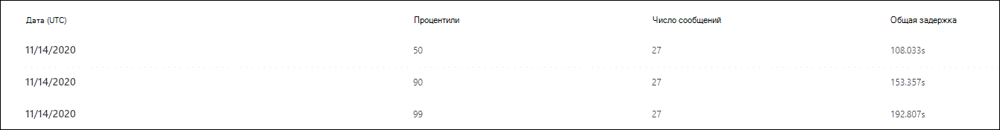

# Просмотр отчетов для защитника Майкрософт для Office 365View reports for Microsoft Defender for Office 365

[!INCLUDE [Microsoft 365 Defender rebranding](../includes/microsoft-defender-for-office.md)]

Защитник Майкрософт для Office 365 (например, подписки 365 Microsoft для Office или защитник Майкрософт для Office 365, план 1 или защитник Microsoft для Office 365 Plan 2) содержат различные отчеты, связанные с безопасностью.Microsoft Defender for Office 365 organizations (for example, Microsoft 365 E5 subscriptions or Microsoft Defender for Office 365 Plan 1 or Microsoft Defender for Office 365 Plan 2 add-ons) contain a variety of security-related reports. Если у вас есть [необходимые разрешения](#what-permissions-are-needed-to-view-the-defender-for-office-365-reports), вы можете просмотреть эти отчеты в центре безопасности & соответствия требованиям, перейдя **Reports** на \> **панель мониторинга** отчетов.If you have the [necessary permissions](#what-permissions-are-needed-to-view-the-defender-for-office-365-reports), you can view these reports in the Security & Compliance Center by going to **Reports** \> **Dashboard**. Чтобы перейти непосредственно к панели мониторинга отчетов, откройте ее <https://protection.office.com/insightdashboard> .To go directly to the Reports dashboard, open <https://protection.office.com/insightdashboard>.

## отчет о типах файлов Defender для Office 365;Defender for Office 365 file types report

В отчете **Reporting Types for Office 365 Type Files Report Types (защитник для Office** ) отображается тип файлов, обнаруженных в качестве вредоносных [при наличии](atp-safe-attachments.md)The **Defender for Office 365 file types report** report shows you the type of files detected as malicious by [Safe Attachments](atp-safe-attachments.md).

 Сводное представление отчета поддерживает 90 дней фильтрации, в то время как в подробном представлении допускается не более 10 дней фильтрации.The aggregate view of the report allows for 90 days of filtering, while the detail view only allows for 10 days of filtering.

Чтобы просмотреть отчет, откройте [Центр безопасности & соответствия требованиям](https://protection.office.com), откройте **Reports** \> **панель мониторинга "** отчеты" и выберите **"защитник для Office 365 типы файлов"**.To view the report, open the [Security & Compliance Center](https://protection.office.com), go to **Reports** \> **Dashboard** and select **Defender for Office 365 file types**. Чтобы перейти непосредственно к отчету, откройте его <https://protection.office.com/reportv2?id=ATPFileReport> .To go directly to the report, open <https://protection.office.com/reportv2?id=ATPFileReport>.

> [!NOTE]
> Сведения, приведенные в этом отчете, также доступны в [отчете об ликвидации сообщений "защитник для Office 365"](#defender-for-office-365-message-disposition-report).The information in this report is also available in the [Defender for Office 365 message disposition report](#defender-for-office-365-message-disposition-report).

### Отчет по отчетам о типах файлов защитника для Office 365Report view for the Defender for Office 365 file types report

Доступны следующие представления:The following views are available:

- **Просмотр данных: File**: диаграмма содержит следующие сведения:**View data by: File**: The chart contains the following information:

  - **Вредоносные вложения Excel****Malicious Excel attachments**
  - **Вредоносные Flash-вложения****Malicious Flash attachments**
  - **Вредоносные вложения в формате PDF****Malicious PDF attachments**
  - **Вредоносные вложения PowerPoint****Malicious PowerPoint attachments**
  - **Вредоносные URL-адреса****Malicious URLs**
  - **Вредоносные вложения Word****Malicious Word attachments**
  - **Вредоносные исполняемые файлы****Malicious executable attachments**
  - **Другие****Others**

  Если навести указатель мыши на определенный день (точка данных), можно увидеть разбивку типов вредоносных файлов, обнаруженных [безопасными вложениями](atp-safe-attachments.md) и [защитой от вредоносных программ в EOP](anti-malware-protection.md).When you hover over a particular day (data point), you can see the breakdown of types of malicious files that were detected by [Safe Attachments](atp-safe-attachments.md) and [anti-malware protection in EOP](anti-malware-protection.md).

  

  При нажатии кнопки **фильтры** можно изменить отчет с помощью следующих фильтров:If you click **Filters**, you can modify the report with the following filters:

  - **Дата начала** и **Дата окончания****Start date** and **End date**
  - Значения типов файлов, которые отображаются на диаграмме.The same file type values that are visible in the chart.

- **Просмотр данных по: Message**: на диаграмме представлены следующие сведения:**View data by: Message**: The chart contains the following information:

  - **Заблокировать доступ****Block access**
  - **Замененные сообщения****Messages replaced**
  - **Отслеживаемые сообщения****Messages monitored**
  - **Замещена динамической доставкой электронной почты**: Дополнительные сведения см [в разделе Динамическая доставка в политиках безопасных вложений](atp-safe-attachments.md#dynamic-delivery-in-safe-attachments-policies).**Replaced by Dynamic Email Delivery**: For more information, see [Dynamic Delivery in Safe Attachments policies](atp-safe-attachments.md#dynamic-delivery-in-safe-attachments-policies).

  

  При нажатии кнопки **фильтры** можно изменить отчет с помощью следующих фильтров:If you click **Filters**, you can modify the report with the following filters:

  - **Дата начала** и **Дата окончания****Start date** and **End date**
  - Те же значения расстановки сообщений, которые доступны на диаграмме, и дополнительные **сообщения, переданные** по значению.The same message disposition values that are available in the chart, and the additional **Messages passed** value.

### Представление таблицы сведений для отчета о типах файлов защитника для Office 365Details table view for the Defender for Office 365 file types report

Если вы нажмете кнопку **Просмотр сведений**, отчет предоставляет представление почти в режиме реального времени для всех щелчков, происходящих в Организации за последние 10 дней.If you click **View details table**, the report provides a near-real-time view of all clicks that happen within the organization for the last 10 days. Отображаемая информация зависит от диаграммы, которую Вы искали:The information that's shown depends on the chart you were looking at:

- **Просмотр данных: файл**:**View data by: File**:

  - **Дата****Date**
  - **Адрес получателя****Recipient address**
  - **Адрес отправителя****Sender address**
  - **Идентификатор сообщения**: доступен в поле заголовка **Message — ID** в заголовке сообщения и должно быть уникальным.**Message ID**: Available in the **Message-ID** header field in the message header and should be unique. Пример значения: `<08f1e0f6806a47b4ac103961109ae6ef@server.domain>` (Обратите внимание на угловые скобки).An example value is `<08f1e0f6806a47b4ac103961109ae6ef@server.domain>` (note the angle brackets).
  - **File****File**

  При нажатии кнопки **фильтры** можно изменить отчет с помощью следующих фильтров:If you click **Filters**, you can modify the report with the following filters:

  - **Дата начала** и **Дата окончания****Start date** and **End date**
  - Значения типов файлов, которые отображаются на диаграмме.The same file type values that are visible in the chart.

- **Просмотр данных по: Message**:**View data by: Message**:

  - **Дата****Date**
  - **Адрес получателя****Recipient address**
  - **Адрес отправителя****Sender address**
  - **КОД сообщения****Message ID**
  - **File****File**
  - **Тема****Subject**

  При нажатии кнопки **фильтры** можно изменить результаты с помощью следующих фильтров:If you click **Filters**, you can modify the results with the following filters:

  - **Дата начала** и **Дата окончания****Start date** and **End date**
  - Те же значения расстановки сообщений, которые доступны на диаграмме, и дополнительные **сообщения, переданные** по значению.The same message disposition values that are available in the chart, and the additional **Messages passed** value.

Чтобы вернуться к представлению отчетов, нажмите кнопку **Просмотреть отчет**.To get back to the reports view, click **View report**.

## отчет о действиях с сообщениями в Defender для Office 365Defender for Office 365 message disposition report

В отчете об **ликвидации сообщений ATP** отображаются действия, предпринятые для сообщений электронной почты, которые были обнаружены как вредоносный контент.The **ATP Message Disposition** report shows you the actions that were taken for email messages that were detected as having malicious content.

Чтобы просмотреть отчет, откройте [Центр безопасности & соответствия требованиям](https://protection.office.com), перейдите в **Reports** \> **панель мониторинга** отчетов и выберите **защитник для Office 365 Message Disposition**.To view the report, open the [Security & Compliance Center](https://protection.office.com), go to **Reports** \> **Dashboard** and select **Defender for Office 365 message disposition**. Чтобы перейти непосредственно к отчету, откройте его <https://protection.office.com/reportv2?id=ATPMessageReport> .To go directly to the report, open <https://protection.office.com/reportv2?id=ATPMessageReport>.

> [!NOTE]
> Сведения, приведенные в этом отчете, также доступны в [отчете "защитник для Office 365 типы файлов"](#defender-for-office-365-file-types-report).The information in this report is also available in the [Defender for Office 365 file types report](#defender-for-office-365-file-types-report).

### Отчет об ликвидации сообщений для защитника Office 365Report view for the Defender for Office 365 message disposition report

Доступны следующие представления:The following views are available:

- **Просмотр данных по: Message**: на диаграмме представлены следующие сведения:**View data by: Message**: The chart contains the following information:

  - **Заблокировать доступ****Block access**
  - **Замененные сообщения****Messages replaced**
  - **Отслеживаемые сообщения****Messages monitored**
  - **Замещена динамической доставкой электронной почты**: Дополнительные сведения см [в разделе Динамическая доставка в политиках безопасных вложений](atp-safe-attachments.md#dynamic-delivery-in-safe-attachments-policies).**Replaced by Dynamic Email Delivery**: For more information, see [Dynamic Delivery in Safe Attachments policies](atp-safe-attachments.md#dynamic-delivery-in-safe-attachments-policies).

  

  При нажатии кнопки **фильтры** можно изменить отчет с помощью следующих фильтров:If you click **Filters**, you can modify the report with the following filters:

  - **Дата начала** и **Дата окончания****Start date** and **End date**
  - Те же значения расстановки сообщений, которые доступны на диаграмме, и дополнительные **сообщения, переданные** по значению.The same message disposition values that are available in the chart, and the additional **Messages passed** value.

- **Просмотр данных: File**: диаграмма содержит следующие сведения:**View data by: File**: The chart contains the following information:

  - **Вредоносные вложения Excel****Malicious Excel attachments**
  - **Вредоносные Flash-вложения****Malicious Flash attachments**
  - **Вредоносные вложения в формате PDF****Malicious PDF attachments**
  - **Вредоносные вложения PowerPoint****Malicious PowerPoint attachments**
  - **Вредоносные URL-адреса****Malicious URLs**
  - **Вредоносные вложения Word****Malicious Word attachments**
  - **Вредоносные исполняемые файлы****Malicious executable attachments**
  - **Другие****Others**

  Если навести указатель мыши на определенный день (точка данных), можно увидеть разбивку типов вредоносных файлов, обнаруженных [безопасными вложениями](atp-safe-attachments.md) и [защитой от вредоносных программ в EOP](anti-malware-protection.md).When you hover over a particular day (data point), you can see the breakdown of types of malicious files that were detected by [Safe Attachments](atp-safe-attachments.md) and [anti-malware protection in EOP](anti-malware-protection.md).

  

  При нажатии кнопки **фильтры** можно изменить отчет с помощью следующих фильтров:If you click **Filters**, you can modify the report with the following filters:

  - **Дата начала** и **Дата окончания****Start date** and **End date**
  - Значения типов файлов, которые отображаются на диаграмме.The same file type values that are visible in the chart.

### Представление таблицы сведений о защитнике для Office 365 отчет об ликвидации сообщенийDetails table view for the Defender for Office 365 message disposition report

Если вы нажмете кнопку **Просмотр сведений**, отчет предоставляет представление почти в режиме реального времени для всех щелчков, происходящих в Организации за последние 10 дней.If you click **View details table**, the report provides a near-real-time view of all clicks that happen within the organization for the last 10 days. Отображаемая информация зависит от диаграммы, которую Вы искали:The information that's shown depends on the chart you were looking at:

- **Просмотр данных по: Message**:**View data by: Message**:

  - **Дата****Date**
  - **Адрес получателя****Recipient address**
  - **Адрес отправителя****Sender address**
  - **КОД сообщения****Message ID**
  - **File****File**
  - **Тема****Subject**

  При нажатии кнопки **фильтры** можно изменить результаты с помощью следующих фильтров:If you click **Filters**, you can modify the results with the following filters:

  - **Дата начала** и **Дата окончания****Start date** and **End date**
  - Те же значения расстановки сообщений, которые доступны на диаграмме, и дополнительные **сообщения, переданные** по значению.The same message disposition values that are available in the chart, and the additional **Messages passed** value.

- **Просмотр данных: файл**:**View data by: File**:

  - **Дата****Date**
  - **Адрес получателя****Recipient address**
  - **Адрес отправителя****Sender address**
  - **КОД сообщения****Message ID**
  - **File****File**

  При нажатии кнопки **фильтры** можно изменить отчет с помощью следующих фильтров:If you click **Filters**, you can modify the report with the following filters:

  - **Дата начала** и **Дата окончания****Start date** and **End date**
  - Значения типов файлов, которые отображаются на диаграмме.The same file type values that are visible in the chart.

Чтобы вернуться к представлению отчетов, нажмите кнопку **Просмотреть отчет**.To get back to the reports view, click **View report**.

## Отчет о задержке почтыMail latency report

В **отчете о задержке почты** отображается сводное представление о доставке почты и задержках детонации в вашей организации.The **Mail latency report** shows you an aggregate view of the mail delivery and detonation latency experienced within your organization. Время доставки почты в службе зависит от ряда факторов, и время доставки в секундах часто не является хорошим индикатором успеха или проблемы.Mail delivery times in the service are affected by a number of factors, and the absolute delivery time in seconds is often not a good indicator of success or a problem. Время медленной доставки на один день может считаться средним временем доставки в другой день или наоборот.A slow delivery time on one day might be considered an average delivery time on another day, or vice-versa. **Отчет о задержке почты** пытается квалифицировать доставку сообщений на основе статистических данных о наблюдаемом времени доставки других сообщений:The **Mail latency report** tries to qualify message delivery based on statistical data about the observed delivery times of other messages:

- **50-й процентиль**: это середина времени доставки сообщений.**50th percentile**: This is the middle for message delivery times. Это значение можно считать средним временем доставки.You can consider this value as an average delivery time.
- **90th процентиль**: это указывает на высокую задержку доставки сообщений.**90th percentile**: This indicates a high latency for message delivery. Более 10% сообщений заняло больше времени, чем это значение будет доставлено.Only 10% of messages took longer than this value to deliver.
- **99th процентиль**: указывает максимальное время ожидания доставки сообщения.**99th percentile**: This indicates the highest latency for message delivery.

Задержка на стороне клиента и сети не включается.Client side and network latency are not included.

Чтобы просмотреть отчет, откройте [Центр безопасности & соответствия требованиям](https://protection.office.com), перейдите в **Reports** \> **панель мониторинга** отчетов и выберите **отчет о задержке почты**.To view the report, open the [Security & Compliance Center](https://protection.office.com), go to **Reports** \> **Dashboard** and select **Mail latency report**. Чтобы перейти непосредственно к отчету, откройте его <https://protection.office.com/mailLatencyReport?viewid=P50> .To go directly to the report, open <https://protection.office.com/mailLatencyReport?viewid=P50>.

### Представление отчета для отчета о задержке почтыReport view for the Mail latency report

При открытии отчета по умолчанию выбирается вкладка **50 процентили** .When you open the report, the **50th percentiles** tab is selected by default.

По умолчанию это представление содержит диаграмму, настроенную со следующими фильтрами:By default, this view contains a chart that's configured with the following filters:

- **Дата**: последние 7 дней**Date**: The last 7 days
- **Представление сообщений**:**Message View**:
  - Сообщения обезвреженоDetonated messages

На этой диаграмме показаны сообщения, упорядоченные по следующим категориям:This chart shows messages organized into the following categories:

- **Задержка доставки почты****Mail delivery latency**
- **Задержка детонации****Detonation latency**

При наведении указателя мыши на категорию на диаграмме можно увидеть разбивку задержки в каждой категории.When you hover over a category in the chart, you can see a breakdown of the latency in each category.

Если щелкнуть **Фильтр** в представлении отчета, вы можете изменить результаты с помощью следующих фильтров:If you click **Filter** in the report view, you can modify the results with the following filters:

- Все сообщения;All messages
- Сообщения, содержащие вложения или URL-адресаMessages that contain attachments or URLs

При переходе на вкладку **90th процентили** или **99th процентили** используются те же фильтры по умолчанию, что и для представления **50 процентили** .If you click the **90th percentiles** tab or the **99th percentiles** tab, the same default filters from the **50th percentiles** view are used.

### Представление таблицы сведений для отчета о задержке почтыDetails table view for the Mail latency report

В представлении Таблица сведений отображаются следующие сведения:The following information is shown in the details table view:

- **Дата****Date**
- **Процентили****Percentiles**
- **Количество сообщений****Message count**
- **Общая задержка****Overall latency**

Приведенный выше пример показывает, что в течение 14 ноября средняя задержка, использованная для всех доставленных сообщений, и обезврежено была **108,033** секунд.The above shows that on November 14 the average latency experienced for all messages delivered and detonated was **108.033** seconds.

Таблица сведения содержит те же сведения, что и на каждой вкладке.The details table contains the same information on each tab.

## отчет о состоянии защиты от угроз;Threat protection status report

Отчет **о состоянии защиты от угроз** — это единое представление, объединяющее сведения о вредоносном содержимом и вредоносных сообщениях, обнаруженных и заблокированных службой [Exchange Online Protection](exchange-online-protection-overview.md) (EOP) и защитником Майкрософт для Office 365.The **Threat protection status** report is a single view that brings together information about malicious content and malicious email detected and blocked by [Exchange Online Protection](exchange-online-protection-overview.md) (EOP) and Microsoft Defender for Office 365. Дополнительные сведения см. в разделе [отчет о состоянии защиты от угроз](view-email-security-reports.md#threat-protection-status-report).For more information, see [Threat protection status report](view-email-security-reports.md#threat-protection-status-report).

## URL-адрес отчета о защите от угрозURL threat protection report

В **отчете защита от угроз URL** представлены сводные и трендовые представления для обнаруженных угроз и действий, выполняемых с помощью URL-адресов в составе [безопасных ссылок](atp-safe-links.md).The **URL threat protection report** provides summary and trend views for threats detected and actions taken on URL clicks as part of [Safe Links](atp-safe-links.md). В этот отчет не будут выбраны данные о пользователях, к которым применяется политика безопасных ссылок, выбран параметр **не отслеживать нажатия пользователем** .This report will not have click data from users where the Safe Links policy applied has the **Do not track user clicks** option selected.

Чтобы просмотреть отчет, откройте [Центр безопасности & соответствия требованиям](https://protection.office.com), перейдите в **Reports** \> **панель мониторинга** отчетов и выберите **отчет по защите URL-адресов**.To view the report, open the [Security & Compliance Center](https://protection.office.com), go to **Reports** \> **Dashboard** and select **URL protection report**. Чтобы перейти непосредственно к отчету, откройте его <https://protection.office.com/reportv2?id=URLProtectionActionReport> .To go directly to the report, open <https://protection.office.com/reportv2?id=URLProtectionActionReport>.

> [!NOTE]
> Это отчет по *тенденциям защиты*, то есть данные представляют тенденции в более крупном наборе данных.This is a *protection trend report*, meaning data represents trends in a larger dataset. В результате данные в статистическом представлении не доступны в режиме реального времени, но данные в представлении таблицы сведений имеют значение, поэтому вы можете увидеть небольшое расхождение между двумя представлениями.As a result, the data in the aggregate view is not available in real time here, but the data in the details table view is, so you may see a slight discrepancy between the two views.

### Представление отчета по URL-адресу отчета по защите от угрозReport view for the URL threat protection report

В отчете по **защите от угроз URL-адресов** имеется два агрегированных представления, которые обновляются каждые четыре часа, в которых отображаются данные за последние 90 дней:The **URL threat protection** report has two aggregated views that are refreshed once every four hours that shows data for the last 90 days:

- **URL-адрес щелкните действие защиты**: показывает количество щелчков по пользователям в Организации, а также результаты щелчка мыши:**URL click protection action**: Shows the number of URL clicks by users in the organization and the results of the click:

  - **Заблокировано** (пользователь заблокирован для перехода по URL-адресу)**Blocked** (the user was blocked from navigating to the URL)
  - **Заблокировано и нажато****Blocked and clicked through**
  - **Переход по нажатию во время сканирования****Clicked through during scan**

  Щелчок указывает на то, что пользователь выбрал страницу блокировки на вредоносный веб-сайт (администраторы могут отключить функцию "щелкать" в разделе политики безопасных ссылок).A click indicates that the user has clicked through the block page to the malicious website (admins can disable click through in Safe Links policies).

  При нажатии кнопки **фильтры** можно изменить отчет с помощью следующих фильтров:If you click **Filters**, you can modify the report with the following filters:

  - **Дата начала** и **Дата окончания****Start date** and **End date**
  - Доступные действия по защите от щелчка, а также **разрешенное** значение (пользователю разрешено переходить по URL-адресу).The available click protection actions, plus the value **Allowed** (the user was allowed to navigate to the URL).

  

- **URL-адрес щелкните по приложению**: показывает число щелчков URL-адресов в приложениях, поддерживающих безопасные ссылки:**URL click by application**: Shows the number of URL clicks by applications that support Safe Links:

  - **Клиент электронной почты****Email client**
  - **PowerPoint****PowerPoint**
  - **Word****Word**
  - **Excel****Excel**
  - **OneNote****OneNote**
  - **Visio****Visio**
  - **Teams****Teams**
  - **Other****Other**

  При нажатии кнопки **фильтры** можно изменить отчет с помощью следующих фильтров:If you click **Filters**, you can modify the report with the following filters:

  - **Дата начала** и **Дата окончания****Start date** and **End date**
  - Доступные приложения.The available applications.

### Представление таблицы сведений об URL-адресе защиты от угрозDetails table view for the URL threat protection report

Если вы нажмете кнопку **Просмотр сведений**, отчет предоставляет представление почти в режиме реального времени для всех щелчков в Организации за последние 7 дней со следующими сведениями:If you click **View details table**, the report provides a near-real-time view of all clicks that happen within the organization for the last 7 days with the following details:

- **Щелкните время****Click time**
- **Пользователь****User**
- **URL-адрес****URL**
- **Действие****Action**
- **Программы****App**

Если щелкнуть **фильтры** в представлении Таблица сведений, можно отфильтровать по тем же критериям, что и в представлении отчета, а также по **доменам** или **получателям** , разделенным запятыми.If you click **Filters** in the details table view, you can filter by the same criteria as in the report view, and also by **Domains** or **Recipients** separated by commas.

Чтобы вернуться к представлению отчетов, нажмите кнопку **Просмотреть отчет**.To get back to the reports view, click **View report**.

## Дополнительные отчеты для просмотраAdditional reports to view

Помимо отчетов, описанных в этом разделе, доступны некоторые другие отчеты, как описано в следующей таблице.In addition to the reports described in this topic, several other reports are available, as described in the following table:

****

|ОтчетReport|ТемаTopic|
|---|---|
|**Explorer** (Microsoft Defender для Office 365, план 2) или **Обнаружение в режиме реального времени** (защитник Майкрософт для Office 365, план 1)**Explorer** (Microsoft Defender for Office 365 Plan 2) or **real-time detections** (Microsoft Defender for Office 365 Plan 1)|[Обозреватель угроз (и обнаружение в режиме реального времени)Threat Explorer (and real-time detections)](threat-explorer.md)|
|**Отчеты о безопасности электронной почты**, например отчет о самых отправителях и получателях, отчет о поддельной почте и обнаружение нежелательной почты.**Email security reports**, such as the Top senders and recipients report, the Spoof mail report, and the Spam detections report.|[Просмотр отчетов о безопасности почты в Центре безопасности и соответствия требованиямView email security reports in the Security & Compliance Center](view-email-security-reports.md)|
|**Отчеты о движении по почте**, например отчет о перенаправлении, отчет о состоянии Mailflow и отчеты верхнего отправителя и получателей.**Mail flow reports**, such as the Forwarding report, the Mailflow status report, and the Top senders and recipients report.|[Просмотр отчетов о движении по почте в центре безопасности & соответствия требованиямView mail flow reports in the Security & Compliance Center](view-mail-flow-reports.md)|
|**Трассировка URL-адреса для безопасных ссылок** (только PowerShell).**URL trace for Safe Links** (PowerShell only). Выходные данные этого командлета показывают результаты действий безопасных ссылок за предыдущие семь дней.The output of this cmdlet shows you the results of Safe Links actions over the past seven days.|[Get — УрлтрацеGet-UrlTrace](https://docs.microsoft.com/powershell/module/exchange/get-urltrace)|
|**Почтовые трафик для EOP и защитника Майкрософт для Office 365** (только для PowerShell).**Mail traffic results for EOP and Microsoft Defender for Office 365** (PowerShell only). Выходные данные этого командлета содержат сведения о домене, дате, типе события, направлении, действии и количестве сообщений.The output of this cmdlet contains information about Domain, Date, Event Type, Direction, Action, and Message Count.|[Get — МаилтраффикатпрепортGet-MailTrafficATPReport](https://docs.microsoft.com/powershell/module/exchange/get-mailtrafficatpreport)|
|**Подробные отчеты для EOP и защитника для обнаружения Office 365** (только для PowerShell).**Mail detail reports for EOP and Defender for Office 365 detections** (PowerShell only). Выходные данные этого командлета содержат сведения о вредоносных файлах или URL-адресах, фишинговых попытках, олицетворении и других потенциальных угрозах в электронной почте или файлах.The output of this cmdlet contains details about malicious files or URLs, phishing attempts, impersonation, and other potential threats in email or files.|[Get — МаилдетаилатпрепортGet-MailDetailATPReport](https://docs.microsoft.com/powershell/module/exchange/get-maildetailatpreport)|
|

## Какие разрешения необходимы для просмотра отчетов защитника для Office 365?What permissions are needed to view the Defender for Office 365 reports?

Для просмотра и использования отчетов, описанных в этом разделе, **необходима соответствующая роль, назначенная для центра безопасности и центра &amp; администрирования Exchange**.In order to view and use the reports described in this topic, **you must have an appropriate role assigned for both the Security &amp; Compliance Center and the Exchange admin center**.

- Для центра безопасности & соответствия требованиям необходимо назначить одну из следующих ролей:For the Security & Compliance Center, you must have one of the following roles assigned:

  - Управление организациейOrganization Management
  - Администратор безопасности (это можно назначить в центре администрирования Azure Active Directory ( [https://aad.portal.azure.com](https://aad.portal.azure.com) )).Security Administrator (this can be assigned in the Azure Active Directory admin center ([https://aad.portal.azure.com](https://aad.portal.azure.com)))
  - Оператор безопасности (это можно назначить в центре администрирования Azure Active Directory ( [https://aad.portal.azure.com](https://aad.portal.azure.com) )).Security Operator (this can be assigned in the Azure Active Directory admin center ([https://aad.portal.azure.com](https://aad.portal.azure.com)))
  - Читатель сведений о безопасностиSecurity Reader

- Для Exchange Online необходимо назначить одну из следующих ролей в центре администрирования Exchange ( [https://outlook.office365.com/ecp](https://outlook.office365.com/ecp) ) или с помощью командлетов PowerShell (см. [Exchange Online PowerShell](https://docs.microsoft.com/powershell/exchange/exchange-online-powershell)):For Exchange Online, you must have one of the following roles assigned in either the Exchange admin center ([https://outlook.office365.com/ecp](https://outlook.office365.com/ecp)) or with PowerShell cmdlets (See [Exchange Online PowerShell](https://docs.microsoft.com/powershell/exchange/exchange-online-powershell)):

  - Управление организациейOrganization Management
  - Управление организацией с правами только на просмотрView-only Organization Management
  - Роль получателей с правами только на просмотрView-Only Recipients role
  - Управление соответствием требованиямCompliance Management

Для получения дополнительных сведений ознакомьтесь с приведенными ниже ресурсами.To learn more, see the following resources:

- [Разрешения в Центре безопасности и соответствия требованиямPermissions in the Security & Compliance Center](permissions-in-the-security-and-compliance-center.md)

- [Разрешения компонентов в Exchange OnlineFeature permissions in Exchange Online](https://docs.microsoft.com/exchange/permissions-exo/feature-permissions)

## Что делать, если в отчетах данные не отображаются?What if the reports aren't showing data?

Если вы не видите данные в отчете "защитник для Office 365", проверьте правильность настройки политик.If you are not seeing data in your Defender for Office 365 reports, double-check that your policies are set up correctly. Организация должна иметь политики безопасных [ссылок](set-up-atp-safe-links-policies.md) и [политики безопасных вложений](set-up-atp-safe-attachments-policies.md) , определенные для обеспечения защиты от защитника Office 365.Your organization must have [Safe Links policies](set-up-atp-safe-links-policies.md) and [Safe Attachments policies](set-up-atp-safe-attachments-policies.md) defined in order for Defender for Office 365 protection to be in place. Кроме того, вы можете увидеть [защиту от нежелательной почты и вредоносных программ](anti-spam-and-anti-malware-protection.md).Also see [Anti-spam and anti-malware protection](anti-spam-and-anti-malware-protection.md).

## Статьи по темеRelated topics

[Интеллектуальные отчеты и аналитика в Центре безопасности и соответствия требованиямSmart reports and insights in the Security & Compliance Center](reports-and-insights-in-security-and-compliance.md)
  
[Разрешения ролей (Azure Active DirectoryRole permissions (Azure Active Directory](https://docs.microsoft.com/azure/active-directory/users-groups-roles/directory-assign-admin-roles#role-permissions)
