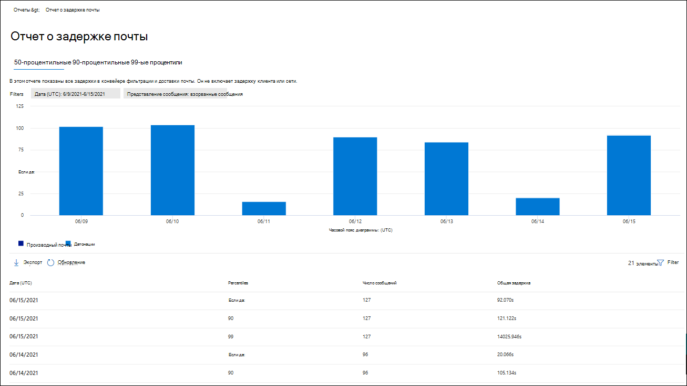
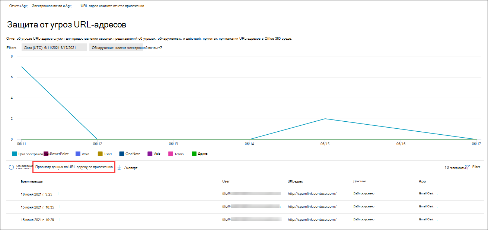

# Просмотр отчетов Defender для Office 365 на портале Microsoft 365 DefenderView Defender for Office 365 reports in the Microsoft 365 Defender portal

[!INCLUDE [Microsoft 365 Defender rebranding](../includes/microsoft-defender-for-office.md)]

**Область применения****Applies to**
- [Microsoft Defender для Office 365 (план 1 и план 2)Microsoft Defender for Office 365 plan 1 and plan 2](defender-for-office-365.md)
- [Microsoft 365 DefenderMicrosoft 365 Defender](../defender/microsoft-365-defender.md)

Microsoft Defender для Office 365 организаций (например, Microsoft 365 E5 подписки или Microsoft Defender для Office 365 Plan 1 или Microsoft Defender для надстройки Office 365 Plan 2) содержат различные отчеты, связанные с безопасностью.Microsoft Defender for Office 365 organizations (for example, Microsoft 365 E5 subscriptions or Microsoft Defender for Office 365 Plan 1 or Microsoft Defender for Office 365 Plan 2 add-ons) contain a variety of security-related reports. Если у вас [есть](#what-permissions-are-needed-to-view-the-defender-for-office-365-reports)необходимые разрешения, вы можете просмотреть эти  отчеты на портале Microsoft 365 Defender, переехав в отчеты электронной почты & совместной & отчеты о \>  \> **совместной работе**.If you have the [necessary permissions](#what-permissions-are-needed-to-view-the-defender-for-office-365-reports), you can view these reports in the Microsoft 365 Defender portal by going to **Reports** \> **Email & collaboration** \> **Email & collaboration reports**. Чтобы перейти непосредственно на **страницу отчетов & электронной почты,** откройте <https://security.microsoft.com/emailandcollabreport> .To go directly to the **Email & collaboration reports** page, open <https://security.microsoft.com/emailandcollabreport>.

> [!NOTE]
>
> Отчеты о безопасности электронной почты, которые не требуют Office 365 Defender, описаны в просмотре отчетов о безопасности электронной почты на [Microsoft 365 Defender портале](view-email-security-reports.md).Email security reports that don't require Defender for Office 365 are described in [View email security reports in the Microsoft 365 Defender portal](view-email-security-reports.md).
>
> Отчеты, связанные с потоком почты, теперь находятся Exchange центра администрирования (EAC).Reports that are related to mail flow are now in the Exchange admin center (EAC). Дополнительные сведения об этих отчетах см. в сообщении потока почты в [новом центре администрирования Exchange.](/exchange/monitoring/mail-flow-reports/mail-flow-reports)For more information about these reports, see [Mail flow reports in the new Exchange admin center](/exchange/monitoring/mail-flow-reports/mail-flow-reports).

## Сейф Отчет о типах файлов вложенияSafe Attachments file types report

> [!NOTE]
> Отчет **Сейф типов вложений** в конечном итоге будет отходить.The **Safe Attachments file types report** will eventually go away. Такая же информация доступна в отчете о состоянии [защиты от угроз.](#threat-protection-status-report)The same information is available in the [Threat protection status report](#threat-protection-status-report).

## Сейф Отчет о диспозиции сообщений вложенияSafe Attachments message disposition report

> [!NOTE]
> Отчет **Сейф сообщений о диспозиции** вложений в конечном итоге будет отходить.The **Safe Attachments message disposition report** will eventually go away. Такая же информация доступна в отчете о состоянии [защиты от угроз.](#threat-protection-status-report)The same information is available in the [Threat protection status report](#threat-protection-status-report).

## Отчет о задержке почтыMail latency report

В **отчете о задержке** почты показано совокупное представление задержки доставки почты и детонации в организации.The **Mail latency report** shows you an aggregate view of the mail delivery and detonation latency experienced within your organization. Время доставки почты в службе зависит от ряда факторов, и абсолютное время доставки в секундах часто не является хорошим показателем успешности или проблемы.Mail delivery times in the service are affected by a number of factors, and the absolute delivery time in seconds is often not a good indicator of success or a problem. Медленное время доставки в один день можно считать средним временем доставки в другой день или наоборот.A slow delivery time on one day might be considered an average delivery time on another day, or vice-versa. Это пытается квалифицировать доставку сообщений на основе статистических данных о наблюдаемом времени доставки других сообщений.This tries to qualify message delivery based on statistical data about the observed delivery times of other messages.

Клиентская сторона и задержка сети не включаются.Client side and network latency are not included.

Чтобы просмотреть отчет, откройте портал [Microsoft 365 Defender,](https://security.microsoft.com)  перейдите в отчеты электронной почты & совместной & отчеты о \>  \> **совместной работе.**To view the report, open the [Microsoft 365 Defender portal](https://security.microsoft.com), go to **Reports** \> **Email & collaboration** \> **Email & collaboration reports**. На странице **Отчеты &** электронной почты найдите отчет о задержке почты и нажмите  **кнопку Просмотр сведений**.On the **Email & collaboration reports** page, find **Mail latency report** and then click **View details**. Чтобы перейти непосредственно к отчету, откройте <https://security.microsoft.com/mailLatencyReport> .To go directly to the report, open <https://security.microsoft.com/mailLatencyReport>.

На странице **отчета о задержке** почты на странице отчета о задержке почты доступны следующие **вкладки:**On the **Mail latency report** page, the following tabs are available on the **Mail latency report** page:

- **50-й процентиль.** Это среднее время доставки сообщений.**50th percentile**: This is the middle for message delivery times. Это значение можно рассматривать как среднее время доставки.You can consider this value as an average delivery time. Эта вкладка выбирается по умолчанию.This tab is selected by default.
- **90-й процентиль.** Это указывает на высокую задержку доставки сообщений.**90th percentile**: This indicates a high latency for message delivery. Только 10% сообщений занимает больше времени, чем это значение для доставки.Only 10% of messages took longer than this value to deliver.
- **99-й процентиль.** Это указывает на наивысшую задержку доставки сообщений.**99th percentile**: This indicates the highest latency for message delivery.

Независимо от выбранной вкладки на диаграмме показаны сообщения, организованные в следующие категории:Regardless of the tab you select, the chart shows messages organized into the following categories:

- **Задержка доставки почты****Mail delivery latency**
- **Детонации****Detonations**

При наведении над категорией на диаграмме можно увидеть разбивку задержки в каждой категории.When you hover over a category in the chart, you can see a breakdown of the latency in each category.

При **нажатии фильтра** можно отфильтровать диаграмму и таблицу сведений следующими значениями:If you click **Filter**, you can filter both the chart and the details table by the following values:

- **Дата (UTC)**: **Дата начала и** дата **окончания****Date (UTC)**: **Start date** and **End date**
- **Представление сообщения.** Одно из следующих значений:**Message view**: One of the following values:
  - **Все сообщения**;**All messages**
  - **Сообщения, содержащие вложения или URL-адреса****Messages that contain attachments or URLs**
  - **Взорванные сообщения****Detonated messages**

Когда вы закончите настройку фильтров, нажмите **кнопку Применить,** **Отменить** или **очистить фильтры**.When you're finished configuring the filters, click **Apply**, **Cancel**, or **Clear filters**.

В таблице сведений ниже диаграммы доступны следующие сведения:In the details table below the chart, the following information is available:

- **Дата (UTC)****Date (UTC)**
- **Percentiles**: **50**, **90**, или **99****Percentiles**: **50**, **90**, or **99**
- **Количество сообщений****Message count**
- **Общая задержка****Overall latency**

## отчет о состоянии защиты от угроз;Threat protection status report

Отчет **о состоянии** защиты от угроз представляет собой одно представление, которое объединяет сведения о вредоносном контенте и вредоносной электронной почте, обнаруженной и заблокированной Exchange Online Protection (EOP) и Microsoft Defender для Office 365. The **Threat protection status** report is a single view that brings together information about malicious content and malicious email detected and blocked by [Exchange Online Protection](exchange-online-protection-overview.md) (EOP) and Microsoft Defender for Office 365. Дополнительные сведения см. в [отчете о состоянии защиты от угроз.](view-email-security-reports.md#threat-protection-status-report)For more information, see [Threat protection status report](view-email-security-reports.md#threat-protection-status-report).

## Отчет об угрозе URL-адресаURL threat protection report

В **отчете об угрозе** URL-адресов содержится сводка и представления тенденций для обнаруженных угроз и действия, принятые на щелчках [URL-адресов в Сейф ссылки.](safe-links.md)The **URL threat protection report** provides summary and trend views for threats detected and actions taken on URL clicks as part of [Safe Links](safe-links.md). В этом отчете не будут щелкать данные пользователей,  Сейф применяемая политика ссылок имеет выбранный параметр Не отслеживать щелчки пользователя.This report will not have click data from users where the Safe Links policy applied has the **Do not track user clicks** option selected.

Чтобы просмотреть отчет, откройте портал [Microsoft 365 Defender,](https://security.microsoft.com)  перейдите в отчеты электронной почты & совместной & отчеты о \>  \> **совместной работе.**To view the report, open the [Microsoft 365 Defender portal](https://security.microsoft.com), go to **Reports** \> **Email & collaboration** \> **Email & collaboration reports**. На странице **отчетов & электронной** почты найдите страницу **защиты URL-адресов** и нажмите **кнопку Просмотр сведений.**On the **Email & collaboration reports** page, find **URL protection page** and then click **View details**. Чтобы перейти непосредственно к отчету, откройте <https://security.microsoft.com/reports/URLProtectionActionReport> .To go directly to the report, open <https://security.microsoft.com/reports/URLProtectionActionReport>.

Доступные представления на странице **отчета об** угрозе url-адресов описаны в следующих разделах.The available views on the **URL threat protection** report page are described in the following sections.

> [!NOTE]
> Это отчет *тенденции защиты,* то есть данные представляют тенденции в большом наборе данных.This is a *protection trend report*, meaning data represents trends in a larger dataset. В результате, данные на диаграммах недоступны в режиме реального времени, но данные в таблице сведений есть, поэтому между ними может возникнуть небольшое несоответствие.As a result, the data in the charts is not available in real time here, but the data in the details table is, so you may see a slight discrepancy between the two. Диаграммы обновляются один раз в четыре часа и содержат данные за последние 90 дней.The charts are refreshed once every four hours and contain data for the last 90 days.

### Просмотр данных по URL-адресу щелкните действие защитыView data by URL click protection action

Представление **данных по URL-адресу** щелкните представление действия защиты, отображает количество нажатий URL-адресов пользователями в организации и результаты щелчка:The **View data by URL click protection action** view shows the number of URL clicks by users in the organization and the results of the click:

- **Разрешено:** пользователю было разрешено перемещаться по URL-адресу.**Allowed**: The user was allowed to navigate to the URL.
- **Заблокировано.** Пользователю было заблокировано перемещение по URL-адресу.**Blocked**: The user was blocked from navigating to the URL.
- **Заблокировано и щелкнуло.** Пользователь решил продолжить навигацию по URL-адресу.**Blocked and clicked through**: The user has chosen to continue navigating to the URL.
- **Щелкнув во время сканирования:** пользователь щелкнул по ссылке до завершения сканирования.**Clicked through during scan**: The user has clicked on the link before the scan was complete.

Щелчком мыши указывается, что пользователь щелкнул по странице блокировки на вредоносный веб-сайт (администраторы могут отключить щелчок в Сейф ссылки).A click indicates that the user has clicked through the block page to the malicious website (admins can disable click through in Safe Links policies).

При **нажатии фильтров** можно изменить отчет и таблицу сведений, выбрав одно или несколько следующих значений в вылете:If you click **Filters**, you can modify the report and the details table by selecting one or more of the following values in the flyout that appears:

- **Дата (UTC)**: **Дата начала и** дата **окончания****Date (UTC)**: **Start date** and **End date**
- **Обнаружение:****Detection**:
  - **Разрешено****Allowed**
  - **Заблокировано****Blocked**
  - **Заблокировано и щелкнуть****Blocked and clicked through**
  - **Щелкнув во время сканирования****Clicked through during scan**
- **Домены:** URL-домены, указанные в результатах отчета.**Domains**: The URL domains listed in the report results.
- **Получатели****Recipients**

Когда вы закончите настройку фильтров, нажмите **кнопку Применить,** **Отменить** или **очистить фильтры**.When you're finished configuring the filters, click **Apply**, **Cancel**, or **Clear filters**.

В таблице сведений ниже диаграммы приведено следующее представление в режиме почти реального времени всех щелчков мыши, которые произошли в организации за последние 7 дней:The details table below the chart provides the following near-real-time view of all clicks that happened within the organization for the last 7 days:

- **Время щелчка****Click time**
- **Пользователь****User**
- **URL****URL**
- **Действие****Action**
- **Приложение****App**

### Просмотр данных по URL-адресу по приложениюView data by URL click by application

Просмотр **данных по URL-адресу** по представлению приложения показывает количество нажатий URL-адресов приложениями, Сейф ссылками:The **View data by URL click by application** view shows the number of URL clicks by apps that support Safe Links:

- **Клиент электронной почты****Email client**
- **PowerPoint****PowerPoint**
- **Word****Word**
- **Excel****Excel**
- **OneNote****OneNote**
- **Visio****Visio**
- **Teams****Teams**
- **Другие****Others**

При **нажатии фильтров** можно изменить отчет и таблицу сведений, выбрав одно или несколько следующих значений в вылете:If you click **Filters**, you can modify the report and the details table by selecting one or more of the following values in the flyout that appears:

- **Дата (UTC)**: **Дата начала и** дата **окончания****Date (UTC)**: **Start date** and **End date**
- **Обнаружение.** Доступные приложения из диаграммы.**Detection**: Available apps from the chart.
- **Домены:** URL-домены, указанные в результатах отчета.**Domains**: The URL domains listed in the report results.
- **Получатели****Recipients**

Когда вы закончите настройку фильтров, нажмите **кнопку Применить,** **Отменить** или **очистить фильтры**.When you're finished configuring the filters, click **Apply**, **Cancel**, or **Clear filters**.

В таблице сведений ниже диаграммы приведено следующее представление в режиме почти реального времени всех щелчков мыши, которые произошли в организации за последние 7 дней:The details table below the chart provides the following near-real-time view of all clicks that happened within the organization for the last 7 days:

- **Время щелчка****Click time**
- **Пользователь****User**
- **URL****URL**
- **Действие****Action**
- **Приложение****App**

## Дополнительные отчеты для просмотраAdditional reports to view

Помимо отчетов, описанных в этой статье, доступны еще несколько отчетов, описанных в следующей таблице:In addition to the reports described in this article, several other reports are available, as described in the following table:

 

****

|ОтчетReport|РазделTopic|
|---|---|
|**Explorer** (Microsoft Defender для Office 365 Plan 2) или обнаружения в режиме реального времени **(Microsoft** Defender для Office 365 Plan 1)**Explorer** (Microsoft Defender for Office 365 Plan 2) or **real-time detections** (Microsoft Defender for Office 365 Plan 1)|[Обозреватель угроз (и обнаружение в режиме реального времени)Threat Explorer (and real-time detections)](threat-explorer.md)|
|Отчеты о безопасности электронной почты, для защиты от Office 365Email security reports that don't require Defender for Office 365|[Просмотр отчетов о безопасности электронной почты на Microsoft 365 Defender порталеView email security reports in the Microsoft 365 Defender portal](view-email-security-reports.md)|
|Отчеты о потоке почты в центре администрирования Exchange (EAC)Mail flow reports in the Exchange admin center (EAC)|[Отчеты о потоке почты в новом центре администрирования ExchangeMail flow reports in the new Exchange admin center](/exchange/monitoring/mail-flow-reports/mail-flow-reports)|
|

Cmdlets отчетов PowerShell:PowerShell reporting cmdlets:

 

****

|ОтчетReport|РазделTopic|
|---|---|
|Пользователи, которые чаще всего отправляют и получают почтуTop senders and recipients|[Get-MailTrafficTopReportGet-MailTrafficTopReport](/powershell/module/exchange/get-mailtraffictopreport) 
 [Get-MailTrafficSummaryReportGet-MailTrafficSummaryReport](/powershell/module/exchange/get-mailtrafficsummaryreport)|
|Топ вредоносных программTop malware|[Get-MailTrafficSummaryReportGet-MailTrafficSummaryReport](/powershell/module/exchange/get-mailtrafficsummaryreport)|
|Трафик почтыMail traffic|[Get-MailTrafficATPReportGet-MailTrafficATPReport](/powershell/module/exchange/get-mailtrafficatpreport) 
 [Get-MailDetailATPReportGet-MailDetailATPReport](/powershell/module/exchange/get-maildetailatpreport)|
|Безопасные ссылкиSafe Links|[Get-SafeLinksAggregateReportGet-SafeLinksAggregateReport](/powershell/module/exchange/get-safelinksaggregatereport) 
 [Get-SafeLinksDetailReportGet-SafeLinksDetailReport](/powershell/module/exchange/get-safelinksdetailreport)|
|Скомпрометированная пользователейCompromised users|[Get-CompromisedUserAggregateReportGet-CompromisedUserAggregateReport](/powershell/module/exchange/get-compromiseduseraggregatereport) 
 [Get-CompromisedUserDetailReportGet-CompromisedUserDetailReport](/powershell/module/exchange/get-compromiseduserdetailreport)|
|Состояние потока почтыMail flow status|[Get-MailflowStatusReportGet-MailflowStatusReport](/powershell/module/exchange/get-mailflowstatusreport)|
|

## Какие разрешения необходимы для просмотра отчетов Defender для Office 365?What permissions are needed to view the Defender for Office 365 reports?

Чтобы просмотреть и использовать отчеты, описанные в этой статье, необходимо быть членом одной из следующих групп ролей на Microsoft 365 Defender портале:In order to view and use the reports described in this article, you need to be a member of one of the following role groups in the Microsoft 365 Defender portal:

- **Управление организацией****Organization Management**
- **Администратор безопасности****Security Administrator**
- **Читатель сведений о безопасности****Security Reader**
- **Глобальный читатель****Global Reader**

Дополнительные сведения см. в статье [Разрешения на портале Microsoft 365 Defender](permissions-microsoft-365-security-center.md).For more information, see [Permissions in the Microsoft 365 Defender portal](permissions-microsoft-365-security-center.md).

**Примечание.** Добавление пользователей к соответствующей роли Azure Active Directory в Центр администрирования Microsoft 365 дает пользователям необходимые разрешения на  портале Microsoft 365 Defender и разрешения на другие функции в Microsoft 365.**Note**: Adding users to the corresponding Azure Active Directory role in the Microsoft 365 admin center gives users the required permissions in the Microsoft 365 Defender portal _and_ permissions for other features in Microsoft 365. Дополнительные сведения см. в статье [О ролях администраторов](../../admin/add-users/about-admin-roles.md).For more information, see [About admin roles](../../admin/add-users/about-admin-roles.md).

## Что делать, если отчеты не отображают данные?What if the reports aren't showing data?

Если в отчете Defender не Office 365 данные, убедитесь, что политики настроены правильно.If you are not seeing data in your Defender for Office 365 reports, double-check that your policies are set up correctly. Ваша организация должна [иметь Сейф ссылки](set-up-safe-links-policies.md) и политики Сейф вложения, определенные для того, чтобы для defender Office 365 была установлена защита. Your organization must have [Safe Links policies](set-up-safe-links-policies.md) and [Safe Attachments policies](set-up-safe-attachments-policies.md) defined in order for Defender for Office 365 protection to be in place. Также [см. защиту от нежелательной почты и](anti-spam-and-anti-malware-protection.md)защиты от вредоносных программ.Also see [Anti-spam and anti-malware protection](anti-spam-and-anti-malware-protection.md).

## Связанные статьиRelated topics

[Интеллектуальные отчеты и сведения на Microsoft 365 Defender порталеSmart reports and insights in the Microsoft 365 Defender portal](reports-and-insights-in-security-and-compliance.md)

[Разрешения на роль (Azure Active DirectoryRole permissions (Azure Active Directory](/azure/active-directory/users-groups-roles/directory-assign-admin-roles#role-permissions)
