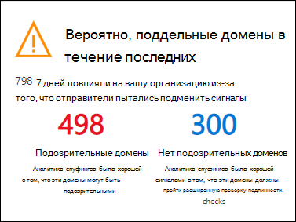
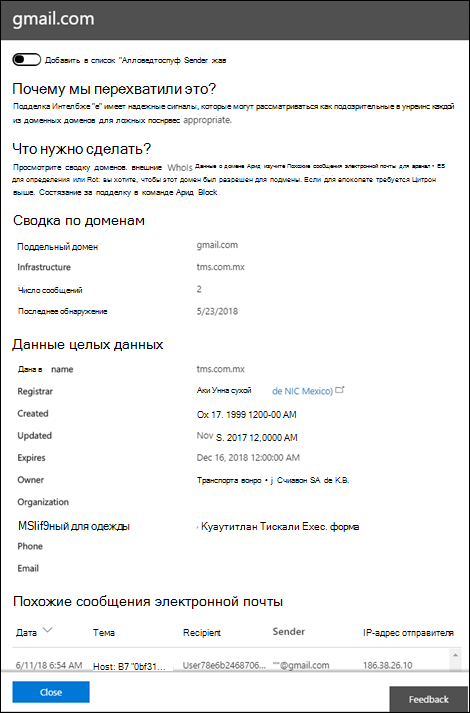

# Пошаговое руководство по подделке анализа сведений о подделке в Microsoft 365

В организациях Microsoft 365 с расширенной защитой угроз (ATP) вы можете быстро определять, какие отправители подлиннее отправляют сообщения, не прошедшие проверку подлинности, с помощью функции подмены. Если вы разрешаете отправлять поддельные сообщения, вы можете снизить риск возникновения любых ложных срабатываний, отправляемых пользователям. Вы также можете использовать подделку для мониторинга и управления разрешенными парами доменов, чтобы обеспечить дополнительный уровень безопасности и предотвратить поступление небезопасных сообщений в организацию.

Если вы не знакомы с [отчетами и аналитическими сведениями в центре безопасности & соответствия требованиям](reports-and-insights-in-security-and-compliance.md), может оказаться полезным понять, как можно легко переходить с панели мониторинга на подробные и рекомендуемые действия.

Это пошаговое руководство является одним из нескольких для центра безопасности & соответствия требованиям. Сведения о том, как переходить по отчетам и аналитическим сведениям, можно найти в пошаговых руководствах раздела "связанные темы".

## Что нужно знать перед началом работы

- Откройте Центр безопасности и соответствия требованиям по ссылке <https://protection.office.com/>. Чтобы перейти непосредственно на страницу **панели мониторинга безопасности** , используйте <https://protection.office.com/searchandinvestigation/dashboard>.

  В центре безопасности & соответствия требованиям вы можете просматривать сведения о подделке для нескольких панелей мониторинга. Независимо от того, какая панель мониторинга отображается, сведения о ней представлены одинаково и позволяют быстро выполнять те же задачи.

- Чтобы вы могли выполнить эти процедуры, вам должны быть назначены соответствующие разрешения. Чтобы использовать средство анализа сведений о подделке, необходимо быть участником группы ролей " **Управление организацией**", " **администратор безопасности**" или " **читатель безопасности** ". Дополнительные сведения о группах ролей в Центре безопасности и соответствия требованиям см. в статье [Разрешения в Центре безопасности и соответствия требованиям](permissions-in-the-security-and-compliance-center.md).

- Вы включаете и отключаете аналитику подделки в политиках защиты от фишинга ATP. Для получения дополнительных сведений см. [Настройка политик защиты от фишинга ATP в Microsoft 365](configure-atp-anti-phishing-policies.md).

- В организациях Microsoft 365 с почтовыми ящиками Exchange Online и в автономной службе Exchange Online Protection (EOP) без почтовых ящиков Exchange Online можно использовать эту логику для отслеживания и управления отправителями сообщений, не прошедших проверку подлинности. Дополнительные сведения см. в статье [Настройка аналитики спуфинга в Microsoft 365](learn-about-spoof-intelligence.md).

## Откройте центр контроля допуска подделки в центре безопасности & соответствия требованиям

1. В центре безопасности & соответствия требованиям перейдите на \> **панель мониторинга** **управления угрозами** .

2. В строке **Insights** найдите один из следующих элементов:

   - **Аналитика подделки включена**: Insights — это **домены с поддельным именем, не прошедшие проверку подлинности за прошедшие 30 дней**. Этот параметр используется по умолчанию.

   - **Аналитика подделки отключена**: представление " **Включение защиты от спуфинга**" и нажатие этой кнопки позволяет включить аналитику подделки.

3. В панели мониторинга отображается следующая информация:

   

   Эта аналитика имеет два режима:

   - **Режим анализа**. Если у вас включена политика подмены, то в этой информации показывается, сколько почтовых ящиков было затронуты нашими функциями анализа подделки за прошедшие 30 дней.

   - **Режим "что если**". Если политика подмены не включена, то в разделе сведения о количестве почтовых ящиков, на *которые* повлияла функция анализа подделки за прошедшие 30 дней.

   В обоих случаях поддельные домены, отображаемые в разделе Insights, делятся на две категории: **подозрительные** и **неподозрительные пары**доменов. Эти категории далее делятся на три разных сегмента для просмотра.

   **Доменная** комбинация — это сочетание адреса "от" и инфраструктуры отправки:

   - Адрес отправителя — это адрес электронной почты отправителя, отображаемый в почтовых клиентах. Этот адрес указывает автора сообщения электронной почты, Этот адрес указывает автора сообщения, вернее, почтовый ящик человека или систему, где оно было создано. Этот адрес также называется `5322.From` адресом.

   - Отправляющей инфраструктурой или отправителем является организационным доменом обратного поиска DNS (записи PTR) отправляющего IP-адреса. Если у отправляющего IP-адреса нет записи PTR, отправитель идентифицируется с помощью отправляющего IP-адреса с маской подсети 255.255.255.0 в нотации CIDR (/24). Например, если IP-адрес 192.168.100.100, то полный IP-адрес отправителя — 192.168.100.100/24.

   К **подозрительным парам доменов** относятся:

   - **Имитация высокой надежности**: Microsoft 365 получил сильные сигналы о том, что эти домены являются подозрительными, в зависимости от исторических образцов отправки и оценки репутации доменов. Microsoft 365 строго уверены, что домены являются подменой, а сообщения, отправляемые из этих доменов, скорее всего, являются законными.

   - **Подделка умеренной уверенности**: Microsoft 365 получил умеренные сигналы о том, что эти домены подозрительными, на основе прошлых шаблонов отправки и оценки репутации доменов. В Office 365 средний уровень уверенности в том, что домены являются подменами и сообщения, отправляемые из этих доменов, являются законными. Этот сегмент имеет большую вероятность того, что он содержит ложные срабатывания (кадров в процентах), чем сегмент подделки с высоким уровнем доверия.

   - **Пары доменов, не являющиеся подозрительными** (включая **Аварийное подделку**): аварийное подделка — это домены, которые не прошли проверку подлинности [SPF](how-office-365-uses-spf-to-prevent-spoofing.md), [DKIM](use-dkim-to-validate-outbound-email.md), [DMARC](use-dmarc-to-validate-email.md)), но прошли неявные проверки подлинности ([композитная проверка подлинности](email-validation-and-authentication.md#composite-authentication)). В результате Microsoft 365 проводила от вашего имени сообщение от вашего имени и не предприняло никаких действий по борьбе с подменой сообщений.

### Просмотр подробных сведений о подозрительных парах доменов из аналитической аналитики подделки

1. В поддельной информации выберите любую из пар доменов (высокая, средняя или копия).

   Отобразится страница "сведения о **подделке** ", в которой отображается список отправителей, которые отправляют в организацию непроверенные сообщения. Сведения на этой странице помогут определить, авторизованы ли поддельные сообщения, или необходимо предпринять дальнейшие действия. Вы можете отсортировать информацию по количеству сообщений, дате и времени последнего обнаружения подделки и т. д. (Например, "количество сообщений" или " **Последнее**Просмотр" (например, " **количество сообщений** ").

2. Выберите элемент в таблице, чтобы открыть область сведений, содержащую обширные сведения об этой учетной записи, в том числе почему мы перехватили это, что нужно сделать, сводка по домену, данные WhoIs о отправителе и Похожие сообщения электронной почты, которые мы видели у того же отправителя. Отсюда вы можете добавить или удалить комбинацию домена из списка надежных отправителей **алловедтоспуф** .

   

### Добавление или удаление домена из списка надежных отправителей Алловедтоспуф

Вы добавляете или удаляете домен из списка надежных отправителей Алловедтоспуф, а затем просматриваете доменную информацию в области сведений в области сведений о подделке. Просто установите переключатель соответствующим образом.

Это приводит к изменению пары доменных комбинаций поддельного домена и отправляющей инфраструктуры и не обеспечивает покрытие для всего поддельного домена или инфраструктуры отправки в изоляции.

Например, если добавить следующую доменную связь в список разрешенных отправителей "Алловедтоспуф": *поддельный домен* "Gmail.com" и *отправляющий инфраструктуру* "TMS *. MX.com",* то подменить только почтовые сообщения из этой доменной области. Другие отправители, пытающиеся подделывать "gmail.com", и другие домены, которые "tms.mx.com" пытаются подменить, по-прежнему будут защищаться службой подделки.

## Статьи по теме

[Защита от спуфинга в Microsoft 365](anti-spoofing-protection.md)

[Пошаговое руководство. Из панели мониторинга к аналитике](from-a-dashboard-to-an-insight.md)

[Пошаговое руководство. Из подробного отчета к аналитике](from-a-detailed-report-to-an-insight.md)

[Пошаговое руководство. Из аналитики к подробному отчету](from-an-insight-to-a-detailed-report.md)