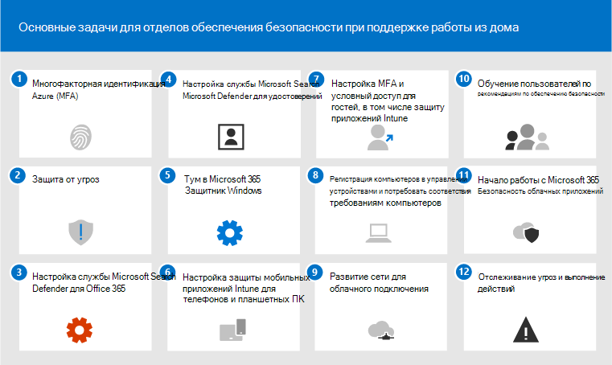

# 12 основных задач для групп безопасности для поддержки работы из дома

Если вы похожи на [корпорацию Майкрософт](https://www.microsoft.com/microsoft-365/blog/2020/03/10/staying-productive-while-working-remotely-with-microsoft-teams/) и внезапно нашли поддержку в основном домашних сотрудников, мы хотим помочь вам обеспечить максимально безопасную работу вашей организации. В этой статье приоритеты задач помогают группам безопасности как можно быстрее реализовать самые важные возможности безопасности.

Если вы небольшая или средняя организация, использующая один из бизнес-планов Корпорации Майкрософт, см. указанные здесь ресурсы.

- [10 лучших способов защиты планов Office 365 и Microsoft 365 для бизнеса](../admin/security-and-compliance/secure-your-business-data.md)
- [Microsoft 365 for Campaigns](https://docs.microsoft.com/microsoft-365/campaigns/) (включает рекомендуемую конфигурацию безопасности для Microsoft 365 бизнес)

Для клиентов, использующих наши корпоративные планы, корпорация Майкрософт рекомендует выполнить задачи, перечисленные в следующей таблице, применимые к вашему плану обслуживания. Если вместо приобретения плана Microsoft 365 корпоративный вы объединяете подписки, обратите внимание на следующее:

- Microsoft 365 E3 включает Enterprise Mobility + Security (EMS) E3 и Azure AD P1
- Microsoft 365 E5 включает EMS E5 и Azure AD P2

****

|Действие|Task|Все планы Office 365 корпоративный|Microsoft 365 E3|Microsoft 365 E5|
|---|---|---|---|---|
|1 |[Включить многофакторную проверку подлинности Azure AD (MFA)](#1-enable-azure-ad-multi-factor-authentication-mfa)||||
|2 |[Защита от угроз](#2-protect-against-threats)||||
|3|[Настройка Microsoft Defender для Office 365](#3-configure-microsoft-defender-for-office-365)||||
|4 |[Настройка Microsoft Defender для удостоверений](#4-configure-microsoft-defender-for-identity)||||
|5 |[Включить Защитник Microsoft 365](#5-turn-on-microsoft-365-defender)||||
|6 |[Настройка защиты мобильных приложений Intune для телефонов и планшетов](#6-configure-intune-mobile-app-protection-for-phones-and-tablets)||||
|7 |[Настройка MFA и условного доступа для гостей, включая защиту приложений Intune](#7-configure-mfa-and-conditional-access-for-guests-including-intune-mobile-app-protection)||||
|8 |[Регистрация компьютеров в управлении устройствами и требование компьютеров, совместимых с](#8-enroll-pcs-into-device-management-and-require-compliant-pcs)||||
|9 |[Оптимизация сети для подключения к облаку](#9-optimize-your-network-for-cloud-connectivity)||||
|10 |[Обучение пользователей](#10-train-users)||||
|11|[Начало работы с Microsoft Cloud App Security](#11-get-started-with-microsoft-cloud-app-security)||||
|12 |[Отслеживание угроз и действие](#12-monitor-for-threats-and-take-action)||||
|

Прежде чем начать, проверьте оценку безопасности [Microsoft 365](https://docs.microsoft.com/microsoft-365/security/mtp/microsoft-secure-score) в Центре безопасности Microsoft 365. С помощью централизованной панели мониторинга можно отслеживать и улучшать безопасность удостоверений, данных, приложений, устройств и инфраструктуры Microsoft 365. Вы можете настраивать рекомендуемые функции безопасности, выполнять связанные с безопасностью задачи (например, просматривать отчеты) или обращаться к рекомендациям с помощью сторонних приложений или программного обеспечения. Рекомендуемые задачи в этой статье будут повышать ваш показатель.

## 1: включить многофакторную проверку подлинности Azure AD (MFA)

Единственное, что можно сделать для повышения безопасности сотрудников, работающих из дома, — включить MFA. Если у вас еще нет процессов, сделайте это пилотным решением для экстренного решения и убедитесь, что у вас есть поддержка, готовая помочь сотрудникам, которые зависли. Так как вы, вероятно, не сможете распространять аппаратные устройства безопасности, используйте биометрические данные Windows Hello и приложения для проверки подлинности смартфонов, такие как Microsoft Authenticator.

Как правило, корпорация Майкрософт рекомендует предоставить пользователям 14 дней на регистрацию устройства для многофакторной проверки подлинности, прежде чем требовать многофакторную проверку подлинности. Тем не менее, если ваши сотрудники неожиданно работают из дома, перейти вперед и требовать MFA в качестве приоритета безопасности и быть готовым помочь пользователям, которые в ней нуждаются.

Применение этих политик займет всего несколько минут, но они будут готовы к поддержке пользователей в течение следующих нескольких дней.

****

|Планирование|Рекомендация|
|---|---|
|Планы Microsoft 365 (без Azure AD P1 или P2)|[Включите параметры безопасности, по умолчанию заданные в Azure AD](https://docs.microsoft.com/azure/active-directory/fundamentals/concept-fundamentals-security-defaults). По умолчанию в параметры безопасности Azure AD входит MFA для пользователей и администраторов.|
|Microsoft 365 E3 (с Azure AD P1)|Используйте [Общие политики условного доступа](https://docs.microsoft.com/azure/active-directory/conditional-access/concept-conditional-access-policy-common) для настройки указанных ниже политик.  - [Обязательное использование MFA для администраторов](https://docs.microsoft.com/azure/active-directory/conditional-access/howto-conditional-access-policy-admin-mfa)  - [Обязательное использование MFA для всех пользователей](https://docs.microsoft.com/azure/active-directory/conditional-access/howto-conditional-access-policy-all-users-mfa)   - [Блокирование традиционной проверки подлинности](https://docs.microsoft.com/azure/active-directory/conditional-access/howto-conditional-access-policy-block-legacy)|
|Microsoft 365 E5 (с Azure AD P2)|Пользуйтесь преимуществами функции защиты идентификации Azure AD, начните применять [Рекомендуемый набор политики условного доступа и связанных с ней политик](./office-365-security/identity-access-policies.md) (Майкрософт), создав две следующие политики.  - [Обязательное использование MFA при среднем или высоком риске входа в систему](./office-365-security/identity-access-policies.md#require-mfa-based-on-sign-in-risk)  - [Блокирование клиентов, не поддерживающих современную проверку подлинности](./office-365-security/identity-access-policies.md#block-clients-that-dont-support-multi-factor) - [Необходимость смены пароля для пользователей с высоким риском](./office-365-security/identity-access-policies.md#high-risk-users-must-change-password)|
|

## 2. Защита от угроз

Все планы Microsoft 365 включают различные функции защиты от угроз. Для обеспечения безопасности этих функций требуется всего несколько минут.

- Защита от вредоносных программ
- Защита от вредоносных URL-адресов и файлов
- Защита от фишинга
- Защита от нежелательной почты

Инструкции по защите от угроз [в Office 365](office-365-security/protect-against-threats.md) см. в качестве отправной точки.

## 3. Настройка Microsoft Defender для Office 365

Microsoft Defender для Office 365, включаемые в Microsoft 365 E5 и Office 365 E5, защищает организацию от вредоносных угроз, создаваемых сообщениями электронной почты, ссылками (URL-адресами) и средствами совместной работы. Настройка может занять несколько часов.

Microsoft Defender для Office 365:

- Защищает организацию от неизвестных угроз электронной почты в режиме реального времени с помощью интеллектуальных систем, которые проверяют вложения и ссылки на вредоносный контент. Эти автоматизированные системы включают надежную платформу детонации, а также модели машинного обучения.
- Защищает организацию при совместной работе пользователей и совместном доступе к файлам, выявляя и блокируя вредоносные файлы на сайтах групп и в библиотеках документов.
- Применяет модели машинного обучения и расширенные алгоритмы обнаружения под себя для предотвращения фишинговых атак.

Обзор, включая сводку планов, см. в [защитнике Office 365.](office-365-security/office-365-atp.md)

Глобальный администратор может настроить эти средства защиты:

- [Настройка политик безопасных ссылок](office-365-security/set-up-atp-safe-links-policies.md)
- [Настройка глобальных параметров для безопасных ссылок](office-365-security/configure-global-settings-for-safe-links.md)
- [Настройка политик безопасных вложений](office-365-security/set-up-atp-safe-attachments-policies.md)

Вам потребуется вместе с администратором Exchange Online и администратором SharePoint Online настроить Защитник для Office 365 для этих рабочих нагрузок:

- [ATP для SharePoint, OneDrive и Microsoft Teams](office-365-security/atp-for-spo-odb-and-teams.md)

## 4. Настройка Microsoft Defender для удостоверений

[Microsoft Defender для удостоверений](https://docs.microsoft.com/azure-advanced-threat-protection/what-is-atp) — это облачное решение для обеспечения безопасности, использующее ваши локальные сигналы Active Directory для выявления, обнаружения и исследования расширенных угроз, скомпрометированных удостоверений и вредоносных внутренних действий, направленных против вашей организации. Сосредоточься на этом, так как он защищает вашу облачную инфраструктуру и вашу облачную инфраструктуру, не имеет зависимостей или необходимых условий и может обеспечить немедленную выгоду.

- См. [краткие краткие данные по удостоверениям](https://docs.microsoft.com/azure-advanced-threat-protection/install-atp-step1) в Microsoft Defender, чтобы быстро получить данные о настройке
- Посмотрите [видео: введение в Microsoft Defender для удостоверений](https://www.youtube.com/watch?reload=9&v=EGY2m8yU_KE)
- Обзор трех [этапов развертывания Microsoft Defender для удостоверений](https://docs.microsoft.com/azure-advanced-threat-protection/what-is-atp#whats-next)

## 5. Включив Защитник Microsoft 365

Теперь, когда у вас настроены Microsoft Defender для Office 365 и Microsoft Defender для удостоверений, вы можете просматривать объединенные сигналы из этих возможностей на одной панели мониторинга. [Защитник Microsoft 365](https://docs.microsoft.com/microsoft-365/security/mtp/microsoft-threat-protection) объединяет оповещения, инциденты, автоматизированный поиск и реагирование на них, а также расширенный поиск по рабочим нагрузкам (Microsoft Defender для удостоверений, Защитник Office 365, Microsoft Defender для конечной точки и Microsoft Cloud App Security) в одну [security.microsoft.com.](https://security.microsoft.com)

После настройки одной или более служб Защитника для Office 365 включите MTP. Новые функции постоянно добавляются в MTP; рассмотрите возможность получения предварительных функций.

- [Дополнительные информация о MTP](https://docs.microsoft.com/microsoft-365/security/mtp/microsoft-threat-protection)
- [Включить MTP](https://docs.microsoft.com/microsoft-365/security/mtp/mtp-enable)
- [Отказ от предварительной версии функций](https://docs.microsoft.com/microsoft-365/security/mtp/preview)

## 6. Настройка защиты мобильных приложений Intune для телефонов и планшетов

Microsoft Intune Mobile Application Management (MAM) позволяет управлять данными организации и защищать их на телефонах и планшетах, не управляя этими устройствами. Вот как это работает:

- Вы создаете политику защиты приложений (APP), которая определяет, какими приложениями на устройстве управляются и какие действия разрешены (например, запретить копирование данных из управляемого приложения в неугодное приложение). Вы создаете одну политику для каждой платформы (iOS, Android).
- После создания политик защиты приложений их необходимо применить, создав правило условного доступа в Azure AD, чтобы требовать от утвержденных приложений и защиты данных APP.

Политики защиты ПРИЛОЖЕНИЙ включают множество параметров. К счастью, вам не нужно знать о каждом параметре и взвешить параметры. Корпорация Майкрософт упрощает применение конфигурации параметров, рекомендовать начальные точки. В [состав структуры защиты данных, использующей](https://docs.microsoft.com/mem/intune/apps/app-protection-framework) политики защиты приложений, входят три уровня, которые можно выбрать.

Более того, корпорация Майкрософт координирует эту структуру защиты приложений с набором условного доступа и связанными политиками, которые мы рекомендуем использовать в качестве отправной точки для всех организаций. Если вы реализовали MFA с помощью инструкций в этой статье, вы на полпути!

Чтобы настроить защиту мобильных приложений, воспользуйтесь рекомендациями в общих политиках доступа к удостоверениям и [устройствам:](./office-365-security/identity-access-policies.md)

 1. Используйте руководство [по политикам защиты данных apply APP](./office-365-security/identity-access-policies.md#apply-app-data-protection-policies) для создания политик для iOS и Android. Уровень 2 (улучшенная защита данных) рекомендуется для базовой защиты.
 2. Создайте правило условного доступа для [защиты утвержденных приложений и ПРИЛОЖЕНИЙ.](./office-365-security/identity-access-policies.md#require-approved-apps-and-app-protection)

## 7. Настройка MFA и условного доступа для гостей, включая защиту мобильных приложений Intune

Далее мы гарантируем, что вы сможете продолжить сотрудничество и работать с гостями. Если вы используете план Microsoft 365 E3 и реализовали MFA для всех пользователей, вы настроены.

Если вы используете план Microsoft 365 E5 и используете службу Защиты идентификации Azure для многофаксной идентификации с учетом рисков, необходимо внести несколько изменений (так как защита идентификации Azure AD не распространяется на гостей):

- Создайте новое правило условного доступа для обязательного многофаксального доступа для гостей и внешних пользователей.
- Обновите правило условного доступа MFA с учетом рисков, чтобы исключить гостей и внешних пользователей.

Используйте рекомендации по обновлению общих политик, чтобы разрешить и защитить гостевой и [внешний](./office-365-security/identity-access-policies-guest-access.md) доступ, чтобы понять, как гостевой доступ работает с Azure AD, а также обновлять затронутые политики.

Созданные вами политики защиты мобильных приложений Intune вместе с правилом условного доступа, которые требуют применения утвержденных приложений и защиты приложений, применяются к учетным записям гостей и помогают защитить данные организации.

> [!NOTE]
> Если вы уже зарегистрировали компьютеры в управлении устройствами для обеспечения соответствия требованиям компьютеров, вам также потребуется исключить гостевых учетных записей из правила условного доступа, которое обеспечивает соответствие устройств требованиям.

## 8. Регистрация компьютеров в управлении устройствами и требование компьютеров, которые соответствуют требованиям

Существует несколько способов регистрации устройств сотрудников. Каждый способ зависит от типа владения устройством (личное или корпоративное), типа устройства (iOS, Windows, Android) и требований к управлению (сброс, сопоставление, блокировка). Сортировка может занять некоторое время. См. [. Регистрация устройств в Microsoft Intune.](https://docs.microsoft.com/mem/intune/enrollment/)

Самый быстрый способ — настроить автоматическую регистрацию [для устройств с Windows 10.](https://docs.microsoft.com/mem/intune/enrollment/quickstart-setup-auto-enrollment)

Вы также можете воспользоваться преимуществами этих учебников:

- [Использование Autopilot для регистрации устройств с Windows в Intune](https://docs.microsoft.com/mem/intune/enrollment/tutorial-use-autopilot-enroll-devices)
- [Использование функций регистрации корпоративных устройств Apple в Apple Business Manager (ABM) для регистрации устройств iOS и iPadOS в Intune](https://docs.microsoft.com/mem/intune/enrollment/tutorial-use-device-enrollment-program-enroll-ios)

После регистрации устройств воспользуйтесь рекомендациями в общих политиках доступа к удостоверениям и устройствам, [чтобы](./office-365-security/identity-access-policies.md) создать эти политики:

- [Определите политики соответствия устройств](./office-365-security/identity-access-policies.md#define-device-compliance-policies) требованиям — рекомендуемые параметры для Windows 10 включают требование защиты от вирусов. Если у вас есть Microsoft 365 E5, используйте Microsoft Defender для конечной точки для отслеживания состояния устройств сотрудников. Убедитесь, что политики соответствия требованиям для других операционных систем включают антивирусную защиту и программное обеспечение для защиты конечной точки.
- [Требовать совместимые компьютеры](./office-365-security/identity-access-policies.md#require-compliant-pcs-but-not-compliant-phones-and-tablets) — это правило условного доступа в Azure AD, которое применяет политики соответствия устройств требованиям.

Управлять устройством может только одна организация, поэтому не забудьте исключить гостевых учетных записей из правила условного доступа в Azure AD. Если вы не исключите гостевых и внешних пользователей из политик, которые требуют соответствия устройств требованиям, эти политики заблокируют этих пользователей. Дополнительные сведения см. в обновлении [общих политик, чтобы разрешить и защитить](./office-365-security/identity-access-policies-guest-access.md)гостевой и внешний доступ.

## 9. Оптимизация сети для подключения к облаку

Если вы быстро разрешите основной части сотрудников работать из дома, такой неожиданный переключение шаблонов подключения может существенно повлиять на инфраструктуру корпоративной сети. Многие сети были масштабироваться и проектироваться до принятия облачных служб. Во многих случаях сети являются неуявными для удаленных работников, но не предназначены для удаленного использования всеми пользователями одновременно.

Сетевые элементы, такие как конвекторы VPN, центральное оборудование для итерации сети (например, прокси-сервера и устройства защиты от потери данных), центральная полоса пропускания Интернета, схемы MPLS backhaul, возможности NAT и так далее, внезапно находятся под огромной нагрузкой из-за нагрузки всего бизнеса на их использование. Конечный результат — низкая производительность и производительность в сочетании с неудовлетворительной работой пользователей, которые адаптируются к работе из дома.

Некоторые средства защиты, которые традиционно обеспечивали маршруты трафика через корпоративную сеть, предоставляются облачными приложениями, к которые имеют доступ пользователи. Если вы достигли этого шага в этой статье, вы реализовали набор сложных элементов управления облачной безопасностью для служб и данных Microsoft 365. С помощью этих элементов управления вы можете быть готовы к маршруту трафика удаленных пользователей непосредственно в Office 365. Если вам по-прежнему требуется VPN-ссылка для доступа к другим приложениям, вы можете значительно повысить производительность и производительность пользователей, реализуя раздельное туннеляние. После достижения соглашения в организации это может быть выполнено в течение дня хорошо скоординированной сетевой командой.

Дополнительные сведения см. в указанных здесь ресурсах на сайте Docs.

- [Обзор: оптимизация подключения для удаленных пользователей с помощью раздельного VPN-туннелинга](https://docs.microsoft.com/Office365/Enterprise/office-365-vpn-split-tunnel)
- [Внедрение раздельного VPN-туннелирования для Office 365](https://docs.microsoft.com/Office365/Enterprise/office-365-vpn-implement-split-tunnel)

Последние статьи блога по этой теме:

- [Как быстро оптимизировать трафик для удаленных сотрудников & снизить нагрузку на инфраструктуру](https://techcommunity.microsoft.com/t5/office-365-blog/how-to-quickly-optimize-office-365-traffic-for-remote-staff-amp/ba-p/1214571#)
- [Альтернативные способы достижения современными средствами контроля безопасности в современных уникальных сценариях удаленной работы для специалистов по безопасности и ИТ-специалистов](https://www.microsoft.com/security/blog/2020/03/26/alternative-security-professionals-it-achieve-modern-security-controls-todays-unique-remote-work-scenarios/)

## 10: обучение пользователей

Обучение пользователей может сэкономить много времени и раздражение ваших пользователей и специалистов по работе с безопасностью. Опытные пользователи реже открывают вложения или щелкают ссылки в сомнительных сообщениях электронной почты и с большей вероятностью избегают подозрительных веб-сайтов.

Руководство по  кампании по кибербезопасности в учебном заведении Вмещает предоставляет отличное руководство по созданию сильной культуры осведомленности о безопасности в организации, включая обучение пользователей выявлению фишинговых атак.

Microsoft 365 предоставляет следующие ресурсы для информирования пользователей в организации:

****

|Концепция|Ресурсы|
|---|---|
|Microsoft 365|[Настраиваемые пути обучения](https://docs.microsoft.com/office365/customlearning/) 
Эти ресурсы помогут вам собрать учебные курсы для конечных пользователей в организации|
|Безопасность Microsoft 365|[Модуль обучения: защита организации с помощью встроенной интеллектуальной системы безопасности из Microsoft 365](https://docs.microsoft.com/learn/modules/security-with-microsoft-365) 
Этот модуль позволяет описать, как функции безопасности Microsoft 365 работают вместе, и рассказать о преимуществах этих функций безопасности.|
|Многофакторная проверка подлинности|[Двухшаговая проверка: что такое дополнительная страница проверки?](https://docs.microsoft.com/azure/active-directory/user-help/multi-factor-authentication-end-user-first-time) 
Эта статья помогает конечным пользователям понять, что такое многофакторная проверка подлинности и почему она используется в вашей организации.|
|

В дополнение к этому руководству Корпорация Майкрософт рекомендует вашим пользователям принять меры, описанные в этой статье: защита учетной записи и устройств от злоумышленников и вредоносных [программ.](https://support.office.com/article/066d6216-a56b-4f90-9af3-b3a1e9a327d6.aspx) К этим действиям относятся:

- Использование надежных паролей
- Защита устройств
- Включение функций безопасности на ПК с Windows 10 и Mac (для неугодных устройств)

Корпорация Майкрософт также рекомендует пользователям защищать свои личные учетные записи электронной почты, выбирая действия, рекомендуемые в следующих статьях:

- [Защита учетной записи Outlook.com электронной почты](https://support.microsoft.com/office/a4f20fc5-4307-4ece-8231-6d4d4bd8a9ba)

- [Защита учетной записи Gmail с помощью двухшаговой проверки](https://go.microsoft.com/fwlink/p/?linkid=2015688)

## 11. Начало работы с Microsoft Cloud App Security

[Microsoft Cloud App Security](https://docs.microsoft.com/cloud-app-security) обеспечивает богатый обзор, контроль над перемещениями данных и сложную аналитику для идентификации и борьбы с киберугрозами во всех облачных службах. После начала работы с Cloud App Security политики обнаружения аномалий будут включены автоматически, но в течение начального периода обучения Cloud App Security будет 7 дней, в течение которого не все оповещения об обнаружении аномалий вызываются.

Начало работы с Cloud App Security. Позже вы сможете настроить более сложные средства мониторинга и элементов управления.

- [Краткое начало: начало работы с Cloud App Security](https://docs.microsoft.com/cloud-app-security/getting-started-with-cloud-app-security)
- [Мгновенное анализ поведения и обнаружение аномалий](https://docs.microsoft.com/cloud-app-security/anomaly-detection-policy)
- [Узнайте больше о Microsoft Cloud App Security](https://docs.microsoft.com/cloud-app-security/what-is-cloud-app-security)
- [Просмотр новых функций и возможностей](https://docs.microsoft.com/cloud-app-security/release-notes)
- [См. основные инструкции по настройке](https://docs.microsoft.com/cloud-app-security/general-setup)

## 12. Отслеживание угроз и действие

Microsoft 365 включает несколько способов отслеживания состояния и ряд необходимых действий. Лучше всего начать с Центра безопасности Microsoft 365 ( ), где можно просмотреть оценку безопасности (Майкрософт) вашей организации и все оповещения или объекты, которые требуют [https://security.microsoft.com](https://security.microsoft.com) вашего внимания. 

- [Начало работы с Центром безопасности Microsoft 365](https://docs.microsoft.com/microsoft-365/security/mtp/overview-security-center)
- [Мониторинг и просмотр отчетов](https://docs.microsoft.com/microsoft-365/security/mtp/monitoring-and-reporting)
- [См. порталы безопасности в Microsoft 365](https://docs.microsoft.com/microsoft-365/security/mtp/portals)

## Дальнейшие действия

Поздравляем! Вы быстро реализовали некоторые из наиболее важных мер безопасности, и ваша организация стала гораздо более безопасной. Теперь вы готовы к дальнейшему обеспечению возможностей защиты от угроз (включая Microsoft Defender для конечной точки), классификации и защиты данных, а также защите административных учетных записей. Более глубокий, методический набор рекомендаций по безопасности для Microsoft 365 см. в microsoft [365 Security for Business Decision Makers (BDM).](Microsoft-365-security-for-bdm.md)

Кроме того, посетите новый Центр безопасности Майкрософт по [docs.microsoft.com/security.](https://docs.microsoft.com/security)
