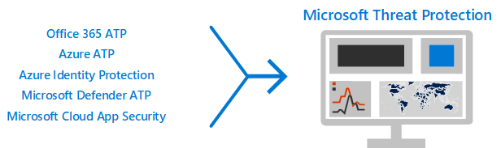

# 12 самых популярных задач по обеспечению безопасности Teams для поддержки работы из домаTop 12 tasks for security teams to support working from home

Если у вас есть [такие же](https://www.microsoft.com/microsoft-365/blog/2020/03/10/staying-productive-while-working-remotely-with-microsoft-teams/) , что и у вас есть непроизводительные домашние рабочие ресурсы, мы хотим помочь вам обеспечить максимально надежную работу Организации.If you are like [Microsoft](https://www.microsoft.com/microsoft-365/blog/2020/03/10/staying-productive-while-working-remotely-with-microsoft-teams/) and suddenly find yourself supporting a primarily home-based workforce, we want to help you ensure your organization is working as securely as possible. В этой статье определяются приоритеты задач, которые помогают Teams реализовать наиболее важные возможности обеспечения безопасности как можно быстрее.This article prioritizes tasks to help security teams implement the most important security capabilities as quickly as possible. 

Если у вас небольшая или средняя организация, использующая один из бизнес-планов корпорации Майкрософт, ознакомьтесь со следующими материалами:If you are a small or medium-size organization using one of Microsoft's business plans, see these resources instead:
- [10 основных способов защиты Office 365 и Microsoft 365 для бизнес-плановTop 10 ways to secure Office 365 and Microsoft 365 for business plans](../admin/security-and-compliance/secure-your-business-data.md) 
- [Microsoft 365 для кампаний](https://docs.microsoft.com/microsoft-365/campaigns/?view=o365-worldwide) (в том числе рекомендуемая конфигурация безопасности для Microsoft 365 бизнес)[Microsoft 365 for Campaigns](https://docs.microsoft.com/microsoft-365/campaigns/?view=o365-worldwide) (includes a recommended security configuration for Microsoft 365 Business)

  
Для клиентов, использующих наши планы предприятия, корпорация Майкрософт рекомендует выполнить задачи, перечисленные в приведенной ниже таблице, которые относятся к плану обслуживания.For customers using our enterprise plans, Microsoft recommends you complete the tasks listed in the following table that apply to your service plan. Если же не приобрести план Microsoft 365 корпоративный, вы собираетесь объединять подписки, обратите внимание на следующее:If, instead of purchasing a Microsoft 365 enterprise plan, you are combining subscriptions, note the following:
- Microsoft 365 E3 включает Enterprise Mobility + Security (EMS) E3 и Azure AD P1.Microsoft 365 E3 includes Enterprise Mobility + Security (EMS) E3 and Azure AD P1
- Microsoft 365, в том числе EMS и Azure AD P2Microsoft 365 E5 includes EMS E5 and Azure AD P2
  
||**Task****Task**| Все планы Office 365 для предприятийAll Office 365 Enterprise plans|**Microsoft 365 E3****Microsoft 365 E3** |**Microsoft 365 E5****Microsoft 365 E5**|
|:-----|:-----|:-----|:-----|:-----|
|1,11      |[Включение многофакторной проверки подлинности Azure (MFA)Enable Azure Multi-Factor Authentication (MFA)](#1-enable-azure-multi-factor-authentication-mfa)   |     |   |       | 
|22     | [Защита от угрозProtect against threats](#2-protect-against-threats) | |         |        | 
|43      |  [Настройка Office 365 Advanced Threat protectionConfigure Office 365 Advanced Threat Protection](#3-configure-office-365-advanced-threat-protection)  |   |      |       | 
|4 4      | [Настройка расширенной защиты от угроз Azure (ATP)Configure Azure Advanced Threat Protection (ATP)](#4-configure-azure-advanced-threat-protection)   |   |      |       | 
|5 5     |   [Включение расширенной защиты от угроз МайкрософтTurn on Microsoft Advanced Threat Protection](#5-turn-on-microsoft-advanced-threat-protection)  |  |      |       | 
|6 6      | [Настройка защиты мобильных приложений Intune для телефонов и планшетных ПКConfigure Intune mobile app protection for phones and tablets](#6-configure-intune-mobile-app-protection-for-phones-and-tablets) |    |         |         | 
|7 7     | [Настройка MFA и условный доступ для гостей, в том числе защита приложений IntuneConfigure MFA and conditional access for guests, including Intune app protection](#7-configure-mfa-and-conditional-access-for-guests-including-intune-mobile-app-protection)  |    |       |       | 
|8 8      |  [Регистрация компьютеров в управлении устройствами и потребовать соответствия требованиям компьютеровEnroll PCs into device management and require compliant PCs](#8-enroll-pcs-into-device-management-and-require-compliant-pcs)   |  |         |         | 
|9 9      | [Оптимизация сети для подключения к облакуOptimize your network for cloud connectivity](#9-optimize-your-network-for-cloud-connectivity)  |   |      |        | 
|10 10   | [Обучение пользователейTrain users](#10-train-users) |     |      |      | 
|11 11 |[Начало работы с Microsoft Cloud App SecurityGet started with Microsoft Cloud App Security](#11-get-started-with-microsoft-cloud-app-security) |   |   |   |
|12 12 |[Отслеживание угроз и выполнение действийMonitor for threats and take action](#12-monitor-for-threats-and-take-action) |   |  |  |
| | | |

   
Перед началом работы Проверьте правильность [оценки безопасности microsoft 365](https://docs.microsoft.com/microsoft-365/security/mtp/microsoft-secure-score) в центре безопасности Майкрософт 365.Before you begin, check your [Microsoft 365 Secure Score](https://docs.microsoft.com/microsoft-365/security/mtp/microsoft-secure-score) in the Microsoft 365 security center. С помощью централизованной панели мониторинга можно отслеживать и повышать безопасность удостоверений, данных, приложений, устройств и инфраструктуры Microsoft 365.From a centralized dashboard, you can monitor and improve the security for your Microsoft 365 identities, data, apps, devices, and infrastructure. Вы задаете точки для настройки рекомендуемых функций безопасности, выполнения задач, связанных с безопасностью (например, просмотр отчетов), или адресации рекомендаций с приложением или программным обеспечением стороннего производителя.You are given points for configuring recommended security features, performing security-related tasks (such as viewing reports), or addressing recommendations with a third-party application or software. Рекомендуемые задачи, описанные в этой статье, приведут к появлению оценки.The recommended tasks in this article will raise your score.
  

  
## 1: включение многофакторной проверки подлинности Azure (MFA)1: Enable Azure Multi-Factor Authentication (MFA)
Для улучшения безопасности сотрудников, работающих из дома, можно использовать для этого функцию MFA.The single best thing you can do to improve security for employees working from home is to turn on MFA. Если вы еще не настроили процессы, обработайте ее в качестве экстренного пилотного проекта и убедитесь, что у вас есть поддержка, позволяющая сотрудникам, которые зависает.If you don't already have processes in place, treat this as an emergency pilot and make sure you have support folks ready to help employees who get stuck. Так как вы, вероятно, не можете распространять аппаратные устройства защиты, используйте средства проверки подлинности Windows Hello и приложения проверки подлинности для смартфонов, напримерAs you probably can't distribute hardware security devices, use Windows Hello biometrics and smartphone authentication apps like Microsoft Authenticator.

Обычно Корпорация Майкрософт рекомендует предоставить пользователям 14 дней регистрацию своего устройства для многофакторной проверки подлинности перед требованием MFA.Normally, Microsoft recommends you give users 14 days to register their device for Multi-Factor Authentication before requiring MFA. Тем не менее, если ваши сотрудники неожиданно работают из дома, запросите в качестве приоритета для безопасности MFA и будьте готовы помочь пользователям, которым она необходима.However, if your workforce is suddenly working from home, go ahead and require MFA as a security priority and be prepared to help users who need it. 

Применение этих политик займет всего несколько минут, но будьте готовы к поддержке пользователей в течение следующих нескольких дней.Applying these policies will take only a few minutes, but be prepared to support your users over the next several days.  

|ПланPlan  |РекомендацияRecommendation  |
|---------|---------|
|Планы Microsoft 365 (без Azure AD P1 или P2)Microsoft 365 plans (without Azure AD P1 or P2)     |[Включение параметров безопасности по умолчанию в Azure AD](https://docs.microsoft.com/azure/active-directory/fundamentals/concept-fundamentals-security-defaults).[Enable Security defaults in Azure AD](https://docs.microsoft.com/azure/active-directory/fundamentals/concept-fundamentals-security-defaults). Параметры безопасности по умолчанию в Azure AD включают MFA для пользователей и администраторов.Security defaults in Azure AD include MFA for users and administrators.   |
|Microsoft 365 E3 (с Azure AD P1)Microsoft 365 E3 (with Azure AD P1)     | Используйте [Общие политики условного доступа](https://docs.microsoft.com/azure/active-directory/conditional-access/concept-conditional-access-policy-common) для настройки следующих политик:Use [Common Conditional Access policies](https://docs.microsoft.com/azure/active-directory/conditional-access/concept-conditional-access-policy-common) to configure the following policies:  - [Требовать использование MFA для администраторов](https://docs.microsoft.com/azure/active-directory/conditional-access/howto-conditional-access-policy-admin-mfa)- [Require MFA for administrators](https://docs.microsoft.com/azure/active-directory/conditional-access/howto-conditional-access-policy-admin-mfa)  - [Требовать указания MFA для всех пользователей](https://docs.microsoft.com/azure/active-directory/conditional-access/howto-conditional-access-policy-all-users-mfa)- [Require MFA for all users](https://docs.microsoft.com/azure/active-directory/conditional-access/howto-conditional-access-policy-all-users-mfa)   - [Блокировать устаревшую проверку подлинности](https://docs.microsoft.com/azure/active-directory/conditional-access/howto-conditional-access-policy-block-legacy)- [Block legacy authentication](https://docs.microsoft.com/azure/active-directory/conditional-access/howto-conditional-access-policy-block-legacy)       |
|Microsoft 365 (с Azure AD P2)Microsoft 365 E5 (with Azure AD P2)     | Используя преимущества защиты удостоверений Azure AD, начните реализовывать [рекомендуемый набор политик условного доступа и связанных с ними политик](../enterprise/identity-access-policies.md) , создавая следующие две политики:Taking advantage of Azure AD Identity Protection, begin to implement Microsoft's [recommended set of conditional access and related policies](../enterprise/identity-access-policies.md) by creating these two policies:  - [Требовать, чтобы риск входа в систему был средним или высоким](../enterprise/identity-access-policies.md#require-mfa-based-on-sign-in-risk)- [Require MFA when sign-in risk is medium or high](../enterprise/identity-access-policies.md#require-mfa-based-on-sign-in-risk)  - [Блокировка клиентов, не поддерживающих современные проверки подлинности](../enterprise/identity-access-policies.md#block-clients-that-dont-support-modern-authentication)- [Block clients that don't support modern authentication](../enterprise/identity-access-policies.md#block-clients-that-dont-support-modern-authentication) - [Высокий риск пользователи должны изменить пароль](../enterprise/identity-access-policies.md#high-risk-users-must-change-password)- [High risk users must change password](../enterprise/identity-access-policies.md#high-risk-users-must-change-password)       |
| | |

  
## 2: защита от угроз2: Protect against threats

Все планы Microsoft 365 включают различные функции защиты от угроз.All Microsoft 365 plans include a variety of threat protection features. Увеличить уровень защиты для этих функций занимает всего несколько минут.Bumping up protection for these features takes just a few minutes.
- Защита от вредоносных программAnti-malware protection
- Защита от вредоносных URL-адресов и файловProtection from malicious URLs and files
- Защита от фишингаAnti-phishing protection
- Защита от нежелательной почтыAnti-spam protection

В этой статье приведены сведения о [защите от угроз в Office 365](office-365-security/protect-against-threats.md) , которые можно использовать в качестве отправной точки.See [Protect against threats in Office 365](office-365-security/protect-against-threats.md) for guidance you can use as a starting point.
    

## 3: Настройка Office 365 Advanced Threat protection3: Configure Office 365 Advanced Threat Protection

Office 365 Advanced Threat protection (ATP), включенный в Microsoft 365 и Office 365, защищает организацию от вредоносных угроз, исносящихся к сообщениям электронной почты, ссылкам (URL-адресам) и средствам для совместной работы.Office 365 Advanced Threat Protection (ATP), included with Microsoft 365 E5 and Office 365 E5, safeguards your organization against malicious threats posed by email messages, links (URLs) and collaboration tools. Для настройки этого может потребоваться несколько часов.This can take several hours to configure.

Office 365 ATP:Office 365 ATP:
- Защищает организацию от неизвестных угроз электронной почты в режиме реального времени с помощью интеллектуальных систем, проверяющих вложения и ссылки на вредоносные материалы.Protects your organization from unknown email threats in real-time by using intelligent systems that inspect attachments and links for malicious content. Эти автоматизированные системы включают надежную платформу детонации, эвристику и машинные модели машинного обучения.These automated systems include a robust detonation platform, heuristics, and machine learning models. 
- Защищает организацию, когда пользователи совместно работают и совместно используют файлы, определяя и блокируя вредоносные файлы на сайтах групп и библиотеках документов.Protects your organization when users collaborate and share files, by identifying and blocking malicious files in team sites and document libraries. 
- Применяет модели машинного обучения и дополнительные алгоритмы обнаружения олицетворения для Аверт фишинговых атак.Applies machine learning models and advanced impersonation-detection algorithms to avert phishing attacks. 

Общие сведения о планах, в том числе о планах, представлены в статье [Office 365 Advanced Threat protection](office-365-security/office-365-atp.md).For an overview, including a summary of plans, see [Office 365 Advanced Threat Protection](office-365-security/office-365-atp.md).

Глобальный администратор может настроить эти параметры защиты:Your Global Administrator can configure these protections:
- [Настройка безопасных ссылок ATPSet up ATP Safe Links](office-365-security/set-up-atp-safe-links-policies.md)
- [Настройка политик безопасных вложений ATPSet up ATP Safe Attachments policies](office-365-security/set-up-atp-safe-attachments-policies.md)
- [Создание настраиваемого списка URL-адресов, не подлежащих переопределениюSet up a custom "do not rewrite" URLs list](office-365-security/set-up-a-custom-do-not-rewrite-urls-list-with-atp.md)
- [Создание настраиваемого списка блокируемых URL-адресовSet up a custom blocked URLs list](office-365-security/set-up-a-custom-blocked-urls-list-wtih-atp.md)

Для настройки ATP для этих рабочих нагрузок потребуется работать с администратором Exchange Online и администратором SharePoint Online:You'll need to work with your Exchange Online administrator and SharePoint Online administrator to configure ATP for these workloads:
- [Включение ATP для SharePoint, OneDrive и Microsoft TeamsTurn on ATP for SharePoint, OneDrive, and Microsoft Teams](office-365-security/turn-on-atp-for-spo-odb-and-teams.md)

## 4: Configure Advanced Threat Protection в Azure4: Configure Azure Advanced Threat Protection

Служба [Advanced Threat Protection в Azure](https://docs.microsoft.com/azure-advanced-threat-protection/what-is-atp) (Azure ATP) — это решение для обеспечения безопасности на основе облака, которое использует локальные сигналы Active Directory для определения, обнаружения и исследования сложных угроз, скомпрометированных удостоверений и действий по предварительной программе предварительной оценки, направленных в организацию.[Azure Advanced Threat Protection](https://docs.microsoft.com/azure-advanced-threat-protection/what-is-atp) (Azure ATP) is a cloud-based security solution that leverages your on-premises Active Directory signals to identify, detect, and investigate advanced threats, compromised identities, and malicious insider actions directed at your organization. Обратите внимание на следующее, так как она защищает локальную среду и облачную инфраструктуру, не имеет зависимостей и предварительных требований, а также может обеспечить немедленную пользу.Focus on this next because it protects your on-prem and your cloud infrastructure, has no dependencies or prerequisites, and can provide immediate benefit.

- Для быстрого получения программы установки ознакомьтесь с [краткими руководствами по Azure ATP](https://docs.microsoft.com/azure-advanced-threat-protection/install-atp-step1) .See [Azure ATP Quickstarts](https://docs.microsoft.com/azure-advanced-threat-protection/install-atp-step1) to get setup quickly 
- Посмотрите [видео: введение в Azure ATP](https://www.youtube.com/watch?reload=9&v=EGY2m8yU_KE)Watch [Video: Introduction to Azure ATP](https://www.youtube.com/watch?reload=9&v=EGY2m8yU_KE)
- Ознакомьтесь с [тремя этапами развертывания Azure ATP](https://docs.microsoft.com/azure-advanced-threat-protection/what-is-atp#whats-next)Review the [three phases of Azure ATP deployment](https://docs.microsoft.com/azure-advanced-threat-protection/what-is-atp#whats-next)

## 5: Включение расширенной защиты от угроз Майкрософт5: Turn on Microsoft Advanced Threat Protection

Теперь, когда у вас настроен Office 365 ATP и Azure ATP, вы можете просмотреть Объединенные сигналы из этих возможностей на одной панели мониторинга.Now that you have Office 365 ATP and Azure ATP configured, you can view the combined signals from these capabilities in one dashboard. [Microsoft Threat protection](https://docs.microsoft.com/microsoft-365/security/mtp/microsoft-threat-protection) (MTP) объединяет оповещения, происшествия, автоматическое исследование и отклики, а также расширенные возможности Поиск в рабочих нагрузках (Azure ATP, Office 365 ATP, Microsoft Defender ATP и Microsoft Cloud App Security) в одну область по адресу [Security.Microsoft.com](https://security.microsoft.com).[Microsoft Threat Protection](https://docs.microsoft.com/microsoft-365/security/mtp/microsoft-threat-protection) (MTP) brings together alerts, incidents, automated investigation and response, and advanced hunting across workloads (Azure ATP, Office 365 ATP, Microsoft Defender ATP, and Microsoft Cloud App Security) into a single pane at [security.microsoft.com](https://security.microsoft.com). 
 

  
После того как вы настроили одну или несколько служб Advanced Threat Protection, включите MTP.After you have configured one or more of your advanced threat protection services, turn on MTP. Новые функции постоянно добавляются в MTP; Рассмотрите возможность принимать функции предварительного просмотра.New features are added continually to MTP; consider opting in to receive preview features.

- [Дополнительные сведения о MTPLearn more about MTP](https://docs.microsoft.com/microsoft-365/security/mtp/microsoft-threat-protection?view=o365-worldwide)
- [Включение MTPTurn on MTP](https://docs.microsoft.com/microsoft-365/security/mtp/mtp-enable?view=o365-worldwide)
- [Необязательное для предварительной версии функцииOpt in for preview features](https://docs.microsoft.com/microsoft-365/security/mtp/preview?view=o365-worldwide)

## 6: Настройка защиты мобильных приложений Intune для телефонов и планшетных ПК6: Configure Intune mobile app protection for phones and tablets

Управление мобильными приложениями Microsoft Intune (MAM) позволяет управлять и защищать данные Организации на телефонах и планшетах, не управляя этими устройствами.Microsoft Intune Mobile Application Management (MAM) allows you to manage and protect your organization's data on phones and tablets without managing these devices. Вот как это работает:Here's how it works:
- Вы создаете политику защиты приложений (APP), которая определяет, какие приложения на устройстве управляются и какие варианты поведения разрешены (например, запрещает копирование данных из управляемого приложения в неуправляемое приложение).You create an App Protection Policy (APP) that determines which apps on a device are managed and what behaviors are allowed (such as preventing data from a managed app from being copied to an unmanaged app). Вы создаете одну политику для каждого платорм (iOS, Android).You create one policy for each platorm (iOS, Android).
- После создания политик защиты приложений их необходимо создать, создав правило условного доступа в Azure AD, чтобы потребовать утвержденные приложения и защиту данных приложений.After creating the app protection policies, you enforce these by creating a conditional access rule in Azure AD to require approved apps and APP data protection.

Политики защиты приложений включают множество параметров.APP protection policies include many settings. К счастью, вам не нужно изучать каждый параметр и взвесить параметры.Fortunately, you don't need to learn about every setting and weigh the options. Корпорация Майкрософт упрощает применение конфигурации параметров, предрекомендую отправку точек.Microsoft makes it easy to apply a configuration of settings by recommending starting points. [Платформа защиты данных, использующая политики защиты приложений](https://docs.microsoft.com/mem/intune/apps/app-protection-framework) , включает три уровня, которые можно выбрать.The [Data protection framework using app protection policies](https://docs.microsoft.com/mem/intune/apps/app-protection-framework) includes three levels you can choose from. 

Кроме того, корпорация Майкрософт координирует эту платформу защиты приложений с помощью набора условного доступа и политик, которые мы рекомендуем использовать в качестве отправной точки.Even better, Microsoft coordinates this app protection framework with a set of conditional access and related policies we recommend all organizations use as a starting point. Если вы реализовали MFA с помощью рекомендаций, приведенных в этой статье, вы в половинум пути.If you've implemented MFA using the guidance in this article, you're half way there!

Чтобы настроить защиту мобильных приложений, воспользуйтесь рекомендациями в разделе [Общие политики идентификации и доступа к устройствам](../enterprise/identity-access-policies.md):To configure mobile app protection, use the guidance in [Common identity and device access policies](../enterprise/identity-access-policies.md):
 1. Используйте руководство по [применению политик защиты данных приложений](../enterprise/identity-access-policies.md#apply-app-data-protection-policies) для создания политик для iOS и Android.Use the [Apply APP data protection policies](../enterprise/identity-access-policies.md#apply-app-data-protection-policies) guidance to create policies for iOS and Android. Уровень 2 (Расширенная защита данных) рекомендуется для базовой защиты.Level 2 (enhanced data protection) is recommended for baseline protection. 
 2. Создайте правило условного доступа, чтобы [потребовать утвержденные приложения и защиту приложений](../enterprise/identity-access-policies.md#require-approved-apps-and-app-protection).Create a conditional access rule to [Require approved apps and APP protection](../enterprise/identity-access-policies.md#require-approved-apps-and-app-protection). 

## 7: Настройка MFA и условный доступ для гостей, в том числе для защиты мобильных приложений Intune7: Configure MFA and conditional access for guests, including Intune mobile app protection

Теперь убедитесь, что вы можете продолжать совместно работать с гостями и работать с ними.Next, let's ensure you can continue to collaborate and work with guests. Если вы используете план Microsoft 365 E3 и вы реализовали MFA для всех пользователей, вы настроили MFA.If you're using the Microsoft 365 E3 plan and you implemented MFA for all users, you're set. 

Если вы используете план Microsoft 365, а вы используете преимущества Azure Identity Protection для MFA, основанного на рисках, вам нужно выполнить ряд корректировок (так как защита удостоверения Azure AD не распространяется на гости):If you're using the Microsoft 365 E5 plan and you're taking advantage of Azure Identity Protection for risk-based MFA, you need to make a couple of adjustments (because Azure AD Identity protection doesn't extend to guests):
- Создайте новое правило условного доступа, чтобы в MFA всегда применялись гости и внешние пользователи.Create a new conditional access rule to require MFA always for guests and external users.
- Обновите правило условного доступа на основе риска, чтобы исключить гостей и внешних пользователей.Update the risk-based MFA conditional access rule to exclude guests and external users.

Воспользуйтесь рекомендациями по [обновлению общих политик, чтобы разрешить и защитить гостевой и внешний доступ](../enterprise/identity-access-policies-guest-access.md) , чтобы узнать, как гостевой доступ работает с Azure AD, и как обновить соответствующие политики.Use the guidance in [Updating the common policies to allow and protect guest and external access](../enterprise/identity-access-policies-guest-access.md) to understand how guest access works with Azure AD and to update the affected policies. 

Созданные политики защиты мобильных приложений Intune, вместе с правилом условного доступа, потребуют утвержденных приложений и защиту приложений, применяются к учетным записям гостей и помогут защитить данные Организации.The Intune mobile app protection policies you created, together with the conditional access rule to require approved apps and APP protection, apply to guests accounts and will help protect your organization data. 

**Примечание**. Если вы уже зарегистрировали компьютеры в управлении устройствами, чтобы потребовать соответствия требованиям компьютеров, вам также потребуется исключить гостевые учетные записи из правила условного доступа, которое применяет соответствие требованиям к устройствам.**Note**: If you've already enrolled PCs into device management to require compliant PCs, you'll also need to exclude guest accounts from the conditional access rule that enforces device compliance. 

## 8: регистрация компьютеров в управлении устройствами и потребовать соответствия требованиям компьютеров8: Enroll PCs into device management and require compliant PCs

Существует несколько способов регистрации устройств сотрудников.There are several methods to enroll your workforce's devices. Каждый способ зависит от типа владения устройством (личное или корпоративное), типа устройства (iOS, Windows, Android) и требований к управлению (сброс, сопоставление, блокировка).Each method depends on the device's ownership (personal or corporate), device type (iOS, Windows, Android), and management requirements (resets, affinity, locking). Для этого может потребоваться немного времени. См.: [Регистрация устройств в Microsoft Intune](https://docs.microsoft.com/mem/intune/enrollment/).This can take a bit of time to sort out. See: [Enroll devices in Microsoft Intune](https://docs.microsoft.com/mem/intune/enrollment/). 

Самый быстрый способ [настроить автоматическую регистрацию для устройств с Windows 10](https://docs.microsoft.com/mem/intune/enrollment/quickstart-setup-auto-enrollment).The quickest way to get going is to [Set up automatic enrollment for Windows 10 devices](https://docs.microsoft.com/mem/intune/enrollment/quickstart-setup-auto-enrollment). 

Кроме того, вы можете воспользоваться следующими учебными курсами:You can also take advantage of these tutorials:
- [Использование автопилота для регистрации устройств Windows в IntuneUse Autopilot to enroll Windows devices in Intune](https://docs.microsoft.com/mem/intune/enrollment/tutorial-use-autopilot-enroll-devices)
- [Использование функций регистрации корпоративных устройств Apple в Apple Business Manager (АБМ) для регистрации устройств iOS/Ипадос в IntuneUse Apple's Corporate Device Enrollment features in Apple Business Manager (ABM) to enroll iOS/iPadOS devices in Intune](https://docs.microsoft.com/mem/intune/enrollment/tutorial-use-device-enrollment-program-enroll-ios)

После регистрации устройств используйте рекомендации в разделе [Общие удостоверения и политики доступа к устройствам](../enterprise/identity-access-policies.md) для создания этих политик:After enrolling devices, use the guidance in [Common identity and device access policies](../enterprise/identity-access-policies.md) to create these policies:
- [Определение политик соответствия требованиям устройств](../enterprise/identity-access-policies.md#define-device-compliance-policies) — Рекомендуемые параметры для Windows 10 включают защиту от вирусов.[Define device-compliance policies](../enterprise/identity-access-policies.md#define-device-compliance-policies) — The recommended settings for Windows 10 include requiring antivirus protection. Если у вас есть Microsoft 365, используйте Advanced Threat Protection в защитнике Майкрософт для мониторинга работоспособности устройств сотрудников.If you have Microsoft 365 E5, use Microsoft Defender Advanced Threat Protection to monitor the health of employee devices. Убедитесь, что политики соответствия требованиям для других операционных систем включают антивирусную защиту и программное обеспечение для защиты от других точек.Be sure compliance policies for other operating systems include antivirus protection and end-point protection software. 
- [Требовать соответствия требованиям для компьютеров](../enterprise/identity-access-policies.md#require-compliant-pcs-but-not-compliant-phones-and-tablets) — это правило условного доступа в Azure AD, которое применяет политики соответствия требованиям к устройствам.[Require compliant PCs](../enterprise/identity-access-policies.md#require-compliant-pcs-but-not-compliant-phones-and-tablets) — This is the conditional access rule in Azure AD that enforces the device compliance policies.

Только одна организация может управлять устройством, поэтому обязательно исключите учетные записи гостя из правила условного доступа в Azure AD.Only one organization can manage a device, so be sure to exclude guest accounts from the conditional access rule in Azure AD. Если вы не исключите гостевые и внешние пользователи из политик, требующих соответствия требованиям к устройствам, эти политики будут блокировать этих пользователей.If you don't exclude guest and external users from policies that require device compliance, these policies will block these users. Для получения дополнительных сведений см раздел [обновление общих политик для разрешения и защиты гостевого и внешнего доступа](../enterprise/identity-access-policies-guest-access.md).For more information, see [Updating the common policies to allow and protect guest and external access](../enterprise/identity-access-policies-guest-access.md).

## 9: Оптимизируйте сеть для облачного подключения9: Optimize your network for cloud connectivity

Если вы быстро включаете массу сотрудников для работы из дома, этот неожиданный выбор шаблонов подключения может существенно повлиять на корпоративную корпоративную инфраструктуру.If you are rapidly enabling the bulk of your employees to work from from home, this sudden switch of connectivity patterns can have a significant impact on the corporate network infrastructure. Многие сети были масштабированы и разработаны до того, как облачные службы были приняты.Many networks were scaled and designed before cloud services were adopted. Во многих случаях сети являются нечувствительными к удаленным рабочим работникам, но не предназначены для удаленного использования всеми пользователями одновременно.In many cases, networks are tolerant of remote workers, but were not designed to be used remotely by all users simultaneously.

Сетевые элементы, такие как концентраторы VPN, Центральная сеть исходящего трафика (например, прокси-серверы и устройства защиты от потери данных), Центральная пропускная способность в Интернете, цепи обратной связи, возможность преобразования сетевых адресов (NAT) и т. д. будут неожиданно помещаться на огромную нагрузку из-за нагрузки всего бизнеса.Network elements such as VPN concentrators, central network egress equipment (such as proxies and data loss prevention devices), central internet bandwidth, backhaul MPLS circuits, NAT capability and so on are suddenly put under enormous strain due to the load of the entire business using them. Конечный результат низкой производительности и продуктивности связан с неудовлетворительным пользовательским интерфейсом для пользователей, которые адаптируются к работе из дома.The end result is poor performance and productivity coupled with a poor user experience for users who are adapting to working from home.

Некоторые из них, обычно предоставляемые маршрутным трафиком через корпоративную сеть, предоставляются облачными приложениями, к которым пользователи обращаются.Some of the protections that have traditionally been provided by routing traffic back through a corporate network are provided by the cloud apps your users are accessing. Если вы выполнили это действие, описанные в этой статье, вы реализовали набор сложных средств обеспечения безопасности в облаке для служб и данных Microsoft 365.If you've reached this step in this article, you've implemented a set of sophisticated cloud security controls for Microsoft 365 services and data. С помощью этих элементов управления вы можете напрямую маршрутизировать трафик удаленных пользователей к Office 365.With these controls in place, you may be ready to route remote users' traffic directly to Office 365. Если вам по-прежнему требуется ссылка VPN для доступа к другим приложениям, вы можете значительно улучшить производительность и удобство работы пользователей, реализовав раздельное туннелирование.If you still require a VPN link for access to other applications, you can greatly improve your performance and user experience by implementing split tunneling. Когда вы будете достигать соглашение в оганизатион, это можно сделать в течение дня с помощью хорошо согласованной команды сети.Once you achieve agreement in your oganization, this can be accomplished within a day by a well-coordinated network team.

Дополнительные сведения можно найти в разделе материалы по документам:See these resources on Docs for more information:
- [Обзор: Оптимизация подключения для удаленных пользователей с помощью туннеллинг разделенных VPNOverview: Optimize connectivity for remote users using VPN split tunnelling](https://docs.microsoft.com/Office365/Enterprise/office-365-vpn-split-tunnel)
- [Внедрение раздельного VPN-туннелирования для Office 365Implementing VPN split tunnelling for Office 365](https://docs.microsoft.com/Office365/Enterprise/office-365-vpn-implement-split-tunnel)

Последние статьи блогов, приведенные в этой статье:Recent blog articles on this topic:
- [Быстрая оптимизация трафика для удаленных сотрудников & снижения нагрузки на инфраструктуруHow to quickly optimize traffic for remote staff & reduce the load on your infrastructure](https://techcommunity.microsoft.com/t5/office-365-blog/how-to-quickly-optimize-office-365-traffic-for-remote-staff-amp/ba-p/1214571#)
- [Альтернативные способы для специалистов по безопасности и обеспечения современного контроля безопасности в современных уникальных сценариев удаленной работыAlternative ways for security professionals and IT to achieve modern security controls in today's unique remote work scenarios](https://www.microsoft.com/security/blog/2020/03/26/alternative-security-professionals-it-achieve-modern-security-controls-todays-unique-remote-work-scenarios/)

## 10: обучение пользователей10: Train users

Обучающие пользователи могут сохранять недовольство пользователей и группы операций по обеспечению безопасности.Training users can save your users and security operations team a lot of time and frustration. Пользователям с техническим уровнем вероятности рекомендуется открывать вложения или щелкать ссылки в сообщениях электронной почты, которые чаще всего не допускают подозрительных веб-сайтов.Savvy users are less likely to open attachments or click links in questionable email messages, and they are more likely to avoid suspicious websites. 

В [справочнике](https://go.microsoft.com/fwlink/?linkid=2015598&amp;clcid=0x409) по Харвард Кеннеди School циберсекурити содержатся отличные рекомендации по созданию строгой культуры осведомленности в Организации, в том числе учебные пользователи для определения фишинговых атак.The Harvard Kennedy School [Cybersecurity Campaign Handbook](https://go.microsoft.com/fwlink/?linkid=2015598&amp;clcid=0x409) provides excellent guidance on establishing a strong culture of security awareness within your organization, including training users to identify phishing attacks. 

Microsoft 365 предоставляет следующие материалы для информирования пользователей организации:Microsoft 365 provides the following resources to help inform users in your organization:

|КонцепцияConcept  |РесурсыResources  |
|---------|---------|
|Microsoft 365Microsoft 365     |[Настраиваемые пути обученияCustomizable learning pathways](https://docs.microsoft.com/office365/customlearning/) 
Эти ресурсы помогут вам объединить учебные курсы для конечных пользователей в Организации.These resources can help you put together training for end users in your organization        |
|Безопасность Microsoft 365Microsoft 365 security |[Модуль обучения: Защитите свою организацию с помощью встроенной, интеллектуальной системы безопасности от Microsoft 365Learning module: Secure your organization with built-in, intelligent security from Microsoft 365](https://docs.microsoft.com/learn/modules/security-with-microsoft-365) 
Этот модуль позволяет описать принципы взаимодействия функций безопасности Microsoft 365 и преимущества этих функций безопасности.This module enables you to describe how Microsoft 365 security features work together and to articulate the benefits of these security features. |
|Многофакторная проверка подлинностиMulti-factor authentication     | [Две этапа проверки: что такое дополнительная страница проверки?Two-step verification: What is the additional verification page?](https://docs.microsoft.com/azure/active-directory/user-help/multi-factor-authentication-end-user-first-time) 
Эта статья поможет пользователям определить многофакторную проверку подлинности и ее использование в вашей организации.This article helps end users understand what multi-factor authentication is and why it's being used at your organization.    |
| | |

В дополнение к этим рекомендациям Корпорация Майкрософт рекомендует выполнять действия, описанные в этой статье: [Защитите свою учетную запись и устройства от хакеров и вредоносных программ](https://support.office.com/article/066d6216-a56b-4f90-9af3-b3a1e9a327d6.aspx).In addition to this guidance, Microsoft recommends that your users take the actions described in this article: [Protect your account and devices from hackers and malware](https://support.office.com/article/066d6216-a56b-4f90-9af3-b3a1e9a327d6.aspx). Сюда входят следующие действия:These actions include:
  
- Использование надежных паролейUsing strong passwords
    
- Защита устройствProtecting devices 
    
- Включение функций безопасности на компьютерах с Windows 10 и Mac (для неуправляемых устройств)Enabling security features on Windows 10 and Mac PCs (for unmanaged devices)
    
Кроме того, корпорация Майкрософт рекомендует пользователям защищать свои личные учетные записи электронной почты, выполнив действия, Рекомендуемые в следующих статьях:Microsoft also recommends that users protect their personal email accounts by taking the actions recommended in the following articles:
  
- [Защитите свою учетную запись электронной почты Outlook.comHelp protect your Outlook.com email account](https://support.office.com/article/a4f20fc5-4307-4ece-8231-6d4d4bd8a9ba.aspx)
    
- [Защита учетной записи Gmail с помощью 2 шаговой проверкиProtect your Gmail account with 2-step verification](https://go.microsoft.com/fwlink/?linkid=2015688&amp;clcid=0x409)

## 11: Начало работы с Microsoft Cloud App Security11: Get started with Microsoft Cloud App Security

[Microsoft Cloud App Security](https://docs.microsoft.com/cloud-app-security) обеспечивает широкие возможности просмотра и управления путешествием данных, а также интеллектуальную аналитику для выявления и борьбы киберугрозами среди всех облачных служб.[Microsoft Cloud App Security](https://docs.microsoft.com/cloud-app-security) provides rich visibility, control over data travel, and sophisticated analytics to identify and combat cyberthreats across all your cloud services. Когда вы приступите к работе с Cloud App Security, политики обнаружения аномалий автоматически включаются, но для безопасности облачных приложений предусмотрен начальный период обучения в семь дней, в течение которого вызываются не все оповещения обнаружения аномалий.Once you get started with Cloud App Security, anomaly detection policies are automatically enabled, but Cloud App Security has an initial learning period of seven days during which not all anomaly detection alerts are raised.

Приступая к работе с Cloud App Security теперь.Get started with Cloud App Security now. Позже можно настроить более сложный мониторинг и элементы управления.Later you can set up more sophisticated monitoring and controls.

- [Краткое руководство: Начало работы с Cloud App SecurityQuickstart: Get started with Cloud App Security](https://docs.microsoft.com/cloud-app-security/getting-started-with-cloud-app-security)
- [Получение мгновенного анализа поведения и обнаружения аномалийGet instantaneous behavioral analytics and anomaly detection](https://docs.microsoft.com/cloud-app-security/anomaly-detection-policy)
- [Дополнительные сведения о Microsoft Cloud App SecurityLearn more about Microsoft Cloud App Security](https://docs.microsoft.com/cloud-app-security/what-is-cloud-app-security)
- [Обзор новых функций и возможностейReview new features and capabilities](https://docs.microsoft.com/cloud-app-security/release-notes)
- [Сведения о базовых инструкциях по настройкеSee basic setup instructions](https://docs.microsoft.com/cloud-app-security/general-setup)

## 12: мониторинг для угроз и выполнение действий12: Monitor for threats and take action

Microsoft 365 включает несколько способов отслеживания состояния и выполнения соответствующих действий.Microsoft 365 includes several ways to monitor status and take appropriate actions. Лучший отправную точку является центр безопасности Microsoft 365 ([https://security.microsoft.com](https://security.microsoft.com)), на котором можно просматривать [оценку безопасности Майкрософт](https://docs.microsoft.com/microsoft-365/security/mtp/microsoft-secure-score?view=o365-worldwide)и любые оповещения или сущности, требующие вашего внимания.Your best starting point is the Microsoft 365 security center ([https://security.microsoft.com](https://security.microsoft.com)), where you can view your organization's [Microsoft Secure Score](https://docs.microsoft.com/microsoft-365/security/mtp/microsoft-secure-score?view=o365-worldwide), and any alerts or entities that require your attention.

- [Начало работы с центром безопасности Microsoft 365Get started with the Microsoft 365 security center](https://docs.microsoft.com/microsoft-365/security/mtp/overview-security-center?view=o365-worldwide)
- [Мониторинг и просмотр отчетовMonitor and view reports](https://docs.microsoft.com/microsoft-365/security/mtp/monitoring-and-reporting?view=o365-worldwide)
- [Посетите порталы безопасности в Microsoft 365See the security portals in Microsoft 365](https://docs.microsoft.com/microsoft-365/security/mtp/portals)

## Дальнейшие действияNext steps

Поздравляем!Congratulations! Вы быстро применили некоторые наиболее важные средства защиты системы безопасности, и ваша организация гораздо более безопасна.You have quickly implemented some of the most important security protections and your organization is much more secure. Теперь вы готовы к работе с функциями защиты от угроз (включая Advanced Threat protection), классификации данных и возможности защиты, а также для защиты учетных записей администраторов.Now you're ready to go even further with threat protection capabilities (including Microsoft Defender Advanced Threat Protection), data classification and protection capabilities, and securing administrative accounts. Подробнее о методичному наборе рекомендаций по обеспечению безопасности для Microsoft 365 можно узнать в [статье безопасность microsoft 365 для лиц, принимающих решения компании (вариантах развертывания)](Microsoft-365-security-for-bdm.md).For a deeper, methodical set of security recommendations for Microsoft 365, see [Microsoft 365 Security for Business Decision Makers (BDMs)](Microsoft-365-security-for-bdm.md). 

Кроме того, посетите новый центр обеспечения безопасности Майкрософт на [docs.Microsoft.com/Security](https://docs.microsoft.com/security).Also visit Microsoft's new security center on [docs.microsoft.com/security](https://docs.microsoft.com/security). 
